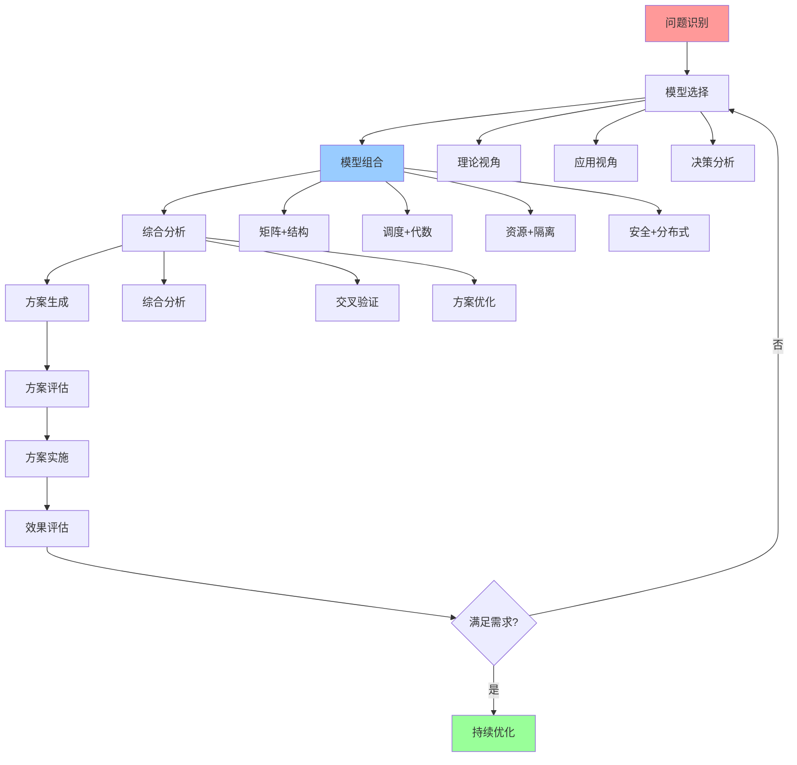
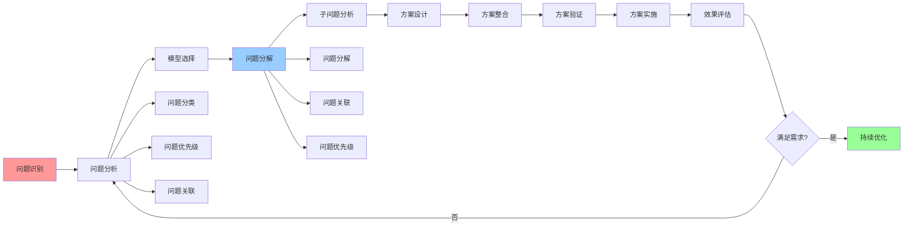

# 认知模型进阶应用

## 📑 目录

- [认知模型进阶应用](#认知模型进阶应用)
  - [📑 目录](#-目录)
  - [1 多模型组合应用](#1-多模型组合应用)
  - [2 复杂场景分析](#2-复杂场景分析)
  - [3 系统性问题解决](#3-系统性问题解决)
  - [4 技术演进预测](#4-技术演进预测)

---

## 1 多模型组合应用

---

## 2 复杂场景分析

| 场景类型 | 分析模型 | 分析方法 | 预期效果 | 复杂度 | 推荐度 |
|---------|---------|---------|---------|--------|--------|
| **大规模系统** | 结构视角+分布式模型 | 结构分析+分布式分析 | 系统架构优化 | 高 | ⭐⭐⭐⭐⭐ |
| **高性能系统** | 调度视角+资源模型 | 调度分析+资源分析 | 性能优化 | 高 | ⭐⭐⭐⭐⭐ |
| **安全关键系统** | 安全模型+形式化理论 | 安全分析+形式化验证 | 安全保障 | 极高 | ⭐⭐⭐⭐⭐ |
| **复杂业务系统** | 应用业务架构+决策分析 | 业务分析+决策分析 | 业务价值优化 | 高 | ⭐⭐⭐⭐ |
| **技术选型** | 矩阵视角+技术选型框架 | 矩阵分析+选型分析 | 科学选型 | 中 | ⭐⭐⭐⭐⭐ |
| **架构演进** | 结构视角+演进路径 | 结构分析+演进分析 | 架构演进优化 | 高 | ⭐⭐⭐⭐ |

**推荐度说明**：

- **⭐⭐⭐⭐⭐**：强烈推荐
- **⭐⭐⭐⭐**：推荐
- **⭐⭐⭐**：可选

---

## 3 系统性问题解决

---

## 4 技术演进预测

| 预测维度 | 预测模型 | 预测方法 | 预测准确度 | 推荐度 |
|---------|---------|---------|-----------|--------|
| **技术趋势** | 演进路径+矩阵视角 | 演进分析+趋势分析 | 中 | ⭐⭐⭐⭐ |
| **架构演进** | 结构视角+演进路径 | 结构分析+演进分析 | 中 | ⭐⭐⭐⭐ |
| **技术选型** | 矩阵视角+技术选型框架 | 矩阵分析+选型分析 | 高 | ⭐⭐⭐⭐⭐ |
| **性能演进** | 调度视角+性能基准 | 调度分析+性能分析 | 中 | ⭐⭐⭐⭐ |
| **安全演进** | 安全模型+安全趋势 | 安全分析+趋势分析 | 中 | ⭐⭐⭐⭐ |

**推荐度说明**：

- **⭐⭐⭐⭐⭐**：强烈推荐
- **⭐⭐⭐⭐**：推荐
- **⭐⭐⭐**：可选

---

## 5 进阶应用检查清单

| 检查项 | 检查内容 | 重要性 | 推荐度 |
|--------|---------|--------|--------|
| **问题识别** | 问题完整、问题分类、问题优先级 | 极高 | ⭐⭐⭐⭐⭐ |
| **模型选择** | 模型评估、模型组合、模型验证 | 高 | ⭐⭐⭐⭐⭐ |
| **问题分解** | 问题分解、问题关联、问题优先级 | 高 | ⭐⭐⭐⭐⭐ |
| **综合分析** | 综合分析、交叉验证、方案优化 | 高 | ⭐⭐⭐⭐⭐ |
| **方案实施** | 方案实施、效果评估、持续优化 | 中 | ⭐⭐⭐⭐ |

**推荐度说明**：

- **⭐⭐⭐⭐⭐**：强烈推荐
- **⭐⭐⭐⭐**：推荐
- **⭐⭐⭐**：可选

---

## 6 进阶应用详细说明

### 6.1 多模型组合应用详细说明

#### 6.1.1 模型组合策略

**组合方式**：

- **互补组合**：选择互补的模型进行组合，发挥每个模型的优势
- **层次组合**：按照层次进行组合，从理论到实践，从分析到决策
- **迭代组合**：根据分析结果迭代调整模型组合

**组合原则**：

- **问题导向**：根据问题类型选择合适的模型组合
- **优势互补**：选择互补的模型发挥各自优势
- **复杂度控制**：控制模型组合的复杂度，避免过度复杂

**推荐度**：⭐⭐⭐⭐⭐

#### 6.1.2 综合分析流程

**流程步骤**：

1. **模型应用**：分别应用各个模型进行分析
2. **结果收集**：收集各个模型的分析结果
3. **结果整合**：整合不同模型的分析结果
4. **交叉验证**：使用不同模型的结果进行交叉验证
5. **方案优化**：基于综合分析结果优化方案

**分析方法**：

- **结果整合**：整合不同模型的分析结果
- **交叉验证**：使用不同模型的结果进行交叉验证
- **方案优化**：基于综合分析结果优化方案

**推荐度**：⭐⭐⭐⭐⭐

---

### 6.2 复杂场景分析详细说明

#### 6.2.1 大规模系统分析

**分析模型**：结构视角 + 分布式模型

**分析方法**：

- **结构分析**：使用结构视角分析大规模系统的计算、控制、信息结构
- **分布式分析**：使用分布式模型分析大规模系统的分布式特性
- **综合分析**：综合结构分析和分布式分析的结果

**分析工具**：

- 结构分析工具：结构框架、结构图
- 分布式分析工具：CAP理论、一致性模型

**预期效果**：全面理解大规模系统的架构和特性，优化系统设计

**推荐度**：⭐⭐⭐⭐⭐

#### 6.2.2 高性能系统分析

**分析模型**：调度视角 + 资源模型

**分析方法**：

- **调度分析**：使用调度视角分析高性能系统的调度特性
- **资源分析**：使用资源模型分析高性能系统的资源需求
- **综合分析**：综合调度分析和资源分析的结果

**分析工具**：

- 调度分析工具：调度模型、性能分析
- 资源分析工具：资源模型、资源优化

**预期效果**：全面理解高性能系统的调度和资源特性，优化系统性能

**推荐度**：⭐⭐⭐⭐⭐

#### 6.2.3 安全关键系统分析

**分析模型**：安全模型 + 形式化理论视角

**分析方法**：

- **安全分析**：使用安全模型分析安全关键系统的安全需求
- **形式化验证**：使用形式化理论视角进行系统验证
- **综合分析**：综合安全分析和形式化验证的结果

**分析工具**：

- 安全分析工具：安全模型、安全策略
- 形式化验证工具：时序逻辑、模型检验

**预期效果**：全面理解安全关键系统的安全需求，确保系统安全

**推荐度**：⭐⭐⭐⭐⭐

---

### 6.3 系统性问题解决详细说明

#### 6.3.1 问题分解

**分解方法**：

- **问题分类**：将系统性问题分解为多个子问题
- **问题关联**：分析子问题之间的关联关系
- **问题优先级**：确定子问题的优先级

**分解工具**：

- 问题分类工具：问题解决方案矩阵
- 问题关联工具：关系图谱、依赖图

**推荐度**：⭐⭐⭐⭐⭐

#### 6.3.2 子问题分析

**分析方法**：

- **子问题识别**：识别每个子问题的本质和范围
- **模型选择**：为每个子问题选择合适的模型
- **问题分析**：使用选择的模型分析子问题

**分析工具**：

- 模型选择工具：模型评估矩阵
- 问题分析工具：各类认知模型

**推荐度**：⭐⭐⭐⭐⭐

#### 6.3.3 方案整合

**整合方法**：

- **方案收集**：收集各个子问题的解决方案
- **方案整合**：整合各个子问题的解决方案
- **方案验证**：验证整合后的方案的有效性

**整合工具**：

- 方案整合工具：方案整合框架
- 方案验证工具：方案验证方法

**推荐度**：⭐⭐⭐⭐⭐

---

### 6.4 技术演进预测详细说明

#### 6.4.1 技术趋势预测

**预测模型**：演进路径 + 矩阵视角

**预测方法**：

- **演进分析**：使用演进路径分析技术演进的历史和趋势
- **趋势分析**：使用矩阵视角分析技术趋势
- **综合预测**：综合演进分析和趋势分析的结果

**预测工具**：

- 演进分析工具：演进路径图、时间轴
- 趋势分析工具：矩阵分析、趋势图

**预期效果**：预测技术发展趋势，指导技术选型

**推荐度**：⭐⭐⭐⭐

#### 6.4.2 架构演进预测

**预测模型**：结构视角 + 演进路径

**预测方法**：

- **结构分析**：使用结构视角分析架构结构的演进方向
- **演进分析**：使用演进路径分析架构演进的历史和趋势
- **综合预测**：综合结构分析和演进分析的结果

**预测工具**：

- 结构分析工具：结构框架、结构图
- 演进分析工具：演进路径图、架构演进图

**预期效果**：预测架构演进方向，指导架构设计

**推荐度**：⭐⭐⭐⭐

---

## 7 进阶应用实践案例

### 7.1 案例1：大规模分布式系统架构设计

**场景**：设计大规模分布式系统架构

**应用模型**：结构视角 + 分布式模型 + 安全模型

**应用流程**：

1. **结构分析**：使用结构视角分析大规模分布式系统的计算、控制、信息结构
2. **分布式分析**：使用分布式模型分析分布式系统的一致性和可用性
3. **安全分析**：使用安全模型分析系统的安全需求
4. **综合分析**：综合结构分析、分布式分析、安全分析的结果
5. **架构设计**：基于综合分析结果设计架构方案
6. **架构验证**：验证架构方案的有效性

**效果**：成功设计大规模分布式系统架构，平衡性能、一致性、可用性、安全性

**推荐度**：⭐⭐⭐⭐⭐

### 7.2 案例2：高性能系统性能优化

**场景**：优化高性能系统性能

**应用模型**：调度视角 + 资源模型 + 矩阵视角

**应用流程**：

1. **调度分析**：使用调度视角分析高性能系统的调度瓶颈
2. **资源分析**：使用资源模型分析高性能系统的资源需求
3. **方案对比**：使用矩阵视角对比不同优化方案
4. **综合分析**：综合调度分析、资源分析、方案对比的结果
5. **优化设计**：基于综合分析结果设计优化方案
6. **效果评估**：评估优化方案的效果

**效果**：成功优化高性能系统性能，性能提升明显

**推荐度**：⭐⭐⭐⭐⭐

### 7.3 案例3：安全关键系统安全设计

**场景**：设计安全关键系统安全方案

**应用模型**：安全模型 + 形式化理论视角 + 隔离模型

**应用流程**：

1. **安全分析**：使用安全模型分析安全关键系统的安全需求
2. **形式化验证**：使用形式化理论视角进行系统验证
3. **隔离设计**：使用隔离模型设计隔离方案
4. **综合分析**：综合安全分析、形式化验证、隔离设计的结果
5. **安全设计**：基于综合分析结果设计安全方案
6. **安全验证**：验证安全方案的有效性

**效果**：成功设计安全关键系统安全方案，确保系统安全

**推荐度**：⭐⭐⭐⭐⭐

---

## 8 进阶应用最佳实践

### 8.1 应用原则

**原则1：问题导向**:

- 根据问题类型选择合适的进阶应用方法
- 明确问题的本质和复杂度
- 关注问题的解决效果

**原则2：模型组合**:

- 选择合适的模型进行组合
- 发挥每个模型的优势
- 控制模型组合的复杂度

**原则3：持续优化**:

- 根据实践效果优化进阶应用方法
- 积累进阶应用的经验
- 形成进阶应用的模式

**推荐度**：⭐⭐⭐⭐⭐

### 8.2 应用方法

**方法1：系统化应用**:

- 使用系统化的应用方法和流程
- 确保应用的完整性和有效性
- 提供系统化的应用文档

**方法2：灵活调整**:

- 根据实际情况调整应用方法
- 跳过不必要的步骤
- 增加必要的步骤

**方法3：迭代优化**:

- 根据实践效果优化应用方法
- 迭代改进应用流程
- 持续提升应用效果

**推荐度**：⭐⭐⭐⭐⭐

### 8.3 应用注意事项

**注意事项1：复杂度控制**:

- 不要过度复杂化应用方法
- 要根据问题复杂度选择合适的应用方法
- 要控制模型组合的复杂度

**注意事项2：结果验证**:

- 要验证综合分析结果的准确性
- 要使用交叉验证确保结果可靠性
- 要持续监控应用效果

**注意事项3：经验积累**:

- 要记录应用过程和结果
- 要总结应用经验和教训
- 要分享应用经验和知识

**推荐度**：⭐⭐⭐⭐⭐

---

## 9 进阶应用工具推荐

| 工具类型 | 推荐工具 | 使用场景 | 效果 | 复杂度 | 推荐度 |
|---------|---------|---------|------|--------|--------|
| **模型组合工具** | Python、R | 多模型组合分析 | 高 | 中 | ⭐⭐⭐⭐ |
| **综合分析工具** | Tableau、Power BI | 综合分析可视化 | 高 | 中 | ⭐⭐⭐⭐ |
| **形式化验证工具** | TLA+、Alloy | 形式化验证 | 高 | 高 | ⭐⭐⭐ |
| **演进分析工具** | Timeline、Gantt | 技术演进分析 | 中 | 低 | ⭐⭐⭐⭐ |
| **文档工具** | Markdown、LaTeX | 进阶应用文档化 | 中 | 低 | ⭐⭐⭐⭐⭐ |

**推荐度说明**：

- **⭐⭐⭐⭐⭐**：强烈推荐
- **⭐⭐⭐⭐**：推荐
- **⭐⭐⭐**：可选

---

**最后更新**：2025-11-15
**文档状态**：✅ 完整 | 📊 包含认知模型进阶应用、详细说明、实践案例、最佳实践 | 🎯 生产就绪
**维护者**：项目团队
