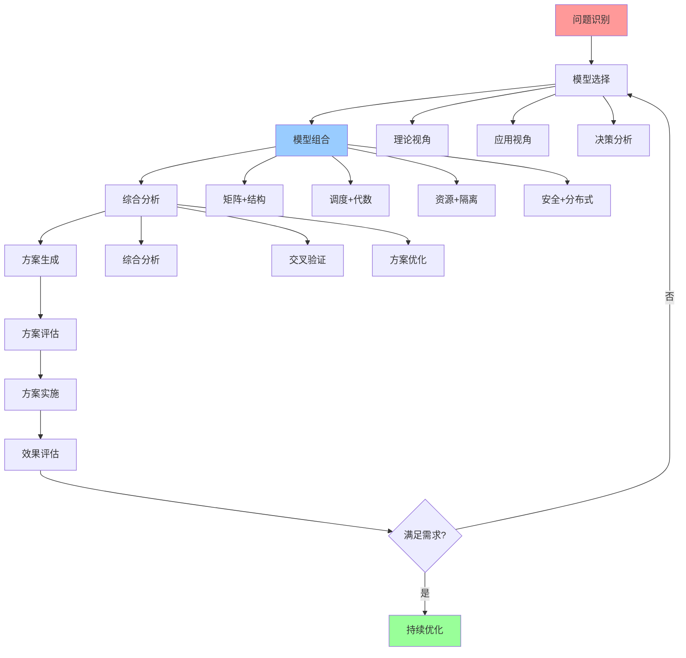
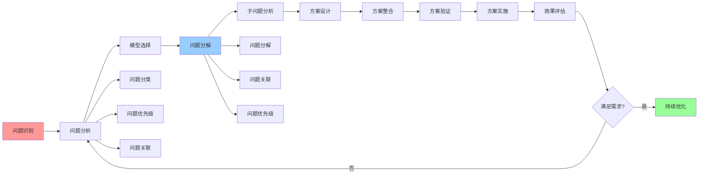

# 认知模型进阶应用

## 📑 目录

- [认知模型进阶应用](#认知模型进阶应用)
  - [📑 目录](#-目录)
  - [1 多模型组合应用](#1-多模型组合应用)
  - [2 复杂场景分析](#2-复杂场景分析)
  - [3 系统性问题解决](#3-系统性问题解决)
  - [4 技术演进预测](#4-技术演进预测)

---

## 1 多模型组合应用

---

## 2 复杂场景分析

| 场景类型 | 分析模型 | 分析方法 | 预期效果 | 复杂度 | 推荐度 |
|---------|---------|---------|---------|--------|--------|
| **大规模系统** | 结构视角+分布式模型 | 结构分析+分布式分析 | 系统架构优化 | 高 | ⭐⭐⭐⭐⭐ |
| **高性能系统** | 调度视角+资源模型 | 调度分析+资源分析 | 性能优化 | 高 | ⭐⭐⭐⭐⭐ |
| **安全关键系统** | 安全模型+形式化理论 | 安全分析+形式化验证 | 安全保障 | 极高 | ⭐⭐⭐⭐⭐ |
| **复杂业务系统** | 应用业务架构+决策分析 | 业务分析+决策分析 | 业务价值优化 | 高 | ⭐⭐⭐⭐ |
| **技术选型** | 矩阵视角+技术选型框架 | 矩阵分析+选型分析 | 科学选型 | 中 | ⭐⭐⭐⭐⭐ |
| **架构演进** | 结构视角+演进路径 | 结构分析+演进分析 | 架构演进优化 | 高 | ⭐⭐⭐⭐ |

**推荐度说明**：

- **⭐⭐⭐⭐⭐**：强烈推荐
- **⭐⭐⭐⭐**：推荐
- **⭐⭐⭐**：可选

---

## 3 系统性问题解决

---

## 4 技术演进预测

| 预测维度 | 预测模型 | 预测方法 | 预测准确度 | 推荐度 |
|---------|---------|---------|-----------|--------|
| **技术趋势** | 演进路径+矩阵视角 | 演进分析+趋势分析 | 中 | ⭐⭐⭐⭐ |
| **架构演进** | 结构视角+演进路径 | 结构分析+演进分析 | 中 | ⭐⭐⭐⭐ |
| **技术选型** | 矩阵视角+技术选型框架 | 矩阵分析+选型分析 | 高 | ⭐⭐⭐⭐⭐ |
| **性能演进** | 调度视角+性能基准 | 调度分析+性能分析 | 中 | ⭐⭐⭐⭐ |
| **安全演进** | 安全模型+安全趋势 | 安全分析+趋势分析 | 中 | ⭐⭐⭐⭐ |

**推荐度说明**：

- **⭐⭐⭐⭐⭐**：强烈推荐
- **⭐⭐⭐⭐**：推荐
- **⭐⭐⭐**：可选

---

## 5 进阶应用检查清单

| 检查项 | 检查内容 | 重要性 | 推荐度 |
|--------|---------|--------|--------|
| **问题识别** | 问题完整、问题分类、问题优先级 | 极高 | ⭐⭐⭐⭐⭐ |
| **模型选择** | 模型评估、模型组合、模型验证 | 高 | ⭐⭐⭐⭐⭐ |
| **问题分解** | 问题分解、问题关联、问题优先级 | 高 | ⭐⭐⭐⭐⭐ |
| **综合分析** | 综合分析、交叉验证、方案优化 | 高 | ⭐⭐⭐⭐⭐ |
| **方案实施** | 方案实施、效果评估、持续优化 | 中 | ⭐⭐⭐⭐ |

**推荐度说明**：

- **⭐⭐⭐⭐⭐**：强烈推荐
- **⭐⭐⭐⭐**：推荐
- **⭐⭐⭐**：可选

---

**最后更新**：2025-11-07
**文档状态**：✅ 完整 | 📊 包含认知模型进阶应用 | 🎯 生产就绪
**维护者**：项目团队
