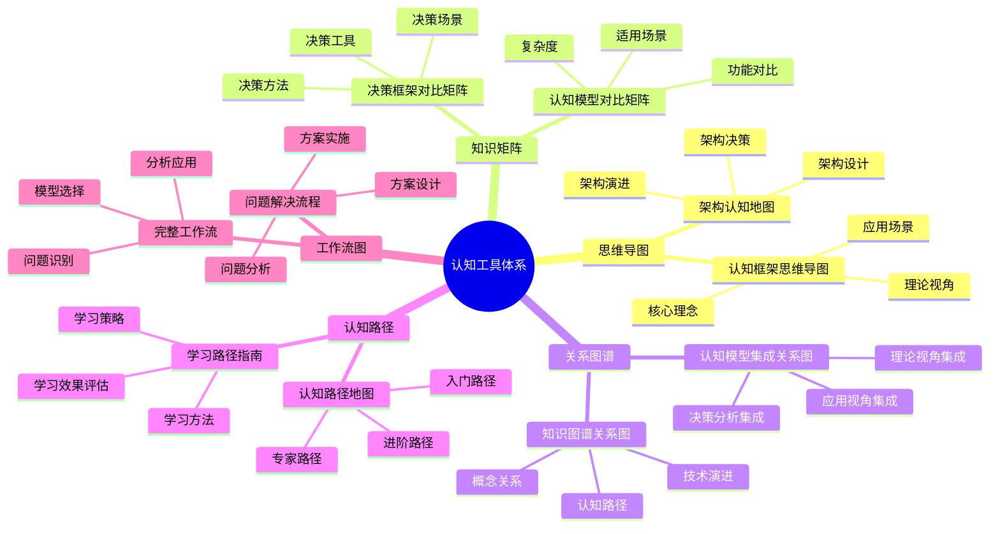

# 认知工具使用指南

## 📑 目录

- [认知工具使用指南](#认知工具使用指南)
  - [📑 目录](#-目录)
  - [1 认知工具全景](#1-认知工具全景)
  - [2 思维导图工具](#2-思维导图工具)
    - [2.1 认知框架思维导图](#21-认知框架思维导图)
    - [2.2 架构认知地图](#22-架构认知地图)
  - [3 知识矩阵工具](#3-知识矩阵工具)
    - [3.1 认知模型对比矩阵](#31-认知模型对比矩阵)
    - [3.2 决策框架对比矩阵](#32-决策框架对比矩阵)
  - [4 关系图谱工具](#4-关系图谱工具)
    - [4.1 知识图谱关系图](#41-知识图谱关系图)
    - [4.2 认知模型集成关系图](#42-认知模型集成关系图)
  - [5 认知路径工具](#5-认知路径工具)
    - [5.1 认知路径地图](#51-认知路径地图)
    - [5.2 学习路径指南](#52-学习路径指南)
  - [6 工具选择指南](#6-工具选择指南)
  - [7 工具使用检查清单](#7-工具使用检查清单)
  - [8 工具使用详细说明](#8-工具使用详细说明)
    - [8.1 思维导图工具详细说明](#81-思维导图工具详细说明)
      - [8.1.1 认知框架思维导图使用](#811-认知框架思维导图使用)
      - [8.1.2 架构认知地图使用](#812-架构认知地图使用)
    - [8.2 知识矩阵工具详细说明](#82-知识矩阵工具详细说明)
      - [8.2.1 认知模型对比矩阵使用](#821-认知模型对比矩阵使用)
      - [8.2.2 决策框架对比矩阵使用](#822-决策框架对比矩阵使用)
    - [8.3 关系图谱工具详细说明](#83-关系图谱工具详细说明)
      - [8.3.1 知识图谱关系图使用](#831-知识图谱关系图使用)
  - [9 工具使用实践案例](#9-工具使用实践案例)
    - [9.1 案例1：技术选型工具使用](#91-案例1技术选型工具使用)
    - [9.2 案例2：架构设计工具使用](#92-案例2架构设计工具使用)
  - [10 工具使用最佳实践](#10-工具使用最佳实践)
    - [10.1 工具选择原则](#101-工具选择原则)
    - [10.2 工具使用方法](#102-工具使用方法)
    - [10.3 工具使用注意事项](#103-工具使用注意事项)
  - [11 工具使用工具推荐](#11-工具使用工具推荐)

---

## 1 认知工具全景

---

## 2 思维导图工具

### 2.1 认知框架思维导图

**用途**：快速建立整体认知框架

**适用场景**：

- 快速了解技术栈全貌
- 理解核心理念和理论视角
- 建立系统性认知

**使用方法**：

1. **从根节点开始**：从认知框架的根节点开始浏览
2. **逐层展开**：按照层次结构逐层展开各个分支
3. **重点关注**：重点关注核心理念、理论视角、应用场景
4. **建立联系**：理解不同概念之间的关系

**推荐度**：⭐⭐⭐⭐⭐

### 2.2 架构认知地图

**用途**：理解架构设计和架构决策

**适用场景**：

- 架构设计
- 架构决策
- 架构演进

**使用方法**：

1. **理解架构理念**：从架构理念开始理解
2. **掌握架构原则**：理解架构设计原则
3. **应用架构模式**：选择合适的架构模式
4. **评估架构方案**：评估架构方案的合理性

**推荐度**：⭐⭐⭐⭐⭐

---

## 3 知识矩阵工具

### 3.1 认知模型对比矩阵

**用途**：对比不同认知模型的功能和适用场景

**适用场景**：

- 技术选型
- 模型选择
- 方案对比

**使用方法**：

1. **明确需求**：明确需要对比的维度和需求
2. **选择矩阵**：选择合适的对比矩阵
3. **对比分析**：按照矩阵进行对比分析
4. **做出决策**：基于对比结果做出决策

**推荐度**：⭐⭐⭐⭐⭐

### 3.2 决策框架对比矩阵

**用途**：对比不同决策框架的方法和工具

**适用场景**：

- 决策方法选择
- 决策工具选择
- 决策流程设计

**使用方法**：

1. **明确决策需求**：明确决策的目标和需求
2. **选择决策框架**：选择合适的决策框架
3. **应用决策方法**：按照决策框架应用决策方法
4. **评估决策效果**：评估决策的效果和质量

**推荐度**：⭐⭐⭐⭐⭐

---

## 4 关系图谱工具

### 4.1 知识图谱关系图

**用途**：理解概念之间的关系和技术演进路径

**适用场景**：

- 理解技术演进
- 建立知识关联
- 学习路径规划

**使用方法**：

1. **选择起点**：选择学习的起点概念
2. **追踪关系**：追踪概念之间的关系
3. **理解演进**：理解技术演进路径
4. **规划路径**：规划学习路径

**推荐度**：⭐⭐⭐⭐⭐

### 4.2 认知模型集成关系图

**用途**：理解不同认知模型之间的集成关系

**适用场景**：

- 模型组合
- 综合分析
- 系统性问题解决

**使用方法**：

1. **理解集成关系**：理解不同模型之间的集成关系
2. **选择组合方式**：选择合适的模型组合方式
3. **应用组合模型**：应用组合模型进行分析
4. **评估组合效果**：评估模型组合的效果

**推荐度**：⭐⭐⭐⭐⭐

---

## 5 认知路径工具

### 5.1 认知路径地图

**用途**：规划学习路径和认知路径

**适用场景**：

- 学习路径规划
- 认知路径规划
- 技能提升规划

**使用方法**：

1. **评估当前水平**：评估当前的知识水平和技能水平
2. **选择路径**：选择合适的认知路径
3. **按路径学习**：按照路径逐步学习
4. **评估学习效果**：评估学习效果并调整路径

**推荐度**：⭐⭐⭐⭐⭐

### 5.2 学习路径指南

**用途**：提供详细的学习路径和学习策略

**适用场景**：

- 新手入门
- 进阶学习
- 专家提升

**使用方法**：

1. **选择学习阶段**：选择当前的学习阶段
2. **选择学习路径**：选择合适的学习路径
3. **应用学习策略**：应用学习策略进行学习
4. **评估学习效果**：评估学习效果并调整策略

**推荐度**：⭐⭐⭐⭐⭐

---

## 6 工具选择指南

| 使用场景 | 推荐工具 | 使用方式 | 预期效果 | 复杂度 | 推荐度 |
|---------|---------|---------|---------|--------|--------|
| **快速认知** | 思维导图+知识矩阵 | 快速浏览+对比分析 | 快速建立认知框架 | 低 | ⭐⭐⭐⭐⭐ |
| **深入学习** | 关系图谱+认知路径 | 关系追踪+路径学习 | 深入理解技术本质 | 中 | ⭐⭐⭐⭐⭐ |
| **技术选型** | 知识矩阵+决策框架 | 对比分析+决策制定 | 科学技术选型 | 中 | ⭐⭐⭐⭐⭐ |
| **架构设计** | 架构认知地图+关系图谱 | 架构分析+关系理解 | 优秀架构设计 | 高 | ⭐⭐⭐⭐⭐ |
| **问题解决** | 工作流图+问题解决流程 | 流程应用+问题分析 | 高效解决问题 | 中 | ⭐⭐⭐⭐⭐ |
| **学习规划** | 认知路径+学习路径指南 | 路径规划+策略应用 | 高效学习 | 中 | ⭐⭐⭐⭐ |

**推荐度说明**：

- **⭐⭐⭐⭐⭐**：强烈推荐
- **⭐⭐⭐⭐**：推荐
- **⭐⭐⭐**：可选

---

## 7 工具使用检查清单

| 检查项 | 检查内容 | 重要性 | 推荐度 |
|--------|---------|--------|--------|
| **工具选择** | 工具适用、工具匹配、工具可用 | 极高 | ⭐⭐⭐⭐⭐ |
| **工具理解** | 工具理解、工具掌握、工具应用 | 高 | ⭐⭐⭐⭐⭐ |
| **工具组合** | 工具组合、工具协同、工具效果 | 高 | ⭐⭐⭐⭐⭐ |
| **效果评估** | 效果测量、效果分析、效果优化 | 中 | ⭐⭐⭐⭐ |
| **持续改进** | 工具优化、方法改进、效果提升 | 中 | ⭐⭐⭐⭐ |

**推荐度说明**：

- **⭐⭐⭐⭐⭐**：强烈推荐
- **⭐⭐⭐⭐**：推荐
- **⭐⭐⭐**：可选

---

## 8 工具使用详细说明

### 8.1 思维导图工具详细说明

#### 8.1.1 认知框架思维导图使用

**使用步骤**：

1. **从根节点开始**：从认知框架的根节点开始浏览
2. **逐层展开**：按照层次结构逐层展开各个分支
3. **重点关注**：重点关注核心理念、理论视角、应用场景
4. **建立联系**：理解不同概念之间的关系

**使用技巧**：

- **主动思考**：在浏览过程中主动思考概念之间的关系
- **笔记记录**：记录关键概念和要点
- **反复浏览**：反复浏览加深理解
- **实践应用**：在实际问题中应用学到的概念

**预期效果**：快速建立整体认知框架，理解技术栈全貌

**推荐度**：⭐⭐⭐⭐⭐

#### 8.1.2 架构认知地图使用

**使用步骤**：

1. **理解架构理念**：从架构理念开始理解
2. **掌握架构原则**：理解架构设计原则
3. **应用架构模式**：选择合适的架构模式
4. **评估架构方案**：评估架构方案的合理性

**使用技巧**：

- **理念先行**：先理解架构理念，再学习具体模式
- **模式对比**：对比不同架构模式的优劣
- **实践验证**：在实际项目中验证架构模式
- **持续优化**：根据实践效果优化架构设计

**预期效果**：理解架构设计和架构决策，提升架构设计能力

**推荐度**：⭐⭐⭐⭐⭐

---

### 8.2 知识矩阵工具详细说明

#### 8.2.1 认知模型对比矩阵使用

**使用步骤**：

1. **明确需求**：明确需要对比的维度和需求
2. **选择矩阵**：选择合适的对比矩阵
3. **对比分析**：按照矩阵进行对比分析
4. **做出决策**：基于对比结果做出决策

**使用技巧**：

- **维度选择**：选择关键的对比维度
- **量化评估**：使用量化指标进行评估
- **综合对比**：综合考虑多个维度
- **决策记录**：记录决策过程和依据

**预期效果**：对比不同认知模型的功能和适用场景，做出科学决策

**推荐度**：⭐⭐⭐⭐⭐

#### 8.2.2 决策框架对比矩阵使用

**使用步骤**：

1. **明确决策需求**：明确决策的目标和需求
2. **选择决策框架**：选择合适的决策框架
3. **应用决策方法**：按照决策框架应用决策方法
4. **评估决策效果**：评估决策的效果和质量

**使用技巧**：

- **需求分析**：深入分析决策需求
- **框架对比**：对比不同决策框架的优劣
- **方法应用**：正确应用决策方法
- **效果评估**：评估决策效果并持续优化

**预期效果**：对比不同决策框架的方法和工具，提升决策质量

**推荐度**：⭐⭐⭐⭐⭐

---

### 8.3 关系图谱工具详细说明

#### 8.3.1 知识图谱关系图使用

**使用步骤**：

1. **选择起点**：选择学习的起点概念
2. **追踪关系**：追踪概念之间的关系
3. **理解演进**：理解技术演进路径
4. **规划路径**：规划学习路径

**使用技巧**：

- **起点选择**：选择熟悉的概念作为起点
- **关系追踪**：深入追踪概念之间的关系
- **演进理解**：理解技术演进的内在逻辑
- **路径规划**：根据关系图谱规划学习路径

**预期效果**：理解概念之间的关系和技术演进路径，建立知识关联

**推荐度**：⭐⭐⭐⭐⭐

---

## 9 工具使用实践案例

### 9.1 案例1：技术选型工具使用

**场景**：选择适合的容器运行时

**工具使用**：

1. **知识矩阵**：使用认知模型对比矩阵对比 containerd、CRI-O、Docker
2. **决策树**：使用技术选型决策树进行结构化决策
3. **关系图谱**：使用知识图谱理解容器运行时的演进关系

**使用流程**：

1. **矩阵对比**：使用知识矩阵对比各容器运行时的功能、性能、成本
2. **决策树分析**：使用决策树分析选型条件
3. **关系理解**：使用关系图谱理解技术演进关系
4. **综合决策**：基于工具分析结果做出决策

**效果**：成功选择最适合的容器运行时，决策过程科学合理

**推荐度**：⭐⭐⭐⭐⭐

### 9.2 案例2：架构设计工具使用

**场景**：设计微服务架构

**工具使用**：

1. **架构认知地图**：使用架构认知地图理解架构理念和模式
2. **关系图谱**：使用关系图谱理解架构组件之间的关系
3. **工作流图**：使用工作流图指导架构设计流程

**使用流程**：

1. **理念学习**：使用架构认知地图学习架构理念
2. **模式选择**：使用架构认知地图选择合适的架构模式
3. **关系分析**：使用关系图谱分析架构组件关系
4. **流程应用**：使用工作流图指导设计流程
5. **架构设计**：基于工具分析结果设计架构

**效果**：成功设计优秀的微服务架构，架构方案科学合理

**推荐度**：⭐⭐⭐⭐⭐

---

## 10 工具使用最佳实践

### 10.1 工具选择原则

**原则1：场景匹配**:

- 根据使用场景选择合适的工具
- 明确工具的使用目的
- 关注工具的实际效果

**原则2：工具组合**:

- 根据需求组合多个工具
- 发挥每个工具的优势
- 避免工具过度组合

**原则3：持续优化**:

- 根据实践效果优化工具使用
- 积累工具使用的经验
- 形成工具使用的模式

**推荐度**：⭐⭐⭐⭐⭐

### 10.2 工具使用方法

**方法1：标准流程**:

- 按照标准流程使用工具
- 确保每个步骤的质量
- 及时进行效果评估

**方法2：灵活调整**:

- 根据实际情况调整使用方式
- 跳过不必要的步骤
- 增加必要的步骤

**方法3：迭代优化**:

- 根据实践效果优化使用方式
- 迭代改进使用流程
- 持续提升使用效果

**推荐度**：⭐⭐⭐⭐⭐

### 10.3 工具使用注意事项

**注意事项1：工具要合适**:

- 确保工具与场景匹配
- 避免工具过度使用
- 要关注工具的实际效果

**注意事项2：组合要合理**:

- 合理组合多个工具
- 避免工具组合过度复杂
- 要关注组合的实际效果

**注意事项3：效果要评估**:

- 要评估工具使用的效果
- 要根据效果调整使用方式
- 要持续优化使用效果

**推荐度**：⭐⭐⭐⭐⭐

---

## 11 工具使用工具推荐

| 工具类型 | 推荐工具 | 使用场景 | 效果 | 复杂度 | 推荐度 |
|---------|---------|---------|------|--------|--------|
| **思维导图工具** | XMind、MindMaster | 知识整理、思维整理 | 高 | 低 | ⭐⭐⭐⭐⭐ |
| **知识矩阵工具** | Excel、Google Sheets | 技术对比、方案对比 | 高 | 低 | ⭐⭐⭐⭐⭐ |
| **关系图谱工具** | Neo4j、Gephi | 关系分析、知识关联 | 高 | 中 | ⭐⭐⭐⭐ |
| **决策树工具** | Lucidchart、Draw.io | 决策分析、流程设计 | 高 | 中 | ⭐⭐⭐⭐ |
| **工作流工具** | Mermaid、PlantUML | 工作流可视化 | 中 | 低 | ⭐⭐⭐⭐⭐ |

**推荐度说明**：

- **⭐⭐⭐⭐⭐**：强烈推荐
- **⭐⭐⭐⭐**：推荐
- **⭐⭐⭐**：可选

---

**最后更新**：2025-11-15
**文档状态**：✅ 完整 | 📊 包含认知工具使用指南、详细说明、实践案例、最佳实践、工具推荐 | 🎯 生产就绪
**维护者**：项目团队
