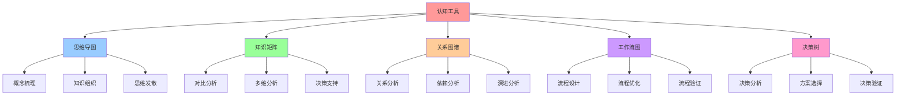

# 认知工具使用指南

## 📑 目录

- [认知工具使用指南](#认知工具使用指南)
  - [📑 目录](#-目录)
  - [1 认知工具全景](#1-认知工具全景)
  - [2 思维导图工具](#2-思维导图工具)
  - [3 知识矩阵工具](#3-知识矩阵工具)
  - [4 关系图谱工具](#4-关系图谱工具)

---

## 1 认知工具全景

---

## 2 思维导图工具

| 使用场景 | 工具方法 | 使用步骤 | 预期效果 | 推荐度 |
|---------|---------|---------|---------|--------|
| **概念梳理** | 中心主题、分支展开 | 确定主题、展开分支、细化内容 | 概念清晰 | ⭐⭐⭐⭐⭐ |
| **知识组织** | 层次结构、分类组织 | 建立层次、分类组织、关联分析 | 知识系统化 | ⭐⭐⭐⭐⭐ |
| **思维发散** | 自由联想、思维扩展 | 自由联想、扩展思维、关联分析 | 思维扩展 | ⭐⭐⭐⭐ |
| **问题分析** | 问题分解、原因分析 | 问题分解、原因分析、解决方案 | 问题清晰 | ⭐⭐⭐⭐⭐ |
| **方案设计** | 方案展开、方案优化 | 方案设计、方案展开、方案优化 | 方案完整 | ⭐⭐⭐⭐ |

**推荐度说明**：
- **⭐⭐⭐⭐⭐**：强烈推荐
- **⭐⭐⭐⭐**：推荐
- **⭐⭐⭐**：可选

---

## 3 知识矩阵工具

| 使用场景 | 工具方法 | 使用步骤 | 预期效果 | 推荐度 |
|---------|---------|---------|---------|--------|
| **技术对比** | 多维度对比、评分矩阵 | 确定维度、对比分析、评分评估 | 技术选型 | ⭐⭐⭐⭐⭐ |
| **方案对比** | 方案矩阵、评估矩阵 | 方案设计、方案对比、方案选择 | 方案选择 | ⭐⭐⭐⭐⭐ |
| **决策支持** | 决策矩阵、评估矩阵 | 决策分析、方案评估、决策制定 | 科学决策 | ⭐⭐⭐⭐⭐ |
| **问题分析** | 问题矩阵、原因矩阵 | 问题分类、原因分析、解决方案 | 问题解决 | ⭐⭐⭐⭐ |
| **知识管理** | 知识矩阵、分类矩阵 | 知识分类、知识组织、知识检索 | 知识管理 | ⭐⭐⭐⭐ |

**推荐度说明**：
- **⭐⭐⭐⭐⭐**：强烈推荐
- **⭐⭐⭐⭐**：推荐
- **⭐⭐⭐**：可选

---

## 4 关系图谱工具

| 使用场景 | 工具方法 | 使用步骤 | 预期效果 | 推荐度 |
|---------|---------|---------|---------|--------|
| **关系分析** | 节点关系、边关系 | 节点识别、关系识别、关系分析 | 关系清晰 | ⭐⭐⭐⭐⭐ |
| **依赖分析** | 依赖关系、依赖链 | 依赖识别、依赖分析、依赖优化 | 依赖优化 | ⭐⭐⭐⭐⭐ |
| **演进分析** | 演进路径、演进关系 | 演进识别、演进分析、演进预测 | 演进理解 | ⭐⭐⭐⭐ |
| **系统分析** | 系统结构、系统关系 | 系统识别、结构分析、关系分析 | 系统理解 | ⭐⭐⭐⭐ |
| **知识图谱** | 知识节点、知识关系 | 知识识别、关系识别、图谱构建 | 知识系统化 | ⭐⭐⭐⭐ |

**推荐度说明**：
- **⭐⭐⭐⭐⭐**：强烈推荐
- **⭐⭐⭐⭐**：推荐
- **⭐⭐⭐**：可选

---

## 5 工作流图工具

| 使用场景 | 工具方法 | 使用步骤 | 预期效果 | 推荐度 |
|---------|---------|---------|---------|--------|
| **流程设计** | 流程节点、流程边 | 流程识别、流程设计、流程优化 | 流程清晰 | ⭐⭐⭐⭐⭐ |
| **流程优化** | 流程分析、流程重构 | 流程分析、瓶颈识别、流程优化 | 流程效率提升 | ⭐⭐⭐⭐⭐ |
| **流程验证** | 流程测试、流程验证 | 流程测试、流程验证、流程改进 | 流程质量提升 | ⭐⭐⭐⭐ |
| **决策流程** | 决策节点、决策边 | 决策识别、流程设计、流程优化 | 决策流程优化 | ⭐⭐⭐⭐ |
| **问题解决流程** | 问题节点、解决边 | 问题识别、流程设计、流程优化 | 问题解决优化 | ⭐⭐⭐⭐ |

**推荐度说明**：
- **⭐⭐⭐⭐⭐**：强烈推荐
- **⭐⭐⭐⭐**：推荐
- **⭐⭐⭐**：可选

---

## 6 决策树工具

| 使用场景 | 工具方法 | 使用步骤 | 预期效果 | 推荐度 |
|---------|---------|---------|---------|--------|
| **技术选型** | 选型节点、选型边 | 需求分析、选型设计、选型验证 | 技术选型 | ⭐⭐⭐⭐⭐ |
| **方案选择** | 方案节点、选择边 | 方案设计、选择设计、选择验证 | 方案选择 | ⭐⭐⭐⭐⭐ |
| **问题诊断** | 诊断节点、诊断边 | 问题识别、诊断设计、诊断验证 | 问题诊断 | ⭐⭐⭐⭐ |
| **风险评估** | 风险节点、评估边 | 风险识别、评估设计、评估验证 | 风险评估 | ⭐⭐⭐⭐ |
| **决策支持** | 决策节点、支持边 | 决策识别、支持设计、支持验证 | 决策支持 | ⭐⭐⭐⭐ |

**推荐度说明**：
- **⭐⭐⭐⭐⭐**：强烈推荐
- **⭐⭐⭐⭐**：推荐
- **⭐⭐⭐**：可选

---

## 7 认知工具使用检查清单

| 检查项 | 检查内容 | 重要性 | 推荐度 |
|--------|---------|--------|--------|
| **工具选择** | 工具评估、工具选择、工具验证 | 极高 | ⭐⭐⭐⭐⭐ |
| **工具使用** | 工具使用、工具验证、工具优化 | 高 | ⭐⭐⭐⭐⭐ |
| **效果评估** | 效果测量、效果分析、效果报告 | 中 | ⭐⭐⭐⭐ |

**推荐度说明**：
- **⭐⭐⭐⭐⭐**：强烈推荐
- **⭐⭐⭐⭐**：推荐
- **⭐⭐⭐**：可选

---

**最后更新**：2025-11-07
**文档状态**：✅ 完整 | 📊 包含认知工具使用指南 | 🎯 生产就绪
**维护者**：项目团队
