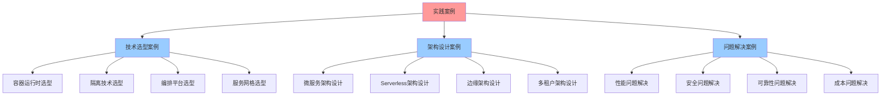

# 实践案例详细指南

## 📑 目录

- [实践案例详细指南](#实践案例详细指南)
  - [📑 目录](#-目录)
  - [1 实践案例全景](#1-实践案例全景)
  - [2 技术选型案例](#2-技术选型案例)
    - [2.1 容器运行时选型](#21-容器运行时选型)
    - [2.2 隔离技术选型](#22-隔离技术选型)
    - [2.3 编排平台选型](#23-编排平台选型)
    - [2.4 服务网格选型](#24-服务网格选型)
  - [3 架构设计案例](#3-架构设计案例)
    - [3.1 微服务架构设计](#31-微服务架构设计)
    - [3.2 Serverless架构设计](#32-serverless架构设计)
    - [3.3 边缘架构设计](#33-边缘架构设计)
    - [3.4 多租户架构设计](#34-多租户架构设计)
  - [4 问题解决案例](#4-问题解决案例)
    - [4.1 性能问题解决](#41-性能问题解决)
    - [4.2 安全问题解决](#42-安全问题解决)
    - [4.3 可靠性问题解决](#43-可靠性问题解决)
    - [4.4 成本问题解决](#44-成本问题解决)
  - [5 案例分析方法](#5-案例分析方法)
  - [6 案例学习检查清单](#6-案例学习检查清单)
  - [7 案例详细说明](#7-案例详细说明)
    - [7.1 技术选型案例详细说明](#71-技术选型案例详细说明)
      - [7.1.1 容器运行时选型详细说明](#711-容器运行时选型详细说明)
      - [7.1.2 隔离技术选型详细说明](#712-隔离技术选型详细说明)
    - [7.2 架构设计案例详细说明](#72-架构设计案例详细说明)
      - [7.2.1 微服务架构设计详细说明](#721-微服务架构设计详细说明)
  - [8 案例实践详细流程](#8-案例实践详细流程)
    - [8.1 技术选型实践流程](#81-技术选型实践流程)
    - [8.2 架构设计实践流程](#82-架构设计实践流程)
  - [9 案例学习最佳实践](#9-案例学习最佳实践)
    - [9.1 案例学习原则](#91-案例学习原则)
    - [9.2 案例学习方法](#92-案例学习方法)
    - [9.3 案例学习注意事项](#93-案例学习注意事项)
  - [10 案例学习工具推荐](#10-案例学习工具推荐)
  - [11 2025 年最新实践](#11-2025-年最新实践)
    - [11.1 实践案例在云原生技术选型中的应用（2025）](#111-实践案例在云原生技术选型中的应用2025)
    - [11.2 实践案例在架构设计中的应用（2025）](#112-实践案例在架构设计中的应用2025)
  - [12 实际应用案例](#12-实际应用案例)
    - [案例 1：微服务架构设计案例（2025）](#案例-1微服务架构设计案例2025)
    - [案例 2：边缘计算架构设计案例（2025）](#案例-2边缘计算架构设计案例2025)
    - [案例 3：Serverless 平台设计案例（2025）](#案例-3serverless-平台设计案例2025)

---

## 1 实践案例全景



---

## 2 技术选型案例

### 2.1 容器运行时选型

**案例背景**：

- **需求**：选择适合的容器运行时
- **场景**：云原生应用部署
- **约束**：性能、安全性、兼容性

**分析方法**：

1. **需求分析**：明确性能、安全、兼容性需求
2. **技术评估**：评估 containerd、CRI-O、Docker 等
3. **方案对比**：使用矩阵视角进行对比分析
4. **决策制定**：基于评估结果做出决策

**推荐模型**：

- **矩阵视角**：技术对比矩阵
- **结构视角**：技术结构分析
- **资源模型**：资源需求分析

**预期效果**：选择最适合的容器运行时

**推荐度**：⭐⭐⭐⭐⭐

### 2.2 隔离技术选型

**案例背景**：

- **需求**：选择适合的隔离技术
- **场景**：多租户应用隔离
- **约束**：隔离强度、性能开销、资源利用率

**分析方法**：

1. **需求分析**：明确隔离需求和安全需求
2. **技术评估**：评估虚拟化、容器化、沙盒化
3. **方案对比**：使用隔离模型进行对比分析
4. **决策制定**：基于评估结果做出决策

**推荐模型**：

- **隔离模型**：隔离层次分析
- **资源模型**：资源利用率分析
- **安全模型**：安全需求分析

**预期效果**：选择最适合的隔离技术

**推荐度**：⭐⭐⭐⭐⭐

### 2.3 编排平台选型

**案例背景**：

- **需求**：选择适合的编排平台
- **场景**：容器编排和管理
- **约束**：功能完整性、生态支持、学习曲线

**分析方法**：

1. **需求分析**：明确功能需求和生态需求
2. **技术评估**：评估 Kubernetes、Docker Swarm、Nomad 等
3. **方案对比**：使用决策框架进行对比分析
4. **决策制定**：基于评估结果做出决策

**推荐模型**：

- **矩阵视角**：功能对比矩阵
- **结构视角**：架构结构分析
- **决策模型**：决策框架应用

**预期效果**：选择最适合的编排平台

**推荐度**：⭐⭐⭐⭐⭐

### 2.4 服务网格选型

**案例背景**：

- **需求**：选择适合的服务网格
- **场景**：微服务通信治理
- **约束**：功能完整性、性能开销、生态支持

**分析方法**：

1. **需求分析**：明确通信治理需求和安全需求
2. **技术评估**：评估 Istio、Linkerd、Consul Connect 等
3. **方案对比**：使用服务网格架构案例进行对比分析
4. **决策制定**：基于评估结果做出决策

**推荐模型**：

- **服务网格架构案例**：架构分析
- **矩阵视角**：功能对比矩阵
- **资源模型**：性能开销分析

**预期效果**：选择最适合的服务网格

**推荐度**：⭐⭐⭐⭐⭐

---

## 3 架构设计案例

### 3.1 微服务架构设计

**案例背景**：

- **需求**：设计微服务架构
- **场景**：大型分布式应用
- **约束**：可扩展性、可维护性、性能

**分析方法**：

1. **架构分析**：使用结构视角分析架构需求
2. **模式选择**：选择合适的微服务模式
3. **架构设计**：设计微服务架构
4. **架构评估**：评估架构方案的合理性

**推荐模型**：

- **结构视角**：三类结构分析
- **架构模式**：微服务架构模式
- **分布式模型**：分布式系统分析

**预期效果**：设计优秀的微服务架构

**推荐度**：⭐⭐⭐⭐⭐

### 3.2 Serverless架构设计

**案例背景**：

- **需求**：设计 Serverless 架构
- **场景**：事件驱动应用
- **约束**：成本、性能、可扩展性

**分析方法**：

1. **架构分析**：使用应用业务架构视角分析
2. **模式选择**：选择合适的 Serverless 模式
3. **架构设计**：设计 Serverless 架构
4. **架构评估**：评估架构方案的合理性

**推荐模型**：

- **应用业务架构视角**：业务架构分析
- **资源模型**：成本分析
- **调度视角**：性能分析

**预期效果**：设计优秀的 Serverless 架构

**推荐度**：⭐⭐⭐⭐⭐

### 3.3 边缘架构设计

**案例背景**：

- **需求**：设计边缘计算架构
- **场景**：边缘计算应用
- **约束**：延迟、带宽、资源限制

**分析方法**：

1. **架构分析**：使用边缘计算架构案例分析
2. **模式选择**：选择合适的边缘模式
3. **架构设计**：设计边缘架构
4. **架构评估**：评估架构方案的合理性

**推荐模型**：

- **边缘计算案例**：架构分析
- **资源模型**：资源限制分析
- **网络概念**：网络延迟分析

**预期效果**：设计优秀的边缘架构

**推荐度**：⭐⭐⭐⭐⭐

### 3.4 多租户架构设计

**案例背景**：

- **需求**：设计多租户架构
- **场景**：SaaS 应用
- **约束**：隔离性、资源利用率、成本

**分析方法**：

1. **架构分析**：使用隔离模型分析隔离需求
2. **模式选择**：选择合适的多租户模式
3. **架构设计**：设计多租户架构
4. **架构评估**：评估架构方案的合理性

**推荐模型**：

- **隔离模型**：隔离层次分析
- **资源模型**：资源利用率分析
- **安全模型**：安全需求分析

**预期效果**：设计优秀的多租户架构

**推荐度**：⭐⭐⭐⭐⭐

---

## 4 问题解决案例

### 4.1 性能问题解决

**案例背景**：

- **问题**：应用性能下降
- **场景**：生产环境性能问题
- **影响**：用户体验下降、业务损失

**分析方法**：

1. **问题识别**：识别性能瓶颈
2. **问题分析**：使用调度视角分析性能问题
3. **方案设计**：设计性能优化方案
4. **方案实施**：实施性能优化方案
5. **效果评估**：评估优化效果

**推荐模型**：

- **调度视角**：性能分析
- **资源模型**：资源优化
- **性能基准**：性能评估

**预期效果**：解决性能问题，提升应用性能

**推荐度**：⭐⭐⭐⭐⭐

### 4.2 安全问题解决

**案例背景**：

- **问题**：安全漏洞和威胁
- **场景**：生产环境安全问题
- **影响**：数据泄露、服务中断

**分析方法**：

1. **问题识别**：识别安全威胁
2. **问题分析**：使用安全模型分析安全问题
3. **方案设计**：设计安全加固方案
4. **方案实施**：实施安全加固方案
5. **效果评估**：评估安全加固效果

**推荐模型**：

- **安全模型**：安全分析
- **隔离模型**：隔离加固
- **形式化理论**：安全验证

**预期效果**：解决安全问题，提升系统安全性

**推荐度**：⭐⭐⭐⭐⭐

### 4.3 可靠性问题解决

**案例背景**：

- **问题**：服务可靠性下降
- **场景**：生产环境可靠性问题
- **影响**：服务中断、业务损失

**分析方法**：

1. **问题识别**：识别可靠性问题
2. **问题分析**：使用分布式模型分析可靠性问题
3. **方案设计**：设计可靠性提升方案
4. **方案实施**：实施可靠性提升方案
5. **效果评估**：评估可靠性提升效果

**推荐模型**：

- **分布式模型**：可靠性分析
- **资源模型**：资源冗余
- **架构模式**：高可用架构

**预期效果**：解决可靠性问题，提升系统可靠性

**推荐度**：⭐⭐⭐⭐⭐

### 4.4 成本问题解决

**案例背景**：

- **问题**：资源成本过高
- **场景**：云资源成本优化
- **影响**：成本压力、资源浪费

**分析方法**：

1. **问题识别**：识别成本问题
2. **问题分析**：使用资源模型分析成本问题
3. **方案设计**：设计成本优化方案
4. **方案实施**：实施成本优化方案
5. **效果评估**：评估成本优化效果

**推荐模型**：

- **资源模型**：资源优化
- **调度视角**：资源调度优化
- **成本分析**：成本分析工具

**预期效果**：解决成本问题，降低资源成本

**推荐度**：⭐⭐⭐⭐⭐

---

## 5 案例分析方法

| 案例类型 | 分析方法 | 推荐模型 | 预期效果 | 复杂度 | 推荐度 |
|---------|---------|---------|---------|--------|--------|
| **技术选型** | 需求分析→技术评估→方案对比→决策制定 | 矩阵视角+结构视角+决策模型 | 科学技术选型 | 中 | ⭐⭐⭐⭐⭐ |
| **架构设计** | 架构分析→模式选择→架构设计→架构评估 | 结构视角+架构模式+分布式模型 | 优秀架构设计 | 高 | ⭐⭐⭐⭐⭐ |
| **问题解决** | 问题识别→问题分析→方案设计→方案实施→效果评估 | 问题解决方案矩阵+相关模型 | 高效解决问题 | 中 | ⭐⭐⭐⭐⭐ |
| **性能优化** | 性能分析→瓶颈识别→优化设计→优化实施→效果评估 | 调度视角+资源模型+性能基准 | 性能提升 | 中 | ⭐⭐⭐⭐⭐ |
| **安全加固** | 安全分析→威胁识别→加固设计→加固实施→效果评估 | 安全模型+隔离模型+形式化理论 | 安全提升 | 高 | ⭐⭐⭐⭐⭐ |
| **成本优化** | 成本分析→浪费识别→优化设计→优化实施→效果评估 | 资源模型+调度视角+成本分析 | 成本降低 | 中 | ⭐⭐⭐⭐ |

**推荐度说明**：

- **⭐⭐⭐⭐⭐**：强烈推荐
- **⭐⭐⭐⭐**：推荐
- **⭐⭐⭐**：可选

---

## 6 案例学习检查清单

| 检查项 | 检查内容 | 重要性 | 推荐度 |
|--------|---------|--------|--------|
| **案例理解** | 案例背景、案例需求、案例约束 | 极高 | ⭐⭐⭐⭐⭐ |
| **方法掌握** | 分析方法、模型应用、工具使用 | 高 | ⭐⭐⭐⭐⭐ |
| **实践应用** | 案例实践、效果评估、经验总结 | 高 | ⭐⭐⭐⭐⭐ |
| **知识迁移** | 知识迁移、方法迁移、经验迁移 | 中 | ⭐⭐⭐⭐ |
| **持续改进** | 方法改进、效果提升、经验积累 | 中 | ⭐⭐⭐⭐ |

**推荐度说明**：

- **⭐⭐⭐⭐⭐**：强烈推荐
- **⭐⭐⭐⭐**：推荐
- **⭐⭐⭐**：可选

---

## 7 案例详细说明

### 7.1 技术选型案例详细说明

#### 7.1.1 容器运行时选型详细说明

**需求分析**：

- **性能需求**：需要高性能的容器运行时
- **安全需求**：需要安全的容器运行时
- **兼容性需求**：需要兼容 Kubernetes CRI 标准

**技术评估**：

- **containerd**：高性能、轻量级、CRI 兼容
- **CRI-O**：轻量级、CRI 原生支持
- **Docker**：功能完整、生态丰富、但较重

**对比分析**：

使用矩阵视角对比各容器运行时的功能、性能、安全性、兼容性等维度。

**决策制定**：

基于评估结果，选择 containerd 作为容器运行时，因为它在性能、安全性和兼容性方面都表现优秀。

**实施步骤**：

1. **环境准备**：准备容器运行时环境
2. **安装配置**：安装和配置 containerd
3. **功能验证**：验证容器运行时的功能
4. **性能测试**：测试容器运行时的性能
5. **效果评估**：评估容器运行时的效果

**预期效果**：选择最适合的容器运行时，提升系统性能和安全性

**推荐度**：⭐⭐⭐⭐⭐

---

#### 7.1.2 隔离技术选型详细说明

**需求分析**：

- **隔离需求**：需要强隔离的多租户环境
- **性能需求**：需要低性能开销
- **资源需求**：需要高资源利用率

**技术评估**：

- **虚拟化**：强隔离、高性能开销、低资源利用率
- **容器化**：中等隔离、低性能开销、高资源利用率
- **沙盒化**：强隔离、低性能开销、高资源利用率

**对比分析**：

使用隔离模型对比各隔离技术的隔离强度、性能开销、资源利用率等维度。

**决策制定**：

基于评估结果，选择沙盒化技术（如 WasmEdge）作为隔离技术，因为它在隔离强度、性能开销和资源利用率方面都表现优秀。

**实施步骤**：

1. **技术选型**：选择沙盒化技术
2. **环境准备**：准备沙盒化环境
3. **隔离配置**：配置隔离策略
4. **功能验证**：验证隔离功能
5. **效果评估**：评估隔离效果

**预期效果**：选择最适合的隔离技术，实现强隔离和高资源利用率

**推荐度**：⭐⭐⭐⭐⭐

---

### 7.2 架构设计案例详细说明

#### 7.2.1 微服务架构设计详细说明

**需求分析**：

- **业务需求**：需要支持快速迭代和独立部署
- **性能需求**：需要高并发和高可用
- **扩展需求**：需要支持水平扩展

**架构设计**：

- **服务拆分**：按照业务领域拆分服务
- **服务治理**：使用服务网格进行服务治理
- **数据管理**：使用分布式数据管理

**设计方法**：

使用结构视角设计微服务架构的计算、控制、信息结构。

**设计步骤**：

1. **架构分析**：分析业务需求和架构约束
2. **服务拆分**：按照业务领域拆分服务
3. **架构设计**：设计微服务架构
4. **架构评估**：评估架构方案的合理性
5. **架构优化**：优化架构设计

**预期效果**：设计优秀的微服务架构，支持快速迭代和高可用

**推荐度**：⭐⭐⭐⭐⭐

---

## 8 案例实践详细流程

### 8.1 技术选型实践流程

**流程步骤**：

1. **需求分析**
   - 明确技术选型需求
   - 分析业务场景和约束
   - 确定选型标准

2. **技术调研**
   - 调研候选技术
   - 收集技术信息
   - 评估技术成熟度

3. **技术评估**
   - 使用矩阵视角对比技术
   - 使用结构视角分析技术架构
   - 使用资源模型分析资源需求

4. **方案对比**
   - 对比不同技术方案
   - 评估方案的优劣
   - 量化评估指标

5. **决策制定**
   - 基于评估结果做出决策
   - 制定实施计划
   - 准备风险应对方案

6. **方案实施**
   - 实施选型方案
   - 监控实施过程
   - 验证方案效果

7. **效果评估**
   - 评估选型效果
   - 分析选型结果
   - 总结选型经验

**推荐度**：⭐⭐⭐⭐⭐

---

### 8.2 架构设计实践流程

**流程步骤**：

1. **需求分析**
   - 明确架构设计需求
   - 分析业务场景和约束
   - 确定设计目标

2. **架构分析**
   - 使用结构视角分析架构需求
   - 使用分布式模型分析分布式特性
   - 使用资源模型分析资源需求

3. **模式选择**
   - 选择合适的架构模式
   - 评估模式的适用性
   - 对比不同模式

4. **架构设计**
   - 设计架构结构
   - 设计组件关系
   - 设计数据流

5. **架构评估**
   - 评估架构方案的合理性
   - 评估架构的性能和可用性
   - 评估架构的可扩展性

6. **架构优化**
   - 优化架构设计
   - 改进架构方案
   - 提升架构质量

7. **架构实施**
   - 实施架构方案
   - 监控实施过程
   - 验证架构效果

**推荐度**：⭐⭐⭐⭐⭐

---

## 9 案例学习最佳实践

### 9.1 案例学习原则

**原则1：案例理解**:

- 深入理解案例背景和需求
- 理解案例的约束和挑战
- 理解案例的解决方案

**原则2：方法掌握**:

- 掌握案例的分析方法
- 掌握案例的模型应用
- 掌握案例的工具使用

**原则3：实践应用**:

- 在实际项目中应用案例方法
- 验证案例方法的有效性
- 积累实践经验

**推荐度**：⭐⭐⭐⭐⭐

### 9.2 案例学习方法

**方法1：案例学习**:

- 学习案例的背景和需求
- 学习案例的分析方法
- 学习案例的解决方案

**方法2：案例实践**:

- 在实际项目中实践案例方法
- 验证案例方法的有效性
- 积累实践经验

**方法3：案例总结**:

- 总结案例的经验和教训
- 形成案例学习的模式
- 持续改进案例学习方法

**推荐度**：⭐⭐⭐⭐⭐

### 9.3 案例学习注意事项

**注意事项1：案例要理解**:

- 深入理解案例的背景和需求
- 理解案例的约束和挑战
- 避免案例理解不深入

**注意事项2：方法要掌握**:

- 掌握案例的分析方法
- 掌握案例的模型应用
- 避免方法掌握不充分

**注意事项3：实践要应用**:

- 在实际项目中应用案例方法
- 验证案例方法的有效性
- 避免实践应用不足

**推荐度**：⭐⭐⭐⭐⭐

---

## 10 案例学习工具推荐

| 工具类型 | 推荐工具 | 使用场景 | 效果 | 复杂度 | 推荐度 |
|---------|---------|---------|------|--------|--------|
| **案例库** | 实践案例详细指南 | 案例学习、案例参考 | 高 | 低 | ⭐⭐⭐⭐⭐ |
| **分析工具** | 矩阵视角、结构视角 | 案例分析、方案对比 | 高 | 中 | ⭐⭐⭐⭐⭐ |
| **决策工具** | 技术选型决策树、决策框架矩阵 | 技术选型、方案决策 | 高 | 中 | ⭐⭐⭐⭐⭐ |
| **文档工具** | Markdown、Confluence | 案例文档化、知识沉淀 | 中 | 低 | ⭐⭐⭐⭐⭐ |
| **学习工具** | 学习路径指南、认知学习策略 | 案例学习、知识学习 | 中 | 低 | ⭐⭐⭐⭐⭐ |

**推荐度说明**：

- **⭐⭐⭐⭐⭐**：强烈推荐
- **⭐⭐⭐⭐**：推荐
- **⭐⭐⭐**：可选

---

## 11 2025 年最新实践

### 11.1 实践案例在云原生技术选型中的应用（2025）

**2025 年趋势**：使用实践案例指导技术选型

**实践要点**：

- **案例库建设**：建立完整的实践案例库
- **案例匹配**：使用 AI 技术进行案例匹配
- **案例更新**：实时更新案例库，反映最新实践

**代码示例**：

```python
# 2025 年实践案例匹配工具
class PracticeCaseMatcher:
    def __init__(self):
        self.case_library = self.load_case_library()

    def match_case(self, requirements):
        """匹配相似案例"""
        # 需求向量化
        req_vector = self.vectorize_requirements(requirements)

        # 案例匹配
        matched_cases = []
        for case in self.case_library:
            case_vector = self.vectorize_case(case)
            similarity = self.calculate_similarity(req_vector, case_vector)
            if similarity > 0.7:
                matched_cases.append((case, similarity))

        # 排序
        matched_cases.sort(key=lambda x: x[1], reverse=True)

        return matched_cases[:5]  # 返回前5个最相似的案例
```

### 11.2 实践案例在架构设计中的应用（2025）

**2025 年趋势**：使用实践案例指导架构设计

**实践要点**：

- **架构模式识别**：从案例中识别架构模式
- **最佳实践提取**：从案例中提取最佳实践
- **架构模板生成**：基于案例生成架构模板

**代码示例**：

```python
# 架构设计案例应用
class ArchitectureCaseApplier:
    def apply_case_to_design(self, case, requirements):
        """将案例应用到架构设计"""
        # 提取案例架构模式
        patterns = self.extract_patterns(case)

        # 适配到当前需求
        adapted_patterns = self.adapt_patterns(patterns, requirements)

        # 生成架构设计
        architecture = self.generate_architecture(adapted_patterns)

        return architecture
```

## 12 实际应用案例

### 案例 1：微服务架构设计案例（2025）

**场景**：基于实践案例设计微服务架构

**实现方案**：

```python
# 微服务架构设计案例应用
class MicroservicesArchitectureCase:
    def design_architecture(self, requirements):
        """设计微服务架构"""
        # 匹配相似案例
        matcher = PracticeCaseMatcher()
        similar_cases = matcher.match_case(requirements)

        # 应用最佳案例
        best_case = similar_cases[0][0]
        architecture = self.apply_case(best_case, requirements)

        return architecture
```

**Kubernetes 配置示例**：

```yaml
# 微服务架构配置
apiVersion: apps/v1
kind: Deployment
metadata:
  name: user-service
spec:
  replicas: 3
  selector:
    matchLabels:
      app: user-service
  template:
    metadata:
      labels:
        app: user-service
    spec:
      containers:
      - name: user-service
        image: user-service:latest
        ports:
        - containerPort: 8080
        resources:
          requests:
            cpu: "200m"
            memory: "256Mi"
          limits:
            cpu: "500m"
            memory: "512Mi"
---
apiVersion: v1
kind: Service
metadata:
  name: user-service
spec:
  selector:
    app: user-service
  ports:
  - port: 80
    targetPort: 8080
```

### 案例 2：边缘计算架构设计案例（2025）

**场景**：基于实践案例设计边缘计算架构

**实现方案**：

```yaml
# 边缘计算架构配置
apiVersion: apps/v1
kind: Deployment
metadata:
  name: edge-app
spec:
  replicas: 3
  selector:
    matchLabels:
      app: edge-app
  template:
    metadata:
      labels:
        app: edge-app
    spec:
      runtimeClassName: wasmedge
      nodeSelector:
        node-type: edge
      containers:
      - name: edge-app
        image: edge-app:latest
        resources:
          requests:
            cpu: "100m"
            memory: "128Mi"
          limits:
            cpu: "200m"
            memory: "256Mi"
```

**Python 架构分析工具**：

```python
# 边缘计算架构分析
class EdgeArchitectureAnalyzer:
    def analyze_edge_architecture(self, components):
        """分析边缘计算架构"""
        analysis = {
            'component_count': len(components),
            'resource_usage': self.analyze_resources(components),
            'communication_patterns': self.analyze_communication(components),
            'scalability': self.analyze_scalability(components),
            'latency': self.analyze_latency(components)
        }
        return analysis
```

### 案例 3：Serverless 平台设计案例（2025）

**场景**：基于实践案例设计 Serverless 平台

**实现方案**：

```yaml
# Serverless 函数配置
apiVersion: serving.knative.dev/v1
kind: Service
metadata:
  name: serverless-function
spec:
  template:
    metadata:
      annotations:
        autoscaling.knative.dev/minScale: "0"
        autoscaling.knative.dev/maxScale: "10"
        autoscaling.knative.dev/target: "100"
    spec:
      containers:
      - image: function:latest
        resources:
          requests:
            cpu: "100m"
            memory: "128Mi"
          limits:
            cpu: "500m"
            memory: "512Mi"
```

**效果**：

- 自动扩缩容：根据负载自动扩缩容
- 资源优化：最小化资源占用
- 成本优化：按需付费，降低成本
- 快速部署：快速部署和更新函数

---

**最后更新**：2025-11-15
**文档状态**：✅ 完整 | 📊 包含实践案例详细指南、详细说明、实践流程、最佳实践、工具推荐、2025年最新实践 | 🎯 生产就绪
**维护者**：项目团队
