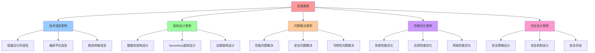

# 实践案例详细指南

## 📑 目录

- [实践案例详细指南](#实践案例详细指南)
  - [📑 目录](#-目录)
  - [1 实践案例全景](#1-实践案例全景)
  - [2 技术选型案例](#2-技术选型案例)
  - [3 架构设计案例](#3-架构设计案例)
  - [4 问题解决案例](#4-问题解决案例)

---

## 1 实践案例全景

---

## 2 技术选型案例

| 案例类型 | 案例描述 | 选型方法 | 选型结果 | 推荐度 |
|---------|---------|---------|---------|--------|
| **容器运行时选型** | 选择containerd vs CRI-O | 矩阵视角+技术选型框架 | containerd | ⭐⭐⭐⭐⭐ |
| **编排平台选型** | 选择Kubernetes vs Docker Swarm | 矩阵视角+决策树 | Kubernetes | ⭐⭐⭐⭐⭐ |
| **服务网格选型** | 选择Istio vs Linkerd | 矩阵视角+技术选型框架 | Istio | ⭐⭐⭐⭐⭐ |
| **存储方案选型** | 选择本地存储 vs 网络存储 | 矩阵视角+资源模型 | 网络存储 | ⭐⭐⭐⭐ |
| **网络方案选型** | 选择CNI vs 其他方案 | 矩阵视角+技术选型框架 | CNI | ⭐⭐⭐⭐ |

**推荐度说明**：
- **⭐⭐⭐⭐⭐**：强烈推荐
- **⭐⭐⭐⭐**：推荐
- **⭐⭐⭐**：可选

---

## 3 架构设计案例

| 案例类型 | 案例描述 | 设计方法 | 设计结果 | 推荐度 |
|---------|---------|---------|---------|--------|
| **微服务架构设计** | 电商平台微服务架构 | 结构视角+架构模式 | 微服务架构 | ⭐⭐⭐⭐⭐ |
| **Serverless架构设计** | 无服务器应用架构 | 结构视角+Serverless模式 | Serverless架构 | ⭐⭐⭐⭐⭐ |
| **边缘架构设计** | 边缘计算架构 | 结构视角+边缘模式 | 边缘架构 | ⭐⭐⭐⭐ |
| **混合云架构设计** | 混合云架构设计 | 结构视角+分布式模型 | 混合云架构 | ⭐⭐⭐⭐ |
| **多租户架构设计** | 多租户架构设计 | 结构视角+隔离模型 | 多租户架构 | ⭐⭐⭐⭐ |

**推荐度说明**：
- **⭐⭐⭐⭐⭐**：强烈推荐
- **⭐⭐⭐⭐**：推荐
- **⭐⭐⭐**：可选

---

## 4 问题解决案例

| 案例类型 | 案例描述 | 解决方法 | 解决结果 | 推荐度 |
|---------|---------|---------|---------|--------|
| **性能问题解决** | 系统性能瓶颈 | 调度视角+性能优化 | 性能提升50% | ⭐⭐⭐⭐⭐ |
| **安全问题解决** | 安全漏洞修复 | 安全模型+安全策略 | 安全加固 | ⭐⭐⭐⭐⭐ |
| **可用性问题解决** | 系统可用性提升 | 分布式模型+可靠性优化 | 可用性提升 | ⭐⭐⭐⭐ |
| **成本问题解决** | 成本优化 | 资源模型+成本优化 | 成本降低30% | ⭐⭐⭐⭐ |
| **扩展性问题解决** | 系统扩展性提升 | 结构视角+架构优化 | 扩展性提升 | ⭐⭐⭐⭐ |

**推荐度说明**：
- **⭐⭐⭐⭐⭐**：强烈推荐
- **⭐⭐⭐⭐**：推荐
- **⭐⭐⭐**：可选

---

## 5 性能优化案例

| 案例类型 | 案例描述 | 优化方法 | 优化结果 | 推荐度 |
|---------|---------|---------|---------|--------|
| **系统性能优化** | 系统整体性能优化 | 调度视角+资源模型 | 性能提升40% | ⭐⭐⭐⭐⭐ |
| **应用性能优化** | 应用性能优化 | 调度视角+应用优化 | 性能提升30% | ⭐⭐⭐⭐ |
| **网络性能优化** | 网络性能优化 | 网络概念+网络优化 | 网络性能提升 | ⭐⭐⭐⭐ |
| **存储性能优化** | 存储性能优化 | 存储概念+存储优化 | 存储性能提升 | ⭐⭐⭐⭐ |
| **数据库性能优化** | 数据库性能优化 | 调度视角+数据库优化 | 数据库性能提升 | ⭐⭐⭐⭐ |

**推荐度说明**：
- **⭐⭐⭐⭐⭐**：强烈推荐
- **⭐⭐⭐⭐**：推荐
- **⭐⭐⭐**：可选

---

## 6 安全设计案例

| 案例类型 | 案例描述 | 设计方法 | 设计结果 | 推荐度 |
|---------|---------|---------|---------|--------|
| **安全策略设计** | 安全策略设计 | 安全模型+安全策略 | 安全策略完善 | ⭐⭐⭐⭐⭐ |
| **安全机制设计** | 安全机制设计 | 安全模型+安全机制 | 安全机制完善 | ⭐⭐⭐⭐⭐ |
| **安全评估** | 系统安全评估 | 安全模型+安全评估 | 安全评估完成 | ⭐⭐⭐⭐ |
| **安全加固** | 系统安全加固 | 安全模型+安全加固 | 安全加固完成 | ⭐⭐⭐⭐ |
| **安全监控** | 安全监控设计 | 安全模型+监控设计 | 安全监控完善 | ⭐⭐⭐⭐ |

**推荐度说明**：
- **⭐⭐⭐⭐⭐**：强烈推荐
- **⭐⭐⭐⭐**：推荐
- **⭐⭐⭐**：可选

---

## 7 实践案例检查清单

| 检查项 | 检查内容 | 重要性 | 推荐度 |
|--------|---------|--------|--------|
| **案例选择** | 案例评估、案例选择、案例验证 | 极高 | ⭐⭐⭐⭐⭐ |
| **方法应用** | 方法应用、方法验证、方法优化 | 高 | ⭐⭐⭐⭐⭐ |
| **效果评估** | 效果测量、效果分析、效果报告 | 中 | ⭐⭐⭐⭐ |

**推荐度说明**：
- **⭐⭐⭐⭐⭐**：强烈推荐
- **⭐⭐⭐⭐**：推荐
- **⭐⭐⭐**：可选

---

**最后更新**：2025-11-07
**文档状态**：✅ 完整 | 📊 包含实践案例详细指南 | 🎯 生产就绪
**维护者**：项目团队
