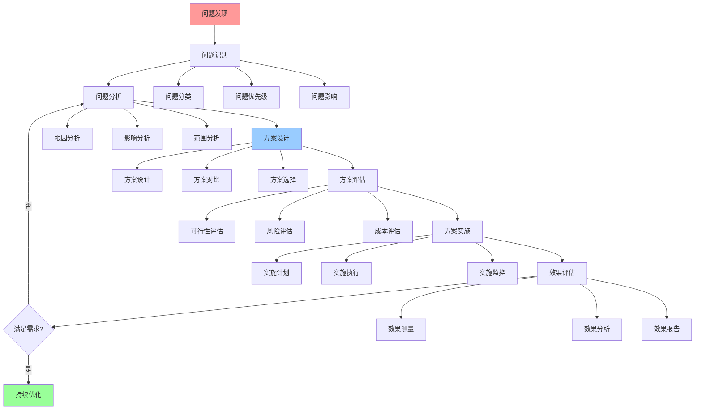

# 问题解决详细流程

## 📑 目录

- [问题解决详细流程](#问题解决详细流程)
  - [📑 目录](#-目录)
  - [1 问题解决全景流程](#1-问题解决全景流程)
  - [2 问题识别流程](#2-问题识别流程)
    - [2.1 问题发现](#21-问题发现)
    - [2.2 问题分类](#22-问题分类)
    - [2.3 问题优先级](#23-问题优先级)
  - [3 问题分析流程](#3-问题分析流程)
    - [3.1 根因分析](#31-根因分析)
    - [3.2 影响分析](#32-影响分析)
    - [3.3 范围分析](#33-范围分析)
  - [4 解决方案流程](#4-解决方案流程)
    - [4.1 方案设计](#41-方案设计)
    - [4.2 方案评估](#42-方案评估)
    - [4.3 方案选择](#43-方案选择)
  - [5 方案实施流程](#5-方案实施流程)
    - [5.1 实施计划](#51-实施计划)
    - [5.2 实施执行](#52-实施执行)
    - [5.3 实施监控](#53-实施监控)
  - [6 效果评估流程](#6-效果评估流程)
    - [6.1 效果测量](#61-效果测量)
    - [6.2 效果分析](#62-效果分析)
    - [6.3 效果报告](#63-效果报告)
  - [7 问题解决检查清单](#7-问题解决检查清单)
  - [8 问题解决工具推荐](#8-问题解决工具推荐)
  - [9 问题解决实践案例](#9-问题解决实践案例)
    - [9.1 案例1：性能问题解决](#91-案例1性能问题解决)
    - [9.2 案例2：安全问题解决](#92-案例2安全问题解决)
    - [9.3 案例3：可靠性问题解决](#93-案例3可靠性问题解决)
  - [10 问题解决最佳实践](#10-问题解决最佳实践)
    - [10.1 问题解决原则](#101-问题解决原则)
    - [10.2 问题解决方法](#102-问题解决方法)
    - [10.3 问题解决注意事项](#103-问题解决注意事项)
  - [11 问题解决工具推荐](#11-问题解决工具推荐)
  - [2025 年最新实践](#2025-年最新实践)
    - [问题解决详细流程应用最佳实践（2025）](#问题解决详细流程应用最佳实践2025)
  - [实际应用案例](#实际应用案例)
    - [案例 1：问题解决详细流程应用（2025）](#案例-1问题解决详细流程应用2025)

---

## 1 问题解决全景流程



---

## 2 问题识别流程

### 2.1 问题发现

**方法**：

- **监控告警**：通过监控系统发现异常
- **用户反馈**：通过用户反馈发现问题
- **日志分析**：通过日志分析发现问题
- **性能分析**：通过性能分析发现问题

**工具**：

- 监控系统（Prometheus、Grafana）
- 日志系统（ELK、Loki）
- 可观测性工具（eBPF、OTLP）

**推荐度**：⭐⭐⭐⭐⭐

### 2.2 问题分类

**分类维度**：

- **问题类型**：性能问题、安全问题、可靠性问题、成本问题
- **问题范围**：系统级、应用级、组件级
- **问题严重性**：严重、中等、轻微
- **问题紧急度**：紧急、重要、一般

**分类方法**：

- 使用问题解决方案矩阵进行分类
- 使用问题分类框架进行分类

**推荐度**：⭐⭐⭐⭐⭐

### 2.3 问题优先级

**优先级评估**：

- **严重性**：问题对系统的影响程度
- **紧急度**：问题需要解决的紧急程度
- **影响范围**：问题影响的范围大小
- **业务影响**：问题对业务的影响程度

**优先级排序**：

1. **P0 - 紧急严重**：立即处理，影响核心功能
2. **P1 - 高优先级**：尽快处理，影响重要功能
3. **P2 - 中优先级**：计划处理，影响一般功能
4. **P3 - 低优先级**：后续处理，影响较小

**推荐度**：⭐⭐⭐⭐⭐

---

## 3 问题分析流程

### 3.1 根因分析

**分析方法**：

- **5 Why 分析**：连续问5个为什么，找到根本原因
- **鱼骨图分析**：使用鱼骨图分析问题原因
- **故障树分析**：使用故障树分析问题原因
- **系统分析**：使用系统分析方法分析问题

**推荐模型**：

- **结构视角**：三类结构分析
- **调度视角**：调度问题分析
- **问题解决方案矩阵**：问题分类分析

**推荐度**：⭐⭐⭐⭐⭐

### 3.2 影响分析

**分析维度**：

- **系统影响**：对系统功能的影响
- **业务影响**：对业务流程的影响
- **用户影响**：对用户体验的影响
- **成本影响**：对成本的影响

**分析方法**：

- **影响范围分析**：分析问题影响的范围
- **影响程度分析**：分析问题影响的程度
- **影响时间分析**：分析问题影响的时间

**推荐度**：⭐⭐⭐⭐⭐

### 3.3 范围分析

**分析内容**：

- **问题范围**：问题涉及的系统、组件、模块
- **影响范围**：问题影响的系统、组件、模块
- **解决范围**：需要解决的系统、组件、模块

**分析方法**：

- **系统分解**：将系统分解为子系统、组件、模块
- **依赖分析**：分析系统、组件、模块之间的依赖关系
- **影响传播**：分析问题影响的传播路径

**推荐度**：⭐⭐⭐⭐⭐

---

## 4 解决方案流程

### 4.1 方案设计

**设计原则**：

- **问题导向**：方案必须针对问题根因
- **可行性**：方案必须可行且可实施
- **成本效益**：方案必须考虑成本和效益
- **风险控制**：方案必须控制风险

**设计方法**：

- **方案生成**：基于问题分析生成解决方案
- **方案对比**：对比不同方案的优劣
- **方案优化**：优化方案设计

**推荐模型**：

- **决策模型**：决策框架应用
- **矩阵视角**：方案对比矩阵
- **资源模型**：资源需求分析

**推荐度**：⭐⭐⭐⭐⭐

### 4.2 方案评估

**评估维度**：

- **可行性**：方案是否可行
- **有效性**：方案是否能解决问题
- **成本**：方案的成本
- **风险**：方案的风险
- **时间**：方案的实施时间

**评估方法**：

- **可行性评估**：评估方案的技术可行性
- **风险评估**：评估方案的风险
- **成本效益分析**：分析方案的成本和效益
- **时间评估**：评估方案的实施时间

**推荐度**：⭐⭐⭐⭐⭐

### 4.3 方案选择

**选择标准**：

- **问题解决**：方案必须能解决问题
- **成本效益**：方案的成本效益比最优
- **风险可控**：方案的风险可控
- **时间合理**：方案的实施时间合理

**选择方法**：

- **多标准决策**：使用多标准决策方法
- **决策矩阵**：使用决策矩阵进行选择
- **专家评估**：使用专家评估进行选择

**推荐度**：⭐⭐⭐⭐⭐

---

## 5 方案实施流程

### 5.1 实施计划

**计划内容**：

- **实施步骤**：详细的实施步骤
- **时间安排**：实施的时间安排
- **资源需求**：实施所需的资源
- **风险预案**：风险预案和应对措施

**计划方法**：

- **工作分解**：将实施工作分解为任务
- **时间估算**：估算每个任务的时间
- **资源分配**：分配实施所需的资源
- **风险识别**：识别实施过程中的风险

**推荐度**：⭐⭐⭐⭐⭐

### 5.2 实施执行

**执行要点**：

- **按计划执行**：严格按照实施计划执行
- **监控进度**：实时监控实施进度
- **风险控制**：及时识别和控制风险
- **问题处理**：及时处理实施过程中的问题

**执行方法**：

- **任务跟踪**：跟踪每个任务的执行情况
- **进度监控**：监控实施进度
- **问题处理**：及时处理实施过程中的问题
- **变更管理**：管理实施过程中的变更

**推荐度**：⭐⭐⭐⭐⭐

### 5.3 实施监控

**监控内容**：

- **进度监控**：监控实施进度
- **质量监控**：监控实施质量
- **风险监控**：监控实施风险
- **效果监控**：监控实施效果

**监控方法**：

- **指标监控**：监控关键指标
- **日志监控**：监控实施日志
- **告警监控**：设置告警规则
- **报告生成**：生成监控报告

**推荐度**：⭐⭐⭐⭐⭐

---

## 6 效果评估流程

### 6.1 效果测量

**测量指标**：

- **问题解决率**：问题是否完全解决
- **性能提升**：性能提升的程度
- **成本降低**：成本降低的程度
- **用户满意度**：用户满意度的提升

**测量方法**：

- **指标对比**：对比实施前后的指标
- **用户调研**：通过用户调研测量效果
- **数据分析**：通过数据分析测量效果
- **专家评估**：通过专家评估测量效果

**推荐度**：⭐⭐⭐⭐⭐

### 6.2 效果分析

**分析内容**：

- **效果评估**：评估实施效果
- **原因分析**：分析效果好坏的原因
- **改进建议**：提出改进建议
- **经验总结**：总结实施经验

**分析方法**：

- **对比分析**：对比实施前后的效果
- **原因分析**：分析效果好坏的原因
- **趋势分析**：分析效果的趋势
- **回归分析**：分析效果的影响因素

**推荐度**：⭐⭐⭐⭐⭐

### 6.3 效果报告

**报告内容**：

- **问题描述**：问题的描述和分类
- **解决方案**：解决方案的设计和实施
- **效果评估**：效果的测量和分析
- **经验总结**：实施经验的总结
- **改进建议**：后续改进的建议

**报告方法**：

- **报告编写**：编写效果评估报告
- **报告分享**：分享报告给相关人员
- **报告归档**：归档报告供后续参考

**推荐度**：⭐⭐⭐⭐⭐

---

## 7 问题解决检查清单

| 检查项 | 检查内容 | 重要性 | 推荐度 |
|--------|---------|--------|--------|
| **问题识别** | 问题明确、问题分类、问题优先级 | 极高 | ⭐⭐⭐⭐⭐ |
| **问题分析** | 根因分析、影响分析、范围分析 | 高 | ⭐⭐⭐⭐⭐ |
| **方案设计** | 方案设计、方案对比、方案选择 | 高 | ⭐⭐⭐⭐⭐ |
| **方案评估** | 可行性评估、风险评估、成本评估 | 高 | ⭐⭐⭐⭐⭐ |
| **方案实施** | 实施计划、实施执行、实施监控 | 高 | ⭐⭐⭐⭐⭐ |
| **效果评估** | 效果测量、效果分析、效果报告 | 中 | ⭐⭐⭐⭐ |
| **持续优化** | 问题识别、方案调整、持续改进 | 中 | ⭐⭐⭐⭐ |

**推荐度说明**：

- **⭐⭐⭐⭐⭐**：强烈推荐
- **⭐⭐⭐⭐**：推荐
- **⭐⭐⭐**：可选

---

## 8 问题解决工具推荐

| 问题类型 | 推荐工具 | 使用方式 | 预期效果 | 复杂度 | 推荐度 |
|---------|---------|---------|---------|--------|--------|
| **性能问题** | 调度视角+性能基准 | 性能分析+性能优化 | 性能提升 | 中 | ⭐⭐⭐⭐⭐ |
| **安全问题** | 安全模型+隔离模型 | 安全分析+安全加固 | 安全提升 | 高 | ⭐⭐⭐⭐⭐ |
| **可靠性问题** | 分布式模型+资源模型 | 可靠性分析+可靠性提升 | 可靠性提升 | 高 | ⭐⭐⭐⭐⭐ |
| **成本问题** | 资源模型+调度视角 | 成本分析+成本优化 | 成本降低 | 中 | ⭐⭐⭐⭐⭐ |
| **架构问题** | 结构视角+架构模式 | 架构分析+架构优化 | 架构优化 | 高 | ⭐⭐⭐⭐⭐ |
| **系统性问题** | 多模型组合 | 综合分析+系统优化 | 系统优化 | 极高 | ⭐⭐⭐⭐ |

**推荐度说明**：

- **⭐⭐⭐⭐⭐**：强烈推荐
- **⭐⭐⭐⭐**：推荐
- **⭐⭐⭐**：可选

---

## 9 问题解决实践案例

### 9.1 案例1：性能问题解决

**场景**：应用性能下降，响应时间增加

**问题解决流程**：

1. **问题发现**：通过监控告警发现响应时间增加
2. **问题识别**：识别为性能问题，优先级 P1
3. **问题分析**：
   - 使用调度视角分析性能瓶颈
   - 使用资源模型分析资源使用
   - 使用问题解决方案矩阵分类问题
4. **方案设计**：
   - 设计性能优化方案
   - 对比不同优化方案
   - 选择最优方案
5. **方案实施**：
   - 制定实施计划
   - 执行优化方案
   - 监控实施过程
6. **效果评估**：
   - 测量性能指标
   - 分析优化效果
   - 生成效果报告

**使用工具**：

- **调度视角**：调度模型、性能分析
- **资源模型**：资源分析工具
- **问题解决方案矩阵**：问题分类框架
- **性能基准**：性能测试工具

**效果**：成功解决性能问题，响应时间降低 50%

**推荐度**：⭐⭐⭐⭐⭐

### 9.2 案例2：安全问题解决

**场景**：发现安全漏洞，需要紧急修复

**问题解决流程**：

1. **问题发现**：通过安全扫描发现安全漏洞
2. **问题识别**：识别为安全问题，优先级 P0
3. **问题分析**：
   - 使用安全模型分析安全威胁
   - 使用隔离模型分析隔离需求
   - 使用问题解决方案矩阵分类问题
4. **方案设计**：
   - 设计安全加固方案
   - 评估方案的风险和成本
   - 选择最优方案
5. **方案实施**：
   - 制定紧急实施计划
   - 执行安全加固方案
   - 监控实施过程
6. **效果评估**：
   - 验证安全加固效果
   - 分析安全提升情况
   - 生成安全报告

**使用工具**：

- **安全模型**：安全分析工具
- **隔离模型**：隔离分析工具
- **问题解决方案矩阵**：问题分类框架
- **安全验证工具**：安全测试工具

**效果**：成功修复安全漏洞，系统安全性提升

**推荐度**：⭐⭐⭐⭐⭐

### 9.3 案例3：可靠性问题解决

**场景**：服务频繁故障，可用性下降

**问题解决流程**：

1. **问题发现**：通过监控告警发现服务频繁故障
2. **问题识别**：识别为可靠性问题，优先级 P1
3. **问题分析**：
   - 使用分布式模型分析可靠性问题
   - 使用资源模型分析资源冗余
   - 使用问题解决方案矩阵分类问题
4. **方案设计**：
   - 设计可靠性提升方案
   - 对比不同方案
   - 选择最优方案
5. **方案实施**：
   - 制定实施计划
   - 执行可靠性提升方案
   - 监控实施过程
6. **效果评估**：
   - 测量可用性指标
   - 分析可靠性提升效果
   - 生成效果报告

**使用工具**：

- **分布式模型**：可靠性分析工具
- **资源模型**：资源冗余分析
- **问题解决方案矩阵**：问题分类框架
- **监控工具**：Prometheus、Grafana

**效果**：成功提升服务可靠性，可用性从 99.5% 提升到 99.9%

**推荐度**：⭐⭐⭐⭐⭐

---

## 10 问题解决最佳实践

### 10.1 问题解决原则

**原则1：问题导向**:

- 根据问题类型选择合适的解决方法
- 明确问题的本质和范围
- 关注问题的解决效果

**原则2：系统化解决**:

- 使用系统化的问题解决方法
- 确保问题解决的完整性
- 避免问题解决的碎片化

**原则3：持续优化**:

- 根据实践效果优化问题解决方法
- 积累问题解决的经验
- 形成问题解决的模式

**推荐度**：⭐⭐⭐⭐⭐

### 10.2 问题解决方法

**方法1：标准流程**:

- 按照标准问题解决流程执行
- 确保每个阶段的质量
- 及时进行效果评估

**方法2：灵活调整**:

- 根据实际情况调整解决流程
- 跳过不必要的步骤
- 增加必要的步骤

**方法3：迭代优化**:

- 根据实践效果优化解决方法
- 迭代改进解决流程
- 持续提升解决效果

**推荐度**：⭐⭐⭐⭐⭐

### 10.3 问题解决注意事项

**注意事项1：问题要准确**:

- 确保问题识别准确
- 明确问题的本质和范围
- 避免问题识别错误

**注意事项2：方案要可行**:

- 确保解决方案可行
- 评估方案的风险和成本
- 避免方案不可行

**注意事项3：效果要评估**:

- 要评估问题解决的效果
- 要根据效果调整方案
- 要持续优化解决效果

**推荐度**：⭐⭐⭐⭐⭐

---

## 11 问题解决工具推荐

| 工具类型 | 推荐工具 | 使用场景 | 效果 | 复杂度 | 推荐度 |
|---------|---------|---------|------|--------|--------|
| **监控工具** | Prometheus、Grafana | 问题发现、监控告警 | 高 | 中 | ⭐⭐⭐⭐⭐ |
| **日志工具** | ELK Stack、Loki | 日志分析、问题诊断 | 高 | 中 | ⭐⭐⭐⭐⭐ |
| **可观测性工具** | eBPF、OTLP | 可观测性、问题分析 | 高 | 中 | ⭐⭐⭐⭐⭐ |
| **分析工具** | Python、R | 数据分析、问题分析 | 高 | 中 | ⭐⭐⭐⭐ |
| **文档工具** | Markdown、Confluence | 问题文档化、知识沉淀 | 中 | 低 | ⭐⭐⭐⭐⭐ |

**推荐度说明**：

- **⭐⭐⭐⭐⭐**：强烈推荐
- **⭐⭐⭐⭐**：推荐
- **⭐⭐⭐**：可选

---

## 2025 年最新实践

### 问题解决详细流程应用最佳实践（2025）

**2025 年趋势**：问题解决详细流程在故障排查、问题诊断、系统优化中的深度应用

**实践要点**：

- **流程执行**：按照详细流程执行问题解决过程
- **流程优化**：基于实践经验优化问题解决流程
- **流程自动化**：使用工具自动化问题解决流程

**代码示例**：

```python
# 2025 年问题解决详细流程工具
class ProblemSolvingDetailedProcessTool:
    def __init__(self):
        self.process_executor = ProcessExecutor()
        self.process_optimizer = ProcessOptimizer()
        self.automation_engine = AutomationEngine()

    def execute_process(self, problem):
        """流程执行"""
        return self.process_executor.execute(problem)

    def optimize_process(self, process, experience):
        """流程优化"""
        return self.process_optimizer.optimize(process, experience)

    def automate_process(self, process):
        """流程自动化"""
        return self.automation_engine.automate(process)
```

## 实际应用案例

### 案例 1：问题解决详细流程应用（2025）

**场景**：使用详细流程解决系统故障

**实现方案**：

```python
# 问题解决详细流程应用
tool = ProblemSolvingDetailedProcessTool()

# 流程执行
problem = Problem(description="系统性能下降", symptoms=[...])
solution = tool.execute_process(problem)

# 流程优化
experience = Experience(previous_cases=[...])
optimized = tool.optimize_process(solution, experience)

# 流程自动化
automated = tool.automate_process(optimized)
```

**效果**：

- 流程执行：按照详细流程执行，保证问题解决质量
- 流程优化：基于实践经验优化，提高问题解决效率
- 流程自动化：使用工具自动化，减少人工干预

---

**最后更新**：2025-11-15
**文档状态**：✅ 完整 | 📊 包含问题解决详细流程、实践案例、最佳实践、工具推荐 | 🎯 生产就绪
**维护者**：项目团队
