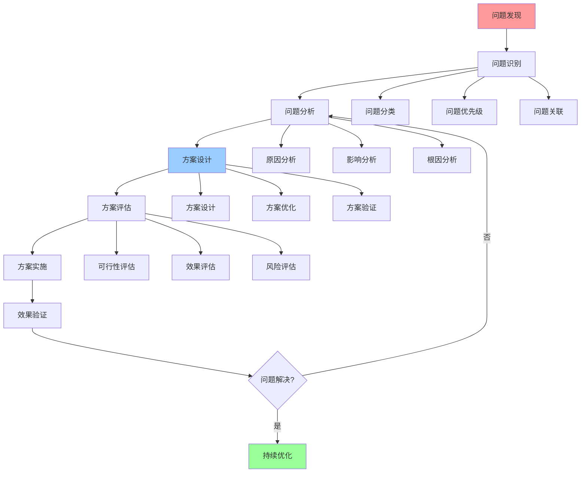
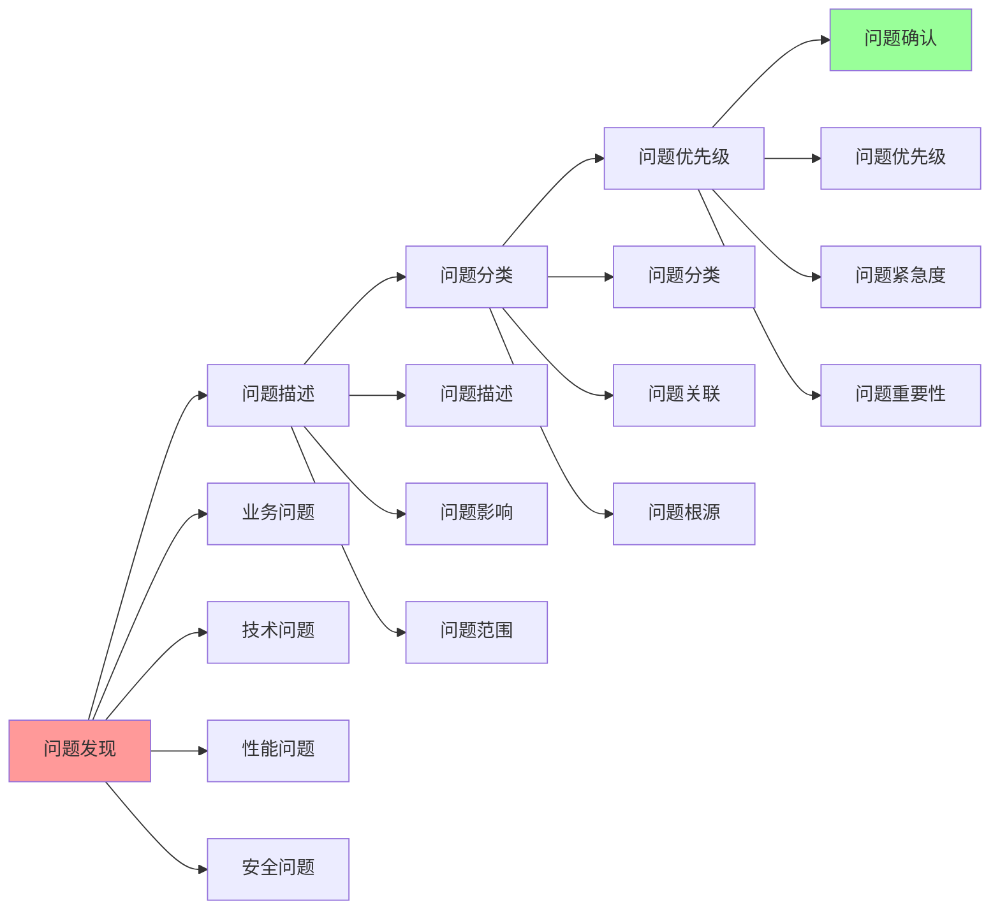
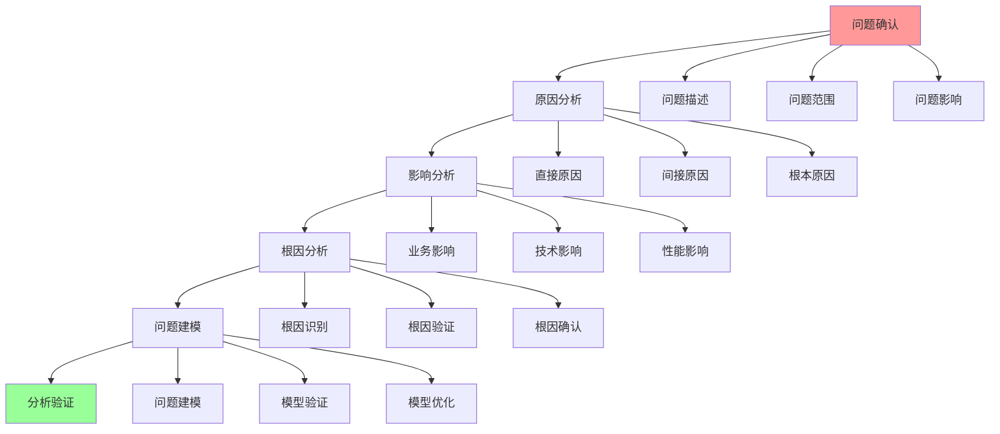
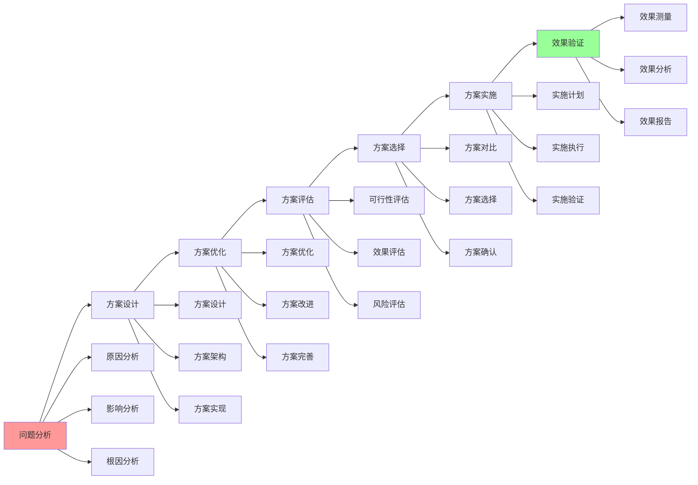

# 问题解决详细流程

## 📑 目录

- [问题解决详细流程](#问题解决详细流程)
  - [📑 目录](#-目录)
  - [1 问题解决全景流程](#1-问题解决全景流程)
  - [2 问题识别流程](#2-问题识别流程)
  - [3 问题分析流程](#3-问题分析流程)
  - [4 解决方案流程](#4-解决方案流程)

---

## 1 问题解决全景流程

---

## 2 问题识别流程

---

## 3 问题分析流程

---

## 4 解决方案流程

---

## 5 问题解决检查清单

| 检查项 | 检查内容 | 重要性 | 推荐度 |
|--------|---------|--------|--------|
| **问题识别** | 问题完整、问题分类、问题优先级 | 极高 | ⭐⭐⭐⭐⭐ |
| **问题分析** | 原因分析、影响分析、根因分析 | 高 | ⭐⭐⭐⭐⭐ |
| **方案设计** | 方案完整、方案可行、方案优化 | 高 | ⭐⭐⭐⭐⭐ |
| **方案评估** | 可行性评估、效果评估、风险评估 | 高 | ⭐⭐⭐⭐⭐ |
| **方案实施** | 实施计划、实施执行、实施验证 | 高 | ⭐⭐⭐⭐⭐ |
| **效果验证** | 效果测量、效果分析、效果报告 | 中 | ⭐⭐⭐⭐ |

**推荐度说明**：
- **⭐⭐⭐⭐⭐**：强烈推荐
- **⭐⭐⭐⭐**：推荐
- **⭐⭐⭐**：可选

---

**最后更新**：2025-11-07
**文档状态**：✅ 完整 | 📊 包含问题解决详细流程 | 🎯 生产就绪
**维护者**：项目团队
