# 认知学习策略指南

## 📑 目录

- [认知学习策略指南](#认知学习策略指南)
  - [📑 目录](#-目录)
  - [1 认知学习全景](#1-认知学习全景)
  - [2 学习策略](#2-学习策略)
  - [3 学习方法](#3-学习方法)
  - [4 学习效果评估](#4-学习效果评估)
  - [5 学习策略检查清单](#5-学习策略检查清单)

---

## 1 认知学习全景

```mermaid
graph TB
    A[学习目标] --> B[学习策略]
    B --> C[学习方法]
    C --> D[学习实践]
    D --> E[学习评估]
    E --> F{学习效果}
    F -->|未达标| C
    F -->|达标| G[持续优化]

    A --> A1[知识理解]
    A --> A2[技能掌握]
    A --> A3[思维提升]

    B --> B1[系统学习]
    B --> B2[问题驱动]
    B --> B3[实践导向]

    C --> C1[理论学习]
    C --> C2[实践学习]
    C --> C3[反思学习]

    D --> D1[项目实践]
    D --> D2[案例分析]
    D --> D3[问题解决]

    E --> E1[知识测试]
    E --> E2[技能评估]
    E --> E3[思维评估]

    style A fill:#ff9999
    style G fill:#99ff99
```



---

## 2 学习策略

| 策略类型 | 策略描述 | 适用场景 | 预期效果 | 推荐度 |
|---------|---------|---------|---------|--------|
| **系统学习** | 按照知识体系系统学习 | 新手入门、知识体系建立 | 知识系统化 | ⭐⭐⭐⭐⭐ |
| **问题驱动** | 以问题为导向学习 | 问题解决、技能提升 | 问题解决能力提升 | ⭐⭐⭐⭐⭐ |
| **实践导向** | 以实践为主学习 | 技能掌握、项目实践 | 实践能力提升 | ⭐⭐⭐⭐⭐ |
| **对比学习** | 通过对比学习 | 技术选型、方案对比 | 理解深度提升 | ⭐⭐⭐⭐ |
| **案例学习** | 通过案例学习 | 架构设计、问题解决 | 应用能力提升 | ⭐⭐⭐⭐ |
| **反思学习** | 通过反思学习 | 经验总结、思维提升 | 思维深度提升 | ⭐⭐⭐⭐ |

**推荐度说明**：

- **⭐⭐⭐⭐⭐**：强烈推荐
- **⭐⭐⭐⭐**：推荐
- **⭐⭐⭐**：可选

---

## 3 学习方法

| 方法类型 | 方法描述 | 使用步骤 | 预期效果 | 推荐度 |
|---------|---------|---------|---------|--------|
| **理论学习** | 阅读理论文档、理解概念 | 阅读、理解、总结、应用 | 理论理解 | ⭐⭐⭐⭐⭐ |
| **实践学习** | 动手实践、项目实战 | 实践、验证、总结、优化 | 实践能力 | ⭐⭐⭐⭐⭐ |
| **反思学习** | 反思总结、经验提炼 | 反思、总结、提炼、应用 | 思维提升 | ⭐⭐⭐⭐ |
| **讨论学习** | 讨论交流、思想碰撞 | 讨论、交流、总结、应用 | 理解深度 | ⭐⭐⭐⭐ |
| **教学学习** | 教学他人、知识输出 | 教学、总结、优化、应用 | 知识巩固 | ⭐⭐⭐⭐ |
| **工具学习** | 使用工具、提高效率 | 工具使用、效率提升、总结 | 效率提升 | ⭐⭐⭐⭐ |

**推荐度说明**：

- **⭐⭐⭐⭐⭐**：强烈推荐
- **⭐⭐⭐⭐**：推荐
- **⭐⭐⭐**：可选

---

## 4 学习效果评估


---

## 5 学习策略检查清单

| 检查项 | 检查内容 | 重要性 | 推荐度 |
|--------|---------|--------|--------|
| **学习目标** | 目标明确、目标可衡量、目标可达 | 极高 | ⭐⭐⭐⭐⭐ |
| **学习策略** | 策略选择、策略应用、策略优化 | 高 | ⭐⭐⭐⭐⭐ |
| **学习方法** | 方法选择、方法应用、方法优化 | 高 | ⭐⭐⭐⭐⭐ |
| **学习实践** | 实践计划、实践执行、实践总结 | 高 | ⭐⭐⭐⭐⭐ |
| **学习评估** | 评估方法、评估执行、评估反馈 | 中 | ⭐⭐⭐⭐ |

**推荐度说明**：

- **⭐⭐⭐⭐⭐**：强烈推荐
- **⭐⭐⭐⭐**：推荐
- **⭐⭐⭐**：可选

---

## 6 学习策略详细说明

### 6.1 系统学习策略详细说明

#### 6.1.1 知识体系建立

**策略方法**：

- **从总览开始**：从技术栈总览开始，建立整体认知框架
- **逐层深入**：按照知识层次逐层深入学习
- **建立联系**：理解不同概念之间的关系
- **知识整合**：整合不同来源的知识

**学习路径**：

1. **总览学习**：学习技术栈总览和核心理念
2. **理论学习**：学习理论视角和认知模型
3. **应用学习**：学习应用视角和实践案例
4. **决策学习**：学习决策分析和最佳实践

**预期效果**：建立系统化的知识体系，形成完整的技术认知

**推荐度**：⭐⭐⭐⭐⭐

#### 6.1.2 知识结构优化

**策略方法**：

- **知识分类**：将知识按照类型和层次分类
- **知识关联**：建立知识之间的关联关系
- **知识更新**：持续更新知识结构
- **知识验证**：通过实践验证知识结构

**学习工具**：

- 知识图谱工具：Neo4j、Gephi、Obsidian
- 笔记工具：Notion、Roam Research、LogSeq

**预期效果**：优化知识结构，提高知识检索和应用效率

**推荐度**：⭐⭐⭐⭐⭐

---

### 6.2 问题驱动学习策略详细说明

#### 6.2.1 问题识别

**策略方法**：

- **问题发现**：从实际工作中发现问题
- **问题分类**：将问题分类到具体类型
- **问题优先级**：确定问题的优先级
- **问题分析**：深入分析问题的本质

**学习路径**：

1. **问题识别**：识别学习中的问题
2. **问题分析**：分析问题的本质和原因
3. **知识查找**：查找相关的知识和模型
4. **问题解决**：应用知识解决问题
5. **经验总结**：总结解决问题的经验

**预期效果**：通过问题驱动学习，提高问题解决能力

**推荐度**：⭐⭐⭐⭐⭐

#### 6.2.2 问题解决

**策略方法**：

- **模型选择**：选择合适的认知模型
- **模型应用**：应用模型分析问题
- **方案设计**：设计解决方案
- **方案实施**：实施解决方案
- **效果评估**：评估解决方案的效果

**学习工具**：

- 问题分析工具：问题解决方案矩阵
- 模型选择工具：模型评估矩阵
- 方案设计工具：架构设计工具

**预期效果**：通过问题解决学习，提高实践能力

**推荐度**：⭐⭐⭐⭐⭐

---

### 6.3 实践导向学习策略详细说明

#### 6.3.1 项目实践

**策略方法**：

- **项目选择**：选择适合的项目进行实践
- **项目规划**：规划项目的学习目标
- **项目实施**：在项目中应用认知模型
- **项目总结**：总结项目经验和教训

**学习路径**：

1. **项目选择**：选择适合的项目
2. **知识准备**：准备相关的知识
3. **项目实践**：在项目中应用知识
4. **经验总结**：总结项目经验
5. **知识更新**：更新知识结构

**预期效果**：通过项目实践学习，提高实践能力

**推荐度**：⭐⭐⭐⭐⭐

#### 6.3.2 案例分析

**策略方法**：

- **案例选择**：选择相关的案例
- **案例分析**：使用认知模型分析案例
- **案例总结**：总结案例的经验和教训
- **案例应用**：将案例经验应用到实际项目

**学习工具**：

- 案例库：实践案例详细指南
- 分析工具：各类认知模型
- 总结工具：文档工具、笔记工具

**预期效果**：通过案例分析学习，提高分析能力

**推荐度**：⭐⭐⭐⭐⭐

---

## 7 学习方法详细说明

### 7.1 理论学习方法详细说明

#### 7.1.1 阅读方法

**方法步骤**：

1. **快速浏览**：快速浏览文档，了解整体结构
2. **重点阅读**：重点阅读关键概念和理论
3. **深入理解**：深入理解理论的内涵和外延
4. **总结归纳**：总结归纳核心观点和要点

**阅读技巧**：

- **主动阅读**：带着问题阅读，主动思考
- **笔记记录**：记录关键概念和要点
- **思维导图**：使用思维导图整理知识结构
- **反复阅读**：反复阅读加深理解

**推荐度**：⭐⭐⭐⭐⭐

#### 7.1.2 理解方法

**方法步骤**：

1. **概念理解**：理解核心概念的定义和内涵
2. **关系理解**：理解概念之间的关系
3. **应用理解**：理解概念的应用场景
4. **验证理解**：通过实践验证理解

**理解技巧**：

- **类比理解**：使用类比帮助理解
- **图示理解**：使用图表帮助理解
- **实践理解**：通过实践加深理解
- **讨论理解**：通过讨论加深理解

**推荐度**：⭐⭐⭐⭐⭐

---

### 7.2 实践学习方法详细说明

#### 7.2.1 动手实践

**方法步骤**：

1. **实践准备**：准备实践环境和工具
2. **实践执行**：按照计划执行实践
3. **实践验证**：验证实践结果
4. **实践总结**：总结实践经验和教训

**实践技巧**：

- **循序渐进**：从简单到复杂逐步实践
- **问题导向**：以问题为导向进行实践
- **持续改进**：根据实践效果持续改进
- **经验积累**：积累实践经验

**推荐度**：⭐⭐⭐⭐⭐

#### 7.2.2 项目实战

**方法步骤**：

1. **项目选择**：选择适合的项目
2. **项目规划**：规划项目的学习目标
3. **项目实施**：在项目中应用认知模型
4. **项目总结**：总结项目经验和教训

**实战技巧**：

- **目标明确**：明确项目的学习目标
- **模型应用**：在项目中应用认知模型
- **效果评估**：评估项目的学习效果
- **经验分享**：分享项目经验

**推荐度**：⭐⭐⭐⭐⭐

---

## 8 学习效果评估详细说明

### 8.1 知识评估

**评估维度**：

- **概念理解**：评估对核心概念的理解程度
- **知识应用**：评估知识的应用能力
- **知识迁移**：评估知识的迁移能力

**评估方法**：

- **测试评估**：通过测试评估知识掌握程度
- **应用评估**：通过应用评估知识应用能力
- **迁移评估**：通过迁移评估知识迁移能力

**评估工具**：

- 测试工具：知识测试题库
- 应用工具：项目实践、案例分析
- 迁移工具：问题解决、技术选型

**推荐度**：⭐⭐⭐⭐⭐

### 8.2 技能评估

**评估维度**：

- **技能掌握**：评估技能的掌握程度
- **技能应用**：评估技能的应用能力
- **技能创新**：评估技能的创新能力

**评估方法**：

- **实践评估**：通过实践评估技能掌握程度
- **应用评估**：通过应用评估技能应用能力
- **创新评估**：通过创新评估技能创新能力

**评估工具**：

- 实践工具：项目实践、案例分析
- 应用工具：技术选型、架构设计
- 创新工具：问题解决、方案设计

**推荐度**：⭐⭐⭐⭐⭐

---

## 9 学习策略实践案例

### 9.1 案例1：系统学习认知模型

**学习目标**：系统学习认知模型体系

**学习策略**：系统学习策略

**学习流程**：

1. **总览学习**：学习技术栈总览和核心理念
2. **理论学习**：学习理论视角和认知模型
3. **应用学习**：学习应用视角和实践案例
4. **决策学习**：学习决策分析和最佳实践
5. **知识整合**：整合不同来源的知识

**学习工具**：

- 思维导图：认知框架思维导图
- 知识图谱：知识图谱关系图
- 学习路径：学习路径指南

**效果**：成功建立系统化的认知模型知识体系

**推荐度**：⭐⭐⭐⭐⭐

### 9.2 案例2：问题驱动学习

**学习目标**：通过问题解决学习认知模型

**学习策略**：问题驱动学习策略

**学习流程**：

1. **问题识别**：识别技术选型问题
2. **问题分析**：分析问题的本质和原因
3. **知识查找**：查找相关的认知模型
4. **模型应用**：应用模型分析问题
5. **问题解决**：设计解决方案
6. **经验总结**：总结解决问题的经验

**学习工具**：

- 问题分析：问题解决方案矩阵
- 模型选择：模型评估矩阵
- 方案设计：技术选型决策树

**效果**：成功解决技术选型问题，提高问题解决能力

**推荐度**：⭐⭐⭐⭐⭐

---

## 10 学习策略工具推荐

| 工具类型 | 推荐工具 | 使用场景 | 效果 | 复杂度 | 推荐度 |
|---------|---------|---------|------|--------|--------|
| **知识管理工具** | Obsidian、Notion | 知识整理、知识关联 | 高 | 中 | ⭐⭐⭐⭐⭐ |
| **思维导图工具** | XMind、MindMaster | 知识结构、思维整理 | 高 | 低 | ⭐⭐⭐⭐⭐ |
| **笔记工具** | Roam Research、LogSeq | 笔记记录、知识关联 | 高 | 中 | ⭐⭐⭐⭐ |
| **学习平台** | Coursera、edX | 在线学习、课程学习 | 中 | 低 | ⭐⭐⭐⭐ |
| **实践平台** | GitHub、GitLab | 项目实践、代码实践 | 高 | 中 | ⭐⭐⭐⭐⭐ |

**推荐度说明**：

- **⭐⭐⭐⭐⭐**：强烈推荐
- **⭐⭐⭐⭐**：推荐
- **⭐⭐⭐**：可选

---

## 2025 年最新实践

### 认知学习策略应用最佳实践（2025）

**2025 年趋势**：认知学习策略在知识学习、技能提升、能力培养中的深度应用

**实践要点**：

- **策略选择**：根据学习目标选择合适的认知学习策略
- **策略应用**：系统化应用认知学习策略
- **效果评估**：持续评估和优化学习策略效果

**代码示例**：

```python
# 2025 年认知学习策略工具
class CognitiveLearningStrategyTool:
    def __init__(self):
        self.strategy_selector = StrategySelector()
        self.strategy_applicator = StrategyApplicator()
        self.effect_evaluator = EffectEvaluator()

    def select_strategy(self, learning_goal):
        """策略选择"""
        return self.strategy_selector.select(learning_goal)

    def apply_strategy(self, strategy, context):
        """策略应用"""
        return self.strategy_applicator.apply(strategy, context)

    def evaluate_effect(self, result):
        """效果评估"""
        return self.effect_evaluator.evaluate(result)
```

## 实际应用案例

### 案例 1：认知学习策略应用（2025）

**场景**：使用认知学习策略进行知识学习

**实现方案**：

```python
# 认知学习策略应用
tool = CognitiveLearningStrategyTool()

# 策略选择
goal = LearningGoal(topic="architecture", level="advanced")
strategy = tool.select_strategy(goal)

# 策略应用
context = LearningContext(resources=[...], time=...)
result = tool.apply_strategy(strategy, context)

# 效果评估
effect = tool.evaluate_effect(result)
```

**效果**：

- 策略选择：基于学习目标选择合适策略，提高学习效率
- 策略应用：系统化应用学习策略，保证学习质量
- 效果评估：持续评估和优化，提高学习效果

---

**最后更新**：2025-11-15
**文档状态**：✅ 完整 | 📊 包含认知学习策略指南、详细说明、实践案例、工具推荐 | 🎯 生产就绪
**维护者**：项目团队
