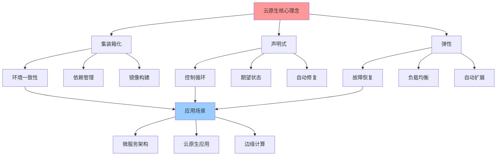
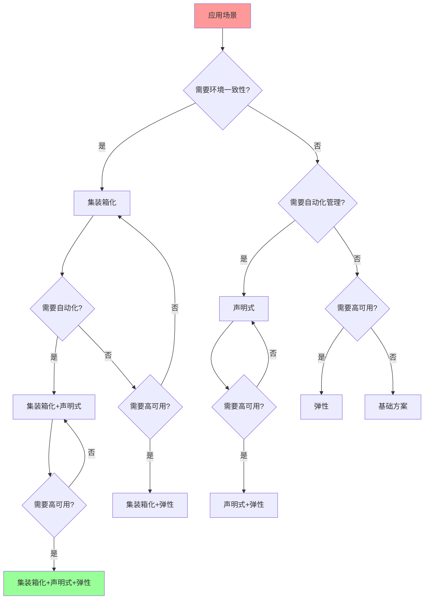

# 核心理念应用综合指南

## 📑 目录

- [核心理念应用综合指南](#核心理念应用综合指南)
  - [📑 目录](#-目录)
  - [1 核心理念全景](#1-核心理念全景)
  - [2 集装箱化应用指南](#2-集装箱化应用指南)
  - [3 声明式应用指南](#3-声明式应用指南)
  - [4 弹性应用指南](#4-弹性应用指南)
  - [5 理念组合应用](#5-理念组合应用)
  - [6 理念选择决策树](#6-理念选择决策树)
  - [7 核心理念应用检查清单](#7-核心理念应用检查清单)
  - [8 核心理念应用详细说明](#8-核心理念应用详细说明)
    - [8.1 集装箱化应用详细说明](#81-集装箱化应用详细说明)
      - [8.1.1 依赖管理应用](#811-依赖管理应用)
      - [8.1.2 环境一致性应用](#812-环境一致性应用)
    - [8.2 声明式应用详细说明](#82-声明式应用详细说明)
      - [8.2.1 配置管理应用](#821-配置管理应用)
      - [8.2.2 资源管理应用](#822-资源管理应用)
    - [8.3 弹性应用详细说明](#83-弹性应用详细说明)
      - [8.3.1 故障恢复应用](#831-故障恢复应用)
      - [8.3.2 自动扩展应用](#832-自动扩展应用)
  - [9 核心理念应用实践案例](#9-核心理念应用实践案例)
    - [9.1 案例1：微服务架构应用](#91-案例1微服务架构应用)
    - [9.2 案例2：Serverless应用](#92-案例2serverless应用)
  - [10 核心理念应用最佳实践](#10-核心理念应用最佳实践)
    - [10.1 应用原则](#101-应用原则)
    - [10.2 应用方法](#102-应用方法)
    - [10.3 应用注意事项](#103-应用注意事项)
  - [11 核心理念应用工具推荐](#11-核心理念应用工具推荐)
  - [12 2025 年最新实践](#12-2025-年最新实践)
    - [12.1 核心理念应用在云原生技术选型中的应用（2025）](#121-核心理念应用在云原生技术选型中的应用2025)
    - [12.2 核心理念应用在架构设计中的应用（2025）](#122-核心理念应用在架构设计中的应用2025)
  - [13 实际应用案例](#13-实际应用案例)
    - [案例 1：微服务架构设计（2025）](#案例-1微服务架构设计2025)
    - [案例 2：Serverless 平台设计（2025）](#案例-2serverless-平台设计2025)

---

## 1 核心理念全景



---

## 2 集装箱化应用指南

| 应用场景 | 问题域 | 解决方案 | 技术实现 | 推荐度 |
|---------|--------|---------|---------|--------|
| **依赖管理** | 依赖地狱、版本冲突 | 镜像分层、多阶段构建 | Docker、BuildKit | ⭐⭐⭐⭐⭐ |
| **环境一致性** | 环境不一致、"在我机器能跑" | 镜像不变性、OCI标准 | OCI Image Spec | ⭐⭐⭐⭐⭐ |
| **镜像优化** | 镜像体积大、构建慢 | Distroless/Scratch、多阶段构建 | Distroless、BuildKit | ⭐⭐⭐⭐⭐ |
| **镜像安全** | 镜像安全、供应链安全 | 镜像签名、SBOM | Notary、SBOM工具 | ⭐⭐⭐⭐ |
| **跨平台部署** | 平台差异、架构差异 | 多架构镜像、OCI标准 | Buildx、OCI | ⭐⭐⭐⭐ |

**推荐度说明**：

- **⭐⭐⭐⭐⭐**：强烈推荐
- **⭐⭐⭐⭐**：推荐
- **⭐⭐⭐**：可选

---

## 3 声明式应用指南

| 应用场景 | 问题域 | 解决方案 | 技术实现 | 推荐度 |
|---------|--------|---------|---------|--------|
| **配置管理** | 配置分散、配置不一致 | 声明式配置、配置即代码 | Kubernetes、Helm | ⭐⭐⭐⭐⭐ |
| **资源管理** | 资源状态不一致、手动操作 | 期望状态、控制循环 | Kubernetes Controller | ⭐⭐⭐⭐⭐ |
| **自动修复** | 服务故障、配置漂移 | 自动修复、状态同步 | Kubernetes、ArgoCD | ⭐⭐⭐⭐⭐ |
| **基础设施即代码** | 基础设施手动管理 | 声明式IaC、版本控制 | Terraform、Pulumi | ⭐⭐⭐⭐ |
| **GitOps** | 部署流程复杂、环境不一致 | GitOps、声明式部署 | ArgoCD、Flux | ⭐⭐⭐⭐ |

**推荐度说明**：

- **⭐⭐⭐⭐⭐**：强烈推荐
- **⭐⭐⭐⭐**：推荐
- **⭐⭐⭐**：可选

---

## 4 弹性应用指南

| 应用场景 | 问题域 | 解决方案 | 技术实现 | 推荐度 |
|---------|--------|---------|---------|--------|
| **故障恢复** | 服务故障、单点故障 | 故障隔离、自动恢复 | Kubernetes、Service Mesh | ⭐⭐⭐⭐⭐ |
| **负载均衡** | 负载不均、性能瓶颈 | 负载均衡、流量分发 | Kubernetes Service、Istio | ⭐⭐⭐⭐⭐ |
| **自动扩展** | 资源不足、资源浪费 | 自动扩缩容、弹性伸缩 | HPA、VPA、KEDA | ⭐⭐⭐⭐⭐ |
| **熔断降级** | 服务过载、级联故障 | 熔断器、降级策略 | Istio、Resilience4j | ⭐⭐⭐⭐ |
| **限流保护** | 流量突增、服务过载 | 限流、流量控制 | Istio、Envoy | ⭐⭐⭐⭐ |

**推荐度说明**：

- **⭐⭐⭐⭐⭐**：强烈推荐
- **⭐⭐⭐⭐**：推荐
- **⭐⭐⭐**：可选

---

## 5 理念组合应用

| 组合场景 | 理念组合 | 应用方式 | 预期效果 | 推荐度 |
|---------|---------|---------|---------|--------|
| **云原生应用** | 集装箱化+声明式+弹性 | 容器化部署、声明式配置、弹性伸缩 | 高可用、可扩展 | ⭐⭐⭐⭐⭐ |
| **微服务架构** | 集装箱化+声明式 | 容器化服务、声明式服务管理 | 服务治理、自动化 | ⭐⭐⭐⭐⭐ |
| **边缘计算** | 集装箱化+弹性 | 容器化部署、边缘弹性 | 边缘部署、高可用 | ⭐⭐⭐⭐ |
| **Serverless** | 声明式+弹性 | 声明式函数、自动扩缩容 | 按需付费、自动扩展 | ⭐⭐⭐⭐ |
| **混合云** | 集装箱化+声明式+弹性 | 跨云部署、统一管理、弹性扩展 | 多云管理、高可用 | ⭐⭐⭐⭐ |

**推荐度说明**：

- **⭐⭐⭐⭐⭐**：强烈推荐
- **⭐⭐⭐⭐**：推荐
- **⭐⭐⭐**：可选

---

## 6 理念选择决策树



---

## 7 核心理念应用检查清单

| 检查项 | 检查内容 | 重要性 | 推荐度 |
|--------|---------|--------|--------|
| **场景识别** | 场景分析、问题识别、需求分析 | 极高 | ⭐⭐⭐⭐⭐ |
| **理念选择** | 理念评估、理念选择、理念验证 | 高 | ⭐⭐⭐⭐⭐ |
| **技术实现** | 技术选型、技术实施、技术验证 | 高 | ⭐⭐⭐⭐⭐ |
| **效果评估** | 效果测量、效果分析、效果报告 | 中 | ⭐⭐⭐⭐ |

**推荐度说明**：

- **⭐⭐⭐⭐⭐**：强烈推荐
- **⭐⭐⭐⭐**：推荐
- **⭐⭐⭐**：可选

---

## 8 核心理念应用详细说明

### 8.1 集装箱化应用详细说明

#### 8.1.1 依赖管理应用

**问题域**：依赖地狱、版本冲突

**解决方案**：

- **镜像分层**：使用镜像分层技术管理依赖
- **多阶段构建**：使用多阶段构建优化依赖管理
- **依赖锁定**：使用依赖锁定文件确保版本一致性

**技术实现**：

- **Docker**：使用 Dockerfile 管理依赖
- **BuildKit**：使用 BuildKit 优化构建过程
- **多阶段构建**：使用多阶段构建减少镜像体积

**应用步骤**：

1. **依赖分析**：分析应用的依赖关系
2. **镜像设计**：设计镜像的分层结构
3. **构建优化**：优化构建过程
4. **依赖验证**：验证依赖的正确性

**预期效果**：解决依赖地狱问题，确保依赖版本一致性

**推荐度**：⭐⭐⭐⭐⭐

#### 8.1.2 环境一致性应用

**问题域**：环境不一致、"在我机器能跑"

**解决方案**：

- **镜像不变性**：使用不可变镜像确保环境一致性
- **OCI标准**：使用 OCI 标准确保跨平台一致性
- **环境隔离**：使用容器隔离确保环境独立性

**技术实现**：

- **OCI Image Spec**：使用 OCI 镜像标准
- **容器运行时**：使用容器运行时管理环境
- **镜像仓库**：使用镜像仓库管理镜像版本

**应用步骤**：

1. **环境定义**：定义应用运行环境
2. **镜像构建**：构建应用镜像
3. **环境验证**：验证环境一致性
4. **环境部署**：部署应用环境

**预期效果**：解决环境不一致问题，确保"一次构建，到处运行"

**推荐度**：⭐⭐⭐⭐⭐

---

### 8.2 声明式应用详细说明

#### 8.2.1 配置管理应用

**问题域**：配置分散、配置不一致

**解决方案**：

- **声明式配置**：使用声明式配置管理配置
- **配置即代码**：将配置作为代码管理
- **配置版本控制**：使用版本控制管理配置变更

**技术实现**：

- **Kubernetes**：使用 Kubernetes YAML 管理配置
- **Helm**：使用 Helm Chart 管理配置模板
- **ConfigMap/Secret**：使用 ConfigMap 和 Secret 管理配置

**应用步骤**：

1. **配置分析**：分析应用的配置需求
2. **配置设计**：设计配置结构
3. **配置管理**：使用声明式方式管理配置
4. **配置验证**：验证配置的正确性

**预期效果**：解决配置分散问题，确保配置一致性

**推荐度**：⭐⭐⭐⭐⭐

#### 8.2.2 资源管理应用

**问题域**：资源状态不一致、手动操作

**解决方案**：

- **期望状态**：定义资源的期望状态
- **控制循环**：使用控制循环自动管理资源
- **状态同步**：自动同步资源状态

**技术实现**：

- **Kubernetes Controller**：使用 Controller 管理资源
- **声明式 API**：使用声明式 API 定义资源
- **资源监控**：监控资源状态

**应用步骤**：

1. **资源定义**：定义资源的期望状态
2. **资源创建**：创建资源声明
3. **状态监控**：监控资源状态
4. **自动修复**：自动修复资源状态偏差

**预期效果**：解决资源状态不一致问题，实现自动化管理

**推荐度**：⭐⭐⭐⭐⭐

---

### 8.3 弹性应用详细说明

#### 8.3.1 故障恢复应用

**问题域**：服务故障、单点故障

**解决方案**：

- **故障隔离**：使用故障隔离机制隔离故障
- **自动恢复**：使用自动恢复机制恢复服务
- **健康检查**：使用健康检查监控服务状态

**技术实现**：

- **Kubernetes**：使用 Kubernetes 的故障恢复机制
- **Service Mesh**：使用 Service Mesh 实现故障隔离
- **健康检查**：使用 Liveness 和 Readiness 探针

**应用步骤**：

1. **故障识别**：识别服务故障
2. **故障隔离**：隔离故障服务
3. **自动恢复**：自动恢复服务
4. **效果验证**：验证恢复效果

**预期效果**：解决服务故障问题，提高系统可用性

**推荐度**：⭐⭐⭐⭐⭐

#### 8.3.2 自动扩展应用

**问题域**：资源不足、资源浪费

**解决方案**：

- **自动扩缩容**：根据负载自动调整资源
- **弹性伸缩**：实现弹性伸缩能力
- **预测性扩展**：使用预测算法提前扩展

**技术实现**：

- **HPA**：使用 Horizontal Pod Autoscaler
- **VPA**：使用 Vertical Pod Autoscaler
- **KEDA**：使用 KEDA 实现事件驱动扩展

**应用步骤**：

1. **指标定义**：定义扩展指标
2. **策略配置**：配置扩展策略
3. **自动扩展**：实现自动扩展
4. **效果评估**：评估扩展效果

**预期效果**：解决资源不足问题，优化资源利用率

**推荐度**：⭐⭐⭐⭐⭐

---

## 9 核心理念应用实践案例

### 9.1 案例1：微服务架构应用

**场景**：构建微服务架构

**理念应用**：集装箱化 + 声明式 + 弹性

**应用流程**：

1. **集装箱化**：将每个微服务容器化
2. **声明式管理**：使用 Kubernetes 声明式管理服务
3. **弹性设计**：设计服务的弹性能力
4. **效果评估**：评估应用效果

**技术实现**：

- **容器化**：Docker、containerd
- **编排**：Kubernetes
- **服务治理**：Istio、Linkerd
- **弹性**：HPA、VPA、KEDA

**效果**：成功构建高可用、可扩展的微服务架构

**推荐度**：⭐⭐⭐⭐⭐

### 9.2 案例2：Serverless应用

**场景**：构建 Serverless 应用

**理念应用**：声明式 + 弹性

**应用流程**：

1. **声明式函数**：使用声明式方式定义函数
2. **自动扩展**：实现函数的自动扩展
3. **按需付费**：实现按需付费模式
4. **效果评估**：评估应用效果

**技术实现**：

- **函数平台**：AWS Lambda、Azure Functions、Google Cloud Functions
- **编排**：Kubernetes、Knative
- **弹性**：自动扩缩容、按需扩展

**效果**：成功构建按需付费、自动扩展的 Serverless 应用

**推荐度**：⭐⭐⭐⭐⭐

---

## 10 核心理念应用最佳实践

### 10.1 应用原则

**原则1：问题导向**:

- 根据问题类型选择合适的理念
- 明确问题的本质和范围
- 关注问题的解决效果

**原则2：理念组合**:

- 根据场景选择合适的理念组合
- 发挥每个理念的优势
- 避免理念冲突

**原则3：持续优化**:

- 根据实践效果优化理念应用
- 积累理念应用的经验
- 形成理念应用的模式

**推荐度**：⭐⭐⭐⭐⭐

### 10.2 应用方法

**方法1：渐进式应用**:

- 从单一理念开始应用
- 逐步增加理念组合
- 持续优化应用效果

**方法2：全面应用**:

- 一次性应用所有理念
- 实现完整的云原生能力
- 达到最佳实践效果

**方法3：场景适配**:

- 根据场景适配理念应用
- 灵活调整应用方式
- 优化应用效果

**推荐度**：⭐⭐⭐⭐⭐

### 10.3 应用注意事项

**注意事项1：理念要匹配**:

- 确保理念与问题匹配
- 避免理念过度应用
- 要关注理念的实际效果

**注意事项2：技术要合适**:

- 选择合适的技术实现理念
- 考虑技术的成熟度和生态
- 要平衡技术的复杂度和效果

**注意事项3：效果要评估**:

- 要评估理念应用的效果
- 要根据效果调整应用方式
- 要持续优化应用效果

**推荐度**：⭐⭐⭐⭐⭐

---

## 11 核心理念应用工具推荐

| 工具类型 | 推荐工具 | 使用场景 | 效果 | 复杂度 | 推荐度 |
|---------|---------|---------|------|--------|--------|
| **容器工具** | Docker、containerd | 集装箱化应用 | 高 | 中 | ⭐⭐⭐⭐⭐ |
| **编排工具** | Kubernetes | 声明式管理 | 高 | 高 | ⭐⭐⭐⭐⭐ |
| **配置工具** | Helm、Kustomize | 配置管理 | 高 | 中 | ⭐⭐⭐⭐⭐ |
| **弹性工具** | HPA、VPA、KEDA | 弹性扩展 | 高 | 中 | ⭐⭐⭐⭐⭐ |
| **服务网格** | Istio、Linkerd | 服务治理 | 高 | 高 | ⭐⭐⭐⭐ |

**推荐度说明**：

- **⭐⭐⭐⭐⭐**：强烈推荐
- **⭐⭐⭐⭐**：推荐
- **⭐⭐⭐**：可选

---

## 12 2025 年最新实践

### 12.1 核心理念应用在云原生技术选型中的应用（2025）

**2025 年趋势**：使用核心理念指导云原生技术选型

**实践要点**：

- **理念驱动**：使用集装箱化、声明式、弹性理念指导技术选型
- **理念组合**：组合多个理念进行综合技术选型
- **自动化选型**：使用 AI 技术自动化理念驱动的技术选型

**代码示例**：

```python
# 2025 年理念驱动技术选型工具
class PrincipleDrivenTechSelector:
    def __init__(self):
        self.principles = {
            'containerization': self.evaluate_containerization,
            'declarative': self.evaluate_declarative,
            'resilience': self.evaluate_resilience
        }

    def select_technology(self, requirements, principles=['containerization', 'declarative']):
        """使用核心理念选择技术"""
        scores = {}

        for tech in self.available_technologies:
            score = 0
            for principle in principles:
                principle_score = self.principles[principle](tech, requirements)
                score += principle_score
            scores[tech] = score / len(principles)

        return max(scores, key=scores.get), scores
```

### 12.2 核心理念应用在架构设计中的应用（2025）

**2025 年趋势**：使用核心理念指导架构设计

**实践要点**：

- **理念应用**：在架构设计中应用集装箱化、声明式、弹性理念
- **理念组合**：组合多个理念设计综合架构
- **设计验证**：验证架构设计是否符合核心理念

**代码示例**：

```python
# 架构设计理念应用工具
class ArchitecturePrincipleApplier:
    def apply_principles(self, architecture, principles):
        """应用核心理念到架构设计"""
        for principle in principles:
            if principle == 'containerization':
                architecture = self.apply_containerization(architecture)
            elif principle == 'declarative':
                architecture = self.apply_declarative(architecture)
            elif principle == 'resilience':
                architecture = self.apply_resilience(architecture)

        return architecture
```

## 13 实际应用案例

### 案例 1：微服务架构设计（2025）

**场景**：使用核心理念设计微服务架构

**实现方案**：

```yaml
# 微服务架构配置（集装箱化 + 声明式 + 弹性）
apiVersion: apps/v1
kind: Deployment
metadata:
  name: user-service
spec:
  replicas: 3  # 弹性：多副本
  selector:
    matchLabels:
      app: user-service
  template:
    metadata:
      labels:
        app: user-service
    spec:
      containers:  # 集装箱化：容器封装
      - name: user-service
        image: user-service:latest
        resources:
          requests:
            cpu: "200m"
            memory: "256Mi"
          limits:
            cpu: "500m"
            memory: "512Mi"
```

**理念应用**：

- **集装箱化**：使用容器封装微服务
- **声明式**：使用 Kubernetes 声明式配置
- **弹性**：使用多副本和自动扩缩容

### 案例 2：Serverless 平台设计（2025）

**场景**：使用核心理念设计 Serverless 平台

**实现方案**：

```yaml
# Serverless 函数配置（声明式 + 弹性）
apiVersion: serving.knative.dev/v1
kind: Service
metadata:
  name: serverless-function
spec:
  template:
    metadata:
      annotations:
        autoscaling.knative.dev/minScale: "0"  # 弹性：自动扩缩容
        autoscaling.knative.dev/maxScale: "10"
    spec:
      containers:  # 集装箱化：容器封装
      - image: function:latest
        resources:
          requests:
            cpu: "100m"
            memory: "128Mi"
          limits:
            cpu: "500m"
            memory: "512Mi"
```

**理念应用**：

- **集装箱化**：使用容器封装函数
- **声明式**：使用 Knative 声明式配置
- **弹性**：使用自动扩缩容（从 0 到 10）

---

**最后更新**：2025-11-15
**文档状态**：✅ 完整 | 📊 包含核心理念应用综合指南、详细说明、实践案例、最佳实践、工具推荐、2025年最新实践 | 🎯 生产就绪
**维护者**：项目团队
