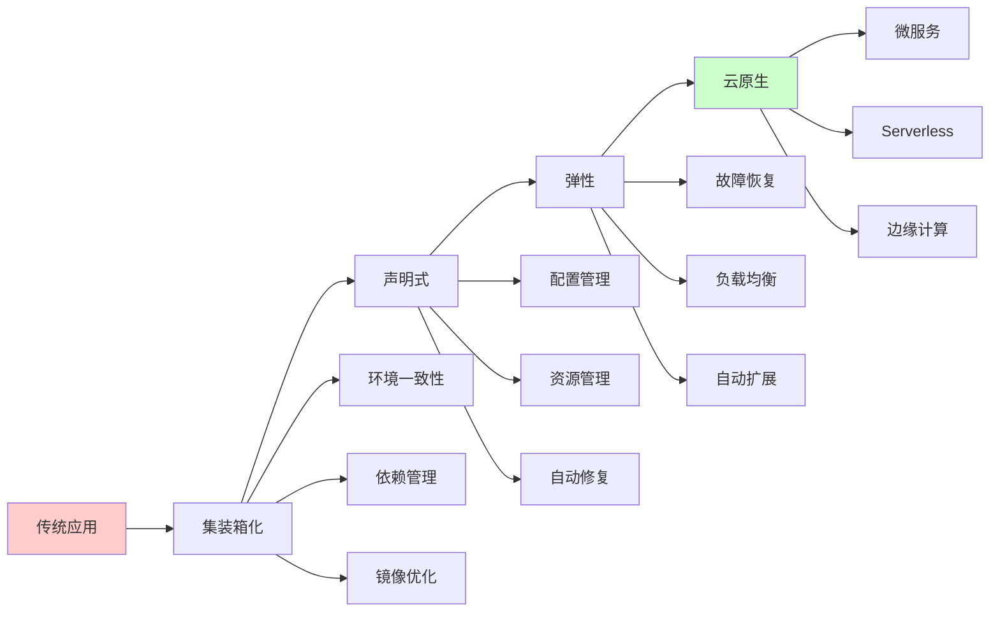
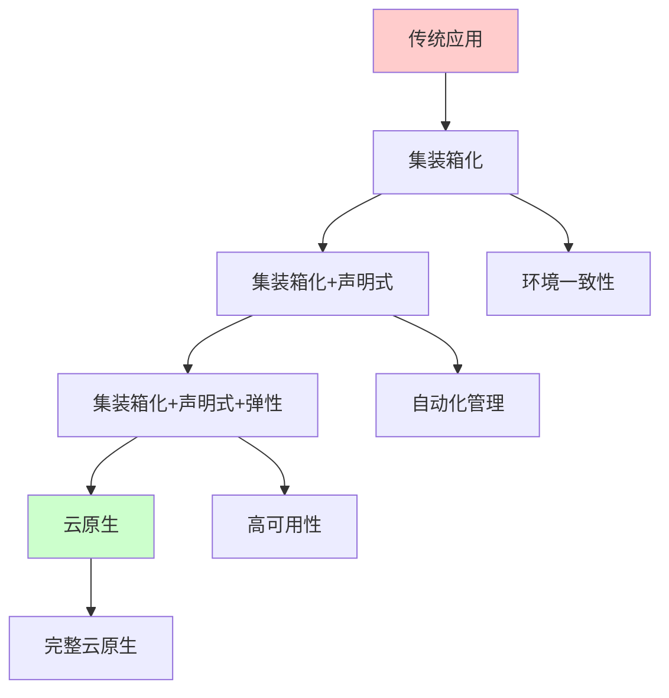

# 核心理念演进路径图

## 📑 目录

- [核心理念演进路径图](#核心理念演进路径图)
  - [📑 目录](#-目录)
  - [1 理念演进全景](#1-理念演进全景)
  - [2 集装箱化演进路径](#2-集装箱化演进路径)
  - [3 声明式演进路径](#3-声明式演进路径)
  - [4 弹性演进路径](#4-弹性演进路径)
  - [5 理念融合演进](#5-理念融合演进)

---

## 1 理念演进全景

---

## 2 集装箱化演进路径

| 阶段 | 解决方案 | 核心特性 | 技术实现 | 演进方向 |
|------|---------|---------|---------|---------|
| **初期** | 单层镜像（fat image） | 简单打包、环境包含 | Docker基础镜像 | → 分层存储 |
| **标准化** | OCI Image Spec | 格式统一、跨平台 | OCI标准 | → 多架构支持 |
| **优化** | 多阶段构建 | 构建优化、体积减小 | BuildKit | → Distroless |
| **极致** | Distroless/Scratch | 最小镜像、安全增强 | Distroless、Scratch | → 镜像签名 |
| **安全** | 镜像签名与SBOM | 供应链安全、可追溯 | Notary、SBOM | → 持续演进 |

**演进逻辑**：

- **问题驱动**：每个阶段解决前一阶段的问题
- **技术演进**：从简单到复杂，从单一到多样
- **标准统一**：从碎片化到标准化
- **安全增强**：从功能到安全

---

## 3 声明式演进路径

| 阶段 | 解决方案 | 核心特性 | 技术实现 | 演进方向 |
|------|---------|---------|---------|---------|
| **初期** | 命令式配置 | 手动操作、脚本管理 | Shell脚本 | → 配置即代码 |
| **标准化** | 声明式配置 | 期望状态、配置即代码 | Kubernetes YAML | → 控制循环 |
| **自动化** | 控制循环 | 自动修复、状态同步 | Kubernetes Controller | → GitOps |
| **GitOps** | GitOps工作流 | 版本控制、自动化部署 | ArgoCD、Flux | → 持续演进 |
| **智能化** | AI辅助配置 | 智能推荐、自动优化 | AI工具 | → 持续演进 |

**演进逻辑**：

- **自动化提升**：从手动到自动，从脚本到控制循环
- **版本控制**：从配置管理到GitOps
- **智能化**：从人工决策到AI辅助
- **持续演进**：不断优化和改进

---

## 4 弹性演进路径

| 阶段 | 解决方案 | 核心特性 | 技术实现 | 演进方向 |
|------|---------|---------|---------|---------|
| **初期** | 手动扩展 | 人工监控、手动调整 | 手动操作 | → 自动扩展 |
| **基础** | 自动扩展 | 基于指标、自动调整 | HPA、VPA | → 智能扩展 |
| **高级** | 智能扩展 | 预测性扩展、成本优化 | KEDA、预测算法 | → 自适应 |
| **自适应** | 自适应弹性 | 自适应策略、多维度优化 | 自适应算法 | → 持续演进 |
| **极致** | 零停机弹性 | 无缝扩展、零影响 | 高级调度算法 | → 持续演进 |

**演进逻辑**：

- **自动化程度**：从手动到自动，从简单到智能
- **扩展策略**：从反应式到预测式，从单一到多维
- **影响最小化**：从有影响到零影响
- **持续优化**：不断改进和优化

---

## 5 理念融合演进

**融合演进阶段**：

1. **第一阶段：集装箱化**
   - 解决环境一致性问题
   - 实现依赖管理
   - 技术：Docker、OCI

2. **第二阶段：集装箱化+声明式**
   - 在集装箱化基础上增加声明式管理
   - 实现自动化配置和资源管理
   - 技术：Kubernetes、Helm

3. **第三阶段：集装箱化+声明式+弹性**
   - 在前两个阶段基础上增加弹性能力
   - 实现高可用和自动扩展
   - 技术：Kubernetes、Service Mesh、HPA

4. **第四阶段：完整云原生**
   - 三大理念深度融合
   - 实现完整的云原生能力
   - 技术：完整云原生技术栈

---

## 6 理念演进检查清单

| 检查项 | 检查内容 | 重要性 | 推荐度 |
|--------|---------|--------|--------|
| **阶段识别** | 当前阶段、目标阶段、演进路径 | 极高 | ⭐⭐⭐⭐⭐ |
| **技术选型** | 技术评估、技术选择、技术实施 | 高 | ⭐⭐⭐⭐⭐ |
| **演进规划** | 演进计划、演进步骤、演进验证 | 高 | ⭐⭐⭐⭐⭐ |
| **效果评估** | 效果测量、效果分析、效果报告 | 中 | ⭐⭐⭐⭐ |

**推荐度说明**：

- **⭐⭐⭐⭐⭐**：强烈推荐
- **⭐⭐⭐⭐**：推荐
- **⭐⭐⭐**：可选

---

## 7 演进路径详细说明

### 7.1 集装箱化演进路径详细说明

#### 7.1.1 初期阶段：单层镜像

**问题域**：环境不一致、依赖管理困难

**解决方案**：

- **简单打包**：将应用和依赖打包到单一镜像
- **环境包含**：在镜像中包含完整的运行环境
- **基础镜像**：使用 Docker 基础镜像

**技术实现**：

- **Docker**：使用 Dockerfile 构建镜像
- **基础镜像**：使用 Ubuntu、CentOS 等基础镜像
- **单层构建**：单层镜像构建

**演进方向**：分层存储、镜像优化

**推荐度**：⭐⭐⭐⭐⭐

#### 7.1.2 标准化阶段：OCI Image Spec

**问题域**：镜像格式不统一、跨平台困难

**解决方案**：

- **格式统一**：使用 OCI 标准统一镜像格式
- **跨平台**：支持多平台和架构
- **标准接口**：提供标准的镜像接口

**技术实现**：

- **OCI Image Spec**：使用 OCI 镜像标准
- **多架构支持**：支持 ARM、x86 等架构
- **镜像仓库**：使用 OCI 兼容的镜像仓库

**演进方向**：多架构支持、镜像优化

**推荐度**：⭐⭐⭐⭐⭐

#### 7.1.3 优化阶段：多阶段构建

**问题域**：镜像体积大、构建慢

**解决方案**：

- **构建优化**：使用多阶段构建优化构建过程
- **体积减小**：减少镜像体积
- **构建缓存**：使用构建缓存加速构建

**技术实现**：

- **BuildKit**：使用 BuildKit 优化构建
- **多阶段构建**：使用多阶段 Dockerfile
- **构建缓存**：使用构建缓存机制

**演进方向**：Distroless、镜像签名

**推荐度**：⭐⭐⭐⭐⭐

---

### 7.2 声明式演进路径详细说明

#### 7.2.1 初期阶段：命令式配置

**问题域**：配置分散、手动操作

**解决方案**：

- **手动操作**：手动配置和管理
- **脚本管理**：使用 Shell 脚本管理配置
- **配置文档**：使用文档记录配置

**技术实现**：

- **Shell脚本**：使用 Shell 脚本自动化
- **配置文件**：使用配置文件管理配置
- **手动操作**：手动执行配置操作

**演进方向**：配置即代码、声明式配置

**推荐度**：⭐⭐⭐

#### 7.2.2 标准化阶段：声明式配置

**问题域**：配置不一致、状态管理困难

**解决方案**：

- **期望状态**：定义资源的期望状态
- **配置即代码**：将配置作为代码管理
- **版本控制**：使用版本控制管理配置

**技术实现**：

- **Kubernetes YAML**：使用 YAML 定义资源
- **配置管理**：使用 ConfigMap 和 Secret
- **版本控制**：使用 Git 管理配置

**演进方向**：控制循环、GitOps

**推荐度**：⭐⭐⭐⭐⭐

#### 7.2.3 自动化阶段：控制循环

**问题域**：状态不一致、手动修复

**解决方案**：

- **自动修复**：自动修复状态偏差
- **状态同步**：自动同步资源状态
- **控制循环**：使用控制循环管理资源

**技术实现**：

- **Kubernetes Controller**：使用 Controller 管理资源
- **控制循环**：实现控制循环逻辑
- **状态监控**：监控资源状态

**演进方向**：GitOps、智能化

**推荐度**：⭐⭐⭐⭐⭐

---

### 7.3 弹性演进路径详细说明

#### 7.3.1 初期阶段：手动扩展

**问题域**：资源不足、资源浪费

**解决方案**：

- **人工监控**：人工监控资源使用
- **手动调整**：手动调整资源规模
- **经验判断**：基于经验判断资源需求

**技术实现**：

- **监控工具**：使用监控工具监控资源
- **手动操作**：手动调整资源
- **告警系统**：使用告警系统提醒

**演进方向**：自动扩展、智能扩展

**推荐度**：⭐⭐⭐

#### 7.3.2 基础阶段：自动扩展

**问题域**：响应慢、资源浪费

**解决方案**：

- **基于指标**：基于指标自动调整资源
- **自动调整**：自动调整资源规模
- **策略配置**：配置扩展策略

**技术实现**：

- **HPA**：使用 Horizontal Pod Autoscaler
- **VPA**：使用 Vertical Pod Autoscaler
- **指标监控**：监控 CPU、内存等指标

**演进方向**：智能扩展、自适应

**推荐度**：⭐⭐⭐⭐⭐

---

## 8 演进路径实践案例

### 8.1 案例1：从传统应用到云原生演进

**场景**：将传统单体应用演进为云原生应用

**演进流程**：

1. **第一阶段：集装箱化**
   - 将应用容器化
   - 使用 Docker 构建镜像
   - 解决环境一致性问题

2. **第二阶段：集装箱化+声明式**
   - 使用 Kubernetes 部署
   - 使用声明式配置管理
   - 实现自动化管理

3. **第三阶段：集装箱化+声明式+弹性**
   - 实现自动扩展
   - 实现故障恢复
   - 实现高可用

4. **第四阶段：完整云原生**
   - 实现完整的云原生能力
   - 优化性能和成本
   - 持续优化和改进

**技术实现**：

- **容器化**：Docker、containerd
- **编排**：Kubernetes
- **弹性**：HPA、VPA、KEDA
- **服务治理**：Istio、Linkerd

**效果**：成功将传统应用演进为云原生应用，提升可用性和可扩展性

**推荐度**：⭐⭐⭐⭐⭐

### 8.2 案例2：微服务架构演进

**场景**：构建微服务架构

**演进流程**：

1. **第一阶段：服务容器化**
   - 将各个微服务容器化
   - 使用 Docker 构建服务镜像
   - 实现服务独立部署

2. **第二阶段：服务编排**
   - 使用 Kubernetes 编排服务
   - 使用声明式配置管理服务
   - 实现服务自动化管理

3. **第三阶段：服务弹性**
   - 实现服务自动扩展
   - 实现服务故障恢复
   - 实现服务高可用

**技术实现**：

- **容器化**：Docker、containerd
- **编排**：Kubernetes
- **服务网格**：Istio、Linkerd
- **弹性**：HPA、VPA

**效果**：成功构建高可用、可扩展的微服务架构

**推荐度**：⭐⭐⭐⭐⭐

---

## 9 演进路径最佳实践

### 9.1 演进原则

**原则1：渐进式演进**:

- 从简单到复杂逐步演进
- 每个阶段验证效果
- 根据效果调整演进方向

**原则2：问题驱动**:

- 根据问题选择演进方向
- 解决当前阶段的关键问题
- 关注问题的解决效果

**原则3：持续优化**:

- 根据实践效果优化演进路径
- 积累演进经验
- 形成演进模式

**推荐度**：⭐⭐⭐⭐⭐

### 9.2 演进方法

**方法1：阶段式演进**:

- 按照阶段逐步演进
- 每个阶段完成后再进入下一阶段
- 确保每个阶段的质量

**方法2：并行演进**:

- 多个理念并行演进
- 加快演进速度
- 需要更强的技术能力

**方法3：迭代演进**:

- 根据效果迭代调整演进路径
- 持续优化演进方案
- 提升演进效果

**推荐度**：⭐⭐⭐⭐⭐

### 9.3 演进注意事项

**注意事项1：阶段要清晰**:

- 明确每个阶段的目标
- 确保阶段之间的衔接
- 避免跳跃式演进

**注意事项2：技术要合适**:

- 选择合适的技术实现演进
- 考虑技术的成熟度和生态
- 要平衡技术的复杂度和效果

**注意事项3：效果要评估**:

- 要评估每个阶段的演进效果
- 要根据效果调整演进方向
- 要持续优化演进效果

**推荐度**：⭐⭐⭐⭐⭐

---

## 10 演进路径工具推荐

| 工具类型 | 推荐工具 | 使用场景 | 效果 | 复杂度 | 推荐度 |
|---------|---------|---------|------|--------|--------|
| **容器工具** | Docker、containerd | 集装箱化演进 | 高 | 中 | ⭐⭐⭐⭐⭐ |
| **编排工具** | Kubernetes | 声明式演进 | 高 | 高 | ⭐⭐⭐⭐⭐ |
| **配置工具** | Helm、Kustomize | 配置管理演进 | 高 | 中 | ⭐⭐⭐⭐⭐ |
| **弹性工具** | HPA、VPA、KEDA | 弹性演进 | 高 | 中 | ⭐⭐⭐⭐⭐ |
| **监控工具** | Prometheus、Grafana | 演进监控 | 高 | 中 | ⭐⭐⭐⭐⭐ |

**推荐度说明**：

- **⭐⭐⭐⭐⭐**：强烈推荐
- **⭐⭐⭐⭐**：推荐
- **⭐⭐⭐**：可选

---

**最后更新**：2025-11-15
**文档状态**：✅ 完整 | 📊 包含核心理念演进路径图、详细说明、实践案例、最佳实践、工具推荐 | 🎯 生产就绪
**维护者**：项目团队
