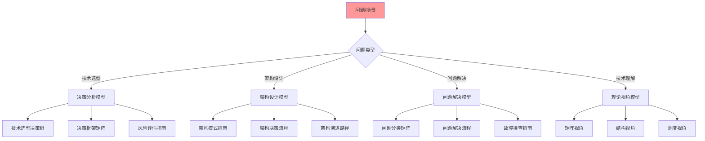

# 认知模型快速参考指南

## 📑 目录

- [认知模型快速参考指南](#认知模型快速参考指南)
  - [📑 目录](#-目录)
  - [1 快速参考全景](#1-快速参考全景)
  - [2 问题-模型映射表](#2-问题-模型映射表)
  - [3 场景-视角映射表](#3-场景-视角映射表)
  - [4 决策-工具映射表](#4-决策-工具映射表)
  - [5 快速查找索引](#5-快速查找索引)
    - [5.1 按问题类型查找](#51-按问题类型查找)
    - [5.2 按应用场景查找](#52-按应用场景查找)
    - [5.3 按学习阶段查找](#53-按学习阶段查找)
    - [5.4 按工具类型查找](#54-按工具类型查找)
  - [6 快速参考检查清单](#6-快速参考检查清单)
  - [7 快速参考使用技巧](#7-快速参考使用技巧)
    - [7.1 问题-模型映射使用技巧](#71-问题-模型映射使用技巧)
    - [7.2 场景-视角映射使用技巧](#72-场景-视角映射使用技巧)
    - [7.3 快速查找索引使用技巧](#73-快速查找索引使用技巧)
  - [8 快速参考实践案例](#8-快速参考实践案例)
    - [8.1 案例1：容器运行时选型快速参考](#81-案例1容器运行时选型快速参考)
    - [8.2 案例2：性能优化快速参考](#82-案例2性能优化快速参考)
  - [9 快速参考最佳实践](#9-快速参考最佳实践)
    - [9.1 使用原则](#91-使用原则)
    - [9.2 使用方法](#92-使用方法)
    - [9.3 使用注意事项](#93-使用注意事项)
  - [10 快速参考工具推荐](#10-快速参考工具推荐)
  - [2025 年最新实践](#2025-年最新实践)
    - [认知模型快速参考应用最佳实践（2025）](#认知模型快速参考应用最佳实践2025)
  - [实际应用案例](#实际应用案例)
    - [案例 1：认知模型快速参考应用（2025）](#案例-1认知模型快速参考应用2025)

---

## 1 快速参考全景



---

## 2 问题-模型映射表

| 问题类型 | 推荐模型 | 快速入口 | 推荐度 |
|---------|---------|---------|--------|
| **容器运行时选型** | 技术选型决策树 | [技术选型决策树](../05-decision-analysis/visualizations/03-technology-selection-decision-tree.md) | ⭐⭐⭐⭐⭐ |
| **隔离技术选型** | 隔离模型详细思维导图 | [隔离模型详细思维导图](../05-decision-analysis/visualizations/05-isolation-model-detailed.md) | ⭐⭐⭐⭐⭐ |
| **编排平台选型** | 技术选型详细指南 | [技术选型详细指南](../05-decision-analysis/visualizations/15-technology-selection-guide.md) | ⭐⭐⭐⭐⭐ |
| **服务网格选型** | 决策案例对比矩阵 | [决策案例对比矩阵](../05-decision-analysis/visualizations/02-decision-cases-matrix.md) | ⭐⭐⭐⭐⭐ |
| **架构模式选择** | 架构模式对比矩阵 | [架构模式对比矩阵](../02-architecture-design/visualizations/03-architecture-patterns-matrix.md) | ⭐⭐⭐⭐⭐ |
| **性能优化** | 性能优化指南 | [性能优化指南](../05-decision-analysis/visualizations/18-performance-optimization-guide.md) | ⭐⭐⭐⭐⭐ |
| **成本优化** | 成本优化指南 | [成本优化指南](../05-decision-analysis/visualizations/19-cost-optimization-guide.md) | ⭐⭐⭐⭐ |
| **安全设计** | 安全模型详细思维导图 | [安全模型详细思维导图](../05-decision-analysis/visualizations/06-security-model-detailed.md) | ⭐⭐⭐⭐⭐ |
| **故障排查** | 故障排查综合指南 | [故障排查综合指南](../02-architecture-design/visualizations/07-troubleshooting-comprehensive-guide.md) | ⭐⭐⭐⭐⭐ |
| **技术理解** | 理论视角思维导图 | [理论视角思维导图](../03-theoretical-perspectives/visualizations/01-theoretical-perspectives-mindmap.md) | ⭐⭐⭐⭐⭐ |

**推荐度说明**：

- **⭐⭐⭐⭐⭐**：强烈推荐
- **⭐⭐⭐⭐**：推荐
- **⭐⭐⭐**：可选

---

## 3 场景-视角映射表

| 应用场景 | 推荐视角 | 快速入口 | 推荐度 |
|---------|---------|---------|--------|
| **技术选型** | 矩阵视角 | [矩阵视角详细思维导图](../03-theoretical-perspectives/visualizations/03-matrix-perspective-detailed.md) | ⭐⭐⭐⭐⭐ |
| **架构设计** | 结构视角 | [结构视角详细思维导图](../03-theoretical-perspectives/visualizations/04-structural-perspective-detailed.md) | ⭐⭐⭐⭐⭐ |
| **性能优化** | 调度视角 | [调度视角详细思维导图](../03-theoretical-perspectives/visualizations/05-scheduling-perspective-detailed.md) | ⭐⭐⭐⭐⭐ |
| **操作组合** | 代数结构视角 | [代数结构视角详细思维导图](../03-theoretical-perspectives/visualizations/06-algebraic-perspective-detailed.md) | ⭐⭐⭐⭐ |
| **系统结构分析** | 范畴论视角 | [范畴论视角详细思维导图](../03-theoretical-perspectives/visualizations/07-category-theory-perspective-detailed.md) | ⭐⭐⭐ |
| **系统验证** | 形式化理论视角 | [形式化理论视角详细思维导图](../03-theoretical-perspectives/visualizations/08-formal-theory-perspective-detailed.md) | ⭐⭐⭐ |
| **可观测性** | eBPF/OTLP视角 | [eBPF/OTLP视角详细思维导图](../04-application-perspectives/visualizations/03-ebpf-otlp-detailed-mindmap.md) | ⭐⭐⭐⭐⭐ |
| **API设计** | API规范视角 | [API规范视角详细思维导图](../04-application-perspectives/visualizations/05-api-perspective-detailed.md) | ⭐⭐⭐⭐ |

**推荐度说明**：

- **⭐⭐⭐⭐⭐**：强烈推荐
- **⭐⭐⭐⭐**：推荐
- **⭐⭐⭐**：可选

---

## 4 决策-工具映射表

| 决策类型 | 推荐工具 | 快速入口 | 推荐度 |
|---------|---------|---------|--------|
| **技术选型决策** | 技术选型决策树 | [技术选型决策树](../05-decision-analysis/visualizations/03-technology-selection-decision-tree.md) | ⭐⭐⭐⭐⭐ |
| **架构决策** | 架构决策完整流程 | [架构决策完整流程](../02-architecture-design/visualizations/08-architecture-decision-process.md) | ⭐⭐⭐⭐⭐ |
| **风险评估** | 决策风险评估综合指南 | [决策风险评估综合指南](../05-decision-analysis/visualizations/28-decision-risk-assessment.md) | ⭐⭐⭐⭐⭐ |
| **理念选择** | 核心理念决策矩阵 | [核心理念决策矩阵](21-principles-decision-matrix.md) | ⭐⭐⭐⭐⭐ |
| **架构模式选择** | 架构模式选择决策树 | [架构模式实践综合指南](../02-architecture-design/visualizations/09-architecture-patterns-practice-guide.md) | ⭐⭐⭐⭐⭐ |
| **优化决策** | 性能/成本/安全优化指南 | [性能优化指南](../05-decision-analysis/visualizations/18-performance-optimization-guide.md) | ⭐⭐⭐⭐⭐ |

**推荐度说明**：

- **⭐⭐⭐⭐⭐**：强烈推荐
- **⭐⭐⭐⭐**：推荐
- **⭐⭐⭐**：可选

---

## 5 快速查找索引

### 5.1 按问题类型查找

- **技术选型问题** → [技术选型决策树](../05-decision-analysis/visualizations/03-technology-selection-decision-tree.md)
- **架构设计问题** → [架构认知地图](../02-architecture-design/visualizations/01-architecture-cognitive-map.md)
- **性能优化问题** → [性能优化指南](../05-decision-analysis/visualizations/18-performance-optimization-guide.md)
- **成本优化问题** → [成本优化指南](../05-decision-analysis/visualizations/19-cost-optimization-guide.md)
- **安全设计问题** → [安全模型详细思维导图](../05-decision-analysis/visualizations/06-security-model-detailed.md)
- **故障排查问题** → [故障排查综合指南](../02-architecture-design/visualizations/07-troubleshooting-comprehensive-guide.md)

### 5.2 按应用场景查找

- **微服务架构** → [微服务架构实践](../02-architecture-design/visualizations/09-architecture-patterns-practice-guide.md)
- **Serverless架构** → [Serverless架构实践](../02-architecture-design/visualizations/09-architecture-patterns-practice-guide.md)
- **边缘计算** → [边缘计算案例](../04-application-perspectives/visualizations/12-real-world-implementation-cases.md)
- **AI推理** → [AI推理案例](../04-application-perspectives/visualizations/12-real-world-implementation-cases.md)
- **电商平台** → [电商平台案例](../04-application-perspectives/visualizations/12-real-world-implementation-cases.md)
- **金融系统** → [金融系统案例](../04-application-perspectives/visualizations/12-real-world-implementation-cases.md)

### 5.3 按学习阶段查找

- **入门阶段** → [学习路径指南](06-learning-path-guide.md)
- **进阶阶段** → [认知模型进阶应用](14-cognitive-models-advanced-usage.md)
- **专家阶段** → [理论视角实践综合指南](../03-theoretical-perspectives/visualizations/11-perspective-practice-guide.md)

### 5.4 按工具类型查找

- **思维导图** → [认知框架思维导图](01-cognitive-framework-mindmap.md)
- **知识矩阵** → [认知模型对比矩阵](02-cognitive-models-matrix.md)
- **决策树** → [技术选型决策树](../05-decision-analysis/visualizations/03-technology-selection-decision-tree.md)
- **工作流图** → [认知模型完整工作流](10-cognitive-models-workflow.md)
- **关系图谱** → [知识图谱关系图](03-knowledge-graph-relations.md)

---

## 6 快速参考检查清单

| 检查项 | 检查内容 | 重要性 | 推荐度 |
|--------|---------|--------|--------|
| **问题识别** | 问题类型、问题特征、问题优先级 | 极高 | ⭐⭐⭐⭐⭐ |
| **模型选择** | 模型评估、模型选择、模型验证 | 高 | ⭐⭐⭐⭐⭐ |
| **工具使用** | 工具选择、工具使用、工具验证 | 高 | ⭐⭐⭐⭐⭐ |
| **效果评估** | 效果测量、效果分析、效果报告 | 中 | ⭐⭐⭐⭐ |

**推荐度说明**：

- **⭐⭐⭐⭐⭐**：强烈推荐
- **⭐⭐⭐⭐**：推荐
- **⭐⭐⭐**：可选

---

## 7 快速参考使用技巧

### 7.1 问题-模型映射使用技巧

**技巧1：问题类型识别**:

**方法**：

- **问题分类**：准确分类问题类型（技术选型、架构设计、问题解决等）
- **问题特征**：识别问题的关键特征（复杂度、紧急度、影响范围）
- **问题优先级**：确定问题的优先级

**示例**：

- **技术选型问题** → 使用技术选型决策树、决策框架矩阵
- **架构设计问题** → 使用架构模式指南、架构决策流程
- **性能优化问题** → 使用性能优化指南、调度视角

**推荐度**：⭐⭐⭐⭐⭐

**技巧2：模型快速定位**:

**方法**：

- **映射表查找**：使用问题-模型映射表快速定位模型
- **快速入口**：使用快速入口直接访问相关文档
- **模型验证**：验证模型与问题的匹配度

**示例**：

- **容器运行时选型** → 技术选型决策树 → [快速入口](../05-decision-analysis/visualizations/03-technology-selection-decision-tree.md)
- **性能优化** → 性能优化指南 → [快速入口](../05-decision-analysis/visualizations/18-performance-optimization-guide.md)

**推荐度**：⭐⭐⭐⭐⭐

---

### 7.2 场景-视角映射使用技巧

**技巧1：场景识别**:

**方法**：

- **场景类型**：识别场景类型（技术选型、架构设计、性能优化等）
- **场景特征**：分析场景的关键特征
- **场景需求**：理解场景的核心需求

**示例**：

- **技术选型场景** → 矩阵视角 → [快速入口](../03-theoretical-perspectives/visualizations/03-matrix-perspective-detailed.md)
- **架构设计场景** → 结构视角 → [快速入口](../03-theoretical-perspectives/visualizations/04-structural-perspective-detailed.md)

**推荐度**：⭐⭐⭐⭐⭐

**技巧2：视角快速选择**:

**方法**：

- **映射表查找**：使用场景-视角映射表快速选择视角
- **视角评估**：评估视角的适用性
- **视角应用**：应用选择的视角进行分析

**示例**：

- **性能优化场景** → 调度视角 → 使用调度视角分析性能问题
- **可观测性场景** → eBPF/OTLP视角 → 使用 eBPF/OTLP视角设计可观测性方案

**推荐度**：⭐⭐⭐⭐⭐

---

### 7.3 快速查找索引使用技巧

**技巧1：按问题类型查找**:

**方法**：

- **问题分类**：将问题分类到具体类型
- **索引查找**：使用索引快速查找相关文档
- **文档访问**：直接访问相关文档

**示例**：

- **技术选型问题** → [技术选型决策树](../05-decision-analysis/visualizations/03-technology-selection-decision-tree.md)
- **架构设计问题** → [架构认知地图](../02-architecture-design/visualizations/01-architecture-cognitive-map.md)

**推荐度**：⭐⭐⭐⭐⭐

**技巧2：按应用场景查找**:

**方法**：

- **场景识别**：识别应用场景类型
- **索引查找**：使用索引快速查找相关案例
- **案例学习**：学习相关案例的经验

**示例**：

- **微服务架构** → [微服务架构实践](../02-architecture-design/visualizations/09-architecture-patterns-practice-guide.md)
- **Serverless架构** → [Serverless架构实践](../02-architecture-design/visualizations/09-architecture-patterns-practice-guide.md)

**推荐度**：⭐⭐⭐⭐⭐

---

## 8 快速参考实践案例

### 8.1 案例1：容器运行时选型快速参考

**场景**：需要快速选择容器运行时

**快速参考流程**：

1. **问题识别**：识别为容器运行时选型问题
2. **映射表查找**：使用问题-模型映射表查找推荐模型
3. **快速入口**：通过快速入口访问技术选型决策树
4. **决策应用**：应用决策树进行选型决策
5. **效果验证**：验证选型效果

**使用工具**：

- **问题-模型映射表**：快速定位模型
- **技术选型决策树**：结构化决策
- **快速入口**：快速访问文档

**效果**：快速完成容器运行时选型，选型过程高效合理

**推荐度**：⭐⭐⭐⭐⭐

### 8.2 案例2：性能优化快速参考

**场景**：需要快速解决性能问题

**快速参考流程**：

1. **问题识别**：识别为性能优化问题
2. **映射表查找**：使用问题-模型映射表查找推荐模型
3. **快速入口**：通过快速入口访问性能优化指南
4. **方案应用**：应用性能优化方案
5. **效果验证**：验证优化效果

**使用工具**：

- **问题-模型映射表**：快速定位模型
- **性能优化指南**：性能优化方案
- **快速入口**：快速访问文档

**效果**：快速解决性能问题，优化过程高效合理

**推荐度**：⭐⭐⭐⭐⭐

---

## 9 快速参考最佳实践

### 9.1 使用原则

**原则1：快速定位**:

- 使用映射表快速定位模型和工具
- 使用快速入口快速访问文档
- 提高查找效率

**原则2：准确匹配**:

- 确保问题与模型的匹配度
- 验证场景与视角的匹配度
- 提高使用效果

**原则3：持续优化**:

- 根据使用效果优化查找方式
- 积累快速参考的经验
- 形成快速参考的模式

**推荐度**：⭐⭐⭐⭐⭐

### 9.2 使用方法

**方法1：映射表查找**:

- 使用映射表快速查找模型和工具
- 通过快速入口访问文档
- 提高查找效率

**方法2：索引查找**:

- 使用索引按类型查找文档
- 快速定位相关文档
- 提高查找准确性

**方法3：综合查找**:

- 结合映射表和索引进行查找
- 综合多个查找方式
- 提高查找效果

**推荐度**：⭐⭐⭐⭐⭐

### 9.3 使用注意事项

**注意事项1：问题要准确**:

- 确保问题识别准确
- 明确问题的类型和特征
- 避免问题识别错误

**注意事项2：匹配要合适**:

- 确保模型与问题匹配
- 验证场景与视角匹配
- 避免匹配不合适

**注意事项3：效果要验证**:

- 要验证快速参考的效果
- 要根据效果调整使用方式
- 要持续优化使用效果

**推荐度**：⭐⭐⭐⭐⭐

---

## 10 快速参考工具推荐

| 工具类型 | 推荐工具 | 使用场景 | 效果 | 复杂度 | 推荐度 |
|---------|---------|---------|------|--------|--------|
| **文档搜索工具** | Algolia、Elasticsearch | 文档搜索、快速查找 | 高 | 中 | ⭐⭐⭐⭐⭐ |
| **书签工具** | Browser Bookmarks | 快速访问、文档收藏 | 中 | 低 | ⭐⭐⭐⭐⭐ |
| **笔记工具** | Obsidian、Notion | 笔记记录、知识管理 | 中 | 低 | ⭐⭐⭐⭐⭐ |
| **索引工具** | 文档索引、目录索引 | 快速定位、索引查找 | 高 | 低 | ⭐⭐⭐⭐⭐ |
| **映射工具** | 映射表、关系图 | 关系映射、快速查找 | 高 | 低 | ⭐⭐⭐⭐⭐ |

**推荐度说明**：

- **⭐⭐⭐⭐⭐**：强烈推荐
- **⭐⭐⭐⭐**：推荐
- **⭐⭐⭐**：可选

---

## 2025 年最新实践

### 认知模型快速参考应用最佳实践（2025）

**2025 年趋势**：认知模型快速参考在问题解决、学习加速、工具选择中的深度应用

**实践要点**：

- **快速查找**：使用快速参考指南快速查找所需认知模型
- **工具选择**：基于快速参考选择合适的认知工具
- **实践应用**：结合快速参考进行实际应用

**代码示例**：

```python
# 2025 年认知模型快速参考工具
class CognitiveModelsQuickReferenceTool:
    def __init__(self):
        self.reference = QuickReference()
        self.selector = ToolSelector()
        self.applicator = ModelApplicator()

    def lookup_model(self, keyword):
        """查找模型"""
        return self.reference.lookup(keyword)

    def select_tool(self, model):
        """选择工具"""
        return self.selector.select(model)

    def apply_model(self, model, context):
        """应用模型"""
        return self.applicator.apply(model, context)
```

## 实际应用案例

### 案例 1：认知模型快速参考应用（2025）

**场景**：使用快速参考指南快速查找和应用认知模型

**实现方案**：

```python
# 认知模型快速参考应用
tool = CognitiveModelsQuickReferenceTool()

# 查找模型
keyword = "problem-solving"
model = tool.lookup_model(keyword)

# 选择工具
tool_selected = tool.select_tool(model)

# 应用模型
context = Context(problem=problem)
result = tool.apply_model(model, context)
```

**效果**：

- 快速查找：基于快速参考的模型查找，提高查找效率
- 工具选择：使用快速参考选择合适的工具，提高工具使用效率
- 实践应用：结合快速参考进行实际应用，提高应用质量

---

**最后更新**：2025-11-15
**文档状态**：✅ 完整 | 📊 包含认知模型快速参考指南、使用技巧、实践案例、最佳实践、工具推荐 | 🎯 生产就绪
**维护者**：项目团队
