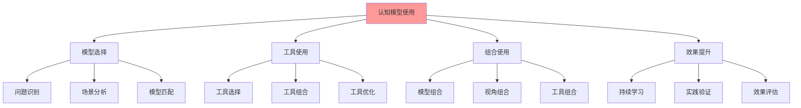

# 认知模型使用技巧指南

## 📑 目录

- [认知模型使用技巧指南](#认知模型使用技巧指南)
  - [📑 目录](#-目录)
  - [1 使用技巧全景](#1-使用技巧全景)
  - [2 模型选择技巧](#2-模型选择技巧)
    - [2.1 问题识别技巧](#21-问题识别技巧)
    - [2.2 场景分析技巧](#22-场景分析技巧)
    - [2.3 模型匹配技巧](#23-模型匹配技巧)
  - [3 工具使用技巧](#3-工具使用技巧)
    - [3.1 思维导图使用技巧](#31-思维导图使用技巧)
    - [3.2 知识矩阵使用技巧](#32-知识矩阵使用技巧)
    - [3.3 决策树使用技巧](#33-决策树使用技巧)
  - [4 组合使用技巧](#4-组合使用技巧)
    - [4.1 模型组合技巧](#41-模型组合技巧)
    - [4.2 视角组合技巧](#42-视角组合技巧)
  - [5 效果提升技巧](#5-效果提升技巧)
    - [5.1 学习技巧](#51-学习技巧)
    - [5.2 应用技巧](#52-应用技巧)
  - [6 使用技巧检查清单](#6-使用技巧检查清单)
  - [7 使用技巧详细说明](#7-使用技巧详细说明)
    - [7.1 模型选择技巧详细说明](#71-模型选择技巧详细说明)
      - [7.1.1 问题识别技巧](#711-问题识别技巧)
      - [7.1.2 场景分析技巧](#712-场景分析技巧)
    - [7.2 工具使用技巧详细说明](#72-工具使用技巧详细说明)
      - [7.2.1 思维导图使用技巧](#721-思维导图使用技巧)
      - [7.2.2 知识矩阵使用技巧](#722-知识矩阵使用技巧)
    - [7.3 组合使用技巧详细说明](#73-组合使用技巧详细说明)
      - [7.3.1 模型组合技巧](#731-模型组合技巧)
  - [8 使用技巧实践案例](#8-使用技巧实践案例)
    - [8.1 案例1：技术选型技巧应用](#81-案例1技术选型技巧应用)
    - [8.2 案例2：架构设计技巧应用](#82-案例2架构设计技巧应用)
  - [9 使用技巧工具推荐](#9-使用技巧工具推荐)
  - [10 使用技巧注意事项](#10-使用技巧注意事项)
    - [10.1 技巧应用原则](#101-技巧应用原则)
    - [10.2 技巧应用注意事项](#102-技巧应用注意事项)
  - [2025 年最新实践](#2025-年最新实践)
    - [认知模型使用技巧应用最佳实践（2025）](#认知模型使用技巧应用最佳实践2025)
  - [实际应用案例](#实际应用案例)
    - [案例 1：认知模型使用技巧应用（2025）](#案例-1认知模型使用技巧应用2025)

---

## 1 使用技巧全景



---

## 2 模型选择技巧

### 2.1 问题识别技巧

| 技巧 | 描述 | 示例 | 推荐度 |
|------|------|------|--------|
| **问题分类** | 将问题分类到具体类型 | 技术选型问题 → 决策分析模型 | ⭐⭐⭐⭐⭐ |
| **问题优先级** | 确定问题的优先级 | 高优先级 → 核心模型 | ⭐⭐⭐⭐⭐ |
| **问题特征** | 识别问题的关键特征 | 复杂问题 → 多模型组合 | ⭐⭐⭐⭐ |
| **问题上下文** | 理解问题的上下文 | 业务场景 → 应用视角 | ⭐⭐⭐⭐ |

**推荐度说明**：

- **⭐⭐⭐⭐⭐**：强烈推荐
- **⭐⭐⭐⭐**：推荐
- **⭐⭐⭐**：可选

### 2.2 场景分析技巧

| 技巧 | 描述 | 示例 | 推荐度 |
|------|------|------|--------|
| **场景识别** | 识别应用场景类型 | 微服务场景 → 微服务架构模型 | ⭐⭐⭐⭐⭐ |
| **场景特征** | 分析场景的关键特征 | 高并发场景 → 性能优化模型 | ⭐⭐⭐⭐⭐ |
| **场景需求** | 理解场景的核心需求 | 安全需求 → 安全模型 | ⭐⭐⭐⭐⭐ |
| **场景约束** | 识别场景的约束条件 | 资源受限 → 资源优化模型 | ⭐⭐⭐⭐ |

**推荐度说明**：

- **⭐⭐⭐⭐⭐**：强烈推荐
- **⭐⭐⭐⭐**：推荐
- **⭐⭐⭐**：可选

### 2.3 模型匹配技巧

| 技巧 | 描述 | 示例 | 推荐度 |
|------|------|------|--------|
| **精确匹配** | 选择与问题完全匹配的模型 | 容器运行时选型 → 技术选型决策树 | ⭐⭐⭐⭐⭐ |
| **近似匹配** | 选择与问题近似匹配的模型 | 架构选型 → 架构模式对比矩阵 | ⭐⭐⭐⭐ |
| **组合匹配** | 组合多个模型解决问题 | 复杂问题 → 多模型组合 | ⭐⭐⭐⭐⭐ |
| **迭代匹配** | 根据效果迭代调整模型 | 效果不佳 → 调整模型选择 | ⭐⭐⭐⭐ |

**推荐度说明**：

- **⭐⭐⭐⭐⭐**：强烈推荐
- **⭐⭐⭐⭐**：推荐
- **⭐⭐⭐**：可选

---

## 3 工具使用技巧

### 3.1 思维导图使用技巧

| 技巧 | 描述 | 示例 | 推荐度 |
|------|------|------|--------|
| **中心主题** | 明确中心主题 | 认知框架 → 认知框架思维导图 | ⭐⭐⭐⭐⭐ |
| **分支结构** | 构建清晰的分支结构 | 核心理念 → 理论视角 → 应用场景 | ⭐⭐⭐⭐⭐ |
| **关键词提取** | 提取关键概念 | 集装箱化、声明式、弹性 | ⭐⭐⭐⭐ |
| **视觉化** | 使用颜色、图标增强视觉效果 | 不同颜色表示不同类别 | ⭐⭐⭐ |

**推荐度说明**：

- **⭐⭐⭐⭐⭐**：强烈推荐
- **⭐⭐⭐⭐**：推荐
- **⭐⭐⭐**：可选

### 3.2 知识矩阵使用技巧

| 技巧 | 描述 | 示例 | 推荐度 |
|------|------|------|--------|
| **维度选择** | 选择关键对比维度 | 功能、性能、成本 | ⭐⭐⭐⭐⭐ |
| **权重设置** | 设置维度权重 | 性能权重30%、成本权重20% | ⭐⭐⭐⭐ |
| **量化评估** | 量化评估各项指标 | 1-5分评分 | ⭐⭐⭐⭐⭐ |
| **综合对比** | 综合对比不同方案 | 加权总分对比 | ⭐⭐⭐⭐⭐ |

**推荐度说明**：

- **⭐⭐⭐⭐⭐**：强烈推荐
- **⭐⭐⭐⭐**：推荐
- **⭐⭐⭐**：可选

### 3.3 决策树使用技巧

| 技巧 | 描述 | 示例 | 推荐度 |
|------|------|------|--------|
| **问题分解** | 将问题分解为子问题 | 技术选型 → 运行时选型 → 隔离技术选型 | ⭐⭐⭐⭐⭐ |
| **条件判断** | 明确条件判断标准 | 性能要求 > 1000 QPS | ⭐⭐⭐⭐⭐ |
| **路径选择** | 根据条件选择路径 | 高并发 → 高性能方案 | ⭐⭐⭐⭐⭐ |
| **结果验证** | 验证决策结果 | 方案验证、效果评估 | ⭐⭐⭐⭐ |

**推荐度说明**：

- **⭐⭐⭐⭐⭐**：强烈推荐
- **⭐⭐⭐⭐**：推荐
- **⭐⭐⭐**：可选

---

## 4 组合使用技巧

### 4.1 模型组合技巧

| 技巧 | 描述 | 示例 | 推荐度 |
|------|------|------|--------|
| **互补组合** | 组合互补的模型 | 决策树 + 知识矩阵 | ⭐⭐⭐⭐⭐ |
| **层次组合** | 组合不同层次的模型 | 宏观模型 + 微观模型 | ⭐⭐⭐⭐⭐ |
| **视角组合** | 组合不同视角的模型 | 理论视角 + 应用视角 | ⭐⭐⭐⭐⭐ |
| **工具组合** | 组合不同的工具 | 思维导图 + 决策树 + 知识矩阵 | ⭐⭐⭐⭐ |

**推荐度说明**：

- **⭐⭐⭐⭐⭐**：强烈推荐
- **⭐⭐⭐⭐**：推荐
- **⭐⭐⭐**：可选

### 4.2 视角组合技巧

| 技巧 | 描述 | 示例 | 推荐度 |
|------|------|------|--------|
| **多视角分析** | 从多个视角分析问题 | 矩阵视角 + 结构视角 | ⭐⭐⭐⭐⭐ |
| **视角切换** | 在不同视角间切换 | 技术视角 → 业务视角 | ⭐⭐⭐⭐ |
| **视角融合** | 融合不同视角的洞察 | 综合多视角的结论 | ⭐⭐⭐⭐⭐ |
| **视角验证** | 用不同视角验证结论 | 理论验证 + 实践验证 | ⭐⭐⭐⭐ |

**推荐度说明**：

- **⭐⭐⭐⭐⭐**：强烈推荐
- **⭐⭐⭐⭐**：推荐
- **⭐⭐⭐**：可选

---

## 5 效果提升技巧

### 5.1 学习技巧

| 技巧 | 描述 | 示例 | 推荐度 |
|------|------|------|--------|
| **循序渐进** | 从简单到复杂学习 | 入门 → 进阶 → 专家 | ⭐⭐⭐⭐⭐ |
| **实践验证** | 通过实践验证理解 | 实际项目应用 | ⭐⭐⭐⭐⭐ |
| **持续学习** | 持续学习和更新 | 关注新技术、新模型 | ⭐⭐⭐⭐ |
| **知识分享** | 通过分享加深理解 | 团队分享、文档编写 | ⭐⭐⭐⭐ |

**推荐度说明**：

- **⭐⭐⭐⭐⭐**：强烈推荐
- **⭐⭐⭐⭐**：推荐
- **⭐⭐⭐**：可选

### 5.2 应用技巧

| 技巧 | 描述 | 示例 | 推荐度 |
|------|------|------|--------|
| **场景适配** | 根据场景适配模型 | 微服务场景适配 | ⭐⭐⭐⭐⭐ |
| **迭代优化** | 根据效果迭代优化 | 持续改进 | ⭐⭐⭐⭐⭐ |
| **效果评估** | 定期评估应用效果 | 效果测量、效果分析 | ⭐⭐⭐⭐ |
| **经验积累** | 积累应用经验 | 案例库、最佳实践 | ⭐⭐⭐⭐ |

**推荐度说明**：

- **⭐⭐⭐⭐⭐**：强烈推荐
- **⭐⭐⭐⭐**：推荐
- **⭐⭐⭐**：可选

---

## 6 使用技巧检查清单

| 检查项 | 检查内容 | 重要性 | 推荐度 |
|--------|---------|--------|--------|
| **问题识别** | 问题分类、问题优先级、问题特征 | 极高 | ⭐⭐⭐⭐⭐ |
| **模型选择** | 场景分析、模型匹配、模型验证 | 高 | ⭐⭐⭐⭐⭐ |
| **工具使用** | 工具选择、工具组合、工具优化 | 高 | ⭐⭐⭐⭐⭐ |
| **效果提升** | 持续学习、实践验证、效果评估 | 中 | ⭐⭐⭐⭐ |

**推荐度说明**：

- **⭐⭐⭐⭐⭐**：强烈推荐
- **⭐⭐⭐⭐**：推荐
- **⭐⭐⭐**：可选

---

## 7 使用技巧详细说明

### 7.1 模型选择技巧详细说明

#### 7.1.1 问题识别技巧

**技巧1：问题分类**:

**方法**：

- **问题类型识别**：识别问题属于技术选型、架构设计、问题解决等类型
- **问题特征识别**：识别问题的关键特征（复杂度、紧急度、影响范围）
- **问题上下文识别**：理解问题的业务和技术上下文

**示例**：

- **技术选型问题** → 决策分析模型（技术选型决策树、决策框架矩阵）
- **架构设计问题** → 架构设计模型（架构认知地图、架构模式对比矩阵）
- **性能优化问题** → 性能优化模型（调度视角、性能基准）

**推荐度**：⭐⭐⭐⭐⭐

**技巧2：问题优先级**:

**方法**：

- **严重性评估**：评估问题对系统的影响程度
- **紧急度评估**：评估问题需要解决的紧急程度
- **优先级排序**：根据严重性和紧急度排序问题优先级

**示例**：

- **高优先级问题** → 核心模型（矩阵视角、结构视角）
- **中优先级问题** → 标准模型（调度视角、资源模型）
- **低优先级问题** → 可选模型（形式化理论视角、范畴论视角）

**推荐度**：⭐⭐⭐⭐⭐

---

#### 7.1.2 场景分析技巧

**技巧1：场景识别**:

**方法**：

- **场景类型识别**：识别场景属于微服务、Serverless、边缘计算等类型
- **场景特征识别**：识别场景的关键特征（高并发、低延迟、高可用）
- **场景需求识别**：理解场景的核心需求（性能、安全、成本）

**示例**：

- **微服务场景** → 微服务架构模型（结构视角、分布式模型）
- **Serverless场景** → Serverless架构模型（资源模型、隔离模型）
- **边缘计算场景** → 边缘计算模型（资源模型、网络概念）

**推荐度**：⭐⭐⭐⭐⭐

**技巧2：场景特征分析**:

**方法**：

- **特征提取**：提取场景的关键特征
- **特征分析**：分析特征对模型选择的影响
- **特征匹配**：根据特征匹配合适的模型

**示例**：

- **高并发场景** → 性能优化模型（调度视角、资源模型）
- **安全关键场景** → 安全模型（安全模型、隔离模型）
- **成本敏感场景** → 成本优化模型（资源模型、成本分析）

**推荐度**：⭐⭐⭐⭐⭐

---

### 7.2 工具使用技巧详细说明

#### 7.2.1 思维导图使用技巧

**技巧1：中心主题明确**:

**方法**：

- **主题选择**：选择明确的中心主题
- **主题聚焦**：围绕中心主题展开分支
- **主题验证**：验证主题的准确性和完整性

**示例**：

- **认知框架** → 认知框架思维导图
- **架构设计** → 架构认知地图
- **问题解决** → 问题解决方案思维导图

**推荐度**：⭐⭐⭐⭐⭐

**技巧2：分支结构清晰**:

**方法**：

- **层次结构**：构建清晰的层次结构
- **逻辑关系**：明确分支之间的逻辑关系
- **视觉优化**：使用颜色、图标增强视觉效果

**示例**：

- **核心理念 → 理论视角 → 应用场景**
- **问题识别 → 问题分析 → 解决方案**
- **技术选型 → 架构设计 → 方案实施**

**推荐度**：⭐⭐⭐⭐⭐

---

#### 7.2.2 知识矩阵使用技巧

**技巧1：维度选择**:

**方法**：

- **关键维度**：选择关键的对比维度
- **维度完整**：确保维度覆盖全面
- **维度平衡**：平衡不同维度的重要性

**示例**：

- **技术选型** → 功能、性能、成本、安全性
- **架构设计** → 可扩展性、可维护性、性能、安全性
- **性能优化** → CPU、内存、I/O、网络

**推荐度**：⭐⭐⭐⭐⭐

**技巧2：量化评估**:

**方法**：

- **评分标准**：建立统一的评分标准
- **量化指标**：使用量化指标进行评估
- **综合对比**：综合对比不同方案

**示例**：

- **1-5分评分**：1分（差）、2分（较差）、3分（一般）、4分（较好）、5分（好）
- **加权总分**：根据权重计算加权总分
- **综合排名**：根据总分进行综合排名

**推荐度**：⭐⭐⭐⭐⭐

---

### 7.3 组合使用技巧详细说明

#### 7.3.1 模型组合技巧

**技巧1：互补组合**:

**方法**：

- **优势互补**：选择互补的模型发挥各自优势
- **层次互补**：组合不同层次的模型
- **视角互补**：组合不同视角的模型

**示例**：

- **矩阵视角 + 结构视角**：矩阵视角提供对比，结构视角提供分析
- **调度视角 + 资源模型**：调度视角提供性能分析，资源模型提供资源分析
- **安全模型 + 隔离模型**：安全模型提供安全分析，隔离模型提供隔离分析

**推荐度**：⭐⭐⭐⭐⭐

**技巧2：层次组合**:

**方法**：

- **宏观 + 微观**：组合宏观和微观模型
- **理论 + 实践**：组合理论和实践模型
- **分析 + 决策**：组合分析和决策模型

**示例**：

- **结构视角 + 架构模式**：结构视角提供宏观分析，架构模式提供微观设计
- **理论视角 + 应用视角**：理论视角提供理论支撑，应用视角提供实践指导
- **问题分析 + 方案设计**：问题分析提供问题理解，方案设计提供解决方案

**推荐度**：⭐⭐⭐⭐⭐

---

## 8 使用技巧实践案例

### 8.1 案例1：技术选型技巧应用

**场景**：选择适合的容器运行时

**技巧应用**：

1. **问题识别**：识别为技术选型问题
2. **场景分析**：分析云原生应用场景
3. **模型选择**：选择技术选型决策树和知识矩阵
4. **工具使用**：使用决策树和矩阵进行对比分析
5. **组合使用**：组合决策树和矩阵进行综合分析
6. **效果评估**：评估选型效果

**技巧要点**：

- **问题分类**：准确分类为技术选型问题
- **精确匹配**：选择与问题完全匹配的模型
- **工具组合**：组合决策树和矩阵提高分析效果

**效果**：成功选择最适合的容器运行时，选型过程科学合理

**推荐度**：⭐⭐⭐⭐⭐

### 8.2 案例2：架构设计技巧应用

**场景**：设计微服务架构

**技巧应用**：

1. **问题识别**：识别为架构设计问题
2. **场景分析**：分析微服务场景特征
3. **模型选择**：选择结构视角和架构模式
4. **工具使用**：使用架构认知地图和架构模式对比矩阵
5. **组合使用**：组合结构视角和架构模式进行设计
6. **效果评估**：评估架构设计效果

**技巧要点**：

- **场景识别**：准确识别为微服务场景
- **特征分析**：分析高并发、高可用等特征
- **视角组合**：组合结构视角和架构模式提高设计质量

**效果**：成功设计优秀的微服务架构，架构方案科学合理

**推荐度**：⭐⭐⭐⭐⭐

---

## 9 使用技巧工具推荐

| 工具类型 | 推荐工具 | 使用场景 | 效果 | 复杂度 | 推荐度 |
|---------|---------|---------|------|--------|--------|
| **思维导图工具** | XMind、MindMaster | 知识整理、思维整理 | 高 | 低 | ⭐⭐⭐⭐⭐ |
| **知识矩阵工具** | Excel、Google Sheets | 技术对比、方案对比 | 高 | 低 | ⭐⭐⭐⭐⭐ |
| **决策树工具** | Lucidchart、Draw.io | 决策分析、流程设计 | 高 | 中 | ⭐⭐⭐⭐ |
| **知识图谱工具** | Neo4j、Gephi | 关系分析、知识关联 | 高 | 中 | ⭐⭐⭐⭐ |
| **笔记工具** | Obsidian、Notion | 笔记记录、知识管理 | 中 | 低 | ⭐⭐⭐⭐⭐ |

**推荐度说明**：

- **⭐⭐⭐⭐⭐**：强烈推荐
- **⭐⭐⭐⭐**：推荐
- **⭐⭐⭐**：可选

---

## 10 使用技巧注意事项

### 10.1 技巧应用原则

**原则1：问题导向**:

- 根据问题类型选择合适的技巧
- 明确问题的本质和特征
- 关注问题的解决效果

**原则2：灵活应用**:

- 根据实际情况灵活应用技巧
- 不要机械套用技巧
- 要结合实际情况调整技巧

**原则3：持续优化**:

- 根据实践效果优化技巧应用
- 积累技巧应用的经验
- 形成技巧应用的模式

**推荐度**：⭐⭐⭐⭐⭐

### 10.2 技巧应用注意事项

**注意事项1：技巧要合适**:

- 不要过度使用技巧
- 要根据问题复杂度选择合适的技巧
- 要控制技巧应用的复杂度

**注意事项2：效果要验证**:

- 要验证技巧应用的效果
- 要根据效果调整技巧应用
- 要持续优化技巧应用

**注意事项3：经验要积累**:

- 要记录技巧应用的过程和结果
- 要总结技巧应用的经验和教训
- 要分享技巧应用的经验和知识

**推荐度**：⭐⭐⭐⭐⭐

---

## 2025 年最新实践

### 认知模型使用技巧应用最佳实践（2025）

**2025 年趋势**：认知模型使用技巧在问题解决、学习策略、工具应用中的深度应用

**实践要点**：

- **技巧选择**：根据问题复杂度选择合适的认知模型使用技巧
- **技巧应用**：系统化应用认知模型使用技巧
- **效果验证**：持续验证和优化技巧应用效果

**代码示例**：

```python
# 2025 年认知模型使用技巧工具
class CognitiveModelsUsageTipsTool:
    def __init__(self):
        self.selector = TipSelector()
        self.applicator = TipApplicator()
        self.validator = TipValidator()

    def select_tips(self, problem):
        """选择技巧"""
        return self.selector.select(problem)

    def apply_tips(self, tips, context):
        """应用技巧"""
        return self.applicator.apply(tips, context)

    def validate_effect(self, result):
        """验证效果"""
        return self.validator.validate(result)
```

## 实际应用案例

### 案例 1：认知模型使用技巧应用（2025）

**场景**：使用认知模型使用技巧解决复杂问题

**实现方案**：

```python
# 认知模型使用技巧应用
tool = CognitiveModelsUsageTipsTool()

# 选择技巧
problem = Problem(complexity=HIGH, domain="architecture")
tips = tool.select_tips(problem)

# 应用技巧
context = Context(problem=problem, resources=[...])
result = tool.apply_tips(tips, context)

# 验证效果
effect = tool.validate_effect(result)
```

**效果**：

- 技巧选择：基于问题特征选择合适技巧，提高问题解决效率
- 技巧应用：系统化应用技巧，保证应用质量
- 效果验证：持续验证和优化，提高技巧应用效果

---

**最后更新**：2025-11-15
**文档状态**：✅ 完整 | 📊 包含认知模型使用技巧指南、详细说明、实践案例、工具推荐、注意事项 | 🎯 生产就绪
**维护者**：项目团队
