# 架构与对象模型：控制闭环与数据结构

## 📑 目录

- [架构与对象模型：控制闭环与数据结构](#架构与对象模型控制闭环与数据结构)
  - [📑 目录](#-目录)
  - [1 文档定位](#1-文档定位)
  - [2 架构层次对比](#2-架构层次对比)
    - [2.1 系统架构全景](#21-系统架构全景)
    - [2.2 架构设计论证](#22-架构设计论证)
  - [3 Kubernetes 对象模型](#3-kubernetes-对象模型)
    - [3.1 GVR 模型](#31-gvr-模型)
    - [3.2 对象结构](#32-对象结构)
    - [3.3 对象关系模型](#33-对象关系模型)
    - [3.4 标签与选择器](#34-标签与选择器)
    - [3.5 对象模型论证](#35-对象模型论证)
  - [4 控制闭环机制](#4-控制闭环机制)
    - [4.1 Informer 工作流程](#41-informer-工作流程)
    - [4.2 Controller 模式](#42-controller-模式)
    - [4.3 控制循环时序图](#43-控制循环时序图)
    - [4.4 控制闭环论证](#44-控制闭环论证)
  - [5 Docker 控制路径](#5-docker-控制路径)
    - [5.1 调用链路](#51-调用链路)
    - [5.2 shim 的必要性](#52-shim-的必要性)
    - [5.3 技术场景与决策](#53-技术场景与决策)
  - [6 Kubernetes 调度算法](#6-kubernetes-调度算法)
    - [6.1 调度流程](#61-调度流程)
    - [6.2 调度策略](#62-调度策略)
    - [6.3 调度场景与决策](#63-调度场景与决策)
    - [6.4 执行流与调度视角](#64-执行流与调度视角)
  - [7 网络模型强制要求](#7-网络模型强制要求)
    - [7.1 Kubernetes 网络原则](#71-kubernetes-网络原则)
    - [7.2 实现方式](#72-实现方式)
    - [7.3 网络模型对比](#73-网络模型对比)
    - [7.4 网络场景与决策](#74-网络场景与决策)
  - [8 存储抽象：CSI](#8-存储抽象csi)
    - [8.1 CSI 的必要性](#81-csi-的必要性)
    - [8.2 存储模型](#82-存储模型)
    - [8.3 存储场景与决策](#83-存储场景与决策)
  - [9 K3s 架构精简](#9-k3s-架构精简)
    - [9.1 裁剪清单](#91-裁剪清单)
    - [9.2 单二进制打包策略](#92-单二进制打包策略)
    - [9.3 高可用路径](#93-高可用路径)
    - [9.4 边缘场景存储决策](#94-边缘场景存储决策)
  - [10 数据结构对比](#10-数据结构对比)
    - [10.1 数据结构分析](#101-数据结构分析)
  - [11 性能考量](#11-性能考量)
    - [11.1 事件吞吐](#111-事件吞吐)
    - [11.2 K3s 性能论证](#112-k3s-性能论证)
  - [12 技术场景分析](#12-技术场景分析)
    - [12.1 大规模集群场景](#121-大规模集群场景)
    - [12.2 边缘场景](#122-边缘场景)
    - [12.3 混合架构场景](#123-混合架构场景)
  - [13 决策依据与思路](#13-决策依据与思路)
    - [13.1 架构选择决策树](#131-架构选择决策树)
    - [13.2 存储选择决策树](#132-存储选择决策树)
    - [13.3 网络选择决策树](#133-网络选择决策树)
  - [14 形式化总结](#14-形式化总结)
    - [14.1 架构模型形式化](#141-架构模型形式化)
    - [14.2 性能模型形式化](#142-性能模型形式化)
    - [14.3 对象模型形式化](#143-对象模型形式化)
  - [15 参考](#15-参考)
  - [16 认知增强：思维导图、建模视图与图表达转换](#16-认知增强思维导图建模视图与图表达转换)
    - [16.1 架构设计完整思维导图](#161-架构设计完整思维导图)
    - [16.2 架构建模视图（C4 模型 + UML）](#162-架构建模视图c4-模型--uml)
      - [系统容器图（C4 Level 2）](#系统容器图c4-level-2)
      - [对象模型类图（UML）](#对象模型类图uml)
    - [16.3 架构多维关系矩阵](#163-架构多维关系矩阵)
      - [架构-组件-功能三维矩阵](#架构-组件-功能三维矩阵)
      - [架构-场景-决策映射矩阵](#架构-场景-决策映射矩阵)
    - [16.4 图表达和转换](#164-图表达和转换)
      - [架构视图转换关系](#架构视图转换关系)
      - [视图转换规则](#视图转换规则)
    - [16.5 形象化解释论证](#165-形象化解释论证)
      - [架构设计的形象化类比](#架构设计的形象化类比)
        - [1. Docker 架构 = 工厂生产线](#1-docker-架构--工厂生产线)
        - [2. Kubernetes 架构 = 智能城市管理系统](#2-kubernetes-架构--智能城市管理系统)
        - [3. K3s 架构 = 便携式工具箱](#3-k3s-架构--便携式工具箱)
        - [4. 控制循环 = 恒温器系统](#4-控制循环--恒温器系统)
    - [16.6 专家观点与论证](#166-专家观点与论证)
      - [计算信息软件科学家的观点](#计算信息软件科学家的观点)
        - [1. Joe Beda（Kubernetes 联合创始人）](#1-joe-bedakubernetes-联合创始人)
        - [2. Tim Hockin（Kubernetes 核心开发者）](#2-tim-hockinkubernetes-核心开发者)
        - [3. Darren Shepherd（K3s 创始人）](#3-darren-shepherdk3s-创始人)
      - [计算信息软件教育家的观点](#计算信息软件教育家的观点)
        - [1. Kelsey Hightower（Kubernetes 教育家）](#1-kelsey-hightowerkubernetes-教育家)
        - [2. Liz Rice（容器安全教育家）](#2-liz-rice容器安全教育家)
      - [计算信息软件认知学家的观点](#计算信息软件认知学家的观点)
        - [1. David Marr（计算认知科学家）](#1-david-marr计算认知科学家)
        - [2. Douglas Hofstadter（认知科学家）](#2-douglas-hofstadter认知科学家)
    - [16.7 认知学习路径矩阵](#167-认知学习路径矩阵)
    - [16.8 专家推荐阅读路径](#168-专家推荐阅读路径)

---

## 1 文档定位

本文档深入解析 Docker、Kubernetes、K3s 的架构设计、对象模型和控制闭环机制，以及
不同技术场景下的架构选择决策。

**文档结构**：

- **架构设计**：Docker/Kubernetes/K3s 的系统架构对比
- **对象模型**：Kubernetes GVR、对象结构、标签选择器
- **控制闭环**：Informer、Controller、控制循环机制
- **技术场景**：大规模集群、边缘场景、混合架构
- **决策分析**：架构选择、网络存储选择、调度策略选择

## 2 架构层次对比

### 2.1 系统架构全景

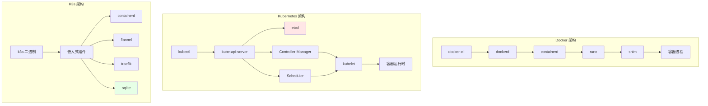

**架构层次分析**：

1. **Docker**：单机架构，控制路径简单（cli → dockerd → containerd → runc）
2. **Kubernetes**：集群架构，中心化控制平面（API Server + etcd + Controller +
   Scheduler）
3. **K3s**：轻量集群架构，单二进制 + 嵌入式组件
   （containerd/flannel/traefik/sqlite）

### 2.2 架构设计论证

**为什么 Docker 采用分层架构？**:

**决策依据**：

- ✅ 职责分离：每个组件职责单一，易于维护
- ✅ 解耦设计：组件间通过接口交互，降低耦合
- ✅ 可扩展性：插件化设计支持扩展

**决策思路**：

```yaml
Docker 架构选择:
  模式: 分层架构
  组件:
    - docker-cli: 用户接口
    - dockerd: 守护进程
    - containerd: 运行时接口
    - runc: OCI 运行时
  优势: 职责分离、解耦设计
  权衡: 调用链路较长
```

**为什么 Kubernetes 采用中心化架构？**:

**决策依据**：

- ✅ 状态一致性：中心化存储保证集群状态一致 [^k8s-architecture]
- ✅ 控制简化：统一入口简化控制逻辑
- ✅ 可扩展性：插件化设计支持扩展

**决策思路**：

```yaml
Kubernetes 架构选择:
  模式: 中心化架构
  中心: kube-api-server + etcd
  组件:
    - API Server: 统一入口
    - etcd: 状态存储
    - Controller: 状态管理
    - Scheduler: 调度决策
  优势: 状态一致、控制简化
  权衡: API Server 成为单点（通过 HA 解决）
```

**为什么 K3s 采用单二进制架构？**:

**决策依据**：

- ✅ 边缘场景：资源受限，需要轻量级部署 [^k3s-architecture]
- ✅ 安装简化：单二进制易于安装和升级
- ✅ 资源优化：嵌入式组件减少资源占用

**决策思路**：

```yaml
K3s 架构选择:
  模式: 单二进制架构
  策略:
    - 静态链接组件
    - 嵌入式 manifest
    - 启动时加载 static pod
  优势: 安装简单、资源占用小
  权衡: 升级需要替换二进制
```

## 3 Kubernetes 对象模型

### 3.1 GVR 模型

**定义**：每个 Kubernetes 资源遵循统一的 GVR（Group/Version/Resource）模式。

```text
资源类型 = Group/Version/Resource

示例：
- core/v1/Pod          # core 组，v1 版本，Pod 资源
- apps/v1/Deployment    # apps 组，v1 版本，Deployment 资源
- networking.k8s.io/v1/Ingress  # networking 组，v1 版本，Ingress 资源
```

**GVR 模型论证**：

- **Group**：资源分组，便于管理和扩展
- **Version**：版本管理，支持 API 演进
- **Resource**：资源类型，明确资源语义

### 3.2 对象结构

```yaml
apiVersion: apps/v1
kind: Deployment
metadata:
  name: nginx
  namespace: default
  labels:
    app: nginx
  uid: "abc-123"
  ownerReferences: [] # 依赖关系
spec:
  replicas: 3 # 期望状态
  selector:
    matchLabels:
      app: nginx
  template:
    metadata:
      labels:
        app: nginx
    spec:
      containers:
        - name: nginx
          image: nginx:latest
status:
  replicas: 3 # 实际状态
  readyReplicas: 3
  conditions: []
```

**对象结构分析**：

- **metadata**：元数据，包含名称、标签、UID、所有者引用
- **spec**：期望状态，定义资源的期望配置
- **status**：实际状态，记录资源的当前状态

### 3.3 对象关系模型

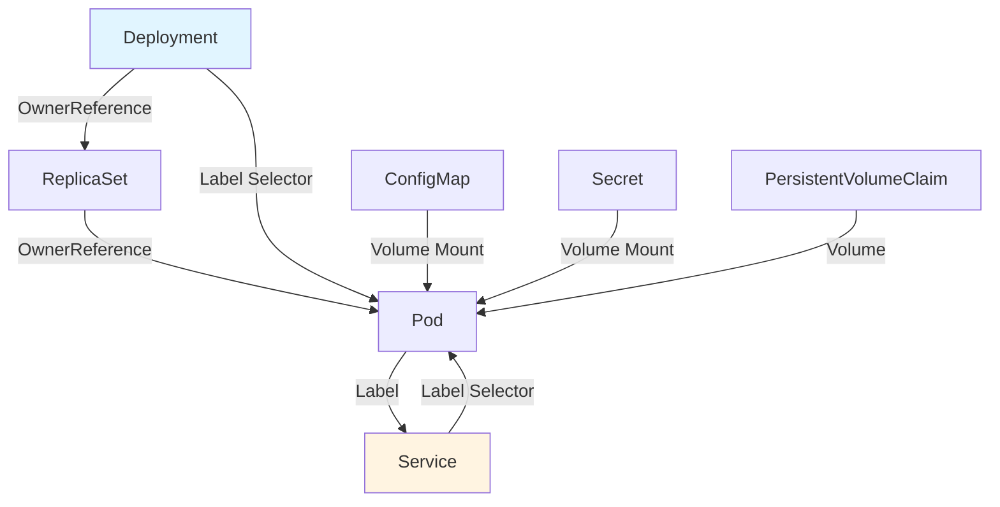

**对象关系论证**：

- **OwnerReference**：定义对象依赖关系，实现级联删除
- **Label Selector**：实现松耦合的服务发现和选择
- **Volume Mount**：实现配置和存储的挂载

### 3.4 标签与选择器

**核心机制**：所有对象通过 Label 做松散耦合，类比"数据库索引"。

```yaml
# Label 示例
metadata:
  labels:
    app: nginx
    version: v1
    tier: frontend

# Selector 示例
spec:
  selector:
    matchLabels:
      app: nginx
    matchExpressions:
      - key: version
        operator: In
        values: [v1, v2]
```

### 3.5 对象模型论证

**为什么采用 GVR 模型？**:

**决策依据**：

- ✅ API 版本管理：支持 API 演进和向后兼容
- ✅ 资源分组：逻辑上组织相关资源
- ✅ 扩展性：新资源可以独立版本管理

**为什么采用 Spec/Status 分离？**:

**决策依据**：

- ✅ 期望状态管理：Spec 定义期望，Status 记录实际
- ✅ 幂等性保证：可以重复应用 Spec
- ✅ 状态可见性：Status 提供实际状态信息

**为什么采用 Label Selector？**:

**决策依据**：

- ✅ 松耦合：服务间通过标签关联，降低耦合
- ✅ 高效查询：标签选择器支持高效的对象查询
- ✅ 灵活性：支持精确匹配和表达式匹配

## 4 控制闭环机制

### 4.1 Informer 工作流程

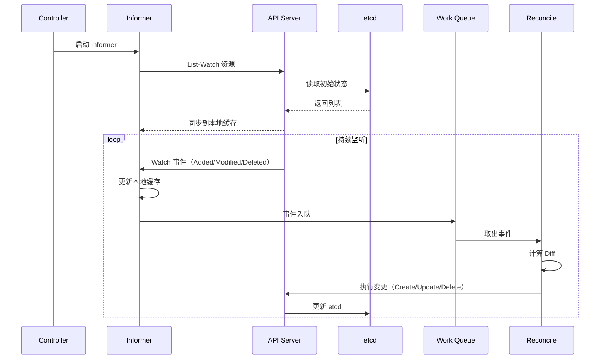

**Informer 模式论证**：

- **本地缓存**：减少 API Server 压力，提高响应速度
- **Watch 机制**：实时监听变化，避免轮询开销
- **工作队列**：异步处理事件，避免阻塞

### 4.2 Controller 模式

1. **Informer List-Watch**：从 etcd 同步资源到本地缓存
2. **本地缓存**：减少 API Server 压力
3. **事件入队**：事件进入 Work Queue
4. **Reconcile**：计算期望状态与实际状态差异
5. **执行变更**：下发命令到 API Server
6. **持续巡检**：循环执行上述步骤

### 4.3 控制循环时序图

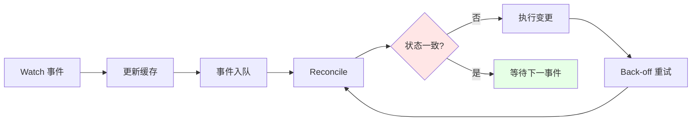

### 4.4 控制闭环论证

**为什么采用 Informer 模式？**:

**决策依据**：

- ✅ 性能优化：本地缓存减少 API Server 负载
- ✅ 实时响应：Watch 机制实时监听变化
- ✅ 可靠性：工作队列保证事件不丢失

**为什么采用 Reconcile 模式？**:

**决策依据**：

- ✅ 幂等性：重复执行结果一致
- ✅ 容错性：故障恢复后自动修复
- ✅ 简洁性：统一的控制逻辑

**控制循环收敛定理**：参考
[2.5.2 控制循环收敛定理](../../01-core-foundations/principles/principles.md#252-控制循环收敛定理)

## 5 Docker 控制路径

### 5.1 调用链路

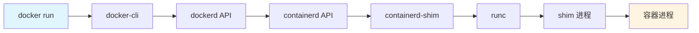

**调用链路分析**：

1. **docker-cli**：用户命令行接口
2. **dockerd**：Docker 守护进程，管理镜像和容器
3. **containerd**：容器运行时接口，管理容器生命周期
4. **containerd-shim**：运行时 shim，隔离 containerd 与容器
5. **runc**：OCI 运行时，创建容器进程

### 5.2 shim 的必要性

**问题**：runc 退出后，容器进程（init 进程）会失去父进程，变成孤儿进程。

**解决方案**：shim 作为"轻量级 init"持有 STDIO 和 fifo，使 dockerd 可以重启而不
丢失容器。

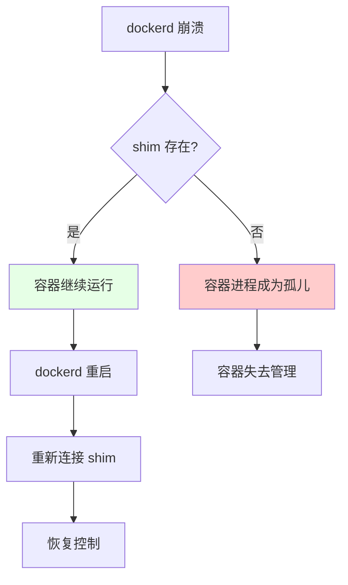

**shim 必要性论证**：

- **孤儿进程问题**：runc 创建容器后立即退出，容器进程失去父进程
- **shim 作用**：shim 持有容器进程，避免成为孤儿
- **可恢复性**：dockerd 重启后可以重新连接 shim，恢复容器控制

### 5.3 技术场景与决策

**场景 1：单机容器管理**:

**决策依据**：

- ✅ 简单场景，不需要复杂架构
- ✅ 资源受限，需要轻量级设计

**决策思路**：

```yaml
Docker 架构适用场景:
  场景: 单机容器管理
  组件: docker-cli + dockerd + containerd + runc
  优势: 简单、轻量
  限制: 单机限制，无法集群管理
```

**场景 2：需要容器编排**:

**决策依据**：

- ✅ 多节点容器管理
- ✅ 需要服务发现和负载均衡

**决策思路**：

```yaml
Kubernetes 架构适用场景:
  场景: 多节点容器编排
  组件: API Server + etcd + Controller + Scheduler
  优势: 集群管理、服务发现
  限制: 资源占用大，部署复杂
```

**场景 3：边缘场景容器编排**:

**决策依据**：

- ✅ 边缘节点资源受限
- ✅ 需要轻量级 Kubernetes

**决策思路**：

```yaml
K3s 架构适用场景:
  场景: 边缘容器编排
  组件: k3s 单二进制 + 嵌入式组件
  优势: 轻量、易部署
  限制: 规模受限（1000 节点）
```

## 6 Kubernetes 调度算法

### 6.1 调度流程

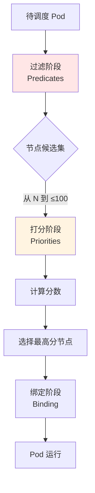

**调度流程论证**：

1. **过滤阶段**：从 N 个节点筛选到 ≤100 个候选节点（性能优化）
2. **打分阶段**：计算每个候选节点的分数（资源优化）
3. **绑定阶段**：选择最高分节点并绑定（决策确定）

### 6.2 调度策略

| 阶段     | 算法                           | 目标                              |
| -------- | ------------------------------ | --------------------------------- |
| **过滤** | 节点资源检查、亲和性检查       | 从 N 个节点筛选到 ≤100 个候选节点 |
| **打分** | 资源碎片化最小化、镜像本地存在 | 选出最优节点                      |
| **绑定** | 异步绑定到节点                 | 更新 Pod 状态                     |

### 6.3 调度场景与决策

**场景 1：资源优化调度**:

**决策依据**：

- ✅ 最大化资源利用率
- ✅ 减少资源碎片

**决策思路**：

```yaml
调度策略:
  优先级: 资源碎片化最小
  算法: LeastRequestedPriority
  场景: 资源紧张环境
  效果: 提高资源利用率
```

**场景 2：性能优化调度**:

**决策依据**：

- ✅ 镜像本地已存在
- ✅ 节点亲和性

**决策思路**：

```yaml
调度策略:
  优先级: 镜像本地存在
  算法: ImageLocalityPriority
  场景: 大规模部署
  效果: 减少镜像拉取时间
```

**场景 3：高可用调度**:

**决策依据**：

- ✅ Pod 反亲和性
- ✅ 区域分散

**决策思路**：

```yaml
调度策略:
  优先级: Pod 分散
  算法: InterPodAffinityPriority
  场景: 高可用服务
  效果: Pod 分散到不同节点/区域
```

### 6.4 执行流与调度视角

> **详细分析**：参见 [执行流与调度视角](./execution-flow-scheduling.md) - 从执行
> 流和调度视角分析虚拟化、半虚拟化、容器化、沙盒化四种技术范式的本质差异
>
> **设备访问决策**：参见
> [技术决策模型](../../05-decision-analysis/decision-models/QUICK-REFERENCE.md) -
> 设备访问（USB/PCI/GPU）和内核特性决策快速参考

从**执行流与调度**的底层视角，深入分析四种技术范式的触发机制、截获机制、调度实体
和执行路径，帮助理解技术本质和性能开销。

**核心内容**：

- **执行流全景**：思维导图与对比矩阵
- **四种范式详解**：全虚拟化、半虚拟化、容器化、沙盒化的完整执行流分析
- **性能对比**：开销量化与决策依据（陷阱开销：全虚拟化 > 1000 cycles → 半虚拟化
  200-400 cycles → 容器化 0 → 沙盒化 10-50 cycles）
- **技术选型**：基于执行流特性的决策树
- **设备访问决策**：USB/PCI/GPU 设备访问能力矩阵与决策规则（见
  [执行流文档](./execution-flow-scheduling.md#036474-基于设备与内核特性的决策)）
- **内核特性决策**：epoll/io_uring 内核特性访问能力与性能对比（见
  [执行流文档](./execution-flow-scheduling.md#036474-基于设备与内核特性的决策)）

**关键洞察**：

1. **截获机制决定开销**：VM-Exit 最高，hypercall 次之，直接执行最低
2. **调度实体决定隔离**：vCPU 线程 > 容器进程 > Sentry 线程
3. **执行路径决定延迟**：用户态转发最快，VM-Exit 最慢
4. **设备访问决定范式**：USB/PCI/GPU 设备访问 → 虚拟化/半虚拟化（必需）
5. **内核特性决定范式**：epoll/io_uring → 容器化（必需，16-62x 性能提升）

## 7 网络模型强制要求

### 7.1 Kubernetes 网络原则

1. **任意 Pod 与 Pod 直连**，无需 NAT
2. **节点与 Pod 直连**，无需 NAT
3. **Pod 看到自己的 IP**，与外部看到的一致

**网络原则论证**：

- **直连要求**：保证 Pod 间通信延迟低、性能高
- **无 NAT 要求**：简化网络模型，避免端口映射问题
- **IP 一致性**：Pod 内外看到相同 IP，简化服务发现

### 7.2 实现方式

| 方式        | 技术                       | 特点                  |
| ----------- | -------------------------- | --------------------- |
| **Overlay** | Flannel/VXLAN、Calico IPIP | 封装在现有网络之上    |
| **路由**    | Calico BGP、Cilium         | 直接路由，性能更好    |
| **Bridge**  | Docker 默认                | ❌ 被抛弃（需要 NAT） |

**实现方式论证**：

- **Overlay**：在现有网络之上封装，易于部署，性能相对较低
- **路由**：直接路由，性能更高，需要网络支持
- **Bridge**：需要 NAT，违反 K8s 网络原则，被抛弃

### 7.3 网络模型对比

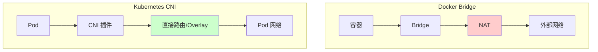

### 7.4 网络场景与决策

**场景 1：小规模集群（< 100 节点）**:

**决策依据**：

- ✅ 简单易用优先
- ✅ 性能要求不高

**决策思路**：

```yaml
网络方案选择:
  CNI: Flannel
  模式: VXLAN
  原因: 简单易用，配置简单
  权衡: 性能相对较低
```

**场景 2：大规模集群（> 500 节点）**:

**决策依据**：

- ✅ 性能要求高
- ✅ 网络策略需求

**决策思路**：

```yaml
网络方案选择:
  CNI: Calico 或 Cilium
  模式: BGP 或 eBPF
  原因: 高性能、网络策略支持
  权衡: 配置相对复杂
```

**场景 3：安全要求高**:

**决策依据**：

- ✅ 需要细粒度网络策略
- ✅ 需要 L7 策略

**决策思路**：

```yaml
网络方案选择:
  CNI: Cilium
  模式: eBPF
  原因: eBPF 实现 L7 策略
  权衡: 需要内核支持
```

**场景 4：微服务架构**:

**决策依据**：

- ✅ 需要统一的服务间通信治理
- ✅ 需要零信任安全（自动 mTLS）
- ✅ 需要完整的可观测性（Trace/Metric）
- ✅ 需要流量治理（路由、灰度发布）

**决策思路**：

```yaml
网络方案选择:
  CNI: Calico/Cilium（基础网络）
  Service Mesh: Istio/Linkerd/Cilium Mesh（服务间通信）
  原因:
    - CNI 提供 Pod 间网络连通
    - Service Mesh 提供 L7 流量治理和安全
  权衡:
    - Service Mesh 增加延迟（0.3-1ms）
    - Service Mesh 增加资源占用（20-200MB/服务）
  适用场景:
    - 微服务架构（>50 个服务）
    - 多云环境
    - 需要统一治理
```

## 8 存储抽象：CSI

### 8.1 CSI 的必要性

**问题**：in-tree 存储驱动随 K8s 核心一起发布，导致：

- 版本耦合
- 升级困难
- 二进制体积大

**解决方案**：CSI 将驱动拆到外部 Pod，可独立升级。

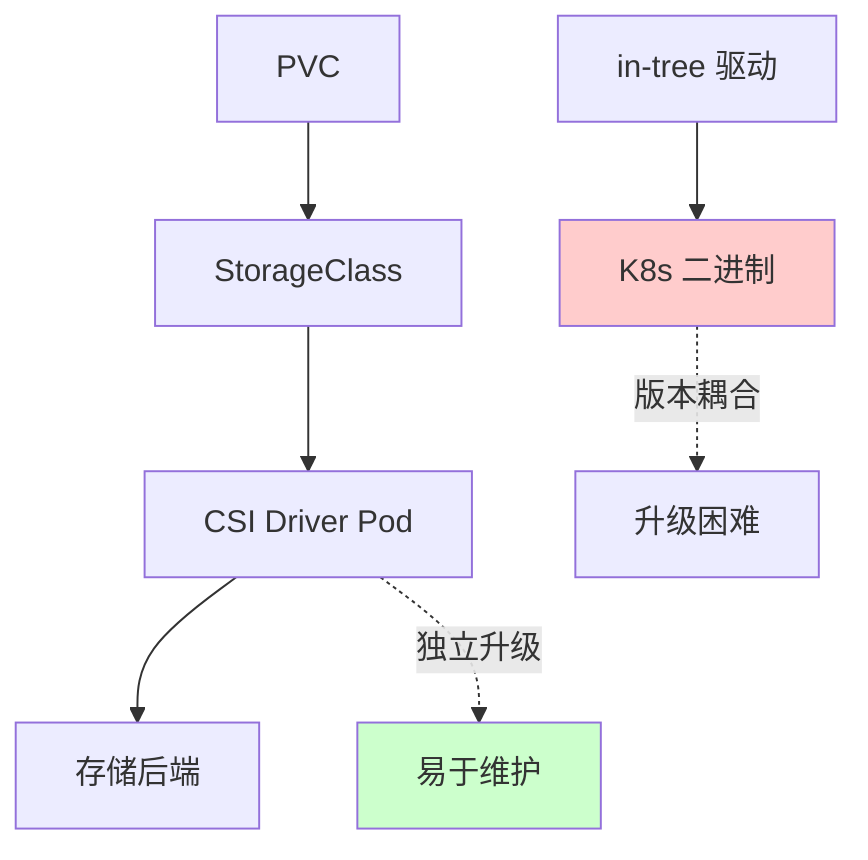

**CSI 必要性论证**：

- **版本耦合问题**：in-tree 驱动与 K8s 核心版本绑定，升级困难
- **二进制体积问题**：所有存储驱动都打包在 K8s 二进制中，体积大
- **CSI 解决方案**：驱动独立运行在 Pod 中，可独立升级，降低核心体积

### 8.2 存储模型

```yaml
# StorageClass：定义存储类型
apiVersion: storage.k8s.io/v1
kind: StorageClass
metadata:
  name: fast-ssd
provisioner: pd.csi.storage.gke.io
parameters:
  type: pd-ssd

# PVC：声明存储需求
apiVersion: v1
kind: PersistentVolumeClaim
metadata:
  name: my-pvc
spec:
  storageClassName: fast-ssd
  accessModes:
    - ReadWriteOnce
  resources:
    requests:
      storage: 100Gi

# Pod：使用存储
spec:
  volumes:
    - name: data
      persistentVolumeClaim:
        claimName: my-pvc
  containers:
    - volumeMounts:
        - mountPath: /data
          name: data
```

### 8.3 存储场景与决策

**场景 1：本地存储**:

**决策依据**：

- ✅ 单节点存储需求
- ✅ 性能要求高

**决策思路**：

```yaml
存储方案:
  type: Local PV
  特点: 本地磁盘，高性能
  限制: 节点绑定，无法迁移
  适用: 有状态服务（StatefulSet）
```

**场景 2：网络存储**:

**决策依据**：

- ✅ 跨节点存储需求
- ✅ 需要共享存储

**决策思路**：

```yaml
存储方案:
  type: Network PV (NFS/Ceph)
  特点: 网络存储，可共享
  权衡: 性能相对较低
  适用: 需要共享存储的场景
```

**场景 3：云存储**:

**决策依据**：

- ✅ 云平台部署
- ✅ 需要动态供给

**决策思路**：

```yaml
存储方案:
  type: Cloud PV (EBS/Azure Disk)
  特点: 动态供给，高可用
  优势: 自动管理，按需扩容
  适用: 云平台部署场景
```

## 9 K3s 架构精简

### 9.1 裁剪清单

| 组件                         | K8s     | K3s                    |
| ---------------------------- | ------- | ---------------------- |
| **cloud-controller-manager** | ✅      | ❌ 裁剪                |
| **alpha API**                | ✅      | ❌ 裁剪                |
| **in-tree 存储驱动**         | ✅      | ❌ 裁剪                |
| **etcd**                     | ✅ 外部 | ✅ 可选（默认 sqlite） |
| **containerd**               | 外部    | ✅ 内置                |
| **flannel**                  | 外部    | ✅ 内置                |
| **traefik**                  | 外部    | ✅ 内置                |

**裁剪论证**：

- **cloud-controller-manager**：边缘场景无云环境，无需云控制器
- **alpha API**：边缘场景不需要实验性功能，减少 API 复杂度
- **in-tree 存储驱动**：统一使用 CSI，简化维护
- **etcd → sqlite**：边缘场景单节点，sqlite 足以，减少资源占用

### 9.2 单二进制打包策略

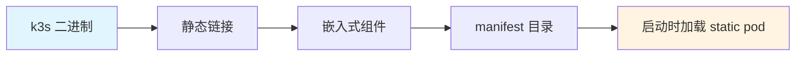

**打包策略论证**：

- **静态链接**：所有组件编译到单一二进制，减少依赖
- **嵌入式 manifest**：组件配置内嵌在二进制中
- **启动时加载**：根据 manifest 目录顺序启动 static pod

### 9.3 高可用路径

1. **嵌入式 etcd**：适合单节点或小规模
2. **外部 etcd**：适合中等规模（3-5 节点）
3. **外部 MySQL/PostgreSQL**：适合大规模或已有数据库

### 9.4 边缘场景存储决策

**问题域分析**：

- 边缘节点常掉电
- 网络不稳定
- 资源受限

**为什么边缘场景选 sqlite？**

**决策依据**：

- ✅ **边缘节点常掉电**：sqlite 单文件复制/备份成本最低
- ✅ **网络分区容忍**：本地继续运行，恢复后同步，接受"最终一致"
- ✅ **资源受限**：sqlite 内存占用极低，适合 ARM 设备

**决策思路**：

```yaml
边缘场景存储选择:
  场景: 边缘节点（ARM 设备）
  存储: sqlite（默认）
  原因:
    - 单文件备份简单
    - 本地运行，无需网络
    - 资源占用极低
  权衡:
    - 不支持多节点写入
    - 最终一致性，非强一致
  替代方案:
    - 外部 etcd（如果有稳定网络）
    - 外部数据库（如果有现成数据库）
```

**技术场景对比**：

| 场景               | 存储选择     | 决策依据       | 权衡         |
| ------------------ | ------------ | -------------- | ------------ |
| **单节点边缘**     | sqlite       | 简单、轻量     | 无高可用     |
| **小规模边缘集群** | 嵌入式 etcd  | 高可用、简单   | 资源占用增加 |
| **大规模边缘集群** | 外部 etcd/DB | 高可用、可扩展 | 依赖外部组件 |

## 10 数据结构对比

| 维度     | Docker Image | Kubernetes Object                        | K3s Object  |
| -------- | ------------ | ---------------------------------------- | ----------- |
| **寻址** | content-hash | namespace+name+uid                       | 同 K8s      |
| **依赖** | layer parent | OwnerReference                           | 同 K8s      |
| **存储** | tar + json   | etcd key = `/registry/{gvr}/{ns}/{name}` | sqlite 单表 |
| **事务** | 无           | etcd Raft                                | sqlite WAL  |

### 10.1 数据结构分析

**Docker Image**：

- **寻址**：content-hash，基于镜像内容计算
- **依赖**：layer parent，镜像层依赖关系
- **存储**：tar + json，文件系统 + 元数据

**Kubernetes Object**：

- **寻址**：namespace+name+uid，三元组唯一标识
- **依赖**：OwnerReference，对象依赖关系
- **存储**：etcd，分布式键值存储

**K3s Object**：

- **寻址**：同 K8s，兼容 K8s API
- **依赖**：同 K8s，兼容 K8s API
- **存储**：sqlite，单文件数据库

## 11 性能考量

### 11.1 事件吞吐

- **K8s 官方压测**：1 万节点、15 万 Pod，控制器 QPS 瓶颈在 kube-api-server 的
  etcd 前端，优化后 100k QPS [^k8s-performance]
- **K3s 裁剪后**：去掉大量 controller 与 alpha API，list-watch 压力下降
  40%；sqlite 本地调用延迟 0.1ms，比 etcd 网络往返 2ms 低一个量级
  [^k3s-performance]

### 11.2 K3s 性能论证

**为什么 K3s 能支持 1000 节点？**

**技术论证**：

1. **边缘节点 Pod 密度低**（平均 10 Pod/节点），总对象数 ≈1 万，sqlite 单线程足
   以
2. **网络拓扑星型**，跨节点 watch 少
3. **控制器精简后**，内存常驻 < 250MB，树莓派 4B（4GB）可承受

**性能模型**：
$$\text{Performance} = f(\text{Pod\_density}, \text{Network\_topology}, \text{Controller\_count})$$

其中：

- Pod 密度低 → 对象数少 → sqlite 性能足够
- 星型拓扑 → watch 少 → 网络压力小
- 控制器精简 → 内存占用小 → 资源充足

## 12 技术场景分析

### 12.1 大规模集群场景

**场景描述**：> 1000 节点，> 10 万 Pod

**架构挑战**：

1. **API Server 压力**：大量 Watch 请求
2. **etcd 性能**：大量写入操作
3. **调度性能**：调度延迟增加

**架构决策**：

```yaml
大规模集群架构:
  选择: Kubernetes（非 K3s）
  原因:
    - K3s 不支持 > 1000 节点
    - etcd 支持分布式部署
    - API Server 支持 HA
  优化:
    - API Server 副本
    - etcd 分片
    - 多个调度器
```

**决策依据**：

- ✅ 规模需求：> 1000 节点必须使用 K8s
- ✅ 性能需求：etcd 分布式部署支持更高吞吐
- ✅ 可用性需求：API Server HA 保证高可用

### 12.2 边缘场景

**场景描述**：边缘节点（ARM 设备），资源受限（< 4GB 内存）

**架构挑战**：

1. **资源受限**：内存和 CPU 有限
2. **网络不稳定**：经常掉线
3. **存储受限**：存储空间有限

**架构决策**：

```yaml
边缘场景架构:
  选择: K3s（非 Kubernetes）
  原因:
    - 资源占用小（< 250MB）
    - 单二进制部署简单
    - sqlite 本地存储
  优化:
    - 使用 sqlite（默认）
    - 嵌入式组件
    - 最小化控制器
```

**决策依据**：

- ✅ 资源受限：K3s 内存占用 < 250MB，K8s 需要 ~1GB
- ✅ 网络不稳定：sqlite 本地存储，不依赖网络
- ✅ 部署简单：单二进制，易于安装和升级

### 12.3 混合架构场景

**场景描述**：中心集群使用 K8s，边缘节点使用 K3s

**架构挑战**：

1. **统一管理**：如何统一管理两个集群
2. **网络连通**：边缘节点如何与中心集群通信
3. **配置同步**：如何同步配置和策略

**架构决策**：

```yaml
混合架构方案:
  中心集群: Kubernetes
  边缘集群: K3s
  管理方案:
    - Kubernetes Federation（统一 API）
    - GitOps（配置同步）
    - Service Mesh（服务发现）
  网络方案:
    - VPN 或专线（边缘到中心）
    - Flannel VXLAN（边缘内部）
```

**决策依据**：

- ✅ 场景匹配：中心需要完整 K8s，边缘需要轻量 K3s
- ✅ 统一管理：通过 Federation 或 GitOps 实现
- ✅ 网络连通：VPN/专线保证边缘到中心通信

## 13 决策依据与思路

### 13.1 架构选择决策树

```yaml
架构选择决策:
  if 节点数 > 1000: 选择 Kubernetes
  elif 边缘场景 or 资源受限 or 网络不稳定: 选择 K3s
  elif 单机容器管理: 选择 Docker
  else: 选择 Kubernetes（默认）
```

### 13.2 存储选择决策树

```yaml
存储选择决策:
  if 边缘场景 and 单节点: 选择 sqlite
  elif 边缘场景 and 小规模集群: 选择 嵌入式 etcd
  elif 大规模集群: 选择 外部 etcd
  elif 已有数据库: 选择 外部 MySQL/PostgreSQL
```

### 13.3 网络选择决策树

```yaml
网络选择决策:
  if 小规模集群 (< 100): 选择 Flannel
  elif 大规模集群 (> 500): 选择 Calico 或 Cilium
  elif 安全要求高: 选择 Cilium（eBPF）
  elif 微服务架构:
    选择 Calico/Cilium + Service Mesh（Istio/Linkerd/Cilium Mesh）
  else: 选择 Flannel（默认）

Service Mesh 选择决策:
  if 微服务架构 (>50 服务) and 功能完整需求: 选择 Istio（Ambient 模式）
  elif 微服务架构 and 轻量级需求: 选择 Linkerd
  elif 微服务架构 and 高性能需求: 选择 Cilium Service Mesh
  else: 无需 Service Mesh
```

## 14 形式化总结

### 14.1 架构模型形式化

设架构为 $A = \{C, S, D\}$，其中：

- $C$ = 控制平面（Control Plane）
- $S$ = 存储（Storage）
- $D$ = 数据平面（Data Plane）

**Docker 架构**： $$A_D = \{dockerd, local, runc\}$$

**Kubernetes 架构**：
$$A_K = \{\text{API Server} + \text{etcd}, \text{etcd}, \text{kubelet} + \text{CRI}\}$$

**K3s 架构**：
$$A_{K3} = \{\text{k3s 二进制}, \text{sqlite}, \text{kubelet} + \text{内置组件}\}$$

**Service Mesh 增强架构**：
$$A_{SM} = A_K + \{\text{Istiod/Linkerd}, \text{Sidecar/Ambient}, \text{流量治理} + \text{安全} + \text{可观测性}\}$$

### 14.2 性能模型形式化

**K8s 性能模型**：
$$P_K(N, P) = \text{API\_QPS}(N) \times \text{etcd\_latency}(N, P)$$

其中：

- $N$ = 节点数
- $P$ = Pod 数
- $\text{API\_QPS}$ = API Server QPS（与节点数相关）
- $\text{etcd\_latency}$ = etcd 延迟（与节点数和 Pod 数相关）

**K3s 性能模型**：
$$P_{K3}(N, P) = \text{controller\_count} \times \text{sqlite\_latency}(P)$$

其中：

- 控制器数量减少 40%
- sqlite 延迟 = 0.1ms（本地调用）

### 14.3 对象模型形式化

**对象状态转换**： $$O_{t+1} = \text{Reconcile}(\text{Spec}, O_t)$$

其中 $O_t$ 是时间 $t$ 的对象状态，通过 Reconcile 函数计算下一状态。

**收敛性定理**：参考
[2.5.2 控制循环收敛定理](../../01-core-foundations/principles/principles.md#252-控制循环收敛定理)

## 15 参考

**关联文档**：

- **[28. 架构框架](../../TECHNICAL/28-architecture-framework/architecture-framework.md)** -
  多维度架构体系与技术规范（技术架构、概念架构、数据架构、业务架构、软件架构、应
  用架构、场景架构）
- **[05. 全局架构设计](../architecture-design/architecture-design.md)** - 全局架
  构设计与技术组合
- [09 矩阵视角](../../03-theoretical-perspectives/matrix-perspective/README.md) -
  矩阵力学分析方法（用于架构决策量化支持）
- [10 技术决策模型](../../05-decision-analysis/decision-models/decision-models.md) -
  技术选型决策框架
- [10 快速参考指南](../../05-decision-analysis/decision-models/QUICK-REFERENCE.md) -
  设备访问（USB/PCI/GPU）和内核特性决策快速参考
- [10 一致性检查报告](../../05-decision-analysis/decision-models/CONSISTENCY-REPORT.md) -
  文档一致性检查与 Wikipedia 标准对齐

**外部参考**：

[^k8s-architecture]:
    [Kubernetes Architecture](https://kubernetes.io/docs/concepts/architecture/)

[^k3s-architecture]: [K3s Architecture](https://docs.k3s.io/architecture)
[^k8s-performance]:
    [Kubernetes Performance](https://kubernetes.io/docs/setup/best-practices/cluster-large/)

[^k3s-performance]: [K3s Performance](https://docs.k3s.io/)

---

## 16 认知增强：思维导图、建模视图与图表达转换

### 16.1 架构设计完整思维导图

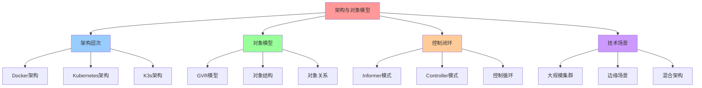

### 16.2 架构建模视图（C4 模型 + UML）

#### 系统容器图（C4 Level 2）

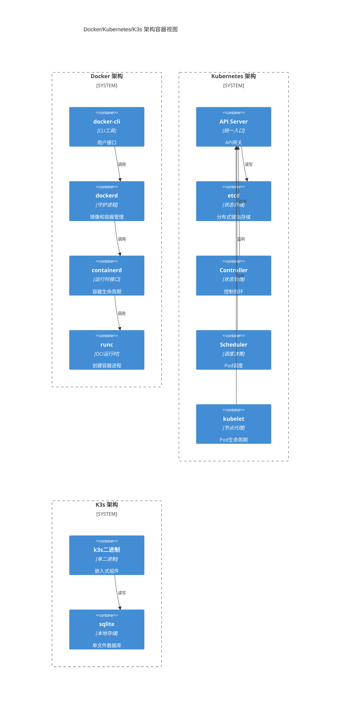

#### 对象模型类图（UML）

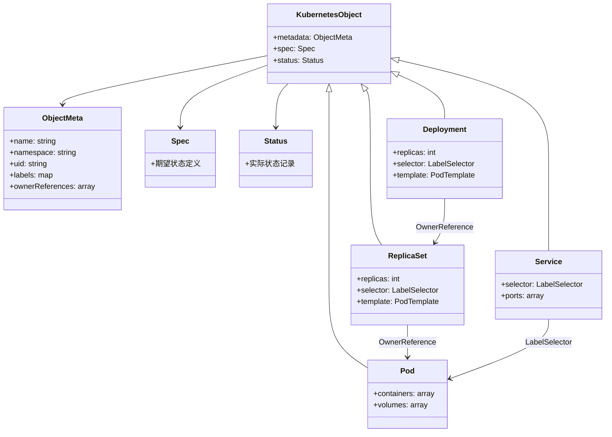

### 16.3 架构多维关系矩阵

#### 架构-组件-功能三维矩阵

| 架构维度 | Docker | Kubernetes | K3s | 控制平面 | 数据平面 | 存储 | 网络 | 认知价值 |
|---------|--------|------------|-----|---------|---------|------|------|---------|
| **架构模式** | 分层架构 | 中心化架构 | 单二进制架构 | 架构模式 | 架构模式 | 架构模式 | 架构模式 | 模式理解 |
| **控制平面** | dockerd | API Server+etcd | k3s二进制 | ✅ 核心 | ❌ 无 | ⚠️ 部分 | ⚠️ 部分 | 控制理解 |
| **数据平面** | runc | kubelet+CRI | kubelet+内置 | ❌ 无 | ✅ 核心 | ⚠️ 部分 | ⚠️ 部分 | 数据理解 |
| **存储** | 本地文件系统 | etcd | sqlite | ⚠️ 部分 | ⚠️ 部分 | ✅ 核心 | ❌ 无 | 存储理解 |
| **网络** | Bridge | CNI插件 | flannel内置 | ⚠️ 部分 | ⚠️ 部分 | ❌ 无 | ✅ 核心 | 网络理解 |
| **对象模型** | 镜像层 | GVR模型 | GVR模型 | ✅ 核心 | ⚠️ 部分 | ⚠️ 部分 | ❌ 无 | 模型理解 |
| **控制循环** | 无 | Informer+Controller | Informer+Controller | ✅ 核心 | ❌ 无 | ❌ 无 | ❌ 无 | 循环理解 |

#### 架构-场景-决策映射矩阵

| 架构 | 大规模集群 | 边缘场景 | 混合架构 | 决策依据 | 权衡 | 认知价值 |
|-----|-----------|---------|---------|---------|------|---------|
| **Docker** | ❌ 不支持 | ⚠️ 部分支持 | ❌ 不支持 | 单机容器管理 | 无集群能力 | 场景理解 |
| **Kubernetes** | ✅ 核心 | ⚠️ 部分支持 | ✅ 中心集群 | 大规模编排 | 资源占用大 | 场景理解 |
| **K3s** | ❌ 不支持 | ✅ 核心 | ✅ 边缘集群 | 轻量边缘 | 规模受限 | 场景理解 |

### 16.4 图表达和转换

#### 架构视图转换关系

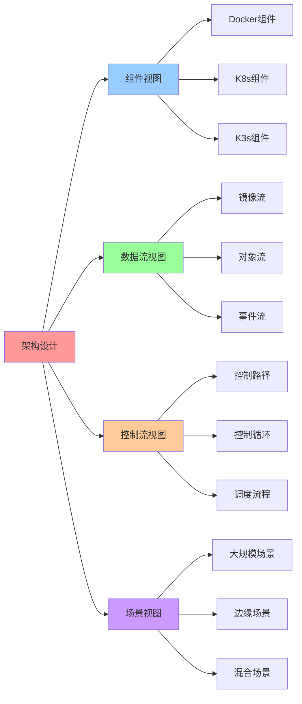

#### 视图转换规则

**转换规则 1：组件视图 → 数据流视图**:

```yaml
组件视图转换:
  输入: 架构组件（Docker、K8s、K3s）
  转换规则:
    - Docker组件 → 镜像流（镜像拉取、容器启动）
    - K8s组件 → 对象流（对象创建、状态更新）
    - K3s组件 → 对象流（轻量对象流）
  输出: 数据流（镜像流、对象流、事件流）
```

**转换规则 2：数据流视图 → 控制流视图**:

```yaml
数据流视图转换:
  输入: 数据流（镜像流、对象流、事件流）
  转换规则:
    - 镜像流 → Docker控制路径（cli→dockerd→containerd→runc）
    - 对象流 → K8s控制循环（API Server→etcd→Controller→Reconcile）
    - 事件流 → Informer模式（Watch→缓存→队列→Reconcile）
  输出: 控制流（控制路径、控制循环、调度流程）
```

**转换规则 3：控制流视图 → 场景视图**:

```yaml
控制流视图转换:
  输入: 控制流特性（控制路径、控制循环、调度流程）
  转换规则:
    - 简单控制路径 → 单机场景（Docker）
    - 复杂控制循环 → 大规模场景（Kubernetes）
    - 轻量控制循环 → 边缘场景（K3s）
  输出: 适用场景（大规模、边缘、混合）
```

### 16.5 形象化解释论证

#### 架构设计的形象化类比

##### 1. Docker 架构 = 工厂生产线

> **类比**：Docker 架构就像工厂生产线，docker-cli 是"操作员"（下达指令），dockerd 是"生产主管"（管理生产），containerd 是"车间主任"（管理车间），runc 是"工人"（执行生产），就像工厂从操作员到主管到车间主任再到工人的层级管理一样，Docker 从 CLI 到 dockerd 到 containerd 再到 runc 的层级调用。

**认知价值**：

- **层级理解**：通过工厂层级类比，理解 Docker 架构的层级性
- **职责理解**：通过工厂职责类比，理解各组件的职责分工
- **流程理解**：通过生产流程类比，理解 Docker 的控制流程

##### 2. Kubernetes 架构 = 智能城市管理系统

> **类比**：Kubernetes 架构就像智能城市管理系统，API Server 是"城市指挥中心"（统一入口），etcd 是"城市数据库"（状态存储），Controller 是"城市管理者"（状态管理），Scheduler 是"交通调度员"（资源调度），kubelet 是"区域管理员"（节点管理），就像城市管理系统从指挥中心到数据库到管理者再到调度员的协作一样，Kubernetes 从 API Server 到 etcd 到 Controller 再到 Scheduler 的协作。

**认知价值**：

- **系统理解**：通过城市管理系统类比，理解 Kubernetes 架构的系统性
- **协作理解**：通过城市协作类比，理解各组件的协作关系
- **管理理解**：通过城市管理类比，理解 Kubernetes 的管理能力

##### 3. K3s 架构 = 便携式工具箱

> **类比**：K3s 架构就像便携式工具箱，k3s 二进制是"工具箱"（集成工具），sqlite 是"工具箱内置存储"（本地存储），嵌入式组件是"工具箱内置工具"（内置功能），就像便携式工具箱从工具箱到内置存储再到内置工具的集成一样，K3s 从二进制到 sqlite 再到嵌入式组件的集成。

**认知价值**：

- **集成理解**：通过工具箱集成类比，理解 K3s 架构的集成性
- **轻量理解**：通过工具箱轻量类比，理解 K3s 的轻量特性
- **便携理解**：通过工具箱便携类比，理解 K3s 的部署便利性

##### 4. 控制循环 = 恒温器系统

> **类比**：控制循环就像恒温器系统，期望状态是"设定温度"（目标温度），实际状态是"当前温度"（实际温度），Reconcile 是"温度调节"（温度调整），就像恒温器从设定温度到当前温度再到温度调节的循环一样，控制循环从期望状态到实际状态再到 Reconcile 的循环。

**认知价值**：

- **循环理解**：通过恒温器循环类比，理解控制循环的循环性
- **收敛理解**：通过温度收敛类比，理解控制循环的收敛性
- **自动理解**：通过恒温器自动类比，理解控制循环的自动性

### 16.6 专家观点与论证

#### 计算信息软件科学家的观点

##### 1. Joe Beda（Kubernetes 联合创始人）

> "Kubernetes is about making the complex simple. It's about declarative configuration and automatic reconciliation."

**在架构设计中的应用**：

- **简化复杂性**：Kubernetes 架构通过中心化设计简化复杂系统管理
- **声明式配置**：声明式 API 提高可维护性
- **自动协调**：控制循环实现自动协调

##### 2. Tim Hockin（Kubernetes 核心开发者）

> "The control loop is the heart of Kubernetes. It's what makes Kubernetes declarative and self-healing."

**在架构设计中的应用**：

- **控制循环核心**：控制循环是 Kubernetes 架构的核心
- **自愈能力**：控制循环实现自愈能力
- **期望状态**：控制循环驱动期望状态

##### 3. Darren Shepherd（K3s 创始人）

> "K3s is Kubernetes made simple. We want to make Kubernetes accessible to everyone, especially in resource-constrained environments."

**在架构设计中的应用**：

- **简化架构**：K3s 通过单二进制简化架构
- **资源优化**：K3s 优化资源占用
- **边缘支持**：K3s 支持边缘场景

#### 计算信息软件教育家的观点

##### 1. Kelsey Hightower（Kubernetes 教育家）

> "Understanding Kubernetes is about understanding the control loop. Once you understand the control loop, everything else makes sense."

**教育价值**：

- **控制循环**：理解控制循环是理解 Kubernetes 架构的关键
- **核心概念**：控制循环是 Kubernetes 的核心概念
- **学习路径**：从控制循环开始学习 Kubernetes

##### 2. Liz Rice（容器安全教育家）

> "Container security is about understanding the isolation boundaries. Each technology provides different levels of isolation."

**教育价值**：

- **隔离边界**：理解隔离边界是理解容器架构的关键
- **层次理解**：不同架构提供不同层次的隔离
- **架构理解**：通过隔离边界理解架构设计

#### 计算信息软件认知学家的观点

##### 1. David Marr（计算认知科学家）

> "Understanding complex systems requires understanding them at multiple levels: computation, algorithm, and implementation."

**认知价值**：

- **多层次理解**：理解复杂架构需要在多个层次上理解
- **架构层次**：架构层是理解技术栈的重要层次
- **系统理解**：通过架构层理解技术栈的系统性

##### 2. Douglas Hofstadter（认知科学家）

> "Analogy is the core of cognition. Understanding new concepts through analogy helps us build mental models."

**认知价值**：

- **类比核心**：类比是认知的核心
- **架构理解**：通过类比理解架构概念
- **模型构建**：通过类比构建架构的心理模型

### 16.7 认知学习路径矩阵

| 学习阶段 | 核心架构 | 形象化理解 | 技术理解 | 实践应用 | 认知目标 |
|---------|---------|-----------|---------|---------|---------|
| **入门** | Docker架构 | 工厂生产线类比 | 分层架构 | 单机部署 | 建立基础 |
| **进阶** | Kubernetes架构 | 智能城市类比 | 中心化架构 | 集群管理 | 理解架构 |
| **高级** | K3s架构 | 便携工具箱类比 | 单二进制架构 | 边缘部署 | 掌握架构 |

### 16.8 专家推荐阅读路径

**计算信息软件科学家推荐路径**：

1. **架构演进**：从 Docker 到 Kubernetes 到 K3s 的架构演进
2. **对象模型**：理解 Kubernetes 对象模型的设计
3. **控制循环**：理解控制循环的实现机制
4. **架构决策**：理解架构决策的依据和思路

**计算信息软件教育家推荐路径**：

1. **形象化理解**：通过工厂生产线、智能城市、便携工具箱等类比，建立直观理解
2. **渐进学习**：从简单架构开始，逐步学习复杂架构
3. **实践结合**：结合实际案例，理解架构应用
4. **思维训练**：通过架构学习，训练系统性思维能力

**计算信息软件认知学家推荐路径**：

1. **认知模式**：识别架构设计中的认知模式
2. **类比理解**：通过类比理解架构概念
3. **模型构建**：构建架构的心理模型
4. **认知提升**：通过架构学习，提升认知能力

> 完整参考列表见 [REFERENCES.md](../REFERENCES.md)
>
> ---
>
> ## 2025 年最新实践
>
> ### 架构与对象模型应用最佳实践（2025）
>
> **2025 年趋势**：Kubernetes 对象模型、控制闭环机制在云原生架构设计中的深度应用
>
> **实践要点**：
>
> - **对象模型设计**：使用 GVR 模型进行对象模型设计
> - **控制闭环**：使用 Informer 和 Controller 模式实现控制闭环
> - **架构设计**：使用控制闭环机制进行架构设计
>
> **代码示例**：
>
> ```go
> // 2025 年 Kubernetes 控制闭环工具
> type ControllerTool struct {
>     informer cache.SharedInformer
>     controller cache.Controller
>     handler ResourceHandler
> }
>
> func (c *ControllerTool) Start(ctx context.Context) error {
>     // 启动 Informer
>     go c.informer.Run(ctx.Done())
>     // 等待缓存同步
>     if !cache.WaitForCacheSync(ctx.Done(), c.informer.HasSynced) {
>         return fmt.Errorf("failed to sync cache")
>     }
>     // 启动 Controller
>     return c.controller.Run(ctx.Done())
> }
> ```
>
> ## 实际应用案例
>
> ### 案例 1：Kubernetes 控制闭环架构设计（2025）
>
> **场景**：使用 Kubernetes 控制闭环机制进行架构设计
>
> **实现方案**：
>
> ```go
> // Kubernetes 控制闭环架构设计
> tool := &ControllerTool{
>     informer: informerFactory.Core().V1().Pods().Informer(),
>     controller: controller.NewController(informer, handler),
> }
>
> // 启动控制闭环
> ctx := context.Background()
> if err := tool.Start(ctx); err != nil {
>     log.Fatal(err)
> }
> ```
>
> **效果**：
>
> - 控制闭环：基于 Informer 和 Controller 的控制闭环，保证系统一致性
> - 对象模型：使用 GVR 模型进行对象模型设计，提高设计规范性
> - 架构设计：使用控制闭环机制进行架构设计，提高架构可靠性
>
> ---
>
> **最后更新**：2025-11-15
> **文档状态**：✅ 完整 | 📊 包含思维导图、建模视图、多维矩阵、图表达转换、形象化解释论证、专家观点
> **维护者**：项目团队
>
> **📊 2025 年技术趋势参考**：详细技术状态和版本信息请查看
> [27. 2025 年技术趋势汇总](../../TECHNICAL/10-reference-trends/2025-trends/2025-trends.md)
