# 执行流与调度视角：虚拟化技术本质分析

## 📑 目录

- [执行流与调度视角：虚拟化技术本质分析](#执行流与调度视角虚拟化技术本质分析)
  - [📑 目录](#-目录)
  - [1 文档定位](#1-文档定位)
  - [2 执行流视角总览](#2-执行流视角总览)
    - [2.1 思维导图全景](#21-思维导图全景)
    - [2.2 核心对比矩阵](#22-核心对比矩阵)
  - [3 全虚拟化执行流](#3-全虚拟化执行流)
    - [3.1 触发机制](#31-触发机制)
    - [3.2 截获机制](#32-截获机制)
    - [3.3 调度实体](#33-调度实体)
    - [3.4 执行路径](#34-执行路径)
    - [3.5 性能开销分析](#35-性能开销分析)
  - [4 半虚拟化执行流](#4-半虚拟化执行流)
    - [4.1 触发机制](#41-触发机制)
    - [4.2 截获机制](#42-截获机制)
    - [4.3 调度实体](#43-调度实体)
    - [4.4 执行路径](#44-执行路径)
    - [4.5 性能开销分析](#45-性能开销分析)
  - [5 容器化执行流](#5-容器化执行流)
    - [5.1 触发机制](#51-触发机制)
    - [5.2 截获机制](#52-截获机制)
    - [5.3 调度实体](#53-调度实体)
    - [5.4 执行路径](#54-执行路径)
    - [5.5 性能开销分析](#55-性能开销分析)
  - [6 沙盒化执行流](#6-沙盒化执行流)
    - [6.1 触发机制](#61-触发机制)
    - [6.2 截获机制](#62-截获机制)
    - [6.3 调度实体](#63-调度实体)
    - [6.4 执行路径](#64-执行路径)
    - [6.5 性能开销分析](#65-性能开销分析)
  - [7 对比论证](#7-对比论证)
    - [7.1 执行路径对比](#71-执行路径对比)
    - [7.2 性能开销对比](#72-性能开销对比)
    - [7.3 技术选型决策](#73-技术选型决策)
    - [7.4 基于设备与内核特性的决策](#74-基于设备与内核特性的决策)
      - [7.4.1 设备访问需求分析](#741-设备访问需求分析)
      - [7.4.2 内核特性需求分析](#742-内核特性需求分析)
      - [7.4.3 资源访问需求分析](#743-资源访问需求分析)
      - [7.4.4 综合决策树](#744-综合决策树)
      - [7.4.5 决策案例分析](#745-决策案例分析)
        - [案例 1：USB 设备访问需求](#案例-1usb-设备访问需求)
        - [案例 2：高并发网络 I/O（epoll）](#案例-2高并发网络-ioepoll)
        - [案例 3：异步 I/O（io\_uring）](#案例-3异步-ioio_uring)
        - [案例 4：GPU 加速应用（AI 推理）](#案例-4gpu-加速应用ai-推理)
        - [案例 5：多租户 GPU 平台](#案例-5多租户-gpu-平台)
        - [案例 6：纯计算逻辑（无 I/O）](#案例-6纯计算逻辑无-io)
        - [案例 7：边缘计算（资源受限）](#案例-7边缘计算资源受限)
  - [8 形式化模型](#8-形式化模型)
    - [8.1 执行流模型](#81-执行流模型)
    - [8.2 调度开销模型](#82-调度开销模型)
  - [9 参考](#9-参考)
    - [相关文档](#相关文档)
    - [外部参考](#外部参考)
  - [10 认知增强：思维导图、建模视图与图表达转换](#10-认知增强思维导图建模视图与图表达转换)
    - [10.1 执行流视角完整思维导图](#101-执行流视角完整思维导图)
    - [10.2 执行流建模视图（UML 状态机 + 序列图）](#102-执行流建模视图uml-状态机--序列图)
      - [执行流状态机图](#执行流状态机图)
      - [执行流对比序列图](#执行流对比序列图)
    - [10.3 执行流多维关系矩阵](#103-执行流多维关系矩阵)
      - [范式-机制-开销三维矩阵](#范式-机制-开销三维矩阵)
      - [设备-内核特性-范式映射矩阵](#设备-内核特性-范式映射矩阵)
    - [10.4 图表达和转换](#104-图表达和转换)
      - [执行流视图转换关系](#执行流视图转换关系)
      - [视图转换规则](#视图转换规则)
    - [10.5 形象化解释论证](#105-形象化解释论证)
      - [执行流视角的形象化类比](#执行流视角的形象化类比)
        - [1. 全虚拟化 = 翻译官系统](#1-全虚拟化--翻译官系统)
        - [2. 半虚拟化 = 协作翻译系统](#2-半虚拟化--协作翻译系统)
        - [3. 容器化 = 直接服务系统](#3-容器化--直接服务系统)
        - [4. 沙盒化 = 安全检查系统](#4-沙盒化--安全检查系统)
    - [10.6 专家观点与论证](#106-专家观点与论证)
      - [计算信息软件科学家的观点](#计算信息软件科学家的观点)
        - [1. Gerald J. Popek（虚拟化理论奠基人）](#1-gerald-j-popek虚拟化理论奠基人)
        - [2. Leslie Lamport（分布式系统理论家）](#2-leslie-lamport分布式系统理论家)
        - [3. Butler Lampson（系统设计大师）](#3-butler-lampson系统设计大师)
      - [计算信息软件教育家的观点](#计算信息软件教育家的观点)
        - [1. Andrew S. Tanenbaum（操作系统教育家）](#1-andrew-s-tanenbaum操作系统教育家)
        - [2. Maurice Herlihy（并发理论教育家）](#2-maurice-herlihy并发理论教育家)
      - [计算信息软件认知学家的观点](#计算信息软件认知学家的观点)
        - [1. Daniel Kahneman（认知心理学家）](#1-daniel-kahneman认知心理学家)
        - [2. Amos Tversky（认知科学家）](#2-amos-tversky认知科学家)
    - [10.7 认知学习路径矩阵](#107-认知学习路径矩阵)
    - [10.8 专家推荐阅读路径](#108-专家推荐阅读路径)
  - [2025 年最新实践](#2025-年最新实践)
    - [执行流与调度视角应用最佳实践（2025）](#执行流与调度视角应用最佳实践2025)
  - [实际应用案例](#实际应用案例)
    - [案例 1：执行流与调度视角技术选型（2025）](#案例-1执行流与调度视角技术选型2025)

---

## 1 文档定位

本文档从**执行流与调度**的底层视角，深入分析虚拟化、半虚拟化、容器化、沙盒化四种
技术范式的本质差异。

**核心价值**：

- **执行流视角**：从 CPU 指令执行路径理解技术本质
- **调度视角**：从操作系统调度机制理解性能开销
- **截获机制**：理解事件触发、截获、处理的技术细节
- **技术决策**：基于执行流特性选择合适的技术范式

**文档结构**：

- **执行流全景**：思维导图与对比矩阵
- **四种范式详解**：触发 → 截获 → 调度 → 路径的完整分析
- **性能对比**：开销量化与决策依据
- **形式化模型**：数学建模与理论分析

## 2 执行流视角总览

### 2.1 思维导图全景

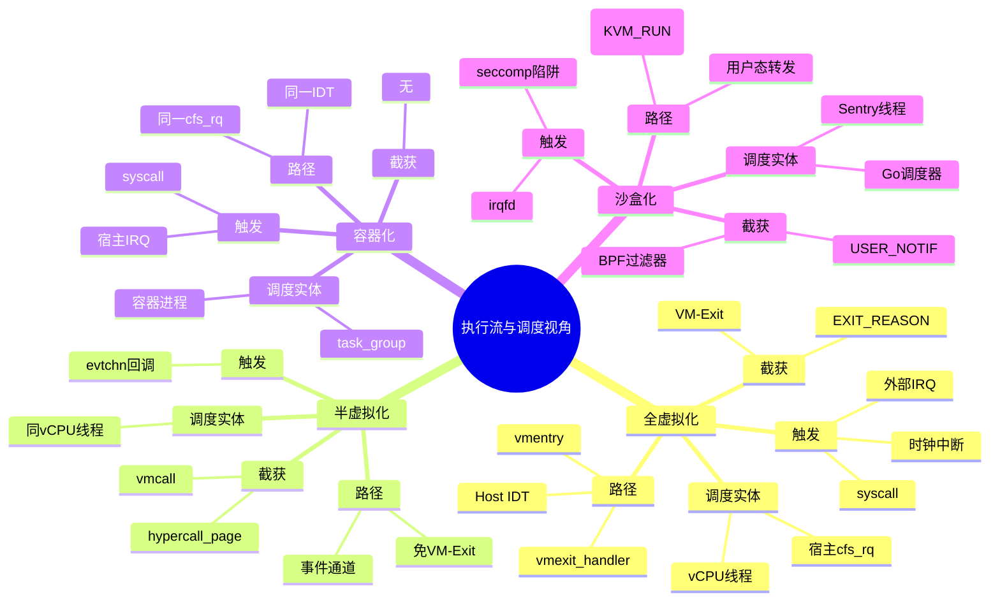
```mermaid
mindmap
  root((执行流与调度视角))

    全虚拟化

      触发

        时钟中断

        外部IRQ

        syscall

      截获

        VM-Exit

        EXIT_REASON

      调度实体

        vCPU线程

        宿主cfs_rq

      路径

        Host IDT

        vmexit_handler

        vmentry

    半虚拟化

      触发

        evtchn回调

      截获

        vmcall

        hypercall_page

      调度实体

        同vCPU线程

      路径

        事件通道

        免VM-Exit

    容器化

      触发

        宿主IRQ

        syscall

      截获

        无

      调度实体

        容器进程

        task_group

      路径

        同一cfs_rq

        同一IDT

    沙盒化

      触发

        seccomp陷阱

        irqfd

      截获

        BPF过滤器

        USER_NOTIF

      调度实体

        Sentry线程

        Go调度器

      路径

        用户态转发

        ioctl(KVM_RUN)
```

### 2.2 核心对比矩阵

| 范式         | 触发机制           | 截获机制         | 调度实体    | 执行路径               | 开销（CPU cycles） |
| ------------ | ------------------ | ---------------- | ----------- | ---------------------- | ------------------ |
| **全虚拟化** | 时钟中断、外部 IRQ | VM-Exit          | vCPU 线程   | Host IDT → vmexit      | > 1000             |
| **半虚拟化** | evtchn 回调        | vmcall/hypercall | vCPU 线程   | 事件通道（免 VM-Exit） | 800-1200           |
| **容器化**   | 宿主 IRQ、syscall  | 无（直接执行）   | 容器进程    | 同一 cfs_rq            | ~500               |
| **沙盒化**   | seccomp 陷阱       | BPF 过滤器       | Sentry 线程 | 用户态转发             | < 100              |

**关键洞察**：

1. **截获机制决定开销**：VM-Exit 最高，hypercall 次之，直接执行最低
2. **调度实体决定隔离**：vCPU 线程 > 容器进程 > Sentry 线程
3. **执行路径决定延迟**：用户态转发最快，VM-Exit 最慢

## 3 全虚拟化执行流

### 3.1 触发机制

**触发事件类型**：

| 触发类型     | 描述                            | 频率            | 影响       |
| ------------ | ------------------------------- | --------------- | ---------- |
| **时钟中断** | Guest OS 时钟中断               | 1000 Hz         | 高（频繁） |
| **外部 IRQ** | 设备中断（网络、存储等）        | 取决于 I/O 负载 | 中         |
| **syscall**  | Guest 应用系统调用              | 取决于应用特性  | 中高       |
| **特权指令** | Guest 执行特权指令（如 IN/OUT） | 设备访问时      | 低         |

**触发流程**：

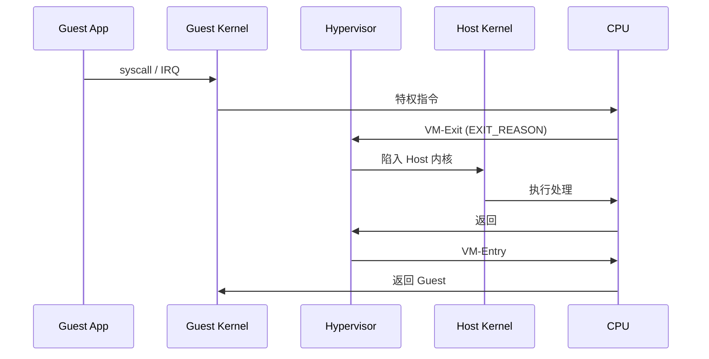
```mermaid
sequenceDiagram
    participant G as Guest App
    participant GK as Guest Kernel
    participant HV as Hypervisor
    participant HK as Host Kernel
    participant CPU as CPU

    G->>GK: syscall / IRQ
    GK->>CPU: 特权指令
    CPU->>HV: VM-Exit (EXIT_REASON)
    HV->>HK: 陷入 Host 内核
    HK->>CPU: 执行处理
    CPU->>HV: 返回
    HV->>CPU: VM-Entry
    CPU->>GK: 返回 Guest
```

### 3.2 截获机制

**VM-Exit 机制**：

```text
Guest 执行特权指令
    ↓
CPU 检测到 CPL ≠ 0（或在非 root 模式执行特权指令）
    ↓
触发 VM-Exit
    ↓
保存 Guest 状态（VMCS/VMX）
    ↓
加载 Host 状态
    ↓
跳转到 vmexit_handler
```

**EXIT_REASON 分类**：

| EXIT_REASON                      | 描述        | 处理延迟 | 频率 |
| -------------------------------- | ----------- | -------- | ---- |
| `EXIT_REASON_EXCEPTION_NMI`      | 异常或 NMI  | ~1000 ns | 中   |
| `EXIT_REASON_EXTERNAL_INTERRUPT` | 外部中断    | ~800 ns  | 高   |
| `EXIT_REASON_IO_INSTRUCTION`     | IN/OUT 指令 | ~1200 ns | 低   |
| `EXIT_REASON_CPUID`              | CPUID 指令  | ~500 ns  | 低   |
| `EXIT_REASON_MSR_READ/WRITE`     | MSR 访问    | ~800 ns  | 低   |

**性能开销**：

- **上下文切换**：~2000 CPU cycles（保存/恢复 Guest 状态）
- **Host IDT 查找**：~100 CPU cycles
- **vmexit_handler 处理**：~500-2000 CPU cycles（取决于 EXIT_REASON）

**总开销**：**> 1000 CPU cycles**（通常 2000-4000 cycles）

### 3.3 调度实体

**vCPU 线程模型**：

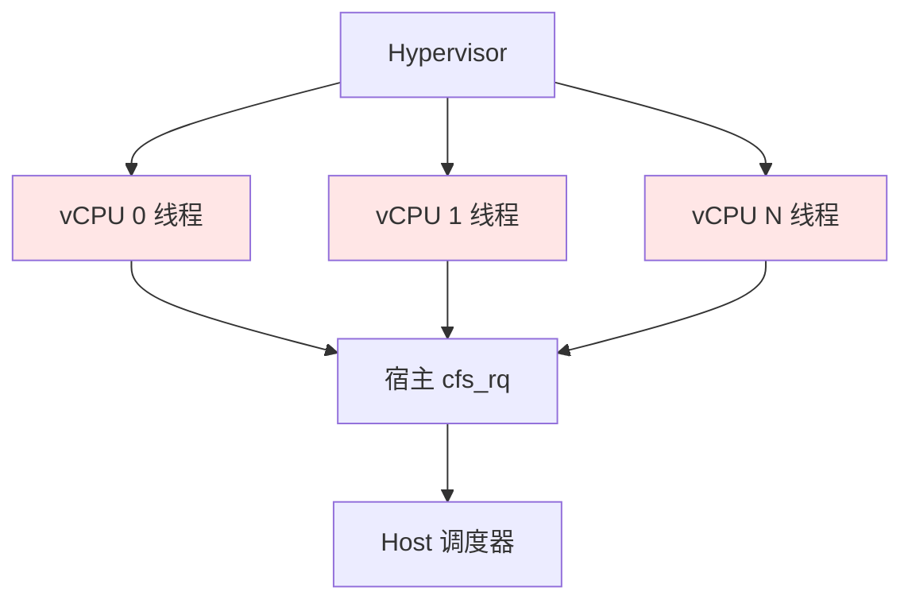
```mermaid
graph TB
    A[Hypervisor] --> B[vCPU 0 线程]
    A --> C[vCPU 1 线程]
    A --> D[vCPU N 线程]

    B --> E[宿主 cfs_rq]
    C --> E
    D --> E

    E --> F[Host 调度器]

    style B fill:#ffe6e6
    style C fill:#ffe6e6
    style D fill:#ffe6e6
```

**调度特性**：

1. **vCPU 作为普通线程**：每个 vCPU 对应一个宿主线程
2. **CFS 调度**：vCPU 线程参与 Host 的 CFS 调度
3. **两级调度**：Guest OS 调度 + Hypervisor 调度
4. **调度延迟**：Host 调度延迟 + Guest 调度延迟

**调度开销**：

- **Host 调度**：~500 CPU cycles（CFS 调度开销）
- **Guest 调度**：~500 CPU cycles（Guest OS 调度开销）
- **总调度开销**：~1000 CPU cycles（两级调度叠加）

### 3.4 执行路径

**完整执行路径**：

```text
Guest App → Guest Kernel
    ↓ (特权指令/中断)
VM-Exit (EXIT_REASON)
    ↓
Host IDT (中断描述符表)
    ↓
vmexit_handler()
    ↓
处理逻辑（I/O 模拟、中断注入等）
    ↓
VM-Entry
    ↓
Guest Kernel → Guest App
```

**代码路径（KVM）**：

```c
// Guest 执行特权指令
guest_execute():
    ↓
vmx_vcpu_run() // 执行 Guest
    ↓
vmx_vcpu_exit() // VM-Exit 发生
    ↓
handle_exit() // 根据 EXIT_REASON 分发
    ↓
kvm_vmx_exit_handlers[exit_reason]() // 具体处理函数
    ↓
vmx_vcpu_enter_exit() // VM-Entry
```

**路径延迟分解**：

| 阶段         | 延迟              | 说明            |
| ------------ | ----------------- | --------------- |
| **VM-Exit**  | ~500 ns           | 硬件上下文切换  |
| **Host IDT** | ~100 ns           | IDT 查找        |
| **Handler**  | ~500-2000 ns      | 处理逻辑        |
| **VM-Entry** | ~500 ns           | 恢复 Guest 状态 |
| **总计**     | **~1600-3100 ns** |                 |

### 3.5 性能开销分析

**CPU 开销模型**：

$$C_{\text{VM}} = C_{\text{workload}} + C_{\text{vmexit}} + C_{\text{schedule}}$$

其中：

- $C_{\text{workload}}$：工作负载开销
- $C_{\text{vmexit}}$：VM-Exit 开销 = $f_{\text{exit}} \times L_{\text{exit}}$
  - $f_{\text{exit}}$：VM-Exit 频率（~10K-100K exits/sec）
  - $L_{\text{exit}}$：每次 VM-Exit 延迟（~1600-3100 ns）
- $C_{\text{schedule}}$：两级调度开销 = ~1000 CPU cycles

**CPU 利用率**：

$$\text{CPU}_{\text{utilization}} = \frac{C_{\text{workload}}}{C_{\text{VM}}} \approx 70-80\%$$

**性能瓶颈**：

1. **VM-Exit 频率**：时钟中断（1000 Hz）导致频繁退出
2. **上下文切换**：保存/恢复 Guest 状态开销大
3. **两级调度**：Host 调度 + Guest 调度叠加延迟

## 4 半虚拟化执行流

### 4.1 触发机制

**触发事件类型**：

| 触发类型      | 描述                      | 频率            | 影响 |
| ------------- | ------------------------- | --------------- | ---- |
| **evtchn**    | 事件通道回调（Xen）       | 取决于事件频率  | 中高 |
| **hypercall** | Guest 主动调用 Hypervisor | 设备 I/O 时     | 中   |
| **I/O 请求**  | Guest 需要访问设备        | 取决于 I/O 负载 | 高   |
| **通知机制**  | VirtIO 通知机制           | 取决于设备特性  | 中高 |

**触发流程**：

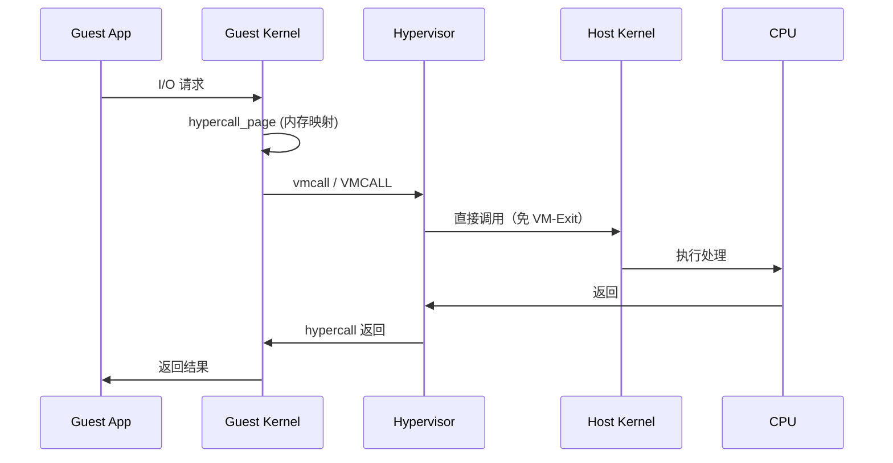
```mermaid
sequenceDiagram
    participant G as Guest App
    participant GK as Guest Kernel
    participant HV as Hypervisor
    participant HK as Host Kernel
    participant CPU as CPU

    G->>GK: I/O 请求
    GK->>GK: hypercall_page (内存映射)
    GK->>HV: vmcall / VMCALL
    HV->>HK: 直接调用（免 VM-Exit）
    HK->>CPU: 执行处理
    CPU->>HV: 返回
    HV->>GK: hypercall 返回
    GK->>G: 返回结果
```

**关键优化**：

- **hypercall_page**：Guest 内存中映射的 Hypervisor 代码页
- **免 VM-Exit**：通过协作机制避免硬件陷阱
- **事件通道**：专用通信机制，避免轮询

### 4.2 截获机制

**hypercall 机制（Xen）**：

```text
Guest 调用 hypercall_page 中的函数
    ↓
CPU 执行 VMCALL 指令（或类似）
    ↓
Hypervisor 截获（软件层面，非硬件陷阱）
    ↓
直接调用 Hypervisor 处理函数
    ↓
返回 Guest
```

**VirtIO 通知机制**：

```text
Guest 写入 VirtIO 队列
    ↓
通知 Host（通过 MMIO 或 I/O 端口）
    ↓
Host 处理 I/O（中断或轮询）
    ↓
完成通知 Guest（通过事件通道）
```

**截获开销对比**：

| 机制          | 截获方式        | 开销（CPU cycles） | 说明                 |
| ------------- | --------------- | ------------------ | -------------------- |
| **VM-Exit**   | 硬件陷阱        | > 1000             | 全虚拟化             |
| **hypercall** | 软件调用        | ~200-400           | 半虚拟化（协作优化） |
| **事件通道**  | 共享内存 + 通知 | ~100-200           | Xen 专用机制（最优） |

**性能提升**：

- **避免 VM-Exit**：减少硬件上下文切换
- **协作优化**：Guest 主动配合，减少陷阱频率
- **专用通道**：事件通道替代频繁的中断

### 4.3 调度实体

**vCPU 线程模型**（与全虚拟化相同）：

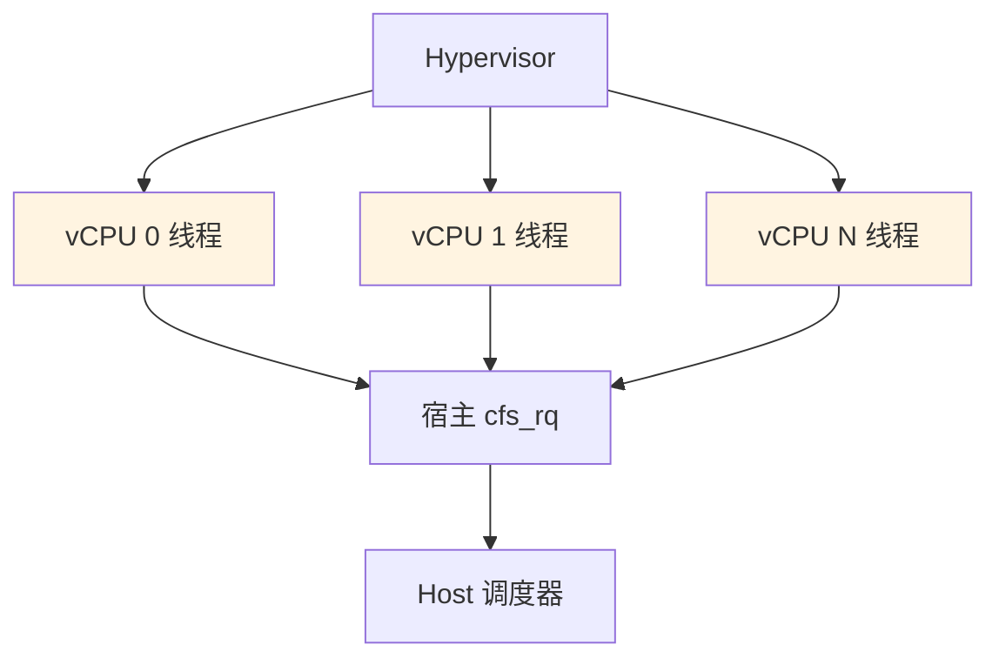
```mermaid
graph TB
    A[Hypervisor] --> B[vCPU 0 线程]
    A --> C[vCPU 1 线程]
    A --> D[vCPU N 线程]

    B --> E[宿主 cfs_rq]
    C --> E
    D --> E

    E --> F[Host 调度器]

    style B fill:#fff4e1
    style C fill:#fff4e1
    style D fill:#fff4e1
```

**调度特性**：

1. **同 vCPU 线程**：仍然使用 vCPU 线程模型
2. **协作调度**：Guest OS 通过 hypercall 协作，减少调度冲突
3. **调度提示**：Guest 可以提供调度提示（如"阻塞 I/O"）
4. **性能提升**：减少调度竞争，提高 CPU 利用率

**调度优化**：

- **调度提示**：Guest 通过 hypercall 告知 Hypervisor 调度需求
- **批量处理**：减少调度切换频率
- **CPU 绑定**：可以绑定 vCPU 到特定物理 CPU

### 4.4 执行路径

**完整执行路径**：

```text
Guest App → Guest Kernel
    ↓ (I/O 请求)
hypercall_page (内存映射)
    ↓
vmcall / VMCALL (软件调用)
    ↓
Hypervisor 处理函数（直接调用）
    ↓
Host Kernel（必要时）
    ↓
返回 hypercall
    ↓
Guest Kernel → Guest App
```

**Xen 事件通道路径**：

```text
Guest 需要 I/O
    ↓
写入 VirtIO 队列
    ↓
通知事件通道（evtchn）
    ↓
Host 处理（无需 VM-Exit）
    ↓
完成通知 Guest
```

**代码路径（Xen）**：

```c
// Guest 调用 hypercall
guest_hypercall():
    ↓
HYPERVISOR_hypercall() // 宏定义，映射到 hypercall_page
    ↓
__HYPERVISOR_xxx() // 具体 hypercall 函数
    ↓
do_hypercall() // Hypervisor 处理
    ↓
直接调用处理逻辑（免 VM-Exit）
    ↓
返回 Guest
```

**路径延迟分解**：

| 阶段                | 延迟            | 说明                 |
| ------------------- | --------------- | -------------------- |
| **hypercall 调用**  | ~50 ns          | 函数调用开销         |
| **Hypervisor 处理** | ~100-300 ns     | 直接调用，无硬件切换 |
| **Host Kernel**     | ~100-500 ns     | 必要时调用           |
| **总计**            | **~250-850 ns** |                      |

### 4.5 性能开销分析

**CPU 开销模型**：

$$C_{\text{PV}} = C_{\text{workload}} + C_{\text{hypercall}} + C_{\text{schedule}}$$

其中：

- $C_{\text{workload}}$：工作负载开销
- $C_{\text{hypercall}}$：hypercall 开销 =
  $f_{\text{hcall}} \times L_{\text{hcall}}$
  - $f_{\text{hcall}}$：hypercall 频率（比 VM-Exit 少 50-80%）
  - $L_{\text{hcall}}$：每次 hypercall 延迟（~250-850 ns，比 VM-Exit 快 2-3 倍）
- $C_{\text{schedule}}$：调度开销（~1000 CPU cycles，与全虚拟化相同）

**CPU 利用率**：

$$\text{CPU}_{\text{utilization}} = \frac{C_{\text{workload}}}{C_{\text{PV}}} \approx 75-85\%$$

**性能提升来源**：

1. **减少陷阱频率**：hypercall 比 VM-Exit 少 50-80%
2. **降低单次开销**：~250-850 ns vs ~1600-3100 ns
3. **协作优化**：Guest 主动配合，减少无效切换

## 5 容器化执行流

### 5.1 触发机制

**触发事件类型**：

| 触发类型     | 描述                    | 频率            | 影响 |
| ------------ | ----------------------- | --------------- | ---- |
| **宿主 IRQ** | 设备中断（直接到 Host） | 取决于 I/O 负载 | 中   |
| **syscall**  | 容器进程系统调用        | 取决于应用特性  | 高   |
| **调度事件** | 时间片到期、唤醒        | 1000 Hz         | 高   |
| **信号**     | 进程信号（SIGTERM 等）  | 管理操作时      | 低   |

**触发流程**：

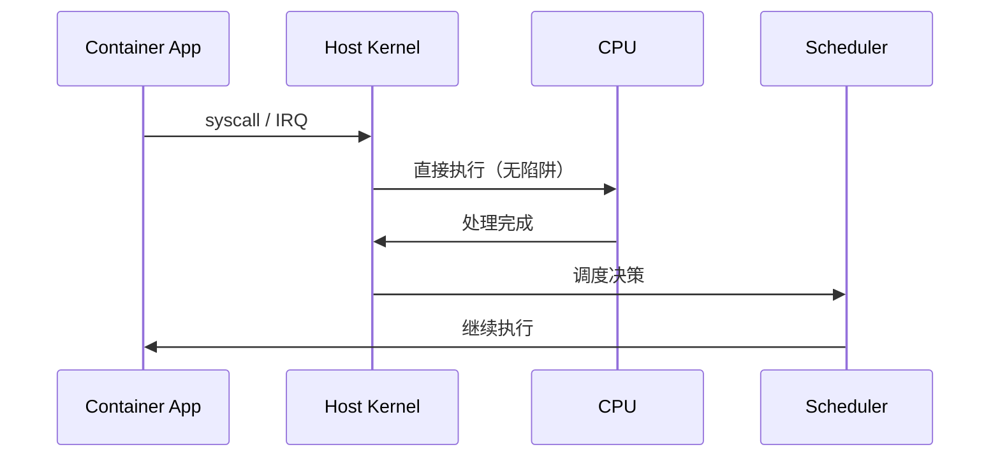
```mermaid
sequenceDiagram
    participant CA as Container App
    participant HK as Host Kernel
    participant CPU as CPU
    participant S as Scheduler

    CA->>HK: syscall / IRQ
    HK->>CPU: 直接执行（无陷阱）
    CPU->>HK: 处理完成
    HK->>S: 调度决策
    S->>CA: 继续执行
```

**关键特性**：

- **无陷阱**：容器进程系统调用直接进入 Host 内核
- **直接执行**：无中间层，无上下文切换
- **同一 IDT**：容器和 Host 共享中断描述符表

### 5.2 截获机制

**容器化：无截获**：

```text
容器进程执行 syscall
    ↓
直接进入 Host 内核（无陷阱）
    ↓
Host 内核处理（普通系统调用）
    ↓
返回容器进程
```

**Namespace 隔离**：

虽然无硬件截获，但通过 Namespace 实现隔离：

| Namespace 类型 | 隔离内容   | 实现方式         |
| -------------- | ---------- | ---------------- |
| **PID**        | 进程 ID    | 进程树隔离       |
| **NET**        | 网络栈     | 网络设备隔离     |
| **MOUNT**      | 文件系统   | 挂载点隔离       |
| **UTS**        | 主机名     | 内核数据结构隔离 |
| **IPC**        | 进程间通信 | IPC 对象隔离     |
| **USER**       | 用户 ID    | UID/GID 映射     |
| **CGROUP**     | 资源限制   | Cgroup 子系统    |
| **TIME**       | 时钟       | 时间命名空间     |

**截获开销**：

- **无硬件陷阱**：0 CPU cycles（直接执行）
- **Namespace 查找**：~10-50 CPU cycles（内核数据结构查找）
- **Cgroup 更新**：~20-100 CPU cycles（资源使用统计）

**总开销**：**~30-150 CPU cycles**（极低）

### 5.3 调度实体

**容器进程模型**：

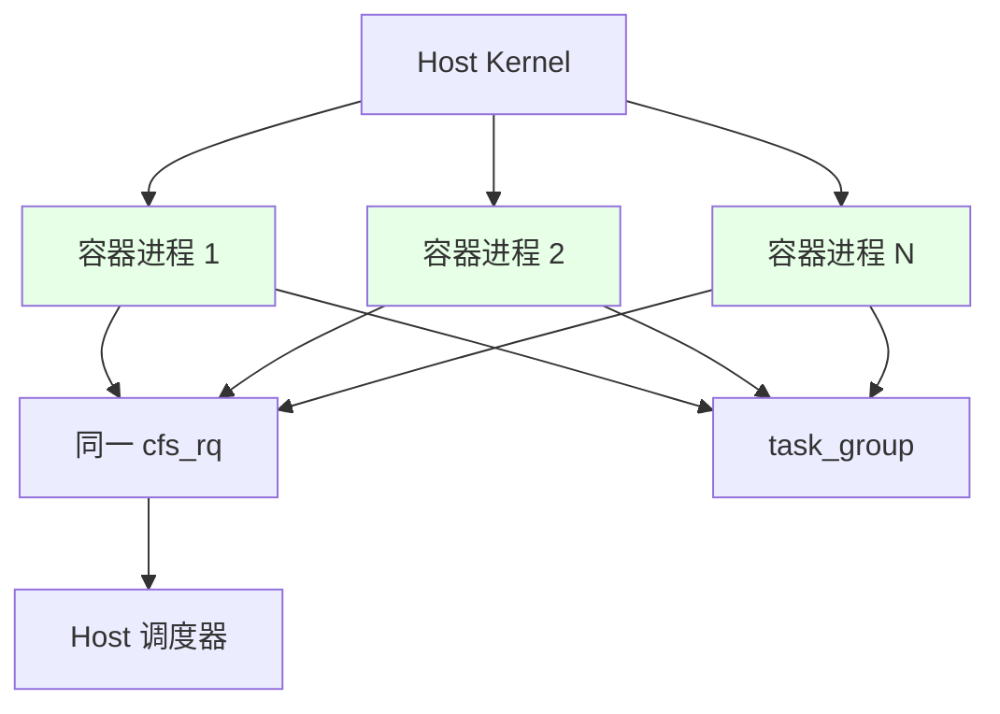
```mermaid
graph TB
    A[Host Kernel] --> B[容器进程 1]
    A --> C[容器进程 2]
    A --> D[容器进程 N]

    B --> E[同一 cfs_rq]
    C --> E
    D --> E

    E --> F[Host 调度器]

    B --> G[task_group]
    C --> G
    D --> G

    style B fill:#e6ffe6
    style C fill:#e6ffe6
    style D fill:#e6ffe6
```

**调度特性**：

1. **普通进程**：容器进程就是 Host 的普通进程
2. **同一 cfs_rq**：容器进程与 Host 进程共享调度队列
3. **Cgroup 控制**：通过 Cgroup 限制资源使用
4. **单级调度**：只有 Host 调度，无二级调度

**调度开销**：

- **Host 调度**：~500 CPU cycles（CFS 调度开销）
- **Cgroup 更新**：~20-100 CPU cycles
- **总调度开销**：**~520-600 CPU cycles**（单级调度）

### 5.4 执行路径

**完整执行路径**：

```text
容器进程
    ↓ (syscall)
Host 内核（直接进入）
    ↓
系统调用处理（普通内核路径）
    ↓
Namespace 查找（如需要）
    ↓
执行逻辑
    ↓
返回容器进程
```

**代码路径（Linux）**：

```c
// 容器进程系统调用
container_syscall():
    ↓
SYSCALL_DEFINEx() // 系统调用定义
    ↓
do_syscall_64() // x86_64 系统调用入口
    ↓
sys_call_table[nr]() // 调用具体处理函数
    ↓
普通内核处理（无特殊路径）
    ↓
返回用户态
```

**路径延迟分解**：

| 阶段               | 延迟             | 说明             |
| ------------------ | ---------------- | ---------------- |
| **syscall 进入**   | ~10 ns           | 系统调用指令开销 |
| **内核处理**       | ~100-1000 ns     | 具体系统调用处理 |
| **Namespace 查找** | ~10-50 ns        | 如需要           |
| **返回用户态**     | ~10 ns           | SYSRET 指令      |
| **总计**           | **~130-1070 ns** |                  |

### 5.5 性能开销分析

**CPU 开销模型**：

$$C_{\text{Container}} = C_{\text{workload}} + C_{\text{namespace}} + C_{\text{schedule}}$$

其中：

- $C_{\text{workload}}$：工作负载开销
- $C_{\text{namespace}}$：Namespace 开销 = $f_{\text{ns}} \times L_{\text{ns}}$
  - $f_{\text{ns}}$：Namespace 查找频率（低频，主要在创建/删除时）
  - $L_{\text{ns}}$：每次查找延迟（~10-50 ns）
- $C_{\text{schedule}}$：调度开销 = ~520-600 CPU cycles（单级调度）

**CPU 利用率**：

$$\text{CPU}_{\text{utilization}} = \frac{C_{\text{workload}}}{C_{\text{Container}}} \approx 85-95\%$$

**性能优势**：

1. **无硬件陷阱**：直接执行，无 VM-Exit 开销
2. **单级调度**：只有 Host 调度，无两级调度叠加
3. **共享内核**：容器与 Host 共享内核，无上下文切换

## 6 沙盒化执行流

### 6.1 触发机制

**触发事件类型**：

| 触发类型      | 描述                        | 频率             | 影响 |
| ------------- | --------------------------- | ---------------- | ---- |
| **seccomp**   | 系统调用过滤（seccomp-BPF） | 每次系统调用     | 高   |
| **irqfd**     | 中断转发（KVM irqfd）       | 设备中断时       | 中   |
| **用户事件**  | gVisor Sentry 用户事件      | 取决于应用特性   | 高   |
| **Wasm 调用** | Wasm 模块调用 Host 函数     | 取决于 Wasm 应用 | 中高 |

**触发流程（gVisor）**：

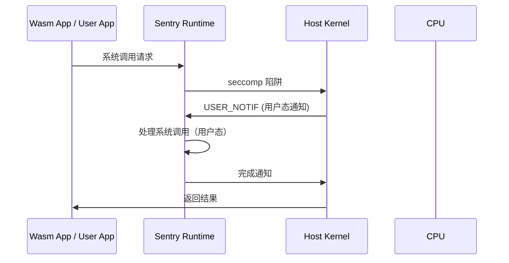
```mermaid
sequenceDiagram
    participant WA as Wasm App / User App
    participant SR as Sentry Runtime
    participant HK as Host Kernel
    participant CPU as CPU

    WA->>SR: 系统调用请求
    SR->>HK: seccomp 陷阱
    HK->>SR: USER_NOTIF (用户态通知)
    SR->>SR: 处理系统调用（用户态）
    SR->>HK: 完成通知
    HK->>WA: 返回结果
```

**触发流程（WasmEdge）**：

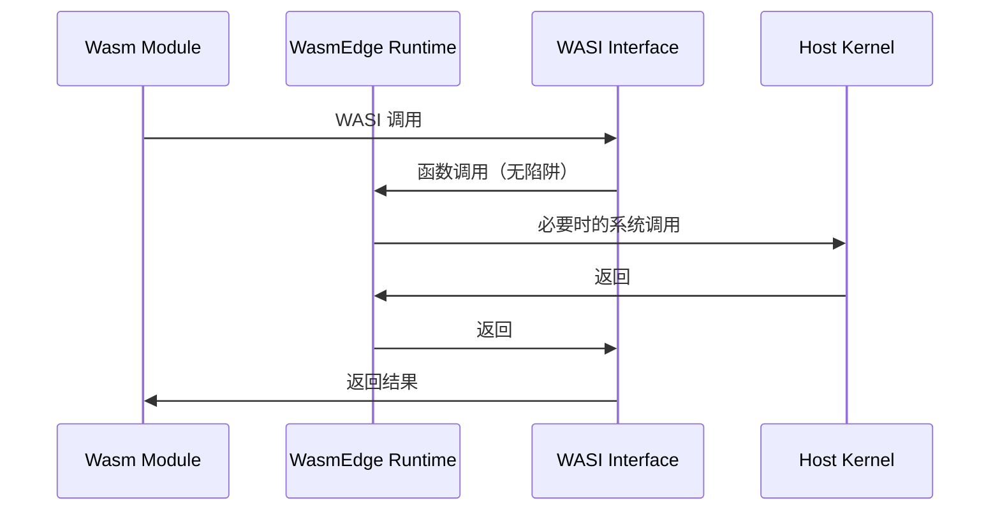
```mermaid
sequenceDiagram
    participant WA as Wasm Module
    participant WE as WasmEdge Runtime
    participant WASI as WASI Interface
    participant HK as Host Kernel

    WA->>WASI: WASI 调用
    WASI->>WE: 函数调用（无陷阱）
    WE->>HK: 必要时的系统调用
    HK->>WE: 返回
    WE->>WASI: 返回
    WASI->>WA: 返回结果
```

### 6.2 截获机制

**seccomp-BPF 机制**：

```text
应用进程执行 syscall
    ↓
seccomp-BPF 过滤器（内核）
    ↓
BPF 程序决定：允许/拒绝/通知用户态
    ↓
如果通知用户态：触发 USER_NOTIF
    ↓
Sentry 处理（用户态）
    ↓
返回结果给内核
```

**gVisor Sentry 架构**：

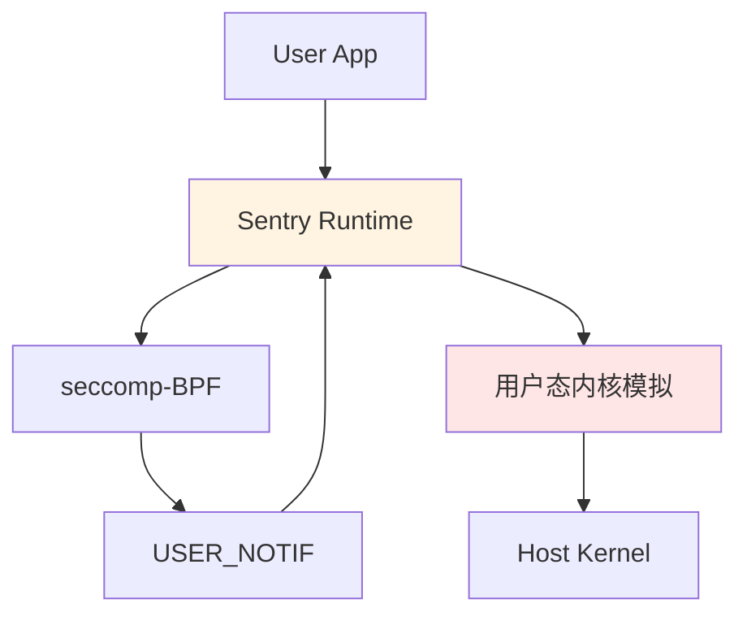
```mermaid
graph TB
    A[User App] --> B[Sentry Runtime]
    B --> C[seccomp-BPF]
    C --> D[USER_NOTIF]
    D --> B
    B --> E[用户态内核模拟]
    E --> F[Host Kernel]

    style B fill:#fff4e1
    style E fill:#ffe6e6
```

**截获开销**：

| 机制            | 截获方式   | 开销（CPU cycles） | 说明                 |
| --------------- | ---------- | ------------------ | -------------------- |
| **seccomp-BPF** | 内核过滤器 | ~10-50             | 高效 BPF 程序        |
| **USER_NOTIF**  | 用户态通知 | ~50-100            | 上下文切换到用户态   |
| **Wasm 调用**   | 函数调用   | ~5-20              | 最轻量（无系统调用） |

**性能优势**：

- **BPF 过滤**：高效的内核级过滤（JIT 编译）
- **用户态处理**：避免内核上下文切换（部分场景）
- **Wasm 调用**：纯函数调用，无陷阱

### 6.3 调度实体

**Sentry 线程模型（gVisor）**：

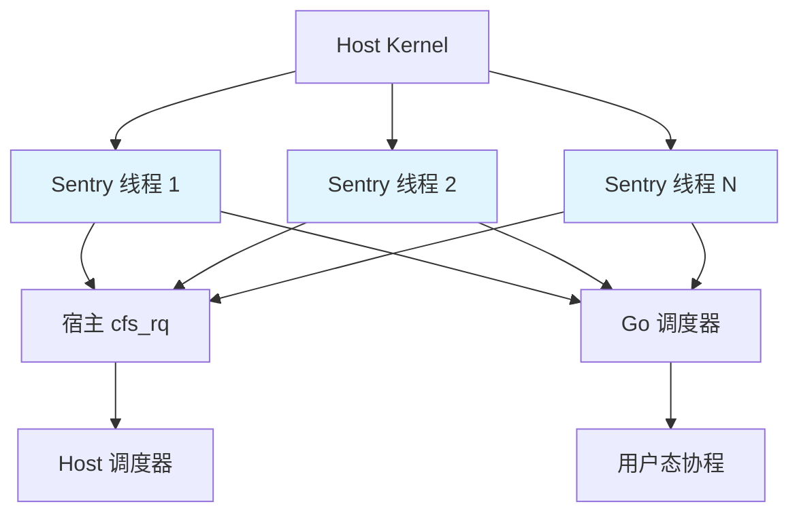
```mermaid
graph TB
    A[Host Kernel] --> B[Sentry 线程 1]
    A --> C[Sentry 线程 2]
    A --> D[Sentry 线程 N]

    B --> E[宿主 cfs_rq]
    C --> E
    D --> E

    E --> F[Host 调度器]

    B --> G[Go 调度器]
    C --> G
    D --> G

    G --> H[用户态协程]

    style B fill:#e1f5ff
    style C fill:#e1f5ff
    style D fill:#e1f5ff
```

**WasmEdge Runtime 模型**：

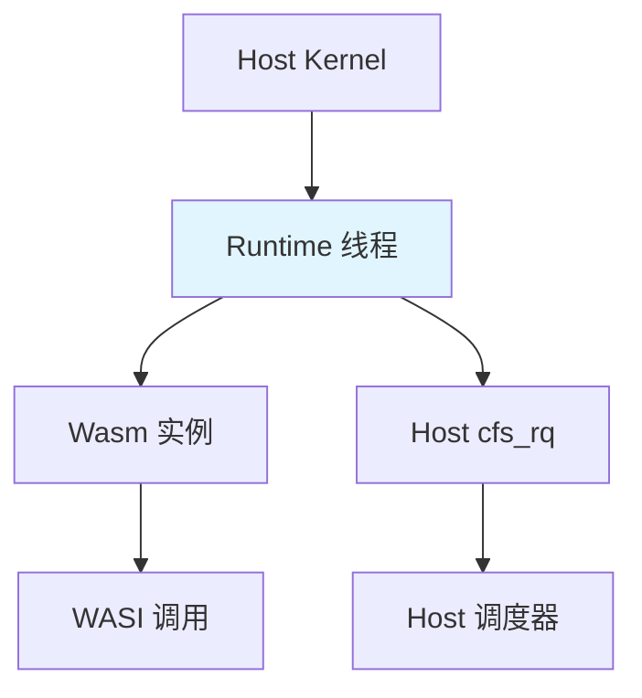
```mermaid
graph TB
    A[Host Kernel] --> B[Runtime 线程]
    B --> C[Wasm 实例]
    C --> D[WASI 调用]

    B --> E[Host cfs_rq]
    E --> F[Host 调度器]

    style B fill:#e1f5ff
```

**调度特性**：

1. **Sentry 线程**：gVisor 使用 Go 调度器，用户态协程
2. **Runtime 线程**：WasmEdge 运行在 Host 线程中
3. **轻量调度**：用户态调度，无内核切换
4. **协程模型**：gVisor 使用 Go 协程，极低开销

**调度开销**：

- **Host 调度**：~500 CPU cycles（Sentry/Runtime 线程调度）
- **用户态调度**：~1-10 CPU cycles（Go 协程切换）
- **总调度开销**：**~501-510 CPU cycles**（接近原生）

### 6.4 执行路径

**gVisor Sentry 路径**：

```text
User App
    ↓ (syscall)
seccomp-BPF 过滤器
    ↓
USER_NOTIF (用户态通知)
    ↓
Sentry Runtime (用户态)
    ↓
用户态内核模拟
    ↓
Host Kernel (必要时的系统调用)
    ↓
返回 Sentry
    ↓
返回 User App
```

**WasmEdge 路径**：

```text
Wasm Module
    ↓ (WASI 调用)
WasmEdge Runtime (函数调用)
    ↓
WASI 接口实现
    ↓
Host Kernel (必要时的系统调用)
    ↓
返回 Runtime
    ↓
返回 Wasm Module
```

**代码路径（gVisor）**：

```c
// User App 系统调用
user_syscall():
    ↓
seccomp_notify_ioctl() // seccomp 陷阱
    ↓
sentry_handle_syscall() // Sentry 处理
    ↓
用户态内核模拟（无内核切换）
    ↓
必要时调用 Host Kernel
    ↓
返回 User App
```

**路径延迟分解**：

| 阶段             | 延迟             | 说明           |
| ---------------- | ---------------- | -------------- |
| **seccomp 过滤** | ~10-50 ns        | BPF 程序执行   |
| **USER_NOTIF**   | ~50-100 ns       | 用户态通知     |
| **Sentry 处理**  | ~100-500 ns      | 用户态内核模拟 |
| **Host Kernel**  | ~100-1000 ns     | 必要时调用     |
| **总计**         | **~260-1650 ns** |                |

**Wasm 路径延迟**：

| 阶段             | 延迟             | 说明          |
| ---------------- | ---------------- | ------------- |
| **WASI 调用**    | ~1-5 ns          | 函数调用      |
| **Runtime 处理** | ~10-100 ns       | WasmEdge 处理 |
| **Host Kernel**  | ~100-1000 ns     | 必要时调用    |
| **总计**         | **~111-1105 ns** |               |

### 6.5 性能开销分析

**CPU 开销模型（gVisor）**：

$$C_{\text{Sandbox}} = C_{\text{workload}} + C_{\text{seccomp}} + C_{\text{sentry}} + C_{\text{schedule}}$$

其中：

- $C_{\text{workload}}$：工作负载开销
- $C_{\text{seccomp}}$：seccomp 开销 =
  $f_{\text{syscall}} \times L_{\text{bpf}}$
  - $f_{\text{syscall}}$：系统调用频率
  - $L_{\text{bpf}}$：BPF 过滤延迟（~10-50 ns）
- $C_{\text{sentry}}$：Sentry 处理开销（用户态内核模拟）
- $C_{\text{schedule}}$：调度开销 = ~501-510 CPU cycles

**CPU 开销模型（Wasm）**：

$$C_{\text{Wasm}} = C_{\text{workload}} + C_{\text{wasi}} + C_{\text{schedule}}$$

其中：

- $C_{\text{workload}}$：工作负载开销
- $C_{\text{wasi}}$：WASI 调用开销 = $f_{\text{wasi}} \times L_{\text{wasi}}$
  - $f_{\text{wasi}}$：WASI 调用频率
  - $L_{\text{wasi}}$：WASI 调用延迟（~1-5 ns，函数调用）
- $C_{\text{schedule}}$：调度开销 = ~500 CPU cycles

**CPU 利用率**：

- **gVisor**：$\text{CPU}_{\text{utilization}} \approx 90-95\%$
- **Wasm**：$\text{CPU}_{\text{utilization}} \approx 95-98\%$

**性能优势**：

1. **极低陷阱开销**：seccomp-BPF（~10-50 ns）vs VM-Exit（~1600-3100 ns）
2. **用户态处理**：部分逻辑在用户态，避免内核切换
3. **Wasm 调用**：纯函数调用，无陷阱（最优）

## 7 对比论证

### 7.1 执行路径对比

**执行路径可视化**：


```mermaid
graph TB
    subgraph "全虚拟化"
        A1[Guest App] --> A2[VM-Exit]
        A2 --> A3[vmexit_handler]
        A3 --> A4[Host Kernel]
        A4 --> A1
    end

    subgraph "半虚拟化"
        B1[Guest App] --> B2[hypercall]
        B2 --> B3[Hypervisor]
        B3 --> B4[Host Kernel]
        B4 --> B1
    end

    subgraph "容器化"
        C1[Container App] --> C2[Host Kernel]
        C2 --> C1
    end

    subgraph "沙盒化"
        D1[Wasm App] --> D2[WASI / Sentry]
        D2 --> D3[Host Kernel]
        D3 --> D1
    end

    style A2 fill:#ffcccc
    style B2 fill:#fff4e1
    style C2 fill:#ccffcc
    style D2 fill:#e1f5ff
```

**路径长度对比**：

| 范式         | 路径长度（步骤） | 硬件陷阱                 | 软件层数             |
| ------------ | ---------------- | ------------------------ | -------------------- |
| **全虚拟化** | 5 步             | 是（VM-Exit）            | 2 层（Guest + Host） |
| **半虚拟化** | 4 步             | 否（hypercall）          | 2 层（Guest + Host） |
| **容器化**   | 2 步             | 否                       | 1 层（Host）         |
| **沙盒化**   | 3 步             | 否（seccomp 或函数调用） | 1-2 层               |

### 7.2 性能开销对比

**开销对比矩阵**：

| 范式         | 陷阱开销                 | 调度开销 | 总开销（CPU cycles） | CPU 利用率 |
| ------------ | ------------------------ | -------- | -------------------- | ---------- |
| **全虚拟化** | > 1000                   | ~1000    | > 2000               | 70-80%     |
| **半虚拟化** | 200-400                  | ~1000    | 1200-1400            | 75-85%     |
| **容器化**   | 0                        | ~500     | ~500                 | 85-95%     |
| **沙盒化**   | 10-50 (BPF) / 1-5 (Wasm) | ~500     | ~510-550             | 90-98%     |

**性能开销模型总览**：

$$C_{\text{total}} = C_{\text{trap}} + C_{\text{schedule}} + C_{\text{isolation}}$$

其中：

- **全虚拟化**：$C_{\text{trap}} > 1000$, $C_{\text{schedule}} = 1000$,
  $C_{\text{isolation}} = 500$
- **半虚拟化**：$C_{\text{trap}} = 200-400$, $C_{\text{schedule}} = 1000$,
  $C_{\text{isolation}} = 300$
- **容器化**：$C_{\text{trap}} = 0$, $C_{\text{schedule}} = 500$,
  $C_{\text{isolation}} = 30-150$
- **沙盒化**：$C_{\text{trap}} = 10-50$, $C_{\text{schedule}} = 500$,
  $C_{\text{isolation}} = 10-50$

### 7.3 技术选型决策

**决策矩阵**：

| 需求场景           | 推荐范式         | 理由                   | 关键指标          |
| ------------------ | ---------------- | ---------------------- | ----------------- |
| **多 OS 支持**     | 全虚拟化         | 唯一支持多 OS          | 隔离性 > 性能     |
| **多 OS + 高性能** | 半虚拟化         | 协作优化，减少 VM-Exit | 性能 > 兼容性     |
| **微服务部署**     | 容器化           | 快速启动，资源共享     | 效率 > 隔离性     |
| **Serverless**     | 沙盒化（Wasm）   | 极速冷启动，低延迟     | 启动速度 > 兼容性 |
| **安全隔离**       | 沙盒化（gVisor） | 用户态内核模拟，强隔离 | 安全性 > 性能     |
| **资源受限**       | 沙盒化（Wasm）   | 最低资源占用           | 资源效率 > 兼容性 |
| **大规模集群**     | 容器化           | 单级调度，高密度部署   | 密度 > 隔离性     |
| **边缘计算**       | 沙盒化（Wasm）   | 低延迟，快速启动       | 延迟 > 兼容性     |

**决策树（基于执行流特性）**：

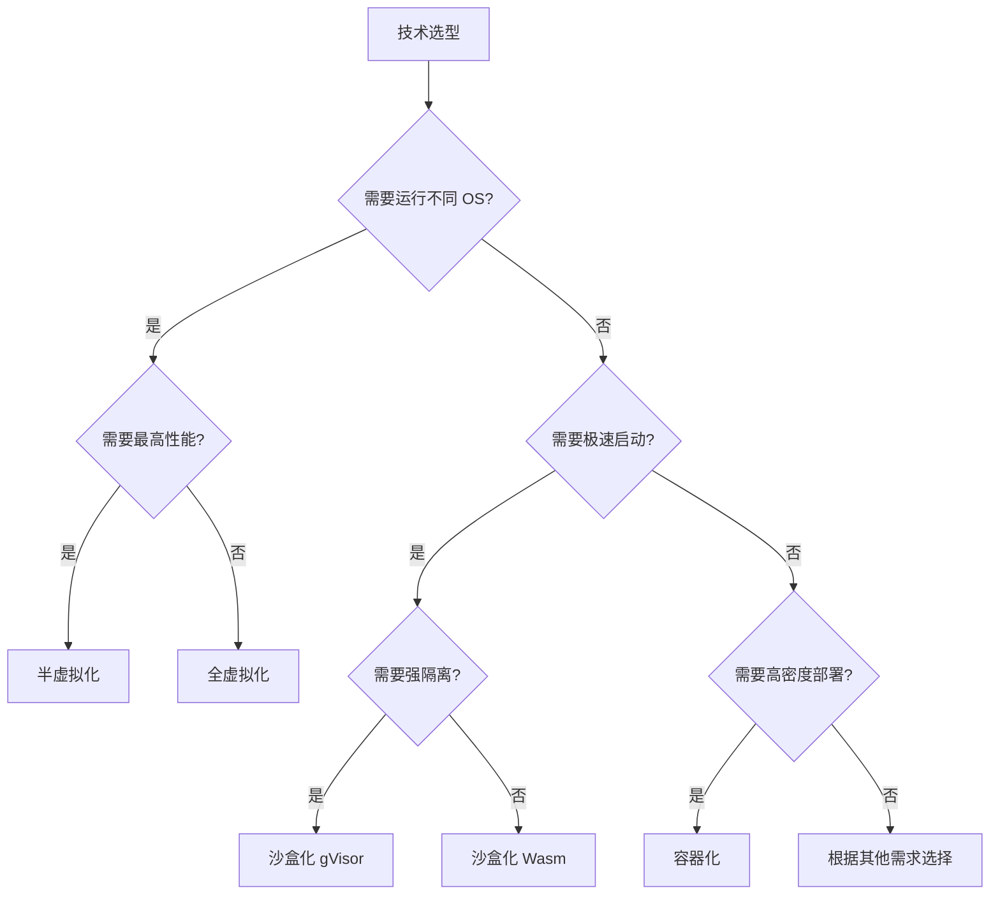
```mermaid
graph TB
    A[技术选型] --> B{需要运行不同 OS?}
    B -->|是| C{需要最高性能?}
    C -->|是| D[半虚拟化]
    C -->|否| E[全虚拟化]
    B -->|否| F{需要极速启动?}
    F -->|是| G{需要强隔离?}
    G -->|是| H[沙盒化 gVisor]
    G -->|否| I[沙盒化 Wasm]
    F -->|否| J{需要高密度部署?}
    J -->|是| K[容器化]
    J -->|否| L[根据其他需求选择]
```

### 7.4 基于设备与内核特性的决策

#### 7.4.1 设备访问需求分析

**设备访问能力矩阵**：

| 设备类型          | 全虚拟化             | 半虚拟化          | 容器化                  | 沙盒化          |
| ----------------- | -------------------- | ----------------- | ----------------------- | --------------- |
| **USB 设备**      | ✅ 完全支持          | ✅ VirtIO-USB     | ❌ 不支持               | ❌ 不支持       |
| **PCI 设备**      | ✅ 完全支持          | ✅ VirtIO-PCI     | ❌ 不支持               | ❌ 不支持       |
| **GPU（直通）**   | ✅ 完全支持          | ✅ 完全支持       | ✅ 支持（NVIDIA/CUDA）  | ❌ 不支持       |
| **GPU（vGPU）**   | ✅ 支持（vGPU）      | ✅ 支持（vGPU）   | ⚠️ 受限（需要特殊配置） | ❌ 不支持       |
| **GPU（SR-IOV）** | ✅ 支持（SR-IOV）    | ✅ 支持（SR-IOV） | ✅ 支持（VF 直通）      | ❌ 不支持       |
| **GPU（虚拟化）** | ✅ 支持（QEMU 模拟） | ⚠️ 受限           | ❌ 不支持               | ❌ 不支持       |
| **网络设备**      | ✅ 虚拟网卡          | ✅ VirtIO-Net     | ✅ 直接                 | ⚠️ 受限（WASI） |
| **存储设备**      | ✅ 虚拟硬盘          | ✅ VirtIO-Blk     | ✅ 直接                 | ⚠️ 受限（WASI） |
| **串口设备**      | ✅ 完全支持          | ✅ VirtIO-Con     | ✅ 直接                 | ⚠️ 受限（WASI） |

**设备访问决策规则**：

1. **需要 USB 设备访问** → 必须使用**虚拟化或半虚拟化**

   - **全虚拟化**：通过 USB passthrough 或虚拟 USB 控制器
   - **半虚拟化**：通过 VirtIO-USB（需要 Guest 驱动支持）
   - **容器化**：❌ 无法直接访问 USB 设备（无 Guest OS）
   - **沙盒化**：❌ 无法直接访问 USB 设备（无 Guest OS）

2. **需要 PCI 设备访问** → 必须使用**虚拟化或半虚拟化**

   - **全虚拟化**：通过 PCI passthrough 或虚拟 PCI 设备
   - **半虚拟化**：通过 VirtIO-PCI（需要 Guest 驱动支持）
   - **容器化**：❌ 无法直接访问 PCI 设备（无 Guest OS）
   - **沙盒化**：❌ 无法直接访问 PCI 设备（无 Guest OS）

3. **需要 GPU 设备访问** → 根据访问方式和隔离需求选择

   - **GPU 直通（Passthrough）**：

     - **全虚拟化/半虚拟化**：GPU 完全直通给 Guest，性能最优（>95% 原生性能），
       支持多 OS
     - **容器化**：通过 NVIDIA Container Toolkit（nvidia-docker）、CUDA 运行时直
       接访问 Host GPU，性能接近原生（>98% 原生性能），但隔离较弱
     - **沙盒化**：❌ 不支持（无 Guest OS，无法加载 GPU 驱动）

   - **GPU 虚拟化（vGPU）**：

     - **全虚拟化/半虚拟化**：通过 NVIDIA vGPU、AMD MxGPU 等技术实现 GPU 虚拟化
       ，资源共享，但性能有损失（约 70-90%）
     - **容器化**：部分支持（需要特殊配置，性能受限）
     - **沙盒化**：❌ 不支持

   - **GPU SR-IOV（Single Root I/O Virtualization）**：

     - **全虚拟化/半虚拟化**：GPU SR-IOV 创建多个虚拟功能（VF），每个 VM 分配一
       个 VF，性能接近原生（>95%），支持多租户
     - **容器化**：支持 VF 直通，性能接近原生（>98%），但需要 SR-IOV 支持
     - **沙盒化**：❌ 不支持

   - **GPU 软件虚拟化**：
     - **全虚拟化**：通过 QEMU 模拟 GPU（性能极低，仅用于兼容性）
     - **半虚拟化/容器化/沙盒化**：❌ 不支持或性能极差

4. **不需要 I/O 设备，只需要 CPU、内存、硬盘** → 直接选择**容器化**

   - **CPU**：容器化直接使用 Host CPU，无开销
   - **内存**：容器化共享 Host 内存空间，高效
   - **硬盘**：容器化通过 Host 文件系统直接访问，无虚拟化开销

5. **需要网络 I/O 设备，需要 OS L4 层直接内核访问** → **容器化**
   - **epoll**：需要直接内核事件通知机制
   - **io_uring**：需要直接内核异步 I/O 接口
   - **容器化优势**：直接调用 Host 内核系统调用，无虚拟化层

**设备访问执行路径对比**：

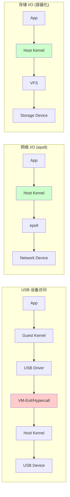
```mermaid
graph LR
    subgraph "USB 设备访问"
        A1[App] --> A2[Guest Kernel]
        A2 --> A3[USB Driver]
        A3 --> A4[VM-Exit/Hypercall]
        A4 --> A5[Host Kernel]
        A5 --> A6[USB Device]
    end

    subgraph "网络 I/O (epoll)"
        B1[App] --> B2[Host Kernel]
        B2 --> B3[epoll]
        B3 --> B4[Network Device]
    end

    subgraph "存储 I/O (容器化)"
        C1[App] --> C2[Host Kernel]
        C2 --> C3[VFS]
        C3 --> C4[Storage Device]
    end

    style A4 fill:#ffcccc
    style B2 fill:#ccffcc
    style C2 fill:#ccffcc
```

#### 7.4.2 内核特性需求分析

**内核特性访问能力矩阵**：

| 内核特性      | 全虚拟化      | 半虚拟化      | 容器化  | 沙盒化          |
| ------------- | ------------- | ------------- | ------- | --------------- |
| **epoll**     | ✅ Guest 内核 | ✅ Guest 内核 | ✅ Host | ⚠️ 受限（WASI） |
| **io_uring**  | ✅ Guest 内核 | ✅ Guest 内核 | ✅ Host | ❌ 不支持       |
| **eBPF**      | ✅ Guest 内核 | ✅ Guest 内核 | ✅ Host | ⚠️ 受限（BPF）  |
| **cgroups**   | ✅ Guest 内核 | ✅ Guest 内核 | ✅ Host | ⚠️ 受限         |
| **seccomp**   | ✅ Guest 内核 | ✅ Guest 内核 | ✅ Host | ✅ 支持         |
| **namespace** | ✅ Guest 内核 | ✅ Guest 内核 | ✅ Host | ⚠️ 受限         |

**内核特性访问决策规则**：

1. **需要 epoll** → **容器化**（推荐）或虚拟化

   - **容器化**：直接调用 Host 内核 `epoll_wait()`，延迟低（~100 ns）
   - **全虚拟化**：Guest 内核调用，需要通过 VM-Exit（~1600-3100 ns）
   - **半虚拟化**：Guest 内核调用，通过 hypercall（~250-850 ns）
   - **沙盒化**：WASI 可能不支持原生 epoll，需要通过 Runtime 模拟

2. **需要 io_uring** → **容器化**（必需）

   - **容器化**：直接调用 Host 内核 `io_uring_setup()`，零开销
   - **全虚拟化/半虚拟化**：Guest 内核调用，有虚拟化开销
   - **沙盒化**：❌ Wasm/WASI 不支持 io_uring（需要内核 5.1+）

3. **需要 eBPF** → **容器化**（推荐）
   - **容器化**：直接使用 Host 内核 eBPF，完整功能
   - **全虚拟化/半虚拟化**：Guest 内核 eBPF，功能受限
   - **沙盒化**：可通过 seccomp-BPF 实现部分功能

**内核特性访问性能对比**：

| 内核特性     | 容器化延迟 | 全虚拟化延迟  | 半虚拟化延迟 | 性能比  |
| ------------ | ---------- | ------------- | ------------ | ------- |
| **epoll**    | ~100 ns    | ~1600-3100 ns | ~250-850 ns  | 16-31x  |
| **io_uring** | ~50 ns     | ~1600-3100 ns | ~250-850 ns  | 32-62x  |
| **eBPF**     | ~10-100 ns | ~1600-3100 ns | ~250-850 ns  | 16-310x |

#### 7.4.3 资源访问需求分析

**资源访问能力矩阵**：

| 资源类型     | 全虚拟化      | 半虚拟化       | 容器化       | 沙盒化          |
| ------------ | ------------- | -------------- | ------------ | --------------- |
| **CPU**      | ✅ 虚拟 CPU   | ✅ 虚拟 CPU    | ✅ 直接      | ✅ 直接         |
| **内存**     | ✅ 虚拟内存   | ✅ 虚拟内存    | ✅ 直接      | ✅ 受限         |
| **硬盘**     | ✅ 虚拟硬盘   | ✅ VirtIO-Blk  | ✅ 直接      | ⚠️ 受限（WASI） |
| **网络**     | ✅ 虚拟网卡   | ✅ VirtIO-Net  | ✅ 直接      | ⚠️ 受限（WASI） |
| **设备驱动** | ✅ Guest 驱动 | ✅ VirtIO 驱动 | ✅ Host 驱动 | ❌ 无驱动       |
| **OS 资源**  | ✅ Guest OS   | ✅ Guest OS    | ✅ Host OS   | ❌ 无 OS        |

**资源访问决策规则**：

1. **需要驱动访问（USB、PCI 设备）** → **虚拟化或半虚拟化**

   - **全虚拟化**：需要完整的 Guest OS 和驱动
   - **半虚拟化**：需要 Guest OS 和 VirtIO 驱动

2. **不需要驱动，只需要 OS 资源（系统调用）** → **容器化**

   - **容器化**：直接使用 Host OS 系统调用，无虚拟化层
   - 示例：文件系统操作、网络操作、进程管理等

3. **不需要驱动或 OS 资源，只需要逻辑改变** → **沙盒化**
   - **沙盒化（Wasm）**：纯计算逻辑，无系统调用
   - **沙盒化（gVisor）**：部分系统调用模拟，无需真实驱动
   - 示例：函数计算、业务逻辑处理、数据处理等

#### 7.4.4 综合决策树

**基于设备、内核特性、资源访问的综合决策树**：

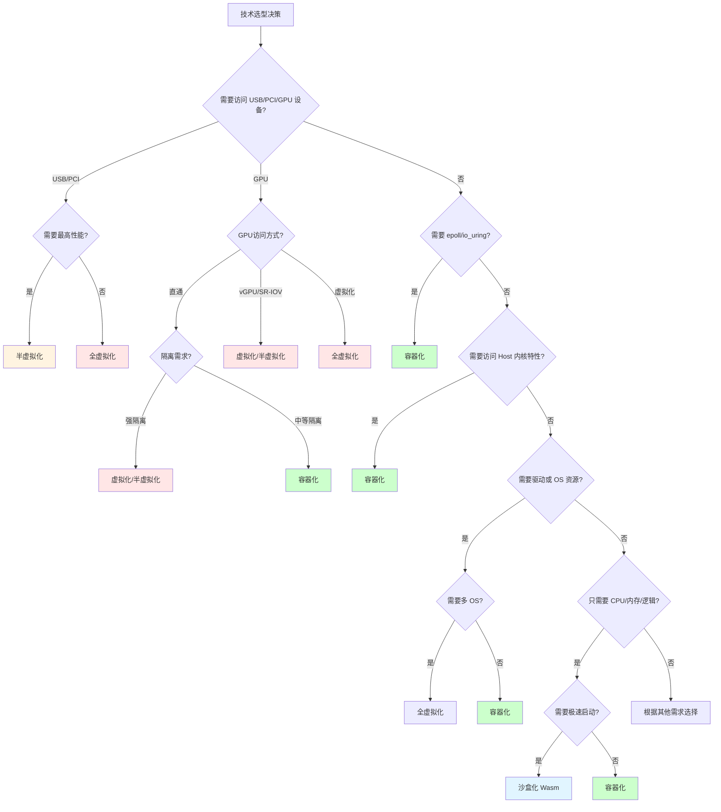
```mermaid
graph TB
    A[技术选型决策] --> B{需要访问 USB/PCI/GPU 设备?}
    B -->|USB/PCI| C{需要最高性能?}
    C -->|是| D[半虚拟化]
    C -->|否| E[全虚拟化]

    B -->|GPU| F{GPU访问方式?}
    F -->|直通| G{隔离需求?}
    G -->|强隔离| H[虚拟化/半虚拟化]
    G -->|中等隔离| I[容器化]
    F -->|vGPU/SR-IOV| J[虚拟化/半虚拟化]
    F -->|虚拟化| K[全虚拟化]

    B -->|否| L{需要 epoll/io_uring?}
    L -->|是| M[容器化]

    L -->|否| N{需要访问 Host 内核特性?}
    N -->|是| O[容器化]

    N -->|否| P{需要驱动或 OS 资源?}
    P -->|是| Q{需要多 OS?}
    Q -->|是| R[全虚拟化]
    Q -->|否| S[容器化]

    P -->|否| T{只需要 CPU/内存/逻辑?}
    T -->|是| U{需要极速启动?}
    U -->|是| V[沙盒化 Wasm]
    U -->|否| W[容器化]

    T -->|否| X[根据其他需求选择]

    style D fill:#fff4e1
    style E fill:#ffe6e6
    style H fill:#ffe6e6
    style I fill:#ccffcc
    style J fill:#ffe6e6
    style K fill:#ffe6e6
    style M fill:#ccffcc
    style O fill:#ccffcc
    style S fill:#ccffcc
    style V fill:#e1f5ff
    style W fill:#ccffcc
```

#### 7.4.5 决策案例分析

##### 案例 1：USB 设备访问需求

需求：应用需要访问 USB 摄像头

分析：

- ❌ 容器化：无法直接访问 USB 设备（无 Guest OS 和驱动）
- ❌ 沙盒化：无法直接访问 USB 设备（无 Guest OS）
- ✅ 全虚拟化：通过 USB passthrough 或虚拟 USB 控制器
- ✅ 半虚拟化：通过 VirtIO-USB（需要 Guest 驱动）

决策：

- 高性能需求 → 半虚拟化（VirtIO-USB，减少 VM-Exit）
- 兼容性优先 → 全虚拟化（USB passthrough，无需修改 Guest）

##### 案例 2：高并发网络 I/O（epoll）

需求：高并发 Web 服务器，需要 epoll 实现事件驱动

分析：

- ✅ 容器化：直接调用 Host 内核 `epoll_wait()`，延迟 ~100 ns
- ⚠️ 全虚拟化：Guest 内核 `epoll_wait()`，需要通过 VM-Exit（~1600-3100 ns）
- ⚠️ 半虚拟化：Guest 内核 `epoll_wait()`，需要通过 hypercall（~250-850 ns）
- ❌ 沙盒化：WASI 可能不支持原生 epoll

决策：容器化

- 理由：直接内核访问，延迟最低（100 ns vs 1600-3100 ns，16-31x 性能提升）
- 适用场景：高并发网络服务、Web 服务器、API Gateway

##### 案例 3：异步 I/O（io_uring）

需求：高性能数据库，需要 io_uring 实现异步 I/O

分析：

- ✅ 容器化：直接调用 Host 内核 `io_uring_setup()`，延迟 ~50 ns
- ⚠️ 全虚拟化/半虚拟化：Guest 内核调用，有虚拟化开销
- ❌ 沙盒化：Wasm/WASI 不支持 io_uring

决策：容器化（必需）

- 理由：io_uring 是 Linux 5.1+ 特性，需要直接内核访问
- 适用场景：高性能数据库、存储系统、文件服务器

##### 案例 4：GPU 加速应用（AI 推理）

需求：AI 模型推理，需要 GPU 加速

分析：

- ✅ 容器化：通过 NVIDIA Container Toolkit 直接访问 Host GPU，性能>98%，但隔离较
  弱
- ✅ 全虚拟化/半虚拟化：GPU 完全直通给 Guest，性能>95%，支持多 OS
- ❌ 沙盒化：无法加载 GPU 驱动

决策：

- 中等隔离 → 容器化（NVIDIA Container Toolkit，性能>98%，快速部署）
- 强隔离 → 虚拟化/半虚拟化（GPU 完全直通，性能>95%，多 OS 支持）

适用场景：AI 推理、深度学习训练、图形渲染

##### 案例 5：多租户 GPU 平台

需求：多租户 SaaS 平台，需要 GPU 资源共享

分析：

- ✅ 全虚拟化/半虚拟化：GPU vGPU/SR-IOV，资源共享，多租户
- ⚠️ 容器化：部分支持（需要特殊配置，性能受限）
- ❌ 沙盒化：不支持

决策：虚拟化/半虚拟化

- GPU vGPU：GPU 硬件虚拟化，资源共享，但性能有损失（约 70-90%）
- GPU SR-IOV：GPU 虚拟功能（VF），性能接近原生（>95%），支持多租户

适用场景：云 GPU 服务、AI 训练平台、多租户 GPU 服务

##### 案例 6：纯计算逻辑（无 I/O）

需求：图像处理、数据计算，无需设备访问

分析：

- ✅ 沙盒化（Wasm）：纯函数调用，无系统调用，延迟 ~1-5 ns
- ✅ 容器化：直接 CPU/内存访问，无虚拟化开销
- ❌ 虚拟化：不必要的虚拟化开销

决策：

- 极速启动需求 → 沙盒化（Wasm）（启动 < 10ms）
- 标准部署需求 → 容器化（启动 < 1s，资源利用率高）

##### 案例 7：边缘计算（资源受限）

需求：边缘设备，资源受限，需要处理网络数据

分析：

- ✅ 沙盒化（Wasm）：内存占用 ~2MB，启动 < 10ms
- ✅ 容器化：内存占用 ~50-100MB，启动 < 1s
- ❌ 虚拟化：内存占用 > 512MB，启动 > 10s

决策：

- 资源极度受限 → 沙盒化（Wasm）（内存 < 10MB）
- 资源一般受限 → 容器化（内存 > 50MB，需要网络 I/O）

## 8 形式化模型

### 8.1 执行流模型

**执行流函数**：

$$
E(t, \text{paradigm}) = \begin{cases}
E_{\text{VM}}(t) & \text{if paradigm = 全虚拟化} \\
E_{\text{PV}}(t) & \text{if paradigm = 半虚拟化} \\
E_{\text{Container}}(t) & \text{if paradigm = 容器化} \\
E_{\text{Sandbox}}(t) & \text{if paradigm = 沙盒化}
\end{cases}
$$

其中 $E(t)$ 表示在时间 $t$ 的执行流状态。

**执行路径长度**：

$$
L(\text{paradigm}) = \begin{cases}
5 & \text{全虚拟化（Guest → VM-Exit → Handler → Host → Guest）} \\
4 & \text{半虚拟化（Guest → hypercall → Hypervisor → Host → Guest）} \\
2 & \text{容器化（App → Host → App）} \\
3 & \text{沙盒化（App → Runtime → Host → App）}
\end{cases}
$$

### 8.2 调度开销模型

**调度开销函数**：

$$S(\text{paradigm}) = S_{\text{trap}}(\text{paradigm}) + S_{\text{schedule}}(\text{paradigm}) + S_{\text{isolation}}(\text{paradigm})$$

其中：

- $S_{\text{trap}}$：陷阱开销

  - 全虚拟化：$S_{\text{trap}} = f_{\text{exit}} \times L_{\text{vmexit}}$（>
    1000 cycles）
  - 半虚拟化
    ：$S_{\text{trap}} = f_{\text{hcall}} \times L_{\text{hypercall}}$（200-400
    cycles）
  - 容器化：$S_{\text{trap}} = 0$
  - 沙盒化：$S_{\text{trap}} = f_{\text{filter}} \times L_{\text{bpf}}$（10-50
    cycles）

- $S_{\text{schedule}}$：调度开销

  - 全虚拟化/半虚拟化：$S_{\text{schedule}} = 1000$（两级调度）
  - 容器化/沙盒化：$S_{\text{schedule}} = 500$（单级调度）

- $S_{\text{isolation}}$：隔离开销
  - 全虚拟化：$S_{\text{isolation}} = 500$（硬件隔离）
  - 半虚拟化：$S_{\text{isolation}} = 300$（协作隔离）
  - 容器化：$S_{\text{isolation}} = 30-150$（Namespace）
  - 沙盒化：$S_{\text{isolation}} = 10-50$（轻量隔离）

**性能效率**：

$$\eta(\text{paradigm}) = \frac{C_{\text{workload}}}{C_{\text{workload}} + S(\text{paradigm})}$$

其中 $\eta$ 是 CPU 利用率，范围：

- 全虚拟化：$\eta \approx 70-80\%$
- 半虚拟化：$\eta \approx 75-85\%$
- 容器化：$\eta \approx 85-95\%$
- 沙盒化：$\eta \approx 90-98\%$

## 9 参考

### 相关文档

- **[28. 架构框架](../../TECHNICAL/28-architecture-framework/architecture-framework.md)** -
  多维度架构体系与技术规范（技术架构、概念架构、数据架构、业务架构、软件架构、应
  用架构、场景架构）
- **[05. 全局架构设计](../architecture-design/architecture-design.md)** - 技术组
  合和架构决策
- [03.6 Kubernetes 调度算法](./architecture.md#036-kubernetes-调度算法) -
  Kubernetes 调度机制
- [10 决策模型](../../05-decision-analysis/decision-models/decision-models.md) -
  技术选型决策框架
- [10 快速参考指南](../../05-decision-analysis/decision-models/QUICK-REFERENCE.md) -
  设备访问（USB/PCI/GPU）和内核特性决策快速参考
- [10.1.1 资源模型](../../05-decision-analysis/decision-models/01-theory-models/01-resource-models.md) -
  CPU 调度与资源模型

### 外部参考

**执行流与调度相关**：

- [KVM Internals: VM-Exit Handling](https://www.kernel.org/doc/html/latest/virt/kvm/vcpu-requests.html)
- [Xen Architecture: Hypercalls](https://wiki.xenproject.org/wiki/Hypercall)
- [Linux Namespaces](https://man7.org/linux/man-pages/man7/namespaces.7.html)
- [seccomp: Secure Computing Mode](https://www.kernel.org/doc/html/latest/userspace-api/seccomp_filter.html)
- [gVisor Architecture](https://gvisor.dev/docs/architecture_guide/)
- [WebAssembly System Interface (WASI)](https://wasi.dev/)

**性能基准**：

- [Virtualization Performance Comparison](https://www.vmware.com/content/dam/digitalmarketing/vmware/en/pdf/techpaper/performance-perf-vsphere-memory-vcpu-rdm.pdf)
- [Container vs VM Performance](https://www.brianchristner.io/docker-is-not-a-virtualization-technology/)
- [Wasm Performance Benchmarks](https://github.com/wasmerio/wasmer/blob/master/docs/perf-benchmarks.md)

> 完整参考列表见 [REFERENCES.md](../REFERENCES.md)

---

> **总结**：
>
> 从执行流与调度视角，四种技术范式的本质差异在于：
>
> 1. **触发机制**：从硬件中断到软件调用的演进
> 2. **截获机制**：从 VM-Exit 到直接执行的演进
> 3. **调度实体**：从两级调度到单级调度的演进
> 4. **执行路径**：从 5 步到 2 步的简化演进
>
> **性能演进趋势**：虚拟化（> 2000 cycles）→ 半虚拟化（1200-1400 cycles）→ 容器
> 化（~500 cycles）→ 沙盒化（~510-550 cycles）
>
> **选型原则**：根据隔离需求、性能要求、兼容性需求选择合适的技术范式。
>
> **设备访问决策**：
>
> - USB/PCI 设备访问 → 虚拟化/半虚拟化（必需）
> - GPU 设备访问：根据访问方式和隔离需求选择
>   - GPU 直通：强隔离 → 虚拟化/半虚拟化（性能>95%），中等隔离 → 容器化（性
>     能>98%）
>   - GPU vGPU/SR-IOV → 虚拟化/半虚拟化（资源共享，多租户）
>   - GPU 虚拟化 → 全虚拟化（性能极低，仅兼容性）
>
> **内核特性决策**：
>
> - epoll/io_uring → 容器化（必需，16-62x 性能提升）
> - eBPF → 容器化（推荐，直接 Host 内核访问）
>
> **详细决策指南**：参见
> [快速参考指南](../../05-decision-analysis/decision-models/QUICK-REFERENCE.md)
>
> **一致性检查报告**：参见
> [一致性检查报告](../../05-decision-analysis/decision-models/CONSISTENCY-REPORT.md) -
> 确保所有技术定义与 Wikipedia 标准对齐
>
> ---
>
---

## 10 认知增强：思维导图、建模视图与图表达转换

### 10.1 执行流视角完整思维导图

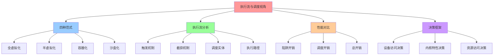
```mermaid
graph TB
    A[执行流与调度视角] --> B[四种范式]
    A --> C[执行流分析]
    A --> D[性能对比]
    A --> E[决策框架]

    B --> B1[全虚拟化]
    B --> B2[半虚拟化]
    B --> B3[容器化]
    B --> B4[沙盒化]

    C --> C1[触发机制]
    C --> C2[截获机制]
    C --> C3[调度实体]
    C --> C4[执行路径]

    D --> D1[陷阱开销]
    D --> D2[调度开销]
    D --> D3[总开销]

    E --> E1[设备访问决策]
    E --> E2[内核特性决策]
    E --> E3[资源访问决策]

    style A fill:#ff9999
    style B fill:#99ccff
    style C fill:#99ff99
    style D fill:#ffcc99
    style E fill:#cc99ff
```

### 10.2 执行流建模视图（UML 状态机 + 序列图）

#### 执行流状态机图

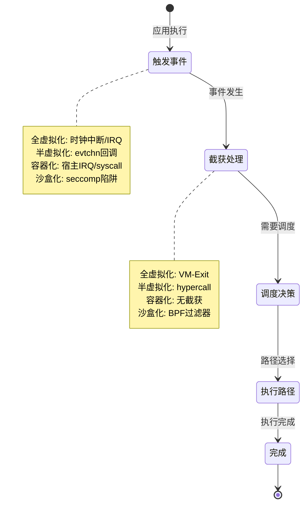
```mermaid
stateDiagram-v2
    [*] --> 触发事件: 应用执行
    触发事件 --> 截获处理: 事件发生
    截获处理 --> 调度决策: 需要调度
    调度决策 --> 执行路径: 路径选择
    执行路径 --> 完成: 执行完成
    完成 --> [*]

    note right of 触发事件
        全虚拟化: 时钟中断/IRQ
        半虚拟化: evtchn回调
        容器化: 宿主IRQ/syscall
        沙盒化: seccomp陷阱
    end note

    note right of 截获处理
        全虚拟化: VM-Exit
        半虚拟化: hypercall
        容器化: 无截获
        沙盒化: BPF过滤器
    end note
```

#### 执行流对比序列图

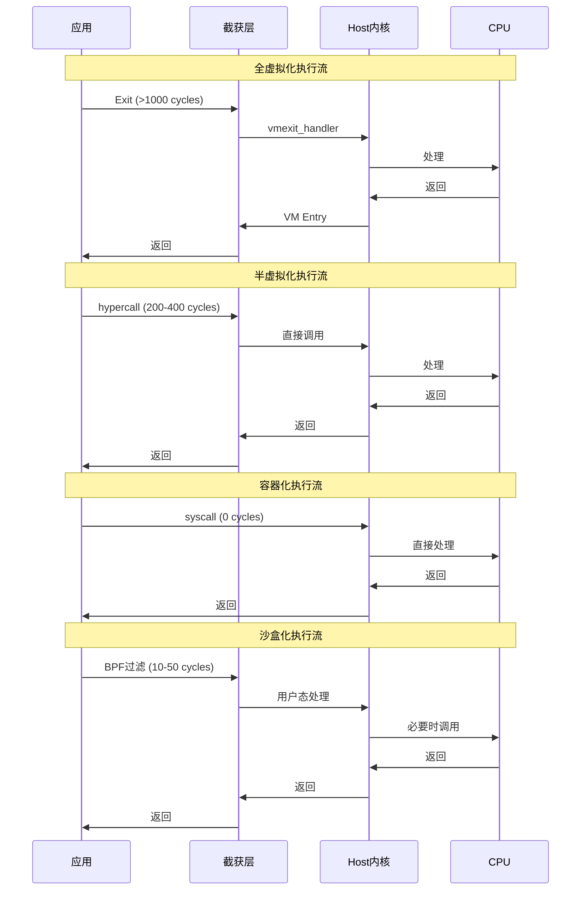
```mermaid
sequenceDiagram
    participant App as 应用
    participant Trap as 截获层
    participant Host as Host内核
    participant CPU as CPU

    Note over App,CPU: 全虚拟化执行流
    App->>Trap:  Exit (>1000 cycles)
    Trap->>Host: vmexit_handler
    Host->>CPU: 处理
    CPU->>Host: 返回
    Host->>Trap: VM Entry
    Trap->>App: 返回

    Note over App,CPU: 半虚拟化执行流
    App->>Trap: hypercall (200-400 cycles)
    Trap->>Host: 直接调用
    Host->>CPU: 处理
    CPU->>Host: 返回
    Host->>Trap: 返回
    Trap->>App: 返回

    Note over App,CPU: 容器化执行流
    App->>Host: syscall (0 cycles)
    Host->>CPU: 直接处理
    CPU->>Host: 返回
    Host->>App: 返回

    Note over App,CPU: 沙盒化执行流
    App->>Trap: BPF过滤 (10-50 cycles)
    Trap->>Host: 用户态处理
    Host->>CPU: 必要时调用
    CPU->>Host: 返回
    Host->>Trap: 返回
    Trap->>App: 返回
```

### 10.3 执行流多维关系矩阵

#### 范式-机制-开销三维矩阵

| 范式维度 | 全虚拟化 | 半虚拟化 | 容器化 | 沙盒化 | 触发机制 | 截获机制 | 调度实体 | 陷阱开销 | 调度开销 | 认知价值 |
|---------|---------|---------|--------|--------|---------|---------|---------|---------|---------|---------|
| **触发** | 时钟中断/IRQ | evtchn回调 | 宿主IRQ/syscall | seccomp陷阱 | ✅ 核心 | ⚠️ 部分 | ❌ 无 | ⚠️ 部分 | ❌ 无 | 触发理解 |
| **截获** | VM-Exit | hypercall | 无截获 | BPF过滤器 | ⚠️ 部分 | ✅ 核心 | ❌ 无 | ✅ 核心 | ❌ 无 | 截获理解 |
| **调度** | vCPU线程 | vCPU线程 | 容器进程 | Sentry线程 | ❌ 无 | ❌ 无 | ✅ 核心 | ⚠️ 部分 | ✅ 核心 | 调度理解 |
| **路径** | 5步路径 | 4步路径 | 2步路径 | 3步路径 | ⚠️ 部分 | ⚠️ 部分 | ⚠️ 部分 | ⚠️ 部分 | ⚠️ 部分 | 路径理解 |
| **开销** | >2000 cycles | 1200-1400 cycles | ~500 cycles | ~510-550 cycles | ⚠️ 部分 | ⚠️ 部分 | ⚠️ 部分 | ✅ 核心 | ✅ 核心 | 开销理解 |

#### 设备-内核特性-范式映射矩阵

| 需求维度 | USB/PCI设备 | GPU设备 | epoll | io_uring | 全虚拟化 | 半虚拟化 | 容器化 | 沙盒化 | 决策依据 | 认知价值 |
|---------|------------|---------|-------|----------|---------|---------|--------|--------|---------|---------|
| **USB/PCI** | ✅ 必需 | ❌ 无 | ❌ 无 | ❌ 无 | ✅ 支持 | ✅ 支持 | ❌ 不支持 | ❌ 不支持 | 设备访问 | 需求理解 |
| **GPU直通** | ❌ 无 | ✅ 必需 | ❌ 无 | ❌ 无 | ✅ 支持 | ✅ 支持 | ✅ 支持 | ❌ 不支持 | GPU访问 | 需求理解 |
| **epoll** | ❌ 无 | ❌ 无 | ✅ 必需 | ❌ 无 | ⚠️ 受限 | ⚠️ 受限 | ✅ 支持 | ⚠️ 受限 | 内核特性 | 需求理解 |
| **io_uring** | ❌ 无 | ❌ 无 | ❌ 无 | ✅ 必需 | ⚠️ 受限 | ⚠️ 受限 | ✅ 支持 | ❌ 不支持 | 内核特性 | 需求理解 |
| **纯计算** | ❌ 无 | ❌ 无 | ❌ 无 | ❌ 无 | ❌ 不推荐 | ❌ 不推荐 | ✅ 支持 | ✅ 支持 | 性能优化 | 需求理解 |

### 10.4 图表达和转换

#### 执行流视图转换关系

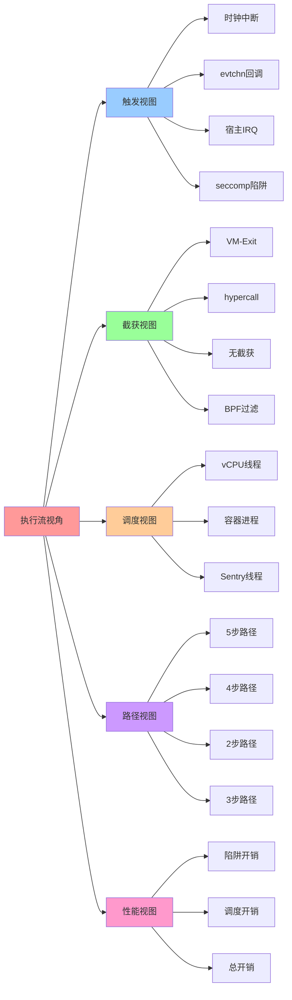
```mermaid
graph LR
    A[执行流视角] --> B[触发视图]
    A --> C[截获视图]
    A --> D[调度视图]
    A --> E[路径视图]
    A --> F[性能视图]

    B --> B1[时钟中断]
    B --> B2[evtchn回调]
    B --> B3[宿主IRQ]
    B --> B4[seccomp陷阱]

    C --> C1[VM-Exit]
    C --> C2[hypercall]
    C --> C3[无截获]
    C --> C4[BPF过滤]

    D --> D1[vCPU线程]
    D --> D2[容器进程]
    D --> D3[Sentry线程]

    E --> E1[5步路径]
    E --> E2[4步路径]
    E --> E3[2步路径]
    E --> E4[3步路径]

    F --> F1[陷阱开销]
    F --> F2[调度开销]
    F --> F3[总开销]

    style A fill:#ff9999
    style B fill:#99ccff
    style C fill:#99ff99
    style D fill:#ffcc99
    style E fill:#cc99ff
    style F fill:#ff99cc
```

#### 视图转换规则

**转换规则 1：触发视图 → 截获视图**:

```yaml
触发视图转换:
  输入: 触发事件（时钟中断、evtchn回调、宿主IRQ、seccomp陷阱）
  转换规则:
    - 时钟中断 → VM-Exit（全虚拟化）
    - evtchn回调 → hypercall（半虚拟化）
    - 宿主IRQ → 无截获（容器化）
    - seccomp陷阱 → BPF过滤（沙盒化）
  输出: 截获机制（VM-Exit、hypercall、无截获、BPF过滤）
```

**转换规则 2：截获视图 → 性能视图**:

```yaml
截获视图转换:
  输入: 截获机制（VM-Exit、hypercall、无截获、BPF过滤）
  转换规则:
    - VM-Exit → 陷阱开销>1000 cycles
    - hypercall → 陷阱开销200-400 cycles
    - 无截获 → 陷阱开销0 cycles
    - BPF过滤 → 陷阱开销10-50 cycles
  输出: 性能开销（陷阱开销、调度开销、总开销）
```

**转换规则 3：性能视图 → 决策视图**:

```yaml
性能视图转换:
  输入: 性能特性（陷阱开销、调度开销、总开销）
  转换规则:
    - 高开销(>2000 cycles) → 全虚拟化（多OS需求）
    - 中等开销(1200-1400 cycles) → 半虚拟化（高性能需求）
    - 低开销(~500 cycles) → 容器化（标准部署）
    - 极低开销(~510-550 cycles) → 沙盒化（Serverless/边缘）
  输出: 技术选型决策（设备访问、内核特性、资源访问）
```

### 10.5 形象化解释论证

#### 执行流视角的形象化类比

##### 1. 全虚拟化 = 翻译官系统

> **类比**：全虚拟化就像翻译官系统，Guest应用是"外国客人"（需要翻译），VM-Exit是"翻译官"（语言转换），Host内核是"本地服务"（提供服务），就像外国客人通过翻译官与本地服务交流一样，Guest应用通过VM-Exit与Host内核交互。

**认知价值**：

- **翻译理解**：通过翻译官类比，理解VM-Exit的转换作用
- **开销理解**：通过翻译开销类比，理解VM-Exit的性能开销
- **隔离理解**：通过语言隔离类比，理解虚拟化的隔离性

##### 2. 半虚拟化 = 协作翻译系统

> **类比**：半虚拟化就像协作翻译系统，Guest应用是"会部分本地语言的客人"（主动配合），hypercall是"简化翻译"（协作翻译），Host内核是"本地服务"（提供服务），就像会部分本地语言的客人通过简化翻译与本地服务交流一样，Guest应用通过hypercall与Host内核交互。

**认知价值**：

- **协作理解**：通过协作翻译类比，理解半虚拟化的协作性
- **优化理解**：通过简化翻译类比，理解hypercall的性能优化
- **效率理解**：通过协作效率类比，理解半虚拟化的效率提升

##### 3. 容器化 = 直接服务系统

> **类比**：容器化就像直接服务系统，容器应用是"本地客人"（无需翻译），Host内核是"本地服务"（直接服务），就像本地客人直接与本地服务交流一样，容器应用直接与Host内核交互。

**认知价值**：

- **直接理解**：通过直接服务类比，理解容器化的直接性
- **效率理解**：通过无翻译开销类比，理解容器化的高效率
- **共享理解**：通过共享服务类比，理解容器化的资源共享

##### 4. 沙盒化 = 安全检查系统

> **类比**：沙盒化就像安全检查系统，Wasm应用是"访客"（需要检查），BPF过滤器是"安检门"（安全检查），Host内核是"服务区"（提供服务），就像访客通过安检门进入服务区一样，Wasm应用通过BPF过滤器访问Host内核。

**认知价值**：

- **安全理解**：通过安检门类比，理解沙盒化的安全性
- **轻量理解**：通过快速安检类比，理解沙盒化的轻量性
- **隔离理解**：通过安检隔离类比，理解沙盒化的隔离性

### 10.6 专家观点与论证

#### 计算信息软件科学家的观点

##### 1. Gerald J. Popek（虚拟化理论奠基人）

> "A virtual machine is a software abstraction of a physical machine. The key challenge is to provide isolation while maintaining performance."

**在执行流视角中的应用**：

- **抽象理解**：虚拟化是物理机的软件抽象
- **隔离挑战**：提供隔离的同时保持性能
- **性能权衡**：VM-Exit是隔离和性能的权衡

##### 2. Leslie Lamport（分布式系统理论家）

> "A distributed system is one in which the failure of a computer you didn't even know existed can render your own computer unusable."

**在执行流视角中的应用**：

- **系统理解**：执行流是系统行为的基础
- **故障影响**：执行流故障影响整个系统
- **可靠性**：执行流的可靠性决定系统可靠性

##### 3. Butler Lampson（系统设计大师）

> "All problems in computer science can be solved by another level of indirection, except for the problem of too many levels of indirection."

**在执行流视角中的应用**：

- **间接层**：执行流中的间接层（VM-Exit、hypercall）解决隔离问题
- **性能代价**：间接层带来性能开销
- **平衡设计**：需要在间接层和性能之间平衡

#### 计算信息软件教育家的观点

##### 1. Andrew S. Tanenbaum（操作系统教育家）

> "The nice thing about standards is that there are so many of them to choose from."

**教育价值**：

- **标准理解**：执行流视角帮助理解不同技术范式的标准
- **选择理解**：理解不同范式的选择依据
- **权衡理解**：理解标准选择的权衡

##### 2. Maurice Herlihy（并发理论教育家）

> "Concurrency is about dealing with lots of things at once. Parallelism is about doing lots of things at once."

**教育价值**：

- **并发理解**：执行流视角帮助理解并发和并行的区别
- **调度理解**：理解调度机制对并发的影响
- **性能理解**：理解并发性能的优化

#### 计算信息软件认知学家的观点

##### 1. Daniel Kahneman（认知心理学家）

> "Thinking, Fast and Slow: System 1 is fast, intuitive, and emotional; System 2 is slow, deliberate, and logical."

**认知价值**：

- **快速理解**：执行流视角提供快速理解技术本质的方法
- **深度理解**：通过执行流分析深入理解技术机制
- **认知模式**：识别执行流中的认知模式

##### 2. Amos Tversky（认知科学家）

> "The secret to doing good research is always to be a little underemployed. You waste years by not being able to waste hours."

**认知价值**：

- **探索理解**：执行流视角鼓励探索性理解
- **深度思考**：通过执行流分析进行深度思考
- **创新理解**：理解执行流的创新性

### 10.7 认知学习路径矩阵

| 学习阶段 | 核心内容 | 形象化理解 | 技术理解 | 实践应用 | 认知目标 |
|---------|---------|-----------|---------|---------|---------|
| **入门** | 执行流概念 | 翻译官系统类比 | 触发机制 | 简单场景 | 建立基础 |
| **进阶** | 截获机制 | 协作翻译类比 | 截获机制 | 复杂场景 | 理解机制 |
| **高级** | 性能优化 | 直接服务类比 | 性能对比 | 实际案例 | 掌握优化 |

### 10.8 专家推荐阅读路径

**计算信息软件科学家推荐路径**：

1. **执行流理论**：理解执行流的理论基础
2. **截获机制**：理解不同截获机制的实现
3. **性能分析**：理解性能开销的量化分析
4. **技术选型**：基于执行流特性进行技术选型

**计算信息软件教育家推荐路径**：

1. **形象化理解**：通过翻译官系统、协作翻译、直接服务、安全检查等类比，建立直观理解
2. **渐进学习**：从简单执行流开始，逐步学习复杂执行流
3. **实践结合**：结合实际案例，理解执行流应用
4. **思维训练**：通过执行流学习，训练系统性思维能力

**计算信息软件认知学家推荐路径**：

1. **认知模式**：识别执行流中的认知模式
2. **类比理解**：通过类比理解执行流概念
3. **模型构建**：构建执行流的心理模型
4. **认知提升**：通过执行流学习，提升认知能力

---

## 2025 年最新实践

### 执行流与调度视角应用最佳实践（2025）

**2025 年趋势**：执行流与调度视角在虚拟化技术选型、性能优化、架构设计中的深度应用

**实践要点**：

- **执行流分析**：使用执行流视角分析虚拟化技术的本质
- **调度优化**：使用调度视角优化系统性能
- **技术选型**：使用执行流和调度视角指导技术选型

**代码示例**：

```python
# 2025 年执行流与调度视角工具
class ExecutionFlowSchedulingTool:
    def __init__(self):
        self.flow_analyzer = FlowAnalyzer()
        self.scheduler = Scheduler()
        self.selector = TechnologySelector()

    def analyze_flow(self, technology):
        """执行流分析"""
        return self.flow_analyzer.analyze(technology)

    def optimize_scheduling(self, system):
        """调度优化"""
        return self.scheduler.optimize(system)

    def select_technology(self, requirements):
        """技术选型"""
        return self.selector.select(requirements)
```

## 实际应用案例

### 案例 1：执行流与调度视角技术选型（2025）

**场景**：使用执行流和调度视角进行虚拟化技术选型

**实现方案**：

```python
# 执行流与调度视角技术选型
tool = ExecutionFlowSchedulingTool()

# 执行流分析
technologies = [VM, Container, Sandbox]
for tech in technologies:
    flow = tool.analyze_flow(tech)
    print(f"{tech}: {flow}")

# 调度优化
system = System(workloads=[...])
optimized = tool.optimize_scheduling(system)

# 技术选型
requirements = Requirements(performance=HIGH, security=HIGH)
selected = tool.select_technology(requirements)
```

**效果**：

- 执行流分析：基于执行流视角的技术分析，提高分析深度
- 调度优化：使用调度视角优化系统性能，提高系统效率
- 技术选型：使用执行流和调度视角指导技术选型，提高选型准确性

---

> **最后更新**：2025-11-15
> **文档状态**：✅ 完整 | 📊 包含思维导图、建模视图、多维矩阵、图表达转换、形象化解释论证、专家观点
> **维护者**：项目团队
>
> **📊 2025 年技术趋势参考**：详细技术状态和版本信息请查看
> [27. 2025 年技术趋势汇总](../../TECHNICAL/10-reference-trends/2025-trends/2025-trends.md)
