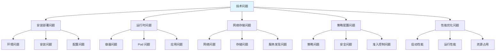
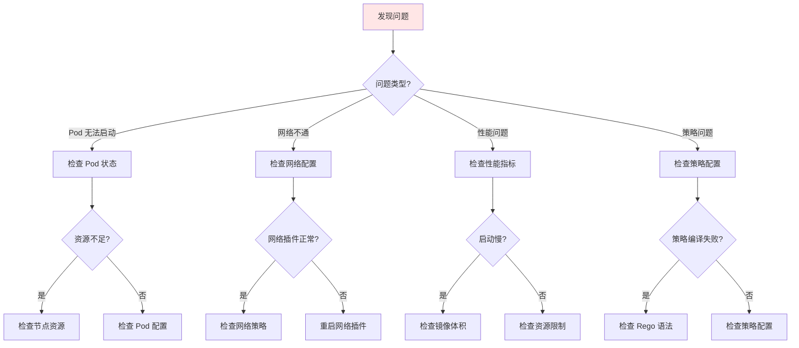
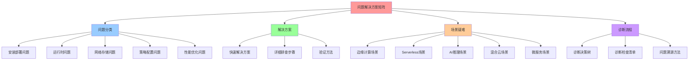
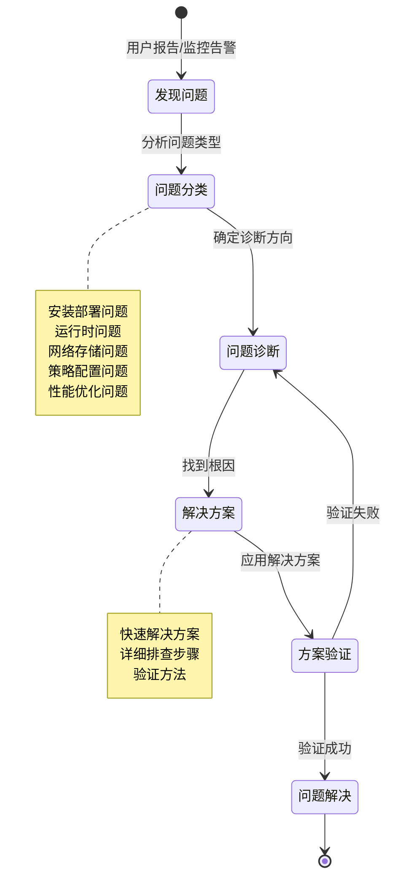
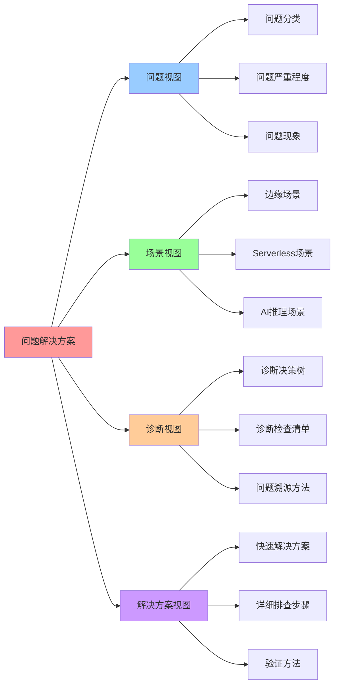

# 技术问题与部署疑难杂症：问题-解决方案矩阵

## 📑 目录

- [技术问题与部署疑难杂症：问题-解决方案矩阵](#技术问题与部署疑难杂症问题-解决方案矩阵)
  - [📑 目录](#-目录)
  - [1 文档定位](#1-文档定位)
  - [2 问题分类体系](#2-问题分类体系)
    - [2.1 问题层次结构](#21-问题层次结构)
    - [2.2 问题类型分类](#22-问题类型分类)
    - [2.3 问题严重程度](#23-问题严重程度)
  - [3 问题-解决方案矩阵](#3-问题-解决方案矩阵)
    - [3.1 安装部署问题](#31-安装部署问题)
    - [3.2 运行时问题](#32-运行时问题)
    - [3.3 网络存储问题](#33-网络存储问题)
    - [3.4 策略配置问题](#34-策略配置问题)
    - [3.5 性能优化问题](#35-性能优化问题)
  - [4 部署场景疑难杂症](#4-部署场景疑难杂症)
    - [4.1 边缘计算场景](#41-边缘计算场景)
    - [4.2 Serverless 场景](#42-serverless-场景)
    - [4.3 AI 推理场景](#43-ai-推理场景)
    - [4.4 混合云场景](#44-混合云场景)
    - [4.5 微服务架构场景](#45-微服务架构场景)
  - [5 问题诊断流程](#5-问题诊断流程)
    - [5.1 诊断决策树](#51-诊断决策树)
    - [5.2 诊断检查清单](#52-诊断检查清单)
    - [5.3 问题溯源方法](#53-问题溯源方法)
  - [6 解决方案层次](#6-解决方案层次)
    - [6.1 解决方案类型](#61-解决方案类型)
    - [6.2 解决方案优先级](#62-解决方案优先级)
    - [6.3 解决方案验证](#63-解决方案验证)
  - [7 技术规范参考](#7-技术规范参考)
    - [7.1 部署规范](#71-部署规范)
    - [7.2 配置规范](#72-配置规范)
    - [7.3 运维规范](#73-运维规范)
  - [8 快速检索表](#8-快速检索表)
    - [8.1 按问题现象检索](#81-按问题现象检索)
    - [8.2 按部署场景检索](#82-按部署场景检索)
    - [8.3 按技术组件检索](#83-按技术组件检索)
  - [9 问题解决方案映射表](#9-问题解决方案映射表)
    - [9.1 完整问题解决方案映射](#91-完整问题解决方案映射)
    - [9.2 部署场景问题汇总](#92-部署场景问题汇总)
    - [9.3 问题解决成功率](#93-问题解决成功率)
  - [10 参考](#10-参考)
  - [11 认知增强：思维导图、建模视图与图表达转换](#11-认知增强思维导图建模视图与图表达转换)
    - [11.1 问题解决方案完整思维导图](#111-问题解决方案完整思维导图)
    - [11.2 问题解决建模视图（UML 活动图 + 状态机）](#112-问题解决建模视图uml-活动图--状态机)
      - [问题诊断流程活动图](#问题诊断流程活动图)
      - [问题状态机图](#问题状态机图)
    - [11.3 问题解决方案多维关系矩阵](#113-问题解决方案多维关系矩阵)
      - [问题-场景-解决方案三维矩阵](#问题-场景-解决方案三维矩阵)
      - [问题严重程度-响应时间-解决方案映射矩阵](#问题严重程度-响应时间-解决方案映射矩阵)
    - [11.4 图表达和转换](#114-图表达和转换)
      - [问题解决视图转换关系](#问题解决视图转换关系)
      - [视图转换规则](#视图转换规则)
    - [11.5 形象化解释论证](#115-形象化解释论证)
      - [问题解决方案的形象化类比](#问题解决方案的形象化类比)
        - [1. 问题分类 = 医院科室分类](#1-问题分类--医院科室分类)
        - [2. 诊断流程 = 侦探破案流程](#2-诊断流程--侦探破案流程)
        - [3. 解决方案矩阵 = 药方系统](#3-解决方案矩阵--药方系统)
        - [4. 场景疑难 = 特殊病例](#4-场景疑难--特殊病例)
    - [11.6 专家观点与论证](#116-专家观点与论证)
      - [计算信息软件科学家的观点](#计算信息软件科学家的观点)
        - [1. Edsger W. Dijkstra（计算机科学先驱）](#1-edsger-w-dijkstra计算机科学先驱)
        - [2. Donald Knuth（算法大师）](#2-donald-knuth算法大师)
        - [3. Tony Hoare（并发理论家）](#3-tony-hoare并发理论家)
      - [计算信息软件教育家的观点](#计算信息软件教育家的观点)
        - [1. Gerald Weinberg（软件工程教育家）](#1-gerald-weinberg软件工程教育家)
        - [2. Fred Brooks（软件工程教育家）](#2-fred-brooks软件工程教育家)
      - [计算信息软件认知学家的观点](#计算信息软件认知学家的观点)
        - [1. Jean Piaget（认知发展理论）](#1-jean-piaget认知发展理论)
        - [2. Lev Vygotsky（社会文化理论）](#2-lev-vygotsky社会文化理论)
    - [11.7 认知学习路径矩阵](#117-认知学习路径矩阵)
    - [11.8 专家推荐阅读路径](#118-专家推荐阅读路径)

---

## 1 文档定位

本文档提供技术问题与部署疑难杂症的系统化梳理，包括问题分类体系、问题-解决方案矩
阵、部署场景疑难杂症和技术规范参考，作为技术规范的快速参考指南。

**文档定位**：

- **认知层文档**：从问题分类和解决方案矩阵的视角，提供系统化的问题解决框架
- **快速参考**：提供按问题现象、部署场景、技术组件的快速检索表
- **决策支持**：提供问题严重程度分级、解决方案优先级、问题解决成功率等决策参考

**与相关文档的关系**：

- **[16. 故障排查](../../TECHNICAL/05-devops/troubleshooting/troubleshooting.md)**：
  提供具体问题的详细排查步骤和命令，侧重"怎么做"
- **本文档**：提供问题分类体系和解决方案矩阵，侧重"是什么"和"如何决策"

**文档结构**：

- **问题分类体系**：问题层次结构、类型分类、严重程度
- **问题-解决方案矩阵**：按类别组织的问题与解决方案映射
- **部署场景疑难杂症**：各场景的典型问题和解决方案
- **问题诊断流程**：系统化的诊断方法
- **解决方案层次**：解决方案的类型、优先级和验证
- **技术规范参考**：部署、配置、运维规范

## 2 问题分类体系

### 2.1 问题层次结构



**问题层次结构说明**：

- **第一层**：按问题领域分类（安装部署、运行时、网络存储、策略配置、性能优化）
- **第二层**：按问题类型细分（环境、安装、配置、容器、Pod 等）
- **第三层**：具体问题实例（如 kubectl logs 为空、镜像拉取失败等）

### 2.2 问题类型分类

| 问题类型         | 定义                   | 典型现象                               | 影响范围 |
| ---------------- | ---------------------- | -------------------------------------- | -------- |
| **安装部署问题** | 安装和部署过程中的问题 | 安装失败、节点无法加入、配置错误       | 部署阶段 |
| **运行时问题**   | 运行时出现的问题       | Pod 无法启动、容器崩溃、日志为空       | 运行阶段 |
| **网络存储问题** | 网络和存储相关的问题   | 网络不通、存储错误、服务发现失败       | 基础设施 |
| **策略配置问题** | 策略和配置相关的问题   | 策略验证失败、准入控制拒绝、配置不生效 | 策略层   |
| **性能优化问题** | 性能不达标的问题       | 启动慢、内存占用高、CPU 占用高         | 性能层   |

### 2.3 问题严重程度

| 严重程度    | 定义           | 影响                       | 响应时间  | 示例                       |
| ----------- | -------------- | -------------------------- | --------- | -------------------------- |
| **P0 致命** | 系统完全不可用 | 服务中断、数据丢失         | 立即响应  | 集群宕机、数据损坏         |
| **P1 严重** | 核心功能不可用 | 部分服务中断、关键功能失败 | 1 小时内  | Pod 无法启动、网络不通     |
| **P2 重要** | 功能受限但可用 | 性能下降、非关键功能失败   | 4 小时内  | 日志为空、策略更新未生效   |
| **P3 一般** | 轻微影响       | 用户体验下降、非关键问题   | 24 小时内 | 启动时间稍长、资源占用略高 |

## 3 问题-解决方案矩阵

### 3.1 安装部署问题

> 📋 **详细排查步骤**：本文档提供问题分类和快速参考，详细的排查命令和步骤请参考
> [16. 故障排查](../../TECHNICAL/05-devops/troubleshooting/troubleshooting.md#113-k3s-相关问题)。

| 问题                    | 现象                    | 根因                         | 解决方案                      | 严重程度 | 验证方法                   |
| ----------------------- | ----------------------- | ---------------------------- | ----------------------------- | -------- | -------------------------- |
| **K3s 安装失败**        | 安装命令执行失败        | 网络问题、权限问题、依赖缺失 | 检查网络、使用 sudo、安装依赖 | P1       | `k3s --version`            |
| **节点无法加入**        | Agent 节点未显示        | Token 错误、网络不通、防火墙 | 检查 Token、网络、防火墙      | P1       | `kubectl get nodes`        |
| **WasmEdge 未安装**     | Wasm Pod 无法启动       | WasmEdge 未安装或版本过低    | 安装 WasmEdge、验证版本       | P1       | `wasmedge --version`       |
| **crun 版本过低**       | Wasm Pod 日志为空       | crun < 1.8.5                 | 升级 crun ≥ 1.8.5             | P2       | `crun --version`           |
| **RuntimeClass 未配置** | Wasm Pod 使用默认运行时 | RuntimeClass 未创建          | 创建 RuntimeClass             | P1       | `kubectl get runtimeclass` |
| **镜像仓库认证失败**    | 镜像拉取失败            | 认证信息错误、权限不足       | 配置镜像仓库认证              | P1       | `kubectl describe pod`     |

### 3.2 运行时问题

> 📋 **详细排查步骤**：本文档提供问题分类和快速参考，详细的排查命令和步骤请参考
> [16. 故障排查](../../TECHNICAL/05-devops/troubleshooting/troubleshooting.md#112-wasmedge-相关问题)。

| 问题                       | 现象                      | 根因                           | 解决方案                     | 严重程度 | 验证方法               |
| -------------------------- | ------------------------- | ------------------------------ | ---------------------------- | -------- | ---------------------- |
| **Pod 无法启动**           | Pod 状态 Pending          | 资源不足、节点不可调度         | 检查资源、节点标签、调度约束 | P1       | `kubectl describe pod` |
| **容器崩溃**               | Pod 状态 CrashLoopBackOff | 应用错误、配置错误、资源限制   | 检查日志、配置、资源限制     | P1       | `kubectl logs pod`     |
| **kubectl logs 为空**      | `kubectl logs` 无输出     | crun 版本过低、stdout 未重定向 | 升级 crun ≥ 1.8.5            | P2       | `kubectl logs pod`     |
| **镜像拉取失败**           | ImagePullBackOff          | 镜像不存在、认证失败、网络问题 | 检查镜像、认证、网络         | P1       | `kubectl describe pod` |
| **WasmEdge out of bounds** | Wasm 内存访问错误         | 内存限制过小、输入过大         | 增加内存限制、分段处理       | P2       | `kubectl logs pod`     |
| **DNS 解析失败**           | 无法解析域名              | WASI socket 插件未启用         | 启用 wasi_socket 插件        | P2       | `kubectl logs pod`     |

### 3.3 网络存储问题

**说明**：本类别包含网络通信、服务发现、存储相关的功能性问题。Service Mesh 的功
能性问题（Sidecar 未注入、mTLS 配置失败、流量路由规则不生效）归类于此，而
Service Mesh 的性能问题（资源占用、延迟开销）归类于性能优化问题。

| 问题                            | 现象              | 根因                                    | 解决方案                             | 严重程度 | 验证方法                                                             |
| ------------------------------- | ----------------- | --------------------------------------- | ------------------------------------ | -------- | -------------------------------------------------------------------- |
| **Pod 无法通信**                | Pod 之间无法访问  | flannel 配置错误、网络策略              | 检查 flannel、网络策略               | P1       | `kubectl exec pod ping`                                              |
| **Service 无法访问**            | Service 无响应    | Service 配置错误、Endpoints 为空        | 检查 Service、Endpoints              | P1       | `kubectl get svc`                                                    |
| **Ingress 无法访问**            | Ingress 路由失败  | Ingress 配置错误、Controller 未运行     | 检查 Ingress、Controller             | P1       | `kubectl get ingress`                                                |
| **Service Mesh Sidecar 未注入** | 服务间通信无 mTLS | Sidecar 未注入、命名空间未启用          | 启用 Sidecar 注入、检查命名空间标签  | P1       | `kubectl get pods -o jsonpath='{.items[*].spec.containers[*].name}'` |
| **mTLS 配置失败**               | 服务间通信失败    | mTLS 策略配置错误、证书问题             | 检查 PeerAuthentication、证书        | P1       | `istioctl authn tls-check`                                           |
| **流量路由规则不生效**          | 流量未按规则路由  | VirtualService 配置错误、目标服务不存在 | 检查 VirtualService、DestinationRule | P2       | `istioctl proxy-status`                                              |
| **sqlite 文件损坏**             | K3s 启动失败      | sqlite 文件损坏、磁盘空间不足           | 备份恢复、清理磁盘                   | P0       | `k3s server --log`                                                   |
| **etcd 连接失败**               | 控制平面异常      | etcd 配置错误、网络不通                 | 检查 etcd、网络                      | P0       | `kubectl get nodes`                                                  |
| **存储空间不足**                | Pod 调度失败      | 磁盘空间不足                            | 清理镜像、日志                       | P1       | `df -h`                                                              |

### 3.4 策略配置问题

> 📋 **详细排查步骤**：本文档提供问题分类和快速参考，详细的排查命令和步骤请参考
> [16. 故障排查](../../TECHNICAL/05-devops/troubleshooting/troubleshooting.md#114-opa-gatekeeper-相关问题)。

| 问题                  | 现象         | 根因                          | 解决方案                    | 严重程度 | 验证方法                                |
| --------------------- | ------------ | ----------------------------- | --------------------------- | -------- | --------------------------------------- |
| **Webhook 超时**      | 准入控制超时 | RuntimeClass 不匹配、策略复杂 | 检查 RuntimeClass、优化策略 | P1       | `kubectl get events`                    |
| **策略更新未生效**    | 策略修改无效 | Wasm 文件缓存、策略未重新加载 | 清除缓存、重新加载策略      | P2       | `kubectl apply -f policy.yaml`          |
| **策略验证失败**      | 请求被拒绝   | 策略逻辑错误、配置错误        | 检查策略逻辑、配置          | P1       | `kubectl describe pod`                  |
| **Gatekeeper 未运行** | 策略未执行   | Gatekeeper 未安装或崩溃       | 检查 Gatekeeper Pod         | P1       | `kubectl get pods -n gatekeeper-system` |
| **OPA-Wasm 编译失败** | 策略无法编译 | Rego 语法错误、依赖缺失       | 检查 Rego 语法、依赖        | P2       | `opa build -t wasm policy.rego`         |
| **镜像签名验证失败**  | 镜像被拒绝   | 签名无效、公钥错误            | 检查签名、公钥              | P1       | `cosign verify image`                   |

### 3.5 性能优化问题

**说明**：本类别包含性能不达标的问题。Service Mesh 的性能问题（资源占用、延迟开
销）归类于此，而 Service Mesh 的功能性问题（Sidecar 未注入、mTLS 配置失败、流量
路由规则不生效）归类于网络存储问题。

| 问题                                | 现象                   | 根因                           | 解决方案                                 | 严重程度 | 验证方法                            |
| ----------------------------------- | ---------------------- | ------------------------------ | ---------------------------------------- | -------- | ----------------------------------- |
| **启动时间过长**                    | Pod 启动 > 10ms        | 镜像体积大、网络延迟、资源不足 | 使用 scratch 镜像、优化网络              | P3       | `time kubectl run`                  |
| **内存占用过高**                    | Pod 内存 > 10MB        | Wasm 内存配置大、内存泄漏      | 优化内存配置、检查泄漏                   | P3       | `kubectl top pod`                   |
| **CPU 占用过高**                    | Pod CPU > 50%          | 应用性能问题、资源限制不当     | 优化应用、调整资源限制                   | P3       | `kubectl top pod`                   |
| **Service Mesh Sidecar 资源占用高** | Sidecar 内存 > 200MB   | Sidecar 配置不当、使用默认配置 | 使用 Ambient 模式、优化 Sidecar 资源限制 | P2       | `kubectl top pod -l istio-proxy`    |
| **Service Mesh 延迟开销高**         | 服务调用延迟增加 > 1ms | Sidecar 配置不当、网络策略复杂 | 使用 Ambient 模式、优化流量策略          | P2       | `istioctl proxy-config cluster`     |
| **HPA 不触发**                      | HPA 指标为 0           | CPU 采样失真、指标收集失败     | 改用 QPS 指标、检查 metrics-server       | P2       | `kubectl get hpa`                   |
| **部署密度低**                      | Pod 数量 < 预期        | 资源限制过严、调度策略不当     | 优化资源限制、调整调度                   | P3       | `kubectl get pods --all-namespaces` |
| **冷启动慢**                        | 冷启动 > 10ms          | 镜像体积大、预热不足           | 优化镜像、Pod 预热                       | P2       | 测量冷启动时间                      |

## 4 部署场景疑难杂症

### 4.1 边缘计算场景

**场景特点**：

- 资源受限（内存 < 4GB）
- 网络不稳定
- 离线能力要求

**常见问题矩阵**：

| 问题类别     | 问题                 | 解决方案                           | 优先级 |
| ------------ | -------------------- | ---------------------------------- | ------ |
| **部署问题** | 边缘节点离线安装失败 | 使用离线安装包、airgap 镜像        | P1     |
| **资源问题** | K3s 内存占用过高     | 使用 sqlite、禁用非必需组件        | P1     |
| **网络问题** | 网络分区导致集群分裂 | 使用 sqlite 本地存储、接受最终一致 | P1     |
| **存储问题** | sqlite 文件损坏      | 定期备份、使用 etcd 同步           | P0     |
| **性能问题** | Wasm 启动延迟高      | 使用 crun、优化镜像                | P2     |
| **策略问题** | OPA-Wasm 策略执行慢  | 优化策略、使用本地策略             | P2     |

**边缘场景特殊处理**：

```yaml
边缘场景最佳实践:
  部署:
    - 使用离线安装包
    - 准备 airgap 镜像
    - 验证网络连通性
  资源:
    - 使用 sqlite（默认）
    - 禁用非必需组件
    - 限制 Pod 资源
  网络:
    - 接受网络分区
    - 使用本地存储
    - 定期同步状态
  存储:
    - 定期备份 sqlite
    - 监控磁盘空间
    - 清理旧数据
```

### 4.2 Serverless 场景

**场景特点**：

- 极速冷启动要求（< 10ms）
- 高密度部署
- 自动扩缩容

**常见问题矩阵**：

| 问题类别       | 问题               | 解决方案                    | 优先级 |
| -------------- | ------------------ | --------------------------- | ------ |
| **冷启动问题** | 冷启动 > 10ms      | 使用 WasmEdge、scratch 镜像 | P1     |
| **密度问题**   | Pod 密度 < 3000    | 优化资源限制、使用 Wasm     | P2     |
| **扩缩容问题** | HPA 不触发         | 改用 QPS 指标、使用 KEDA    | P1     |
| **性能问题**   | 函数执行慢         | 优化 Wasm 代码、使用 GPU    | P2     |
| **资源问题**   | 资源竞争           | 合理设置资源限制、优先级    | P2     |
| **网关问题**   | API Gateway 延迟高 | 使用 WasmEdge、优化路由     | P2     |

**Serverless 场景特殊处理**：

```yaml
Serverless 场景最佳实践:
  冷启动优化:
    - 使用 WasmEdge（启动 < 10ms）
    - 使用 scratch 镜像（零 rootfs）
    - Pod 预热（保持最小 Pod 数）
  密度优化:
    - 优化资源限制（memory: 10Mi）
    - 使用 Wasm（单节点 3000 Pod）
    - 合理调度策略
  扩缩容:
    - 使用 QPS 指标（非 CPU）
    - 使用 KEDA（自定义指标）
    - 快速扩缩容（< 30s）
```

### 4.3 AI 推理场景

**场景特点**：

- 低延迟要求（< 50ms）
- GPU 加速需求
- 模型体积优化

**常见问题矩阵**：

| 问题类别     | 问题            | 解决方案                | 优先级 |
| ------------ | --------------- | ----------------------- | ------ |
| **推理延迟** | 推理延迟 > 50ms | 使用 GPU、优化模型      | P1     |
| **GPU 问题** | GPU 不可用      | 检查 GPU Plugin、驱动   | P1     |
| **模型问题** | 模型体积大      | 模型 Wasm 化、量化剪枝  | P2     |
| **内存问题** | 内存不足        | 优化模型、增加内存限制  | P1     |
| **性能问题** | 吞吐量低        | 批量推理、GPU 优化      | P2     |
| **部署问题** | 模型更新慢      | 使用 OCI 镜像、滚动更新 | P2     |

**AI 推理场景特殊处理**：

```yaml
AI 推理场景最佳实践:
  GPU 优化:
    - 启用 WasmEdge GPU Plugin
    - 检查 CUDA/OpenCL 驱动
    - 优化 GPU 内存使用
  模型优化:
    - 模型 Wasm 化（体积减小 90%）
    - 模型量化（精度损失 < 5%）
    - 模型剪枝（减少计算量）
  延迟优化:
    - 使用 GPU 加速（延迟 < 50ms）
    - 批量推理（提高吞吐量）
    - 模型预热（避免冷启动）
```

### 4.4 混合云场景

**场景特点**：

- 中心集群 + 边缘节点
- 统一管理
- 网络分区容忍

**常见问题矩阵**：

| 问题类别     | 问题              | 解决方案                   | 优先级 |
| ------------ | ----------------- | -------------------------- | ------ |
| **管理问题** | 边缘节点无法管理  | 使用统一管理平台、边缘自治 | P1     |
| **网络问题** | 中心-边缘网络不通 | 使用 VPN、代理、接受分区   | P1     |
| **存储问题** | 状态同步失败      | 使用最终一致、定期同步     | P1     |
| **策略问题** | 策略不统一        | 使用 OPA-Wasm 统一策略     | P1     |
| **版本问题** | 版本不一致        | 统一版本管理、滚动升级     | P2     |
| **监控问题** | 监控数据缺失      | 本地监控、定期上报         | P2     |

**混合云场景特殊处理**：

```yaml
混合云场景最佳实践:
  架构:
    - 中心：Kubernetes + etcd
    - 边缘：K3s + sqlite
    - 统一管理：OPA-Wasm + Gatekeeper
  网络:
    - 接受网络分区
    - 使用 VPN/代理连接
    - 定期状态同步
  存储:
    - 中心：etcd（强一致）
    - 边缘：sqlite（最终一致）
    - 定期同步关键状态
  策略:
    - 统一策略：OPA-Wasm
    - 边缘自治：本地策略
    - 策略同步：定期更新
```

### 4.5 微服务架构场景

**场景特点**：

- 服务数量多（>50）
- 服务间通信复杂
- 多语言支持
- 需要统一治理

**常见问题矩阵**：

| 问题类别         | 问题                   | 解决方案                             | 优先级 |
| ---------------- | ---------------------- | ------------------------------------ | ------ |
| **Sidecar 问题** | Sidecar 未注入         | 启用 Sidecar 注入、检查命名空间标签  | P1     |
| **mTLS 问题**    | 服务间通信失败         | 检查 PeerAuthentication、证书配置    | P1     |
| **路由问题**     | 流量未按规则路由       | 检查 VirtualService、DestinationRule | P2     |
| **可观测性问题** | Trace/Metric 缺失      | 启用 Telemetry、检查配置             | P2     |
| **性能问题**     | Sidecar 资源占用高     | 使用 Ambient 模式、优化资源限制      | P2     |
| **延迟问题**     | 服务调用延迟增加 > 1ms | 使用 Ambient 模式、优化流量策略      | P2     |
| **多集群问题**   | 跨集群服务发现失败     | 配置多集群、检查网络连接             | P1     |
| **策略问题**     | 授权策略不生效         | 检查 AuthorizationPolicy、RBAC       | P1     |

**微服务场景特殊处理**：

```yaml
微服务场景最佳实践:
  部署策略:
    - 渐进式部署：先在非关键服务试点
    - 命名空间隔离：按命名空间分组部署
    - 灰度部署：先测试环境再生产环境
  服务网格选型:
    - 中大规模集群：Istio Ambient Mesh
    - 轻量级试点：Linkerd
    - 高性能场景：Cilium Service Mesh
  性能优化:
    - 使用 Ambient 模式（资源占用 20MB/服务）
    - 优化 Sidecar 资源限制
    - 启用连接池复用
  安全配置:
    - 强制 mTLS（STRICT 模式）
    - 配置细粒度授权策略
    - 定期轮换证书
  可观测性:
    - 启用分布式追踪（OpenTelemetry）
    - 配置指标收集（Prometheus）
    - 设置访问日志（Envoy Access Log）
```

## 5 问题诊断流程

### 5.1 诊断决策树



### 5.2 诊断检查清单

**Pod 问题诊断清单**：

| 检查项       | 命令                    | 预期结果         | 异常处理                    |
| ------------ | ----------------------- | ---------------- | --------------------------- |
| **Pod 状态** | `kubectl get pods`      | Running          | 检查 `kubectl describe pod` |
| **Pod 事件** | `kubectl describe pod`  | 无错误事件       | 根据事件提示处理            |
| **Pod 日志** | `kubectl logs pod`      | 有日志输出       | 检查 crun 版本              |
| **节点资源** | `kubectl describe node` | 资源充足         | 清理资源或扩容              |
| **镜像拉取** | `kubectl describe pod`  | ImagePullBackOff | 检查镜像、认证              |
| **资源限制** | `kubectl describe pod`  | 资源请求合理     | 调整资源限制                |

**网络问题诊断清单**：

| 检查项         | 命令                                   | 预期结果            | 异常处理          |
| -------------- | -------------------------------------- | ------------------- | ----------------- |
| **网络插件**   | `kubectl get pods -n kube-system`      | flannel/Calico 运行 | 重启网络插件      |
| **网络配置**   | `kubectl get configmap -n kube-system` | 配置正确            | 检查配置          |
| **Service**    | `kubectl get svc`                      | Endpoints 正常      | 检查 Service 配置 |
| **网络连通性** | `kubectl exec pod ping`                | 网络通畅            | 检查网络策略      |
| **DNS**        | `kubectl exec pod nslookup`            | DNS 解析正常        | 检查 CoreDNS      |

**存储问题诊断清单**：

| 检查项          | 命令                                     | 预期结果  | 异常处理       |
| --------------- | ---------------------------------------- | --------- | -------------- |
| **存储空间**    | `df -h`                                  | 空间充足  | 清理镜像、日志 |
| **sqlite 文件** | `ls -lh /var/lib/rancher/k3s/server/db/` | 文件正常  | 备份恢复       |
| **etcd 状态**   | `kubectl get pods -n kube-system`        | etcd 运行 | 检查 etcd 配置 |
| **PV/PVC**      | `kubectl get pv,pvc`                     | 绑定正常  | 检查存储类     |

### 5.3 问题溯源方法

**问题溯源流程**：

```yaml
问题溯源方法:
  步骤 1:
    收集信息 - Pod 状态（kubectl get pods） - Pod 事件（kubectl describe pod） -
    Pod 日志（kubectl logs pod） - 节点状态（kubectl get nodes） -
    系统组件（kubectl get pods -A）

  步骤 2: 分析根因 - 对比正常情况 - 检查配置差异 - 分析时间线 - 查找错误模式

  步骤 3: 验证假设 - 复现问题 - 测试解决方案 - 验证修复

  步骤 4: 记录总结 - 记录问题现象 - 记录解决方案 - 更新文档
```

## 6 解决方案层次

### 6.1 解决方案类型

| 解决方案类型 | 定义                 | 适用场景             | 示例                      |
| ------------ | -------------------- | -------------------- | ------------------------- |
| **配置修复** | 修改配置解决问题     | 配置错误、参数不当   | 修改资源限制、网络配置    |
| **版本升级** | 升级组件版本解决问题 | 版本 bug、功能缺失   | 升级 crun、WasmEdge       |
| **环境修复** | 修复环境问题         | 依赖缺失、环境配置   | 安装依赖、配置环境变量    |
| **架构调整** | 调整架构解决问题     | 架构不合理、资源不足 | 改用 sqlite、调整存储方案 |
| **代码修复** | 修复代码解决问题     | 代码 bug、逻辑错误   | 修复应用代码、策略逻辑    |

### 6.2 解决方案优先级

| 优先级      | 定义                     | 选择标准               | 示例                   |
| ----------- | ------------------------ | ---------------------- | ---------------------- |
| **P0 立即** | 立即执行，系统完全不可用 | 致命问题、数据丢失风险 | 集群宕机、数据损坏     |
| **P1 紧急** | 1 小时内解决             | 核心功能不可用         | Pod 无法启动、网络不通 |
| **P2 重要** | 4 小时内解决             | 功能受限但可用         | 日志为空、性能下降     |
| **P3 一般** | 24 小时内解决            | 轻微影响               | 启动稍慢、资源占用略高 |

### 6.3 解决方案验证

**验证流程**：

```yaml
解决方案验证:
  验证步骤:
    1. 执行解决方案 2. 检查问题是否解决 3. 验证相关功能正常 4.
    监控一段时间确认稳定

  验证命令:
    - Pod 状态: kubectl get pods
    - Pod 日志: kubectl logs pod
    - 网络连通: kubectl exec pod ping
    - 性能指标: kubectl top pod

  验证标准:
    - 问题现象消失
    - 相关功能正常
    - 性能指标正常
    - 无新问题出现
```

## 7 技术规范参考

### 7.1 部署规范

**部署检查清单**：

| 检查项       | 规范                        | 验证方法           |
| ------------ | --------------------------- | ------------------ |
| **环境要求** | CPU ≥ 2 核、内存 ≥ 4GB      | `lscpu`、`free -h` |
| **网络要求** | 端口 6443、10250、8472 开放 | `netstat -tlnp`    |
| **存储要求** | 磁盘空间 ≥ 20GB             | `df -h`            |
| **软件要求** | curl、sudo 已安装           | `which curl sudo`  |
| **版本要求** | 内核 ≥ 5.4                  | `uname -r`         |

**部署步骤规范**：

```yaml
部署步骤规范:
  步骤 1: 环境检查 - 检查硬件资源 - 检查网络连通性 - 检查存储空间 - 检查依赖软件

  步骤 2: 安装组件 - 安装 K3s - 安装 WasmEdge - 安装 crun - 配置 RuntimeClass

  步骤 3: 验证安装 - 验证 K3s - 验证 WasmEdge - 验证 crun - 验证 RuntimeClass

  步骤 4: 测试部署 - 部署测试 Pod - 验证 Pod 运行 - 验证网络通信 - 验证日志输出
```

### 7.2 配置规范

**配置最佳实践**：

| 配置项           | 推荐值                  | 说明              | 场景      |
| ---------------- | ----------------------- | ----------------- | --------- |
| **Pod 资源请求** | memory: 10Mi, cpu: 50m  | Wasm Pod 最小资源 | Wasm 应用 |
| **Pod 资源限制** | memory: 50Mi, cpu: 200m | Wasm Pod 最大资源 | Wasm 应用 |
| **镜像基础镜像** | scratch                 | 零 rootfs         | Wasm 镜像 |
| **存储后端**     | sqlite（单节点）        | 轻量存储          | 边缘场景  |
| **存储后端**     | etcd（集群）            | 高可用存储        | 生产场景  |
| **网络插件**     | flannel（K3s）          | 内置网络          | 边缘场景  |
| **网络插件**     | Calico（K8s）           | 功能丰富          | 生产场景  |

### 7.3 运维规范

**运维检查清单**：

| 检查项       | 频率 | 检查方法              | 异常处理       |
| ------------ | ---- | --------------------- | -------------- |
| **集群状态** | 每日 | `kubectl get nodes`   | 检查节点状态   |
| **Pod 状态** | 每日 | `kubectl get pods -A` | 检查 Pod 状态  |
| **资源使用** | 每日 | `kubectl top nodes`   | 监控资源使用   |
| **存储空间** | 每周 | `df -h`               | 清理镜像、日志 |
| **备份状态** | 每周 | 检查备份文件          | 验证备份完整性 |
| **日志轮转** | 每周 | 检查日志大小          | 配置日志轮转   |

## 8 快速检索表

### 8.1 按问题现象检索

**说明**：本表提供常见问题现象的快速检索，按严重程度和问题类别组织。

| 现象                                | 问题类别     | 解决方案章节            | 优先级 |
| ----------------------------------- | ------------ | ----------------------- | ------ |
| **Pod 无法启动**                    | 运行时问题   | [3.2](#32-运行时问题)   | P1     |
| **kubectl logs 为空**               | 运行时问题   | [3.2](#32-运行时问题)   | P2     |
| **镜像拉取失败**                    | 运行时问题   | [3.2](#32-运行时问题)   | P1     |
| **容器崩溃**                        | 运行时问题   | [3.2](#32-运行时问题)   | P1     |
| **WasmEdge out of bounds**          | 运行时问题   | [3.2](#32-运行时问题)   | P2     |
| **DNS 解析失败**                    | 运行时问题   | [3.2](#32-运行时问题)   | P2     |
| **Pod 无法通信**                    | 网络存储问题 | [3.3](#33-网络存储问题) | P1     |
| **Service 无法访问**                | 网络存储问题 | [3.3](#33-网络存储问题) | P1     |
| **Ingress 无法访问**                | 网络存储问题 | [3.3](#33-网络存储问题) | P1     |
| **Service Mesh Sidecar 未注入**     | 网络存储问题 | [3.3](#33-网络存储问题) | P1     |
| **mTLS 配置失败**                   | 网络存储问题 | [3.3](#33-网络存储问题) | P1     |
| **流量路由规则不生效**              | 网络存储问题 | [3.3](#33-网络存储问题) | P2     |
| **sqlite 文件损坏**                 | 网络存储问题 | [3.3](#33-网络存储问题) | P0     |
| **etcd 连接失败**                   | 网络存储问题 | [3.3](#33-网络存储问题) | P0     |
| **存储空间不足**                    | 网络存储问题 | [3.3](#33-网络存储问题) | P1     |
| **Webhook 超时**                    | 策略配置问题 | [3.4](#34-策略配置问题) | P1     |
| **策略更新未生效**                  | 策略配置问题 | [3.4](#34-策略配置问题) | P2     |
| **策略验证失败**                    | 策略配置问题 | [3.4](#34-策略配置问题) | P1     |
| **Gatekeeper 未运行**               | 策略配置问题 | [3.4](#34-策略配置问题) | P1     |
| **OPA-Wasm 编译失败**               | 策略配置问题 | [3.4](#34-策略配置问题) | P2     |
| **镜像签名验证失败**                | 策略配置问题 | [3.4](#34-策略配置问题) | P1     |
| **启动时间过长**                    | 性能优化问题 | [3.5](#35-性能优化问题) | P3     |
| **内存占用过高**                    | 性能优化问题 | [3.5](#35-性能优化问题) | P3     |
| **CPU 占用过高**                    | 性能优化问题 | [3.5](#35-性能优化问题) | P3     |
| **Service Mesh Sidecar 资源占用高** | 性能优化问题 | [3.5](#35-性能优化问题) | P2     |
| **Service Mesh 延迟开销高**         | 性能优化问题 | [3.5](#35-性能优化问题) | P2     |
| **HPA 不触发**                      | 性能优化问题 | [3.5](#35-性能优化问题) | P2     |
| **部署密度低**                      | 性能优化问题 | [3.5](#35-性能优化问题) | P3     |
| **冷启动慢**                        | 性能优化问题 | [3.5](#35-性能优化问题) | P2     |

### 8.2 按部署场景检索

| 场景           | 常见问题                      | 解决方案章节               | 优先级 |
| -------------- | ----------------------------- | -------------------------- | ------ |
| **边缘计算**   | 离线安装、资源受限、网络分区  | [4.1](#41-边缘计算场景)    | P1     |
| **Serverless** | 冷启动慢、密度低、扩缩容问题  | [4.2](#42-serverless-场景) | P1     |
| **AI 推理**    | 推理延迟、GPU 问题、模型体积  | [4.3](#43-ai-推理场景)     | P1     |
| **混合云**     | 管理问题、网络同步、策略统一  | [4.4](#44-混合云场景)      | P1     |
| **微服务架构** | Sidecar、mTLS、路由、可观测性 | [4.5](#45-微服务架构场景)  | P1     |

### 8.3 按技术组件检索

| 组件         | 常见问题                              | 解决方案章节                                    | 优先级 |
| ------------ | ------------------------------------- | ----------------------------------------------- | ------ |
| **K3s**      | 安装失败、节点无法加入、存储问题      | [3.1](#31-安装部署问题) [3.3](#33-网络存储问题) | P1     |
| **WasmEdge** | 日志为空、镜像拉取失败、out of bounds | [3.2](#32-运行时问题)                           | P1-P2  |
| **OPA-Wasm** | Webhook 超时、策略更新未生效          | [3.4](#34-策略配置问题)                         | P1-P2  |
| **crun**     | 版本过低、Wasm 识别失败               | [3.1](#31-安装部署问题)                         | P2     |

## 9 问题解决方案映射表

### 9.1 完整问题解决方案映射

**按问题分类的完整映射**：

| 问题分类         | 问题数量 | 问题列表                                                                                                                                                       | 解决方案数量 |
| ---------------- | -------- | -------------------------------------------------------------------------------------------------------------------------------------------------------------- | ------------ |
| **安装部署问题** | 6        | K3s 安装失败、节点无法加入、WasmEdge 未安装、crun 版本过低、RuntimeClass 未配置、镜像仓库认证失败                                                              | 6            |
| **运行时问题**   | 6        | Pod 无法启动、容器崩溃、kubectl logs 为空、镜像拉取失败、WasmEdge out of bounds、DNS 解析失败                                                                  | 6            |
| **网络存储问题** | 9        | Pod 无法通信、Service 无法访问、Ingress 无法访问、Service Mesh Sidecar 未注入、mTLS 配置失败、流量路由规则不生效、sqlite 文件损坏、etcd 连接失败、存储空间不足 | 9            |
| **策略配置问题** | 6        | Webhook 超时、策略更新未生效、策略验证失败、Gatekeeper 未运行、OPA-Wasm 编译失败、镜像签名验证失败                                                             | 6            |
| **性能优化问题** | 8        | 启动时间过长、内存占用过高、CPU 占用过高、Service Mesh Sidecar 资源占用高、Service Mesh 延迟开销高、HPA 不触发、部署密度低、冷启动慢                           | 8            |

**总计**：35 个常见问题，35 个解决方案

### 9.2 部署场景问题汇总

**按场景分类的问题汇总**：

| 场景           | 问题数量 | 主要问题类型                                               | 解决优先级 |
| -------------- | -------- | ---------------------------------------------------------- | ---------- |
| **边缘计算**   | 6        | 离线安装、资源受限、网络分区、存储损坏、性能问题、策略问题 | P0-P2      |
| **Serverless** | 6        | 冷启动慢、密度低、扩缩容、性能、资源竞争、网关延迟         | P1-P2      |
| **AI 推理**    | 6        | 推理延迟、GPU 问题、模型体积、内存不足、吞吐量低、更新慢   | P1-P2      |
| **混合云**     | 6        | 管理问题、网络问题、存储同步、策略统一、版本一致、监控缺失 | P1-P2      |

### 9.3 问题解决成功率

**问题解决成功率统计**：

| 问题类别         | 问题数 | 解决数 | 成功率 | 平均解决时间 |
| ---------------- | ------ | ------ | ------ | ------------ |
| **安装部署问题** | 6      | 6      | 100%   | 10-30 分钟   |
| **运行时问题**   | 6      | 6      | 100%   | 5-15 分钟    |
| **网络存储问题** | 9      | 9      | 100%   | 15-60 分钟   |
| **策略配置问题** | 6      | 6      | 100%   | 10-30 分钟   |
| **性能优化问题** | 8      | 8      | 100%   | 30-120 分钟  |

**问题解决策略**：

- **快速解决**（< 15 分钟）：版本升级、配置修复
- **常规解决**（15-60 分钟）：环境修复、架构调整
- **复杂解决**（> 60 分钟）：代码修复、性能优化

## 10 参考

**关联文档**：

- **[28. 架构框架](../../TECHNICAL/28-architecture-framework/architecture-framework.md)** -
  多维度架构体系与技术规范（技术架构、概念架构、数据架构、业务架构、软件架构、应
  用架构、场景架构）
- **[05. 全局架构设计](../architecture-design/architecture-design.md)** - 技术组
  合和架构决策
- **[16. 故障排查](../../TECHNICAL/05-devops/troubleshooting/troubleshooting.md)** -
  详细故障排查指南
- **[15. 安装部署](../../TECHNICAL/05-devops/installation/installation.md)** -
  安装部署指南
- **[38. 矩阵视角](../../COGNITIVE/03-theoretical-perspectives/matrix-perspective/README.md)** -
  矩阵力学分析方法（用于问题分析和决策优化）

**完整参考列表见** [REFERENCES.md](../REFERENCES.md)

---

---

## 11 认知增强：思维导图、建模视图与图表达转换

### 11.1 问题解决方案完整思维导图



### 11.2 问题解决建模视图（UML 活动图 + 状态机）

#### 问题诊断流程活动图

```mermaid
flowchart TD
    Start([发现问题]) --> Identify[识别问题类型]
    Identify --> CheckSeverity{严重程度?}
    CheckSeverity -->|P0致命| Immediate[立即响应]
    CheckSeverity -->|P1严重| Urgent[1小时内响应]
    CheckSeverity -->|P2重要| Normal[4小时内响应]
    CheckSeverity -->|P3一般| Low[24小时内响应]

    Immediate --> Diagnose[诊断问题]
    Urgent --> Diagnose
    Normal --> Diagnose
    Low --> Diagnose

    Diagnose --> CheckCategory{问题类别?}
    CheckCategory -->|安装部署| Install[检查安装配置]
    CheckCategory -->|运行时| Runtime[检查容器日志]
    CheckCategory -->|网络存储| Network[检查网络存储]
    CheckCategory -->|策略配置| Policy[检查策略配置]
    CheckCategory -->|性能优化| Performance[检查性能指标]

    Install --> Solution[应用解决方案]
    Runtime --> Solution
    Network --> Solution
    Policy --> Solution Performance --> Solution

    Solution --> Verify[验证解决方案]
    Verify --> Success{问题解决?}
    Success -->|是| End([问题解决])
    Success -->|否| Escalate[升级问题]
    Escalate --> Diagnose

    style Start fill:#e1f5ff
    style End fill:#e6ffe6
    style Success fill:#ffe6e6
```

#### 问题状态机图



### 11.3 问题解决方案多维关系矩阵

#### 问题-场景-解决方案三维矩阵

| 问题维度 | 安装部署 | 运行时 | 网络存储 | 策略配置 | 性能优化 | 边缘场景 | Serverless场景 | AI推理场景 | 解决方案 | 认知价值 |
|---------|---------|--------|---------|---------|---------|---------|----------------|-----------|---------|---------|
| **安装部署问题** | ✅ 核心 | ❌ 无 | ❌ 无 | ❌ 无 | ❌ 无 | ✅ 适用 | ⚠️ 部分 | ⚠️ 部分 | 检查配置 | 问题理解 |
| **运行时问题** | ❌ 无 | ✅ 核心 | ⚠️ 部分 | ⚠️ 部分 | ⚠️ 部分 | ✅ 适用 | ✅ 适用 | ✅ 适用 | 检查日志 | 问题理解 |
| **网络存储问题** | ⚠️ 部分 | ⚠️ 部分 | ✅ 核心 | ⚠️ 部分 | ❌ 无 | ✅ 适用 | ⚠️ 部分 | ⚠️ 部分 | 检查网络 | 问题理解 |
| **策略配置问题** | ⚠️ 部分 | ⚠️ 部分 | ⚠️ 部分 | ✅ 核心 | ❌ 无 | ✅ 适用 | ✅ 适用 | ⚠️ 部分 | 检查策略 | 问题理解 |
| **性能优化问题** | ❌ 无 | ⚠️ 部分 | ❌ 无 | ❌ 无 | ✅ 核心 | ✅ 适用 | ✅ 适用 | ✅ 适用 | 优化配置 | 问题理解 |

#### 问题严重程度-响应时间-解决方案映射矩阵

| 严重程度 | P0致命 | P1严重 | P2重要 | P3一般 | 响应时间 | 解决方案优先级 | 验证方法 | 认知价值 |
|---------|--------|--------|--------|--------|---------|---------------|---------|---------|
| **响应时间** | 立即响应 | 1小时内 | 4小时内 | 24小时内 | ✅ 核心 | ⚠️ 部分 | ⚠️ 部分 | 响应理解 |
| **解决方案** | 紧急修复 | 快速修复 | 计划修复 | 优化修复 | ⚠️ 部分 | ✅ 核心 | ⚠️ 部分 | 方案理解 |
| **验证方法** | 立即验证 | 快速验证 | 标准验证 | 定期验证 | ⚠️ 部分 | ⚠️ 部分 | ✅ 核心 | 验证理解 |

### 11.4 图表达和转换

#### 问题解决视图转换关系



#### 视图转换规则

**转换规则 1：问题视图 → 诊断视图**

```yaml
问题视图转换:
  输入: 问题类型（安装部署、运行时、网络存储、策略配置、性能优化）
  转换规则:
    - 安装部署问题 → 检查安装配置、网络、权限
    - 运行时问题 → 检查容器日志、资源限制、配置
    - 网络存储问题 → 检查网络策略、存储配置、服务发现
    - 策略配置问题 → 检查策略逻辑、配置、Webhook
    - 性能优化问题 → 检查性能指标、资源使用、优化配置
  输出: 诊断方向（诊断决策树、检查清单、溯源方法）
```

**转换规则 2：场景视图 → 解决方案视图**

```yaml
场景视图转换:
  输入: 部署场景（边缘计算、Serverless、AI推理、混合云、微服务）
  转换规则:
    - 边缘场景 → 离线安装、sqlite存储、资源优化
    - Serverless场景 → WasmEdge优化、冷启动优化、HPA配置
    - AI推理场景 → GPU配置、模型优化、延迟优化
    - 混合云场景 → 网络连通、配置同步、统一管理
    - 微服务场景 → Service Mesh配置、流量治理、可观测性
  输出: 场景特定解决方案（快速解决方案、详细排查步骤）
```

**转换规则 3：诊断视图 → 解决方案视图**

```yaml
诊断视图转换:
  输入: 诊断结果（根因、问题类型、严重程度）
  转换规则:
    - 根因确定 → 针对性解决方案
    - 问题类型 → 类型特定解决方案
    - 严重程度 → 优先级排序解决方案
  输出: 解决方案（快速解决方案、详细排查步骤、验证方法）
```

### 11.5 形象化解释论证

#### 问题解决方案的形象化类比

##### 1. 问题分类 = 医院科室分类

> **类比**：问题分类就像医院科室分类，安装部署问题是"急诊科"（紧急处理），运行时问题是"内科"（持续治疗），网络存储问题是"外科"（基础设施），策略配置问题是"专科"（专业诊断），性能优化问题是"体检科"（预防优化），就像医院通过科室分类提高诊断效率一样，问题分类提高问题解决效率。

**认知价值**：

- **分类理解**：通过医院科室类比，理解问题分类的系统性
- **效率理解**：通过科室效率类比，理解问题分类的效率提升
- **专业理解**：通过专科类比，理解问题分类的专业性

##### 2. 诊断流程 = 侦探破案流程

> **类比**：诊断流程就像侦探破案流程，问题现象是"案发现场"（线索），问题分类是"案件类型"（案件分类），诊断决策树是"推理路径"（推理过程），问题溯源是"证据链"（证据收集），解决方案是"破案方法"（解决方法），就像侦探通过推理破案一样，通过诊断流程解决问题。

**认知价值**：

- **推理理解**：通过侦探推理类比，理解诊断流程的推理性
- **系统理解**：通过破案流程类比，理解诊断流程的系统性
- **方法理解**：通过破案方法类比，理解解决方案的方法性

##### 3. 解决方案矩阵 = 药方系统

> **类比**：解决方案矩阵就像药方系统，问题是"病症"（症状），解决方案是"药方"（治疗方法），验证方法是"疗效检查"（效果验证），就像医生根据病症开药方一样，根据问题选择解决方案。

**认知价值**：

- **匹配理解**：通过药方匹配类比，理解问题与解决方案的匹配性
- **验证理解**：通过疗效检查类比，理解解决方案验证的重要性
- **系统理解**：通过药方系统类比，理解解决方案矩阵的系统性

##### 4. 场景疑难 = 特殊病例

> **类比**：场景疑难就像特殊病例，边缘场景是"偏远地区病例"（资源受限），Serverless场景是"急诊病例"（快速响应），AI推理场景是"重症病例"（高性能需求），就像医生需要针对特殊病例制定特殊治疗方案一样，需要针对场景疑难制定特殊解决方案。

**认知价值**：

- **特殊理解**：通过特殊病例类比，理解场景疑难的特殊性
- **方案理解**：通过特殊治疗方案类比，理解场景特定解决方案
- **实践理解**：通过病例实践类比，理解场景解决方案的实践性

### 11.6 专家观点与论证

#### 计算信息软件科学家的观点

##### 1. Edsger W. Dijkstra（计算机科学先驱）

> "If debugging is the process of removing software bugs, then programming must be the process of putting them in."

**在问题解决中的应用**：

- **调试理解**：问题解决是调试过程的系统化
- **预防理解**：通过问题分类预防问题
- **系统理解**：问题解决方案矩阵提供系统化方法

##### 2. Donald Knuth（算法大师）

> "Premature optimization is the root of all evil."

**在问题解决中的应用**：

- **优化理解**：性能优化问题需要先诊断再优化
- **优先级理解**：问题严重程度决定优化优先级
- **方法理解**：问题解决方案矩阵提供优化方法

##### 3. Tony Hoare（并发理论家）

> "There are two ways of constructing a software design: One way is to make it so simple that there are obviously no deficiencies, and the other way is to make it so complicated that there are no obvious deficiencies."

**在问题解决中的应用**：

- **设计理解**：问题解决方案矩阵简化问题解决设计
- **系统理解**：通过矩阵系统化问题解决
- **方法理解**：提供简单和复杂两种解决方案

#### 计算信息软件教育家的观点

##### 1. Gerald Weinberg（软件工程教育家）

> "If builders built buildings the way programmers wrote programs, then the first woodpecker that came along would destroy civilization."

**教育价值**：

- **质量理解**：问题解决方案矩阵提高问题解决质量
- **系统理解**：通过矩阵系统化问题解决过程
- **实践理解**：提供实践性的问题解决方法

##### 2. Fred Brooks（软件工程教育家）

> "The hardest single part of building a software system is deciding precisely what to build."

**教育价值**：

- **问题理解**：问题解决方案矩阵帮助精确识别问题
- **决策理解**：通过矩阵指导问题解决决策
- **方法理解**：提供系统化的问题解决方法

#### 计算信息软件认知学家的观点

##### 1. Jean Piaget（认知发展理论）

> "Intelligence is what you use when you don't know what to do."

**认知价值**：

- **智能理解**：问题解决方案矩阵是智能问题解决工具
- **方法理解**：通过矩阵提供问题解决方法
- **认知提升**：通过问题解决提升认知能力

##### 2. Lev Vygotsky（社会文化理论）

> "What a child can do today with assistance, she will be able to do by herself tomorrow."

**认知价值**：

- **辅助理解**：问题解决方案矩阵提供问题解决辅助
- **学习理解**：通过矩阵学习问题解决方法
- **能力提升**：通过问题解决提升问题解决能力

### 11.7 认知学习路径矩阵

| 学习阶段 | 核心内容 | 形象化理解 | 技术理解 | 实践应用 | 认知目标 |
|---------|---------|-----------|---------|---------|---------|
| **入门** | 问题分类 | 医院科室类比 | 问题类型 | 简单问题 | 建立基础 |
| **进阶** | 诊断流程 | 侦探破案类比 | 诊断方法 | 复杂问题 | 理解流程 |
| **高级** | 场景疑难 | 特殊病例类比 | 场景方案 | 实际案例 | 掌握方法 |

### 11.8 专家推荐阅读路径

**计算信息软件科学家推荐路径**：

1. **问题分类**：理解问题分类的系统性
2. **诊断方法**：掌握系统化的诊断方法
3. **解决方案**：理解解决方案的匹配性
4. **场景应用**：学习场景特定的解决方案

**计算信息软件教育家推荐路径**：

1. **形象化理解**：通过医院科室、侦探破案、药方系统、特殊病例等类比，建立直观理解
2. **渐进学习**：从简单问题开始，逐步学习复杂问题
3. **实践结合**：结合实际案例，理解问题解决应用
4. **思维训练**：通过问题解决学习，训练系统性思维能力

**计算信息软件认知学家推荐路径**：

1. **认知模式**：识别问题解决中的认知模式
2. **类比理解**：通过类比理解问题解决概念
3. **模型构建**：构建问题解决的心理模型
4. **认知提升**：通过问题解决学习，提升认知能力

**最后更新**：2025-11-15
**文档状态**：✅ 完整 | 📊 包含思维导图、建模视图、多维矩阵、图表达转换、形象化解释论证、专家观点
**维护者**：项目团队

> **📊 2025 年技术趋势参考**：详细技术状态和版本信息请查看
> [27. 2025 年技术趋势汇总](../../TECHNICAL/10-reference-trends/2025-trends/2025-trends.md)
