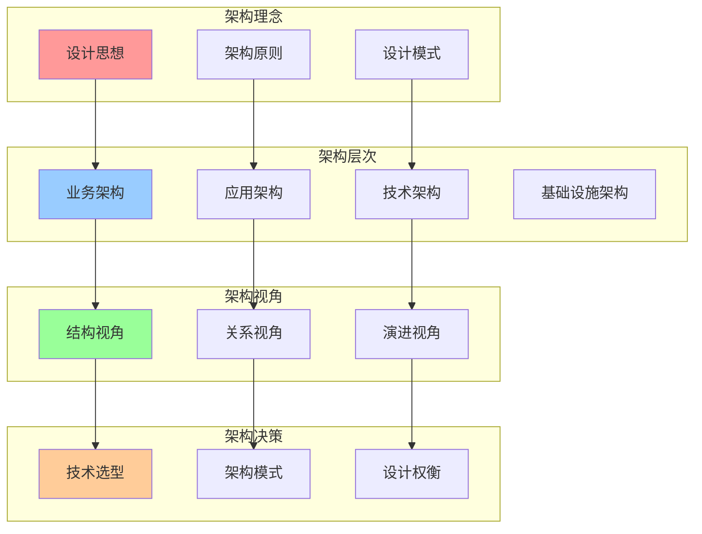
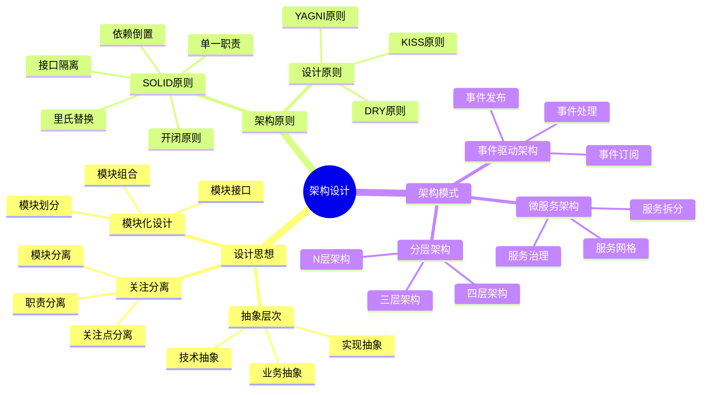
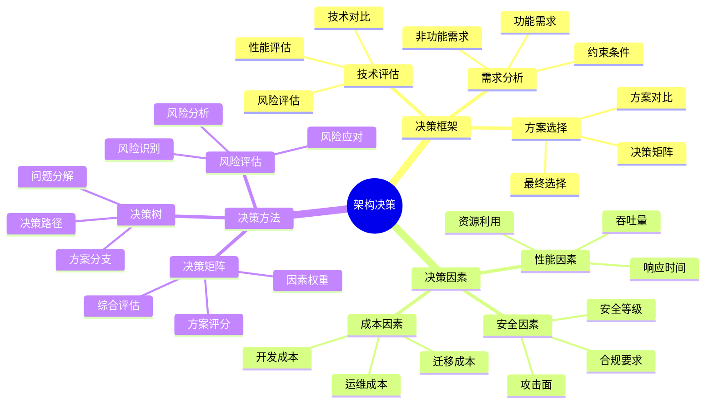
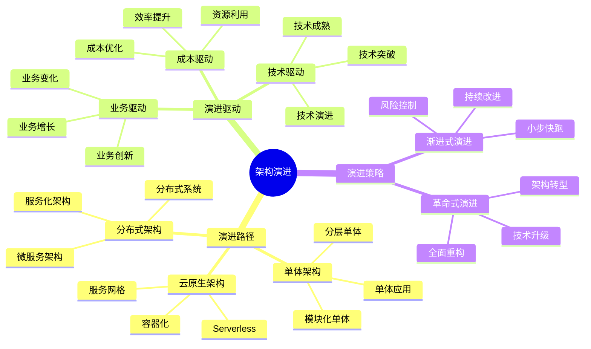

# 架构认知地图

## 📑 目录

- [架构认知地图](#架构认知地图)
  - [📑 目录](#-目录)
  - [1 架构认知全景](#1-架构认知全景)
  - [2 架构设计思维导图](#2-架构设计思维导图)
  - [3 架构决策思维导图](#3-架构决策思维导图)
  - [4 架构演进思维导图](#4-架构演进思维导图)
  - [5 使用指南](#5-使用指南)
    - [5.1 快速开始](#51-快速开始)
    - [5.2 架构设计应用](#52-架构设计应用)
    - [5.3 架构演进应用](#53-架构演进应用)
  - [6 使用技巧](#6-使用技巧)
    - [6.1 架构设计技巧](#61-架构设计技巧)
    - [6.2 架构决策技巧](#62-架构决策技巧)
  - [7 相关文档](#7-相关文档)

---

## 1 架构认知全景

---

## 2 架构设计思维导图

---

## 3 架构决策思维导图

---

## 4 架构演进思维导图

---

## 5 使用指南

### 5.1 快速开始

**适用场景**：架构设计入门、快速了解架构理念

**使用步骤**：

1. **理解架构理念**：从"架构理念"部分开始，理解设计思想、架构原则、设计模式
2. **掌握架构层次**：理解业务架构、应用架构、技术架构、基础设施架构的层次关系
3. **应用架构视角**：从结构视角、关系视角、演进视角分析架构
4. **进行架构决策**：使用架构决策框架进行技术选型、架构模式选择和设计权衡

**推荐度**：⭐⭐⭐⭐⭐

---

### 5.2 架构设计应用

**适用场景**：实际架构设计项目

**使用步骤**：

1. **需求分析**：分析业务需求、功能需求、非功能需求
2. **架构层次设计**：按照业务架构、应用架构、技术架构、基础设施架构的层次进行设计
3. **架构模式选择**：根据需求选择合适的架构模式（分层架构、微服务架构、事件驱动架构等）
4. **架构评估**：使用架构决策框架评估架构方案

**推荐度**：⭐⭐⭐⭐⭐

---

### 5.3 架构演进应用

**适用场景**：架构演进和重构

**使用步骤**：

1. **现状分析**：分析当前架构的现状和问题
2. **演进路径规划**：根据演进路径（单体架构→分布式架构→云原生架构）规划演进路径
3. **演进策略选择**：选择渐进式演进或革命式演进策略
4. **演进实施**：按照演进策略实施架构演进

**推荐度**：⭐⭐⭐⭐⭐

---

## 6 使用技巧

### 6.1 架构设计技巧

**技巧1：层次化设计**

- 按照业务架构、应用架构、技术架构、基础设施架构的层次进行设计
- 确保各层次之间的清晰边界和接口定义
- 避免层次之间的紧耦合

**技巧2：关注分离**

- 将不同的关注点分离到不同的层次或模块
- 确保每个层次或模块有明确的职责
- 避免职责重叠和混乱

**技巧3：模式应用**

- 根据需求选择合适的架构模式
- 理解架构模式的适用场景和约束条件
- 避免过度设计和不必要的复杂性

**推荐度**：⭐⭐⭐⭐⭐

---

### 6.2 架构决策技巧

**技巧1：多因素评估**

- 综合考虑性能、安全、成本等多个因素
- 使用决策矩阵进行多因素评估
- 避免单一因素决策

**技巧2：风险评估**

- 识别架构决策中的风险
- 评估风险的影响和概率
- 制定风险应对策略

**技巧3：持续优化**

- 根据实际运行情况持续优化架构
- 建立架构评估和反馈机制
- 避免架构僵化和技术债务积累

**推荐度**：⭐⭐⭐⭐⭐

---

## 7 相关文档

- **[架构模式对比矩阵](03-architecture-patterns-matrix.md)** - 架构模式功能、适用场景、复杂度对比
- **[架构模式详细思维导图](04-architecture-patterns-detailed.md)** - 单体架构、微服务架构、Serverless架构详解
- **[架构演进路径图](06-architecture-evolution-path.md)** - 架构演进全景、演进路径、演进策略
- **[架构决策完整流程](08-architecture-decision-process.md)** - 架构决策全景流程、需求分析流程、架构设计流程
- **[架构模式实践综合指南](09-architecture-patterns-practice-guide.md)** - 架构模式实践、最佳实践、案例分析

---

**最后更新**：2025-11-15
**文档状态**：✅ 完整 | 📊 包含架构认知地图、使用指南、使用技巧 | 🎯 生产就绪
**维护者**：项目团队
