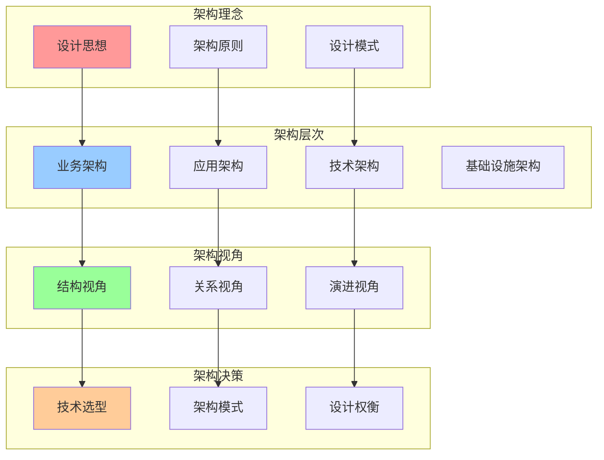
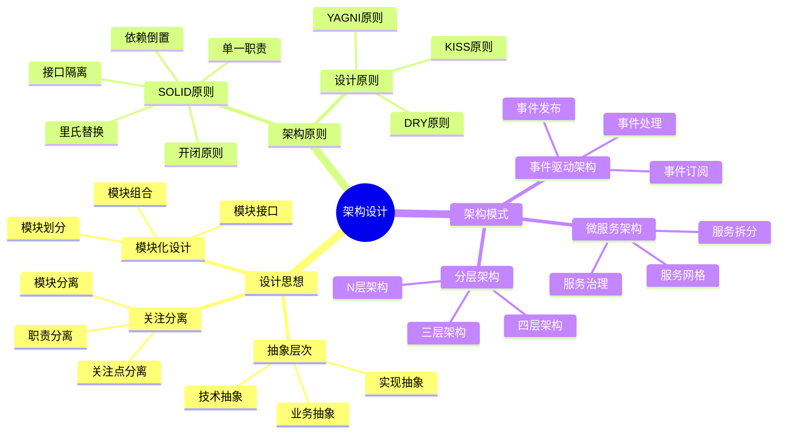
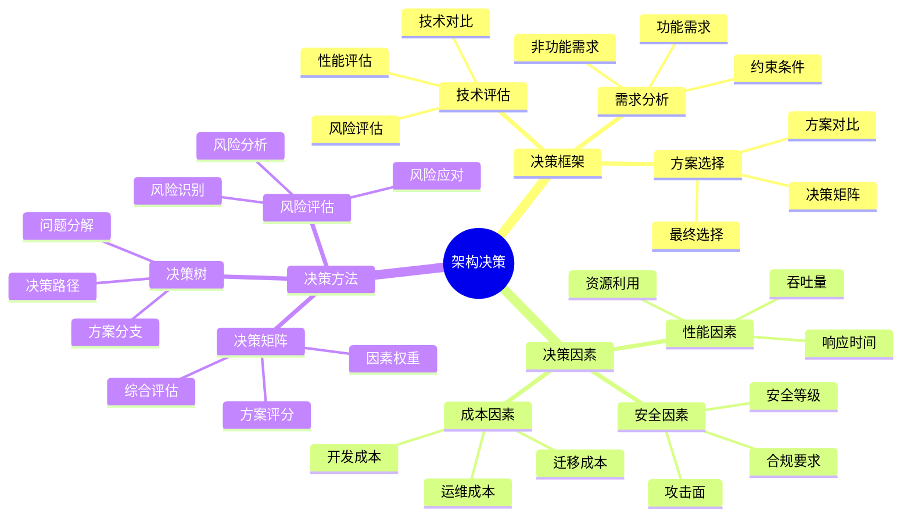
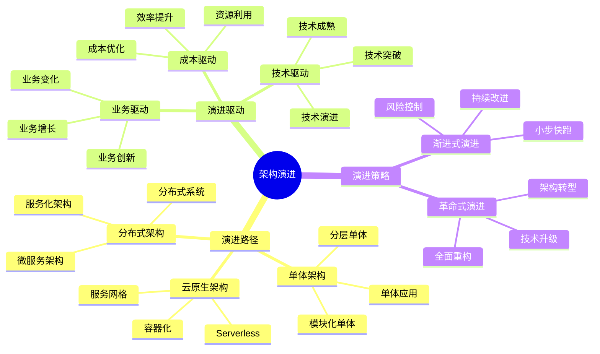

# 架构认知地图

## 📑 目录

- [架构认知地图](#架构认知地图)
  - [📑 目录](#-目录)
  - [1 架构认知全景](#1-架构认知全景)
  - [2 架构设计思维导图](#2-架构设计思维导图)
  - [3 架构决策思维导图](#3-架构决策思维导图)
  - [4 架构演进思维导图](#4-架构演进思维导图)

---

## 1 架构认知全景

---

## 2 架构设计思维导图

---

## 3 架构决策思维导图

---

## 4 架构演进思维导图

---

**最后更新**：2025-11-07
**文档状态**：✅ 完整 | 📊 包含架构认知地图 | 🎯 生产就绪
**维护者**：项目团队
