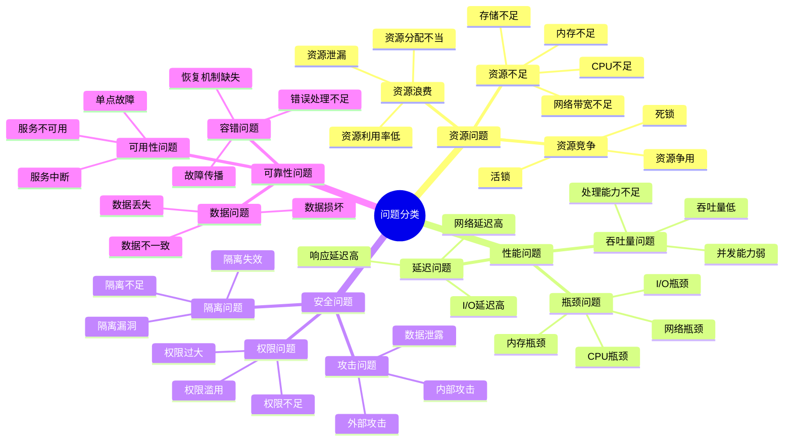
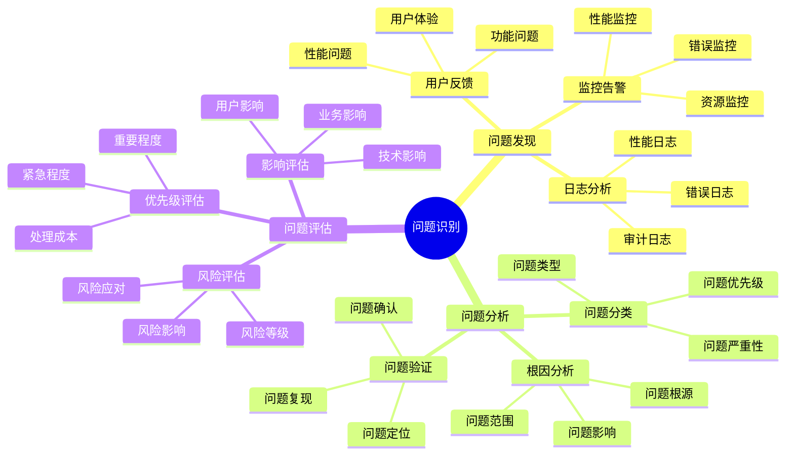
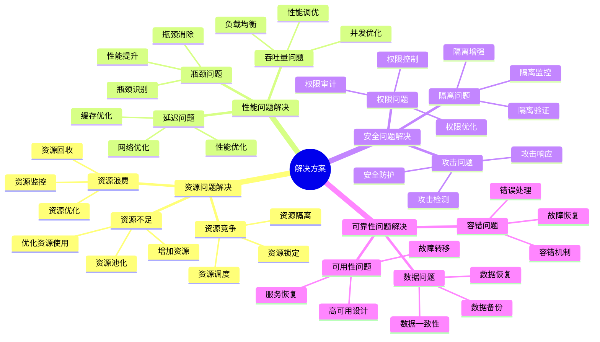
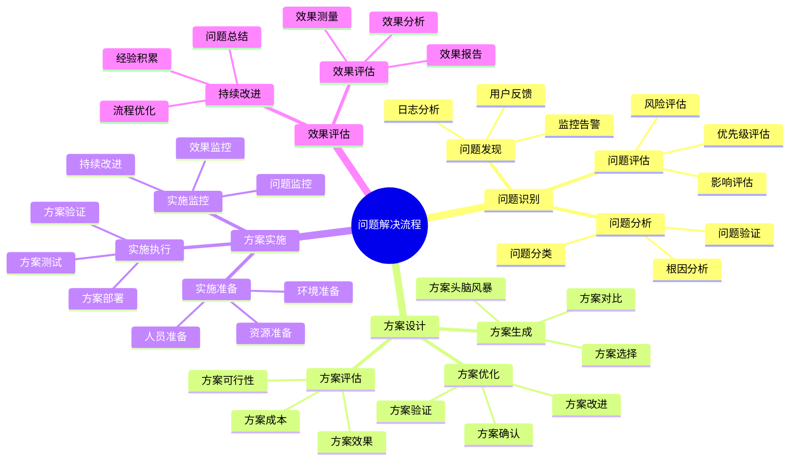

# 问题解决方案思维导图

## 📑 目录

- [问题解决方案思维导图](#问题解决方案思维导图)
  - [📑 目录](#-目录)
  - [1 问题分类全景](#1-问题分类全景)
  - [2 问题识别思维导图](#2-问题识别思维导图)
  - [3 解决方案思维导图](#3-解决方案思维导图)
  - [4 问题解决流程思维导图](#4-问题解决流程思维导图)
  - [5 使用指南](#5-使用指南)
    - [5.1 快速开始](#51-快速开始)
    - [5.2 问题解决应用](#52-问题解决应用)
    - [5.3 问题预防应用](#53-问题预防应用)
  - [6 使用技巧](#6-使用技巧)
    - [6.1 问题识别技巧](#61-问题识别技巧)
    - [6.2 解决方案技巧](#62-解决方案技巧)
  - [7 相关文档](#7-相关文档)
  - [2025 年最新实践](#2025-年最新实践)
    - [问题解决方案思维导图应用指南（2025）](#问题解决方案思维导图应用指南2025)
  - [实际应用案例](#实际应用案例)
    - [案例 1：问题解决方案思维导图应用（2025）](#案例-1问题解决方案思维导图应用2025)

---

## 1 问题分类全景



---

## 2 问题识别思维导图



---

## 3 解决方案思维导图



---

## 4 问题解决流程思维导图



---

## 5 使用指南

### 5.1 快速开始

**适用场景**：问题解决入门、快速了解问题分类

**使用步骤**：

1. **问题分类**：根据问题类型（资源问题、性能问题、安全问题、可靠性问题）进行分类
2. **问题识别**：使用问题识别方法（监控告警、用户反馈、日志分析）识别问题
3. **问题分析**：进行问题分类、根因分析、问题验证
4. **解决方案**：根据问题类型选择合适的解决方案

**推荐度**：⭐⭐⭐⭐⭐

---

### 5.2 问题解决应用

**适用场景**：实际项目中的问题解决

**使用步骤**：

1. **问题发现**：通过监控告警、用户反馈、日志分析发现问题
2. **问题分析**：进行问题分类、根因分析、问题验证
3. **问题评估**：评估问题的影响、优先级、风险
4. **方案设计**：设计解决方案，包括方案生成、方案评估、方案优化
5. **方案实施**：实施解决方案，包括实施准备、实施执行、实施监控
6. **效果评估**：评估解决方案的效果，进行持续改进

**推荐度**：⭐⭐⭐⭐⭐

---

### 5.3 问题预防应用

**适用场景**：问题预防和持续改进

**使用步骤**：

1. **问题总结**：总结已发生问题的经验和教训
2. **预防措施**：制定问题预防措施和监控策略
3. **持续监控**：建立持续监控和告警机制
4. **持续改进**：根据问题总结持续改进系统

**推荐度**：⭐⭐⭐⭐⭐

---

## 6 使用技巧

### 6.1 问题识别技巧

**技巧1：多源信息**

- 结合监控告警、用户反馈、日志分析等多种信息源
- 避免单一信息源的局限性
- 建立综合问题识别机制

**技巧2：根因分析**

- 深入分析问题的根本原因
- 避免只解决表面问题
- 使用5Why方法进行根因分析

**技巧3：问题验证**

- 验证问题的真实性和严重性
- 避免误报和过度反应
- 建立问题验证机制

**推荐度**：⭐⭐⭐⭐⭐

---

### 6.2 解决方案技巧

**技巧1：方案对比**

- 对比多个解决方案的优缺点
- 使用决策矩阵进行方案评估
- 选择最适合的解决方案

**技巧2：渐进实施**

- 采用渐进式实施策略
- 先小范围验证，再全面推广
- 降低实施风险

**技巧3：效果监控**

- 持续监控解决方案的效果
- 及时调整和优化方案
- 建立反馈机制

**推荐度**：⭐⭐⭐⭐⭐

---

## 7 相关文档

- **[问题解决详细指南](05-problem-solving-detailed.md)** - 问题分类详解、问题诊断详解、解决方案详解
- **[故障排查综合指南](07-troubleshooting-comprehensive-guide.md)** - 故障排查全景、故障分类、故障诊断、故障恢复
- **[架构决策完整流程](08-architecture-decision-process.md)** - 架构决策全景流程、需求分析流程、架构设计流程

---

## 2025 年最新实践

### 问题解决方案思维导图应用指南（2025）

**2025 年趋势**：问题解决方案思维导图在问题识别、解决方案设计、问题预防中的深度应用

**实践要点**：

- **问题识别**：使用思维导图识别问题
- **方案设计**：基于思维导图设计解决方案
- **问题预防**：使用思维导图预防问题

**代码示例**：

```python
# 2025 年问题解决方案思维导图工具
class ProblemSolutionMindmapTool:
    def __init__(self):
        self.identifier = ProblemIdentifier()
        self.designer = SolutionDesigner()
        self.preventer = ProblemPreventer()

    def identify_problem(self, symptoms, context):
        """问题识别"""
        return self.identifier.identify(symptoms, context)

    def design_solution(self, problem, constraints):
        """方案设计"""
        return self.designer.design(problem, constraints)

    def prevent_problem(self, solution, risks):
        """问题预防"""
        return self.preventer.prevent(solution, risks)
```

## 实际应用案例

### 案例 1：问题解决方案思维导图应用（2025）

**场景**：使用思维导图解决性能问题

**实现方案**：

```python
# 问题解决方案思维导图应用
tool = ProblemSolutionMindmapTool()

# 问题识别
symptoms = [Symptom(type="..."), ...]
context = Context(environment="...", system="...")
problem = tool.identify_problem(symptoms, context)

# 方案设计
constraints = [Constraint(type="..."), ...]
solution = tool.design_solution(problem, constraints)

# 问题预防
risks = [Risk(type="..."), ...]
prevention = tool.prevent_problem(solution, risks)
```

**效果**：

- 问题识别：系统化识别问题，提高识别准确性
- 方案设计：基于思维导图设计方案，提高方案有效性
- 问题预防：使用思维导图预防问题，提高系统稳定性

---

**最后更新**：2025-11-15
**文档状态**：✅ 完整 | 📊 包含问题解决方案思维导图、使用指南、使用技巧 | 🎯 生产就绪
**维护者**：项目团队
