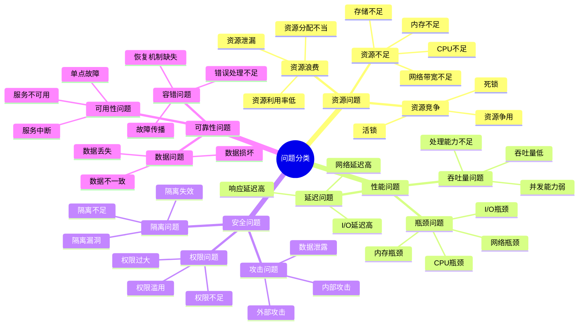
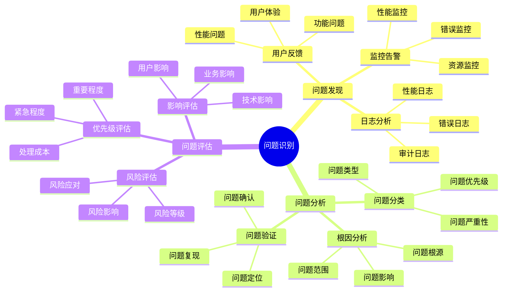
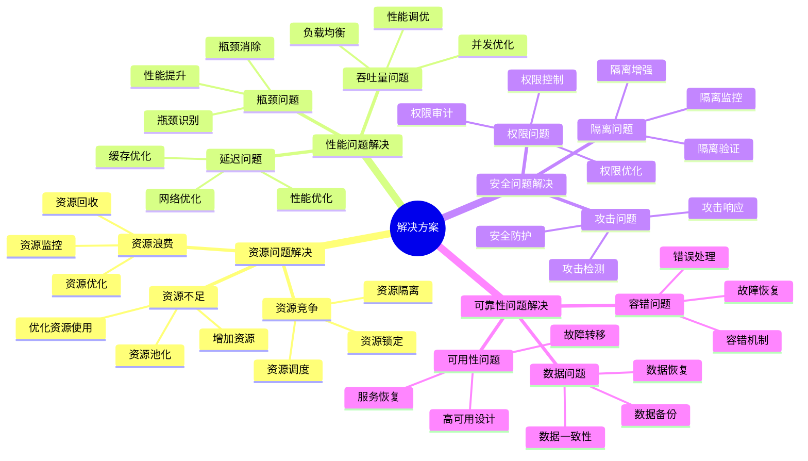
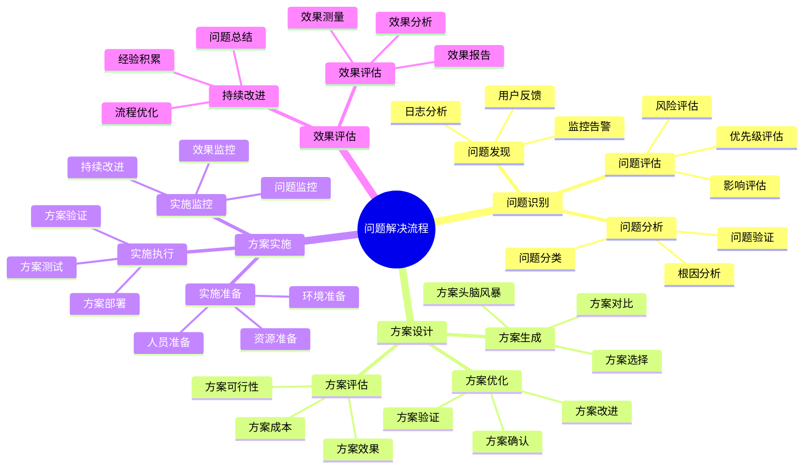

# 问题解决方案思维导图

## 📑 目录

- [问题解决方案思维导图](#问题解决方案思维导图)
  - [📑 目录](#-目录)
  - [1 问题分类全景](#1-问题分类全景)
  - [2 问题识别思维导图](#2-问题识别思维导图)
  - [3 解决方案思维导图](#3-解决方案思维导图)
  - [4 问题解决流程思维导图](#4-问题解决流程思维导图)

---

## 1 问题分类全景

---

## 2 问题识别思维导图

---

## 3 解决方案思维导图

---

## 4 问题解决流程思维导图

---

**最后更新**：2025-11-07
**文档状态**：✅ 完整 | 📊 包含问题解决方案思维导图 | 🎯 生产就绪
**维护者**：项目团队
