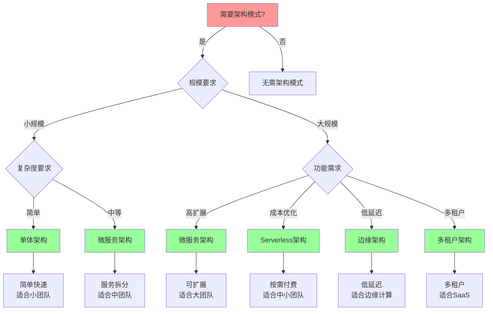

# 架构模式对比矩阵

## 📑 目录

- [架构模式对比矩阵](#架构模式对比矩阵)
  - [📑 目录](#-目录)
  - [1 架构模式功能矩阵](#1-架构模式功能矩阵)
  - [2 架构模式适用场景矩阵](#2-架构模式适用场景矩阵)
  - [3 架构模式复杂度矩阵](#3-架构模式复杂度矩阵)
  - [4 架构模式演进矩阵](#4-架构模式演进矩阵)

---

## 1 架构模式功能矩阵

| 架构模式 | 核心功能 | 技术栈 | 适用规模 | 优势 | 劣势 | 推荐度 |
|---------|---------|--------|---------|------|------|--------|
| **单体架构** | 单一应用 | 传统技术栈 | 小规模 | 简单、易开发 | 难以扩展 | ⭐⭐⭐ |
| **微服务架构** | 服务拆分 | 容器化+服务网格 | 中大规模 | 可扩展、独立部署 | 复杂度高 | ⭐⭐⭐⭐⭐ |
| **Serverless架构** | 函数即服务 | 沙盒化+事件驱动 | 中小规模 | 按需付费、自动扩展 | 冷启动、调试困难 | ⭐⭐⭐⭐⭐ |
| **边缘架构** | 边缘计算 | 轻量级容器+WASM | 分布式 | 低延迟、离线运行 | 资源受限 | ⭐⭐⭐⭐ |
| **混合云架构** | 混合部署 | 虚拟化+容器化 | 大规模 | 灵活性高、成本优化 | 管理复杂 | ⭐⭐⭐⭐ |
| **多租户架构** | 多租户隔离 | 虚拟化+容器化 | 大规模 | 资源利用率高 | 隔离复杂 | ⭐⭐⭐⭐⭐ |

**推荐度说明**：
- **⭐⭐⭐⭐⭐**：强烈推荐
- **⭐⭐⭐⭐**：推荐
- **⭐⭐⭐**：可选

---

## 2 架构模式适用场景矩阵

| 场景 | 推荐架构 | 技术选择 | 理由 | 认知模型 | 效果 | 推荐度 |
|------|---------|---------|------|---------|------|--------|
| **快速开发** | 单体架构 | 传统技术栈 | 简单快速 | 架构决策框架 | 中 | ⭐⭐⭐ |
| **微服务** | 微服务架构 | 容器化+服务网格 | 服务拆分、独立部署 | 架构决策框架 | 高 | ⭐⭐⭐⭐⭐ |
| **Serverless** | Serverless架构 | 沙盒化+事件驱动 | 按需付费、自动扩展 | 架构决策框架 | 高 | ⭐⭐⭐⭐⭐ |
| **边缘计算** | 边缘架构 | 轻量级容器+WASM | 低延迟、离线运行 | 架构决策框架 | 高 | ⭐⭐⭐⭐ |
| **混合云** | 混合云架构 | 虚拟化+容器化 | 灵活性高、成本优化 | 架构决策框架 | 高 | ⭐⭐⭐⭐ |
| **多租户SaaS** | 多租户架构 | 虚拟化+容器化 | 资源利用率高 | 隔离模型 | 高 | ⭐⭐⭐⭐⭐ |

**推荐度说明**：
- **⭐⭐⭐⭐⭐**：强烈推荐
- **⭐⭐⭐⭐**：推荐
- **⭐⭐⭐**：可选

---

## 3 架构模式复杂度矩阵

| 架构模式 | 开发复杂度 | 运维复杂度 | 管理复杂度 | 学习曲线 | 团队要求 | 推荐度 |
|---------|-----------|-----------|-----------|---------|---------|--------|
| **单体架构** | 低 | 低 | 低 | 低 | 小团队 | ⭐⭐⭐ |
| **微服务架构** | 高 | 高 | 高 | 高 | 大团队 | ⭐⭐⭐⭐⭐ |
| **Serverless架构** | 中 | 低 | 中 | 中 | 中小团队 | ⭐⭐⭐⭐⭐ |
| **边缘架构** | 高 | 高 | 高 | 高 | 专业团队 | ⭐⭐⭐⭐ |
| **混合云架构** | 高 | 极高 | 极高 | 高 | 大团队 | ⭐⭐⭐⭐ |
| **多租户架构** | 极高 | 高 | 高 | 高 | 大团队 | ⭐⭐⭐⭐⭐ |

**推荐度说明**：
- **⭐⭐⭐⭐⭐**：强烈推荐
- **⭐⭐⭐⭐**：推荐
- **⭐⭐⭐**：可选

---

## 4 架构模式演进矩阵

| 演进路径 | 起点 | 终点 | 演进驱动 | 演进成本 | 演进收益 | 推荐度 |
|---------|------|------|---------|---------|---------|--------|
| **单体 → 微服务** | 单体架构 | 微服务架构 | 扩展需求 | 高 | 高 | ⭐⭐⭐⭐⭐ |
| **微服务 → Serverless** | 微服务架构 | Serverless架构 | 成本优化 | 中 | 高 | ⭐⭐⭐⭐ |
| **传统 → 云原生** | 传统架构 | 云原生架构 | 云原生需求 | 高 | 极高 | ⭐⭐⭐⭐⭐ |
| **中心化 → 边缘** | 中心化架构 | 边缘架构 | 低延迟需求 | 高 | 高 | ⭐⭐⭐⭐ |
| **单云 → 混合云** | 单云架构 | 混合云架构 | 灵活性需求 | 高 | 高 | ⭐⭐⭐⭐ |
| **单租户 → 多租户** | 单租户架构 | 多租户架构 | 资源优化 | 极高 | 高 | ⭐⭐⭐⭐⭐ |

**推荐度说明**：
- **⭐⭐⭐⭐⭐**：强烈推荐
- **⭐⭐⭐⭐**：推荐
- **⭐⭐⭐**：可选

---

## 5 架构模式选择决策树

---

**最后更新**：2025-11-07
**文档状态**：✅ 完整 | 📊 包含架构模式对比矩阵 | 🎯 生产就绪
**维护者**：项目团队
