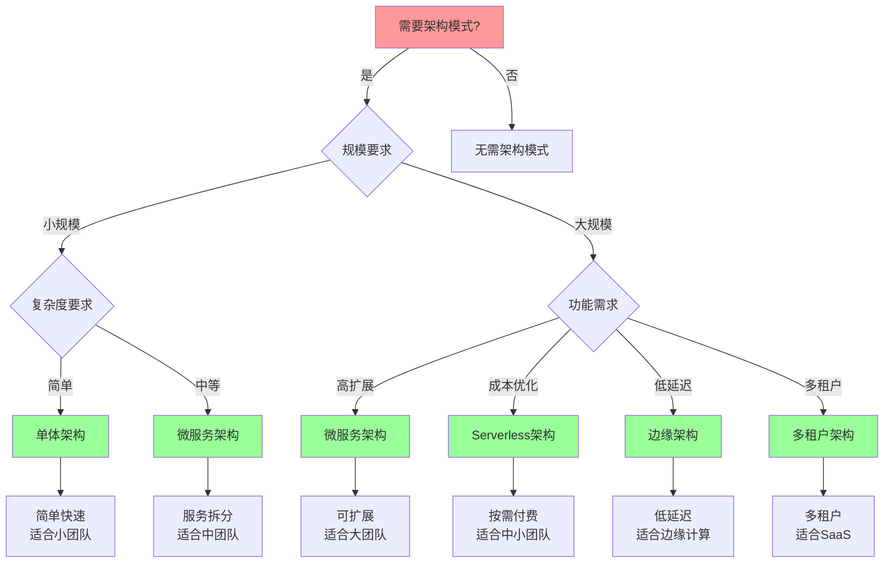

# 架构模式对比矩阵

## 📑 目录

- [架构模式对比矩阵](#架构模式对比矩阵)
  - [📑 目录](#-目录)
  - [1 架构模式功能矩阵](#1-架构模式功能矩阵)
  - [2 架构模式适用场景矩阵](#2-架构模式适用场景矩阵)
  - [3 架构模式复杂度矩阵](#3-架构模式复杂度矩阵)
  - [4 架构模式演进矩阵](#4-架构模式演进矩阵)
  - [5 架构模式选择决策树](#5-架构模式选择决策树)
  - [6 使用指南](#6-使用指南)
    - [6.1 快速开始](#61-快速开始)
    - [6.2 架构模式选择应用](#62-架构模式选择应用)
    - [6.3 架构演进应用](#63-架构演进应用)
  - [7 使用技巧](#7-使用技巧)
    - [7.1 架构模式选择技巧](#71-架构模式选择技巧)
  - [8 实践案例](#8-实践案例)
    - [8.1 微服务架构选择案例](#81-微服务架构选择案例)
    - [8.2 Serverless架构选择案例](#82-serverless架构选择案例)
  - [9 相关文档](#9-相关文档)

---

## 1 架构模式功能矩阵

| 架构模式 | 核心功能 | 技术栈 | 适用规模 | 优势 | 劣势 | 推荐度 |
|---------|---------|--------|---------|------|------|--------|
| **单体架构** | 单一应用 | 传统技术栈 | 小规模 | 简单、易开发 | 难以扩展 | ⭐⭐⭐ |
| **微服务架构** | 服务拆分 | 容器化+服务网格 | 中大规模 | 可扩展、独立部署 | 复杂度高 | ⭐⭐⭐⭐⭐ |
| **Serverless架构** | 函数即服务 | 沙盒化+事件驱动 | 中小规模 | 按需付费、自动扩展 | 冷启动、调试困难 | ⭐⭐⭐⭐⭐ |
| **边缘架构** | 边缘计算 | 轻量级容器+WASM | 分布式 | 低延迟、离线运行 | 资源受限 | ⭐⭐⭐⭐ |
| **混合云架构** | 混合部署 | 虚拟化+容器化 | 大规模 | 灵活性高、成本优化 | 管理复杂 | ⭐⭐⭐⭐ |
| **多租户架构** | 多租户隔离 | 虚拟化+容器化 | 大规模 | 资源利用率高 | 隔离复杂 | ⭐⭐⭐⭐⭐ |

**推荐度说明**：

- **⭐⭐⭐⭐⭐**：强烈推荐
- **⭐⭐⭐⭐**：推荐
- **⭐⭐⭐**：可选

---

## 2 架构模式适用场景矩阵

| 场景 | 推荐架构 | 技术选择 | 理由 | 认知模型 | 效果 | 推荐度 |
|------|---------|---------|------|---------|------|--------|
| **快速开发** | 单体架构 | 传统技术栈 | 简单快速 | 架构决策框架 | 中 | ⭐⭐⭐ |
| **微服务** | 微服务架构 | 容器化+服务网格 | 服务拆分、独立部署 | 架构决策框架 | 高 | ⭐⭐⭐⭐⭐ |
| **Serverless** | Serverless架构 | 沙盒化+事件驱动 | 按需付费、自动扩展 | 架构决策框架 | 高 | ⭐⭐⭐⭐⭐ |
| **边缘计算** | 边缘架构 | 轻量级容器+WASM | 低延迟、离线运行 | 架构决策框架 | 高 | ⭐⭐⭐⭐ |
| **混合云** | 混合云架构 | 虚拟化+容器化 | 灵活性高、成本优化 | 架构决策框架 | 高 | ⭐⭐⭐⭐ |
| **多租户SaaS** | 多租户架构 | 虚拟化+容器化 | 资源利用率高 | 隔离模型 | 高 | ⭐⭐⭐⭐⭐ |

**推荐度说明**：

- **⭐⭐⭐⭐⭐**：强烈推荐
- **⭐⭐⭐⭐**：推荐
- **⭐⭐⭐**：可选

---

## 3 架构模式复杂度矩阵

| 架构模式 | 开发复杂度 | 运维复杂度 | 管理复杂度 | 学习曲线 | 团队要求 | 推荐度 |
|---------|-----------|-----------|-----------|---------|---------|--------|
| **单体架构** | 低 | 低 | 低 | 低 | 小团队 | ⭐⭐⭐ |
| **微服务架构** | 高 | 高 | 高 | 高 | 大团队 | ⭐⭐⭐⭐⭐ |
| **Serverless架构** | 中 | 低 | 中 | 中 | 中小团队 | ⭐⭐⭐⭐⭐ |
| **边缘架构** | 高 | 高 | 高 | 高 | 专业团队 | ⭐⭐⭐⭐ |
| **混合云架构** | 高 | 极高 | 极高 | 高 | 大团队 | ⭐⭐⭐⭐ |
| **多租户架构** | 极高 | 高 | 高 | 高 | 大团队 | ⭐⭐⭐⭐⭐ |

**推荐度说明**：

- **⭐⭐⭐⭐⭐**：强烈推荐
- **⭐⭐⭐⭐**：推荐
- **⭐⭐⭐**：可选

---

## 4 架构模式演进矩阵

| 演进路径 | 起点 | 终点 | 演进驱动 | 演进成本 | 演进收益 | 推荐度 |
|---------|------|------|---------|---------|---------|--------|
| **单体 → 微服务** | 单体架构 | 微服务架构 | 扩展需求 | 高 | 高 | ⭐⭐⭐⭐⭐ |
| **微服务 → Serverless** | 微服务架构 | Serverless架构 | 成本优化 | 中 | 高 | ⭐⭐⭐⭐ |
| **传统 → 云原生** | 传统架构 | 云原生架构 | 云原生需求 | 高 | 极高 | ⭐⭐⭐⭐⭐ |
| **中心化 → 边缘** | 中心化架构 | 边缘架构 | 低延迟需求 | 高 | 高 | ⭐⭐⭐⭐ |
| **单云 → 混合云** | 单云架构 | 混合云架构 | 灵活性需求 | 高 | 高 | ⭐⭐⭐⭐ |
| **单租户 → 多租户** | 单租户架构 | 多租户架构 | 资源优化 | 极高 | 高 | ⭐⭐⭐⭐⭐ |

**推荐度说明**：

- **⭐⭐⭐⭐⭐**：强烈推荐
- **⭐⭐⭐⭐**：推荐
- **⭐⭐⭐**：可选

---

## 5 架构模式选择决策树

---

## 6 使用指南

### 6.1 快速开始

**适用场景**：架构模式选择、快速了解架构模式

**使用步骤**：

1. **需求分析**：分析业务需求、功能需求、非功能需求
2. **场景匹配**：根据应用场景在"架构模式适用场景矩阵"中查找匹配的架构模式
3. **复杂度评估**：在"架构模式复杂度矩阵"中评估所选架构模式的复杂度
4. **决策选择**：使用"架构模式选择决策树"进行最终选择

**推荐度**：⭐⭐⭐⭐⭐

---

### 6.2 架构模式选择应用

**适用场景**：实际项目中的架构模式选择

**使用步骤**：

1. **功能需求分析**：在"架构模式功能矩阵"中查找满足功能需求的架构模式
2. **场景匹配**：在"架构模式适用场景矩阵"中匹配应用场景
3. **复杂度评估**：评估团队能力和项目复杂度，选择合适的架构模式
4. **演进规划**：参考"架构模式演进矩阵"规划架构演进路径

**推荐度**：⭐⭐⭐⭐⭐

---

### 6.3 架构演进应用

**适用场景**：架构演进和重构

**使用步骤**：

1. **现状分析**：分析当前架构的现状和问题
2. **演进路径选择**：在"架构模式演进矩阵"中选择合适的演进路径
3. **演进成本评估**：评估演进成本和收益
4. **演进实施**：按照演进路径实施架构演进

**推荐度**：⭐⭐⭐⭐⭐

---

## 7 使用技巧

### 7.1 架构模式选择技巧

**技巧1：多因素综合考虑**

- 综合考虑功能需求、适用场景、复杂度等多个因素
- 避免单一因素决策
- 使用决策树进行结构化决策

**技巧2：演进路径规划**

- 考虑架构的演进路径，避免频繁重构
- 选择可演进的架构模式
- 规划长期架构演进策略

**技巧3：团队能力匹配**

- 根据团队能力选择合适的架构模式
- 避免选择超出团队能力的架构模式
- 提供必要的培训和支持

**推荐度**：⭐⭐⭐⭐⭐

---

## 8 实践案例

### 8.1 微服务架构选择案例

**场景**：电商平台需要支持高并发和快速扩展

**分析过程**：

1. **需求分析**：需要服务拆分、独立部署、高扩展性
2. **场景匹配**：匹配"微服务"场景，推荐微服务架构
3. **复杂度评估**：开发复杂度高、运维复杂度高，需要大团队
4. **决策选择**：选择微服务架构，使用容器化+服务网格技术栈

**效果**：成功实现服务拆分和独立部署，支持高并发和快速扩展

**推荐度**：⭐⭐⭐⭐⭐

---

### 8.2 Serverless架构选择案例

**场景**：创业公司需要快速开发，按需付费

**分析过程**：

1. **需求分析**：需要快速开发、按需付费、自动扩展
2. **场景匹配**：匹配"Serverless"场景，推荐Serverless架构
3. **复杂度评估**：开发复杂度中等、运维复杂度低，适合中小团队
4. **决策选择**：选择Serverless架构，使用沙盒化+事件驱动技术栈

**效果**：快速开发上线，按需付费降低成本，自动扩展支持业务增长

**推荐度**：⭐⭐⭐⭐⭐

---

## 9 相关文档

- **[架构认知地图](01-architecture-cognitive-map.md)** - 架构认知全景、架构设计、架构决策、架构演进
- **[架构模式详细思维导图](04-architecture-patterns-detailed.md)** - 单体架构详解、微服务架构详解、Serverless架构详解
- **[架构演进路径图](06-architecture-evolution-path.md)** - 架构演进全景、单体到微服务演进、微服务到Serverless演进
- **[架构决策完整流程](08-architecture-decision-process.md)** - 架构决策全景流程、需求分析流程、架构设计流程
- **[架构模式实践综合指南](09-architecture-patterns-practice-guide.md)** - 架构模式实践、最佳实践、案例分析

---

**最后更新**：2025-11-15
**文档状态**：✅ 完整 | 📊 包含架构模式对比矩阵、使用指南、使用技巧、实践案例 | 🎯 生产就绪
**维护者**：项目团队
