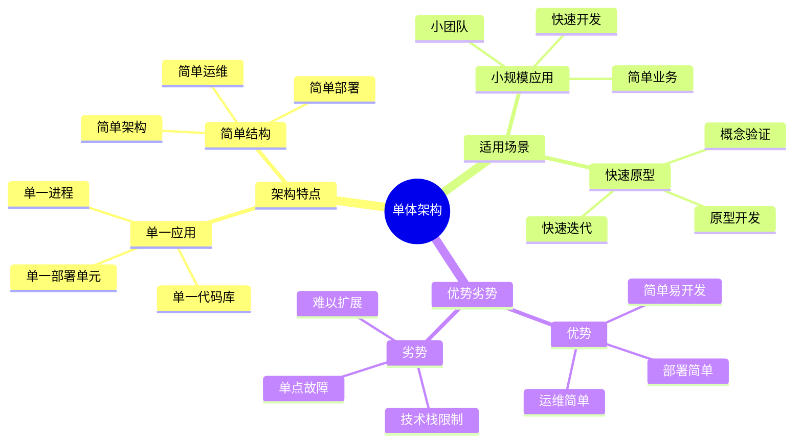
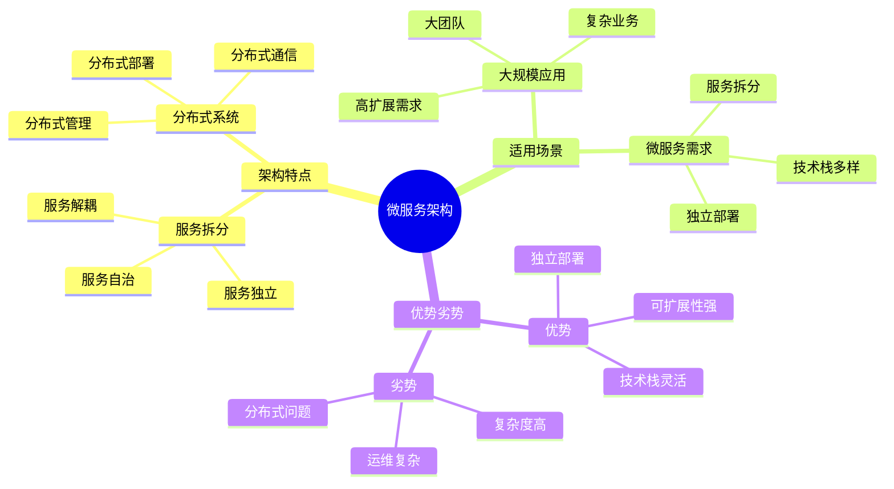
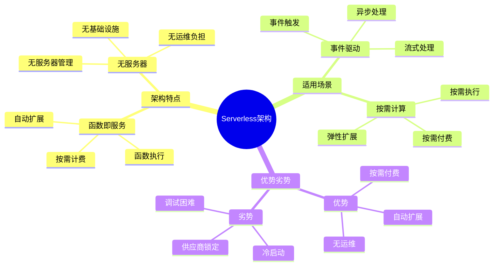
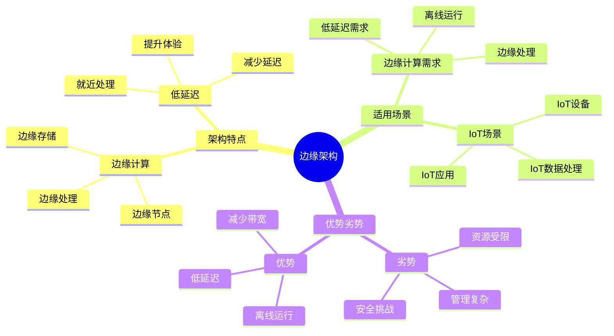

# 架构模式详细思维导图

## 📑 目录

- [架构模式详细思维导图](#架构模式详细思维导图)
  - [📑 目录](#-目录)
  - [1 单体架构详解](#1-单体架构详解)
  - [2 微服务架构详解](#2-微服务架构详解)
  - [3 Serverless架构详解](#3-serverless架构详解)
  - [4 边缘架构详解](#4-边缘架构详解)

---

## 1 单体架构详解

---

## 2 微服务架构详解

---

## 3 Serverless架构详解

---

## 4 边缘架构详解

---

## 5 架构模式选择决策矩阵

| 决策因素 | 单体架构 | 微服务架构 | Serverless架构 | 边缘架构 | 推荐度 |
|---------|---------|-----------|---------------|---------|--------|
| **团队规模** | 小团队 | 大团队 | 中小团队 | 专业团队 | ⭐⭐⭐⭐⭐ |
| **业务复杂度** | 简单 | 复杂 | 中等 | 中等 | ⭐⭐⭐⭐⭐ |
| **扩展需求** | 低 | 高 | 高 | 中 | ⭐⭐⭐⭐⭐ |
| **技术栈** | 单一 | 多样 | 多样 | 多样 | ⭐⭐⭐⭐ |
| **运维能力** | 低 | 高 | 低 | 高 | ⭐⭐⭐⭐ |
| **成本** | 低 | 高 | 中 | 中 | ⭐⭐⭐⭐ |

**推荐度说明**：
- **⭐⭐⭐⭐⭐**：强烈推荐
- **⭐⭐⭐⭐**：推荐
- **⭐⭐⭐**：可选

---

**最后更新**：2025-11-07
**文档状态**：✅ 完整 | 📊 包含架构模式详细思维导图 | 🎯 生产就绪
**维护者**：项目团队
