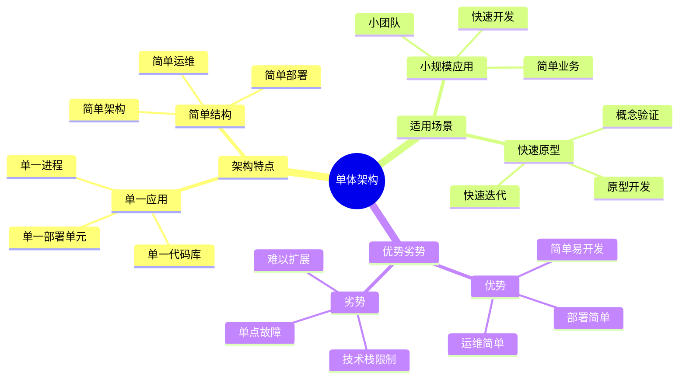
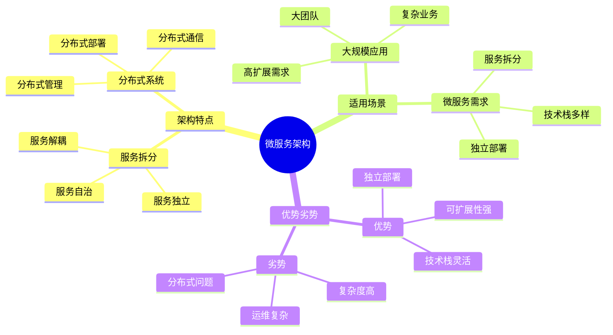
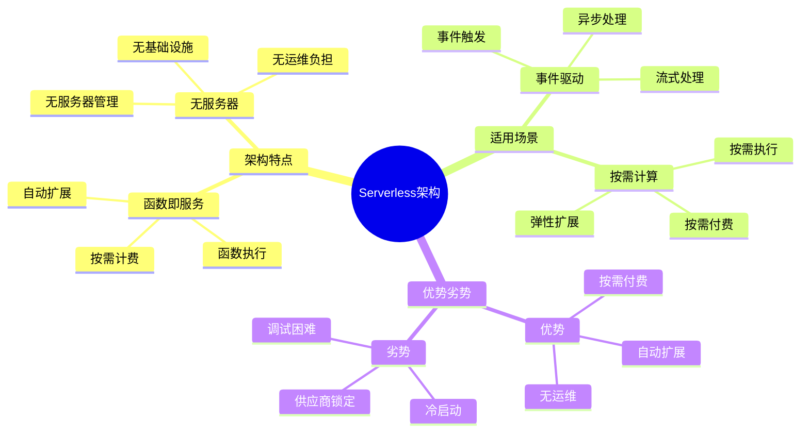
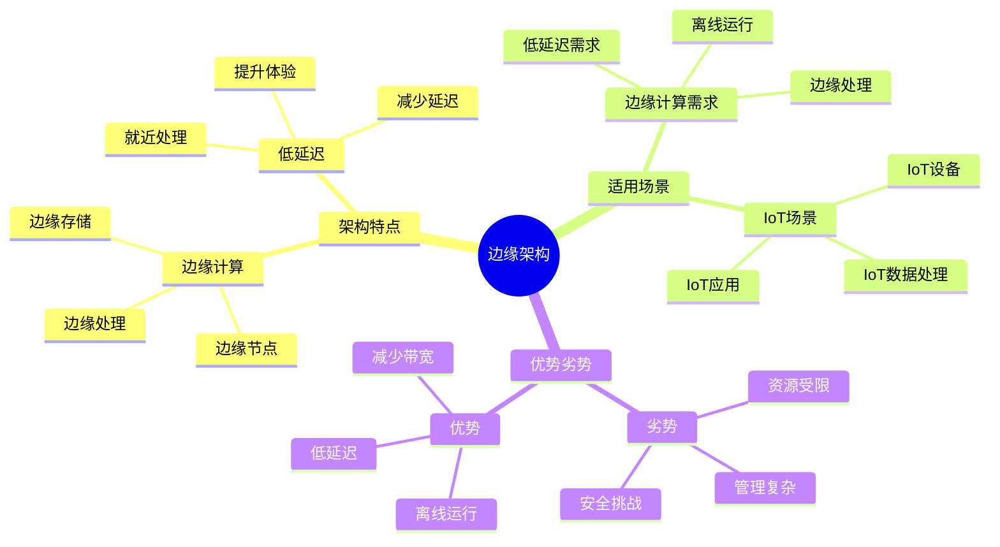

# 架构模式详细思维导图

## 📑 目录

- [架构模式详细思维导图](#架构模式详细思维导图)
  - [📑 目录](#-目录)
  - [1 单体架构详解](#1-单体架构详解)
  - [2 微服务架构详解](#2-微服务架构详解)
  - [3 Serverless架构详解](#3-serverless架构详解)
  - [4 边缘架构详解](#4-边缘架构详解)
  - [5 架构模式选择决策矩阵](#5-架构模式选择决策矩阵)
  - [6 使用指南](#6-使用指南)
    - [6.1 快速开始](#61-快速开始)
    - [6.2 架构模式选择应用](#62-架构模式选择应用)
    - [6.3 架构演进应用](#63-架构演进应用)
  - [7 使用技巧](#7-使用技巧)
    - [7.1 架构模式选择技巧](#71-架构模式选择技巧)
    - [7.2 架构设计技巧](#72-架构设计技巧)
  - [8 实践案例](#8-实践案例)
    - [8.1 微服务架构选择案例](#81-微服务架构选择案例)
    - [8.2 Serverless架构选择案例](#82-serverless架构选择案例)
  - [9 相关文档](#9-相关文档)

---

## 1 单体架构详解

---

## 2 微服务架构详解

---

## 3 Serverless架构详解

---

## 4 边缘架构详解

---

## 5 架构模式选择决策矩阵

| 决策因素 | 单体架构 | 微服务架构 | Serverless架构 | 边缘架构 | 推荐度 |
|---------|---------|-----------|---------------|---------|--------|
| **团队规模** | 小团队 | 大团队 | 中小团队 | 专业团队 | ⭐⭐⭐⭐⭐ |
| **业务复杂度** | 简单 | 复杂 | 中等 | 中等 | ⭐⭐⭐⭐⭐ |
| **扩展需求** | 低 | 高 | 高 | 中 | ⭐⭐⭐⭐⭐ |
| **技术栈** | 单一 | 多样 | 多样 | 多样 | ⭐⭐⭐⭐ |
| **运维能力** | 低 | 高 | 低 | 高 | ⭐⭐⭐⭐ |
| **成本** | 低 | 高 | 中 | 中 | ⭐⭐⭐⭐ |

**推荐度说明**：

- **⭐⭐⭐⭐⭐**：强烈推荐
- **⭐⭐⭐⭐**：推荐
- **⭐⭐⭐**：可选

---

## 6 使用指南

### 6.1 快速开始

**适用场景**：架构模式选择、架构设计

**使用步骤**：

1. **理解架构模式**：理解各种架构模式的特点、适用场景、优势劣势
2. **场景匹配**：根据应用场景匹配合适的架构模式
3. **决策选择**：使用决策矩阵选择最适合的架构模式
4. **架构设计**：根据选择的架构模式进行架构设计

**推荐度**：⭐⭐⭐⭐⭐

---

### 6.2 架构模式选择应用

**适用场景**：实际项目中的架构模式选择

**使用步骤**：

1. **需求分析**：分析业务需求、功能需求、非功能需求
2. **场景识别**：识别应用场景（小规模、大规模、高扩展、成本优化等）
3. **模式匹配**：在架构模式中匹配合适的模式
4. **决策评估**：使用决策矩阵评估各模式的适用性
5. **模式选择**：选择最适合的架构模式

**推荐度**：⭐⭐⭐⭐⭐

---

### 6.3 架构演进应用

**适用场景**：架构演进和重构

**使用步骤**：

1. **现状分析**：分析当前架构的现状和问题
2. **目标架构**：确定目标架构模式
3. **演进路径**：规划架构演进路径
4. **演进实施**：按照演进路径实施架构演进

**推荐度**：⭐⭐⭐⭐⭐

---

## 7 使用技巧

### 7.1 架构模式选择技巧

**技巧1：多因素综合考虑**

- 综合考虑团队规模、业务复杂度、扩展需求等多个因素
- 避免单一因素决策
- 使用决策矩阵进行结构化决策

**技巧2：演进路径规划**

- 考虑架构的演进路径，避免频繁重构
- 选择可演进的架构模式
- 规划长期架构演进策略

**推荐度**：⭐⭐⭐⭐⭐

---

### 7.2 架构设计技巧

**技巧1：模式组合**

- 根据实际需求组合使用多个架构模式
- 理解模式之间的关系
- 避免模式冲突

**技巧2：渐进演进**

- 采用渐进式演进策略
- 先小范围验证，再全面推广
- 降低演进风险

**推荐度**：⭐⭐⭐⭐⭐

---

## 8 实践案例

### 8.1 微服务架构选择案例

**场景**：电商平台需要支持高并发和快速扩展

**分析过程**：

1. **需求分析**：
   - 业务复杂度：高（多业务模块）
   - 扩展需求：高（需要快速扩展）
   - 团队规模：大（多个开发团队）

2. **场景匹配**：匹配"大规模应用"场景，推荐微服务架构

3. **决策评估**：
   - 团队规模：大团队 ✓
   - 业务复杂度：复杂 ✓
   - 扩展需求：高 ✓

4. **模式选择**：选择微服务架构

**效果**：成功实现微服务架构，支持高并发和快速扩展

**推荐度**：⭐⭐⭐⭐⭐

---

### 8.2 Serverless架构选择案例

**场景**：创业公司需要快速开发，按需付费

**分析过程**：

1. **需求分析**：
   - 业务复杂度：中等（业务相对简单）
   - 扩展需求：高（需要自动扩展）
   - 团队规模：中小团队
   - 成本要求：按需付费

2. **场景匹配**：匹配"快速开发、按需付费"场景，推荐Serverless架构

3. **决策评估**：
   - 团队规模：中小团队 ✓
   - 业务复杂度：中等 ✓
   - 扩展需求：高 ✓
   - 成本要求：按需付费 ✓

4. **模式选择**：选择Serverless架构

**效果**：快速开发上线，按需付费降低成本，自动扩展支持业务增长

**推荐度**：⭐⭐⭐⭐⭐

---

## 9 相关文档

- **[架构认知地图](01-architecture-cognitive-map.md)** - 架构认知全景、架构设计、架构决策、架构演进
- **[架构模式对比矩阵](03-architecture-patterns-matrix.md)** - 架构模式功能、适用场景、复杂度、演进路径
- **[架构演进路径图](06-architecture-evolution-path.md)** - 架构演进全景、单体到微服务演进、微服务到Serverless演进
- **[架构决策完整流程](08-architecture-decision-process.md)** - 架构决策全景流程、需求分析流程、架构设计流程
- **[架构模式实践综合指南](09-architecture-patterns-practice-guide.md)** - 架构模式实践、最佳实践、案例分析

---

**最后更新**：2025-11-15
**文档状态**：✅ 完整 | 📊 包含架构模式详细思维导图、使用指南、使用技巧、实践案例 | 🎯 生产就绪
**维护者**：项目团队
