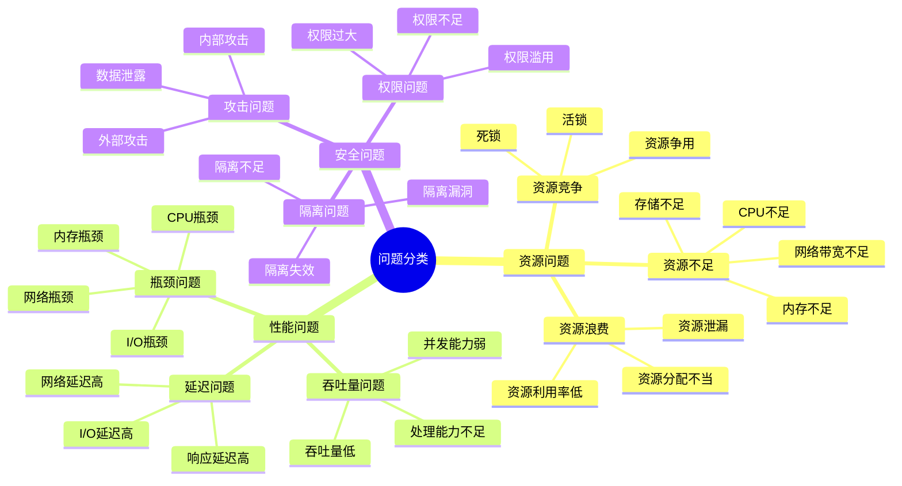
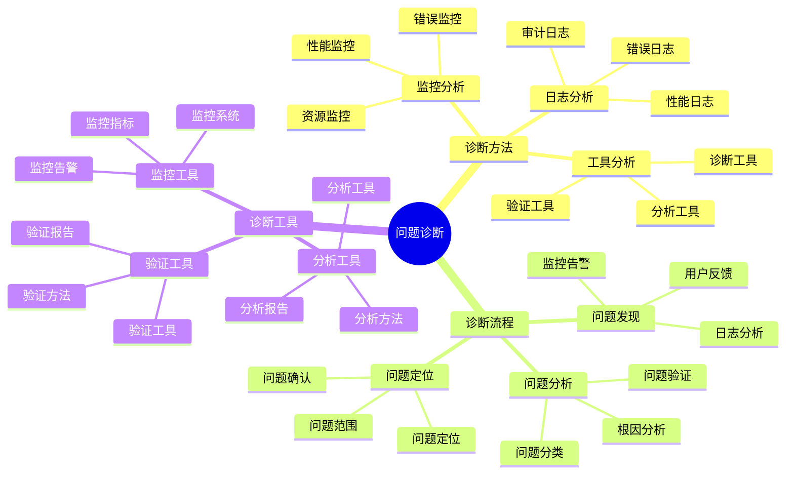
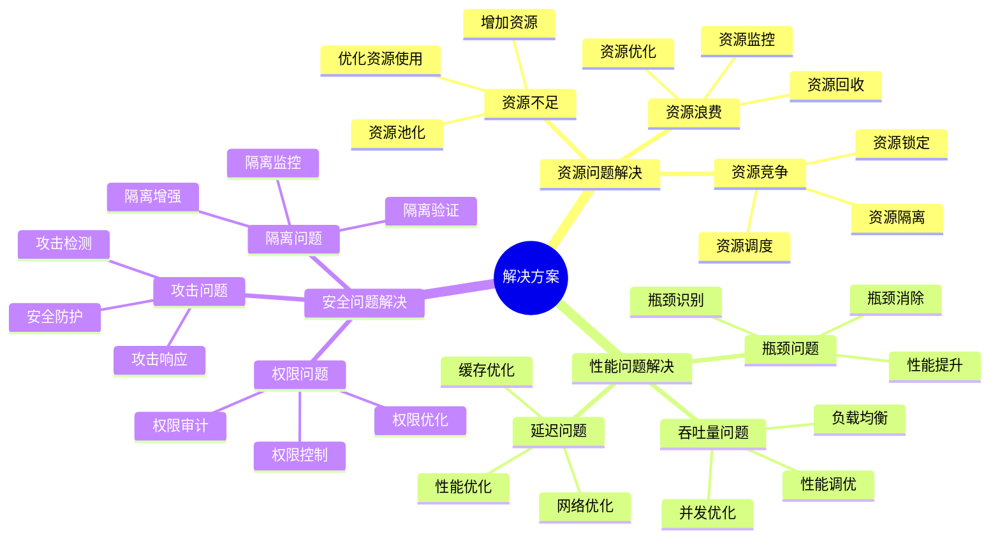
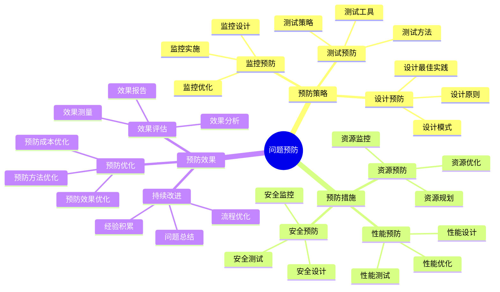

# 问题解决详细指南

## 📑 目录

- [问题解决详细指南](#问题解决详细指南)
  - [📑 目录](#-目录)
  - [1 问题分类详解](#1-问题分类详解)
  - [2 问题诊断详解](#2-问题诊断详解)
  - [3 解决方案详解](#3-解决方案详解)
  - [4 问题预防详解](#4-问题预防详解)

---

## 1 问题分类详解

---

## 2 问题诊断详解

---

## 3 解决方案详解

---

## 4 问题预防详解

---

## 5 问题解决检查清单

| 检查项 | 检查内容 | 重要性 | 推荐度 |
|--------|---------|--------|--------|
| **问题发现** | 监控告警、用户反馈、日志分析 | 极高 | ⭐⭐⭐⭐⭐ |
| **问题分析** | 问题分类、根因分析、问题验证 | 极高 | ⭐⭐⭐⭐⭐ |
| **问题定位** | 问题定位、问题确认、问题范围 | 高 | ⭐⭐⭐⭐⭐ |
| **方案设计** | 方案生成、方案评估、方案优化 | 高 | ⭐⭐⭐⭐⭐ |
| **方案实施** | 实施准备、实施执行、实施监控 | 高 | ⭐⭐⭐⭐⭐ |
| **效果评估** | 效果测量、效果分析、效果报告 | 中 | ⭐⭐⭐⭐ |
| **问题预防** | 预防策略、预防措施、预防效果 | 中 | ⭐⭐⭐⭐ |

**推荐度说明**：

- **⭐⭐⭐⭐⭐**：强烈推荐
- **⭐⭐⭐⭐**：推荐
- **⭐⭐⭐**：可选

---

## 6 使用指南

### 6.1 快速开始

**适用场景**：问题识别、问题分析、问题解决

**使用步骤**：

1. **问题分类**：根据问题分类详解识别问题类型
2. **问题诊断**：使用问题诊断详解进行问题诊断
3. **解决方案**：根据解决方案详解设计解决方案
4. **问题预防**：使用问题预防详解预防问题

**推荐度**：⭐⭐⭐⭐⭐

---

### 6.2 问题解决应用

**适用场景**：实际项目中的问题解决

**使用步骤**：

1. **问题发现**：通过监控告警、用户反馈、日志分析发现问题
2. **问题分类**：根据问题分类详解对问题进行分类
3. **问题诊断**：使用问题诊断详解进行问题诊断
4. **根因分析**：进行根因分析，定位问题根本原因
5. **方案设计**：根据解决方案详解设计解决方案
6. **方案实施**：实施方案并验证效果
7. **问题预防**：使用问题预防详解预防问题再次发生

**推荐度**：⭐⭐⭐⭐⭐

---

### 6.3 问题预防应用

**适用场景**：系统性问题预防

**使用步骤**：

1. **预防策略**：制定问题预防策略
2. **预防措施**：实施问题预防措施
3. **预防监控**：监控预防措施的效果
4. **预防优化**：持续优化预防措施

**推荐度**：⭐⭐⭐⭐⭐

---

## 7 使用技巧

### 7.1 问题诊断技巧

**技巧1：系统化诊断**

- 按照问题诊断流程进行系统化诊断
- 使用多种诊断方法（监控、日志、工具）
- 建立诊断知识库

**技巧2：根因分析**

- 深入分析问题根本原因
- 避免表面现象干扰
- 建立根因分析机制

**推荐度**：⭐⭐⭐⭐⭐

---

### 7.2 解决方案技巧

**技巧1：方案设计**

- 设计多个解决方案
- 评估方案的可行性和效果
- 选择最优方案

**技巧2：方案实施**

- 制定详细的实施计划
- 分阶段实施方案
- 监控实施效果

**推荐度**：⭐⭐⭐⭐⭐

---

## 8 实践案例

### 8.1 资源不足问题解决案例

**场景**：Kubernetes集群内存不足导致Pod无法调度

**解决过程**：

1. **问题发现**：
   - 监控告警：内存使用率超过90%
   - 用户反馈：新Pod无法创建
   - 日志分析：调度器日志显示资源不足

2. **问题分类**：
   - 问题类型：资源问题 → 资源不足 → 内存不足

3. **问题诊断**：
   - 监控分析：内存使用率持续上升
   - 日志分析：发现内存泄漏
   - 工具分析：使用kubectl top分析资源使用

4. **根因分析**：
   - 根因：应用内存泄漏导致内存持续增长
   - 影响：集群内存耗尽，新Pod无法调度

5. **方案设计**：
   - 短期方案：增加节点内存或添加新节点
   - 长期方案：修复应用内存泄漏，优化资源分配

6. **方案实施**：
   - 添加新节点缓解内存压力
   - 修复应用内存泄漏
   - 优化资源分配策略

7. **效果验证**：
   - 内存使用率降至70%
   - 新Pod可以正常创建
   - 问题解决

**效果**：成功解决资源不足问题，系统恢复正常

**推荐度**：⭐⭐⭐⭐⭐

---

### 8.2 性能问题解决案例

**场景**：微服务响应延迟高，影响用户体验

**解决过程**：

1. **问题发现**：
   - 监控告警：API响应时间超过阈值
   - 用户反馈：页面加载慢
   - 日志分析：发现大量慢查询

2. **问题分类**：
   - 问题类型：性能问题 → 延迟问题 → 响应延迟高

3. **问题诊断**：
   - 监控分析：API响应时间分布
   - 日志分析：数据库慢查询日志
   - 追踪分析：使用Jaeger追踪请求链路

4. **根因分析**：
   - 根因：数据库查询未优化，缺少索引
   - 影响：查询耗时过长，导致API响应延迟

5. **方案设计**：
   - 短期方案：添加数据库索引
   - 长期方案：优化查询语句，使用缓存

6. **方案实施**：
   - 添加数据库索引
   - 优化查询语句
   - 实施缓存策略

7. **效果验证**：
   - API响应时间降低60%
   - 用户体验显著改善
   - 问题解决

**效果**：成功解决性能问题，系统性能显著提升

**推荐度**：⭐⭐⭐⭐⭐

---

## 9 相关文档

- **[问题解决思维导图](02-problem-solution-mindmap.md)** - 问题解决全景、问题分类、解决方案
- **[架构认知地图](01-architecture-cognitive-map.md)** - 架构设计全景、架构模式、架构决策
- **[故障排查综合指南](07-troubleshooting-comprehensive-guide.md)** - 故障排查全景、故障分类、故障诊断
- **[问题解决详细流程](../01-core-foundations/visualizations/17-problem-solving-detailed-process.md)** - 问题解决全景流程、问题识别流程、问题分析流程

---

**最后更新**：2025-11-15
**文档状态**：✅ 完整 | 📊 包含问题解决详细指南、使用指南、使用技巧、实践案例 | 🎯 生产就绪
**维护者**：项目团队
