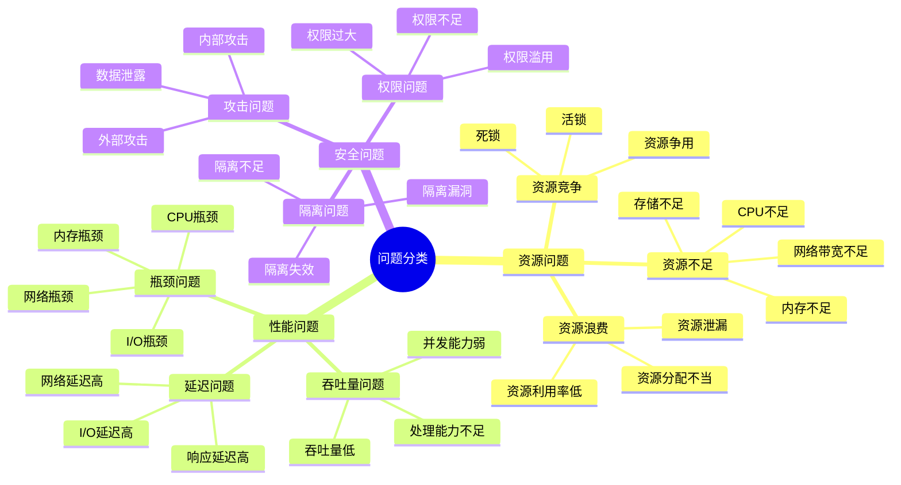
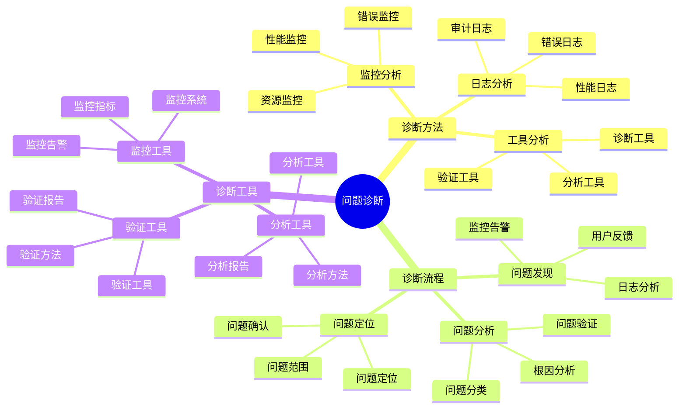
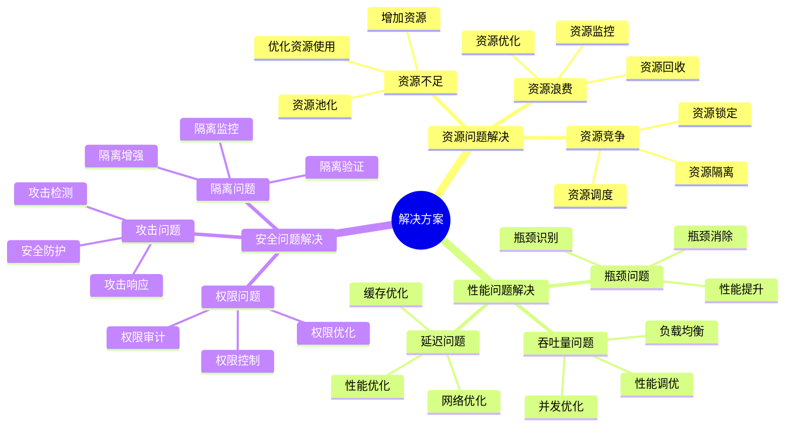
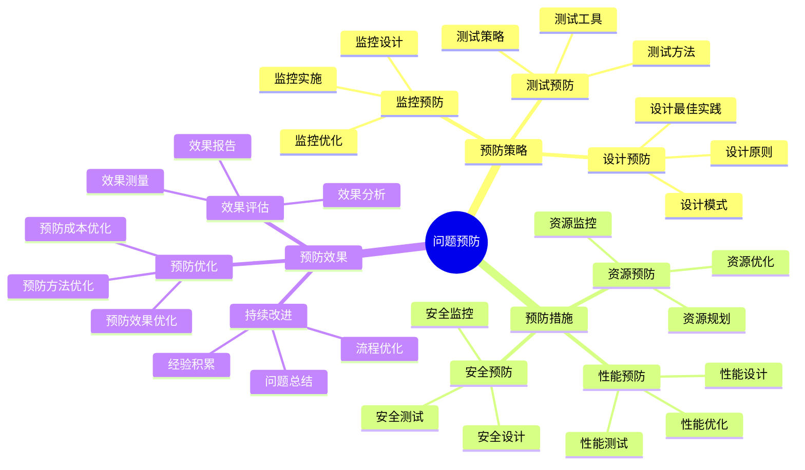

# 问题解决详细指南

## 📑 目录

- [问题解决详细指南](#问题解决详细指南)
  - [📑 目录](#-目录)
  - [1 问题分类详解](#1-问题分类详解)
  - [2 问题诊断详解](#2-问题诊断详解)
  - [3 解决方案详解](#3-解决方案详解)
  - [4 问题预防详解](#4-问题预防详解)

---

## 1 问题分类详解

---

## 2 问题诊断详解

---

## 3 解决方案详解

---

## 4 问题预防详解

---

## 5 问题解决检查清单

| 检查项 | 检查内容 | 重要性 | 推荐度 |
|--------|---------|--------|--------|
| **问题发现** | 监控告警、用户反馈、日志分析 | 极高 | ⭐⭐⭐⭐⭐ |
| **问题分析** | 问题分类、根因分析、问题验证 | 极高 | ⭐⭐⭐⭐⭐ |
| **问题定位** | 问题定位、问题确认、问题范围 | 高 | ⭐⭐⭐⭐⭐ |
| **方案设计** | 方案生成、方案评估、方案优化 | 高 | ⭐⭐⭐⭐⭐ |
| **方案实施** | 实施准备、实施执行、实施监控 | 高 | ⭐⭐⭐⭐⭐ |
| **效果评估** | 效果测量、效果分析、效果报告 | 中 | ⭐⭐⭐⭐ |
| **问题预防** | 预防策略、预防措施、预防效果 | 中 | ⭐⭐⭐⭐ |

**推荐度说明**：
- **⭐⭐⭐⭐⭐**：强烈推荐
- **⭐⭐⭐⭐**：推荐
- **⭐⭐⭐**：可选

---

**最后更新**：2025-11-07
**文档状态**：✅ 完整 | 📊 包含问题解决详细指南 | 🎯 生产就绪
**维护者**：项目团队
