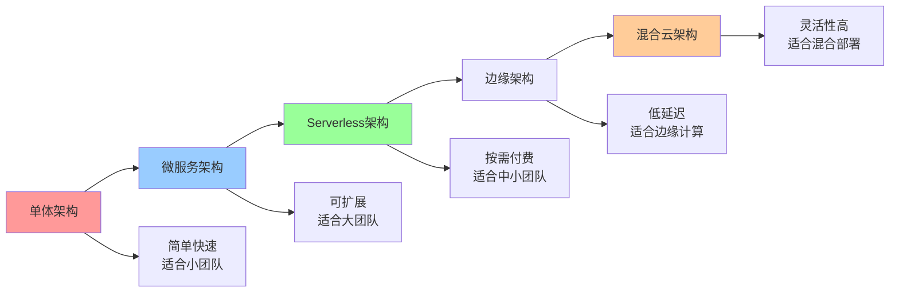
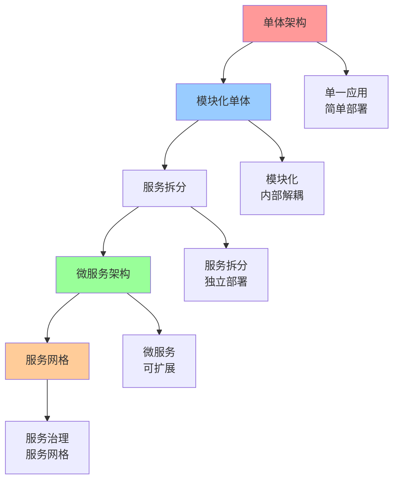
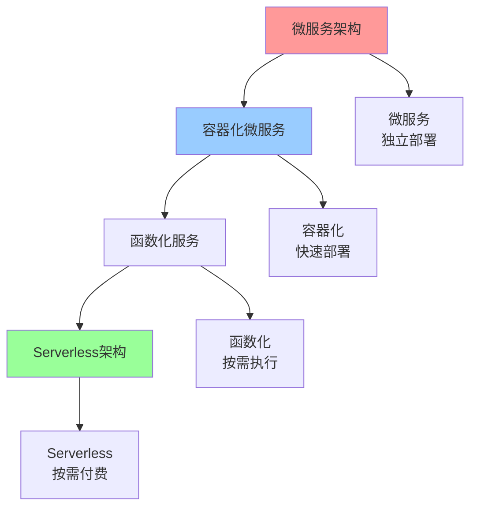
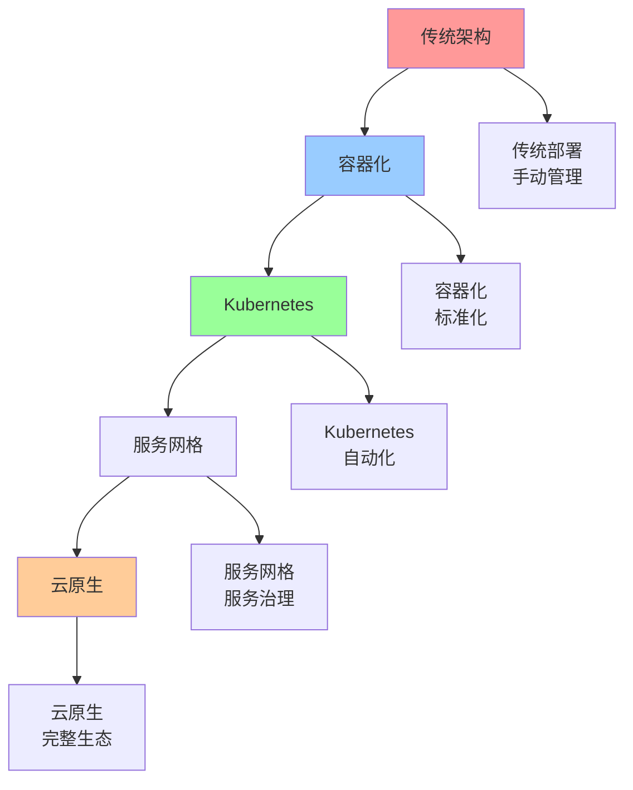

# 架构演进路径图

## 📑 目录

- [架构演进路径图](#架构演进路径图)
  - [📑 目录](#-目录)
  - [1 架构演进全景](#1-架构演进全景)
  - [2 单体到微服务演进](#2-单体到微服务演进)
  - [3 微服务到Serverless演进](#3-微服务到serverless演进)
  - [4 云原生演进](#4-云原生演进)
  - [5 架构演进决策矩阵](#5-架构演进决策矩阵)
  - [6 架构演进检查清单](#6-架构演进检查清单)
  - [7 使用指南](#7-使用指南)
    - [7.1 快速开始](#71-快速开始)
    - [7.2 架构演进应用](#72-架构演进应用)
    - [7.3 演进决策应用](#73-演进决策应用)
  - [8 使用技巧](#8-使用技巧)
    - [8.1 演进规划技巧](#81-演进规划技巧)
    - [8.2 演进实施技巧](#82-演进实施技巧)
  - [9 实践案例](#9-实践案例)
    - [9.1 单体到微服务演进案例](#91-单体到微服务演进案例)
    - [9.2 传统到云原生演进案例](#92-传统到云原生演进案例)
  - [10 2025 年最新实践](#10-2025-年最新实践)
    - [10.1 架构演进路径图应用最佳实践（2025）](#101-架构演进路径图应用最佳实践2025)
  - [11 实际应用案例](#11-实际应用案例)
    - [案例 1：架构演进路径图应用（2025）](#案例-1架构演进路径图应用2025)
  - [12 相关文档](#12-相关文档)

---

## 1 架构演进全景



---

## 2 单体到微服务演进



---

## 3 微服务到Serverless演进



---

## 4 云原生演进



---

## 5 架构演进决策矩阵

| 演进路径 | 起点 | 终点 | 演进驱动 | 演进成本 | 演进收益 | 推荐度 |
|---------|------|------|---------|---------|---------|--------|
| **单体→微服务** | 单体架构 | 微服务架构 | 扩展需求 | 高 | 高 | ⭐⭐⭐⭐⭐ |
| **微服务→Serverless** | 微服务架构 | Serverless架构 | 成本优化 | 中 | 高 | ⭐⭐⭐⭐ |
| **传统→云原生** | 传统架构 | 云原生架构 | 云原生需求 | 高 | 极高 | ⭐⭐⭐⭐⭐ |
| **中心化→边缘** | 中心化架构 | 边缘架构 | 低延迟需求 | 高 | 高 | ⭐⭐⭐⭐ |
| **单云→混合云** | 单云架构 | 混合云架构 | 灵活性需求 | 高 | 高 | ⭐⭐⭐⭐ |
| **单租户→多租户** | 单租户架构 | 多租户架构 | 资源优化 | 极高 | 高 | ⭐⭐⭐⭐⭐ |

**推荐度说明**：

- **⭐⭐⭐⭐⭐**：强烈推荐
- **⭐⭐⭐⭐**：推荐
- **⭐⭐⭐**：可选

---

## 6 架构演进检查清单

| 检查项 | 检查内容 | 重要性 | 推荐度 |
|--------|---------|--------|--------|
| **需求分析** | 演进需求、演进目标、演进驱动 | 极高 | ⭐⭐⭐⭐⭐ |
| **现状评估** | 当前架构、技术栈、团队能力 | 高 | ⭐⭐⭐⭐⭐ |
| **演进规划** | 演进路径、演进步骤、演进时间 | 高 | ⭐⭐⭐⭐⭐ |
| **风险评估** | 技术风险、业务风险、运维风险 | 高 | ⭐⭐⭐⭐⭐ |
| **成本分析** | 开发成本、运维成本、总拥有成本 | 中 | ⭐⭐⭐⭐ |
| **实施计划** | 实施步骤、实施时间、实施资源 | 高 | ⭐⭐⭐⭐⭐ |
| **效果评估** | 效果测量、效果分析、效果报告 | 中 | ⭐⭐⭐⭐ |

**推荐度说明**：

- **⭐⭐⭐⭐⭐**：强烈推荐
- **⭐⭐⭐⭐**：推荐
- **⭐⭐⭐**：可选

---

## 7 使用指南

### 7.1 快速开始

**适用场景**：架构演进规划、架构演进决策

**使用步骤**：

1. **现状评估**：评估当前架构现状
2. **演进需求**：分析架构演进需求
3. **演进路径**：选择架构演进路径
4. **演进规划**：制定架构演进规划

**推荐度**：⭐⭐⭐⭐⭐

---

### 7.2 架构演进应用

**适用场景**：实际项目中的架构演进

**使用步骤**：

1. **需求分析**：分析架构演进需求（扩展、成本、性能等）
2. **现状评估**：评估当前架构、技术栈、团队能力
3. **演进路径选择**：根据架构演进决策矩阵选择演进路径
4. **演进规划**：制定详细的演进规划（步骤、时间、资源）
5. **风险评估**：评估技术风险、业务风险、运维风险
6. **演进实施**：分阶段实施架构演进
7. **效果评估**：评估架构演进的效果

**推荐度**：⭐⭐⭐⭐⭐

---

### 7.3 演进决策应用

**适用场景**：架构演进决策

**使用步骤**：

1. **演进驱动分析**：分析架构演进的驱动因素
2. **演进成本分析**：分析架构演进的成本
3. **演进收益分析**：分析架构演进的收益
4. **综合决策**：综合考虑驱动、成本、收益做出决策

**推荐度**：⭐⭐⭐⭐⭐

---

## 8 使用技巧

### 8.1 演进规划技巧

**技巧1：渐进演进**

- 采用渐进式演进策略
- 分阶段实施演进
- 降低演进风险

**技巧2：风险评估**

- 全面评估演进风险
- 制定风险应对方案
- 建立风险监控机制

**推荐度**：⭐⭐⭐⭐⭐

---

### 8.2 演进实施技巧

**技巧1：分阶段实施**

- 将演进分为多个阶段
- 每个阶段都有明确的目标
- 阶段间有验证和评估

**技巧2：效果评估**

- 建立效果评估机制
- 及时调整演进策略
- 持续优化演进效果

**推荐度**：⭐⭐⭐⭐⭐

---

## 9 实践案例

### 9.1 单体到微服务演进案例

**场景**：电商平台从单体架构演进到微服务架构

**演进过程**：

1. **需求分析**：
   - 扩展需求：用户量快速增长，需要快速扩展
   - 团队需求：多团队协作，需要独立开发部署
   - 技术需求：技术栈多样化

2. **现状评估**：
   - 当前架构：单体架构
   - 技术栈：Java Spring Boot
   - 团队能力：具备微服务开发能力

3. **演进路径选择**：
   - 选择路径：单体 → 模块化单体 → 服务拆分 → 微服务
   - 演进驱动：扩展需求
   - 演进成本：高
   - 演进收益：高

4. **演进规划**：
   - 阶段1：模块化单体（3个月）
   - 阶段2：服务拆分（6个月）
   - 阶段3：微服务完善（3个月）

5. **风险评估**：
   - 技术风险：服务拆分复杂度高
   - 业务风险：演进期间可能影响业务
   - 运维风险：运维复杂度增加

6. **演进实施**：
   - 按阶段实施演进
   - 每个阶段都有验证和评估
   - 及时调整演进策略

7. **效果评估**：
   - 系统可扩展性显著提升
   - 团队开发效率提升
   - 系统性能稳定

**效果**：成功实现架构演进，系统可扩展性和团队效率显著提升

**推荐度**：⭐⭐⭐⭐⭐

---

### 9.2 传统到云原生演进案例

**场景**：企业应用从传统架构演进到云原生架构

**演进过程**：

1. **需求分析**：
   - 云原生需求：需要云原生能力
   - 自动化需求：需要自动化运维
   - 弹性需求：需要弹性扩展

2. **现状评估**：
   - 当前架构：传统架构
   - 技术栈：传统技术栈
   - 团队能力：需要云原生培训

3. **演进路径选择**：
   - 选择路径：传统架构 → 容器化 → Kubernetes → 服务网格 → 云原生
   - 演进驱动：云原生需求
   - 演进成本：高
   - 演进收益：极高

4. **演进规划**：
   - 阶段1：容器化（2个月）
   - 阶段2：Kubernetes（3个月）
   - 阶段3：服务网格（2个月）
   - 阶段4：云原生完善（3个月）

5. **风险评估**：
   - 技术风险：云原生技术复杂度高
   - 业务风险：演进期间可能影响业务
   - 运维风险：运维模式需要改变

6. **演进实施**：
   - 按阶段实施演进
   - 提供团队培训
   - 建立云原生运维体系

7. **效果评估**：
   - 系统自动化程度显著提升
   - 运维效率提升
   - 系统弹性能力提升

**效果**：成功实现云原生演进，系统自动化和弹性能力显著提升

**推荐度**：⭐⭐⭐⭐⭐

---

## 10 2025 年最新实践

### 10.1 架构演进路径图应用最佳实践（2025）

**2025 年趋势**：架构演进路径图在架构规划、演进决策、技术选型中的深度应用

**实践要点**：

- **路径规划**：根据业务需求规划架构演进路径
- **演进决策**：基于路径图进行演进决策
- **风险评估**：评估演进路径的风险和收益
- **持续优化**：基于实践效果优化演进路径

**代码示例**：

```python
# 2025 年架构演进路径图工具
class ArchitectureEvolutionPathTool:
    def __init__(self):
        self.planner = EvolutionPathPlanner()
        self.decision_support = EvolutionDecisionSupport()
        self.risk_assessor = RiskAssessor()
        self.optimizer = PathOptimizer()

    def plan_path(self, current_state, target_state, constraints):
        """路径规划"""
        return self.planner.plan(current_state, target_state, constraints)

    def support_decision(self, path, requirements):
        """演进决策支持"""
        return self.decision_support.recommend(path, requirements)

    def assess_risk(self, path):
        """风险评估"""
        return self.risk_assessor.assess(path)
```

## 11 实际应用案例

### 案例 1：架构演进路径图应用（2025）

**场景**：使用架构演进路径图规划云原生架构演进

**实现方案**：

```python
# 架构演进路径图应用
tool = ArchitectureEvolutionPathTool()

# 路径规划
current_state = ArchitectureState(type="monolithic", tech_stack="traditional")
target_state = ArchitectureState(type="cloud_native", tech_stack="kubernetes")
constraints = Constraints(budget="limited", timeline="12_months")
path = tool.plan_path(current_state, target_state, constraints)

# 演进决策支持
requirements = Requirements(scale="high", automation="high")
decision = tool.support_decision(path, requirements)

# 风险评估
risk = tool.assess_risk(path)
```

**效果**：

- 路径规划：系统化规划演进路径，提高规划质量
- 演进决策：基于路径图支持决策，提高决策准确性
- 风险评估：评估演进风险，降低演进风险

---

## 12 相关文档

- **[架构认知地图](01-architecture-cognitive-map.md)** - 架构设计全景、架构模式、架构决策
- **[架构模式对比矩阵](03-architecture-patterns-matrix.md)** - 架构模式功能对比、适用场景、复杂度
- **[架构模式详细思维导图](04-architecture-patterns-detailed.md)** - 架构模式核心概念、架构模式详解、架构模式应用
- **[架构决策完整流程](08-architecture-decision-process.md)** - 架构决策全景流程、需求分析流程、架构设计流程

---

**最后更新**：2025-11-15
**文档状态**：✅ 完整 | 📊 包含架构演进路径图、使用指南、使用技巧、实践案例 | 🎯 生产就绪
**维护者**：项目团队
