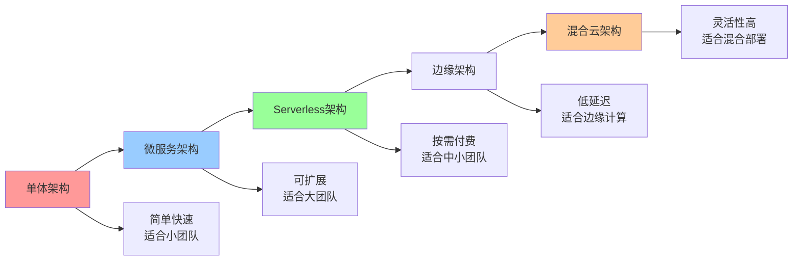
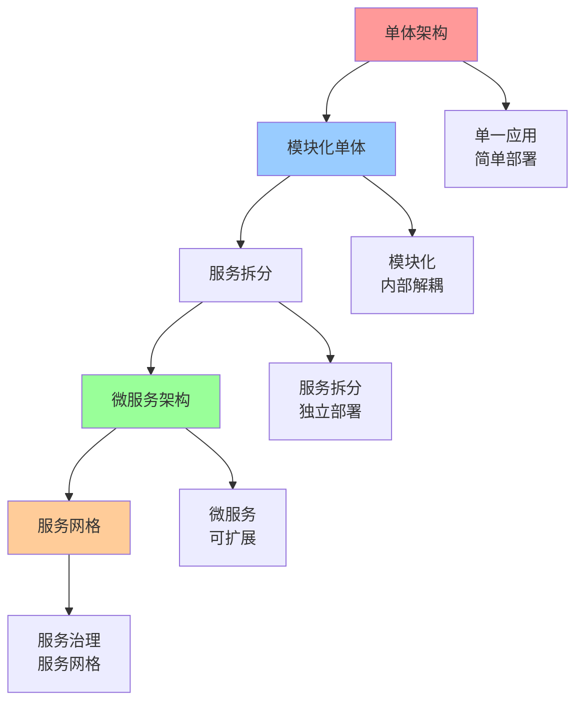
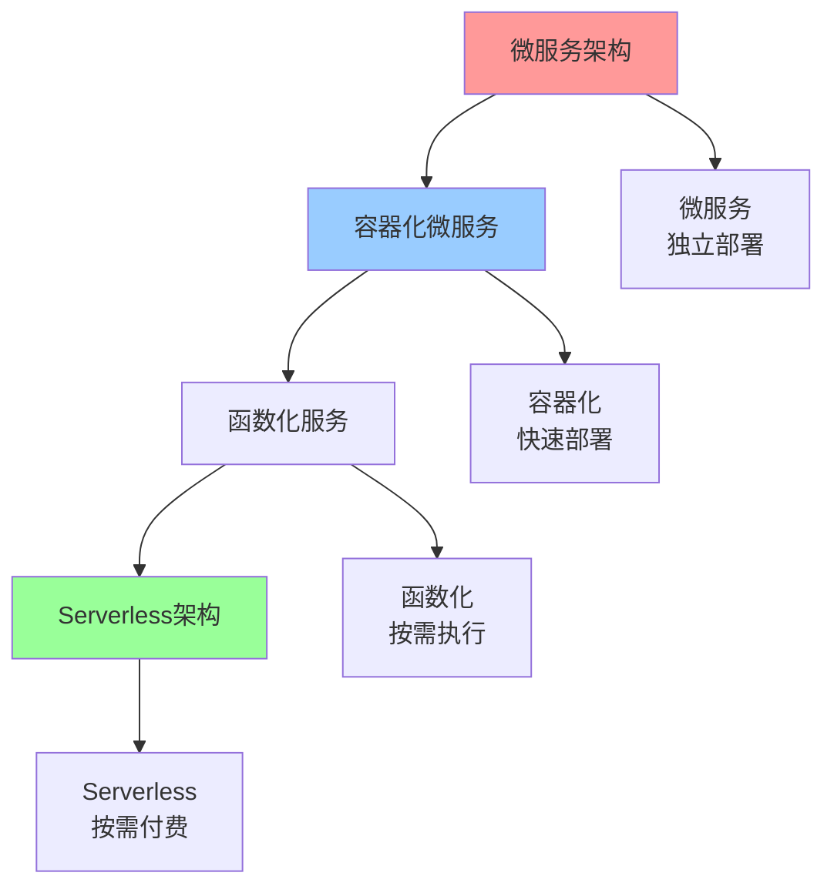
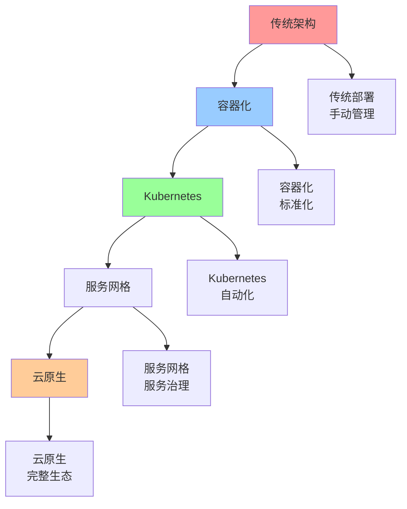

# 架构演进路径图

## 📑 目录

- [架构演进路径图](#架构演进路径图)
  - [📑 目录](#-目录)
  - [1 架构演进全景](#1-架构演进全景)
  - [2 单体到微服务演进](#2-单体到微服务演进)
  - [3 微服务到Serverless演进](#3-微服务到serverless演进)
  - [4 云原生演进](#4-云原生演进)

---

## 1 架构演进全景

---

## 2 单体到微服务演进

---

## 3 微服务到Serverless演进

---

## 4 云原生演进

---

## 5 架构演进决策矩阵

| 演进路径 | 起点 | 终点 | 演进驱动 | 演进成本 | 演进收益 | 推荐度 |
|---------|------|------|---------|---------|---------|--------|
| **单体→微服务** | 单体架构 | 微服务架构 | 扩展需求 | 高 | 高 | ⭐⭐⭐⭐⭐ |
| **微服务→Serverless** | 微服务架构 | Serverless架构 | 成本优化 | 中 | 高 | ⭐⭐⭐⭐ |
| **传统→云原生** | 传统架构 | 云原生架构 | 云原生需求 | 高 | 极高 | ⭐⭐⭐⭐⭐ |
| **中心化→边缘** | 中心化架构 | 边缘架构 | 低延迟需求 | 高 | 高 | ⭐⭐⭐⭐ |
| **单云→混合云** | 单云架构 | 混合云架构 | 灵活性需求 | 高 | 高 | ⭐⭐⭐⭐ |
| **单租户→多租户** | 单租户架构 | 多租户架构 | 资源优化 | 极高 | 高 | ⭐⭐⭐⭐⭐ |

**推荐度说明**：
- **⭐⭐⭐⭐⭐**：强烈推荐
- **⭐⭐⭐⭐**：推荐
- **⭐⭐⭐**：可选

---

## 6 架构演进检查清单

| 检查项 | 检查内容 | 重要性 | 推荐度 |
|--------|---------|--------|--------|
| **需求分析** | 演进需求、演进目标、演进驱动 | 极高 | ⭐⭐⭐⭐⭐ |
| **现状评估** | 当前架构、技术栈、团队能力 | 高 | ⭐⭐⭐⭐⭐ |
| **演进规划** | 演进路径、演进步骤、演进时间 | 高 | ⭐⭐⭐⭐⭐ |
| **风险评估** | 技术风险、业务风险、运维风险 | 高 | ⭐⭐⭐⭐⭐ |
| **成本分析** | 开发成本、运维成本、总拥有成本 | 中 | ⭐⭐⭐⭐ |
| **实施计划** | 实施步骤、实施时间、实施资源 | 高 | ⭐⭐⭐⭐⭐ |
| **效果评估** | 效果测量、效果分析、效果报告 | 中 | ⭐⭐⭐⭐ |

**推荐度说明**：
- **⭐⭐⭐⭐⭐**：强烈推荐
- **⭐⭐⭐⭐**：推荐
- **⭐⭐⭐**：可选

---

**最后更新**：2025-11-07
**文档状态**：✅ 完整 | 📊 包含架构演进路径图 | 🎯 生产就绪
**维护者**：项目团队
