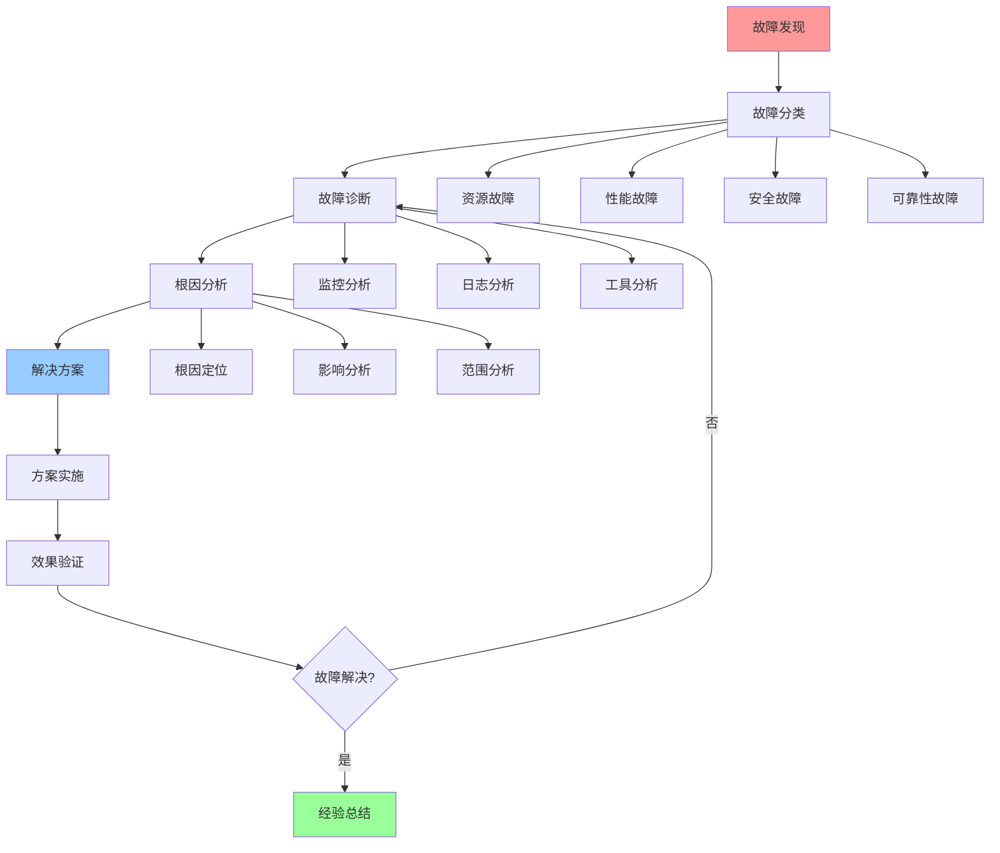

# 故障排查综合指南

## 📑 目录

- [故障排查综合指南](#故障排查综合指南)
  - [📑 目录](#-目录)
  - [1 故障排查全景](#1-故障排查全景)
  - [2 故障分类](#2-故障分类)
  - [3 故障诊断](#3-故障诊断)
  - [4 故障恢复](#4-故障恢复)
  - [5 故障排查检查清单](#5-故障排查检查清单)
  - [6 使用指南](#6-使用指南)
    - [6.1 快速开始](#61-快速开始)
    - [6.2 故障排查应用](#62-故障排查应用)
    - [6.3 故障预防应用](#63-故障预防应用)
  - [7 使用技巧](#7-使用技巧)
    - [7.1 故障诊断技巧](#71-故障诊断技巧)
    - [7.2 故障恢复技巧](#72-故障恢复技巧)
  - [8 实践案例](#8-实践案例)
    - [8.1 资源故障排查案例](#81-资源故障排查案例)
    - [8.2 性能故障排查案例](#82-性能故障排查案例)
  - [9 相关文档](#9-相关文档)

---

## 1 故障排查全景

---

## 2 故障分类

| 故障类型 | 故障特征 | 常见原因 | 诊断方法 | 推荐度 |
|---------|---------|---------|---------|--------|
| **资源故障** | 资源不足、资源泄漏 | 资源分配不当、资源泄漏 | 资源监控、资源分析 | ⭐⭐⭐⭐⭐ |
| **性能故障** | 延迟高、吞吐量低 | 性能瓶颈、配置不当 | 性能监控、性能分析 | ⭐⭐⭐⭐⭐ |
| **安全故障** | 安全事件、攻击 | 安全漏洞、配置错误 | 安全监控、安全分析 | ⭐⭐⭐⭐⭐ |
| **可靠性故障** | 服务不可用、数据丢失 | 单点故障、错误处理不足 | 可用性监控、错误分析 | ⭐⭐⭐⭐⭐ |
| **网络故障** | 网络延迟、网络中断 | 网络配置、网络问题 | 网络监控、网络分析 | ⭐⭐⭐⭐ |
| **存储故障** | 存储不足、存储错误 | 存储配置、存储问题 | 存储监控、存储分析 | ⭐⭐⭐⭐ |

**推荐度说明**：

- **⭐⭐⭐⭐⭐**：强烈推荐
- **⭐⭐⭐⭐**：推荐
- **⭐⭐⭐**：可选

---

## 3 故障诊断

| 诊断方法 | 诊断工具 | 诊断内容 | 认知模型 | 推荐度 |
|---------|---------|---------|---------|--------|
| **监控分析** | Prometheus、Grafana | 性能指标、资源指标 | eBPF/OTLP视角 | ⭐⭐⭐⭐⭐ |
| **日志分析** | ELK、Loki | 应用日志、系统日志 | eBPF/OTLP视角 | ⭐⭐⭐⭐⭐ |
| **追踪分析** | Jaeger、Zipkin | 分布式追踪、性能追踪 | eBPF/OTLP视角 | ⭐⭐⭐⭐ |
| **工具分析** | 诊断工具、分析工具 | 系统分析、性能分析 | 问题解决方案矩阵 | ⭐⭐⭐⭐ |
| **根因分析** | 根因分析工具 | 根因定位、影响分析 | 问题解决方案矩阵 | ⭐⭐⭐⭐⭐ |
| **验证分析** | 验证工具 | 方案验证、效果验证 | 问题解决方案矩阵 | ⭐⭐⭐⭐ |

**推荐度说明**：

- **⭐⭐⭐⭐⭐**：强烈推荐
- **⭐⭐⭐⭐**：推荐
- **⭐⭐⭐**：可选

---

## 4 故障恢复

| 恢复方法 | 恢复内容 | 恢复工具 | 认知模型 | 推荐度 |
|---------|---------|---------|---------|--------|
| **快速恢复** | 服务恢复、数据恢复 | 恢复工具 | 可靠性优化指南 | ⭐⭐⭐⭐⭐ |
| **数据恢复** | 数据备份、数据恢复 | 备份工具 | 可靠性优化指南 | ⭐⭐⭐⭐⭐ |
| **服务恢复** | 服务重启、服务迁移 | 服务管理工具 | 架构决策框架 | ⭐⭐⭐⭐⭐ |
| **配置恢复** | 配置回滚、配置修复 | 配置管理工具 | 资源模型 | ⭐⭐⭐⭐ |
| **状态恢复** | 状态恢复、状态同步 | 状态管理工具 | 分布式模型 | ⭐⭐⭐⭐ |
| **灾难恢复** | 灾难恢复、业务恢复 | 灾难恢复工具 | 可靠性优化指南 | ⭐⭐⭐⭐⭐ |

**推荐度说明**：

- **⭐⭐⭐⭐⭐**：强烈推荐
- **⭐⭐⭐⭐**：推荐
- **⭐⭐⭐**：可选

---

## 5 故障排查检查清单

| 检查项 | 检查内容 | 重要性 | 推荐度 |
|--------|---------|--------|--------|
| **故障发现** | 监控告警、用户反馈、日志分析 | 极高 | ⭐⭐⭐⭐⭐ |
| **故障分类** | 故障类型、故障特征、故障范围 | 高 | ⭐⭐⭐⭐⭐ |
| **故障诊断** | 监控分析、日志分析、工具分析 | 极高 | ⭐⭐⭐⭐⭐ |
| **根因分析** | 根因定位、影响分析、范围分析 | 高 | ⭐⭐⭐⭐⭐ |
| **解决方案** | 方案设计、方案评估、方案选择 | 高 | ⭐⭐⭐⭐⭐ |
| **方案实施** | 实施计划、实施执行、实施验证 | 高 | ⭐⭐⭐⭐⭐ |
| **效果验证** | 效果测量、效果分析、效果报告 | 中 | ⭐⭐⭐⭐ |
| **经验总结** | 问题总结、经验积累、流程优化 | 中 | ⭐⭐⭐⭐ |

**推荐度说明**：

- **⭐⭐⭐⭐⭐**：强烈推荐
- **⭐⭐⭐⭐**：推荐
- **⭐⭐⭐**：可选

---

## 6 使用指南

### 6.1 快速开始

**适用场景**：故障发现、故障诊断、故障恢复

**使用步骤**：

1. **故障发现**：通过监控告警、用户反馈、日志分析发现故障
2. **故障分类**：根据故障分类对故障进行分类
3. **故障诊断**：使用故障诊断方法进行故障诊断
4. **故障恢复**：使用故障恢复方法恢复故障

**推荐度**：⭐⭐⭐⭐⭐

---

### 6.2 故障排查应用

**适用场景**：实际项目中的故障排查

**使用步骤**：

1. **故障发现**：通过监控告警、用户反馈、日志分析发现故障
2. **故障分类**：根据故障分类对故障进行分类（资源、性能、安全、可靠性）
3. **故障诊断**：使用故障诊断方法（监控分析、日志分析、工具分析）进行故障诊断
4. **根因分析**：进行根因分析，定位故障根本原因
5. **解决方案**：设计故障解决方案
6. **故障恢复**：使用故障恢复方法恢复故障
7. **效果验证**：验证故障恢复效果
8. **经验总结**：总结故障排查经验

**推荐度**：⭐⭐⭐⭐⭐

---

### 6.3 故障预防应用

**适用场景**：系统故障预防

**使用步骤**：

1. **故障分析**：分析历史故障，识别故障模式
2. **预防策略**：制定故障预防策略
3. **预防措施**：实施故障预防措施
4. **预防监控**：监控预防措施的效果

**推荐度**：⭐⭐⭐⭐⭐

---

## 7 使用技巧

### 7.1 故障诊断技巧

**技巧1：多维度诊断**

- 使用多种诊断方法（监控、日志、工具）
- 从多个维度分析故障
- 建立诊断知识库

**技巧2：快速定位**

- 使用诊断工具快速定位故障
- 建立故障定位流程
- 提高诊断效率

**推荐度**：⭐⭐⭐⭐⭐

---

### 7.2 故障恢复技巧

**技巧1：快速恢复**

- 优先使用快速恢复方法
- 减少故障影响时间
- 建立快速恢复机制

**技巧2：数据恢复**

- 建立数据备份机制
- 定期测试数据恢复
- 确保数据安全

**推荐度**：⭐⭐⭐⭐⭐

---

## 8 实践案例

### 8.1 资源故障排查案例

**场景**：Kubernetes集群节点资源耗尽导致服务不可用

**排查过程**：

1. **故障发现**：
   - 监控告警：节点CPU使用率100%
   - 用户反馈：服务响应超时
   - 日志分析：节点日志显示资源不足

2. **故障分类**：
   - 故障类型：资源故障 → 资源不足 → CPU不足

3. **故障诊断**：
   - 监控分析：节点CPU使用率持续100%
   - 日志分析：发现CPU密集型任务
   - 工具分析：使用kubectl top分析资源使用

4. **根因分析**：
   - 根因：CPU密集型任务占用过多CPU资源
   - 影响：节点CPU耗尽，其他Pod无法正常运行

5. **解决方案**：
   - 短期方案：限制CPU密集型任务的资源使用
   - 长期方案：优化任务调度，添加更多节点

6. **故障恢复**：
   - 限制CPU密集型任务的资源使用
   - 添加更多节点分担负载
   - 优化任务调度策略

7. **效果验证**：
   - 节点CPU使用率降至70%
   - 服务恢复正常
   - 故障解决

**效果**：成功排查并恢复资源故障，系统恢复正常

**推荐度**：⭐⭐⭐⭐⭐

---

### 8.2 性能故障排查案例

**场景**：微服务API响应时间突然增加，影响用户体验

**排查过程**：

1. **故障发现**：
   - 监控告警：API响应时间超过阈值
   - 用户反馈：页面加载慢
   - 日志分析：发现大量慢请求

2. **故障分类**：
   - 故障类型：性能故障 → 延迟问题 → 响应延迟高

3. **故障诊断**：
   - 监控分析：API响应时间分布
   - 日志分析：应用日志和数据库日志
   - 追踪分析：使用Jaeger追踪请求链路

4. **根因分析**：
   - 根因：数据库连接池耗尽，导致请求等待
   - 影响：API响应时间增加，用户体验下降

5. **解决方案**：
   - 短期方案：增加数据库连接池大小
   - 长期方案：优化数据库连接管理，使用连接池优化

6. **故障恢复**：
   - 增加数据库连接池大小
   - 优化数据库连接管理
   - 实施连接池优化策略

7. **效果验证**：
   - API响应时间恢复正常
   - 用户体验改善
   - 故障解决

**效果**：成功排查并恢复性能故障，系统性能恢复正常

**推荐度**：⭐⭐⭐⭐⭐

---

## 9 相关文档

- **[问题解决详细指南](05-problem-solving-detailed.md)** - 问题解决全景、问题分类、问题诊断、解决方案
- **[架构认知地图](01-architecture-cognitive-map.md)** - 架构设计全景、架构模式、架构决策
- **[问题解决思维导图](02-problem-solution-mindmap.md)** - 问题解决全景、问题分类、解决方案
- **[问题解决详细流程](../01-core-foundations/visualizations/17-problem-solving-detailed-process.md)** - 问题解决全景流程、问题识别流程、问题分析流程

---

**最后更新**：2025-11-15
**文档状态**：✅ 完整 | 📊 包含故障排查综合指南、使用指南、使用技巧、实践案例 | 🎯 生产就绪
**维护者**：项目团队
