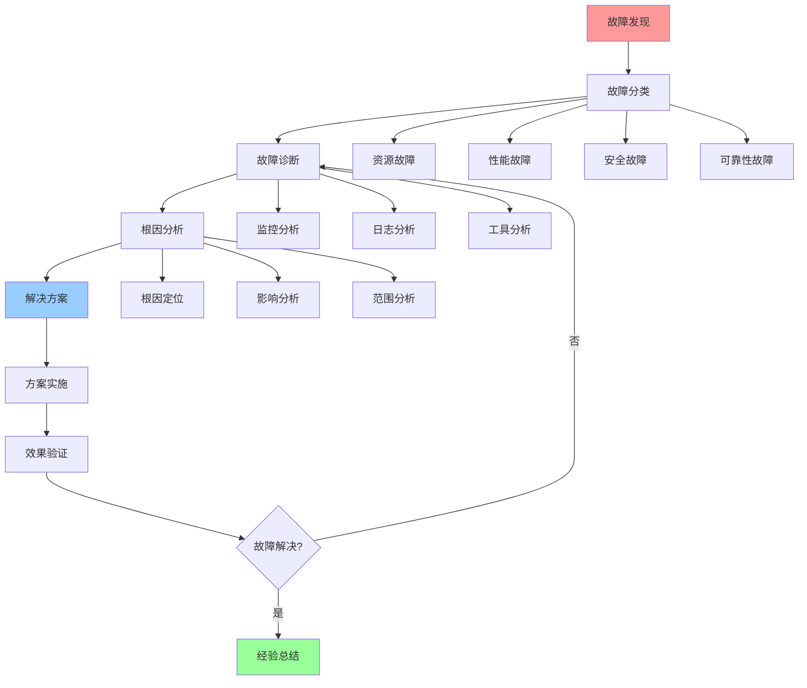

# 故障排查综合指南

## 📑 目录

- [故障排查综合指南](#故障排查综合指南)
  - [📑 目录](#-目录)
  - [1 故障排查全景](#1-故障排查全景)
  - [2 故障分类](#2-故障分类)
  - [3 故障诊断](#3-故障诊断)
  - [4 故障恢复](#4-故障恢复)

---

## 1 故障排查全景

---

## 2 故障分类

| 故障类型 | 故障特征 | 常见原因 | 诊断方法 | 推荐度 |
|---------|---------|---------|---------|--------|
| **资源故障** | 资源不足、资源泄漏 | 资源分配不当、资源泄漏 | 资源监控、资源分析 | ⭐⭐⭐⭐⭐ |
| **性能故障** | 延迟高、吞吐量低 | 性能瓶颈、配置不当 | 性能监控、性能分析 | ⭐⭐⭐⭐⭐ |
| **安全故障** | 安全事件、攻击 | 安全漏洞、配置错误 | 安全监控、安全分析 | ⭐⭐⭐⭐⭐ |
| **可靠性故障** | 服务不可用、数据丢失 | 单点故障、错误处理不足 | 可用性监控、错误分析 | ⭐⭐⭐⭐⭐ |
| **网络故障** | 网络延迟、网络中断 | 网络配置、网络问题 | 网络监控、网络分析 | ⭐⭐⭐⭐ |
| **存储故障** | 存储不足、存储错误 | 存储配置、存储问题 | 存储监控、存储分析 | ⭐⭐⭐⭐ |

**推荐度说明**：
- **⭐⭐⭐⭐⭐**：强烈推荐
- **⭐⭐⭐⭐**：推荐
- **⭐⭐⭐**：可选

---

## 3 故障诊断

| 诊断方法 | 诊断工具 | 诊断内容 | 认知模型 | 推荐度 |
|---------|---------|---------|---------|--------|
| **监控分析** | Prometheus、Grafana | 性能指标、资源指标 | eBPF/OTLP视角 | ⭐⭐⭐⭐⭐ |
| **日志分析** | ELK、Loki | 应用日志、系统日志 | eBPF/OTLP视角 | ⭐⭐⭐⭐⭐ |
| **追踪分析** | Jaeger、Zipkin | 分布式追踪、性能追踪 | eBPF/OTLP视角 | ⭐⭐⭐⭐ |
| **工具分析** | 诊断工具、分析工具 | 系统分析、性能分析 | 问题解决方案矩阵 | ⭐⭐⭐⭐ |
| **根因分析** | 根因分析工具 | 根因定位、影响分析 | 问题解决方案矩阵 | ⭐⭐⭐⭐⭐ |
| **验证分析** | 验证工具 | 方案验证、效果验证 | 问题解决方案矩阵 | ⭐⭐⭐⭐ |

**推荐度说明**：
- **⭐⭐⭐⭐⭐**：强烈推荐
- **⭐⭐⭐⭐**：推荐
- **⭐⭐⭐**：可选

---

## 4 故障恢复

| 恢复方法 | 恢复内容 | 恢复工具 | 认知模型 | 推荐度 |
|---------|---------|---------|---------|--------|
| **快速恢复** | 服务恢复、数据恢复 | 恢复工具 | 可靠性优化指南 | ⭐⭐⭐⭐⭐ |
| **数据恢复** | 数据备份、数据恢复 | 备份工具 | 可靠性优化指南 | ⭐⭐⭐⭐⭐ |
| **服务恢复** | 服务重启、服务迁移 | 服务管理工具 | 架构决策框架 | ⭐⭐⭐⭐⭐ |
| **配置恢复** | 配置回滚、配置修复 | 配置管理工具 | 资源模型 | ⭐⭐⭐⭐ |
| **状态恢复** | 状态恢复、状态同步 | 状态管理工具 | 分布式模型 | ⭐⭐⭐⭐ |
| **灾难恢复** | 灾难恢复、业务恢复 | 灾难恢复工具 | 可靠性优化指南 | ⭐⭐⭐⭐⭐ |

**推荐度说明**：
- **⭐⭐⭐⭐⭐**：强烈推荐
- **⭐⭐⭐⭐**：推荐
- **⭐⭐⭐**：可选

---

## 5 故障排查检查清单

| 检查项 | 检查内容 | 重要性 | 推荐度 |
|--------|---------|--------|--------|
| **故障发现** | 监控告警、用户反馈、日志分析 | 极高 | ⭐⭐⭐⭐⭐ |
| **故障分类** | 故障类型、故障特征、故障范围 | 高 | ⭐⭐⭐⭐⭐ |
| **故障诊断** | 监控分析、日志分析、工具分析 | 极高 | ⭐⭐⭐⭐⭐ |
| **根因分析** | 根因定位、影响分析、范围分析 | 高 | ⭐⭐⭐⭐⭐ |
| **解决方案** | 方案设计、方案评估、方案选择 | 高 | ⭐⭐⭐⭐⭐ |
| **方案实施** | 实施计划、实施执行、实施验证 | 高 | ⭐⭐⭐⭐⭐ |
| **效果验证** | 效果测量、效果分析、效果报告 | 中 | ⭐⭐⭐⭐ |
| **经验总结** | 问题总结、经验积累、流程优化 | 中 | ⭐⭐⭐⭐ |

**推荐度说明**：
- **⭐⭐⭐⭐⭐**：强烈推荐
- **⭐⭐⭐⭐**：推荐
- **⭐⭐⭐**：可选

---

**最后更新**：2025-11-07
**文档状态**：✅ 完整 | 📊 包含故障排查综合指南 | 🎯 生产就绪
**维护者**：项目团队
