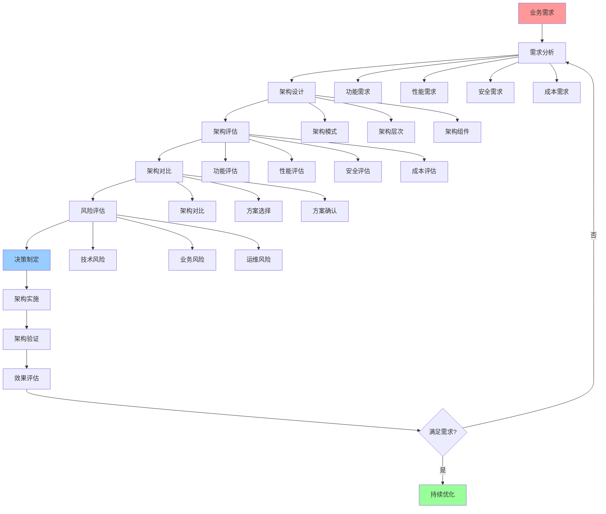
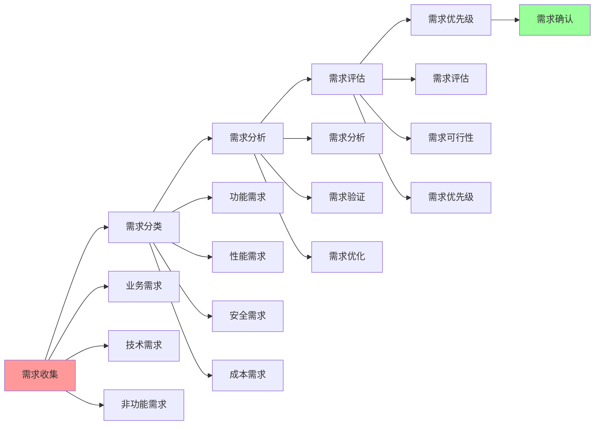
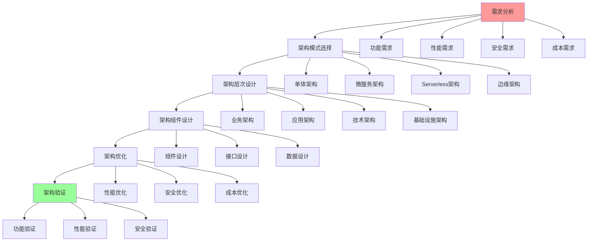
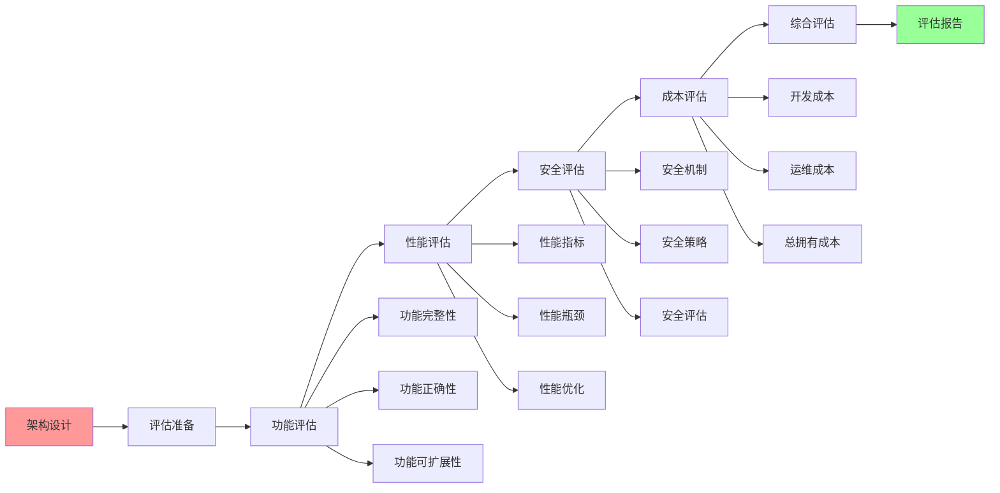

# 架构决策完整流程

## 📑 目录

- [架构决策完整流程](#架构决策完整流程)
  - [📑 目录](#-目录)
  - [1 架构决策全景流程](#1-架构决策全景流程)
  - [2 需求分析流程](#2-需求分析流程)
  - [3 架构设计流程](#3-架构设计流程)
  - [4 架构评估流程](#4-架构评估流程)

---

## 1 架构决策全景流程

---

## 2 需求分析流程

---

## 3 架构设计流程

---

## 4 架构评估流程

---

## 5 架构决策检查清单

| 检查项 | 检查内容 | 重要性 | 推荐度 |
|--------|---------|--------|--------|
| **需求分析** | 需求完整、需求可行、需求优先级 | 极高 | ⭐⭐⭐⭐⭐ |
| **架构模式选择** | 模式评估、模式选择、模式验证 | 高 | ⭐⭐⭐⭐⭐ |
| **架构层次设计** | 层次设计、层次优化、层次验证 | 高 | ⭐⭐⭐⭐⭐ |
| **架构组件设计** | 组件设计、组件优化、组件验证 | 高 | ⭐⭐⭐⭐⭐ |
| **架构评估** | 功能评估、性能评估、安全评估、成本评估 | 高 | ⭐⭐⭐⭐⭐ |
| **风险评估** | 技术风险、业务风险、运维风险 | 高 | ⭐⭐⭐⭐⭐ |
| **决策制定** | 决策记录、决策理由、决策流程 | 高 | ⭐⭐⭐⭐⭐ |
| **架构实施** | 实施计划、实施执行、实施验证 | 高 | ⭐⭐⭐⭐⭐ |
| **效果评估** | 效果测量、效果分析、效果报告 | 中 | ⭐⭐⭐⭐ |

**推荐度说明**：
- **⭐⭐⭐⭐⭐**：强烈推荐
- **⭐⭐⭐⭐**：推荐
- **⭐⭐⭐**：可选

---

**最后更新**：2025-11-07
**文档状态**：✅ 完整 | 📊 包含架构决策完整流程 | 🎯 生产就绪
**维护者**：项目团队
