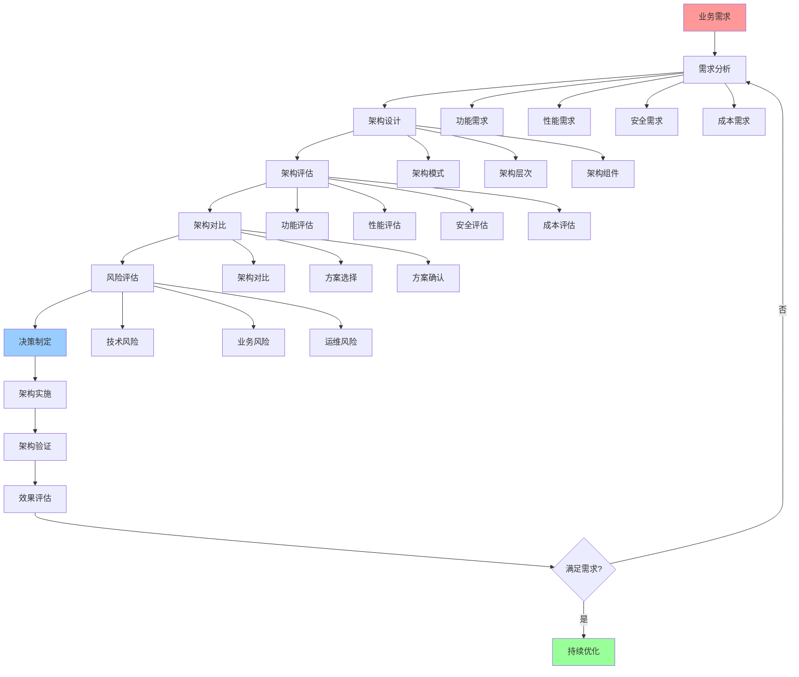
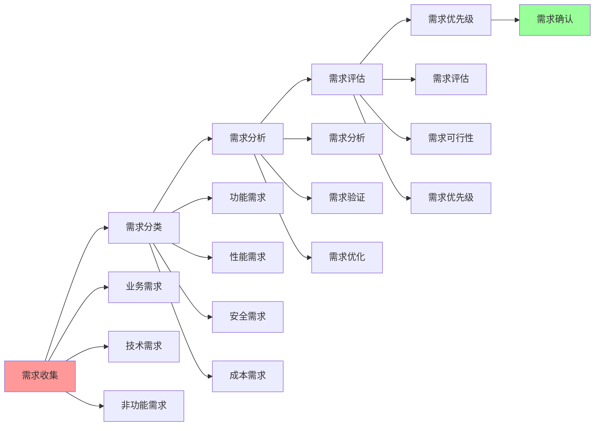
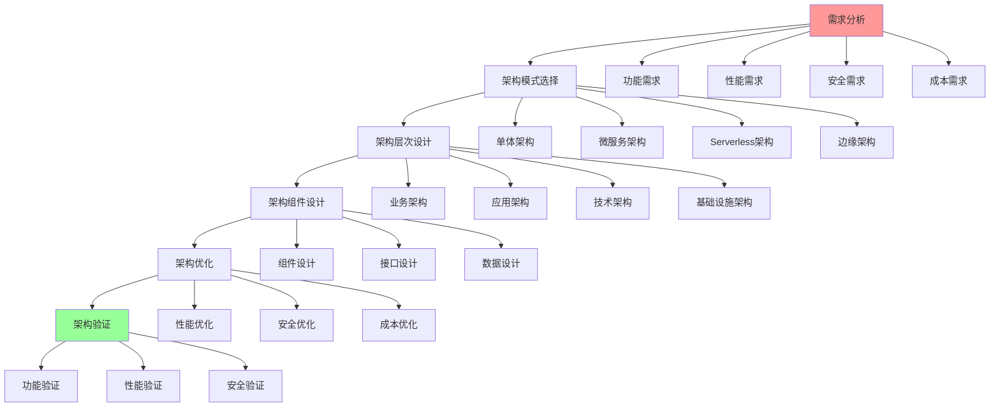
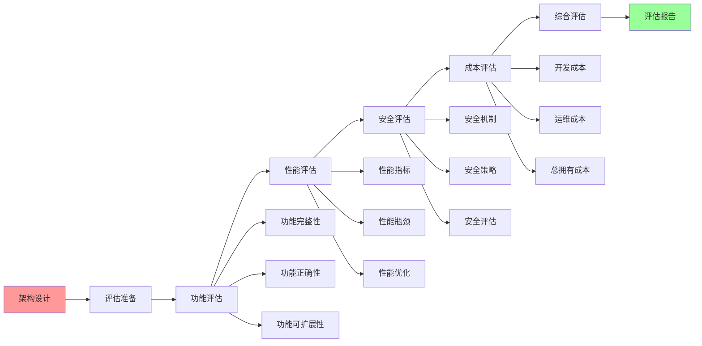

# 架构决策完整流程

## 📑 目录

- [架构决策完整流程](#架构决策完整流程)
  - [📑 目录](#-目录)
  - [1 架构决策全景流程](#1-架构决策全景流程)
  - [2 需求分析流程](#2-需求分析流程)
  - [3 架构设计流程](#3-架构设计流程)
  - [4 架构评估流程](#4-架构评估流程)
  - [5 架构决策检查清单](#5-架构决策检查清单)
  - [6 使用指南](#6-使用指南)
    - [6.1 快速开始](#61-快速开始)
    - [6.2 架构决策应用](#62-架构决策应用)
    - [6.3 架构评估应用](#63-架构评估应用)
  - [7 使用技巧](#7-使用技巧)
    - [7.1 需求分析技巧](#71-需求分析技巧)
    - [7.2 架构设计技巧](#72-架构设计技巧)
  - [8 实践案例](#8-实践案例)
    - [8.1 微服务架构决策案例](#81-微服务架构决策案例)
    - [8.2 Serverless架构决策案例](#82-serverless架构决策案例)
  - [9 2025 年最新实践](#9-2025-年最新实践)
    - [9.1 架构决策完整流程应用最佳实践（2025）](#91-架构决策完整流程应用最佳实践2025)
  - [10 实际应用案例](#10-实际应用案例)
    - [案例 1：架构决策完整流程应用（2025）](#案例-1架构决策完整流程应用2025)
  - [11 相关文档](#11-相关文档)

---

## 1 架构决策全景流程



---

## 2 需求分析流程



---

## 3 架构设计流程



---

## 4 架构评估流程



---

## 5 架构决策检查清单

| 检查项 | 检查内容 | 重要性 | 推荐度 |
|--------|---------|--------|--------|
| **需求分析** | 需求完整、需求可行、需求优先级 | 极高 | ⭐⭐⭐⭐⭐ |
| **架构模式选择** | 模式评估、模式选择、模式验证 | 高 | ⭐⭐⭐⭐⭐ |
| **架构层次设计** | 层次设计、层次优化、层次验证 | 高 | ⭐⭐⭐⭐⭐ |
| **架构组件设计** | 组件设计、组件优化、组件验证 | 高 | ⭐⭐⭐⭐⭐ |
| **架构评估** | 功能评估、性能评估、安全评估、成本评估 | 高 | ⭐⭐⭐⭐⭐ |
| **风险评估** | 技术风险、业务风险、运维风险 | 高 | ⭐⭐⭐⭐⭐ |
| **决策制定** | 决策记录、决策理由、决策流程 | 高 | ⭐⭐⭐⭐⭐ |
| **架构实施** | 实施计划、实施执行、实施验证 | 高 | ⭐⭐⭐⭐⭐ |
| **效果评估** | 效果测量、效果分析、效果报告 | 中 | ⭐⭐⭐⭐ |

**推荐度说明**：

- **⭐⭐⭐⭐⭐**：强烈推荐
- **⭐⭐⭐⭐**：推荐
- **⭐⭐⭐**：可选

---

## 6 使用指南

### 6.1 快速开始

**适用场景**：架构决策、技术选型、架构设计

**使用步骤**：

1. **需求分析**：分析业务需求和技术需求
2. **架构设计**：根据需求进行架构设计
3. **架构评估**：评估架构方案
4. **决策制定**：制定架构决策

**推荐度**：⭐⭐⭐⭐⭐

---

### 6.2 架构决策应用

**适用场景**：实际项目中的架构决策

**使用步骤**：

1. **需求分析**：分析业务需求（功能、性能、安全、成本）
2. **架构模式选择**：根据需求选择合适的架构模式
3. **架构层次设计**：设计架构层次结构
4. **架构组件设计**：设计架构组件
5. **架构评估**：评估架构方案（功能、性能、安全、成本）
6. **架构对比**：对比多个架构方案
7. **风险评估**：评估技术风险、业务风险、运维风险
8. **决策制定**：制定架构决策
9. **架构实施**：实施架构方案
10. **效果评估**：评估架构实施效果

**推荐度**：⭐⭐⭐⭐⭐

---

### 6.3 架构评估应用

**适用场景**：架构方案评估

**使用步骤**：

1. **功能评估**：评估架构方案的功能完整性
2. **性能评估**：评估架构方案的性能指标
3. **安全评估**：评估架构方案的安全性
4. **成本评估**：评估架构方案的成本
5. **综合评估**：综合各维度评估结果

**推荐度**：⭐⭐⭐⭐⭐

---

## 7 使用技巧

### 7.1 需求分析技巧

**技巧1：需求收集**

- 全面收集业务需求和技术需求
- 理解需求的优先级
- 建立需求管理机制

**技巧2：需求验证**

- 验证需求的可行性和完整性
- 与利益相关者确认需求
- 建立需求变更机制

**推荐度**：⭐⭐⭐⭐⭐

---

### 7.2 架构设计技巧

**技巧1：模式选择**

- 根据需求选择合适的架构模式
- 理解架构模式的特点和适用场景
- 避免模式滥用

**技巧2：架构优化**

- 持续优化架构设计
- 平衡架构的复杂性和可维护性
- 建立架构评审机制

**推荐度**：⭐⭐⭐⭐⭐

---

## 8 实践案例

### 8.1 微服务架构决策案例

**场景**：为大型电商平台进行微服务架构决策

**决策过程**：

1. **需求分析**：
   - 功能需求：支持高并发、多业务模块
   - 性能需求：低延迟、高吞吐量
   - 安全需求：高安全性、数据隔离
   - 成本需求：成本可控

2. **架构模式选择**：
   - 选择微服务架构（满足高并发、多业务模块需求）
   - 使用服务网格进行服务治理

3. **架构层次设计**：
   - API网关层：统一入口
   - 服务层：微服务
   - 数据层：数据库

4. **架构组件设计**：
   - API网关：Kong
   - 服务网格：Istio
   - 容器编排：Kubernetes

5. **架构评估**：
   - 功能评估：满足功能需求
   - 性能评估：满足性能需求
   - 安全评估：满足安全需求
   - 成本评估：成本可控

6. **架构对比**：
   - 对比单体架构和微服务架构
   - 微服务架构更适合当前需求

7. **风险评估**：
   - 技术风险：微服务复杂度高
   - 业务风险：演进期间可能影响业务
   - 运维风险：运维复杂度增加

8. **决策制定**：
   - 选择微服务架构
   - 使用Kubernetes + Istio技术栈

9. **架构实施**：
   - 分阶段实施微服务架构
   - 建立微服务开发运维体系

10. **效果评估**：
    - 系统可扩展性显著提升
    - 团队开发效率提升
    - 系统性能稳定

**效果**：成功制定并实施微服务架构决策，系统可扩展性和团队效率显著提升

**推荐度**：⭐⭐⭐⭐⭐

---

### 8.2 Serverless架构决策案例

**场景**：为事件驱动应用进行Serverless架构决策

**决策过程**：

1. **需求分析**：
   - 功能需求：事件驱动、按需执行
   - 性能需求：快速响应
   - 成本需求：按需付费、降低成本
   - 扩展需求：自动扩展

2. **架构模式选择**：
   - 选择Serverless架构（满足事件驱动、按需付费需求）
   - 使用函数计算

3. **架构层次设计**：
   - 事件层：事件源
   - 函数层：Serverless函数
   - 存储层：对象存储

4. **架构组件设计**：
   - 函数计算：AWS Lambda / 阿里云函数计算
   - 事件源：消息队列、API Gateway
   - 存储：对象存储

5. **架构评估**：
   - 功能评估：满足功能需求
   - 性能评估：满足性能需求
   - 成本评估：成本显著降低
   - 扩展评估：自动扩展能力

6. **架构对比**：
   - 对比微服务架构和Serverless架构
   - Serverless架构更适合当前需求

7. **风险评估**：
   - 技术风险：Serverless技术限制
   - 业务风险：冷启动可能影响性能
   - 运维风险：运维模式需要改变

8. **决策制定**：
   - 选择Serverless架构
   - 使用函数计算技术栈

9. **架构实施**：
   - 实施Serverless架构
   - 建立Serverless开发运维体系

10. **效果评估**：
    - 成本显著降低
    - 系统自动扩展能力提升
    - 开发效率提升

**效果**：成功制定并实施Serverless架构决策，成本显著降低，系统自动扩展能力提升

**推荐度**：⭐⭐⭐⭐⭐

---

## 9 2025 年最新实践

### 9.1 架构决策完整流程应用最佳实践（2025）

**2025 年趋势**：架构决策完整流程在架构设计、技术选型、决策支持中的深度应用

**实践要点**：

- **需求分析**：系统化分析架构需求
- **方案设计**：基于需求设计架构方案
- **方案评估**：多维度评估架构方案
- **决策制定**：基于评估结果制定决策

**代码示例**：

```python
# 2025 年架构决策完整流程工具
class ArchitectureDecisionProcessTool:
    def __init__(self):
        self.analyzer = RequirementAnalyzer()
        self.designer = ArchitectureDesigner()
        self.evaluator = ArchitectureEvaluator()
        self.decision_maker = DecisionMaker()

    def make_decision(self, requirements, constraints):
        """架构决策"""
        # 需求分析
        analysis = self.analyzer.analyze(requirements)

        # 方案设计
        designs = self.designer.design(analysis, constraints)

        # 方案评估
        evaluations = self.evaluator.evaluate(designs)

        # 决策制定
        decision = self.decision_maker.decide(evaluations)

        return decision
```

## 10 实际应用案例

### 案例 1：架构决策完整流程应用（2025）

**场景**：使用架构决策完整流程进行 Serverless 架构决策

**实现方案**：

```python
# 架构决策完整流程应用
tool = ArchitectureDecisionProcessTool()

# 架构决策
requirements = Requirements(scale="high", cost="low", automation="high")
constraints = Constraints(budget="limited", team="small")
decision = tool.make_decision(requirements, constraints)

# 输出决策
print(f"决策方案: {decision['solution']}")
print(f"决策理由: {decision['rationale']}")
print(f"风险评估: {decision['risk']}")
```

**效果**：

- 需求分析：系统化分析需求，提高分析质量
- 方案设计：基于需求设计方案，提高方案适用性
- 方案评估：多维度评估方案，提高评估准确性
- 决策制定：基于评估制定决策，提高决策质量

---

## 11 相关文档

- **[架构认知地图](01-architecture-cognitive-map.md)** - 架构设计全景、架构模式、架构决策
- **[架构模式对比矩阵](03-architecture-patterns-matrix.md)** - 架构模式功能对比、适用场景、复杂度
- **[架构模式详细思维导图](04-architecture-patterns-detailed.md)** - 架构模式核心概念、架构模式详解、架构模式应用
- **[架构演进路径图](06-architecture-evolution-path.md)** - 架构演进全景、演进路径、演进决策

---

**最后更新**：2025-11-15
**文档状态**：✅ 完整 | 📊 包含架构决策完整流程、使用指南、使用技巧、实践案例 | 🎯 生产就绪
**维护者**：项目团队
