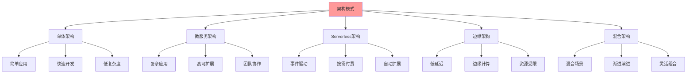
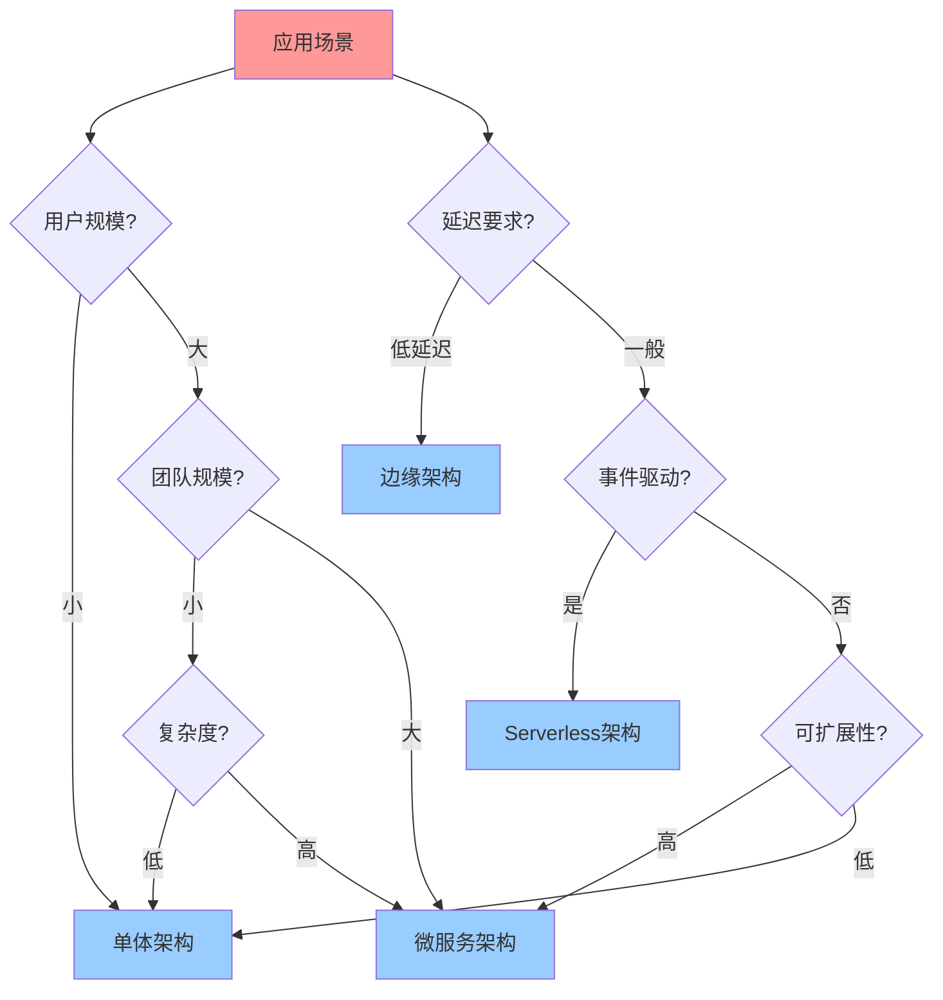

# 架构模式实践综合指南

## 📑 目录

- [架构模式实践综合指南](#架构模式实践综合指南)
  - [📑 目录](#-目录)
  - [1 架构模式全景](#1-架构模式全景)
  - [2 单体架构实践](#2-单体架构实践)
    - [2.1 适用场景](#21-适用场景)
    - [2.2 实践要点](#22-实践要点)
  - [3 微服务架构实践](#3-微服务架构实践)
    - [3.1 适用场景](#31-适用场景)
    - [3.2 实践要点](#32-实践要点)
  - [4 Serverless架构实践](#4-serverless架构实践)
    - [4.1 适用场景](#41-适用场景)
    - [4.2 实践要点](#42-实践要点)
  - [5 边缘架构实践](#5-边缘架构实践)
    - [5.1 适用场景](#51-适用场景)
    - [5.2 实践要点](#52-实践要点)
  - [6 架构模式选择决策树](#6-架构模式选择决策树)
  - [7 架构模式实践检查清单](#7-架构模式实践检查清单)
  - [8 使用指南](#8-使用指南)
    - [8.1 快速开始](#81-快速开始)
    - [8.2 架构模式实践应用](#82-架构模式实践应用)
    - [8.3 架构模式演进应用](#83-架构模式演进应用)
  - [9 使用技巧](#9-使用技巧)
    - [9.1 架构选择技巧](#91-架构选择技巧)
    - [9.2 实践要点技巧](#92-实践要点技巧)
  - [10 实践案例](#10-实践案例)
    - [10.1 微服务架构实践案例](#101-微服务架构实践案例)
    - [10.2 Serverless架构实践案例](#102-serverless架构实践案例)
  - [11 2025 年最新实践](#11-2025-年最新实践)
    - [11.1 架构模式实践综合指南应用最佳实践（2025）](#111-架构模式实践综合指南应用最佳实践2025)
  - [12 实际应用案例](#12-实际应用案例)
    - [案例 1：架构模式实践综合指南应用（2025）](#案例-1架构模式实践综合指南应用2025)
  - [13 相关文档](#13-相关文档)

---

## 1 架构模式全景



---

## 2 单体架构实践

### 2.1 适用场景

| 场景 | 特征 | 推荐度 |
|------|------|--------|
| **小型应用** | 用户量小、功能简单 | ⭐⭐⭐⭐⭐ |
| **快速原型** | 快速开发、快速验证 | ⭐⭐⭐⭐⭐ |
| **简单业务** | 业务逻辑简单、无复杂交互 | ⭐⭐⭐⭐ |
| **团队规模小** | 团队小、协作简单 | ⭐⭐⭐⭐ |

**推荐度说明**：

- **⭐⭐⭐⭐⭐**：强烈推荐
- **⭐⭐⭐⭐**：推荐
- **⭐⭐⭐**：可选

### 2.2 实践要点

| 实践要点 | 内容 | 重要性 | 推荐度 |
|---------|------|--------|--------|
| **模块化设计** | 模块划分、接口设计 | 高 | ⭐⭐⭐⭐⭐ |
| **代码规范** | 代码规范、代码审查 | 高 | ⭐⭐⭐⭐⭐ |
| **测试策略** | 单元测试、集成测试 | 高 | ⭐⭐⭐⭐⭐ |
| **部署策略** | 部署流程、回滚策略 | 中 | ⭐⭐⭐⭐ |
| **监控告警** | 监控设计、告警管理 | 中 | ⭐⭐⭐⭐ |

**推荐度说明**：

- **⭐⭐⭐⭐⭐**：强烈推荐
- **⭐⭐⭐⭐**：推荐
- **⭐⭐⭐**：可选

---

## 3 微服务架构实践

### 3.1 适用场景

| 场景 | 特征 | 推荐度 |
|------|------|--------|
| **大型应用** | 用户量大、功能复杂 | ⭐⭐⭐⭐⭐ |
| **多团队协作** | 团队多、独立开发 | ⭐⭐⭐⭐⭐ |
| **高可扩展** | 需要快速扩展、独立扩展 | ⭐⭐⭐⭐⭐ |
| **技术多样性** | 不同服务使用不同技术 | ⭐⭐⭐⭐ |

**推荐度说明**：

- **⭐⭐⭐⭐⭐**：强烈推荐
- **⭐⭐⭐⭐**：推荐
- **⭐⭐⭐**：可选

### 3.2 实践要点

| 实践要点 | 内容 | 重要性 | 推荐度 |
|---------|------|--------|--------|
| **服务划分** | 服务边界、服务职责 | 极高 | ⭐⭐⭐⭐⭐ |
| **服务通信** | 同步通信、异步通信 | 高 | ⭐⭐⭐⭐⭐ |
| **数据管理** | 数据一致性、数据隔离 | 高 | ⭐⭐⭐⭐⭐ |
| **服务治理** | 服务发现、负载均衡、熔断降级 | 高 | ⭐⭐⭐⭐⭐ |
| **监控可观测性** | 分布式追踪、日志聚合、指标监控 | 高 | ⭐⭐⭐⭐⭐ |
| **部署策略** | 容器化部署、CI/CD | 高 | ⭐⭐⭐⭐⭐ |
| **安全策略** | 服务间认证、API安全 | 高 | ⭐⭐⭐⭐⭐ |

**推荐度说明**：

- **⭐⭐⭐⭐⭐**：强烈推荐
- **⭐⭐⭐⭐**：推荐
- **⭐⭐⭐**：可选

---

## 4 Serverless架构实践

### 4.1 适用场景

| 场景 | 特征 | 推荐度 |
|------|------|--------|
| **事件驱动应用** | 事件触发、异步处理 | ⭐⭐⭐⭐⭐ |
| **突发流量** | 流量波动大、突发请求 | ⭐⭐⭐⭐⭐ |
| **按需付费** | 成本敏感、按需使用 | ⭐⭐⭐⭐⭐ |
| **无状态应用** | 无状态、快速启动 | ⭐⭐⭐⭐ |

**推荐度说明**：

- **⭐⭐⭐⭐⭐**：强烈推荐
- **⭐⭐⭐⭐**：推荐
- **⭐⭐⭐**：可选

### 4.2 实践要点

| 实践要点 | 内容 | 重要性 | 推荐度 |
|---------|------|--------|--------|
| **函数设计** | 函数粒度、函数职责 | 高 | ⭐⭐⭐⭐⭐ |
| **事件设计** | 事件格式、事件路由 | 高 | ⭐⭐⭐⭐⭐ |
| **冷启动优化** | 冷启动时间、预热策略 | 高 | ⭐⭐⭐⭐⭐ |
| **成本优化** | 资源使用、成本控制 | 中 | ⭐⭐⭐⭐ |
| **监控告警** | 函数监控、错误追踪 | 中 | ⭐⭐⭐⭐ |
| **安全策略** | 函数安全、访问控制 | 高 | ⭐⭐⭐⭐⭐ |

**推荐度说明**：

- **⭐⭐⭐⭐⭐**：强烈推荐
- **⭐⭐⭐⭐**：推荐
- **⭐⭐⭐**：可选

---

## 5 边缘架构实践

### 5.1 适用场景

| 场景 | 特征 | 推荐度 |
|------|------|--------|
| **低延迟要求** | 延迟敏感、实时响应 | ⭐⭐⭐⭐⭐ |
| **IoT应用** | 设备数据采集、边缘处理 | ⭐⭐⭐⭐⭐ |
| **CDN场景** | 内容分发、边缘缓存 | ⭐⭐⭐⭐ |
| **资源受限** | 资源受限、轻量级部署 | ⭐⭐⭐⭐ |

**推荐度说明**：

- **⭐⭐⭐⭐⭐**：强烈推荐
- **⭐⭐⭐⭐**：推荐
- **⭐⭐⭐**：可选

### 5.2 实践要点

| 实践要点 | 内容 | 重要性 | 推荐度 |
|---------|------|--------|--------|
| **边缘节点设计** | 节点选择、节点部署 | 高 | ⭐⭐⭐⭐⭐ |
| **数据同步** | 数据同步、数据一致性 | 高 | ⭐⭐⭐⭐⭐ |
| **资源管理** | 资源受限、资源优化 | 高 | ⭐⭐⭐⭐⭐ |
| **网络管理** | 网络不稳定、网络优化 | 高 | ⭐⭐⭐⭐⭐ |
| **监控管理** | 边缘监控、远程管理 | 中 | ⭐⭐⭐⭐ |
| **安全策略** | 边缘安全、数据安全 | 高 | ⭐⭐⭐⭐⭐ |

**推荐度说明**：

- **⭐⭐⭐⭐⭐**：强烈推荐
- **⭐⭐⭐⭐**：推荐
- **⭐⭐⭐**：可选

---

## 6 架构模式选择决策树



---

## 7 架构模式实践检查清单

| 检查项 | 检查内容 | 重要性 | 推荐度 |
|--------|---------|--------|--------|
| **场景分析** | 场景识别、场景特征、场景需求 | 极高 | ⭐⭐⭐⭐⭐ |
| **架构选择** | 架构评估、架构选择、架构验证 | 高 | ⭐⭐⭐⭐⭐ |
| **实践要点** | 实践要点识别、实践要点实施 | 高 | ⭐⭐⭐⭐⭐ |
| **效果评估** | 效果测量、效果分析、效果报告 | 中 | ⭐⭐⭐⭐ |

**推荐度说明**：

- **⭐⭐⭐⭐⭐**：强烈推荐
- **⭐⭐⭐⭐**：推荐
- **⭐⭐⭐**：可选

---

## 8 使用指南

### 8.1 快速开始

**适用场景**：架构模式选择、架构模式实践

**使用步骤**：

1. **场景分析**：分析应用场景的特征和需求
2. **架构选择**：根据场景选择合适的架构模式
3. **实践要点**：识别并实施架构模式的实践要点
4. **效果评估**：评估架构模式实践的效果

**推荐度**：⭐⭐⭐⭐⭐

---

### 8.2 架构模式实践应用

**适用场景**：实际项目中的架构模式实践

**使用步骤**：

1. **场景分析**：分析应用场景（用户量、团队规模、复杂度、延迟要求）
2. **架构选择**：使用架构模式选择决策树选择合适的架构模式
3. **实践要点识别**：识别架构模式的实践要点
4. **实践要点实施**：实施架构模式的实践要点
5. **效果评估**：评估架构模式实践的效果

**推荐度**：⭐⭐⭐⭐⭐

---

### 8.3 架构模式演进应用

**适用场景**：架构模式演进

**使用步骤**：

1. **现状评估**：评估当前架构模式
2. **演进需求**：分析架构演进需求
3. **演进路径**：选择架构演进路径
4. **演进实施**：分阶段实施架构演进

**推荐度**：⭐⭐⭐⭐⭐

---

## 9 使用技巧

### 9.1 架构选择技巧

**技巧1：场景匹配**

- 根据应用场景特征匹配架构模式
- 理解架构模式的适用场景
- 避免架构模式过度或不足

**技巧2：决策树应用**

- 使用架构模式选择决策树进行决策
- 理解决策树的分支逻辑
- 做出合理的架构选择

**推荐度**：⭐⭐⭐⭐⭐

---

### 9.2 实践要点技巧

**技巧1：要点识别**

- 准确识别架构模式的实践要点
- 理解要点的重要性和优先级
- 建立要点实施计划

**技巧2：要点实施**

- 分阶段实施实践要点
- 监控要点实施效果
- 持续优化要点实施

**推荐度**：⭐⭐⭐⭐⭐

---

## 10 实践案例

### 10.1 微服务架构实践案例

**场景**：为大型电商平台实施微服务架构

**实践过程**：

1. **场景分析**：
   - 用户量：大规模用户
   - 团队规模：大团队
   - 复杂度：高复杂度
   - 扩展需求：高扩展需求

2. **架构选择**：
   - 选择微服务架构（满足大规模、大团队、高扩展需求）

3. **实践要点识别**：
   - 服务拆分：按业务域拆分服务
   - 服务治理：使用服务网格
   - 数据管理：数据库分离
   - 部署策略：独立部署

4. **实践要点实施**：
   - 按业务域拆分服务
   - 使用Istio进行服务治理
   - 实施数据库分离
   - 建立独立部署流程

5. **效果评估**：
   - 系统可扩展性显著提升
   - 团队开发效率提升
   - 系统性能稳定

**效果**：成功实施微服务架构，系统可扩展性和团队效率显著提升

**推荐度**：⭐⭐⭐⭐⭐

---

### 10.2 Serverless架构实践案例

**场景**：为事件驱动应用实施Serverless架构

**实践过程**：

1. **场景分析**：
   - 用户量：中小规模用户
   - 事件驱动：事件驱动应用
   - 成本需求：按需付费
   - 扩展需求：自动扩展

2. **架构选择**：
   - 选择Serverless架构（满足事件驱动、按需付费、自动扩展需求）

3. **实践要点识别**：
   - 函数设计：无状态函数
   - 事件处理：事件驱动
   - 资源管理：按需分配
   - 监控告警：函数监控

4. **实践要点实施**：
   - 设计无状态函数
   - 实施事件驱动架构
   - 使用Firecracker进行资源管理
   - 建立函数监控体系

5. **效果评估**：
   - 成本显著降低
   - 系统自动扩展能力提升
   - 开发效率提升

**效果**：成功实施Serverless架构，成本显著降低，系统自动扩展能力提升

**推荐度**：⭐⭐⭐⭐⭐

---

## 11 2025 年最新实践

### 11.1 架构模式实践综合指南应用最佳实践（2025）

**2025 年趋势**：架构模式实践综合指南在模式应用、最佳实践、案例分析中的深度应用

**实践要点**：

- **模式应用**：系统化应用架构模式
- **最佳实践**：遵循架构模式最佳实践
- **案例分析**：学习成功案例的经验
- **持续改进**：基于实践效果持续改进

**代码示例**：

```python
# 2025 年架构模式实践综合指南工具
class ArchitecturePatternsPracticeGuideTool:
    def __init__(self):
        self.applicator = PatternApplicator()
        self.best_practices = BestPractices()
        self.case_analyzer = CaseAnalyzer()
        self.improver = PracticeImprover()

    def apply_pattern(self, pattern, context):
        """模式应用"""
        return self.applicator.apply(pattern, context)

    def get_best_practices(self, pattern):
        """获取最佳实践"""
        return self.best_practices.get(pattern)

    def analyze_case(self, case):
        """案例分析"""
        return self.case_analyzer.analyze(case)
```

## 12 实际应用案例

### 案例 1：架构模式实践综合指南应用（2025）

**场景**：使用架构模式实践综合指南实施 Serverless 架构

**实现方案**：

```python
# 架构模式实践综合指南应用
tool = ArchitecturePatternsPracticeGuideTool()

# 模式应用
pattern = Pattern(type="serverless", characteristics=["event_driven", "auto_scale"])
context = Context(domain="e-commerce", scale="high")
architecture = tool.apply_pattern(pattern, context)

# 获取最佳实践
practices = tool.get_best_practices(pattern)

# 案例分析
case = Case(type="serverless", domain="e-commerce", result="success")
analysis = tool.analyze_case(case)
```

**效果**：

- 模式应用：系统化应用模式，保证架构质量
- 最佳实践：遵循最佳实践，提高实践效果
- 案例分析：学习成功案例，避免常见错误
- 持续改进：基于实践改进，提高架构水平

---

## 13 相关文档

- **[架构认知地图](01-architecture-cognitive-map.md)** - 架构设计全景、架构模式、架构决策
- **[架构模式对比矩阵](03-architecture-patterns-matrix.md)** - 架构模式功能对比、适用场景、复杂度
- **[架构模式详细思维导图](04-architecture-patterns-detailed.md)** - 架构模式核心概念、架构模式详解、架构模式应用
- **[架构演进路径图](06-architecture-evolution-path.md)** - 架构演进全景、演进路径、演进决策

---

**最后更新**：2025-11-15
**文档状态**：✅ 完整 | 📊 包含架构模式实践综合指南、使用指南、使用技巧、实践案例 | 🎯 生产就绪
**维护者**：项目团队
