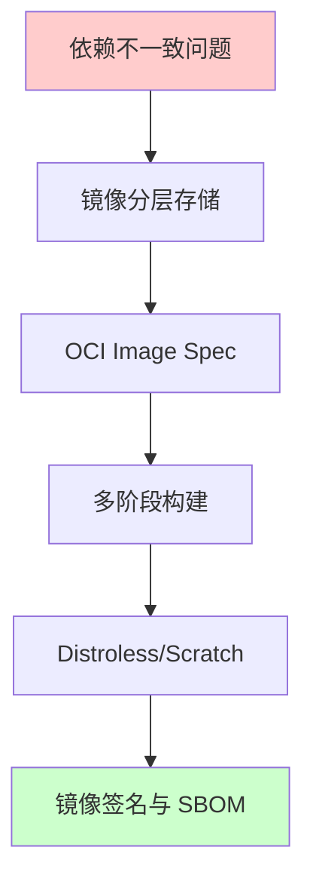
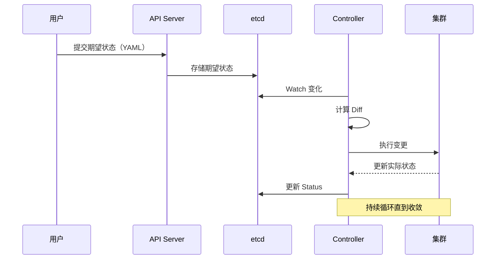
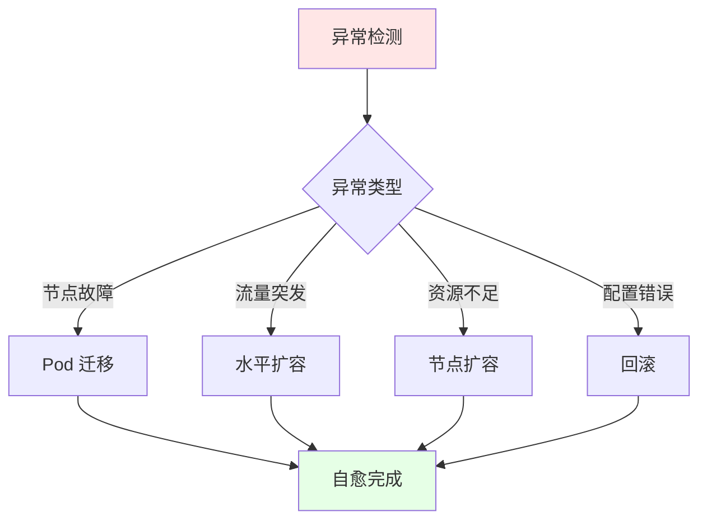
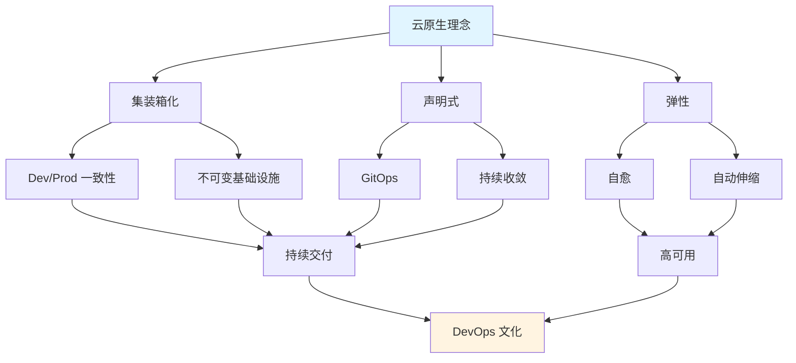

# 2. 理念层：云原生核心思想演进

## 目录

- [目录](#目录)
- [2.1 文档定位](#21-文档定位)
- [2.2 三大核心理念](#22-三大核心理念)
  - [2.2.1 集装箱化（Containerization）](#221-集装箱化containerization)
    - [2.2.1.1 问题域与核心思想](#2211-问题域与核心思想)
    - [2.2.1.2 技术实现路径](#2212-技术实现路径)
    - [2.2.1.3 演进路径分析](#2213-演进路径分析)
    - [2.2.1.4 技术场景与决策](#2214-技术场景与决策)
  - [2.2.2 声明式（Declarative）](#222-声明式declarative)
    - [2.2.2.1 问题域与核心思想](#2221-问题域与核心思想)
    - [2.2.2.2 控制循环原理](#2222-控制循环原理)
    - [2.2.2.3 声明式 vs 命令式](#2223-声明式-vs-命令式)
    - [2.2.2.4 技术场景与决策](#2224-技术场景与决策)
  - [2.2.3 弹性（Resilience）](#223-弹性resilience)
    - [2.2.3.1 问题域与核心思想](#2231-问题域与核心思想)
    - [2.2.3.2 弹性机制](#2232-弹性机制)
    - [2.2.3.3 弹性策略矩阵](#2233-弹性策略矩阵)
    - [2.2.3.4 技术场景与决策](#2234-技术场景与决策)
- [2.3 理念关联图](#23-理念关联图)
- [2.4 技术决策参考](#24-技术决策参考)
  - [2.4.1 何时选择声明式？](#241-何时选择声明式)
  - [2.4.2 何时需要弹性设计？](#242-何时需要弹性设计)
- [2.5 形式化总结](#25-形式化总结)
  - [2.5.1 理念关系式](#251-理念关系式)
  - [2.5.2 控制循环收敛定理](#252-控制循环收敛定理)
  - [2.5.3 弹性决策模型](#253-弹性决策模型)
- [2.6 参考](#26-参考)

---

## 2.1 文档定位

本文档阐述从"集装箱化"到"声明式宇宙"的核心理念演进，以及每种理念背后的技术实现路
径、技术场景分析、决策依据和决策思路。

**文档结构**：

- **理念演进**：从问题域到解决方案的完整路径
- **技术场景**：不同场景下的理念应用
- **决策依据**：选择特定理念的技术原因
- **决策思路**：如何根据场景选择理念

## 2.2 三大核心理念

### 2.2.1 集装箱化（Containerization）

#### 2.2.1.1 问题域与核心思想

**问题域**：依赖地狱、"在我机器能跑"、环境不一致

**核心思想**：将"应用+依赖+文件系统"打包成不可变镜像，实现一次构建、任意运行。

**问题域分析**：

1. **依赖地狱**：不同环境需要不同版本的依赖，难以管理
2. **环境不一致**：开发、测试、生产环境差异导致问题
3. **"在我机器能跑"**：本地能运行，部署后失败

**核心思想论证**：

- **镜像不变性**：镜像一旦构建，内容不可变，确保环境一致性
- **分层存储**：利用文件系统分层，实现镜像复用和体积优化
- **标准化格式**：OCI Image Spec 实现跨平台兼容

#### 2.2.1.2 技术实现路径



**技术实现分析**：

- **镜像分层存储**：解决镜像体积和复用问题
- **OCI Image Spec**：解决跨平台兼容问题
- **多阶段构建**：解决构建环境和运行环境分离问题
- **Distroless/Scratch**：解决镜像体积和安全问题
- **镜像签名与 SBOM**：解决镜像安全和供应链问题

#### 2.2.1.3 演进路径分析

| 阶段       | 解决方案              | 副作用           | 再演化       |
| ---------- | --------------------- | ---------------- | ------------ |
| **初期**   | 单层镜像（fat image） | 体积大、重复存储 | → 分层存储   |
| **标准化** | OCI Image Spec        | 格式碎片化       | → 统一规范   |
| **优化**   | 多阶段构建            | 构建复杂度       | → BuildKit   |
| **极致**   | Distroless/Scratch    | 调试困难         | → 调试工具链 |

**演进路径论证**：

1. **初期问题**：单层镜像体积大，无法复用基础层

   - **解决方案**：分层存储，共享基础层
   - **效果**：镜像体积减少 50-70%，构建速度提升

2. **标准化问题**：不同容器运行时格式不统一

   - **解决方案**：OCI Image Spec 统一标准
   - **效果**：跨平台兼容，生态系统统一

3. **优化问题**：构建工具和运行时环境混合

   - **解决方案**：多阶段构建，分离构建和运行环境
   - **效果**：最终镜像体积进一步减小 80-90%

4. **极致问题**：最小化镜像但调试困难
   - **解决方案**：Distroless/Scratch + 调试工具链
   - **效果**：平衡安全性和可调试性

#### 2.2.1.4 技术场景与决策

**场景 1：开发环境**:

**场景描述**：本地开发需要快速迭代和调试

**决策依据**：

- ✅ 需要快速构建和启动
- ✅ 需要调试能力
- ✅ 体积不是关键因素

**决策思路**：

```yaml
开发环境镜像策略:
  基础镜像: alpine/node:latest # 包含开发工具
  构建方式: 单阶段构建 # 简化构建流程
  镜像体积: 可接受较大 # 重点是开发效率
```

**场景 2：生产环境**:

**场景描述**：生产环境需要安全、小体积、快速启动

**决策依据**：

- ✅ 安全是最高优先级
- ✅ 镜像体积影响拉取时间
- ✅ 启动速度影响用户体验

**决策思路**：

```yaml
生产环境镜像策略:
  基础镜像: distroless 或 scratch # 最小化攻击面
  构建方式: 多阶段构建 # 分离构建和运行环境
  镜像签名: 必须签名 # 验证镜像完整性
  镜像体积: 最小化 # 减少拉取时间
```

**场景 3：CI/CD 环境**:

**场景描述**：CI/CD 需要快速构建和可重复性

**决策依据**：

- ✅ 构建速度是关键
- ✅ 可重复性是必须
- ✅ 缓存利用最大化

**决策思路**：

```yaml
CI/CD 镜像策略:
  构建工具: BuildKit # 并行构建和缓存优化
  缓存策略: 分层缓存 # 最大化缓存命中率
  多阶段构建: 必须使用 # 分离构建和运行环境
```

**技术场景对比**：

| 场景         | 优先级              | 镜像策略              | 决策依据         |
| ------------ | ------------------- | --------------------- | ---------------- |
| **开发环境** | 开发效率 > 体积     | 单阶段 + 完整基础镜像 | 快速迭代需要     |
| **生产环境** | 安全 > 体积 > 速度  | 多阶段 + Distroless   | 安全性和体积优先 |
| **CI/CD**    | 构建速度 > 可重复性 | BuildKit + 多阶段     | 缓存和并行化     |

### 2.2.2 声明式（Declarative）

#### 2.2.2.1 问题域与核心思想

**问题域**：命令式脚本不可回滚、不可并发、难以复用

**核心思想**：只提交"期望状态"，系统通过控制循环持续 diff→ 收敛，自动达到期望状
态。

**问题域分析**：

1. **不可回滚**：命令式操作难以恢复到之前状态
2. **不可并发**：命令式操作需要顺序执行，无法并发
3. **难以复用**：命令式脚本高度耦合环境，难以复用

**核心思想论证**：

- **期望状态驱动**：系统持续比较期望状态和实际状态，自动收敛
- **幂等性保证**：声明式操作天然幂等，可重复执行
- **版本控制友好**：YAML 配置可纳入版本控制，实现配置即代码

#### 2.2.2.2 控制循环原理



**控制循环分析**：

1. **期望状态提交**：用户提交 YAML 配置，API Server 验证并存储到 etcd
2. **实际状态监听**：Controller 通过 Watch 监听 etcd 变化
3. **Diff 计算**：Controller 计算期望状态和实际状态的差异
4. **执行变更**：Controller 执行必要的操作使实际状态趋向期望状态
5. **状态更新**：Controller 更新实际状态到 etcd
6. **循环收敛**：重复上述过程直到实际状态 = 期望状态

**收敛性论证**：

- **收敛性定理**：在有限时间内，实际状态会收敛到期望状态
- **证明思路**：Controller 每次操作都会减小期望状态和实际状态的差异
- **收敛条件**：资源可用、网络连通、控制器运行正常

#### 2.2.2.3 声明式 vs 命令式

| 维度         | 命令式              | 声明式                        |
| ------------ | ------------------- | ----------------------------- |
| **表达方式** | `kubectl run nginx` | `kubectl apply -f nginx.yaml` |
| **可回滚性** | 困难                | 天然支持                      |
| **幂等性**   | 需手动保证          | 内置保证                      |
| **并发安全** | 需锁机制            | 资源级锁                      |
| **学习曲线** | 平缓                | 陡峭                          |

**对比分析**：

- **表达方式**：命令式更直观，声明式需要学习 YAML
- **可回滚性**：声明式可保存历史配置，命令式难以追溯
- **幂等性**：声明式天然幂等，命令式需要额外处理
- **并发安全**：声明式通过资源级锁保证，命令式需要应用层锁
- **学习曲线**：命令式学习成本低，声明式学习成本高但长期收益大

#### 2.2.2.4 技术场景与决策

**场景 1：单次操作**:

**场景描述**：需要执行一次性的运维操作

**决策依据**：

- ✅ 操作简单，不需要状态管理
- ✅ 不需要回滚能力
- ✅ 不需要版本控制

**决策思路**：

```yaml
单次操作策略:
  方式: 命令式 (kubectl run/exec)
  原因: 简单直接，学习成本低
  适用: 调试、临时操作
```

**场景 2：长期管理**:

**场景描述**：需要长期管理和版本控制的配置

**决策依据**：

- ✅ 需要版本控制
- ✅ 需要回滚能力
- ✅ 需要团队协作

**决策思路**：

```yaml
长期管理策略:
  方式: 声明式 (kubectl apply)
  原因: 版本控制、回滚、协作
  适用: 生产环境、团队协作
```

**场景 3：多环境部署**:

**场景描述**：需要在 Dev/Staging/Prod 环境部署相同应用

**决策依据**：

- ✅ 配置需要复用
- ✅ 环境差异需要管理
- ✅ 部署流程需要自动化

**决策思路**：

```yaml
多环境部署策略:
  方式: 声明式 + Helm/Kustomize
  原因: 配置复用、环境差异管理
  适用: CI/CD、多租户
```

**技术场景对比**：

| 场景           | 操作类型      | 决策依据       | 工具选择         |
| -------------- | ------------- | -------------- | ---------------- |
| **单次操作**   | 命令式        | 简单直接       | kubectl run/exec |
| **长期管理**   | 声明式        | 版本控制、回滚 | kubectl apply    |
| **多环境部署** | 声明式 + 模板 | 配置复用       | Helm/Kustomize   |

### 2.2.3 弹性（Resilience）

#### 2.2.3.1 问题域与核心思想

**问题域**：节点故障、流量突发、网络分区

**核心思想**：系统具备自愈、水平伸缩、故障隔离能力，自动应对异常情况。

**问题域分析**：

1. **节点故障**：硬件故障、网络中断、进程崩溃
2. **流量突发**：流量突然增加，超出系统容量
3. **网络分区**：部分节点无法通信，导致服务分裂

**核心思想论证**：

- **自愈机制**：系统自动检测故障并恢复服务
- **水平伸缩**：根据负载自动增加或减少实例
- **故障隔离**：故障不影响其他服务，保证系统整体可用性

#### 2.2.3.2 弹性机制



**弹性机制分析**：

1. **异常检测**：通过健康检查、监控指标、事件监听检测异常
2. **故障处理**：根据异常类型选择处理策略
3. **恢复验证**：验证恢复效果，确保系统恢复正常

#### 2.2.3.3 弹性策略矩阵

| 异常场景     | 检测机制           | 自动响应           | 人工介入   |
| ------------ | ------------------ | ------------------ | ---------- |
| **节点故障** | Node 心跳检测      | Pod 迁移到健康节点 | 修复节点   |
| **流量突发** | HPA 指标监控       | 自动扩容 Pod       | 调整策略   |
| **资源不足** | Cluster Autoscaler | 添加节点           | 节点池配置 |
| **配置错误** | 健康检查失败       | 回滚到上一版本     | 修复配置   |

**弹性策略论证**：

- **节点故障**：通过 Node Controller 检测节点状态，自动迁移 Pod
- **流量突发**：通过 HPA 监控 CPU/内存/QPS，自动扩容 Pod
- **资源不足**：通过 Cluster Autoscaler 监控资源使用，自动添加节点
- **配置错误**：通过健康检查检测 Pod 状态，自动回滚配置

#### 2.2.3.4 技术场景与决策

**场景 1：无状态服务**:

**场景描述**：无状态服务可以快速扩容和迁移

**决策依据**：

- ✅ Pod 可以任意迁移
- ✅ 扩容速度快
- ✅ 故障恢复时间短

**决策思路**：

```yaml
无状态服务策略:
  副本数: 最小 3 个 (高可用)
  HPA: 基于 CPU/内存/QPS
  PDB: 允许 100% Pod 中断
  恢复时间: < 30s
```

**场景 2：有状态服务**:

**场景描述**：有状态服务需要数据持久化和有序迁移

**决策依据**：

- ✅ 需要持久化存储
- ✅ 迁移需要顺序处理
- ✅ 故障恢复时间较长

**决策思路**：

```yaml
有状态服务策略:
  副本数: 奇数个 (Raft 共识)
  StatefulSet: 有序部署和迁移
  PDB: 最多中断 1 个 Pod
  恢复时间: < 5min
```

**场景 3：关键服务**:

**场景描述**：关键服务需要零停机时间

**决策依据**：

- ✅ 不能有服务中断
- ✅ 需要滚动更新
- ✅ 需要健康检查

**决策思路**：

```yaml
关键服务策略:
  副本数: 最小 5 个 (冗余)
  PDB: 最多中断 20% Pod
  滚动更新: maxSurge=2, maxUnavailable=0
  健康检查: 必须配置
  恢复时间: < 10s
```

**技术场景对比**：

| 场景           | 副本策略  | 伸缩策略         | 故障恢复时间 |
| -------------- | --------- | ---------------- | ------------ |
| **无状态服务** | 最小 3 个 | HPA 快速扩容     | < 30s        |
| **有状态服务** | 奇数个    | StatefulSet 有序 | < 5min       |
| **关键服务**   | 最小 5 个 | 滚动更新 + PDB   | < 10s        |

## 2.3 理念关联图



**理念关联分析**：

- **集装箱化** → **Dev/Prod 一致性** → **持续交付**
- **声明式** → **GitOps** → **持续交付**
- **弹性** → **高可用** → **DevOps 文化**

## 2.4 技术决策参考

### 2.4.1 何时选择声明式？

**决策依据**：

- ✅ 需要版本控制配置
- ✅ 需要回滚能力
- ✅ 多环境部署（Dev/Staging/Prod）
- ✅ 配置需要多人协作

**决策思路**：

```yaml
选择声明式的条件:
  if 需要版本控制: 选择声明式
  elif 需要回滚: 选择声明式
  elif 多环境部署: 选择声明式
  else: 选择命令式
```

### 2.4.2 何时需要弹性设计？

**决策依据**：

- ✅ 生产环境部署
- ✅ 流量波动大
- ✅ 成本敏感（按需扩容）
- ✅ SLA 要求高

**决策思路**：

```yaml
需要弹性设计的条件:
  if 生产环境: 必须弹性设计
  elif 流量波动 > 50%: 建议弹性设计
  elif SLA > 99.9%: 必须弹性设计
  else: 可选弹性设计
```

## 2.5 形式化总结

### 2.5.1 理念关系式

设理念为 $P = \{C, D, R\}$，其中：

- $C$ = 集装箱化（Containerization）
- $D$ = 声明式（Declarative）
- $R$ = 弹性（Resilience）

**关系定义**：

- $C \rightarrow D$：集装箱化是声明式的基础
- $D \rightarrow R$：声明式是弹性的前提
- $C \land D \land R$：三者结合实现云原生

### 2.5.2 控制循环收敛定理

**定理 2.1**（控制循环收敛）：在有限时间内，实际状态 $S_a$ 会收敛到期望状态
$S_e$。

$$\lim_{t \to \infty} |S_a(t) - S_e(t)| = 0$$

**证明**：

1. Controller 每次操作都会减小 $|S_a(t) - S_e(t)|$
2. 在资源可用的情况下，差异会单调递减
3. 当 $|S_a(t) - S_e(t)| < \epsilon$ 时，系统达到收敛状态

$\square$

### 2.5.3 弹性决策模型

**模型定义**：弹性决策函数

$$
E(S, L, R) = \begin{cases}
\text{HPA} & \text{if } L > L_{\text{threshold}} \land S = \text{stateless} \\
\text{CA} & \text{if } R < R_{\text{threshold}} \\
\text{PDB} & \text{if } S = \text{critical} \\
\text{None} & \text{otherwise}
\end{cases}
$$

其中：

- $S$ = 服务类型（stateless/stateful/critical）
- $L$ = 负载指标
- $R$ = 资源使用率

## 2.6 参考

[declarative]:
[Kubernetes 声明式 API](https://kubernetes.io/docs/concepts/overview/working-with-objects/object-management/)

[resilience]:
[Kubernetes 弹性设计](https://kubernetes.io/docs/tasks/run-application/run-stateless-application-deployment/)

> 完整参考列表见 [REFERENCES.md](../REFERENCES.md)
