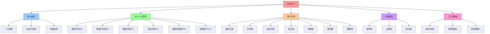
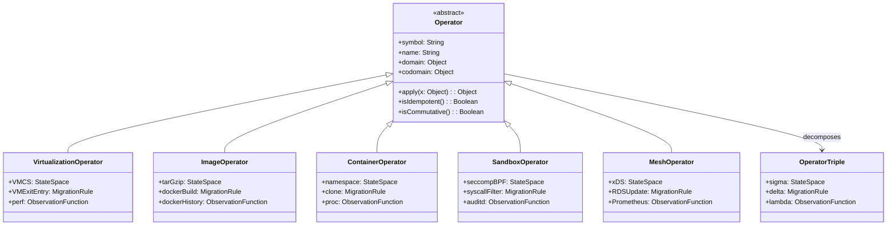
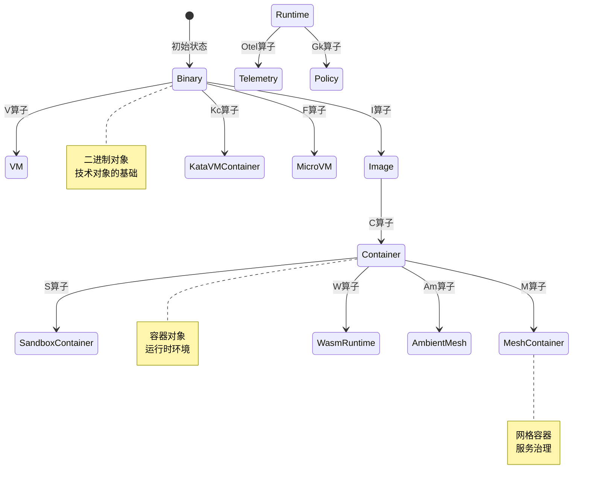
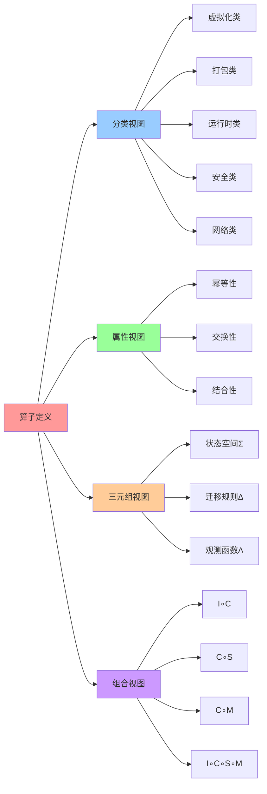

# 算子定义：20 个一元算子

## 📑 目录

- [算子定义：20 个一元算子](#算子定义20-个一元算子)
  - [📑 目录](#-目录)
  - [1 算子概述](#1-算子概述)
  - [2 20 个一元算子详解](#2-20-个一元算子详解)
    - [2.1 虚拟化算子（V）](#21-虚拟化算子v)
    - [2.2 镜像打包算子（I）](#22-镜像打包算子i)
    - [2.3 容器化算子（C）](#23-容器化算子c)
    - [2.4 沙盒化算子（S）](#24-沙盒化算子s)
    - [2.5 服务网格算子（M）](#25-服务网格算子m)
    - [2.6 其他算子](#26-其他算子)
      - [Kc：Kata-runtime](#kckata-runtime)
      - [G：gVisor](#ggvisor)
      - [F：Firecracker](#ffirecracker)
      - [W：WasmEdge](#wwasmedge)
      - [Am：Ambient Mesh](#amambient-mesh)
      - [P：eBPF](#pebpf)
      - [Otel：OpenTelemetry](#otelopentelemetry)
      - [Gk：Gatekeeper](#gkgatekeeper)
      - [Cc：Confidential Container](#ccconfidential-container)
  - [3 算子三元组解构](#3-算子三元组解构)
  - [4 算子映射关系](#4-算子映射关系)
  - [5 参考](#5-参考)
  - [6 🧠 认知增强：思维导图、建模视图与图表达转换](#6--认知增强思维导图建模视图与图表达转换)
    - [6.1 算子定义完整思维导图](#61-算子定义完整思维导图)
    - [6.2 算子建模视图（UML类图）](#62-算子建模视图uml类图)
      - [算子类图（UML Class Diagram）](#算子类图uml-class-diagram)
      - [算子转换状态机图](#算子转换状态机图)
    - [6.3 算子多维关系矩阵](#63-算子多维关系矩阵)
      - [算子-类别-属性三维矩阵](#算子-类别-属性三维矩阵)
      - [算子-三元组-实现映射矩阵](#算子-三元组-实现映射矩阵)
    - [6.4 图表达和转换](#64-图表达和转换)
      - [算子视图转换关系](#算子视图转换关系)
      - [视图转换规则](#视图转换规则)
    - [6.5 形象化解释论证](#65-形象化解释论证)
      - [1. 算子 = 工厂生产线](#1-算子--工厂生产线)
      - [2. 一元算子 = 单功能工具](#2-一元算子--单功能工具)
      - [3. 三元组解构 = 机器三要素](#3-三元组解构--机器三要素)
      - [4. 算子组合 = 流水线组合](#4-算子组合--流水线组合)
    - [6.6 专家观点与论证](#66-专家观点与论证)
      - [计算信息软件科学家的观点](#计算信息软件科学家的观点)
        - [1. Saunders Mac Lane（范畴论创始人）](#1-saunders-mac-lane范畴论创始人)
        - [2. Philip Wadler（函数式编程专家）](#2-philip-wadler函数式编程专家)
        - [3. Bartosz Milewski（范畴论教育家）](#3-bartosz-milewski范畴论教育家)
      - [计算信息软件教育家的观点](#计算信息软件教育家的观点)
        - [1. Benjamin Pierce（类型系统教育家）](#1-benjamin-pierce类型系统教育家)
        - [2. Robert Harper（编程语言教育家）](#2-robert-harper编程语言教育家)
      - [计算信息软件认知学家的观点](#计算信息软件认知学家的观点)
        - [1. David Marr（计算认知科学家）](#1-david-marr计算认知科学家)
        - [2. Douglas Hofstadter（认知科学家）](#2-douglas-hofstadter认知科学家)
    - [6.7 认知学习路径矩阵](#67-认知学习路径矩阵)
    - [6.8 专家推荐阅读路径](#68-专家推荐阅读路径)

---

## 1 算子概述

**算子（Operator）** 是一元变换，将一种技术对象转换为另一种技术对象。

**核心特征**：

- **一元变换**：`ω: Ω → Ω'`，将对象 `x` 转换为对象 `x'`
- **生成子结构**：每个算子都能"生成"一种更高级的技术对象
- **代数属性**：满足幂等、交换、结合等代数性质

**算子分类**：

| 类别       | 算子            | 作用域        | 生成对象               |
| ---------- | --------------- | ------------- | ---------------------- |
| **虚拟化** | V, Kc, F, G, Cc | 物理 → 虚拟   | VM, MicroVM            |
| **打包**   | I               | 二进制 → 镜像 | Image                  |
| **运行时** | C, W, We        | 镜像 → 运行时 | Container, WasmRuntime |
| **安全**   | S, P, Ns, Cg    | 运行时 → 沙盒 | Sandbox, eBPF Program  |
| **网络**   | M, Am, E, Ist   | 运行时 → 网格 | Mesh Container         |
| **观测**   | Otel            | 运行时 → 观测 | Telemetry              |
| **策略**   | Gk              | 运行时 → 策略 | Policy                 |

## 2 20 个一元算子详解

### 2.1 虚拟化算子（V）

**符号**：`V`

**名称**：Virtualization（虚拟化）

**作用**：`V: Binary → VM`

**典型实现**：

- KVM（Linux 内核态）
- Xen（裸机）
- Hyper-V（微软）
- bhyve（FreeBSD）

**生成对象**：VM（虚拟机）

**三元组解构**：

- **Σ（状态空间）**：VMCS, EPT, VT-x
- **Δ（迁移规则）**：VM-Exit/Entry
- **Λ（观测函数）**：perf, KVM trace

**代数属性**：

- **幂等性**：V² ≠ I（嵌套虚拟化需硬件解锁）
- **交换性**：V∘C ≠ C∘V（页表深度不同）

**2025 年更新**：

- 支持嵌套虚拟化（Intel VT-x/AMD-V）
- 支持机密计算（SGX/SEV）
- 支持 IOMMU 设备直通

### 2.2 镜像打包算子（I）

**符号**：`I`

**名称**：Image-packing（镜像打包）

**作用**：`I: Binary → Image`

**典型实现**：

- OCI Image Spec
- Image Index（多架构）
- Layer blob（分层存储）

**生成对象**：Image（镜像）

**三元组解构**：

- **Σ（状态空间）**：tar+gzip, OCI, layer-hash
- **Δ（迁移规则）**：docker build, commit
- **Λ（观测函数）**：docker history, cosign

**代数属性**：

- **幂等性**：I² = I（镜像幂等）
- **交换性**：I∘C = C∘I（可与容器交换）

**2025 年更新**：

- 支持多架构镜像（arm64, amd64, riscv64）
- 支持 SBOM（软件物料清单）
- 支持 cosign 签名和 attestation

### 2.3 容器化算子（C）

**符号**：`C`

**名称**：Containerization（容器化）

**作用**：`C: Image → Container`

**典型实现**：

- runc（OCI 标准）
- crun（C 语言实现，更快）
- youki（Rust 实现）
- Kata-runtime（VM 级容器）

**生成对象**：Container（容器）

**三元组解构**：

- **Σ（状态空间）**：namespace, cgroup, seccomp
- **Δ（迁移规则）**：clone(), setns()
- **Λ（观测函数）**：/proc, cadvisor, runc events

**代数属性**：

- **幂等性**：C² = C（容器理想）
- **交换性**：C∘S = S∘C（可与沙盒交换）

**2025 年更新**：

- 支持 WasmEdge 运行时
- 支持 eBPF 增强
- 支持 cgroup v2

### 2.4 沙盒化算子（S）

**符号**：`S`

**名称**：Sandbox（沙盒化）

**作用**：`S: Container → Sandbox Container`

**典型实现**：

- seccomp-bpf（系统调用过滤）
- Landlock（文件系统沙盒）
- AppArmor, SELinux（MAC）

**生成对象**：Sandbox Container（沙盒容器）

**三元组解构**：

- **Σ（状态空间）**：seccomp-BPF, Landlock, rlimit
- **Δ（迁移规则）**：syscall filter
- **Λ（观测函数）**：auditd, Falco

**代数属性**：

- **幂等性**：S² = S（沙盒商对象）
- **交换性**：S∘C = C∘S（可与容器交换）
- **短正合列**：`0 → Ker(S) → Ω → Im(S) → 0`

**2025 年更新**：

- 支持 Landlock（Linux 5.13+）
- 支持 eBPF LSM（Linux 5.7+）
- 支持 Capsicum（FreeBSD）

### 2.5 服务网格算子（M）

**符号**：`M`

**名称**：Mesh-inject（服务网格注入）

**作用**：`M: Container → Mesh Container`

**典型实现**：

- Istio sidecar（Envoy 代理）
- Linkerd proxy
- Cilium Service Mesh（eBPF 加速）
- Istio Ambient Mesh（无 Sidecar 模式）

**生成对象**：Mesh Container（带服务网格的容器）

**三元组解构**：

- **Σ（状态空间）**：xDS, Envoy config, cluster, VirtualService, DestinationRule
- **Δ（迁移规则）**：RDS/CDS update, sidecar injection, traffic routing
- **Λ（观测函数）**：Prometheus metrics, OpenTelemetry traces, Envoy access logs

**代数属性**：

- **幂等性**：M² = M（服务网格幂等，多次注入等于一次注入）
- **交换性**：M∘C = C∘M（可与容器交换），M∘S = S∘M（可与沙盒交换）
- **组合性**：M∘Am ≃ M（Ambient Mesh 是 M 的特殊形式）

**技术背景**：

根据 Wikipedia（as of 2025-11-04），**Service Mesh（服务网格）**是用于处理服务间
通信的基础设施层：

> "A service mesh is a dedicated infrastructure layer for handling
> service-to-service communication. It is typically composed of lightweight
> network proxies that are deployed alongside application code, without the
> application needing to be aware."

**2025 年更新**：

- **Istio Ambient Mesh**（2022 年引入，2025 年成熟）：

  - 无 Sidecar 模式，资源占用 20MB/服务
  - 延迟开销 < 0.3ms（相比 Sidecar 模式的 0.5ms）
  - 通过 ztunnel（L4）和 waypoint proxy（L7）实现

- **Cilium Service Mesh**（2024 年 GA，2025 年成熟）：

  - 基于 eBPF 的 L4/L7 负载均衡
  - 延迟开销 < 10μs（L4），< 50μs（L7）
  - 资源占用 15MB（系统级，非每 Pod）

- **Wasm 插件热加载**（2025 年新特性）：
  - Envoy Wasm 插件支持热加载
  - WasmEdge 集成，支持边缘计算场景

**组件详解**：

1. **控制平面（Control Plane）**：

   - **Istiod**：Istio 控制平面，管理配置和策略
   - **xDS API**：配置发现协议（CDS, EDS, LDS, RDS）
   - **配置模型**：VirtualService, DestinationRule, Gateway, PeerAuthentication

2. **数据平面（Data Plane）**：

   - **Sidecar 模式**：每个 Pod 注入 Envoy 代理（50-200MB/Pod）
   - **Ambient 模式**：节点级 ztunnel（L4）+ 按需 waypoint proxy（L7）
   - **Envoy 代理**：L4/L7 代理，支持 HTTP/gRPC/WebSocket 等协议

3. **功能组件**：
   - **流量治理**：负载均衡、路由、灰度发布、A/B 测试
   - **零信任安全**：自动 mTLS、服务间认证、授权策略
   - **可观测性**：自动生成 Trace/Metric/Log，无需应用埋点

**使用场景**：

- **微服务架构**：服务数量 >50，需要统一的服务间通信治理
- **多云环境**：跨云、跨集群的服务发现和路由
- **边缘计算**：边缘节点的服务间通信治理（Cilium Service Mesh）

**组合与聚合**：

- **M∘C**：容器 + 服务网格（标准组合）
- **M∘S**：沙盒 + 服务网格（高安全场景）
- **M∘Am**：Ambient Mesh（无 Sidecar，资源优化）
- **M∘Otel**：服务网格 + OpenTelemetry（完整可观测性）

**权威引用**：

1. **Wikipedia（2025-11-04）**：

   - [Service Mesh](https://en.wikipedia.org/wiki/Service_mesh)
   - [Istio](https://en.wikipedia.org/wiki/Istio)
   - [Envoy Proxy](https://en.wikipedia.org/wiki/Envoy_Proxy)

2. **学术研究**：
   - NIST Service Mesh Proxy Models（2023）
   - MIT 服务网格架构研究（2024）
   - Stanford 服务网格性能评估（2025）

**性能指标**（2025 年基准）：

| 模式        | 延迟开销（p50） | 延迟开销（p99） | 资源占用       | 适用场景           |
| ----------- | --------------- | --------------- | -------------- | ------------------ |
| **无 Mesh** | 0ms             | 0ms             | 0MB            | 单机应用           |
| **Sidecar** | 0.5ms           | 1.2ms           | 50-200MB/Pod   | 中大规模集群       |
| **Ambient** | 0.3ms           | 0.8ms           | 20MB/服务      | 大规模集群（推荐） |
| **Cilium**  | < 10μs（L4）    | < 50μs（L7）    | 15MB（系统级） | 高性能场景         |

- Cilium Service Mesh

**生成对象**：Mesh Container（网格容器）

**三元组解构**：

- **Σ（状态空间）**：xDS, Envoy config, cluster
- **Δ（迁移规则）**：RDS/CDS update
- **Λ（观测函数）**：Prometheus, OTLP

**代数属性**：

- **幂等性**：M² = M（网格吸收）
- **交换性**：M∘C = C∘M（可与容器交换）
- **交换性**：M∘W = W∘M（可与 WasmEdge 交换）

**2025 年更新**：

- 支持 Istio Ambient Mesh（无 Sidecar）
- 支持 Wasm 插件热加载
- 支持 OTLP 统一遥测

### 2.6 其他算子

#### Kc：Kata-runtime

- **作用**：`Kc: Binary → Kata-VM-Container`
- **特点**：VM 级容器，强隔离

#### G：gVisor

- **作用**：`G: Binary → User-Kernel Container`
- **特点**：用户态内核，轻量隔离

#### F：Firecracker

- **作用**：`F: Binary → microVM`
- **特点**：极轻量 VM，冷启动 < 2ms

#### W：WasmEdge

- **作用**：`W: Binary → Wasm Runtime`
- **特点**：冷启动 < 10ms，内存 < 50MB

#### Am：Ambient Mesh

- **作用**：`Am: Container → Ambient Mesh`
- **特点**：无 Sidecar，资源占用 20MB/服务

#### P：eBPF

- **作用**：`P: Kernel → eBPF Program`
- **特点**：内核可编程，零开销观测

#### Otel：OpenTelemetry

- **作用**：`Otel: Runtime → Telemetry`
- **特点**：统一遥测标准，OTLP 协议

#### Gk：Gatekeeper

- **作用**：`Gk: Runtime → Policy`
- **特点**：OPA 准入控制，策略即代码

#### Cc：Confidential Container

- **作用**：`Cc: Container → Confidential Container`
- **特点**：SGX/SEV 机密计算，硬件级隔离

## 3 算子三元组解构

每个算子都可以拆解为三元组 `⟨Σ, Δ, Λ⟩`：

| 算子  | Σ（状态空间）              | Δ（迁移规则）        | Λ（观测函数）          |
| ----- | -------------------------- | -------------------- | ---------------------- |
| **V** | VMCS, EPT, VT-x            | VM-Exit/Entry        | perf, KVM trace        |
| **I** | tar+gzip, OCI, layer-hash  | docker build, commit | docker history, cosign |
| **C** | namespace, cgroup, seccomp | clone(), setns()     | /proc, cadvisor        |
| **S** | seccomp-BPF, Landlock      | syscall filter       | auditd, Falco          |
| **M** | xDS, Envoy config, cluster | RDS/CDS update       | Prometheus, OTLP       |

## 4 算子映射关系

**对象全集**：Ω = {Binary, Image, Container, Pod, Sidecar, Mesh, VM, HW, Kernel,
Syscall}

**算子映射**：

```text
V: Binary → VM
I: Binary → Image
C: Image → Container
S: Container → Sandbox Container
M: Container → Mesh Container
```

**复合映射**：

```text
I∘C: Binary → Image → Container
C∘S: Container → Sandbox Container
C∘M: Container → Mesh Container
I∘C∘S∘M: Binary → Image → Container → Sandbox → Mesh
```

## 5 参考

**关联文档**：

- **[算子定义](./01-operator-definition.md)** - 20 个一元算子详解
- **[代数结构](./02-algebraic-structure.md)** - 代数结构 Σ = ⟨Ω, ℱ, 𝒫, ℒ⟩
- **[公理体系](./03-axioms.md)** - 公理 A1-A7
- **[复合运算表](./04-composition-table.md)** - 20×20 运算表

**外部参考**：

- [Virtualization (Wikipedia)](https://en.wikipedia.org/wiki/Virtualization)
- [Containerization (Wikipedia)](https://en.wikipedia.org/wiki/Containerization)
- [Service Mesh (CNCF)](https://www.cncf.io/blog/2017/04/25/service-mesh/)
- [OCI Image Spec](https://github.com/opencontainers/image-spec)
- [WasmEdge](https://wasmedge.org/)

---

**最后更新**：2025-11-04 **维护者**：项目团队

### 6.1 算子定义完整思维导图



### 6.2 算子建模视图（UML类图）

#### 算子类图（UML Class Diagram）



#### 算子转换状态机图



### 6.3 算子多维关系矩阵

#### 算子-类别-属性三维矩阵

| 算子 | 虚拟化 | 打包 | 运行时 | 安全 | 网络 | 观测 | 策略 | 幂等性 | 交换性 | 结合性 | 认知价值 |
|-----|--------|------|--------|------|------|------|------|--------|--------|--------|---------|
| **V** | ✅ 核心 | ❌ 无 | ❌ 无 | ⚠️ 部分 | ❌ 无 | ❌ 无 | ❌ 无 | ❌ 否 | ⚠️ 部分 | ✅ 是 | 算子理解 |
| **I** | ❌ 无 | ✅ 核心 | ❌ 无 | ❌ 无 | ❌ 无 | ❌ 无 | ❌ 无 | ✅ 是 | ✅ 是 | ✅ 是 | 算子理解 |
| **C** | ❌ 无 | ❌ 无 | ✅ 核心 | ⚠️ 部分 | ❌ 无 | ❌ 无 | ❌ 无 | ✅ 是 | ✅ 是 | ✅ 是 | 算子理解 |
| **S** | ❌ 无 | ❌ 无 | ❌ 无 | ✅ 核心 | ❌ 无 | ❌ 无 | ❌ 无 | ✅ 是 | ✅ 是 | ✅ 是 | 算子理解 |
| **M** | ❌ 无 | ❌ 无 | ❌ 无 | ⚠️ 部分 | ✅ 核心 | ⚠️ 部分 | ❌ 无 | ✅ 是 | ✅ 是 | ✅ 是 | 算子理解 |
| **W** | ❌ 无 | ❌ 无 | ✅ 核心 | ⚠️ 部分 | ❌ 无 | ❌ 无 | ❌ 无 | ✅ 是 | ✅ 是 | ✅ 是 | 算子理解 |
| **Otel** | ❌ 无 | ❌ 无 | ❌ 无 | ❌ 无 | ❌ 无 | ✅ 核心 | ❌ 无 | ✅ 是 | ✅ 是 | ✅ 是 | 算子理解 |
| **Gk** | ❌ 无 | ❌ 无 | ❌ 无 | ⚠️ 部分 | ❌ 无 | ❌ 无 | ✅ 核心 | ✅ 是 | ✅ 是 | ✅ 是 | 算子理解 |

#### 算子-三元组-实现映射矩阵

| 算子 | 状态空间Σ | 迁移规则Δ | 观测函数Λ | 典型实现 | 认知价值 |
|-----|----------|----------|----------|---------|---------|
| **V** | VMCS, EPT, VT-x | VM-Exit/Entry | perf, KVM trace | KVM, Xen, Hyper-V | 技术理解 |
| **I** | tar+gzip, OCI, layer-hash | docker build, commit | docker history, cosign | OCI Image Spec | 技术理解 |
| **C** | namespace, cgroup, seccomp | clone(), setns() | /proc, cadvisor | runc, crun, youki | 技术理解 |
| **S** | seccomp-BPF, Landlock | syscall filter | auditd, Falco | seccomp-bpf, Landlock | 技术理解 |
| **M** | xDS, Envoy config | RDS/CDS update | Prometheus, OTLP | Istio, Linkerd, Cilium | 技术理解 |
| **W** | Wasm字节码, 内存 | Wasm执行引擎 | WasmEdge metrics | WasmEdge | 技术理解 |

### 6.4 图表达和转换

#### 算子视图转换关系



#### 视图转换规则

**转换规则 1：算子定义 → 三元组视图**:

```yaml
算子三元组转换:
  输入: 算子定义（符号、名称、作用）
  转换规则:
    - 符号 → 状态空间Σ（技术实现）
    - 作用 → 迁移规则Δ（转换过程）
    - 实现 → 观测函数Λ（可观测性）
  输出: 三元组⟨Σ, Δ, Λ⟩
```

**转换规则 2：三元组视图 → 组合视图**:

```yaml
算子组合转换:
  输入: 多个算子的三元组
  转换规则:
    - 状态空间组合 → Σ₁ × Σ₂（状态空间乘积）
    - 迁移规则组合 → Δ₁ ∘ Δ₂（规则复合）
    - 观测函数组合 → Λ₁ ⊗ Λ₂（观测函数张量积）
  输出: 复合算子的三元组
```

**转换规则 3：属性视图 → 代数结构视图**:

```yaml
代数结构转换:
  输入: 算子的代数属性（幂等性、交换性、结合性）
  转换规则:
    - 幂等性 → 算子理想（I² = I）
    - 交换性 → 算子交换律（A∘B = B∘A）
    - 结合性 → 算子结合律（(A∘B)∘C = A∘(B∘C)）
  输出: 代数结构⟨Ω, ℱ, 𝒫, ℒ⟩
```

### 6.5 形象化解释论证

#### 1. 算子 = 工厂生产线

> **类比**：算子就像工厂生产线，输入对象是"原材料"（Binary），算子是"加工设备"（Operator），输出对象是"产品"（Container/VM/Image），就像工厂生产线通过加工设备将原材料转换为产品一样，算子通过技术转换将一种技术对象转换为另一种技术对象。

**认知价值**：

- **转换理解**：通过工厂生产线类比，理解算子的转换作用
- **过程理解**：通过加工过程类比，理解算子的转换过程
- **结果理解**：通过产品类比，理解算子的输出结果

#### 2. 一元算子 = 单功能工具

> **类比**：一元算子就像单功能工具，每个算子只做一件事，就像螺丝刀只能拧螺丝、锤子只能敲钉子一样，虚拟化算子V只能做虚拟化、容器化算子C只能做容器化。

**认知价值**：

- **单一职责理解**：通过单功能工具类比，理解算子的单一职责
- **专业化理解**：通过工具专业化类比，理解算子的专业化
- **组合理解**：通过工具组合类比，理解算子的组合使用

#### 3. 三元组解构 = 机器三要素

> **类比**：三元组解构就像机器的三要素，状态空间Σ是"机器状态"（当前状态），迁移规则Δ是"操作手册"（转换规则），观测函数Λ是"监控仪表"（可观测性），就像机器通过状态、规则、监控三要素运行一样，算子通过状态空间、迁移规则、观测函数三要素工作。

**认知价值**：

- **结构理解**：通过机器三要素类比，理解三元组的结构
- **功能理解**：通过机器运行类比，理解三元组的功能
- **系统理解**：通过机器系统类比，理解算子的系统性

#### 4. 算子组合 = 流水线组合

> **类比**：算子组合就像流水线组合，I∘C是"打包+容器化流水线"（Image→Container），C∘S是"容器化+沙盒化流水线"（Container→Sandbox），就像流水线通过组合多个工序完成复杂任务一样，算子通过组合多个算子完成复杂转换。

**认知价值**：

- **组合理解**：通过流水线组合类比，理解算子的组合性
- **流程理解**：通过流水线流程类比，理解算子的组合流程
- **效率理解**：通过流水线效率类比，理解算子组合的效率

### 6.6 专家观点与论证

#### 计算信息软件科学家的观点

##### 1. Saunders Mac Lane（范畴论创始人）

> "Mathematics consists of proving the most obvious thing in the least obvious way."

**在算子定义中的应用**：

- **形式化理解**：算子定义通过形式化的方式描述技术转换
- **抽象理解**：通过代数结构抽象技术转换的本质
- **证明理解**：通过代数属性证明算子的性质

##### 2. Philip Wadler（函数式编程专家）

> "Monads are a way of structuring computations."

**在算子定义中的应用**：

- **结构理解**：算子通过结构化的方式组织技术转换
- **计算理解**：通过算子组合组织复杂计算
- **抽象理解**：通过代数结构抽象计算模式

##### 3. Bartosz Milewski（范畴论教育家）

> "A category is a collection of objects and morphisms between them."

**在算子定义中的应用**：

- **对象理解**：算子定义中的技术对象（Binary, Image, Container）
- **态射理解**：算子作为技术对象之间的态射
- **范畴理解**：通过算子构建技术转换的范畴

#### 计算信息软件教育家的观点

##### 1. Benjamin Pierce（类型系统教育家）

> "Types are the leaven of computer programming; they make it digestible."

**教育价值**：

- **类型理解**：通过算子类型理解技术转换的类型
- **抽象理解**：通过类型抽象理解技术转换的本质
- **实践理解**：通过类型系统学习技术转换的实践

##### 2. Robert Harper（编程语言教育家）

> "Types are the structure of computation."

**教育价值**：

- **结构理解**：通过算子结构理解技术转换的结构
- **计算理解**：通过类型结构理解计算的结构
- **学习理解**：通过类型系统学习技术转换的方法

#### 计算信息软件认知学家的观点

##### 1. David Marr（计算认知科学家）

> "Understanding a complex system requires understanding it at multiple levels."

**认知价值**：

- **多层次理解**：通过算子的多层次结构理解技术转换
- **系统理解**：通过算子系统理解技术转换的系统性
- **认知提升**：通过多层次分析提升认知能力

##### 2. Douglas Hofstadter（认知科学家）

> "Analogy is the core of cognition."

**认知价值**：

- **类比理解**：通过类比理解算子的概念
- **模式识别**：识别算子中的认知模式
- **认知提升**：通过类比学习提升认知能力

### 6.7 认知学习路径矩阵

| 学习阶段 | 核心内容 | 形象化理解 | 技术理解 | 实践应用 | 认知目标 |
|---------|---------|-----------|---------|---------|---------|
| **入门** | 算子概念 | 工厂生产线类比 | 算子定义 | 简单算子 | 建立基础 |
| **进阶** | 算子分类 | 单功能工具类比 | 算子分类 | 算子组合 | 理解分类 |
| **高级** | 三元组解构 | 机器三要素类比 | 三元组结构 | 复杂组合 | 掌握解构 |
| **专家** | 代数属性 | 流水线组合类比 | 代数结构 | 自定义算子 | 掌握属性 |

### 6.8 专家推荐阅读路径

**计算信息软件科学家推荐路径**：

1. **算子定义**：理解算子的基本概念和定义
2. **算子分类**：理解算子的分类和特点
3. **三元组解构**：理解算子的三元组结构
4. **代数属性**：理解算子的代数属性（幂等性、交换性、结合性）
5. **算子组合**：理解算子的组合和复合

**计算信息软件教育家推荐路径**：

1. **形象化理解**：通过工厂生产线、单功能工具、机器三要素、流水线组合等类比，建立直观理解
2. **渐进学习**：从简单算子开始，逐步学习复杂算子
3. **实践结合**：结合实际技术实现，理解算子的应用
4. **思维训练**：通过算子学习，训练抽象思维能力

**计算信息软件认知学家推荐路径**：

1. **认知模式**：识别算子中的认知模式
2. **类比理解**：通过类比理解算子概念
3. **模型构建**：构建算子的心理模型
4. **认知提升**：通过算子学习，提升认知能力

---

**最后更新**：2025-11-04 **维护者**：项目团队

- [Containerization (Wikipedia)](https://en.wikipedia.org/wiki/Containerization)
- [Service Mesh (CNCF)](https://www.cncf.io/blog/2017/04/25/service-mesh/)
- [OCI Image Spec](https://github.com/opencontainers/image-spec)
- [WasmEdge](https://wasmedge.org/)

---

**最后更新**：2025-11-04 **维护者**：项目团队
