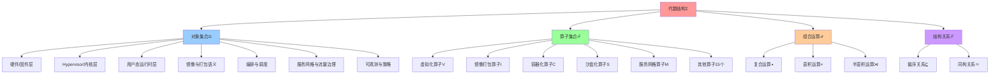
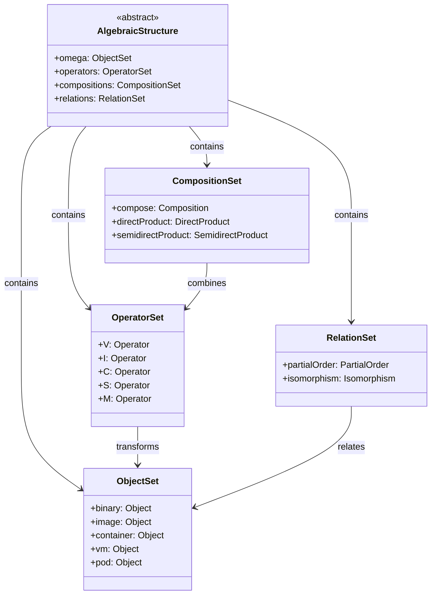
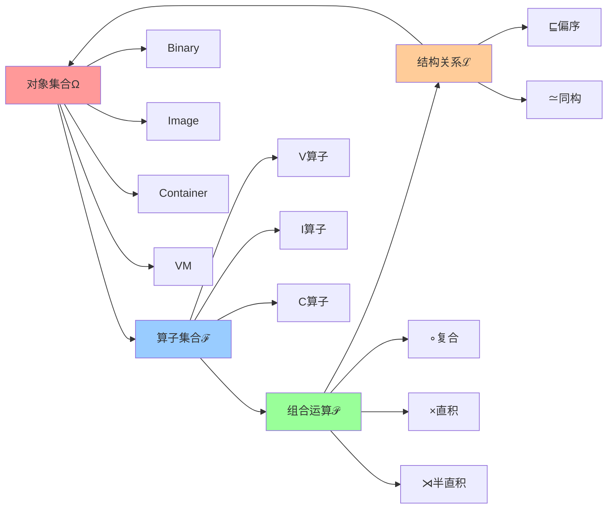
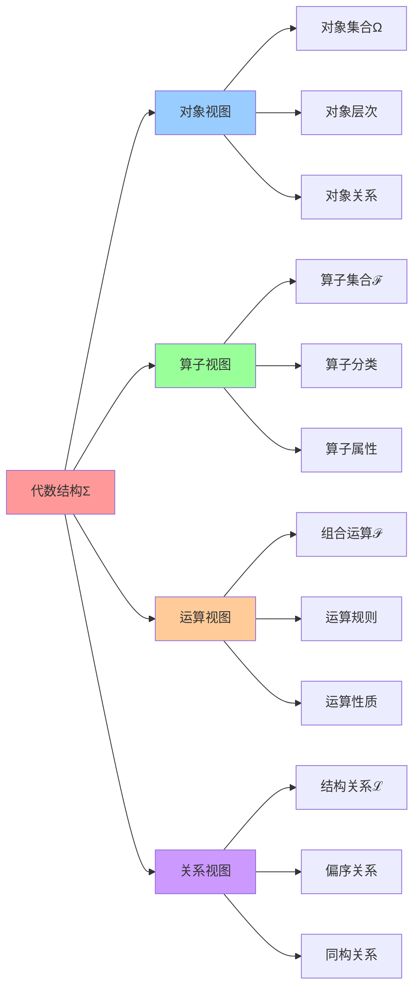

# 代数结构：Σ = ⟨Ω, ℱ, 𝒫, ℒ⟩

## 📑 目录

- [代数结构：Σ = ⟨Ω, ℱ, 𝒫, ℒ⟩](#代数结构σ--ω-ℱ-𝒫-ℒ)
  - [📑 目录](#-目录)
  - [1 代数结构概述](#1-代数结构概述)
  - [2 对象集合 Ω](#2-对象集合-ω)
    - [硬件/固件层](#硬件固件层)
    - [Hypervisor / 内核层](#hypervisor--内核层)
    - [用户态运行时层](#用户态运行时层)
    - [镜像与打包语义](#镜像与打包语义)
    - [编排与调度](#编排与调度)
    - [服务网格与流量治理](#服务网格与流量治理)
    - [可观测与策略](#可观测与策略)
    - [边缘/机密/Serverless](#边缘机密serverless)
  - [3 算子集合 ℱ](#3-算子集合-ℱ)
  - [4 组合运算 𝒫](#4-组合运算-𝒫)
    - [∘：复合运算（Composition）](#复合运算composition)
    - [×：直积运算（Direct Product）](#直积运算direct-product)
    - [⋊：半直积运算（Semidirect Product）](#半直积运算semidirect-product)
  - [5 结构关系 ℒ](#5-结构关系-ℒ)
    - [⊑：偏序关系（安全级别）](#偏序关系安全级别)
    - [≃：同构关系（技术等价）](#同构关系技术等价)
  - [6 代数结构签名](#6-代数结构签名)
  - [7 参考](#7-参考)
  - [8 🧠 认知增强：思维导图、建模视图与图表达转换](#8--认知增强思维导图建模视图与图表达转换)
    - [8.1 代数结构完整思维导图](#81-代数结构完整思维导图)
    - [8.2 代数结构建模视图（UML类图）](#82-代数结构建模视图uml类图)
    - [8.3 代数结构多维关系矩阵](#83-代数结构多维关系矩阵)
    - [8.4 图表达和转换](#84-图表达和转换)
    - [8.5 形象化解释论证](#85-形象化解释论证)
    - [8.6 专家观点与论证](#86-专家观点与论证)
    - [8.7 认知学习路径矩阵](#87-认知学习路径矩阵)
    - [8.8 专家推荐阅读路径](#88-专家推荐阅读路径)

---

## 1 代数结构概述

**代数结构签名**：Σ = ⟨Ω, ℱ, 𝒫, ℒ⟩

**核心思想**：把云原生技术栈的"层次"映射为算子**先后**的组合，利用**运算的组合
律**来推导指标。

**成分说明**：

| 成分  | 解释       | 示例                                            |
| ----- | ---------- | ----------------------------------------------- |
| **Ω** | 对象集合   | {Binary, Image, Container, VM, ...}（80+ 概念） |
| **ℱ** | 一元算子集 | {V, I, C, S, M, ...}（20 算子）                 |
| **𝒫** | 组合运算   | ∘（复合）、×（直积）、⋊（半直积）               |
| **ℒ** | 结构关系   | ⊑（偏序，安全等级）、≃（同构，技术等价）        |

## 2 对象集合 Ω

**对象全集**：Ω = {Binary, Image, Container, Pod, Sidecar, Mesh, VM, HW, Kernel,
Syscall, ...}

**对象分类**（按层级-作用域-生命周期）：

### 硬件/固件层

- **CPU 虚拟化扩展**（VT）：Intel VT-x / AMD-V
- **IOMMU**（IO）：IO 设备直通隔离
- **SGX/SEV**（E）：机密 enclave
- **TPM**（T）：可信度量根
- **microcode**（μ）：固件级沙补丁

### Hypervisor / 内核层

- **KVM**（K）：内核态 hypervisor
- **Xen**（X）：裸机 hypervisor
- **seccomp-bpf**（S）：系统调用过滤
- **Landlock**（L）：文件系统沙盒
- **eBPF**（P）：内核可编程
- **cgroup**（Cg）：资源控制器
- **namespace**（Ns）：隔离名字空间
- **OverlayFS**（O）：联合挂载层

### 用户态运行时层

- **runc**（R）：OCI 标准容器运行时
- **crun**（R′）：C 语言实现，更快
- **kata-runtime**（Kc）：VM 级容器
- **gVisor**（G）：用户态内核
- **firecracker**（F）：MicroVM
- **wasmtime**（W）：Wasm 运行时
- **wasmEdge**（W′）：云优化 Wasm

### 镜像与打包语义

- **OCI Image Spec**（I）：分层 tar+config json
- **Image Index**（Ix）：多架构清单
- **Layer blob**（Lb）：每层哈希块
- **Digest**（D）：content-hash
- **SBOM**（B）：软件物料清单

### 编排与调度

- **Pod**（Po）：K8s 最小调度原子
- **Deployment**（De）：无状态控制器
- **StatefulSet**（Ss）：有状态控制器
- **Namespace**（N）：逻辑隔离

### 服务网格与流量治理

- **Sidecar**（Sc）：伴车代理
- **Envoy**（E）：L4/L7 代理
- **Istiod**（Ist）：控制平面
- **xDS**（Xd）：配置发现协议
- **Ambient Mesh**（Am）：无 Sidecar 模式

### 可观测与策略

- **OpenTelemetry**（Otel）：统一观测标准
- **Prometheus**（Prom）：指标存储
- **Gatekeeper**（Gk）：OPA 准入
- **Falco**（Fc）：运行时安全

### 边缘/机密/Serverless

- **K3s**（K3）：轻量 K8s
- **WasmEdge**（We）：边缘 Wasm
- **Confidential Container**（Cc）：机密容器
- **Knative**（Kn）：Serverless 底座

**总计**：80+ 概念

## 3 算子集合 ℱ

**20 个一元算子**：ℱ = {V, I, C, S, M, Kc, G, F, W, We, Am, P, Ns, Cg, O, E,
Ist, Otel, Gk, Cc}

**算子分类**：

| 类别         | 算子            | 作用域            | 生成对象               |
| ------------ | --------------- | ----------------- | ---------------------- |
| **虚拟化**   | V, Kc, F, G, Cc | 物理 → 虚拟       | VM, MicroVM            |
| **打包**     | I               | 二进制 → 镜像     | Image                  |
| **运行时**   | C, W, We        | 镜像 → 运行时     | Container, WasmRuntime |
| **安全**     | S, P, Ns, Cg    | 运行时 → 沙盒     | Sandbox, eBPF Program  |
| **网络**     | M, Am, E, Ist   | 运行时 → 网格     | Mesh Container         |
| **观测**     | Otel            | 运行时 → 观测     | Telemetry              |
| **策略**     | Gk              | 运行时 → 策略     | Policy                 |
| **文件系统** | O               | 文件系统 →Overlay | Overlay                |

## 4 组合运算 𝒫

**组合运算**：𝒫 = {∘, ×, ⋊}

### ∘：复合运算（Composition）

**定义**：先算子，再算子，对应"层级叠加"

**示例**：

- `I∘C`：先镜像打包，再容器化
- `C∘S`：先容器化，再沙盒化
- `C∘M`：先容器化，再服务网格注入

**性质**：

- **结合律**：`(a∘b)∘c = a∘(b∘c)`
- **非交换**：`V∘C ≠ C∘V`（页表深度不同）

### ×：直积运算（Direct Product）

**定义**：并行组合，对应"堆叠"

**示例**：

- `C × P`：容器 + eBPF 程序同时存在
- `C × Ns`：容器 + namespace 同时存在

**性质**：

- **交换律**：`a × b = b × a`
- **分配律**：`a × (b ∘ c) = (a × b) ∘ (a × c)`

### ⋊：半直积运算（Semidirect Product）

**定义**：控制流优先的组合

**示例**：

- `C ⋊ M`：容器控制流优先，服务网格增强

**性质**：

- **非交换**：`a ⋊ b ≠ b ⋊ a`

## 5 结构关系 ℒ

**结构关系**：ℒ = {⊑, ≃}

### ⊑：偏序关系（安全级别）

**定义**：安全隔离的"低到高"关系

**示例**：

- `C ⊑ S`：容器 ≤ 沙箱（沙箱安全级别更高）
- `C ⊑ V`：容器 ≤ VM（VM 安全级别更高）
- `S ⊑ Cc`：沙箱 ≤ 机密容器（机密容器安全级别最高）

**性质**：

- **自反性**：`a ⊑ a`
- **传递性**：`a ⊑ b, b ⊑ c ⇒ a ⊑ c`
- **反对称性**：`a ⊑ b, b ⊑ a ⇒ a ≃ b`

### ≃：同构关系（技术等价）

**定义**：技术等价，不同实现但功能等价

**示例**：

- `crun ≃ runc`：不同实现但功能等价
- `Kata ≃ Firecracker`：不同实现但功能等价
- `C∘C ≃ C`：幂等性（容器里再容器 ≈ 单层容器）

**性质**：

- **自反性**：`a ≃ a`
- **对称性**：`a ≃ b ⇒ b ≃ a`
- **传递性**：`a ≃ b, b ≃ c ⇒ a ≃ c`

## 6 代数结构签名

**代数结构**：Σ = ⟨Ω, ℱ, 𝒫, ℒ⟩

**完整定义**：

```text
Σ = ⟨Ω, ℱ, 𝒫, ℒ⟩

其中：
- Ω = {Binary, Image, Container, VM, ...}（80+ 对象）
- ℱ = {V, I, C, S, M, ...}（20 算子）
- 𝒫 = {∘, ×, ⋊}（3 种运算）
- ℒ = {⊑, ≃}（2 种关系）
```

**代数性质**：

1. **封闭性**：∀x∈Ω, ℱ(x)∈Ω
2. **结合律**：`(a∘b)∘c = a∘(b∘c)`
3. **幂等性**：`C² = C, S² = S, M² = M`
4. **非交换性**：`V∘C ≠ C∘V`
5. **同态性**：`φ(a∘b) = φ(a) ⊕ φ(b)`

## 7 参考

**关联文档**：

- **[算子定义](01-operator-definition.md)** - 20 个一元算子详解
- **[公理体系](03-axioms.md)** - 公理 A1-A7
- **[复合运算表](04-composition-table.md)** - 20×20 运算表
- **[最简范式定理](05-normal-form-theorem.md)** - 主范式定理

**外部参考**：

- [Universal Algebra (Wikipedia)](https://en.wikipedia.org/wiki/Universal_algebra)
- [Category Theory (Wikipedia)](https://en.wikipedia.org/wiki/Category_theory)
- [Homomorphism (Wikipedia)](https://en.wikipedia.org/wiki/Homomorphism)

---

## 8 🧠 认知增强：思维导图、建模视图与图表达转换

### 8.1 代数结构完整思维导图



### 8.2 代数结构建模视图（UML类图）

#### 代数结构类图（UML Class Diagram）



#### 代数结构关系图



### 8.3 代数结构多维关系矩阵

#### 代数结构-成分-属性三维矩阵

| 成分 | 对象集合Ω | 算子集合ℱ | 组合运算𝒫 | 结构关系ℒ | 规模 | 复杂度 | 认知价值 |
|-----|----------|----------|----------|----------|------|--------|---------|
| **Ω** | ✅ 核心 | ❌ 无 | ❌ 无 | ⚠️ 部分 | 80+概念 | 高 | 结构理解 |
| **ℱ** | ✅ 核心 | ✅ 核心 | ✅ 核心 | ⚠️ 部分 | 20算子 | 中 | 算子理解 |
| **𝒫** | ⚠️ 部分 | ✅ 核心 | ✅ 核心 | ⚠️ 部分 | 3运算 | 中 | 运算理解 |
| **ℒ** | ✅ 核心 | ⚠️ 部分 | ⚠️ 部分 | ✅ 核心 | 2关系 | 低 | 关系理解 |

#### 组合运算-算子-对象映射矩阵

| 组合运算 | 复合运算∘ | 直积运算× | 半直积运算⋊ | 适用算子 | 适用对象 | 认知价值 |
|---------|----------|----------|-----------|---------|---------|---------|
| **∘** | ✅ 核心 | ❌ 无 | ❌ 无 | V,I,C,S,M | Binary,Image,Container | 运算理解 |
| **×** | ❌ 无 | ✅ 核心 | ❌ 无 | 任意算子 | 任意对象 | 运算理解 |
| **⋊** | ⚠️ 部分 | ⚠️ 部分 | ✅ 核心 | M,S | Container,Mesh | 运算理解 |

### 8.4 图表达和转换

#### 代数结构视图转换关系



#### 视图转换规则

**转换规则 1：对象视图 → 算子视图**

```yaml
对象到算子转换:
  输入: 对象集合Ω（Binary, Image, Container, VM）
  转换规则:
    - Binary → V算子（虚拟化）
    - Binary → I算子（镜像打包）
    - Image → C算子（容器化）
    - Container → S算子（沙盒化）
    - Container → M算子（服务网格）
  输出: 算子集合ℱ（V, I, C, S, M）
```

**转换规则 2：算子视图 → 运算视图**

```yaml
算子到运算转换:
  输入: 算子集合ℱ（V, I, C, S, M）
  转换规则:
    - 算子组合 → 复合运算∘（I∘C, C∘S, C∘M）
    - 并行算子 → 直积运算×（V×I, C×S）
    - 依赖算子 → 半直积运算⋊（M⋊S）
  输出: 组合运算𝒫（∘, ×, ⋊）
```

**转换规则 3：运算视图 → 关系视图**

```yaml
运算到关系转换:
  输入: 组合运算𝒫（∘, ×, ⋊）
  转换规则:
    - 运算结果比较 → 偏序关系⊑（安全级别）
    - 运算等价性 → 同构关系≃（技术等价）
  输出: 结构关系ℒ（⊑, ≃）
```

### 8.5 形象化解释论证

#### 1. 代数结构 = 建筑结构系统

> **类比**：代数结构就像建筑结构系统，对象集合Ω是"建筑材料"（砖、水泥、钢筋），算子集合ℱ是"施工工具"（搅拌机、起重机、电钻），组合运算𝒫是"施工方法"（浇筑、砌筑、焊接），结构关系ℒ是"建筑规范"（安全等级、质量标准），就像建筑结构系统通过材料、工具、方法、规范构建建筑一样，代数结构通过对象、算子、运算、关系构建技术栈。

**认知价值**：

- **结构理解**：通过建筑结构系统类比，理解代数结构的系统性
- **成分理解**：通过建筑材料、工具、方法、规范类比，理解代数结构的成分
- **构建理解**：通过建筑构建过程类比，理解代数结构的构建过程

#### 2. 对象集合 = 积木块集合

> **类比**：对象集合就像积木块集合，每个对象是"积木块"（Binary, Image, Container），就像积木块集合提供了构建的基础材料一样，对象集合提供了技术栈的基础对象。

**认知价值**：

- **基础理解**：通过积木块集合类比，理解对象集合的基础作用
- **多样性理解**：通过积木块多样性类比，理解对象集合的多样性
- **组合理解**：通过积木块组合类比，理解对象集合的组合性

#### 3. 算子集合 = 工具集合

> **类比**：算子集合就像工具集合，每个算子是"工具"（V, I, C, S, M），就像工具集合提供了加工的工具一样，算子集合提供了转换的工具。

**认知价值**：

- **工具理解**：通过工具集合类比，理解算子集合的工具作用
- **功能理解**：通过工具功能类比，理解算子的功能
- **使用理解**：通过工具使用类比，理解算子的使用

#### 4. 组合运算 = 施工方法

> **类比**：组合运算就像施工方法，复合运算∘是"顺序施工"（先做A再做B），直积运算×是"并行施工"（同时做A和B），半直积运算⋊是"依赖施工"（A依赖B），就像施工方法通过顺序、并行、依赖组织施工一样，组合运算通过复合、直积、半直积组织算子。

**认知价值**：

- **方法理解**：通过施工方法类比，理解组合运算的方法性
- **组织理解**：通过施工组织类比，理解组合运算的组织性
- **效率理解**：通过施工效率类比，理解组合运算的效率

### 8.6 专家观点与论证

#### 计算信息软件科学家的观点

##### 1. Garrett Birkhoff（通用代数创始人）

> "Universal algebra provides a framework for studying algebraic structures in general."

**在代数结构中的应用**：

- **框架理解**：代数结构提供了研究技术栈的框架
- **通用性理解**：通过通用代数理解代数结构的通用性
- **结构理解**：通过代数结构理解技术栈的结构

##### 2. Saunders Mac Lane（范畴论创始人）

> "Category theory is a language for talking about structure-preserving maps."

**在代数结构中的应用**：

- **结构保持理解**：算子保持对象的结构
- **映射理解**：通过范畴论理解算子的映射性质
- **语言理解**：通过范畴论语言描述代数结构

##### 3. Philip Wadler（函数式编程专家）

> "Monads are a way of structuring computations."

**在代数结构中的应用**：

- **计算结构理解**：通过Monad理解计算的代数结构
- **组合理解**：通过Monad理解算子的组合
- **抽象理解**：通过Monad抽象理解代数结构

#### 计算信息软件教育家的观点

##### 1. Benjamin Pierce（类型系统教育家）

> "Types are the leaven of computer programming; they make it digestible."

**教育价值**：

- **类型理解**：通过类型系统理解代数结构的类型
- **抽象理解**：通过类型抽象理解代数结构的抽象
- **实践理解**：通过类型系统学习代数结构的实践

##### 2. Robert Harper（编程语言教育家）

> "Types are the structure of computation."

**教育价值**：

- **结构理解**：通过类型结构理解代数结构的结构
- **计算理解**：通过类型结构理解计算的结构
- **学习理解**：通过类型系统学习代数结构的方法

#### 计算信息软件认知学家的观点

##### 1. David Marr（计算认知科学家）

> "Understanding a complex system requires understanding it at multiple levels."

**认知价值**：

- **多层次理解**：通过代数结构的多层次理解技术栈
- **系统理解**：通过代数结构理解技术栈的系统性
- **认知提升**：通过多层次分析提升认知能力

##### 2. Douglas Hofstadter（认知科学家）

> "Analogy is the core of cognition."

**认知价值**：

- **类比理解**：通过类比理解代数结构的概念
- **模式识别**：识别代数结构中的认知模式
- **认知提升**：通过类比学习提升认知能力

### 8.7 认知学习路径矩阵

| 学习阶段 | 核心内容 | 形象化理解 | 技术理解 | 实践应用 | 认知目标 |
|---------|---------|-----------|---------|---------|---------|
| **入门** | 代数结构概念 | 建筑结构系统类比 | 代数结构定义 | 简单结构 | 建立基础 |
| **进阶** | 对象集合Ω | 积木块集合类比 | 对象分类 | 对象使用 | 理解对象 |
| **高级** | 算子集合ℱ | 工具集合类比 | 算子分类 | 算子组合 | 掌握算子 |
| **专家** | 组合运算𝒫 | 施工方法类比 | 运算规则 | 复杂组合 | 掌握运算 |

### 8.8 专家推荐阅读路径

**计算信息软件科学家推荐路径**：

1. **代数结构定义**：理解代数结构的基本定义和成分
2. **对象集合**：理解对象集合Ω的结构和分类
3. **算子集合**：理解算子集合ℱ的结构和属性
4. **组合运算**：理解组合运算𝒫的规则和性质
5. **结构关系**：理解结构关系ℒ的定义和应用

**计算信息软件教育家推荐路径**：

1. **形象化理解**：通过建筑结构系统、积木块集合、工具集合、施工方法等类比，建立直观理解
2. **渐进学习**：从简单结构开始，逐步学习复杂结构
3. **实践结合**：结合实际技术栈，理解代数结构的应用
4. **思维训练**：通过代数结构学习，训练抽象思维能力

**计算信息软件认知学家推荐路径**：

1. **认知模式**：识别代数结构中的认知模式
2. **类比理解**：通过类比理解代数结构概念
3. **模型构建**：构建代数结构的心理模型
4. **认知提升**：通过代数结构学习，提升认知能力

---

**最后更新**：2025-11-04 **维护者**：项目团队
