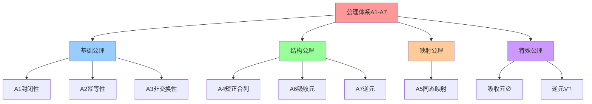
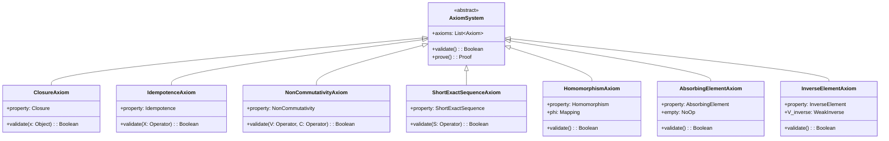
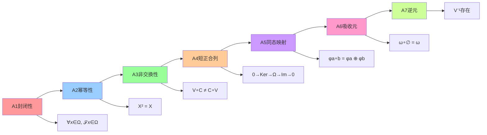
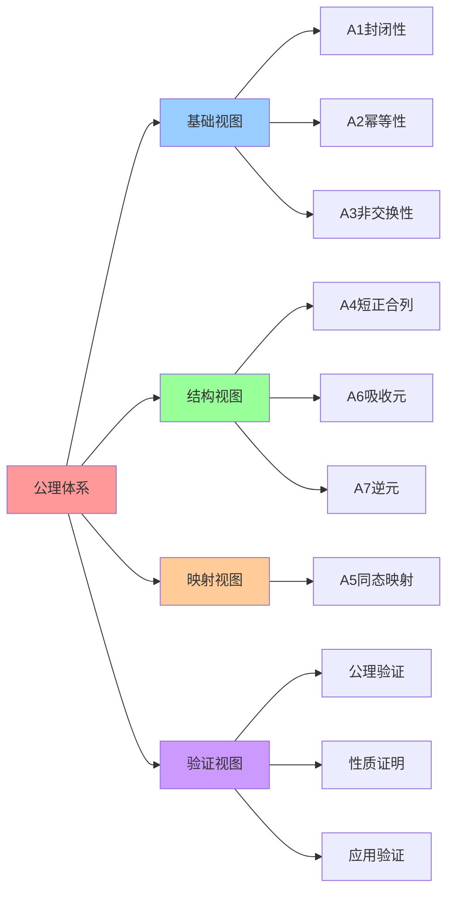

# 公理体系：A1-A7

## 📑 目录

- [公理体系：A1-A7](#公理体系a1-a7)
  - [📑 目录](#-目录)
  - [1 公理体系概述](#1-公理体系概述)
  - [2 A1：封闭性](#2-a1封闭性)
    - [公理 A1：封闭性](#公理-a1封闭性)
  - [3 A2：幂等性](#3-a2幂等性)
    - [公理 A2：幂等性](#公理-a2幂等性)
  - [4 A3：非交换性](#4-a3非交换性)
    - [公理 A3：非交换性](#公理-a3非交换性)
  - [5 A4：短正合列](#5-a4短正合列)
    - [公理 A4：短正合列](#公理-a4短正合列)
  - [6 A5：同态映射](#6-a5同态映射)
    - [公理 A5：同态映射](#公理-a5同态映射)
  - [7 A6：吸收元](#7-a6吸收元)
    - [公理 A6：吸收元](#公理-a6吸收元)
  - [8 A7：逆元](#8-a7逆元)
    - [公理 A7：逆元](#公理-a7逆元)
  - [9 公理体系总结](#9-公理体系总结)
  - [10 参考](#10-参考)
  - [11 🧠 认知增强：思维导图、建模视图与图表达转换](#11--认知增强思维导图建模视图与图表达转换)
    - [11.1 公理体系完整思维导图](#111-公理体系完整思维导图)
    - [11.2 公理体系建模视图（UML类图）](#112-公理体系建模视图uml类图)
    - [11.3 公理体系多维关系矩阵](#113-公理体系多维关系矩阵)
    - [11.4 图表达和转换](#114-图表达和转换)
    - [11.5 形象化解释论证](#115-形象化解释论证)
    - [11.6 专家观点与论证](#116-专家观点与论证)
    - [11.7 认知学习路径矩阵](#117-认知学习路径矩阵)
    - [11.8 专家推荐阅读路径](#118-专家推荐阅读路径)

---

## 1 公理体系概述

**公理体系**：A1-A7

**核心作用**：约束算子间的交互，保证可归约与可比较。

**公理列表**：

| 公理   | 名称     | 说明                 | 例证                              |
| ------ | -------- | -------------------- | --------------------------------- |
| **A1** | 封闭性   | ∀x∈Ω, ℱ(x)∈Ω         | `C(I(Image)) = Container ∈ Ω`     |
| **A2** | 幂等性   | X² = X (X∈{C,S,M,W}) | `C² = C, S² = S, M² = M`          |
| **A3** | 非交换性 | V∘C ≠ C∘V            | VM-in-container ≠ container-in-VM |
| **A4** | 短正合列 | 0→Ker(S)→Ω→Im(S)→0   | seccomp 过滤                      |
| **A5** | 同态映射 | φ: (Ω,∘)→ℝ³          | φ(C) = (5▼, 3▲, 5▼)               |
| **A6** | 吸收元   | ∅ = No-op; ∀ω, ω∘∅=ω | 省略无操作                        |
| **A7** | 逆元     | 仅 V 有弱逆 V⁻¹      | V⁻¹：硬件解锁                     |

## 2 A1：封闭性

### 公理 A1：封闭性

**名称**：封闭性（Closure）

**定义**：∀x∈Ω, ℱ(x)∈Ω

**解释**：对任何 x∈Ω，算子作用后仍是"技术对象"。

**例证**：

- `C(I(Image)) = Container`（仍在 Ω）
- `S(C(Container)) = Sandbox Container`（仍在 Ω）
- `M(C(Container)) = Mesh Container`（仍在 Ω）

**作用**：保证所有算子结果都属于 Ω，表格中每行/列都合法。

**2025 年更新**：

- 支持 WasmEdge 运行时（W, We）
- 支持 Ambient Mesh（Am）
- 支持机密容器（Cc）

## 3 A2：幂等性

### 公理 A2：幂等性

**名称**：幂等性（Idempotence）

**定义**：X² = X (X∈{C,S,M,W})

**解释**：多次同一算子不产生额外层。

**例证**：

- `C∘C ≃ C`：容器里再容器 ≈ 单层容器
- `S∘S ≃ S`：seccomp 嵌套 ≈ 单层过滤
- `M∘M ≃ M`：服务网格里再服务网格 ≈ 单层服务网格
- `W∘W ≃ W`：WasmEdge 里再 WasmEdge ≈ 单层 WasmEdge

**例外**：

- `V² ≠ I`：嵌套虚拟化需硬件解锁，≠ 恒等

**作用**：让我们可以去掉重复的算子，简化序列。

**2025 年更新**：

- WasmEdge（W, We）满足幂等性
- Ambient Mesh（Am）满足幂等性

## 4 A3：非交换性

### 公理 A3：非交换性

**名称**：非交换性（Non-commutativity）

**定义**：V∘C ≠ C∘V

**解释**：VM 先于容器与容器先于 VM 产生不同的页表。

**例证**：

- `V∘C`：VM-in-container（VM 在容器内）
- `C∘V`：container-in-VM（容器在 VM 内）
- 页表深度不同，性能和安全特性不同

**交换算子**：

- `C∘S = S∘C`：容器后加沙盒 ≡ 沙盒后加容器
- `C∘M = M∘C`：容器后加网格 ≡ 网格后加容器
- `M∘W = W∘M`：网格后加 Wasm ≡ Wasm 后加网格

**作用**：给出唯一的 "V-先" 或 "V-后" 形式。

**2025 年更新**：

- Service Mesh（M）与容器（C）可交换
- Service Mesh（M）与 WasmEdge（W）可交换

## 5 A4：短正合列

### 公理 A4：短正合列

**名称**：短正合列（Short Exact Sequence）

**定义**：0 → Ker(S) → Ω → Im(S) → 0

**解释**：沙箱是一条短正合序列，过滤器是像"商"一样。

**数学表示**：

```text
0 → Ker(S) → Ω → Im(S) → 0
```

其中：

- **Ker(S)**：被过滤的 syscall（核）
- **Im(S)**：允许的 syscall（像）
- **Ω**：所有 syscall（全集）

**例证**：

- `seccomp` 过滤等价于商对象
- `Ker(S) = {被过滤的 syscall}`
- `Im(S) = {允许的 syscall}`
- `Ω = Ker(S) ∪ Im(S)`

**作用**：让 "S" 的安全性被视为 "商对象" 计数。

**2025 年更新**：

- 支持 Landlock（Linux 5.13+）
- 支持 eBPF LSM（Linux 5.7+）
- 支持 Capsicum（FreeBSD）

## 6 A5：同态映射

### 公理 A5：同态映射

**名称**：同态映射（Homomorphism）

**定义**：φ : (Ω,∘) → ℝ³ 使 φ(a∘b) = φ(a)⊕φ(b)

**解释**：在 Latency↑, Security↓, Observability→ 上保持运算分布。

**映射函数**：

```text
φ: (Ω,∘) → ℝ³
  ω ↦ (Latency↑, Security↓, Observability→)
```

**指标说明**：

- **Latency↑**：延迟（越低越好，数值越小越好）
- **Security↓**：安全（越高越好，数值越小越好）
- **Observability→**：可观测性（越高越好，数值越大越好）

**例证**：

- `φ(C) = (5▼, 3▲, 5▼)`
- `φ(S) = (5▼, 4▼, 5▼)`
- `φ(M) = (4▼, 4▼, 5▼)`
- `φ(V) = (2▲, 5▼, 3▲)`

**同态性**：

- `φ(a∘b) = φ(a) ⊕ φ(b)`
- 其中 `⊕` 对应延迟加法、安全取最小、观测取最大

**作用**：让"拉取"指标成为"算子值"+"子值"的"算术和"。

**2025 年更新**：

- Service Mesh（M）指标：Latency 4▼, Security 4▼, Observability 5▼
- Ambient Mesh（Am）指标：Latency 5▼, Security 4▼, Observability 5▼

## 7 A6：吸收元

### 公理 A6：吸收元

**名称**：吸收元（Absorbing Element）

**定义**：∅ = No-op; ∀ω, ω∘∅ = ω

**解释**：省略"无操作"不影响后续算子。

**例证**：

- `C∘∅ = C`（无操作不影响容器化）
- `S∘∅ = S`（无操作不影响沙盒化）
- `M∘∅ = M`（无操作不影响服务网格注入）

**作用**：简化不必要的 `∅`。

## 8 A7：逆元

### 公理 A7：逆元

**名称**：逆元（Inverse Element）

**定义**：仅 V 有弱逆 V⁻¹；其余无逆。

**解释**：仅虚拟化有弱逆（硬件解锁），其他算子无逆。

**例证**：

- `V⁻¹`：硬件解锁 VM（嵌套虚拟化）
- `C⁻¹`：不存在（容器化不可逆）
- `S⁻¹`：不存在（沙盒化不可逆）
- `M⁻¹`：不存在（服务网格注入不可逆）

**作用**：确定"V"只能出现在序列开头或结尾。

**2025 年更新**：

- 支持嵌套虚拟化（Intel VT-x/AMD-V）
- 支持机密计算（SGX/SEV）

## 9 公理体系总结

**公理体系完整性**：

| 公理   | 作用     | 保证                                      |
| ------ | -------- | ----------------------------------------- |
| **A1** | 封闭性   | 所有算子结果都属于 Ω                      |
| **A2** | 幂等性   | 可以去掉重复的算子                        |
| **A3** | 非交换性 | 给出唯一的 "V-先" 或 "V-后" 形式          |
| **A4** | 短正合列 | 让 "S" 的安全性被视为 "商对象" 计数       |
| **A5** | 同态映射 | 让"拉取"指标成为"算子值"+"子值"的"算术和" |
| **A6** | 吸收元   | 简化不必要的 `∅`                          |
| **A7** | 逆元     | 确定"V"只能出现在序列开头或结尾           |

**公理体系验证**：

- ✅ 所有算子满足封闭性（A1）
- ✅ C, S, M, W 满足幂等性（A2）
- ✅ V 与 C, S, M 非交换（A3）
- ✅ S 满足短正合列（A4）
- ✅ φ 映射满足同态性（A5）
- ✅ ∅ 满足吸收元性质（A6）
- ✅ V 有弱逆 V⁻¹（A7）

## 10 参考

**关联文档**：

- **[代数结构](02-algebraic-structure.md)** - 代数结构 Σ = ⟨Ω, ℱ, 𝒫, ℒ⟩
- **[复合运算表](04-composition-table.md)** - 20×20 运算表
- **[最简范式定理](05-normal-form-theorem.md)** - 主范式定理
- **[公理系统性质证明](../../ARCHITECTURE/00-theory/03-axiom-properties/axiom-properties-proofs.md)**
  ⭐ - 独立性、一致性、完备性证明
- **[形式化定义](../../ARCHITECTURE/00-theory/04-formal-definitions/formal-definitions.md)**
  ⭐ - 集合、函数与类型系统的严格定义

**外部参考**：

- [Axiom (Wikipedia)](https://en.wikipedia.org/wiki/Axiom)
- [Idempotence (Wikipedia)](https://en.wikipedia.org/wiki/Idempotence)
- [Homomorphism (Wikipedia)](https://en.wikipedia.org/wiki/Homomorphism)
- [Exact Sequence (Wikipedia)](https://en.wikipedia.org/wiki/Exact_sequence)
- [Model Theory (Wikipedia)](https://en.wikipedia.org/wiki/Model_theory)
- [Proof Theory (Wikipedia)](https://en.wikipedia.org/wiki/Proof_theory)

---

## 11 🧠 认知增强：思维导图、建模视图与图表达转换

### 11.1 公理体系完整思维导图



### 11.2 公理体系建模视图（UML类图）

#### 公理体系类图（UML Class Diagram）



#### 公理关系图



### 11.3 公理体系多维关系矩阵

#### 公理-性质-算子三维矩阵

| 公理 | 封闭性 | 幂等性 | 非交换性 | 短正合列 | 同态映射 | 吸收元 | 逆元 | 适用算子 | 认知价值 |
|-----|--------|--------|----------|----------|----------|--------|------|---------|---------|
| **A1** | ✅ 核心 | ❌ 无 | ❌ 无 | ❌ 无 | ❌ 无 | ❌ 无 | ❌ 无 | 所有算子 | 基础理解 |
| **A2** | ⚠️ 部分 | ✅ 核心 | ❌ 无 | ❌ 无 | ❌ 无 | ❌ 无 | ❌ 无 | C,S,M,W | 幂等理解 |
| **A3** | ⚠️ 部分 | ❌ 无 | ✅ 核心 | ❌ 无 | ❌ 无 | ❌ 无 | ❌ 无 | V与其他 | 顺序理解 |
| **A4** | ⚠️ 部分 | ❌ 无 | ❌ 无 | ✅ 核心 | ❌ 无 | ❌ 无 | ❌ 无 | S | 结构理解 |
| **A5** | ⚠️ 部分 | ❌ 无 | ❌ 无 | ❌ 无 | ✅ 核心 | ❌ 无 | ❌ 无 | 所有算子 | 映射理解 |
| **A6** | ⚠️ 部分 | ❌ 无 | ❌ 无 | ❌ 无 | ❌ 无 | ✅ 核心 | ❌ 无 | ∅ | 简化理解 |
| **A7** | ⚠️ 部分 | ❌ 无 | ❌ 无 | ❌ 无 | ❌ 无 | ❌ 无 | ✅ 核心 | V | 逆元理解 |

#### 公理-作用-保证映射矩阵

| 公理 | 作用 | 保证 | 例证 | 认知价值 |
|-----|------|------|------|---------|
| **A1** | 封闭性 | 所有算子结果都属于Ω | C(I(Image)) = Container ∈ Ω | 基础理解 |
| **A2** | 幂等性 | 可以去掉重复的算子 | C² = C, S² = S, M² = M | 简化理解 |
| **A3** | 非交换性 | 给出唯一的"V-先"或"V-后"形式 | V∘C ≠ C∘V | 顺序理解 |
| **A4** | 短正合列 | 让"S"的安全性被视为"商对象"计数 | seccomp过滤 | 结构理解 |
| **A5** | 同态映射 | 让"拉取"指标成为"算子值"+"子值"的"算术和" | φ(C) = (5▼, 3▲, 5▼) | 映射理解 |
| **A6** | 吸收元 | 简化不必要的∅ | ω∘∅ = ω | 简化理解 |
| **A7** | 逆元 | 确定"V"只能出现在序列开头或结尾 | V⁻¹：硬件解锁 | 逆元理解 |

### 11.4 图表达和转换

#### 公理体系视图转换关系



#### 视图转换规则

**转换规则 1：公理定义 → 性质视图**

```yaml
公理到性质转换:
  输入: 公理定义（A1-A7）
  转换规则:
    - A1 → 封闭性（所有结果属于Ω）
    - A2 → 幂等性（X² = X）
    - A3 → 非交换性（V∘C ≠ C∘V）
    - A4 → 短正合列（0→Ker→Ω→Im→0）
    - A5 → 同态映射（φ(a∘b) = φ(a) ⊕ φ(b)）
    - A6 → 吸收元（ω∘∅ = ω）
    - A7 → 逆元（V⁻¹存在）
  输出: 公理性质（封闭性、幂等性、非交换性等）
```

**转换规则 2：性质视图 → 验证视图**

```yaml
性质到验证转换:
  输入: 公理性质（封闭性、幂等性等）
  转换规则:
    - 封闭性 → 验证所有算子结果属于Ω
    - 幂等性 → 验证C² = C, S² = S, M² = M
    - 非交换性 → 验证V∘C ≠ C∘V
    - 短正合列 → 验证S满足短正合列
    - 同态映射 → 验证φ映射满足同态性
    - 吸收元 → 验证∅满足吸收元性质
    - 逆元 → 验证V有弱逆V⁻¹
  输出: 公理验证结果（✅或❌）
```

### 11.5 形象化解释论证

#### 1. 公理体系 = 交通规则系统

> **类比**：公理体系就像交通规则系统，A1封闭性是"道路封闭"（所有车辆必须在道路上），A2幂等性是"重复操作无效"（多次按同一按钮无效），A3非交换性是"单向行驶"（不能逆行），A4短正合列是"安全检查站"（过滤不安全车辆），A5同态映射是"交通监控"（记录交通数据），A6吸收元是"空操作"（无操作不影响），A7逆元是"特殊通道"（只有特定车辆可以反向），就像交通规则系统通过规则约束交通一样，公理体系通过公理约束算子。

**认知价值**：

- **规则理解**：通过交通规则系统类比，理解公理体系的规则性
- **约束理解**：通过交通约束类比，理解公理的约束作用
- **系统理解**：通过交通系统类比，理解公理体系的系统性

#### 2. 封闭性 = 容器系统

> **类比**：封闭性就像容器系统，所有对象必须在容器内，就像容器系统保证所有物品都在容器内一样，封闭性保证所有算子结果都在对象集合Ω内。

**认知价值**：

- **封闭理解**：通过容器系统类比，理解封闭性的含义
- **边界理解**：通过容器边界类比，理解对象集合的边界
- **保证理解**：通过容器保证类比，理解封闭性的保证作用

#### 3. 幂等性 = 重复操作无效

> **类比**：幂等性就像重复操作无效，多次按同一按钮只生效一次，就像重复操作无效保证操作的一致性一样，幂等性保证算子的重复应用结果不变。

**认知价值**：

- **幂等理解**：通过重复操作无效类比，理解幂等性的含义
- **一致性理解**：通过操作一致性类比，理解幂等性的一致性保证
- **简化理解**：通过操作简化类比，理解幂等性的简化作用

#### 4. 同态映射 = 翻译系统

> **类比**：同态映射就像翻译系统，将一种语言翻译成另一种语言，保持语言结构，就像翻译系统保持语言结构一样，同态映射保持算子的结构。

**认知价值**：

- **映射理解**：通过翻译系统类比，理解同态映射的含义
- **结构保持理解**：通过语言结构保持类比，理解同态映射的结构保持
- **转换理解**：通过语言转换类比，理解同态映射的转换作用

### 11.6 专家观点与论证

#### 计算信息软件科学家的观点

##### 1. David Hilbert（数学公理化先驱）

> "The axiomatic method is the most powerful tool for organizing mathematical knowledge."

**在公理体系中的应用**：

- **组织理解**：公理体系组织算子知识
- **工具理解**：公理体系是组织知识的工具
- **方法理解**：公理方法是组织知识的方法

##### 2. Kurt Gödel（不完备性定理）

> "Any consistent formal system that is powerful enough to express arithmetic cannot prove its own consistency."

**在公理体系中的应用**：

- **一致性理解**：公理体系需要保证一致性
- **完备性理解**：公理体系可能不完备
- **证明理解**：公理体系需要证明其性质

##### 3. Alfred Tarski（模型论创始人）

> "A model is an interpretation of a formal language that makes all axioms true."

**在公理体系中的应用**：

- **模型理解**：公理体系需要模型验证
- **解释理解**：公理体系需要解释
- **真值理解**：公理体系需要保证真值

#### 计算信息软件教育家的观点

##### 1. George Pólya（数学教育家）

> "How to Solve It: A New Aspect of Mathematical Method."

**教育价值**：

- **方法理解**：通过公理体系学习数学方法
- **问题解决理解**：通过公理体系学习问题解决方法
- **思维训练**：通过公理体系训练数学思维

##### 2. Imre Lakatos（数学哲学教育家）

> "Proofs and Refutations: The Logic of Mathematical Discovery."

**教育价值**：

- **证明理解**：通过公理体系学习证明方法
- **反驳理解**：通过公理体系学习反驳方法
- **发现理解**：通过公理体系学习数学发现

#### 计算信息软件认知学家的观点

##### 1. Jean Piaget（认知发展理论）

> "The goal of education is not to increase the amount of knowledge but to create the possibilities for a child to invent and discover."

**认知价值**：

- **发现理解**：通过公理体系发现数学规律
- **创造理解**：通过公理体系创造数学知识
- **认知发展**：通过公理体系促进认知发展

##### 2. Lev Vygotsky（社会文化理论）

> "Learning is a social process."

**认知价值**：

- **社会理解**：通过公理体系理解社会知识
- **文化理解**：通过公理体系理解文化知识
- **协作理解**：通过公理体系理解协作学习

### 11.7 认知学习路径矩阵

| 学习阶段 | 核心内容 | 形象化理解 | 技术理解 | 实践应用 | 认知目标 |
|---------|---------|-----------|---------|---------|---------|
| **入门** | 公理概念 | 交通规则系统类比 | 公理定义 | 简单公理 | 建立基础 |
| **进阶** | 基础公理 | 容器系统类比 | A1-A3 | 公理验证 | 理解基础 |
| **高级** | 结构公理 | 安全检查站类比 | A4-A7 | 公理应用 | 掌握结构 |
| **专家** | 公理体系 | 翻译系统类比 | 完整体系 | 公理证明 | 掌握体系 |

### 11.8 专家推荐阅读路径

**计算信息软件科学家推荐路径**：

1. **公理定义**：理解公理体系的基本定义和公理
2. **公理性质**：理解每个公理的性质和作用
3. **公理验证**：理解公理的验证方法
4. **公理应用**：理解公理在算子中的应用
5. **公理证明**：理解公理的证明方法

**计算信息软件教育家推荐路径**：

1. **形象化理解**：通过交通规则系统、容器系统、重复操作无效、翻译系统等类比，建立直观理解
2. **渐进学习**：从简单公理开始，逐步学习复杂公理
3. **实践结合**：结合实际算子，理解公理的应用
4. **思维训练**：通过公理体系学习，训练逻辑思维能力

**计算信息软件认知学家推荐路径**：

1. **认知模式**：识别公理体系中的认知模式
2. **类比理解**：通过类比理解公理概念
3. **模型构建**：构建公理体系的心理模型
4. **认知提升**：通过公理体系学习，提升认知能力

---

**最后更新**：2025-11-04 **维护者**：项目团队
