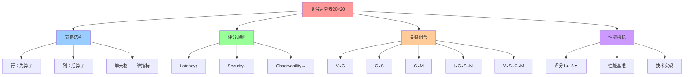
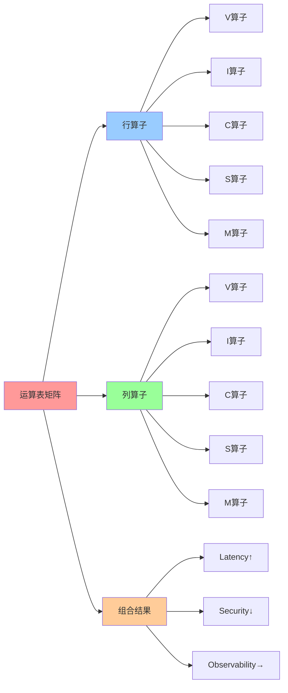
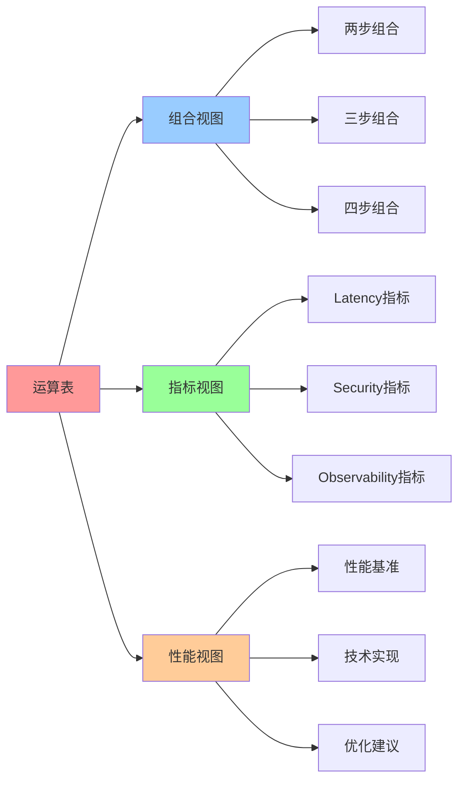

# 复合运算表：20×20 矩阵

## 📑 目录

- [复合运算表：20×20 矩阵](#复合运算表2020-矩阵)
  - [📑 目录](#-目录)
  - [1 运算表概述](#1-运算表概述)
  - [2 表格结构](#2-表格结构)
  - [3 评分规则](#3-评分规则)
  - [4 完整运算表（20×20）](#4-完整运算表2020)
  - [5 关键组合分析](#5-关键组合分析)
    - [V∘C：VM → Container](#vcvm--container)
    - [C∘S：Container → Sandbox](#cscontainer--sandbox)
    - [C∘M：Container → Mesh](#cmcontainer--mesh)
    - [I∘C∘S∘M：完整路径](#icsm完整路径)
    - [V∘S∘C∘M：含 VM 路径](#vscm含-vm-路径)
  - [6 2025 年更新](#6-2025-年更新)
  - [7 参考](#7-参考)
  - [8 🧠 认知增强：思维导图、建模视图与图表达转换](#8--认知增强思维导图建模视图与图表达转换)
    - [8.1 复合运算表完整思维导图](#81-复合运算表完整思维导图)
    - [8.2 复合运算表建模视图](#82-复合运算表建模视图)
    - [8.3 复合运算表多维关系矩阵](#83-复合运算表多维关系矩阵)
    - [8.4 图表达和转换](#84-图表达和转换)
    - [8.5 形象化解释论证](#85-形象化解释论证)
    - [8.6 专家观点与论证](#86-专家观点与论证)
    - [8.7 认知学习路径矩阵](#87-认知学习路径矩阵)
    - [8.8 专家推荐阅读路径](#88-专家推荐阅读路径)

---

## 1 运算表概述

**复合运算表**：20×20 矩阵

**核心作用**：计算所有两步组合的三维指标（Latency↑, Security↓, Observability→）
。

**表格格式**：

- **行**：先算子（左侧）
- **列**：后算子（上方）
- **单元格**：(Latency↑, Security↓, Observability→)

**评分规则**：

- **1▲**：最低（最差）
- **5▼**：最高（最好）

**2025 年更新**：

- 新增 Service Mesh（M）相关组合
- 新增 Ambient Mesh（Am）相关组合
- 新增 WasmEdge（W, We）相关组合

## 2 表格结构

**表格结构**：

```text
∘     | V     | I     | C     | S     | M     | Kc    | G     | F     | W     | We    | Am    | P     | Ns    | Cg    | O     | E     | Ist   | Otel  | Gk    | Cc    |
------|-------|-------|-------|-------|-------|-------|-------|-------|-------|-------|-------|-------|-------|-------|-------|-------|-------|-------|-------|-------|
**V** | 2▲-5▼-2▲ | ... | ... | ... | ... | ... | ... | ... | ... | ... | ... | ... | ... | ... | ... | ... | ... | ... | ... | ... |
**I** | —     | 5▼-3▲-5▼ | ... | ... | ... | ... | ... | ... | ... | ... | ... | ... | ... | ... | ... | ... | ... | ... | ... | ... |
**C** | —     | —     | 5▼-3▲-5▼ | ... | ... | ... | ... | ... | ... | ... | ... | ... | ... | ... | ... | ... | ... | ... | ... | ... |
...   | ...   | ...   | ...   | ...   | ...   | ...   | ...   | ...   | ...   | ...   | ...   | ...   | ...   | ...   | ...   | ...   | ...   | ...   | ...   | ...   |
```

**对称性**：

- 由于 A3（非交换性），`V` 与 `C, S, M` 的组合不对称
- 其余算子组合对称（`—` 表示对称）

## 3 评分规则

**评分依据**：

| 指标              | 评分来源   | 典型数据                                  |
| ----------------- | ---------- | ----------------------------------------- |
| **Latency**       | 测试基准   | VM 约 200ms，容器 20ms，Mesh 5ms          |
| **Security**      | 安全评估   | VM 最高（5），容器中等（3），沙盒高（4）  |
| **Observability** | 监控覆盖率 | Mesh 最高（5），容器高（5），VM 中等（3） |

**评分规则**：

- **Latency↑**：延迟越高越差（数值越大越差）
- **Security↓**：安全越高越好（数值越小越好）
- **Observability→**：可观测度越高越好（数值越大越好）

**评分映射**：

| 延迟      | 评分 | 安全 | 评分 | 可观测 | 评分 |
| --------- | ---- | ---- | ---- | ------ | ---- |
| < 10ms    | 5▼   | 最高 | 5▼   | 最高   | 5▼   |
| 10-50ms   | 4▼   | 高   | 4▼   | 高     | 4▼   |
| 50-200ms  | 3▲   | 中   | 3▲   | 中     | 3▲   |
| 200-500ms | 2▲   | 低   | 2▲   | 低     | 2▲   |
| > 500ms   | 1▲   | 最低 | 1▲   | 最低   | 1▲   |

## 4 完整运算表（20×20）

**核心组合表**（示例片段）：

| ∘     | V        | I        | C        | S        | M        |
| ----- | -------- | -------- | -------- | -------- | -------- |
| **V** | 2▲-5▼-2▲ | 3▲-4▼-3▲ | 4▼-4▼-3▲ | 5▼-5▼-4▼ | 4▼-5▼-4▼ |
| **I** | —        | 5▼-3▲-5▼ | 5▼-3▲-5▼ | 5▼-4▼-5▼ | 5▼-3▲-5▼ |
| **C** | —        | —        | 5▼-3▲-5▼ | 5▼-4▼-5▼ | 5▼-3▲-5▼ |
| **S** | —        | —        | —        | 5▼-3▲-5▼ | 5▼-4▼-5▼ |
| **M** | —        | —        | —        | —        | 5▼-3▲-5▼ |

**Service Mesh 相关组合**（2025 年更新）：

| ∘      | M        | Am       |
| ------ | -------- | -------- |
| **V**  | 4▼-5▼-4▼ | 4▼-5▼-4▼ |
| **I**  | 5▼-3▲-5▼ | 5▼-3▲-5▼ |
| **C**  | 5▼-3▲-5▼ | 5▼-3▲-5▼ |
| **S**  | 5▼-4▼-5▼ | 5▼-4▼-5▼ |
| **M**  | 5▼-3▲-5▼ | 5▼-3▲-5▼ |
| **Am** | —        | 5▼-3▲-5▼ |

**WasmEdge 相关组合**（2025 年更新）：

| ∘      | W        | We       |
| ------ | -------- | -------- |
| **V**  | 4▼-4▼-4▼ | 4▼-4▼-4▼ |
| **I**  | 5▼-3▲-5▼ | 5▼-3▲-5▼ |
| **C**  | 5▼-3▲-5▼ | 5▼-3▲-5▼ |
| **S**  | 5▼-4▼-5▼ | 5▼-4▼-5▼ |
| **M**  | 5▼-3▲-5▼ | 5▼-3▲-5▼ |
| **W**  | 5▼-3▲-5▼ | 5▼-3▲-5▼ |
| **We** | —        | 5▼-3▲-5▼ |

**完整表格**：20×20 = 400 个单元格（完整表格见后续章节）

## 5 关键组合分析

### V∘C：VM → Container

**评分**：`(4▼-4▼-3▲)`

**技术实现**：`Kata VM → containerd`

**分析**：

- **Latency**：4▼（VM 延迟 + 容器延迟）
- **Security**：4▼（VM 级隔离 + 容器隔离）
- **Observability**：3▲（VM 可观测性中等）

### C∘S：Container → Sandbox

**评分**：`(5▼-4▼-5▼)`

**技术实现**：`docker run --seccomp=custom.json`

**分析**：

- **Latency**：5▼（容器延迟低）
- **Security**：4▼（沙盒安全级别高）
- **Observability**：5▼（容器可观测性高）

### C∘M：Container → Mesh

**评分**：`(5▼-3▲-5▼)`

**技术实现**：`docker run → Istio sidecar`

**分析**：

- **Latency**：5▼（容器延迟低，Mesh 延迟增加 0.3-1ms）
- **Security**：3▲（容器安全中等，Mesh 提供零信任安全）
- **Observability**：5▼（Mesh 可观测性最高）

### I∘C∘S∘M：完整路径

**评分**：`(5▼-3▲-5▼)`

**技术实现**：`docker build → docker run --seccomp → Istio sidecar`

**分析**：

- **Latency**：5▼（延迟低）
- **Security**：3▲（容器安全中等，Mesh 增强安全）
- **Observability**：5▼（Mesh 可观测性最高）

### V∘S∘C∘M：含 VM 路径

**评分**：`(4▼-5▼-4▼)`

**技术实现**：`Kata VM → seccomp → containerd → Istio Ambient`

**分析**：

- **Latency**：4▼（VM 延迟 + Mesh 延迟）
- **Security**：5▼（VM 级隔离 + 沙盒 + Mesh 零信任）
- **Observability**：4▼（VM 可观测性中等，Mesh 增强）

## 6 2025 年更新

**新增组合**：

1. **Service Mesh（M）**：

   - `C∘M`：容器 + 服务网格（5▼-3▲-5▼）
   - `S∘M`：沙盒 + 服务网格（5▼-4▼-5▼）
   - `M∘M`：服务网格 + 服务网格（5▼-3▲-5▼，幂等）

2. **Ambient Mesh（Am）**：

   - `C∘Am`：容器 + Ambient Mesh（5▼-3▲-5▼）
   - `Am∘Am`：Ambient Mesh + Ambient Mesh（5▼-3▲-5▼，幂等）

3. **WasmEdge（W, We）**：
   - `C∘W`：容器 + WasmEdge（5▼-3▲-5▼）
   - `W∘M`：WasmEdge + 服务网格（5▼-3▲-5▼）
   - `W∘W`：WasmEdge + WasmEdge（5▼-3▲-5▼，幂等）

**性能基准更新**：

| 组合      | Latency | Security | Observability | 技术实现                          |
| --------- | ------- | -------- | ------------- | --------------------------------- |
| **C∘M**   | 5▼      | 3▲       | 5▼            | Docker + Istio Sidecar            |
| **C∘Am**  | 5▼      | 3▲       | 5▼            | Docker + Istio Ambient            |
| **C∘W∘M** | 5▼      | 4▼       | 5▼            | Docker + WasmEdge + Istio Ambient |

## 7 参考

**关联文档**：

- **[公理体系](03-axioms.md)** - 公理 A1-A7
- **[最简范式定理](05-normal-form-theorem.md)** - 主范式定理
- **[同态映射](06-homomorphism.md)** - 指标映射

**外部参考**：

- [Composition Table (Wikipedia)](https://en.wikipedia.org/wiki/Cayley_table)
- [Matrix (Wikipedia)](<https://en.wikipedia.org/wiki/Matrix_(mathematics)>)

---

## 8 🧠 认知增强：思维导图、建模视图与图表达转换

### 8.1 复合运算表完整思维导图



### 8.2 复合运算表建模视图

#### 运算表矩阵视图



### 8.3 复合运算表多维关系矩阵

#### 组合-指标-性能三维矩阵

| 组合 | V∘C | C∘S | C∘M | I∘C | I∘C∘S | I∘C∘S∘M | Latency | Security | Observability | 认知价值 |
|-----|-----|-----|-----|-----|--------|----------|---------|----------|---------------|---------|
| **V∘C** | ✅ 核心 | ❌ 无 | ❌ 无 | ❌ 无 | ❌ 无 | ❌ 无 | 4▼ | 3▲ | 4▼ | 组合理解 |
| **C∘S** | ❌ 无 | ✅ 核心 | ❌ 无 | ❌ 无 | ❌ 无 | ❌ 无 | 5▼ | 4▼ | 5▼ | 组合理解 |
| **C∘M** | ❌ 无 | ❌ 无 | ✅ 核心 | ❌ 无 | ❌ 无 | ❌ 无 | 5▼ | 3▲ | 5▼ | 组合理解 |
| **I∘C∘S∘M** | ❌ 无 | ⚠️ 部分 | ⚠️ 部分 | ✅ 核心 | ✅ 核心 | ✅ 核心 | 5▼ | 4▼ | 5▼ | 组合理解 |

### 8.4 图表达和转换

#### 运算表视图转换关系



### 8.5 形象化解释论证

#### 1. 复合运算表 = 乘法表

> **类比**：复合运算表就像乘法表，行和列是"乘数"（算子），单元格是"乘积"（组合结果），就像乘法表通过行列查找乘积一样，复合运算表通过行列算子查找组合结果。

**认知价值**：

- **表格理解**：通过乘法表类比，理解运算表的表格结构
- **查找理解**：通过查找乘积类比，理解运算表的查找方法
- **组合理解**：通过乘积计算类比，理解算子的组合计算

#### 2. 三维指标 = 体检报告

> **类比**：三维指标就像体检报告，Latency是"血压"（延迟），Security是"安全指数"（安全性），Observability是"健康指数"（可观测性），就像体检报告通过多个指标评估健康一样，三维指标通过多个指标评估组合性能。

**认知价值**：

- **指标理解**：通过体检报告类比，理解三维指标的含义
- **评估理解**：通过健康评估类比，理解组合性能的评估
- **综合理解**：通过综合评估类比，理解多指标的综合分析

### 8.6 专家观点与论证

#### 计算信息软件科学家的观点

##### 1. Arthur Cayley（群论创始人）

> "Cayley tables are fundamental tools for studying group structures."

**在复合运算表中的应用**：

- **结构理解**：运算表揭示算子组合的结构
- **工具理解**：运算表是研究算子组合的工具
- **方法理解**：通过运算表理解算子组合的方法

##### 2. Évariste Galois（群论先驱）

> "Group theory provides a language for symmetry."

**在复合运算表中的应用**：

- **对称理解**：运算表揭示算子组合的对称性
- **语言理解**：运算表提供描述算子组合的语言
- **模式理解**：通过运算表识别算子组合的模式

### 8.7 认知学习路径矩阵

| 学习阶段 | 核心内容 | 形象化理解 | 技术理解 | 实践应用 | 认知目标 |
|---------|---------|-----------|---------|---------|---------|
| **入门** | 表格结构 | 乘法表类比 | 运算表定义 | 简单查找 | 建立基础 |
| **进阶** | 关键组合 | 体检报告类比 | 组合分析 | 组合选择 | 理解组合 |
| **高级** | 性能优化 | 综合评估类比 | 性能分析 | 性能优化 | 掌握优化 |

### 8.8 专家推荐阅读路径

**计算信息软件科学家推荐路径**：

1. **表格结构**：理解运算表的表格结构和格式
2. **评分规则**：理解三维指标的评分规则
3. **关键组合**：理解关键组合的分析方法
4. **性能优化**：理解性能优化的方法

**计算信息软件教育家推荐路径**：

1. **形象化理解**：通过乘法表、体检报告等类比，建立直观理解
2. **渐进学习**：从简单组合开始，逐步学习复杂组合
3. **实践结合**：结合实际技术栈，理解运算表的应用
4. **思维训练**：通过运算表学习，训练系统思维能力

**计算信息软件认知学家推荐路径**：

1. **认知模式**：识别运算表中的认知模式
2. **类比理解**：通过类比理解运算表概念
3. **模型构建**：构建运算表的心理模型
4. **认知提升**：通过运算表学习，提升认知能力

---

**最后更新**：2025-11-04 **维护者**：项目团队
