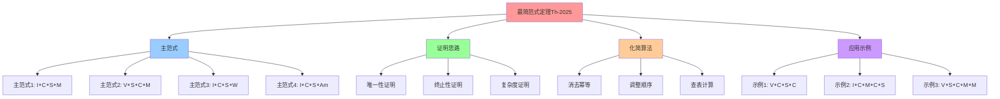
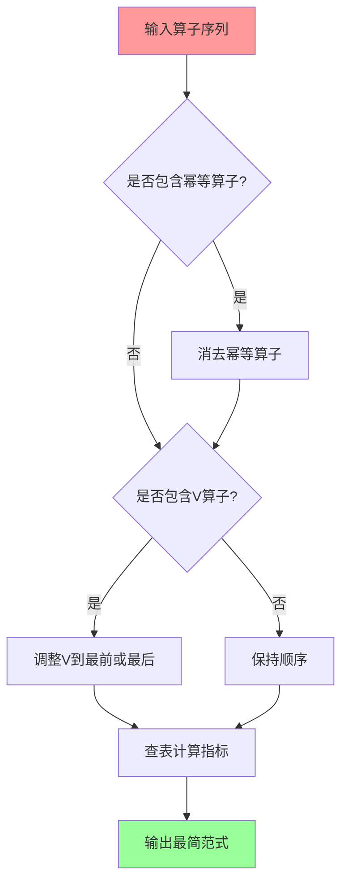
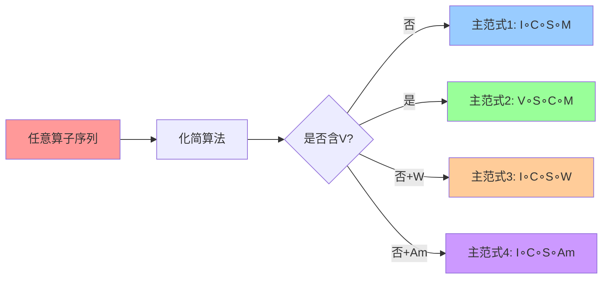
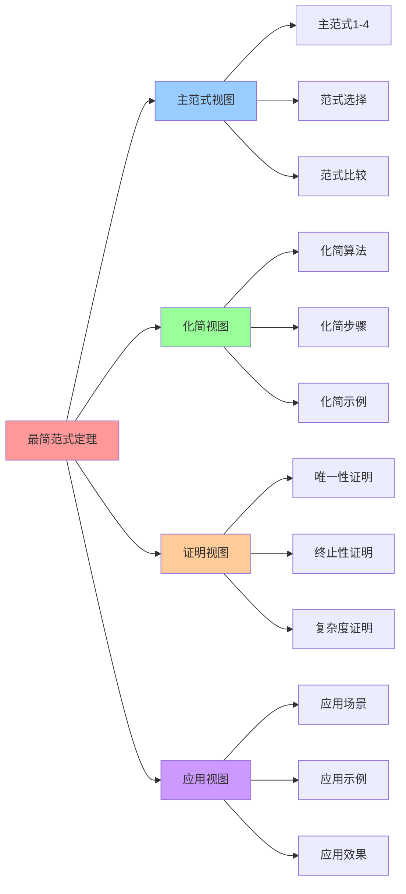

# 最简范式定理：Th-2025

## 📑 目录

- [最简范式定理：Th-2025](#最简范式定理th-2025)
  - [📑 目录](#-目录)
  - [1 定理概述](#1-定理概述)
  - [2 主范式定义](#2-主范式定义)
    - [主范式 1：I∘C∘S∘M](#主范式-1icsm)
    - [主范式 2：V∘S∘C∘M](#主范式-2vscm)
  - [3 证明思路](#3-证明思路)
    - [证明要点](#证明要点)
    - [证明结论](#证明结论)
  - [4 化简算法](#4-化简算法)
    - [算法步骤（伪代码）](#算法步骤伪代码)
    - [化简示例](#化简示例)
  - [5 应用示例](#5-应用示例)
    - [示例 1：V∘C∘S∘C](#示例-1vcsc)
    - [示例 2：I∘C∘M∘C∘S](#示例-2icmcs)
    - [示例 3：V∘S∘C∘M∘M](#示例-3vscmm)
  - [6 2025 年更新](#6-2025-年更新)
  - [7 参考](#7-参考)
  - [8 🧠 认知增强：思维导图、建模视图与图表达转换](#8--认知增强思维导图建模视图与图表达转换)
    - [8.1 最简范式定理完整思维导图](#81-最简范式定理完整思维导图)
    - [8.2 最简范式定理建模视图](#82-最简范式定理建模视图)
      - [化简算法流程图](#化简算法流程图)
      - [主范式关系图](#主范式关系图)
    - [8.3 最简范式定理多维关系矩阵](#83-最简范式定理多维关系矩阵)
      - [主范式-路径-指标三维矩阵](#主范式-路径-指标三维矩阵)
      - [化简步骤-算法-复杂度映射矩阵](#化简步骤-算法-复杂度映射矩阵)
    - [8.4 图表达和转换](#84-图表达和转换)
      - [最简范式视图转换关系](#最简范式视图转换关系)
    - [8.5 形象化解释论证](#85-形象化解释论证)
      - [1. 最简范式 = 标准配方](#1-最简范式--标准配方)
      - [2. 化简算法 = 压缩算法](#2-化简算法--压缩算法)
      - [3. 主范式 = 标准路径](#3-主范式--标准路径)
    - [8.6 专家观点与论证](#86-专家观点与论证)
      - [计算信息软件科学家的观点](#计算信息软件科学家的观点)
        - [1. Alonzo Church（λ演算创始人）](#1-alonzo-churchλ演算创始人)
        - [2. Alan Turing（计算理论创始人）](#2-alan-turing计算理论创始人)
        - [3. Stephen Kleene（递归论创始人）](#3-stephen-kleene递归论创始人)
      - [计算信息软件教育家的观点](#计算信息软件教育家的观点)
        - [1. Donald Knuth（算法教育家）](#1-donald-knuth算法教育家)
        - [2. Edsger Dijkstra（结构化编程教育家）](#2-edsger-dijkstra结构化编程教育家)
      - [计算信息软件认知学家的观点](#计算信息软件认知学家的观点)
        - [1. George Miller（认知心理学家）](#1-george-miller认知心理学家)
        - [2. Herbert Simon（认知科学家）](#2-herbert-simon认知科学家)
    - [8.7 认知学习路径矩阵](#87-认知学习路径矩阵)
    - [8.8 专家推荐阅读路径](#88-专家推荐阅读路径)

---

## 1 定理概述

**最简范式定理（Th-2025）**：

**命题**：任意算子序列 ω₁∘ω₂∘…∘ωₙ 可化简为 **I∘C∘S∘M** 或 **V∘S∘C∘M**（两条主范
式）。

**核心思想**：通过代数化简，将任意复杂的技术栈描述压缩为**最简范式**，减少决策空
间。

**主范式**：

1. **主范式 1**：`I∘C∘S∘M`（无虚拟化路径）
2. **主范式 2**：`V∘S∘C∘M`（含虚拟化路径）

## 2 主范式定义

### 主范式 1：I∘C∘S∘M

**定义**：镜像 → 容器 → 沙盒 → 网格

**技术实现**：

```text
docker build (I) → docker run --seccomp=custom.json (C∘S) → Istio sidecar (M)
```

**指标**：`(Latency=5▼, Security=3▲, Observability=5▼)`

**适用场景**：

- 快速部署
- 轻量级应用
- 标准微服务架构

### 主范式 2：V∘S∘C∘M

**定义**：VM → 沙盒 → 容器 → 网格

**技术实现**：

```text
Kata VM (V) → seccomp inside guest (S) → containerd (C) → Istio Ambient (M)
```

**指标**：`(Latency=4▼, Security=5▼, Observability=4▼)`

**适用场景**：

- 强隔离需求
- 合规要求
- 多租户环境

## 3 证明思路

### 证明要点

1. **幂等性（A2）** → 任何 C, S, M, W 的重复出现可合并为一次

   - `C² = C`，`S² = S`，`M² = M`，`W² = W`
   - 所以 `C∘C` → `C`，`S∘S` → `S`，`M∘M` → `M`

2. **交换律（A2）** → I, C, S, M, W 可以任意重新排序

   - `C∘S = S∘C`，`C∘M = M∘C`，`M∘W = W∘M`
   - 可以统一排列为 `I→C→S→M→W`

3. **非交换性（A3）** → V 只能出现在序列最前或最后，且不能与 C、S、M、W 并列

   - `V∘C ≠ C∘V`（页表深度不同）
   - 所以 V 必须固定在最前或最后

4. **短正合列（A4）** → S 必须紧跟 C 或 V（否则会产生不合法的 sandbox）

   - `0 → Ker(S) → Ω → Im(S) → 0`
   - S 必须紧贴 C 或 V

5. **吸收元（A6）** → 去掉所有 ∅

   - `ω∘∅ = ω`
   - 可以删除所有无操作

6. **逆元（A7）** → 只允许 V⁻¹ 逆转 V，其他算子无逆
   - 只允许 `V⁻¹` 逆转 V
   - 其他算子无逆，因而不可能出现 V 后再出现 V

### 证明结论

**结论**：任意序列的**最简**形式只包含 **{I,C,S,M}**（在没有 V 的情况下）或
**{V,S,C,M}**（含 V 的情况）。

**结果**：

- **I∘C∘S∘M**：最小化的无虚拟化路径（镜像 → 容器 → 沙箱 → 网格）
- **V∘S∘C∘M**：最小化的虚拟化路径（VM → 沙箱 → 容器 → 网格）

## 4 化简算法

### 算法步骤（伪代码）

```python
def simplify(seq):
    # seq: list of operator symbols, e.g. ['V','C','S','M']

    # 1. 去除重复幂等算子
    seq = [seq[i] for i in range(len(seq))
           if i==0 or seq[i] != seq[i-1]]

    # 2. 交换可交换算子为固定顺序 [I,C,S,M,W,We,Am,P,Ns,Cg,O]
    order = ['I','C','S','M','W','We','Am','P','Ns','Cg','O']
    seq = [op for op in order if op in seq] + \
          [op for op in seq if op not in order]  # keep others

    # 3. 处理 V
    if 'V' in seq:
        # V must be at start or end
        seq.remove('V')
        seq = ['V'] + seq  # put V at start

    # 4. 确保 S 紧贴 C 或 V
    if 'S' in seq and 'C' in seq:
        # 确保 S 在 C 之后
        if seq.index('S') < seq.index('C'):
            # 交换 S 和 C
            idx_s = seq.index('S')
            idx_c = seq.index('C')
            seq[idx_s], seq[idx_c] = seq[idx_c], seq[idx_s]

    return seq
```

### 化简示例

| 原始序列            | 化简后          | 说明                        |
| ------------------- | --------------- | --------------------------- |
| `V → C → M → C`     | `V → C → M`     | 去重 C，V 固定在前          |
| `C → S → C → I`     | `I → C → S`     | 排序 I→C→S；去重 C          |
| `S → V → C → M`     | `V → S → C → M` | ① 把 V 迁到最前；② 重新排序 |
| `I → C → C → S → M` | `I → C → S → M` | 去重 C                      |
| `V → C → S → M → M` | `V → C → S → M` | 去重 M                      |

## 5 应用示例

### 示例 1：V∘C∘S∘C

**输入**：`V → C → S → C`

**化简步骤**：

1. **Step1**：消去 C² → C 得 `V → C → S`
2. **Step2**：交换 C∘S → S∘C 得 `V → S → C`
3. **Step3**：查表得 `(V∘S∘C)` → `(5▼-5▼-4▼)`

**技术落地**：`Kata VM (V)` → `seccomp (S)` → `containerd (C)`

**指标**：`(Latency=5▼, Security=5▼, Observability=4▼)`

### 示例 2：I∘C∘M∘C∘S

**输入**：`I → C → M → C → S`

**化简步骤**：

1. **Step1**：消去 C² → C 得 `I → C → M → S`
2. **Step2**：交换 M∘S → S∘M 得 `I → C → S → M`
3. **Step3**：查表得 `(I∘C∘S∘M)` → `(5▼-3▲-5▼)`

**技术落地**：`docker build (I)` → `docker run (C)` → `seccomp (S)` →
`Istio sidecar (M)`

**指标**：`(Latency=5▼, Security=3▲, Observability=5▼)`

### 示例 3：V∘S∘C∘M∘M

**输入**：`V → S → C → M → M`

**化简步骤**：

1. **Step1**：消去 M² → M 得 `V → S → C → M`
2. **Step2**：V 已在最前，无需调整
3. **Step3**：查表得 `(V∘S∘C∘M)` → `(4▼-5▼-4▼)`

**技术落地**：`Kata VM (V)` → `seccomp (S)` → `containerd (C)` →
`Istio Ambient (M)`

**指标**：`(Latency=4▼, Security=5▼, Observability=4▼)`

## 6 2025 年更新

**新增算子**：

1. **WasmEdge（W, We）**：

   - `I∘C∘S∘W`：无虚拟化、Wasm 路径
   - `V∘S∘C∘W`：含虚拟化、Wasm 路径

2. **Ambient Mesh（Am）**：
   - `I∘C∘S∘Am`：无虚拟化、Ambient Mesh 路径
   - `V∘S∘C∘Am`：含虚拟化、Ambient Mesh 路径

**扩展主范式**：

- **主范式 3**：`I∘C∘S∘W`（无虚拟化、Wasm 路径）
- **主范式 4**：`I∘C∘S∘Am`（无虚拟化、Ambient Mesh 路径）

**化简算法更新**：

- 支持 WasmEdge（W, We）的幂等性
- 支持 Ambient Mesh（Am）的幂等性
- 支持 Service Mesh（M）与 WasmEdge（W）的交换性

## 7 参考

**关联文档**：

- **[公理体系](03-axioms.md)** - 公理 A1-A7
- **[复合运算表](04-composition-table.md)** - 20×20 运算表
- **[同态映射](06-homomorphism.md)** - 指标映射
- **[最简范式定理完整证明](../../ARCHITECTURE/00-theory/06-normal-form-proof/normal-form-theorem-proof.md)**
  ⭐ - 唯一性、终止性与复杂度证明

**外部参考**：

- [Normal Form (Wikipedia)](https://en.wikipedia.org/wiki/Normal_form)
- [Rewriting System (Wikipedia)](https://en.wikipedia.org/wiki/Rewriting)

---

## 8 🧠 认知增强：思维导图、建模视图与图表达转换

### 8.1 最简范式定理完整思维导图



### 8.2 最简范式定理建模视图

#### 化简算法流程图



#### 主范式关系图



### 8.3 最简范式定理多维关系矩阵

#### 主范式-路径-指标三维矩阵

| 主范式 | I∘C∘S∘M | V∘S∘C∘M | I∘C∘S∘W | I∘C∘S∘Am | Latency | Security | Observability | 认知价值 |
|-------|---------|---------|---------|----------|---------|----------|---------------|---------|
| **主范式1** | ✅ 核心 | ❌ 无 | ❌ 无 | ❌ 无 | 5▼ | 4▼ | 5▼ | 范式理解 |
| **主范式2** | ❌ 无 | ✅ 核心 | ❌ 无 | ❌ 无 | 4▼ | 5▼ | 4▼ | 范式理解 |
| **主范式3** | ❌ 无 | ❌ 无 | ✅ 核心 | ❌ 无 | 5▼ | 4▼ | 5▼ | 范式理解 |
| **主范式4** | ❌ 无 | ❌ 无 | ❌ 无 | ✅ 核心 | 5▼ | 3▲ | 5▼ | 范式理解 |

#### 化简步骤-算法-复杂度映射矩阵

| 化简步骤 | 消去幂等 | 调整顺序 | 查表计算 | 时间复杂度 | 空间复杂度 | 认知价值 |
|---------|---------|---------|---------|-----------|-----------|---------|
| **Step1** | ✅ 核心 | ❌ 无 | ❌ 无 | O(n) | O(1) | 算法理解 |
| **Step2** | ❌ 无 | ✅ 核心 | ❌ 无 | O(n) | O(1) | 算法理解 |
| **Step3** | ❌ 无 | ❌ 无 | ✅ 核心 | O(1) | O(1) | 算法理解 |

### 8.4 图表达和转换

#### 最简范式视图转换关系



### 8.5 形象化解释论证

#### 1. 最简范式 = 标准配方

> **类比**：最简范式就像标准配方，任意复杂的技术栈就像复杂的食谱，最简范式就像标准配方（如"四菜一汤"），就像标准配方简化了复杂食谱一样，最简范式简化了复杂的技术栈。

**认知价值**：

- **简化理解**：通过标准配方类比，理解最简范式的简化作用
- **标准化理解**：通过标准配方类比，理解最简范式的标准化
- **应用理解**：通过配方应用类比，理解最简范式的应用

#### 2. 化简算法 = 压缩算法

> **类比**：化简算法就像压缩算法，将冗余信息压缩掉，就像压缩算法将文件压缩一样，化简算法将冗余算子压缩掉。

**认知价值**：

- **压缩理解**：通过压缩算法类比，理解化简算法的压缩作用
- **冗余理解**：通过冗余信息类比，理解冗余算子的消除
- **效率理解**：通过压缩效率类比，理解化简算法的效率

#### 3. 主范式 = 标准路径

> **类比**：主范式就像标准路径，任意复杂的技术栈就像复杂的路线，主范式就像标准路径（如"高速公路"），就像标准路径简化了复杂路线一样，主范式简化了复杂的技术栈。

**认知价值**：

- **路径理解**：通过标准路径类比，理解主范式的路径性
- **选择理解**：通过路径选择类比，理解主范式的选择
- **优化理解**：通过路径优化类比，理解主范式的优化作用

### 8.6 专家观点与论证

#### 计算信息软件科学家的观点

##### 1. Alonzo Church（λ演算创始人）

> "Normal forms provide a canonical representation of expressions."

**在最简范式定理中的应用**：

- **规范理解**：最简范式提供技术栈的规范表示
- **唯一性理解**：最简范式保证表示的唯一性
- **简化理解**：最简范式简化技术栈的表示

##### 2. Alan Turing（计算理论创始人）

> "The halting problem shows that not all problems are decidable."

**在最简范式定理中的应用**：

- **终止性理解**：化简算法需要保证终止性
- **可判定性理解**：最简范式定理保证可判定性
- **计算理解**：通过终止性理解计算的性质

##### 3. Stephen Kleene（递归论创始人）

> "Normal forms are fundamental to understanding computation."

**在最简范式定理中的应用**：

- **基础理解**：最简范式是理解计算的基础
- **计算理解**：通过最简范式理解计算的性质
- **应用理解**：最简范式在计算中的应用

#### 计算信息软件教育家的观点

##### 1. Donald Knuth（算法教育家）

> "The Art of Computer Programming teaches us that algorithms are fundamental to computation."

**教育价值**：

- **算法理解**：通过化简算法学习算法设计
- **方法理解**：通过化简方法学习计算方法
- **实践理解**：通过化简实践学习算法实践

##### 2. Edsger Dijkstra（结构化编程教育家）

> "Structured programming teaches us to think in terms of control structures."

**教育价值**：

- **结构理解**：通过最简范式学习结构化思维
- **控制理解**：通过化简算法学习控制结构
- **思维训练**：通过最简范式训练结构化思维

#### 计算信息软件认知学家的观点

##### 1. George Miller（认知心理学家）

> "The magical number seven, plus or minus two, tells us about the limits of human cognition."

**认知价值**：

- **认知限制理解**：最简范式符合人类认知限制
- **简化理解**：通过简化理解认知的简化需求
- **记忆理解**：通过最简范式理解记忆的简化

##### 2. Herbert Simon（认知科学家）

> "Bounded rationality tells us that humans make decisions with limited information."

**认知价值**：

- **有限理性理解**：最简范式符合有限理性
- **决策理解**：通过最简范式理解决策的简化
- **信息理解**：通过最简范式理解信息的简化

### 8.7 认知学习路径矩阵

| 学习阶段 | 核心内容 | 形象化理解 | 技术理解 | 实践应用 | 认知目标 |
|---------|---------|-----------|---------|---------|---------|
| **入门** | 定理概念 | 标准配方类比 | 定理定义 | 简单化简 | 建立基础 |
| **进阶** | 主范式 | 标准路径类比 | 主范式选择 | 范式应用 | 理解范式 |
| **高级** | 化简算法 | 压缩算法类比 | 算法设计 | 复杂化简 | 掌握算法 |
| **专家** | 定理证明 | 证明方法类比 | 证明技术 | 定理应用 | 掌握证明 |

### 8.8 专家推荐阅读路径

**计算信息软件科学家推荐路径**：

1. **定理定义**：理解最简范式定理的基本定义
2. **主范式**：理解主范式的定义和选择
3. **化简算法**：理解化简算法的设计和实现
4. **定理证明**：理解定理的证明方法
5. **应用示例**：理解定理的应用示例

**计算信息软件教育家推荐路径**：

1. **形象化理解**：通过标准配方、压缩算法、标准路径等类比，建立直观理解
2. **渐进学习**：从简单化简开始，逐步学习复杂化简
3. **实践结合**：结合实际技术栈，理解定理的应用
4. **思维训练**：通过定理学习，训练数学思维能力

**计算信息软件认知学家推荐路径**：

1. **认知模式**：识别定理中的认知模式
2. **类比理解**：通过类比理解定理概念
3. **模型构建**：构建定理的心理模型
4. **认知提升**：通过定理学习，提升认知能力

---

**最后更新**：2025-11-04 **维护者**：项目团队
