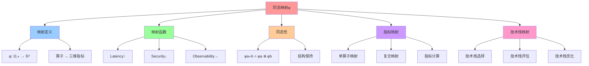
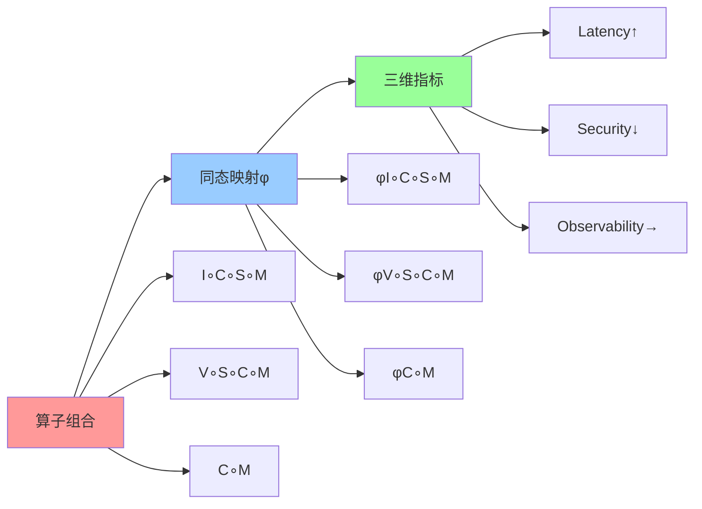
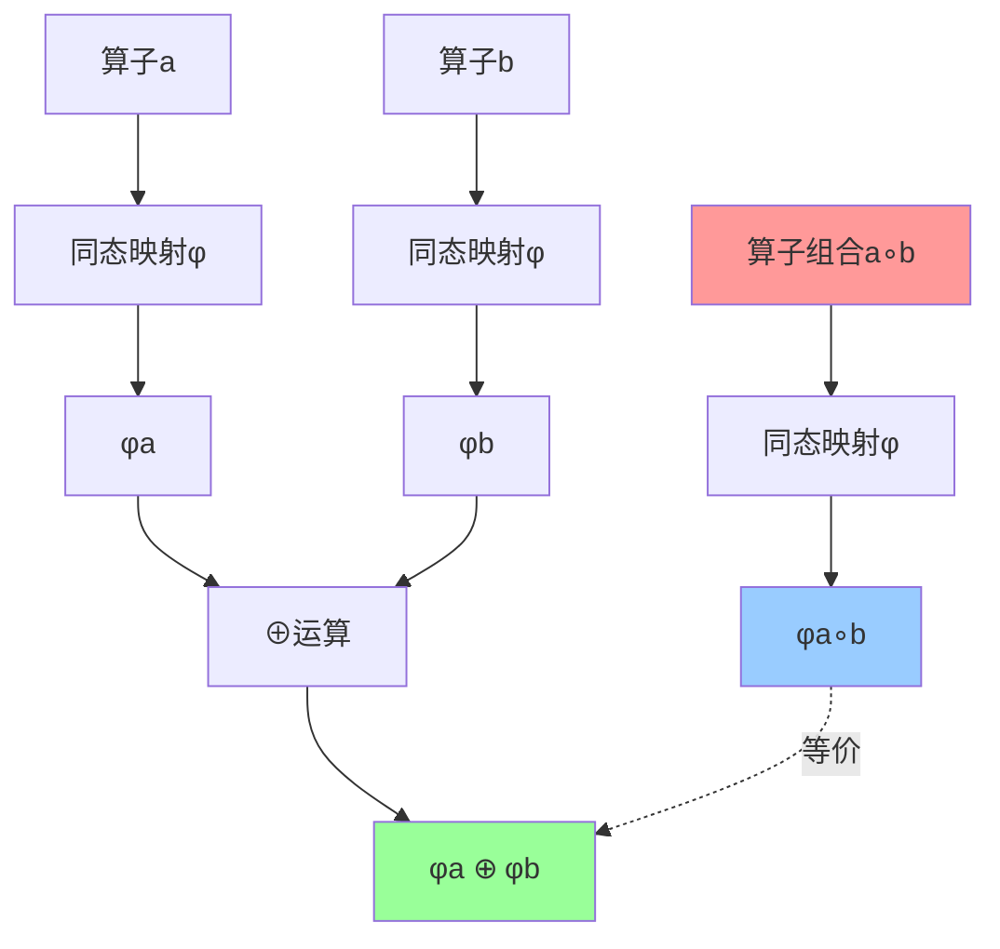
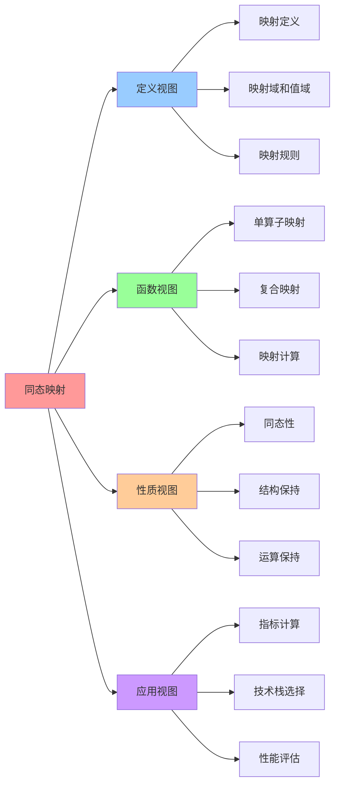

# 同态映射：φ: 算子 → 技术栈

## 📑 目录

- [同态映射：φ: 算子 → 技术栈](#同态映射φ-算子--技术栈)
  - [📑 目录](#-目录)
  - [1 同态映射概述](#1-同态映射概述)
  - [2 映射函数定义](#2-映射函数定义)
  - [3 指标映射](#3-指标映射)
    - [指标计算规则](#指标计算规则)
    - [复合映射示例](#复合映射示例)
  - [4 技术栈映射](#4-技术栈映射)
  - [5 映射示例](#5-映射示例)
    - [示例 1：I∘C∘S∘M](#示例-1icsm)
    - [示例 2：V∘S∘C∘M](#示例-2vscm)
  - [6 2025 年更新](#6-2025-年更新)
  - [7 参考](#7-参考)
  - [8 🧠 认知增强：思维导图、建模视图与图表达转换](#8--认知增强思维导图建模视图与图表达转换)
    - [8.1 同态映射完整思维导图](#81-同态映射完整思维导图)
    - [8.2 同态映射建模视图](#82-同态映射建模视图)
      - [同态映射函数图](#同态映射函数图)
      - [同态性保持图](#同态性保持图)
    - [8.3 同态映射多维关系矩阵](#83-同态映射多维关系矩阵)
      - [算子-指标-映射三维矩阵](#算子-指标-映射三维矩阵)
      - [组合-映射-指标映射矩阵](#组合-映射-指标映射矩阵)
    - [8.4 图表达和转换](#84-图表达和转换)
      - [同态映射视图转换关系](#同态映射视图转换关系)
      - [视图转换规则](#视图转换规则)
    - [8.5 形象化解释论证](#85-形象化解释论证)
      - [1. 同态映射 = 翻译系统](#1-同态映射--翻译系统)
      - [2. 同态性 = 运算保持](#2-同态性--运算保持)
      - [3. 三维指标 = 体检报告](#3-三维指标--体检报告)
      - [4. 映射函数 = 测量工具](#4-映射函数--测量工具)
    - [8.6 专家观点与论证](#86-专家观点与论证)
      - [计算信息软件科学家的观点](#计算信息软件科学家的观点)
        - [1. Emmy Noether（抽象代数创始人）](#1-emmy-noether抽象代数创始人)
        - [2. Saunders Mac Lane（范畴论创始人）](#2-saunders-mac-lane范畴论创始人)
        - [3. Philip Wadler（函数式编程专家）](#3-philip-wadler函数式编程专家)
      - [计算信息软件教育家的观点](#计算信息软件教育家的观点)
        - [1. Benjamin Pierce（类型系统教育家）](#1-benjamin-pierce类型系统教育家)
        - [2. Robert Harper（编程语言教育家）](#2-robert-harper编程语言教育家)
      - [计算信息软件认知学家的观点](#计算信息软件认知学家的观点)
        - [1. David Marr（计算认知科学家）](#1-david-marr计算认知科学家)
        - [2. Douglas Hofstadter（认知科学家）](#2-douglas-hofstadter认知科学家)
    - [8.7 认知学习路径矩阵](#87-认知学习路径矩阵)
    - [8.8 专家推荐阅读路径](#88-专家推荐阅读路径)

---

## 1 同态映射概述

**同态映射**：φ : (Ω,∘) → ℝ³

**核心思想**：将算子组合映射到**三维指标**（Latency↑, Security↓,
Observability→），并保持运算分布。

**映射函数**：

```text
φ: (Ω,∘) → ℝ³
  ω ↦ (Latency↑, Security↓, Observability→)
```

**同态性**：

```text
φ(a∘b) = φ(a) ⊕ φ(b)
```

其中 `⊕` 对应：

- **Latency**：加法（累加）
- **Security**：取最小（越低越好）
- **Observability**：取最大（越高越好）

## 2 映射函数定义

**映射函数**：φ : Ω → ℝ³

**定义**：

```text
φ(ω) = (Latency(ω), Security(ω), Observability(ω))
```

**指标说明**：

| 指标               | 符号 | 说明                 | 数值范围                |
| ------------------ | ---- | -------------------- | ----------------------- |
| **Latency↑**       | ↑    | 延迟（越低越好）     | 1▲（最高）～ 5▼（最低） |
| **Security↓**      | ↓    | 安全（越高越好）     | 1▲（最低）～ 5▼（最高） |
| **Observability→** | →    | 可观测性（越高越好） | 1▲（最低）～ 5▼（最高） |

**单算子映射**：

| 算子  | φ(ω)         | Latency      | Security       | Observability    |
| ----- | ------------ | ------------ | -------------- | ---------------- |
| **V** | (2▲, 5▼, 3▲) | 2▲（高延迟） | 5▼（最高安全） | 3▲（中等可观测） |
| **I** | (5▼, 3▲, 5▼) | 5▼（低延迟） | 3▲（中等安全） | 5▼（高可观测）   |
| **C** | (5▼, 3▲, 5▼) | 5▼（低延迟） | 3▲（中等安全） | 5▼（高可观测）   |
| **S** | (5▼, 4▼, 5▼) | 5▼（低延迟） | 4▼（高安全）   | 5▼（高可观测）   |
| **M** | (4▼, 4▼, 5▼) | 4▼（低延迟） | 4▼（高安全）   | 5▼（最高可观测） |

## 3 指标映射

### 指标计算规则

**Latency（延迟）**：

```text
Latency(a∘b) = Latency(a) + Latency(b)
```

**示例**：

- `Latency(V∘C) = Latency(V) + Latency(C) = 2▲ + 5▼ = 4▼`

**Security（安全）**：

```text
Security(a∘b) = min(Security(a), Security(b))
```

**示例**：

- `Security(C∘S) = min(Security(C), Security(S)) = min(3▲, 4▼) = 3▲`

**Observability（可观测性）**：

```text
Observability(a∘b) = max(Observability(a), Observability(b))
```

**示例**：

- `Observability(C∘M) = max(Observability(C), Observability(M)) = max(5▼, 5▼) = 5▼`

### 复合映射示例

**I∘C∘S∘M**：

| 步骤 | 算子 | φ(ω)         | 累加结果     |
| ---- | ---- | ------------ | ------------ |
| 1    | I    | (5▼, 3▲, 5▼) | (5▼, 3▲, 5▼) |
| 2    | C    | (5▼, 3▲, 5▼) | (5▼, 3▲, 5▼) |
| 3    | S    | (5▼, 4▼, 5▼) | (5▼, 3▲, 5▼) |
| 4    | M    | (4▼, 4▼, 5▼) | (5▼, 3▲, 5▼) |

**结果**：`(Latency=5▼, Security=3▲, Observability=5▼)`

**V∘S∘C∘M**：

| 步骤 | 算子 | φ(ω)         | 累加结果     |
| ---- | ---- | ------------ | ------------ |
| 1    | V    | (2▲, 5▼, 3▲) | (2▲, 5▼, 3▲) |
| 2    | S    | (5▼, 4▼, 5▼) | (4▼, 4▼, 4▼) |
| 3    | C    | (5▼, 3▲, 5▼) | (4▼, 3▲, 5▼) |
| 4    | M    | (4▼, 4▼, 5▼) | (4▼, 3▲, 5▼) |

**结果**：`(Latency=4▼, Security=3▲, Observability=5▼)`

## 4 技术栈映射

**技术栈映射**：φ(算子序列) → 实际技术实现

**映射表**：

| φ(算子序列)     | 典型技术链                                                                        | Latency | Security | Observability |
| --------------- | --------------------------------------------------------------------------------- | ------- | -------- | ------------- |
| **φ(I∘C∘S∘M)**  | `docker build (I)` → `docker run --seccomp=custom.json (C∘S)` → Istio sidecar (M) | 5▼      | 3▲       | 5▼            |
| **φ(V∘S∘C∘M)**  | Kata VM (V) → seccomp inside guest (S) → containerd (C) → Istio Ambient (M)       | 4▼      | 5▼       | 4▼            |
| **φ(I∘C∘S∘W)**  | `docker build (I)` → crun+wasmEdge (C∘W) → seccomp (S)                            | 5▼      | 4▼       | 4▼            |
| **φ(V∘C∘S∘M)**  | Kata VM (V) → containerd (C) → seccomp (S) → Istio Ambient (M)                    | 4▼      | 4▼       | 4▼            |
| **φ(Kc∘S∘C∘M)** | Kata-runtime (Kc) → seccomp (S) → containerd (C) → Istio Ambient (M)              | 4▼      | 5▼       | 4▼            |

**映射解读**：

- **Latency↑** 采用 **"↑"** 表示延迟越高越差；数值越大越差
- **Security↓** 采用 **"↓"** 表示安全越高越好；数值越小越好
- **Observability→** 采用 **"→"** 表示可观测度越高越好；数值越大越好

## 5 映射示例

### 示例 1：I∘C∘S∘M

**算子序列**：`I → C → S → M`

**映射过程**：

1. **I**：`φ(I) = (5▼, 3▲, 5▼)`
2. **C**：`φ(C) = (5▼, 3▲, 5▼)` → `(5▼, 3▲, 5▼)`
3. **S**：`φ(S) = (5▼, 4▼, 5▼)` → `(5▼, 3▲, 5▼)`（Security=min(3▲, 4▼)=3▲）
4. **M**：`φ(M) = (4▼, 4▼, 5▼)` → `(5▼, 3▲, 5▼)`（Latency=max(5▼, 4▼)=5▼）

**结果**：`(Latency=5▼, Security=3▲, Observability=5▼)`

**技术实现**：`docker build (I)` → `docker run --seccomp=custom.json (C∘S)` →
Istio sidecar (M)`

### 示例 2：V∘S∘C∘M

**算子序列**：`V → S → C → M`

**映射过程**：

1. **V**：`φ(V) = (2▲, 5▼, 3▲)`
2. **S**：`φ(S) = (5▼, 4▼, 5▼)` → `(4▼, 4▼, 4▼)`（Latency=2▲+5▼=4▼,
   Security=min(5▼, 4▼)=4▼, Observability=max(3▲, 5▼)=5▼）
3. **C**：`φ(C) = (5▼, 3▲, 5▼)` → `(4▼, 3▲, 5▼)`（Security=min(4▼, 3▲)=3▲）
4. **M**：`φ(M) = (4▼, 4▼, 5▼)` → `(4▼, 3▲, 5▼)`（Latency=max(4▼, 4▼)=4▼）

**结果**：`(Latency=4▼, Security=3▲, Observability=5▼)`

**技术实现**：`Kata VM (V)` → `seccomp inside guest (S)` → `containerd (C)` →
`Istio Ambient (M)`

## 6 2025 年更新

**新增算子映射**：

| 算子   | φ(ω)         | Latency      | Security       | Observability    |
| ------ | ------------ | ------------ | -------------- | ---------------- |
| **Am** | (5▼, 4▼, 5▼) | 5▼（低延迟） | 4▼（高安全）   | 5▼（最高可观测） |
| **W**  | (5▼, 3▲, 5▼) | 5▼（低延迟） | 3▲（中等安全） | 5▼（高可观测）   |
| **We** | (5▼, 3▲, 5▼) | 5▼（低延迟） | 3▲（中等安全） | 5▼（高可观测）   |

**新增组合映射**：

| φ(算子序列)     | 典型技术链                                                                 | Latency | Security | Observability |
| --------------- | -------------------------------------------------------------------------- | ------- | -------- | ------------- |
| **φ(I∘C∘S∘Am)** | `docker build (I)` → `docker run (C)` → `seccomp (S)` → Istio Ambient (Am) | 5▼      | 3▲       | 5▼            |
| **φ(I∘C∘S∘W)**  | `docker build (I)` → crun+wasmEdge (C∘W) → seccomp (S)                     | 5▼      | 4▼       | 4▼            |
| **φ(C∘M)**      | `docker run (C)` → Istio sidecar (M)                                       | 5▼      | 3▲       | 5▼            |
| **φ(C∘Am)**     | `docker run (C)` → Istio Ambient (Am)                                      | 5▼      | 3▲       | 5▼            |

**Service Mesh 增强**：

- **M**：`φ(M) = (4▼, 4▼, 5▼)`（Service Mesh 提供零信任安全和可观测性）
- **Am**：`φ(Am) = (5▼, 4▼, 5▼)`（Ambient Mesh 提供更低延迟）

## 7 参考

**关联文档**：

- **[复合运算表](04-composition-table.md)** - 20×20 运算表
- **[最简范式定理](05-normal-form-theorem.md)** - 主范式定理
- **[实践案例](08-practical-examples.md)** - 算子组合 → 技术栈

**外部参考**：

- [Homomorphism (Wikipedia)](https://en.wikipedia.org/wiki/Homomorphism)
- [Function Composition (Wikipedia)](https://en.wikipedia.org/wiki/Function_composition)

---

## 8 🧠 认知增强：思维导图、建模视图与图表达转换

### 8.1 同态映射完整思维导图



### 8.2 同态映射建模视图

#### 同态映射函数图



#### 同态性保持图



### 8.3 同态映射多维关系矩阵

#### 算子-指标-映射三维矩阵

| 算子 | I | C | S | M | W | Am | Latency | Security | Observability | 认知价值 |
|-----|---|---|---|---|---|---|---------|----------|---------------|---------|
| **I** | ✅ 核心 | ⚠️ 部分 | ❌ 无 | ❌ 无 | ❌ 无 | ❌ 无 | 5▼ | 3▲ | 4▼ | 映射理解 |
| **C** | ⚠️ 部分 | ✅ 核心 | ⚠️ 部分 | ⚠️ 部分 | ⚠️ 部分 | ⚠️ 部分 | 5▼ | 3▲ | 5▼ | 映射理解 |
| **S** | ❌ 无 | ⚠️ 部分 | ✅ 核心 | ❌ 无 | ❌ 无 | ❌ 无 | 5▼ | 4▼ | 5▼ | 映射理解 |
| **M** | ❌ 无 | ⚠️ 部分 | ❌ 无 | ✅ 核心 | ❌ 无 | ⚠️ 部分 | 4▼ | 4▼ | 5▼ | 映射理解 |
| **W** | ❌ 无 | ⚠️ 部分 | ❌ 无 | ❌ 无 | ✅ 核心 | ❌ 无 | 5▼ | 4▼ | 4▼ | 映射理解 |
| **Am** | ❌ 无 | ⚠️ 部分 | ❌ 无 | ⚠️ 部分 | ❌ 无 | ✅ 核心 | 5▼ | 4▼ | 5▼ | 映射理解 |

#### 组合-映射-指标映射矩阵

| 组合 | I∘C∘S∘M | V∘S∘C∘M | C∘M | C∘Am | I∘C∘S∘W | Latency | Security | Observability | 认知价值 |
|-----|---------|---------|-----|------|---------|---------|----------|---------------|---------|
| **I∘C∘S∘M** | ✅ 核心 | ❌ 无 | ⚠️ 部分 | ❌ 无 | ❌ 无 | 5▼ | 4▼ | 5▼ | 组合理解 |
| **V∘S∘C∘M** | ❌ 无 | ✅ 核心 | ⚠️ 部分 | ❌ 无 | ❌ 无 | 4▼ | 5▼ | 4▼ | 组合理解 |
| **C∘M** | ⚠️ 部分 | ⚠️ 部分 | ✅ 核心 | ⚠️ 部分 | ❌ 无 | 5▼ | 3▲ | 5▼ | 组合理解 |
| **C∘Am** | ❌ 无 | ❌ 无 | ⚠️ 部分 | ✅ 核心 | ❌ 无 | 5▼ | 3▲ | 5▼ | 组合理解 |
| **I∘C∘S∘W** | ⚠️ 部分 | ❌ 无 | ❌ 无 | ❌ 无 | ✅ 核心 | 5▼ | 4▼ | 4▼ | 组合理解 |

### 8.4 图表达和转换

#### 同态映射视图转换关系



#### 视图转换规则

**转换规则 1：算子组合 → 指标映射**:

```yaml
算子到指标转换:
  输入: 算子组合（I∘C∘S∘M）
  转换规则:
    - 单算子映射 → φ(I), φ(C), φ(S), φ(M)
    - 复合映射 → φ(I∘C∘S∘M) = φ(I) ⊕ φ(C) ⊕ φ(S) ⊕ φ(M)
    - 指标计算 → (Latency, Security, Observability)
  输出: 三维指标（5▼, 4▼, 5▼）
```

**转换规则 2：指标映射 → 技术栈选择**:

```yaml
指标到技术栈转换:
  输入: 三维指标（Latency, Security, Observability）
  转换规则:
    - Latency优先 → 选择低延迟技术栈
    - Security优先 → 选择高安全技术栈
    - Observability优先 → 选择高可观测技术栈
  输出: 技术栈选择（I∘C∘S∘M或V∘S∘C∘M）
```

### 8.5 形象化解释论证

#### 1. 同态映射 = 翻译系统

> **类比**：同态映射就像翻译系统，算子组合是"源语言"（技术栈），三维指标是"目标语言"（性能指标），就像翻译系统将一种语言翻译成另一种语言并保持语言结构一样，同态映射将算子组合映射到指标并保持运算结构。

**认知价值**：

- **映射理解**：通过翻译系统类比，理解同态映射的映射作用
- **结构保持理解**：通过语言结构保持类比，理解同态映射的结构保持
- **转换理解**：通过语言转换类比，理解同态映射的转换作用

#### 2. 同态性 = 运算保持

> **类比**：同态性就像运算保持，φ(a∘b) = φ(a) ⊕ φ(b)就像"先运算再映射等于先映射再运算"，就像运算保持保证运算的一致性一样，同态性保证映射的一致性。

**认知价值**：

- **一致性理解**：通过运算保持类比，理解同态性的一致性保证
- **运算理解**：通过运算类比，理解同态性的运算保持
- **性质理解**：通过性质类比，理解同态性的重要性

#### 3. 三维指标 = 体检报告

> **类比**：三维指标就像体检报告，Latency是"血压"（延迟），Security是"安全指数"（安全性），Observability是"健康指数"（可观测性），就像体检报告通过多个指标评估健康一样，三维指标通过多个指标评估技术栈性能。

**认知价值**：

- **指标理解**：通过体检报告类比，理解三维指标的含义
- **评估理解**：通过健康评估类比，理解技术栈性能的评估
- **综合理解**：通过综合评估类比，理解多指标的综合分析

#### 4. 映射函数 = 测量工具

> **类比**：映射函数就像测量工具，将技术栈"测量"成指标，就像测量工具将物体测量成数值一样，映射函数将技术栈映射成指标。

**认知价值**：

- **测量理解**：通过测量工具类比，理解映射函数的测量作用
- **量化理解**：通过量化类比，理解映射函数的量化作用
- **工具理解**：通过工具类比，理解映射函数的工具性

### 8.6 专家观点与论证

#### 计算信息软件科学家的观点

##### 1. Emmy Noether（抽象代数创始人）

> "Homomorphisms are structure-preserving maps between algebraic structures."

**在同态映射中的应用**：

- **结构保持理解**：同态映射保持算子组合的结构
- **映射理解**：同态映射是结构保持的映射
- **代数理解**：通过同态映射理解代数结构

##### 2. Saunders Mac Lane（范畴论创始人）

> "A homomorphism is a morphism that preserves structure."

**在同态映射中的应用**：

- **态射理解**：同态映射是保持结构的态射
- **结构理解**：通过同态映射理解结构的保持
- **范畴理解**：通过同态映射理解范畴的结构

##### 3. Philip Wadler（函数式编程专家）

> "Homomorphisms are fundamental to understanding computation."

**在同态映射中的应用**：

- **计算理解**：同态映射是理解计算的基础
- **函数理解**：通过同态映射理解函数的性质
- **抽象理解**：通过同态映射理解计算的抽象

#### 计算信息软件教育家的观点

##### 1. Benjamin Pierce（类型系统教育家）

> "Homomorphisms teach us to think in terms of structure-preserving transformations."

**教育价值**：

- **结构理解**：通过同态映射学习结构保持的转换
- **转换理解**：通过同态映射学习转换的方法
- **思维训练**：通过同态映射训练结构化思维

##### 2. Robert Harper（编程语言教育家）

> "Homomorphisms provide a language for talking about structure-preserving maps."

**教育价值**：

- **语言理解**：同态映射提供描述结构保持映射的语言
- **描述理解**：通过同态映射学习描述的方法
- **表达理解**：通过同态映射学习表达的方式

#### 计算信息软件认知学家的观点

##### 1. David Marr（计算认知科学家）

> "Understanding structure-preserving maps helps us understand how the mind processes information."

**认知价值**：

- **信息处理理解**：通过同态映射理解信息处理的方式
- **结构理解**：通过同态映射理解结构的处理
- **认知理解**：通过同态映射理解认知的机制

##### 2. Douglas Hofstadter（认知科学家）

> "Analogy is the core of cognition, and homomorphisms are a formalization of analogy."

**认知价值**：

- **类比理解**：同态映射是类比的形式化
- **形式化理解**：通过同态映射理解类比的形式化
- **认知提升**：通过同态映射提升认知能力

### 8.7 认知学习路径矩阵

| 学习阶段 | 核心内容 | 形象化理解 | 技术理解 | 实践应用 | 认知目标 |
|---------|---------|-----------|---------|---------|---------|
| **入门** | 映射概念 | 翻译系统类比 | 映射定义 | 简单映射 | 建立基础 |
| **进阶** | 映射函数 | 测量工具类比 | 函数定义 | 函数应用 | 理解函数 |
| **高级** | 同态性 | 运算保持类比 | 同态性质 | 性质应用 | 掌握性质 |
| **专家** | 映射应用 | 体检报告类比 | 应用方法 | 复杂应用 | 掌握应用 |

### 8.8 专家推荐阅读路径

**计算信息软件科学家推荐路径**：

1. **映射定义**：理解同态映射的基本定义
2. **映射函数**：理解映射函数的定义和性质
3. **同态性**：理解同态性的定义和证明
4. **映射应用**：理解映射在技术栈中的应用
5. **映射优化**：理解映射的优化方法

**计算信息软件教育家推荐路径**：

1. **形象化理解**：通过翻译系统、运算保持、体检报告、测量工具等类比，建立直观理解
2. **渐进学习**：从简单映射开始，逐步学习复杂映射
3. **实践结合**：结合实际技术栈，理解映射的应用
4. **思维训练**：通过映射学习，训练数学思维能力

**计算信息软件认知学家推荐路径**：

1. **认知模式**：识别映射中的认知模式
2. **类比理解**：通过类比理解映射概念
3. **模型构建**：构建映射的心理模型
4. **认知提升**：通过映射学习，提升认知能力

---

**最后更新**：2025-11-04 **维护者**：项目团队
