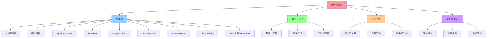
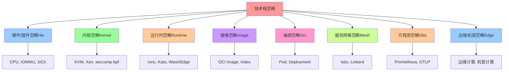
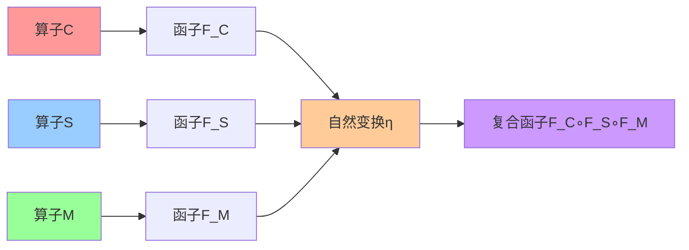
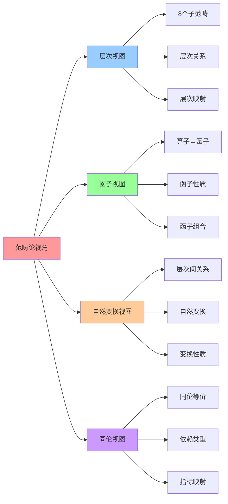

# 范畴论视角：函子、自然变换与同伦

## 📑 目录

- [范畴论视角：函子、自然变换与同伦](#范畴论视角函子自然变换与同伦)
  - [📑 目录](#-目录)
  - [1 范畴论概述](#1-范畴论概述)
  - [2 层次化 → 子范畴](#2-层次化--子范畴)
  - [3 算子 → 函子](#3-算子--函子)
  - [4 组装范畴 → 复合表](#4-组装范畴--复合表)
  - [5 归约与最简范式：重写系统](#5-归约与最简范式重写系统)
  - [6 评价指标 ↔ 依赖类型](#6-评价指标--依赖类型)
  - [7 同伦类型论视角](#7-同伦类型论视角)
  - [8 参考](#8-参考)
  - [9 🧠 认知增强：思维导图、建模视图与图表达转换](#9--认知增强思维导图建模视图与图表达转换)
    - [9.1 范畴论视角完整思维导图](#91-范畴论视角完整思维导图)
    - [9.2 范畴论视角建模视图](#92-范畴论视角建模视图)
      - [范畴层次结构图](#范畴层次结构图)
      - [函子与自然变换图](#函子与自然变换图)
    - [9.3 范畴论视角多维关系矩阵](#93-范畴论视角多维关系矩阵)
      - [层次-范畴-对象三维矩阵](#层次-范畴-对象三维矩阵)
      - [算子-函子-自然变换映射矩阵](#算子-函子-自然变换映射矩阵)
    - [9.4 图表达和转换](#94-图表达和转换)
      - [范畴论视角视图转换关系](#范畴论视角视图转换关系)
    - [9.5 形象化解释论证](#95-形象化解释论证)
      - [1. 范畴 = 城市系统](#1-范畴--城市系统)
      - [2. 函子 = 城市间交通系统](#2-函子--城市间交通系统)
      - [3. 自然变换 = 交通规则](#3-自然变换--交通规则)
      - [4. 同伦等价 = 等价路径](#4-同伦等价--等价路径)
    - [9.6 专家观点与论证](#96-专家观点与论证)
      - [计算信息软件科学家的观点](#计算信息软件科学家的观点)
        - [1. Saunders Mac Lane（范畴论创始人）](#1-saunders-mac-lane范畴论创始人)
        - [2. Alexander Grothendieck（代数几何学家）](#2-alexander-grothendieck代数几何学家)
        - [3. Bartosz Milewski（范畴论教育家）](#3-bartosz-milewski范畴论教育家)
      - [计算信息软件教育家的观点](#计算信息软件教育家的观点)
        - [1. Emily Riehl（范畴论教育家）](#1-emily-riehl范畴论教育家)
        - [2. Tom Leinster（范畴论教育家）](#2-tom-leinster范畴论教育家)
      - [计算信息软件认知学家的观点](#计算信息软件认知学家的观点)
        - [1. David Marr（计算认知科学家）](#1-david-marr计算认知科学家)
        - [2. Douglas Hofstadter（认知科学家）](#2-douglas-hofstadter认知科学家)
    - [9.7 认知学习路径矩阵](#97-认知学习路径矩阵)
    - [9.8 专家推荐阅读路径](#98-专家推荐阅读路径)
  - [2025 年最新实践](#2025-年最新实践)
    - [范畴论视角应用最佳实践（2025）](#范畴论视角应用最佳实践2025)
  - [实际应用案例](#实际应用案例)
    - [案例 1：范畴论视角应用（2025）](#案例-1范畴论视角应用2025)

---

## 1 范畴论概述

**范畴论视角**：将云原生技术栈从**操作层面**提升到**抽象层面**。

**核心思想**：

- **层次化**：把栈拆成若干子范畴（硬件 → 内核 → 运行时 → 镜像 → 编排 → 网格 → 观
  测 → 边缘/机密/无服务器）
- **算子 → 函子**：把算子看成**函子**，把层次之间的关系看成**自然变换**
- **同伦类型论**：把"不同实现同等可行"的算子序列看成**同伦等价**，把 3 维指标视
  为**依赖类型**

**结果**：

1. **层次 → 子范畴**：每层是一个小范畴
2. **算子 → 函子**：`C`, `S`, `M`, … 都是 **端到端的幂等端点**，即 **idempotent
   endofunctors**
3. **表 → 合成表**：是 **单个范畴的呈现**（对象＝算子，态射＝组合）
4. **最简范式**：是 **重写系统的标准形式**，即 **normal form**
5. **指标映射 φ**：是 **从算子范畴到实数三元组的函子**（可看作 **依赖类型** 的解
   释）

## 2 层次化 → 子范畴

**8 个子范畴**：

| 层级                                 | 子范畴      | 典型对象                                  | 典型态射              | 备注       |
| ------------------------------------ | ----------- | ----------------------------------------- | --------------------- | ---------- |
| **硬件/固件**                        | **Hw**      | CPU, IOMMU, SGX, TPM, μ                   | 设备固件、CPU 指令    | 低层不可变 |
| **Hypervisor / 内核**                | **Kernel**  | KVM, Xen, Hyper‑V, seccomp‑bpf, eBPF      | VM 生成、系统调用过滤 | 中层控制   |
| **Runtime**                          | **Runtime** | runc, Kata, gVisor, Firecracker, WasmEdge | 运行时容器/VM         | 高层动态   |
| **Image / Artifact**                 | **Image**   | OCI Image, Index                          | 镜像构建、层压缩      | 只读       |
| **Orchestration**                    | **Orc**     | Pod, Deployment, DaemonSet                | 调度/复制             | 业务层     |
| **Mesh & Traffic**                   | **Mesh**    | Envoy, Istio, Ambient                     | 路由/代理             | 网络层     |
| **Observability / Policy**           | **Obs**     | Prometheus, OpenTelemetry, Gatekeeper     | 监控/准入             | 观察层     |
| **Edge / Confidential / Serverless** | **Edge**    | K3s, Knative, WasmEdge                    | 边缘/无服务器         | 特殊需求   |

**整体范畴**：

```text
C = Hw ∪ Kernel ∪ Runtime ∪ Image ∪ Orc ∪ Mesh ∪ Obs ∪ Edge
```

**对象集**：Ω 就是 C 的对象集合

## 3 算子 → 函子

**算子作为函子**：

| 符号   | 函子       | 源范畴            | 目标范畴      | 代数属性                                         |
| ------ | ---------- | ----------------- | ------------- | ------------------------------------------------ |
| **V**  | `virt`     | Image → Kernel    | VM            | Idempotent endofunctor, non‑commutative with `C` |
| **I**  | `pack`     | Binary → Image    | Image         | Idempotent endofunctor                           |
| **C**  | `cont`     | Image → Runtime   | Container     | Idempotent endofunctor                           |
| **S**  | `sandbox`  | Runtime → Runtime | Sandbox       | Idempotent endofunctor                           |
| **M**  | `mesh`     | Runtime → Mesh    | MeshContainer | Idempotent endofunctor                           |
| **Am** | `ambient`  | Runtime → Mesh    | AmbientMesh   | Idempotent endofunctor                           |
| **W**  | `wasm`     | Binary → Runtime  | WasmRuntime   | Idempotent endofunctor                           |
| **We** | `wasmedge` | Binary → Runtime  | EdgeWasm      | Idempotent endofunctor                           |

**属性解读**：

- **Idempotent endofunctor** → 复合两次等于一次（A2）
- **Non‑commutative** (`V` 与 `C`) → A3
- **Kernel → Kernel** 的 `P`、`Ns`、`Cg` 等可以在任何容器/VM 上堆叠，给我们
  _monoidal_ 的 tensor 结构（×, ⋊）

## 4 组装范畴 → 复合表

**预设的呈现**：

- **对象** = 20 个算子符号
- **态射** = 任何两算子的组合 (∘)
- **合成律** = 20×20 表格，单元格给出 (Latency↑, Security↓, Observability→)

**这张表正是 C 的"呈现"**（生成器与关系的集合），在 **Grothendieck 语义** 下，它
是一个**单生成**的**预范畴**，把每个单元格视作 **态射**。

**例子**：

| ∘     | V        | I        | C        | S        | M        |
| ----- | -------- | -------- | -------- | -------- | -------- |
| **V** | 2▲‑5▼‑2▲ | 3▲‑4▼‑3▲ | 4▼‑4▼‑3▲ | 5▼‑5▼‑4▼ | 4▼‑5▼‑4▼ |
| **I** | —        | 5▼‑3▲‑5▼ | 5▼‑3▲‑5▼ | 5▼‑4▼‑5▼ | 5▼‑3▲‑5▼ |
| **C** | —        | —        | 5▼‑3▲‑5▼ | 5▼‑4▼‑5▼ | 5▼‑3▲‑5▼ |

**合成律**：

- `V ∘ C = 4▼‑5▼‑4▼`
- `I ∘ C = 5▼‑3▲‑5▼`
- `C ∘ S = 5▼‑4▼‑5▼`

这正对应 **A1**（闭合）与 **A5**（φ 同态）——表里每个格子都是 φ(ω₁∘ω₂) 的结果。

## 5 归约与最简范式：重写系统

**生成**：`Σ = {V,I,C,S,M,...}`

**关系**：

- `C∘C = C`, `S∘S = S`, `M∘M = M`, `W∘W = W`（幂等）
- `V∘C ≠ C∘V`（非交换）
- `V` 只能出现一次并且必须在序列的两端（逆元/弱逆）

**重写规则**：

1. 消除重复幂等项（`X∘X → X`）
2. 重新排序可交换项为固定顺序
3. 把 `V` 拉到最前或最后
4. 若存在 `S`，确保其紧跟 `C` 或 `V`

**终点**：

- **主范式 1**：`I ∘ C ∘ S ∘ M`
- **主范式 2**：`V ∘ S ∘ C ∘ M`

**在同伦类型论里**，这两条主范式是 **两条不同的归约路径**，但它们在 **同伦意义
下**是等价的（有自然变换把一条变成另一条）。

## 6 评价指标 ↔ 依赖类型

**依赖类型**：

```haskell
type Metric = (Latency, Security, Observability)
```

Latency = 1 .. 5 -- 1 = 最低延迟 Security = 1 .. 5 -- 5 = 最高安全 Observ = 1 ..
5 -- 5 = 最高可观测

```haskell
type Metric = (Latency, Security, Observability)

Latency  = 1 .. 5   -- 1 = 最低延迟
Security = 1 .. 5   -- 5 = 最高安全
Observ   = 1 .. 5   -- 5 = 最高可观测

-- φ : Functor Ω → Metric
phi :: Ω → Metric
```

**φ 是类型推导的一层**：从算子生成三元组。

**同态保证**：

$$\phi(\omega_1 \circ \omega_2) = \phi(\omega_1) \oplus \phi(\omega_2)$$

其中 `⊕` 对应**延迟加法**、**安全取最小**、**观测取最大**。

**对应同伦类型论的路径空间**：两条不同的算子路径如果得到相同的三元组，就在"取值
空间"中是**等价路径**（同伦等价）。

## 7 同伦类型论视角

**可组合的"程序空间"**：

- **对象** = 运行时结构（Container、VM、WasmRuntime 等）
- **态射** = 变换（`C`, `S`, `M`, `W`, `V` 等）
- **同伦** = 两条变换链在**功能上等价**（得到同一三元组）
- **高阶同伦** = 在"安全级别"或"可观测程度"上有可比较的 **度量**，可通过 **依赖
  类型** 记录

**例子**：

算子序列

```text
I → C → S → M
```

与

```text
I → C → S → W
```

在 **Latency, Security, Observability** 上可能得到

```text
5, 3, 5   vs   5, 4, 4
```

因此它们在**同伦意义下**不是等价（指标不同），而是 **在某种"偏序"下可比较**。

## 8 参考

**关联文档**：

- **[算子定义](01-operator-definition.md)** - 20 个一元算子详解
- **[代数结构](02-algebraic-structure.md)** - 代数结构 Σ = ⟨Ω, ℱ, 𝒫, ℒ⟩
- **[最简范式定理](05-normal-form-theorem.md)** - 主范式定理

**外部参考**：

- [Category Theory (Wikipedia)](https://en.wikipedia.org/wiki/Category_theory)
- [Functor (Wikipedia)](https://en.wikipedia.org/wiki/Functor)
- [Homotopy Type Theory](https://homotopytypetheory.org/)

---

## 9 🧠 认知增强：思维导图、建模视图与图表达转换

### 9.1 范畴论视角完整思维导图



### 9.2 范畴论视角建模视图

#### 范畴层次结构图



#### 函子与自然变换图



### 9.3 范畴论视角多维关系矩阵

#### 层次-范畴-对象三维矩阵

| 层次 | 子范畴 | 典型对象 | 典型态射 | 备注 | 认知价值 |
|-----|--------|---------|---------|------|---------|
| **硬件/固件** | Hw | CPU, IOMMU, SGX | 设备固件、CPU指令 | 低层不可变 | 层次理解 |
| **Hypervisor/内核** | Kernel | KVM, Xen, seccomp-bpf | VM生成、系统调用过滤 | 中层控制 | 层次理解 |
| **Runtime** | Runtime | runc, Kata, WasmEdge | 运行时容器/VM | 高层动态 | 层次理解 |
| **Image/Artifact** | Image | OCI Image, Index | 镜像构建、层压缩 | 只读 | 层次理解 |
| **Orchestration** | Orc | Pod, Deployment | 调度/复制 | 业务层 | 层次理解 |
| **Service Mesh** | Mesh | Istio, Linkerd | 流量治理、安全 | 服务层 | 层次理解 |
| **Observability** | Obs | Prometheus, OTLP | 指标收集、追踪 | 观测层 | 层次理解 |
| **边缘/机密/Serverless** | Edge | 边缘计算、机密计算 | 边缘部署、机密执行 | 特殊层 | 层次理解 |

#### 算子-函子-自然变换映射矩阵

| 算子 | 函子 | 自然变换 | 幂等性 | 端到端 | 认知价值 |
|-----|------|---------|--------|--------|---------|
| **C** | F_C | η_C | ✅ 是 | ✅ 是 | 函子理解 |
| **S** | F_S | η_S | ✅ 是 | ✅ 是 | 函子理解 |
| **M** | F_M | η_M | ✅ 是 | ✅ 是 | 函子理解 |
| **I** | F_I | η_I | ✅ 是 | ✅ 是 | 函子理解 |
| **V** | F_V | η_V | ❌ 否 | ✅ 是 | 函子理解 |

### 9.4 图表达和转换

#### 范畴论视角视图转换关系



### 9.5 形象化解释论证

#### 1. 范畴 = 城市系统

> **类比**：范畴就像城市系统，每个子范畴是"城市区域"（硬件区、内核区、运行时区），对象是"建筑物"（CPU、KVM、runc），态射是"道路"（设备固件、VM生成、容器运行），就像城市系统通过区域、建筑、道路组织城市一样，范畴通过子范畴、对象、态射组织技术栈。

**认知价值**：

- **系统理解**：通过城市系统类比，理解范畴的系统性
- **组织理解**：通过城市组织类比，理解范畴的组织方式
- **结构理解**：通过城市结构类比，理解范畴的结构

#### 2. 函子 = 城市间交通系统

> **类比**：函子就像城市间交通系统，将一座城市的建筑映射到另一座城市，保持城市结构，就像交通系统连接不同城市一样，函子连接不同范畴。

**认知价值**：

- **映射理解**：通过交通系统类比，理解函子的映射作用
- **连接理解**：通过城市连接类比，理解函子的连接作用
- **结构保持理解**：通过交通结构保持类比，理解函子的结构保持

#### 3. 自然变换 = 交通规则

> **类比**：自然变换就像交通规则，协调不同交通系统之间的关系，就像交通规则协调不同交通系统一样，自然变换协调不同函子之间的关系。

**认知价值**：

- **协调理解**：通过交通规则类比，理解自然变换的协调作用
- **关系理解**：通过交通关系类比，理解自然变换的关系性
- **规则理解**：通过交通规则类比，理解自然变换的规则性

#### 4. 同伦等价 = 等价路径

> **类比**：同伦等价就像等价路径，不同路径可以到达同一目的地，就像等价路径可以互相转换一样，同伦等价的技术栈可以互相转换。

**认知价值**：

- **等价理解**：通过等价路径类比，理解同伦等价的含义
- **转换理解**：通过路径转换类比，理解同伦等价的转换性
- **灵活性理解**：通过路径灵活性类比，理解同伦等价的灵活性

### 9.6 专家观点与论证

#### 计算信息软件科学家的观点

##### 1. Saunders Mac Lane（范畴论创始人）

> "Category theory provides a language for talking about structure-preserving maps."

**在范畴论视角中的应用**：

- **语言理解**：范畴论提供描述结构保持映射的语言
- **结构理解**：通过范畴论理解结构的保持
- **抽象理解**：通过范畴论理解抽象的层次

##### 2. Alexander Grothendieck（代数几何学家）

> "Categories are the natural framework for understanding mathematical structures."

**在范畴论视角中的应用**：

- **框架理解**：范畴是理解数学结构的自然框架
- **结构理解**：通过范畴理解技术栈的结构
- **统一理解**：通过范畴统一理解不同层次

##### 3. Bartosz Milewski（范畴论教育家）

> "Category theory teaches us to think in terms of objects and morphisms."

**在范畴论视角中的应用**：

- **对象理解**：通过范畴论理解对象的概念
- **态射理解**：通过范畴论理解态射的概念
- **思维训练**：通过范畴论训练抽象思维

#### 计算信息软件教育家的观点

##### 1. Emily Riehl（范畴论教育家）

> "Category theory provides a unified language for mathematics."

**教育价值**：

- **统一语言理解**：范畴论提供数学的统一语言
- **抽象理解**：通过范畴论学习抽象的方法
- **思维训练**：通过范畴论训练抽象思维

##### 2. Tom Leinster（范畴论教育家）

> "Category theory helps us see patterns across different areas of mathematics."

**教育价值**：

- **模式识别**：通过范畴论识别跨领域的模式
- **模式理解**：通过范畴论理解模式的本质
- **应用理解**：通过范畴论理解模式的应用

#### 计算信息软件认知学家的观点

##### 1. David Marr（计算认知科学家）

> "Understanding structure at multiple levels helps us understand complex systems."

**认知价值**：

- **多层次理解**：通过范畴论理解多层次结构
- **系统理解**：通过范畴论理解复杂系统
- **认知提升**：通过范畴论提升认知能力

##### 2. Douglas Hofstadter（认知科学家）

> "Analogy is the core of cognition, and category theory formalizes analogy."

**认知价值**：

- **类比理解**：范畴论形式化类比
- **形式化理解**：通过范畴论理解类比的形式化
- **认知提升**：通过范畴论提升认知能力

### 9.7 认知学习路径矩阵

| 学习阶段 | 核心内容 | 形象化理解 | 技术理解 | 实践应用 | 认知目标 |
|---------|---------|-----------|---------|---------|---------|
| **入门** | 范畴概念 | 城市系统类比 | 范畴定义 | 简单范畴 | 建立基础 |
| **进阶** | 函子概念 | 交通系统类比 | 函子定义 | 函子应用 | 理解函子 |
| **高级** | 自然变换 | 交通规则类比 | 自然变换定义 | 变换应用 | 掌握变换 |
| **专家** | 同伦类型论 | 等价路径类比 | 同伦理论 | 复杂应用 | 掌握理论 |

### 9.8 专家推荐阅读路径

**计算信息软件科学家推荐路径**：

1. **范畴定义**：理解范畴的基本定义和性质
2. **函子定义**：理解函子的定义和性质
3. **自然变换**：理解自然变换的定义和性质
4. **同伦类型论**：理解同伦类型论的基本概念
5. **应用实践**：理解范畴论在技术栈中的应用

**计算信息软件教育家推荐路径**：

1. **形象化理解**：通过城市系统、交通系统、交通规则、等价路径等类比，建立直观理解
2. **渐进学习**：从简单范畴开始，逐步学习复杂范畴
3. **实践结合**：结合实际技术栈，理解范畴论的应用
4. **思维训练**：通过范畴论学习，训练抽象思维能力

**计算信息软件认知学家推荐路径**：

1. **认知模式**：识别范畴论中的认知模式
2. **类比理解**：通过类比理解范畴论概念
3. **模型构建**：构建范畴论的心理模型
4. **认知提升**：通过范畴论学习，提升认知能力

---

---

## 2025 年最新实践

### 范畴论视角应用最佳实践（2025）

**2025 年趋势**：范畴论视角在抽象建模、函子映射、自然变换中的深度应用

**实践要点**：

- **抽象建模**：使用范畴论进行技术栈的抽象建模
- **函子映射**：基于函子进行技术栈之间的映射
- **自然变换**：使用自然变换进行技术栈转换

**代码示例**：

```python
# 2025 年范畴论视角工具
class CategoryViewTool:
    def __init__(self):
        self.modeler = CategoryModeler()
        self.functor_mapper = FunctorMapper()
        self.natural_transformer = NaturalTransformer()

    def model_category(self, technologies):
        """抽象建模"""
        return self.modeler.model(technologies)

    def map_functor(self, source, target):
        """函子映射"""
        return self.functor_mapper.map(source, target)

    def transform_natural(self, functor):
        """自然变换"""
        return self.natural_transformer.transform(functor)
```

## 实际应用案例

### 案例 1：范畴论视角应用（2025）

**场景**：使用范畴论视角进行技术栈抽象建模

**实现方案**：

```python
# 范畴论视角应用
tool = CategoryViewTool()

# 抽象建模
technologies = [Technology(name="Container"), Technology(name="VM")]
category = tool.model_category(technologies)

# 函子映射
source_category = Category(...)
target_category = Category(...)
functor = tool.map_functor(source_category, target_category)

# 自然变换
transformation = tool.transform_natural(functor)
```

**效果**：

- 抽象建模：基于范畴论的抽象建模，提高建模规范性
- 函子映射：使用函子进行技术栈映射，保证映射正确性
- 自然变换：使用自然变换进行转换，保证转换一致性

---

**最后更新**：2025-11-15 **维护者**：项目团队
