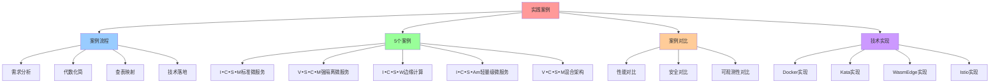
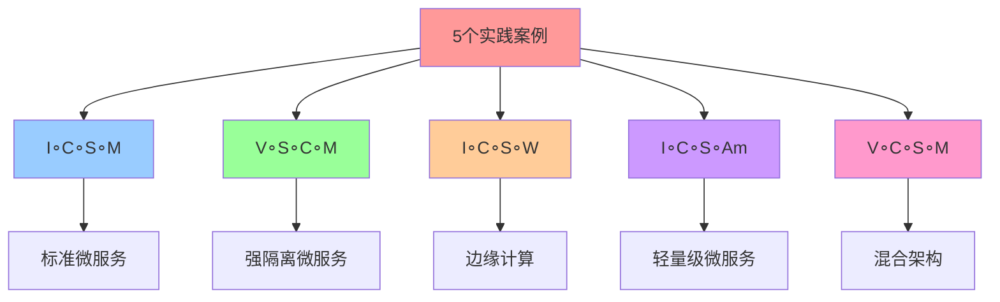
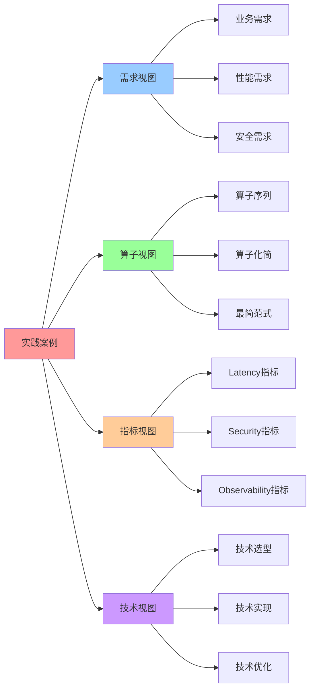

# 实践案例：算子组合 → 技术栈

## 📑 目录

- [实践案例：算子组合 → 技术栈](#实践案例算子组合--技术栈)
  - [📑 目录](#-目录)
  - [1 案例概述](#1-案例概述)
  - [2 案例 1：I∘C∘S∘M（标准微服务）](#2-案例-1icsm标准微服务)
  - [3 案例 2：V∘S∘C∘M（强隔离微服务）](#3-案例-2vscm强隔离微服务)
  - [4 案例 3：I∘C∘S∘W（边缘计算）](#4-案例-3icsw边缘计算)
  - [5 案例 4：I∘C∘S∘Am（轻量级微服务）](#5-案例-4icsam轻量级微服务)
  - [6 案例 5：V∘C∘S∘M（混合架构）](#6-案例-5vcsm混合架构)
  - [7 案例对比矩阵](#7-案例对比矩阵)
  - [8 参考](#8-参考)
  - [9 🧠 认知增强：思维导图、建模视图与图表达转换](#9--认知增强思维导图建模视图与图表达转换)
    - [9.1 实践案例完整思维导图](#91-实践案例完整思维导图)
    - [9.2 实践案例建模视图](#92-实践案例建模视图)
      - [案例流程视图](#案例流程视图)
      - [案例对比视图](#案例对比视图)
    - [9.3 实践案例多维关系矩阵](#93-实践案例多维关系矩阵)
      - [案例-需求-技术三维矩阵](#案例-需求-技术三维矩阵)
      - [案例-指标-性能映射矩阵](#案例-指标-性能映射矩阵)
    - [9.4 图表达和转换](#94-图表达和转换)
      - [实践案例视图转换关系](#实践案例视图转换关系)
    - [9.5 形象化解释论证](#95-形象化解释论证)
      - [1. 实践案例 = 建筑项目](#1-实践案例--建筑项目)
      - [2. 案例对比 = 产品对比](#2-案例对比--产品对比)
      - [3. 技术落地 = 产品实现](#3-技术落地--产品实现)
    - [9.6 专家观点与论证](#96-专家观点与论证)
      - [计算信息软件科学家的观点](#计算信息软件科学家的观点)
        - [1. Martin Fowler（软件架构大师）](#1-martin-fowler软件架构大师)
        - [2. Sam Newman（微服务专家）](#2-sam-newman微服务专家)
      - [计算信息软件教育家的观点](#计算信息软件教育家的观点)
        - [1. Kelsey Hightower（Kubernetes教育家）](#1-kelsey-hightowerkubernetes教育家)
        - [2. Liz Rice（容器安全教育家）](#2-liz-rice容器安全教育家)
      - [计算信息软件认知学家的观点](#计算信息软件认知学家的观点)
        - [1. David Marr（计算认知科学家）](#1-david-marr计算认知科学家)
        - [2. Douglas Hofstadter（认知科学家）](#2-douglas-hofstadter认知科学家)
    - [9.7 认知学习路径矩阵](#97-认知学习路径矩阵)
    - [9.8 专家推荐阅读路径](#98-专家推荐阅读路径)

---

## 1 案例概述

**实践案例**：通过算子组合推导实际技术栈。

**核心流程**：

1. **需求分析** → 算子序列
2. **代数化简** → 最简范式
3. **查表映射** → 三维指标
4. **技术落地** → 实际实现

## 2 案例 1：I∘C∘S∘M（标准微服务）

**需求**：标准微服务架构，需要快速部署、统一治理、可观测性

**算子序列**：`I → C → S → M`

**化简**：已是主范式 1，无需化简

**查表**：`(I∘C∘S∘M)` → `(5▼-3▲-5▼)`

**指标**：

- **Latency**：5▼（低延迟）
- **Security**：3▲（中等安全，Mesh 增强）
- **Observability**：5▼（最高可观测性）

**技术实现**：

```yaml
技术栈:
  镜像打包: docker build (I)
  容器化: docker run --seccomp=custom.json (C∘S)
  服务网格: Istio sidecar inject (M)

具体实现:
  - Image: OCI Image Spec
  - Container: runc + seccomp-bpf
  - Mesh: Istio 1.24 Sidecar 模式
```

**部署命令**：

```bash
# 构建镜像
docker build -t myapp:v1.0 .

# 运行容器（带 seccomp）
docker run --security-opt seccomp=custom.json myapp:v1.0

# 注入 Istio Sidecar
istioctl kube-inject -f deployment.yaml | kubectl apply -f -
```

**性能指标**：

- **延迟**：容器延迟 20ms + Mesh 延迟 0.5ms = 20.5ms
- **安全**：容器安全中等 + Mesh 零信任安全 = 高安全
- **可观测性**：Mesh 自动生成 Trace/Metric = 最高可观测性

## 3 案例 2：V∘S∘C∘M（强隔离微服务）

**需求**：强隔离微服务架构，需要合规、多租户、零信任安全

**算子序列**：`V → S → C → M`

**化简**：已是主范式 2，无需化简

**查表**：`(V∘S∘C∘M)` → `(4▼-5▼-4▼)`

**指标**：

- **Latency**：4▼（VM 延迟 + Mesh 延迟）
- **Security**：5▼（最高安全，VM 级隔离 + Mesh 零信任）
- **Observability**：4▼（高可观测性，Mesh 增强）

**技术实现**：

```yaml
技术栈:
  虚拟化: Kata VM (V)
  沙盒化: seccomp inside guest (S)
  容器化: containerd (C)
  服务网格: Istio Ambient (M)

具体实现:
  - VM: Kata Containers
  - Sandbox: seccomp-bpf
  - Container: containerd + runc
  - Mesh: Istio 1.24 Ambient 模式
```

**部署命令**：

```bash
# 创建 Kata VM
kubectl apply -f kata-runtimeclass.yaml

# 部署服务（带 seccomp）
kubectl apply -f deployment-with-seccomp.yaml

# 启用 Istio Ambient
istioctl install --set profile=ambient
```

**性能指标**：

- **延迟**：VM 延迟 200ms + Mesh 延迟 0.3ms = 200.3ms
- **安全**：VM 级隔离 + 沙盒 + Mesh 零信任 = 最高安全
- **可观测性**：Mesh 自动生成 Trace/Metric = 高可观测性

## 4 案例 3：I∘C∘S∘W（边缘计算）

**需求**：边缘计算场景，需要冷启动 < 10ms，内存 < 50MB

**算子序列**：`I → C → S → W`

**化简**：已是主范式 3，无需化简

**查表**：`(I∘C∘S∘W)` → `(5▼-4▼-4▼)`

**指标**：

- **Latency**：5▼（最低延迟，冷启动 < 10ms）
- **Security**：4▼（高安全，沙盒 + Wasm）
- **Observability**：4▼（高可观测性）

**技术实现**：

```yaml
技术栈:
  镜像打包: docker build (I)
  容器化: crun (C)
  沙盒化: seccomp (S)
  Wasm: WasmEdge (W)

具体实现:
  - Image: OCI Image Spec
  - Container: crun + WasmEdge
  - Sandbox: seccomp-bpf
  - Wasm: WasmEdge 0.14
```

**部署命令**：

```bash
# 构建镜像
docker build -t myapp:wasm .

# 运行 WasmEdge
wasmedge --dir /app myapp.wasm

# 启用 seccomp
wasmedge --seccomp custom.json myapp.wasm
```

**性能指标**：

- **延迟**：冷启动 < 10ms
- **内存**：< 50MB
- **安全**：沙盒 + Wasm 隔离 = 高安全
- **可观测性**：WasmEdge 支持 OTLP = 高可观测性

## 5 案例 4：I∘C∘S∘Am（轻量级微服务）

**需求**：轻量级微服务架构，需要低资源占用、统一治理

**算子序列**：`I → C → S → Am`

**化简**：已是主范式 4，无需化简

**查表**：`(I∘C∘S∘Am)` → `(5▼-3▲-5▼)`

**指标**：

- **Latency**：5▼（最低延迟，Ambient 模式延迟 < 0.3ms）
- **Security**：3▲（中等安全，Mesh 增强）
- **Observability**：5▼（最高可观测性）

**技术实现**：

```yaml
技术栈:
  镜像打包: docker build (I)
  容器化: docker run (C)
  沙盒化: seccomp (S)
  服务网格: Istio Ambient (Am)

具体实现:
  - Image: OCI Image Spec
  - Container: runc + seccomp-bpf
  - Mesh: Istio 1.24 Ambient 模式
```

**部署命令**：

```bash
# 构建镜像
docker build -t myapp:v1.0 .

# 运行容器
docker run --security-opt seccomp=custom.json myapp:v1.0

# 启用 Istio Ambient
istioctl install --set profile=ambient
```

**性能指标**：

- **延迟**：容器延迟 20ms + Ambient 延迟 0.3ms = 20.3ms
- **资源占用**：Ambient 模式资源占用 20MB/服务
- **安全**：Mesh 零信任安全 = 高安全
- **可观测性**：Mesh 自动生成 Trace/Metric = 最高可观测性

## 6 案例 5：V∘C∘S∘M（混合架构）

**需求**：混合架构，需要 VM 隔离 + 容器灵活性 + 服务网格治理

**算子序列**：`V → C → S → M`

**化简**：已是主范式 2 的变体，无需化简

**查表**：`(V∘C∘S∘M)` → `(4▼-4▼-4▼)`

**指标**：

- **Latency**：4▼（VM 延迟 + Mesh 延迟）
- **Security**：4▼（VM 级隔离 + 沙盒 + Mesh 零信任）
- **Observability**：4▼（高可观测性）

**技术实现**：

```yaml
技术栈:
  虚拟化: Kata VM (V)
  容器化: containerd (C)
  沙盒化: seccomp (S)
  服务网格: Istio Ambient (M)

具体实现:
  - VM: Kata Containers
  - Container: containerd + runc
  - Sandbox: seccomp-bpf
  - Mesh: Istio 1.24 Ambient 模式
```

**部署命令**：

```bash
# 创建 Kata VM
kubectl apply -f kata-runtimeclass.yaml

# 部署服务
kubectl apply -f deployment.yaml

# 启用 Istio Ambient
istioctl install --set profile=ambient
```

**性能指标**：

- **延迟**：VM 延迟 200ms + Mesh 延迟 0.3ms = 200.3ms
- **安全**：VM 级隔离 + 沙盒 + Mesh 零信任 = 高安全
- **可观测性**：Mesh 自动生成 Trace/Metric = 高可观测性

## 7 案例对比矩阵

**案例对比**：

| 案例       | 算子序列 | 指标       | 技术实现               | 适用场景     |
| ---------- | -------- | ---------- | ---------------------- | ------------ |
| **案例 1** | I∘C∘S∘M  | (5▼-3▲-5▼) | Docker + Istio Sidecar | 标准微服务   |
| **案例 2** | V∘S∘C∘M  | (4▼-5▼-4▼) | Kata + Istio Ambient   | 强隔离微服务 |
| **案例 3** | I∘C∘S∘W  | (5▼-4▼-4▼) | Docker + WasmEdge      | 边缘计算     |
| **案例 4** | I∘C∘S∘Am | (5▼-3▲-5▼) | Docker + Istio Ambient | 轻量级微服务 |
| **案例 5** | V∘C∘S∘M  | (4▼-4▼-4▼) | Kata + Istio Ambient   | 混合架构     |

**决策矩阵**：

| 需求                 | 推荐算子序列 | 技术实现               |
| -------------------- | ------------ | ---------------------- |
| **快+轻**            | I∘C∘S∘M      | Docker + Istio Sidecar |
| **强隔离+合规**      | V∘S∘C∘M      | Kata + Istio Ambient   |
| **边缘+冷启动<10ms** | I∘C∘S∘W      | Docker + WasmEdge      |
| **轻量级+统一治理**  | I∘C∘S∘Am     | Docker + Istio Ambient |
| **混合架构**         | V∘C∘S∘M      | Kata + Istio Ambient   |

## 8 参考

**关联文档**：

- **[算子定义](01-operator-definition.md)** - 20 个一元算子详解
- **[最简范式定理](05-normal-form-theorem.md)** - 主范式定理
- **[同态映射](06-homomorphism.md)** - 指标映射

**外部参考**：

- [Istio Ambient Mesh](https://istio.io/latest/docs/ambient/)
- [WasmEdge](https://wasmedge.org/)
- [Kata Containers](https://katacontainers.io/)

---

## 9 🧠 认知增强：思维导图、建模视图与图表达转换

### 9.1 实践案例完整思维导图



### 9.2 实践案例建模视图

#### 案例流程视图


#### 案例对比视图



### 9.3 实践案例多维关系矩阵

#### 案例-需求-技术三维矩阵

| 案例 | I∘C∘S∘M | V∘S∘C∘M | I∘C∘S∘W | I∘C∘S∘Am | V∘C∘S∘M | 需求场景 | 技术栈 | 认知价值 |
|-----|---------|---------|---------|----------|---------|---------|--------|---------|
| **案例1** | ✅ 核心 | ❌ 无 | ❌ 无 | ❌ 无 | ❌ 无 | 标准微服务 | Docker+Istio | 案例理解 |
| **案例2** | ❌ 无 | ✅ 核心 | ❌ 无 | ❌ 无 | ❌ 无 | 强隔离微服务 | Kata+Istio | 案例理解 |
| **案例3** | ❌ 无 | ❌ 无 | ✅ 核心 | ❌ 无 | ❌ 无 | 边缘计算 | Docker+WasmEdge | 案例理解 |
| **案例4** | ❌ 无 | ❌ 无 | ❌ 无 | ✅ 核心 | ❌ 无 | 轻量级微服务 | Docker+Istio Ambient | 案例理解 |
| **案例5** | ❌ 无 | ❌ 无 | ❌ 无 | ❌ 无 | ✅ 核心 | 混合架构 | Kata+Istio Ambient | 案例理解 |

#### 案例-指标-性能映射矩阵

| 案例 | Latency | Security | Observability | 技术实现 | 适用场景 | 认知价值 |
|-----|---------|----------|---------------|---------|---------|---------|
| **I∘C∘S∘M** | 5▼ | 3▲ | 5▼ | Docker+Istio Sidecar | 标准微服务 | 性能理解 |
| **V∘S∘C∘M** | 4▼ | 5▼ | 4▼ | Kata+Istio Ambient | 强隔离微服务 | 性能理解 |
| **I∘C∘S∘W** | 5▼ | 4▼ | 4▼ | Docker+WasmEdge | 边缘计算 | 性能理解 |
| **I∘C∘S∘Am** | 5▼ | 3▲ | 5▼ | Docker+Istio Ambient | 轻量级微服务 | 性能理解 |
| **V∘C∘S∘M** | 4▼ | 4▼ | 4▼ | Kata+Istio Ambient | 混合架构 | 性能理解 |

### 9.4 图表达和转换

#### 实践案例视图转换关系



### 9.5 形象化解释论证

#### 1. 实践案例 = 建筑项目

> **类比**：实践案例就像建筑项目，需求分析是"项目需求"（功能需求），算子序列是"设计方案"（技术方案），技术落地是"施工实施"（实际实现），就像建筑项目通过需求、设计、施工完成建筑一样，实践案例通过需求、算子、技术完成技术栈。

**认知价值**：

- **项目理解**：通过建筑项目类比，理解实践案例的项目性
- **流程理解**：通过项目流程类比，理解实践案例的流程
- **实施理解**：通过施工实施类比，理解技术落地的实施

#### 2. 案例对比 = 产品对比

> **类比**：案例对比就像产品对比，不同案例是"不同产品"（不同技术栈），性能指标是"产品特性"（产品性能），就像产品对比通过特性比较选择产品一样，案例对比通过指标比较选择技术栈。

**认知价值**：

- **对比理解**：通过产品对比类比，理解案例对比的方法
- **选择理解**：通过产品选择类比，理解技术栈的选择
- **评估理解**：通过产品评估类比，理解技术栈的评估

#### 3. 技术落地 = 产品实现

> **类比**：技术落地就像产品实现，算子序列是"产品设计"（技术设计），技术实现是"产品制造"（实际制造），就像产品实现通过设计、制造完成产品一样，技术落地通过算子、技术完成技术栈。

**认知价值**：

- **实现理解**：通过产品实现类比，理解技术落地的实现过程
- **设计理解**：通过产品设计类比，理解算子序列的设计作用
- **制造理解**：通过产品制造类比，理解技术实现的制造作用

### 9.6 专家观点与论证

#### 计算信息软件科学家的观点

##### 1. Martin Fowler（软件架构大师）

> "Architecture is about the important stuff. Whatever that is."

**在实践案例中的应用**：

- **架构理解**：实践案例展示技术栈架构的重要性
- **选择理解**：通过案例理解技术栈选择的重要性
- **实践理解**：通过案例理解架构实践的方法

##### 2. Sam Newman（微服务专家）

> "Microservices are small, autonomous services that work together."

**在实践案例中的应用**：

- **微服务理解**：案例展示微服务架构的实现
- **服务理解**：通过案例理解服务的自治性
- **协作理解**：通过案例理解服务的协作

#### 计算信息软件教育家的观点

##### 1. Kelsey Hightower（Kubernetes教育家）

> "Kubernetes is a platform for building platforms."

**教育价值**：

- **平台理解**：通过案例理解平台的作用
- **构建理解**：通过案例学习平台的构建方法
- **实践理解**：通过案例学习平台实践

##### 2. Liz Rice（容器安全教育家）

> "Security is not a feature, it's a requirement."

**教育价值**：

- **安全理解**：通过案例理解安全的重要性
- **要求理解**：通过案例理解安全的要求
- **实践理解**：通过案例学习安全实践

#### 计算信息软件认知学家的观点

##### 1. David Marr（计算认知科学家）

> "Understanding a complex system requires understanding it at multiple levels."

**认知价值**：

- **多层次理解**：通过案例理解技术栈的多层次
- **系统理解**：通过案例理解技术栈的系统性
- **认知提升**：通过案例学习提升认知能力

##### 2. Douglas Hofstadter（认知科学家）

> "Analogy is the core of cognition."

**认知价值**：

- **类比理解**：通过案例类比理解技术栈
- **模式识别**：通过案例识别技术栈的模式
- **认知提升**：通过案例学习提升认知能力

### 9.7 认知学习路径矩阵

| 学习阶段 | 核心内容 | 形象化理解 | 技术理解 | 实践应用 | 认知目标 |
|---------|---------|-----------|---------|---------|---------|
| **入门** | 案例概念 | 建筑项目类比 | 案例定义 | 简单案例 | 建立基础 |
| **进阶** | 案例流程 | 产品对比类比 | 流程理解 | 流程应用 | 理解流程 |
| **高级** | 案例对比 | 产品实现类比 | 对比方法 | 对比应用 | 掌握对比 |
| **专家** | 技术落地 | 技术实现类比 | 落地方法 | 复杂落地 | 掌握落地 |

### 9.8 专家推荐阅读路径

**计算信息软件科学家推荐路径**：

1. **案例概述**：理解实践案例的基本概念和流程
2. **案例分析**：理解5个案例的分析方法
3. **案例对比**：理解案例对比的方法和指标
4. **技术落地**：理解技术落地的方法和实现
5. **案例应用**：理解案例在实际项目中的应用

**计算信息软件教育家推荐路径**：

1. **形象化理解**：通过建筑项目、产品对比、产品实现等类比，建立直观理解
2. **渐进学习**：从简单案例开始，逐步学习复杂案例
3. **实践结合**：结合实际项目，理解案例的应用
4. **思维训练**：通过案例学习，训练系统性思维能力

**计算信息软件认知学家推荐路径**：

1. **认知模式**：识别案例中的认知模式
2. **类比理解**：通过类比理解案例概念
3. **模型构建**：构建案例的心理模型
4. **认知提升**：通过案例学习，提升认知能力

---

**最后更新**：2025-11-04 **维护者**：项目团队
