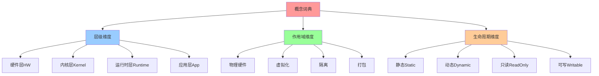
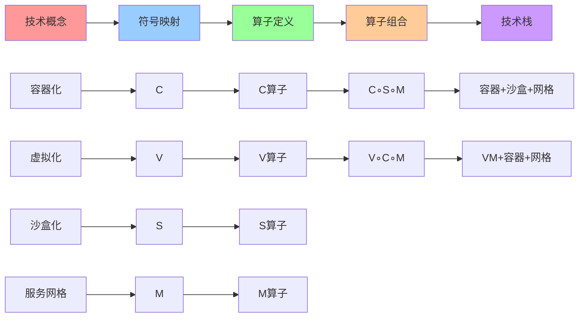
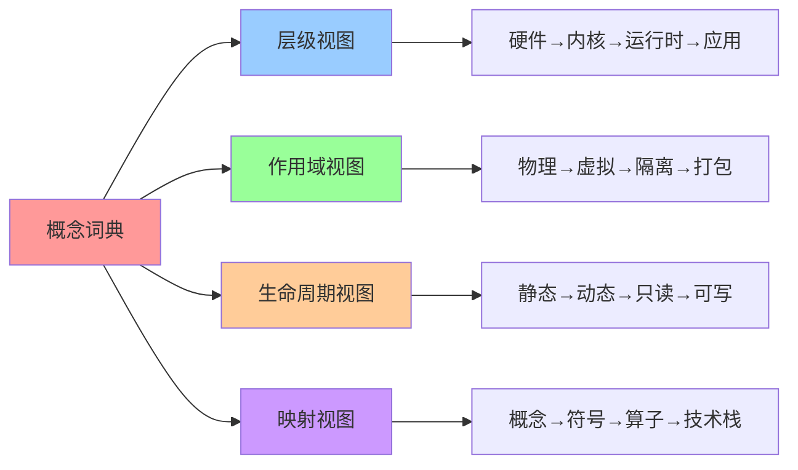

# 概念词典：80+ 技术概念完整映射

## 📑 目录

- [概念词典：80+ 技术概念完整映射](#概念词典80-技术概念完整映射)
  - [📑 目录](#-目录)
  - [1 词典概述](#1-词典概述)
  - [2 硬件/固件层（HW）](#2-硬件固件层hw)
  - [3 Hypervisor / 宿主机内核层（Kernel-space）](#3-hypervisor--宿主机内核层kernel-space)
  - [4 用户态运行时层（User-space Runtime）](#4-用户态运行时层user-space-runtime)
  - [5 镜像与打包语义（Image / Artifact）](#5-镜像与打包语义image--artifact)
  - [6 编排与调度（Orchestration）](#6-编排与调度orchestration)
  - [7 服务网格与流量治理（Mesh）](#7-服务网格与流量治理mesh)
  - [8 可观测与策略（Observability / Policy）](#8-可观测与策略observability--policy)
  - [9 边缘/机密/Serverless 算子](#9-边缘机密serverless-算子)
  - [10 符号汇总表](#10-符号汇总表)
  - [11 参考](#11-参考)
  - [12 🧠 认知增强：思维导图、建模视图与图表达转换](#12--认知增强思维导图建模视图与图表达转换)
    - [12.1 概念词典完整思维导图](#121-概念词典完整思维导图)
    - [12.2 概念词典建模视图](#122-概念词典建模视图)
      - [层级-作用域-生命周期三维视图](#层级-作用域-生命周期三维视图)
      - [概念-符号-算子映射视图](#概念-符号-算子映射视图)
    - [12.3 概念词典多维关系矩阵](#123-概念词典多维关系矩阵)
      - [层级-概念-符号映射矩阵](#层级-概念-符号映射矩阵)
    - [12.4 图表达和转换](#124-图表达和转换)
      - [概念词典视图转换关系](#概念词典视图转换关系)
    - [12.5 形象化解释论证](#125-形象化解释论证)
      - [1. 概念词典 = 技术字典](#1-概念词典--技术字典)
      - [2. 层级结构 = 建筑楼层](#2-层级结构--建筑楼层)
      - [3. 符号映射 = 邮政编码](#3-符号映射--邮政编码)
    - [12.6 专家观点与论证](#126-专家观点与论证)
      - [计算信息软件科学家的观点](#计算信息软件科学家的观点)
        - [1. Leslie Lamport（分布式系统科学家）](#1-leslie-lamport分布式系统科学家)
        - [2. Tony Hoare（计算机科学家）](#2-tony-hoare计算机科学家)
      - [计算信息软件教育家的观点](#计算信息软件教育家的观点)
        - [1. Andrew Tanenbaum（操作系统教育家）](#1-andrew-tanenbaum操作系统教育家)
        - [2. Martin Kleppmann（分布式系统教育家）](#2-martin-kleppmann分布式系统教育家)
      - [计算信息软件认知学家的观点](#计算信息软件认知学家的观点)
        - [1. David Marr（计算认知科学家）](#1-david-marr计算认知科学家)
        - [2. Douglas Hofstadter（认知科学家）](#2-douglas-hofstadter认知科学家)
    - [12.7 认知学习路径矩阵](#127-认知学习路径矩阵)
    - [12.8 专家推荐阅读路径](#128-专家推荐阅读路径)

---

## 1 词典概述

**概念词典**是代数结构视角的基础，将 80+ 技术概念按**层级-作用域-生命周期**三维
展开，避免漏项。

**词典结构**：

- **层级**：硬件/固件 → 内核 → 运行时 → 镜像 → 编排 → 网格 → 观测 → 边缘/机密/无
  服务器
- **作用域**：物理硬件、虚拟化、隔离、打包、调度、网络、监控、边缘
- **生命周期**：静态、动态、只读、可写

**映射关系**：

- **概念 → 符号**：每个技术概念映射到唯一符号
- **符号 → 算子**：符号可组合成算子
- **算子 → 技术栈**：算子组合形成完整技术栈

---

## 2 硬件/固件层（HW）

**层级特征**：物理硬件、固件、不可变

| 概念               | 一句话定义         | 符号 | 典型技术           | 备注             |
| ------------------ | ------------------ | ---- | ------------------ | ---------------- |
| **CPU 虚拟化扩展** | Intel VT-x / AMD-V | VT   | Intel VT-x, AMD-V  | 硬件级虚拟化支持 |
| **IOMMU**          | IO 设备直通隔离    | IO   | Intel VT-d, AMD-Vi | 设备直通         |
| **SGX/SEV**        | 机密计算 enclave   | E    | Intel SGX, AMD SEV | 可信执行区       |
| **TPM**            | 可信度量根         | T    | TPM 2.0            | 硬件安全模块     |
| **microcode**      | 固件级沙补丁       | μ    | Intel microcode    | 固件更新         |

**代数属性**：

- **封闭性**：硬件层概念不会互相转换
- **不可逆性**：硬件操作不可撤销
- **静态性**：硬件配置相对固定

---

## 3 Hypervisor / 宿主机内核层（Kernel-space）

**层级特征**：内核态、虚拟化、隔离

| 概念            | 一句话定义        | 符号 | 典型技术    | 备注               |
| --------------- | ----------------- | ---- | ----------- | ------------------ |
| **KVM**         | 内核态 hypervisor | K    | KVM         | Linux 内核态虚拟化 |
| **Xen**         | 裸机 hypervisor   | X    | Xen         | 裸机虚拟化         |
| **Hyper-V**     | 微软裸机          | Hv   | Hyper-V     | Windows 虚拟化     |
| **bhyve**       | FreeBSD 原生      | B    | bhyve       | FreeBSD 虚拟化     |
| **sev-es**      | 加密虚拟机状态    | E′   | AMD SEV-ES  | 加密 VM 状态       |
| **seccomp-bpf** | 系统调用过滤      | S    | seccomp-BPF | syscall 过滤       |
| **Landlock**    | 文件系统沙盒      | L    | Landlock    | FS 沙盒            |
| **eBPF**        | 内核可编程        | P    | eBPF        | 内核可编程         |
| **cgroup**      | 资源控制器        | Cg   | cgroup      | 资源限制           |
| **namespace**   | 隔离名字空间      | Ns   | namespace   | 命名空间隔离       |
| **OverlayFS**   | 联合挂载层        | O    | OverlayFS   | 联合文件系统       |
| **virtio**      | 半虚拟化设备      | Vio  | virtio      | 半虚拟设备         |
| **VFIO**        | 用户态驱动直通    | Vf   | VFIO        | 设备直通           |

**代数属性**：

- **可组合性**：内核层概念可以组合（如 `Cg + Ns = Container`）
- **幂等性**：部分概念满足幂等（如 `Ns² = Ns`）
- **交换性**：部分概念可交换（如 `Cg ∘ Ns = Ns ∘ Cg`）

---

## 4 用户态运行时层（User-space Runtime）

**层级特征**：容器/VM、动态、可执行

| 概念                         | 一句话定义         | 符号 | 典型技术                 | 备注        |
| ---------------------------- | ------------------ | ---- | ------------------------ | ----------- |
| **runc**                     | OCI 标准容器运行时 | R    | runc                     | OCI 标准    |
| **crun**                     | C 语言实现，更快   | R′   | crun                     | C 语言实现  |
| **youki**                    | Rust 实现          | R″   | youki                    | Rust 实现   |
| **kata-runtime**             | VM 级容器          | Kc   | Kata                     | VM 级容器   |
| **gVisor**                   | 用户态内核代理     | G    | gVisor                   | 用户态内核  |
| **firecracker**              | MicroVM            | F    | Firecracker              | 轻量 VM     |
| **qemu**                     | 全功能模拟器       | Q    | QEMU                     | 全功能模拟  |
| **virtiofs**                 | 共享文件系统       | Vfs  | virtiofs                 | 共享 FS     |
| **nvidia-container-runtime** | GPU 透传           | Rg   | nvidia-container-runtime | GPU 直通    |
| **wasmtime**                 | Wasm 运行时        | W    | wasmtime                 | Wasm 运行时 |
| **wasmEdge**                 | 云优化 Wasm        | W′   | WasmEdge                 | 云优化 Wasm |

**算子映射**：

- **C** ← `{runc, crun, youki}`
- **Kc** ← `{kata-runtime}`
- **G** ← `{gVisor}`
- **F** ← `{firecracker}`
- **W** ← `{wasmtime, wasmEdge}`

---

## 5 镜像与打包语义（Image / Artifact）

**层级特征**：打包、只读、静态

| 概念                 | 一句话定义           | 符号 | 典型技术    | 备注       |
| -------------------- | -------------------- | ---- | ----------- | ---------- |
| **OCI Image Spec**   | 分层 tar+config json | I    | OCI Image   | 层化镜像   |
| **Image Index**      | 多架构清单           | Ix   | Image Index | 多架构支持 |
| **Layer blob**       | 每层哈希块           | Lb   | Layer blob  | 单层哈希   |
| **Digest**           | content-hash         | D    | Digest      | 内容哈希   |
| **Manifest**         | 层顺序+config        | Mf   | Manifest    | 镜像清单   |
| **SBOM**             | 软件物料清单         | B    | SBOM        | 物料清单   |
| **cosign signature** | 镜像签名             | Sig  | cosign      | 镜像签名   |
| **attestation**      | 构建时证据           | Att  | attestation | 构建证据   |
| **Cache Image**      | 构建缓存             | Ca   | Cache Image | 构建缓存   |
| **Distroless**       | 仅运行时文件         | Id   | Distroless  | 最小镜像   |
| **Scratch**          | 空基底               | Is   | Scratch     | 空镜像     |

**算子映射**：

- **I** ← `{OCI Image, Image Index, Layer blob, Manifest}`

**代数属性**：

- **幂等性**：`I² = I`（多次打包同一镜像结果相同）
- **可交换性**：`I ∘ C = C ∘ I`（镜像打包和容器化可交换）

---

## 6 编排与调度（Orchestration）

**层级特征**：调度、复制、动态

| 概念                   | 一句话定义       | 符号 | 典型技术          | 备注         |
| ---------------------- | ---------------- | ---- | ----------------- | ------------ |
| **Pod**                | K8s 最小调度原子 | Po   | Pod               | K8s 最小单元 |
| **Deployment**         | 无状态控制器     | De   | Deployment        | 无状态控制器 |
| **StatefulSet**        | 有状态控制器     | Ss   | StatefulSet       | 有状态控制器 |
| **DaemonSet**          | 节点守护         | Da   | DaemonSet         | 守护进程     |
| **Job / CronJob**      | 批 / 定时        | J    | Job, CronJob      | 批处理       |
| **ReplicaSet**         | 副本集           | Rs   | ReplicaSet        | 副本管理     |
| **Namespace**          | 逻辑隔离         | N    | Namespace         | 逻辑隔离     |
| **Node**               | 工作节点         | No   | Node              | 工作节点     |
| **Taint / Toleration** | 排斥-容忍        | Tt   | Taint, Toleration | 调度策略     |
| **Affinity**           | 亲和性           | Af   | Affinity          | 亲和性       |
| **PriorityClass**      | 抢占优先级       | Pc   | PriorityClass     | 优先级       |
| **ResourceQuota**      | 资源配额         | Q    | ResourceQuota     | 资源配额     |
| **LimitRange**         | 默认规格         | Lr   | LimitRange        | 默认规格     |

**代数属性**：

- **可组合性**：编排概念可以组合（如 `De + Rs = Deployment`）
- **幂等性**：部分概念满足幂等（如 `De² = De`）

---

## 7 服务网格与流量治理（Mesh）

**层级特征**：网络、动态、可观测

| 概念                    | 一句话定义      | 符号 | 典型技术            | 备注       |
| ----------------------- | --------------- | ---- | ------------------- | ---------- |
| **Sidecar**             | 伴车代理        | Sc   | Sidecar             | 伴车代理   |
| **Envoy**               | L4/L7 代理      | E    | Envoy               | L4/L7 代理 |
| **Istiod**              | 控制平面        | Ist  | Istiod              | 控制平面   |
| **xDS**                 | 配置发现协议    | Xd   | xDS                 | 配置协议   |
| **VirtualService**      | 路由规则        | Vs   | VirtualService      | 路由规则   |
| **DestinationRule**     | 后端策略        | Dr   | DestinationRule     | 后端策略   |
| **Gateway**             | 入口网关        | Gw   | Gateway             | 入口网关   |
| **PeerAuthentication**  | mTLS 开关       | Pa   | PeerAuthentication  | mTLS 配置  |
| **AuthorizationPolicy** | 七层授权        | Ap   | AuthorizationPolicy | 授权策略   |
| **WasmPlugin**          | 过滤器插件      | Wp   | WasmPlugin          | Wasm 插件  |
| **Telemetry API**       | 统一遥测        | Tapi | Telemetry API       | 遥测 API   |
| **Ambient Mesh**        | 无 Sidecar 模式 | Am   | Istio Ambient       | 无 Sidecar |
| **Waypoint Proxy**      | 每服务 L7 代理  | Wp   | Waypoint Proxy      | L7 代理    |
| **ztunnel**             | 共享 L4 代理    | Zt   | ztunnel             | L4 代理    |

**算子映射**：

- **M** ← `{Sidecar, Envoy, xDS, VirtualService, DestinationRule}`
- **Am** ← `{Ambient Mesh, Waypoint Proxy, ztunnel}`
- **E** ← `{Envoy}`
- **Ist** ← `{Istiod, xDS}`

**代数属性**：

- **幂等性**：`M² = M`（多次注入服务网格结果相同）
- **可交换性**：`M ∘ C = C ∘ M`（服务网格和容器化可交换）

---

## 8 可观测与策略（Observability / Policy）

**层级特征**：监控、策略、动态

| 概念                   | 一句话定义   | 符号 | 典型技术          | 备注       |
| ---------------------- | ------------ | ---- | ----------------- | ---------- |
| **OpenTelemetry**      | 统一观测标准 | Otel | OpenTelemetry     | 统一观测   |
| **Prometheus**         | 指标存储     | Prom | Prometheus        | 指标存储   |
| **Jaeger / Tempo**     | 分布式追踪   | J    | Jaeger, Tempo     | 分布式追踪 |
| **FluentBit / Vector** | 日志收集     | Fb   | FluentBit, Vector | 日志收集   |
| **eBPF exporter**      | 内核指标     | Eb   | eBPF exporter     | 内核指标   |
| **Gatekeeper**         | OPA 准入     | Gk   | Gatekeeper        | OPA 准入   |
| **Falco**              | 运行时安全   | Fc   | Falco             | 运行时安全 |
| **Cilium Hubble**      | eBPF 观测    | Hb   | Cilium Hubble     | eBPF 观测  |
| **Inspektor Gadget**   | 调试工具箱   | Ig   | Inspektor Gadget  | 调试工具   |
| **Kyverno**            | 策略引擎     | Ky   | Kyverno           | 策略引擎   |

**算子映射**：

- **Otel** ← `{OpenTelemetry, Prometheus, Jaeger}`
- **Gk** ← `{Gatekeeper, Kyverno}`
- **P** ← `{eBPF exporter, Cilium Hubble}`

---

## 9 边缘/机密/Serverless 算子

**层级特征**：边缘、机密、无服务器

| 概念                       | 一句话定义      | 符号 | 典型技术               | 备注       |
| -------------------------- | --------------- | ---- | ---------------------- | ---------- |
| **K3s**                    | 轻量 K8s        | K3   | K3s                    | 轻量 K8s   |
| **KubeEdge**               | 边缘自治        | Ke   | KubeEdge               | 边缘自治   |
| **SuperEdge**              | 腾讯边缘        | Se   | SuperEdge              | 腾讯边缘   |
| **WasmEdge**               | 边缘 Wasm       | We   | WasmEdge               | 边缘 Wasm  |
| **Confidential Container** | 机密容器        | Cc   | Confidential Container | 机密容器   |
| **SGX Enclave**            | 可信执行区      | Sgx  | SGX Enclave            | 可信执行   |
| **AMD SEV-SNP**            | 加密虚机        | Sev  | AMD SEV-SNP            | 加密 VM    |
| **Firecracker**            | MicroVM         | F    | Firecracker            | MicroVM    |
| **gVisor**                 | 用户态内核      | G    | gVisor                 | 用户态内核 |
| **Kata**                   | VM 容器         | Kc   | Kata                   | VM 容器    |
| **Knative**                | Serverless 底座 | Kn   | Knative                | Serverless |
| **OpenFaaS**               | 函数框架        | Faas | OpenFaaS               | 函数框架   |
| **KEDA**                   | 事件驱动伸缩    | Keda | KEDA                   | 事件驱动   |
| **Dapr**                   | 应用运行时      | D    | Dapr                   | 应用运行时 |

**算子映射**：

- **We** ← `{WasmEdge, K3s}`
- **Cc** ← `{Confidential Container, SGX Enclave, AMD SEV-SNP}`
- **Kc** ← `{Kata, Firecracker}`

---

## 10 符号汇总表

**符号池汇总**（可直接代入代数式）：

| 类别                   | 符号池                                                    | 算子映射           |
| ---------------------- | --------------------------------------------------------- | ------------------ |
| **硬件**               | VT, IO, E, T, μ                                           | —                  |
| **内核**               | K, X, Hv, B, S, L, P, Cg, Ns, O, Vio, Vf                  | S, P, Ns, Cg, O    |
| **运行时**             | R, R′, R″, Kc, G, F, Q, Vfs, Rg, W, W′                    | C, Kc, G, F, W, We |
| **镜像**               | I, Ix, Lb, D, Mf, B, Sig, Att, Ca, Id, Is                 | I                  |
| **编排**               | Po, De, Ss, Da, J, Rs, N, No, Tt, Af, Pc, Q, Lr           | —                  |
| **网格**               | Sc, E, Ist, Xd, Vs, Dr, Gw, Pa, Ap, Wp, Tapi, Am, Wp, Zt  | M, Am, E, Ist      |
| **观测**               | Otel, Prom, J, Fb, Eb, Gk, Fc, Hb, Ig, Ky                 | Otel, Gk, P        |
| **边缘/机密/无服务器** | K3, Ke, Se, We, Cc, Sgx, Sev, F, G, Kc, Kn, Faas, Keda, D | We, Cc, Kc         |

**使用规则**：

1. **符号 → 算子**：多个符号可映射到同一算子（如 `{runc, crun, youki} → C`）
2. **算子 → 技术栈**：算子组合形成技术栈（如 `I∘C∘S∘M`）
3. **技术栈 → 指标**：通过同态映射得到性能指标

---

## 11 参考

**关联文档**：

- **[算子定义](01-operator-definition.md)** - 20 个一元算子的完整定义
- **[代数结构](02-algebraic-structure.md)** - 代数结构签名和对象集合
- **[复合运算表](04-composition-table.md)** - 20×20 复合运算表
- **[实践案例](08-practical-examples.md)** - 算子组合的实际应用

**外部参考**：

- [OCI Image Spec](https://opencontainers.org/)
- [Kubernetes Concepts](https://kubernetes.io/docs/concepts/)
- [Istio Concepts](https://istio.io/latest/docs/concepts/)
- [OpenTelemetry Specification](https://opentelemetry.io/docs/specs/)

---

## 12 🧠 认知增强：思维导图、建模视图与图表达转换

### 12.1 概念词典完整思维导图

```mermaid
graph TB
    A[概念词典] --> B[硬件固件层]
    A --> C[内核层]
    A --> D[运行时层]
    A --> E[镜像打包层]
    A --> F[编排调度层]
    A --> G[服务网格层]
    A --> H[可观测层]
    A --> I[边缘机密层]

    B --> B1[VT虚拟化]
    B --> B2[IOMMU直通]
    B --> B3[SGX/SEV机密]
    B --> B4[TPM可信]

    C --> C1[Hypervisor]
    C --> C2[Kernel]
    C --> C3[Namespace]
    C --> C4[Cgroup]

    D --> D1[容器C]
    D --> D2[沙盒S]
    D --> D3[Wasm W]
    D --> D4[Kata Kc]

    E --> E1[镜像I]
    E --> E2[OCI规范]
    E --> E3[Index]

    F --> F1[Kubernetes]
    F --> F2[调度器]
    F --> F3[控制器]

    G --> G1[服务网格M]
    G --> G2[Envoy E]
    G --> G3[Istio Ist]
    G --> G4[Ambient Am]

    H --> H1[OpenTelemetry]
    H --> H2[Prometheus]
    H --> H3[Trace]
    H --> H4[Metric]

    I --> I1[边缘We]
    I --> I2[机密Cc]
    I --> I3[Serverless]

    style A fill:#ff9999
    style B fill:#99ccff
    style C fill:#99ff99
    style D fill:#ffcc99
    style E fill:#cc99ff
    style F fill:#ff99cc
    style G fill:#99ffcc
    style H fill:#ffccff
    style I fill:#ccff99
```

### 12.2 概念词典建模视图

#### 层级-作用域-生命周期三维视图

#### 概念-符号-算子映射视图

### 12.3 概念词典多维关系矩阵

#### 层级-概念-符号映射矩阵

| 层级 | 概念 | 符号 | 典型技术 | 认知价值 |
|-----|------|------|---------|---------|
| **硬件层** | CPU虚拟化扩展 | VT | Intel VT-x, AMD-V | 硬件理解 |
| **硬件层** | IOMMU | IO | Intel VT-d, AMD-Vi | 硬件理解 |
| **硬件层** | SGX/SEV | E | Intel SGX, AMD SEV | 硬件理解 |
| **硬件层** | TPM | T | TPM 2.0 | 硬件理解 |
| **内核层** | Hypervisor | V | KVM, Xen | 虚拟化理解 |
| **内核层** | Namespace | Ns | namespace | 隔离理解 |
| **内核层** | Cgroup | Cg | cgroup | 资源理解 |
| **运行时层** | Container | C | runc, crun | 容器理解 |
| **运行时层** | Sandbox | S | seccomp-bpf | 沙盒理解 |
| **运行时层** | WasmEdge | W | WasmEdge | Wasm理解 |
| **镜像层** | Image | I | OCI Image | 镜像理解 |
| **编排层** | Kubernetes | K | Kubernetes | 编排理解 |
| **网格层** | Service Mesh | M | Istio, Linkerd | 网格理解 |
| **观测层** | OpenTelemetry | Otel | Otel | 观测理解 |

### 12.4 图表达和转换

#### 概念词典视图转换关系

### 12.5 形象化解释论证

#### 1. 概念词典 = 技术字典

> **类比**：概念词典就像技术字典，层级是"章节"（硬件、内核、运行时等），概念是"词条"（容器、虚拟化、沙盒等），符号是"词条编号"（C、V、S等），算子定义是"词条解释"（算子的作用），就像技术字典通过章节、词条、编号、解释组织技术知识一样，概念词典通过层级、概念、符号、算子组织技术概念。

**认知价值**：

- **字典理解**：通过技术字典类比，理解概念词典的组织方式
- **查找理解**：通过字典查找类比，理解概念词典的查找方式
- **学习理解**：通过字典学习类比，理解概念词典的学习方式

#### 2. 层级结构 = 建筑楼层

> **类比**：层级结构就像建筑楼层，硬件层是"地基"（物理硬件），内核层是"框架"（内核空间），运行时层是"房间"（用户空间），应用层是"装修"（应用代码），就像建筑楼层从地基到装修逐层构建一样，技术栈从硬件到应用逐层构建。

**认知价值**：

- **层次理解**：通过建筑楼层类比，理解技术栈的层次结构
- **依赖理解**：通过楼层依赖类比，理解技术栈的依赖关系
- **构建理解**：通过楼层构建类比，理解技术栈的构建过程

#### 3. 符号映射 = 邮政编码

> **类比**：符号映射就像邮政编码，每个技术概念有唯一的符号，就像每个地区有唯一的邮政编码一样，符号映射为每个技术概念分配唯一符号。

**认知价值**：

- **唯一理解**：通过邮政编码类比，理解符号的唯一性
- **映射理解**：通过邮编映射类比，理解概念到符号的映射
- **查找理解**：通过邮编查找类比，理解符号的查找方式

### 12.6 专家观点与论证

#### 计算信息软件科学家的观点

##### 1. Leslie Lamport（分布式系统科学家）

> "A concept dictionary is essential for understanding complex systems."

**在概念词典中的应用**：

- **系统理解**：概念词典是理解复杂系统的基础
- **概念理解**：通过概念词典理解技术概念
- **系统分析**：通过概念词典分析技术系统

##### 2. Tony Hoare（计算机科学家）

> "Concepts must be precisely defined before they can be used."

**在概念词典中的应用**：

- **精确理解**：概念必须精确定义才能使用
- **定义理解**：通过概念词典理解概念的精确定义
- **使用理解**：通过概念词典学习概念的使用方式

#### 计算信息软件教育家的观点

##### 1. Andrew Tanenbaum（操作系统教育家）

> "A concept dictionary helps students understand the relationships between concepts."

**教育价值**：

- **关系理解**：概念词典帮助学生理解概念间的关系
- **学习理解**：通过概念词典学习技术概念
- **系统理解**：通过概念词典理解技术系统

##### 2. Martin Kleppmann（分布式系统教育家）

> "A concept dictionary provides a structured way to learn complex technologies."

**教育价值**：

- **结构化学习**：概念词典提供结构化学习方式
- **渐进学习**：通过概念词典渐进学习复杂技术
- **系统学习**：通过概念词典系统学习技术栈

#### 计算信息软件认知学家的观点

##### 1. David Marr（计算认知科学家）

> "Understanding concepts requires understanding them at multiple levels."

**认知价值**：

- **多层次理解**：理解概念需要多层次理解
- **层级理解**：通过概念词典理解概念的层级结构
- **认知提升**：通过概念词典学习提升认知能力

##### 2. Douglas Hofstadter（认知科学家）

> "A concept dictionary is a cognitive tool for organizing knowledge."

**认知价值**：

- **工具理解**：概念词典是组织知识的认知工具
- **知识组织**：通过概念词典组织技术知识
- **认知提升**：通过概念词典学习提升认知能力

### 12.7 认知学习路径矩阵

| 学习阶段 | 核心内容 | 形象化理解 | 技术理解 | 实践应用 | 认知目标 |
|---------|---------|-----------|---------|---------|---------|
| **入门** | 概念定义 | 技术字典类比 | 概念定义 | 概念查找 | 建立基础 |
| **进阶** | 符号映射 | 邮政编码类比 | 符号映射 | 符号使用 | 理解映射 |
| **高级** | 层级结构 | 建筑楼层类比 | 层级结构 | 层级分析 | 掌握结构 |
| **专家** | 算子组合 | 技术栈构建类比 | 算子组合 | 技术栈设计 | 掌握组合 |

### 12.8 专家推荐阅读路径

**计算信息软件科学家推荐路径**：

1. **概念定义**：理解技术概念的精确定义
2. **符号映射**：理解概念到符号的映射关系
3. **层级结构**：理解概念的层级组织结构
4. **算子定义**：理解符号到算子的定义关系
5. **技术栈构建**：理解算子组合到技术栈的构建过程

**计算信息软件教育家推荐路径**：

1. **形象化理解**：通过技术字典、建筑楼层、邮政编码等类比，建立直观理解
2. **渐进学习**：从简单概念开始，逐步学习复杂概念
3. **实践结合**：结合实际项目，理解概念的应用
4. **思维训练**：通过概念词典学习，训练系统性思维能力

**计算信息软件认知学家推荐路径**：

1. **认知模式**：识别概念词典中的认知模式
2. **类比理解**：通过类比理解概念词典结构
3. **模型构建**：构建概念词典的心理模型
4. **认知提升**：通过概念词典学习，提升认知能力

---

**最后更新**：2025-11-04 **维护者**：项目团队
