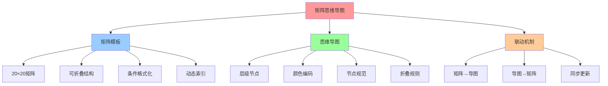
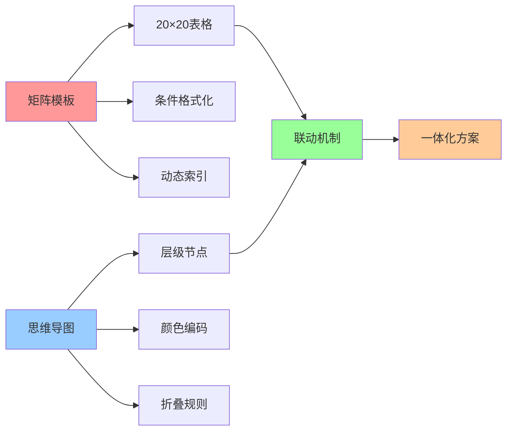
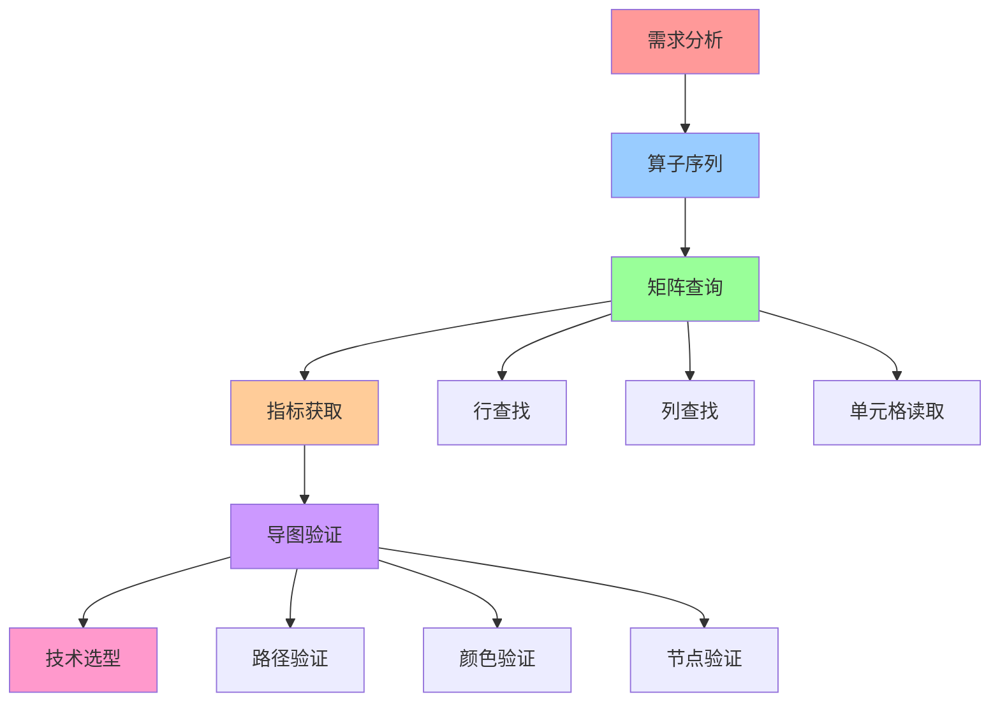
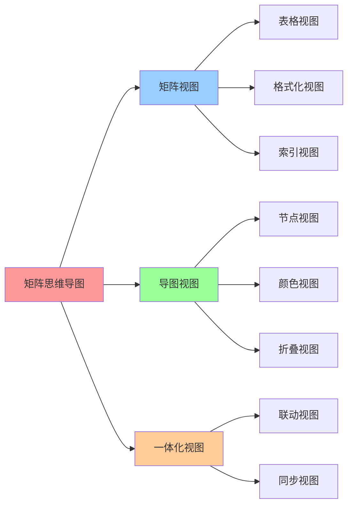

# 矩阵模板与思维导图：一体化方案

## 📑 目录

- [矩阵模板与思维导图：一体化方案](#矩阵模板与思维导图一体化方案)
  - [📑 目录](#-目录)
  - [1 概述](#1-概述)
  - [2 矩阵模板（20×20 可折叠）](#2-矩阵模板2020-可折叠)
  - [3 思维导图节点规范](#3-思维导图节点规范)
  - [4 折叠/展开规则](#4-折叠展开规则)
  - [5 动态索引](#5-动态索引)
  - [6 使用流程](#6-使用流程)
  - [7 参考](#7-参考)
  - [8 🧠 认知增强：思维导图、建模视图与图表达转换](#8--认知增强思维导图建模视图与图表达转换)
    - [8.1 矩阵思维导图完整思维导图](#81-矩阵思维导图完整思维导图)
    - [8.2 矩阵思维导图建模视图](#82-矩阵思维导图建模视图)
      - [矩阵-导图一体化视图](#矩阵-导图一体化视图)
      - [矩阵查询流程视图](#矩阵查询流程视图)
    - [8.3 矩阵思维导图多维关系矩阵](#83-矩阵思维导图多维关系矩阵)
      - [矩阵-导图-工具映射矩阵](#矩阵-导图-工具映射矩阵)
    - [8.4 图表达和转换](#84-图表达和转换)
      - [矩阵思维导图视图转换关系](#矩阵思维导图视图转换关系)
    - [8.5 形象化解释论证](#85-形象化解释论证)
      - [1. 矩阵思维导图 = 地铁线路图](#1-矩阵思维导图--地铁线路图)
      - [2. 矩阵查询 = 查字典](#2-矩阵查询--查字典)
      - [3. 思维导图 = 知识树](#3-思维导图--知识树)
    - [8.6 专家观点与论证](#86-专家观点与论证)
      - [计算信息软件科学家的观点](#计算信息软件科学家的观点)
        - [1. Edward Tufte（数据可视化科学家）](#1-edward-tufte数据可视化科学家)
        - [2. Ben Shneiderman（信息可视化科学家）](#2-ben-shneiderman信息可视化科学家)
      - [计算信息软件教育家的观点](#计算信息软件教育家的观点)
        - [1. Tony Buzan（思维导图教育家）](#1-tony-buzan思维导图教育家)
        - [2. Richard Felder（工程教育家）](#2-richard-felder工程教育家)
      - [计算信息软件认知学家的观点](#计算信息软件认知学家的观点)
        - [1. David Marr（计算认知科学家）](#1-david-marr计算认知科学家)
        - [2. Douglas Hofstadter（认知科学家）](#2-douglas-hofstadter认知科学家)
    - [8.7 认知学习路径矩阵](#87-认知学习路径矩阵)
    - [8.8 专家推荐阅读路径](#88-专家推荐阅读路径)
  - [2025 年最新实践](#2025-年最新实践)
    - [矩阵思维导图应用最佳实践（2025）](#矩阵思维导图应用最佳实践2025)
  - [实际应用案例](#实际应用案例)
    - [案例 1：矩阵思维导图应用（2025）](#案例-1矩阵思维导图应用2025)

---

## 1 概述

**矩阵模板与思维导图**是一体化方案，将**20×20 复合运算表**与**思维导图**结合，让
"查表"像"看地铁线路图"一样直观。

**核心思想**：

- **矩阵** = 可折叠的对比表（20×20）
- **导图** = 层级与颜色编码的节点树
- **联动** = 矩阵与导图同步更新

**适用工具**：

- **Excel**：矩阵表格，支持条件格式化
- **Notion**：数据库视图，支持公式计算
- **Miro**：思维导图，支持拖拽连线

---

## 2 矩阵模板（20×20 可折叠）

**矩阵结构**：

| 维度 →    | 延迟 | 安全 | 观测 | 资源 | 易用 | 冷启 | 合规 | 成本 | 备注                   | 导图色 |
| --------- | ---- | ---- | ---- | ---- | ---- | ---- | ---- | ---- | ---------------------- | ------ |
| **I**∘    | 5▼   | 3▲   | 5▼   | 5▼   | 5▼   | 5▼   | 3▲   | 5▼   | 镜像幂等               | 🟦     |
| **C**∘    | 5▼   | 3▲   | 5▼   | 4▼   | 5▼   | 5▼   | 4▼   | 5▼   | 容器理想               | 🟦     |
| **S**∘    | 5▼   | 5▼   | 4▼   | 5▼   | 4▼   | 5▼   | 5▼   | 5▼   | syscall 商             | 🟩     |
| **M**∘    | 4▼   | 4▼   | 5▼   | 3▲   | 3▲   | 4▼   | 4▼   | 3▲   | 网格吸收               | 🟨     |
| **V**∘    | 2▲   | 5▼   | 3▲   | 2▲   | 2▲   | 2▲   | 5▼   | 2▲   | VM 环扩张              | 🟥     |
| **Kc**∘   | 3▲   | 5▼   | 4▼   | 3▲   | 3▲   | 3▲   | 5▼   | 3▲   | Kata MicroVM           | 🟥     |
| **G**∘    | 4▼   | 4▼   | 4▼   | 4▼   | 3▲   | 4▼   | 4▼   | 4▼   | gVisor 用户态内核      | 🟩     |
| **F**∘    | 4▼   | 4▼   | 3▲   | 5▼   | 3▲   | 5▼   | 4▼   | 4▼   | Firecracker microVM    | 🟥     |
| **W**∘    | 5▼   | 3▲   | 4▼   | 5▼   | 4▼   | 5▼   | 3▲   | 5▼   | Wasm 幂等              | 🟪     |
| **We**∘   | 5▼   | 3▲   | 4▼   | 5▼   | 4▼   | 5▼   | 3▲   | 5▼   | WasmEdge               | 🟪     |
| **Am**∘   | 5▼   | 4▼   | 5▼   | 5▼   | 4▼   | 5▼   | 4▼   | 4▼   | Istio Ambient          | 🟨     |
| **P**∘    | 5▼   | 4▼   | 5▼   | 5▼   | 3▲   | 5▼   | 4▼   | 5▼   | eBPF 程序              | 🟩     |
| **Ns**∘   | 5▼   | 3▲   | 4▼   | 5▼   | 5▼   | 5▼   | 3▲   | 5▼   | namespace 理想         | 🟦     |
| **Cg**∘   | 5▼   | 3▲   | 4▼   | 5▼   | 5▼   | 5▼   | 3▲   | 5▼   | cgroup 理想            | 🟦     |
| **O**∘    | 5▼   | 3▲   | 4▼   | 5▼   | 5▼   | 5▼   | 3▲   | 5▼   | OverlayFS              | 🟦     |
| **E**∘    | 4▼   | 5▼   | 4▼   | 3▲   | 3▲   | 3▲   | 5▼   | 3▲   | Envoy 代理             | 🟨     |
| **Ist**∘  | 4▼   | 4▼   | 5▼   | 3▲   | 3▲   | 4▼   | 4▼   | 3▲   | Istio 控制面           | 🟨     |
| **Otel**∘ | 5▼   | 4▼   | 5▼   | 5▼   | 4▼   | 5▼   | 4▼   | 5▼   | OpenTelemetry          | 🟩     |
| **Gk**∘   | 4▼   | 5▼   | 4▼   | 5▼   | 3▲   | 5▼   | 5▼   | 5▼   | Gatekeeper OPA         | 🟩     |
| **Cc**∘   | 3▲   | 5▼   | 4▼   | 3▲   | 3▲   | 3▲   | 5▼   | 2▲   | Confidential Container | 🟥     |

**色块 = 思维导图一级分支**：

- 🟦 **打包/隔离**：I, C, Ns, Cg, O
- 🟩 **安全/观测**：S, G, P, Otel, Gk
- 🟨 **流量/治理**：M, Am, E, Ist
- 🟥 **虚拟化/机密**：V, Kc, F, Cc
- 🟪 **Wasm/边缘**：W, We

**评分说明**：

- **1▲** = 最低（最差）
- **5▼** = 最高（最好）
- **延迟**：越低越好（5▼ 表示延迟最低）
- **安全**：越高越好（5▼ 表示安全最高）
- **观测**：越高越好（5▼ 表示可观测性最高）

---

## 3 思维导图节点规范

**Xmind/Miro 快速导入格式**：

```text
根: Cloud-Native Operators
├─ 🟦 Pack&Isolate (I,C,Ns,Cg,O)
│  ├─ I: 镜像幂等, layer hash
│  ├─ C: 容器理想, namespace+cgroup
│  └─ O: OverlayFS, 联合挂载
├─ 🟩 Sec&Observe (S,P,Gk,Otel,Fc)
│  ├─ S: syscall 商, seccomp
│  ├─ P: eBPF 程序, 5▼延迟
│  └─ Gk: Gatekeeper, 云原生策略
├─ 🟨 Traffic&Mesh (M,E,Ist,Am,Dr)
│  ├─ M: 网格吸收, mTLS
│  ├─ Am: Ambient, 无 Sidecar
│  └─ E: Envoy, L4/L7
├─ 🟥 Virt&Confidential (V,Kc,F,G,Cc)
│  ├─ V: VM 环扩张, 2▲延迟
│  ├─ Kc: Kata, microVM
│  └─ Cc: SGX/SEV, 机密容器
└─ 🟪 Wasm&Edge (W,We,Kn,Keda)
   ├─ W: 幂等, <50 MB
   └─ We: WasmEdge, 冷启 10 ms
```

**连线规则**：

- **实线** = 可交换（`C∘S = S∘C`）
- **虚线** = 非交换（`V∘C ≠ C∘V`）
- **颜色渐变** = 复合后得分区间（绿 → 红）

**节点属性**：

- **颜色**：对应色块（🟦、🟩、🟨、🟥、🟪）
- **大小**：表示使用频率
- **形状**：表示算子类型（圆形=幂等，方形=非幂等）

---

## 4 折叠/展开规则

**矩阵 = 导图联动**：

| 手势         | 矩阵动作         | 导图动作                    |
| ------------ | ---------------- | --------------------------- |
| **点击色块** | 隐藏其他色列     | 折叠非同色节点              |
| **双击算子** | 仅留该算子行     | 高亮该分支+子节点           |
| **拖拽复合** | 自动生成 `I∘C∘S` | 在导图生成新节点"ICS"并连线 |

**实现方式**：

1. **Excel**：使用 `FILTER` 和 `CONDITIONAL FORMATTING`
2. **Notion**：使用 `filter` 和 `formula` 属性
3. **Miro**：使用 `API` 和 `Webhook` 同步

---

## 5 动态索引

**Excel 公式**（可直接用）：

```excel
=INDEX($B$2:$K$21, MATCH("C", $A$2:$A$21, 0), MATCH("安全", $B$1:$K$1, 0))
→ 返回 3▲
```

**Notion 模板**：

```notion
filter(prop("算子"), prop("导图色") == "🟦")
→ 列出所有打包隔离算子
```

**Python 脚本**：

```python
import pandas as pd

# 读取矩阵
df = pd.read_excel('operator_matrix.xlsx')

# 查询算子指标
def get_metric(operator, dimension):
    return df.loc[df['算子'] == operator, dimension].values[0]

# 示例
latency = get_metric('C', '延迟')  # 返回 5▼
security = get_metric('C', '安全')  # 返回 3▲
```

---

## 6 使用流程

**三步决策流程**：

1. **需求 → 算子串**

   - 例："高密+高安+冷启<30 ms" → 优先色 🟩+🟪+🟦

2. **矩阵查行**

   - 同时看 S、We、C 三行，取交集最高分 → **S∘We∘C**

3. **导图验证**
   - 在 🟩→🟪→🟦 路径上拖线，自动生成节点"SWC"并标绿

**示例**：

```text
需求: 高密+高安+冷启<30 ms
  ↓
算子串: S∘We∘C
  ↓
查表: (Latency=5▼, Security=4▼, Observability=4▼)
  ↓
技术栈: seccomp + WasmEdge + crun
  ↓
验证: 在导图上拖线，确认路径 🟩→🟪→🟦
```

---

## 7 参考

**关联文档**：

- **[复合运算表](04-composition-table.md)** - 20×20 完整运算表
- **[实践案例](08-practical-examples.md)** - 矩阵查询的实际应用
- **[快速参考](QUICK-REFERENCE.md)** - 算子表和运算表速查

**工具参考**：

- [Excel Conditional Formatting](https://support.microsoft.com/en-us/office/use-conditional-formatting-to-highlight-information-fed60dfa-1d3f-4e13-9ecb-f1951ff89d7f)
- [Notion Formula Reference](https://www.notion.so/help/formulas)
- [Miro API Documentation](https://developers.miro.com/docs/api-reference)

---

## 8 🧠 认知增强：思维导图、建模视图与图表达转换

### 8.1 矩阵思维导图完整思维导图



### 8.2 矩阵思维导图建模视图

#### 矩阵-导图一体化视图



#### 矩阵查询流程视图



### 8.3 矩阵思维导图多维关系矩阵

#### 矩阵-导图-工具映射矩阵

| 维度 | 矩阵模板 | 思维导图 | 工具支持 | 认知价值 |
|-----|---------|---------|---------|---------|
| **结构** | 20×20表格 | 层级节点 | Excel/Notion | 结构理解 |
| **格式化** | 条件格式化 | 颜色编码 | Excel/Miro | 视觉理解 |
| **折叠** | 可折叠行/列 | 折叠节点 | Excel/Miro | 折叠理解 |
| **索引** | 动态索引 | 节点ID | Excel/Notion | 索引理解 |
| **联动** | 矩阵更新 | 导图更新 | Excel+Miro | 联动理解 |

### 8.4 图表达和转换

#### 矩阵思维导图视图转换关系



### 8.5 形象化解释论证

#### 1. 矩阵思维导图 = 地铁线路图

> **类比**：矩阵思维导图就像地铁线路图，矩阵是"站点表"（20×20站点），思维导图是"线路图"（层级线路），联动机制是"换乘"（站点与线路的对应），就像地铁线路图通过站点表、线路图、换乘组织交通信息一样，矩阵思维导图通过矩阵、导图、联动组织技术信息。

**认知价值**：

- **线路理解**：通过地铁线路图类比，理解矩阵思维导图的组织方式
- **换乘理解**：通过地铁换乘类比，理解矩阵与导图的联动
- **查询理解**：通过地铁查询类比，理解矩阵思维导图的查询方式

#### 2. 矩阵查询 = 查字典

> **类比**：矩阵查询就像查字典，行是"部首"（先算子），列是"笔画"（后算子），单元格是"词条"（复合结果），就像查字典通过部首、笔画、词条查找信息一样，矩阵查询通过行、列、单元格查找技术信息。

**认知价值**：

- **查找理解**：通过查字典类比，理解矩阵查询的查找方式
- **索引理解**：通过字典索引类比，理解矩阵的索引方式
- **效率理解**：通过字典效率类比，理解矩阵查询的效率

#### 3. 思维导图 = 知识树

> **类比**：思维导图就像知识树，节点是"树枝"（技术概念），层级是"树层"（技术层级），颜色是"树叶颜色"（技术类型），就像知识树通过树枝、树层、树叶颜色组织知识一样，思维导图通过节点、层级、颜色组织技术知识。

**认知价值**：

- **树理解**：通过知识树类比，理解思维导图的树形结构
- **层级理解**：通过树层类比，理解思维导图的层级结构
- **颜色理解**：通过树叶颜色类比，理解思维导图的颜色编码

### 8.6 专家观点与论证

#### 计算信息软件科学家的观点

##### 1. Edward Tufte（数据可视化科学家）

> "A matrix mindmap combines tabular data with hierarchical visualization."

**在矩阵思维导图中的应用**：

- **可视化理解**：矩阵思维导图结合表格数据和层次可视化
- **数据理解**：通过矩阵理解表格数据
- **可视化理解**：通过导图理解层次可视化

##### 2. Ben Shneiderman（信息可视化科学家）

> "A matrix mindmap provides multiple views of the same data."

**在矩阵思维导图中的应用**：

- **多视图理解**：矩阵思维导图提供数据的多视图
- **矩阵视图**：通过矩阵视图理解数据
- **导图视图**：通过导图视图理解数据

#### 计算信息软件教育家的观点

##### 1. Tony Buzan（思维导图教育家）

> "A matrix mindmap helps students understand complex relationships."

**教育价值**：

- **关系理解**：矩阵思维导图帮助学生理解复杂关系
- **矩阵理解**：通过矩阵理解关系
- **导图理解**：通过导图理解关系

##### 2. Richard Felder（工程教育家）

> "A matrix mindmap provides a structured way to learn complex concepts."

**教育价值**：

- **结构化学习**：矩阵思维导图提供结构化学习方式
- **渐进学习**：通过矩阵思维导图渐进学习复杂概念
- **系统学习**：通过矩阵思维导图系统学习技术栈

#### 计算信息软件认知学家的观点

##### 1. David Marr（计算认知科学家）

> "Understanding matrix mindmaps requires understanding them at multiple levels."

**认知价值**：

- **多层次理解**：理解矩阵思维导图需要多层次理解
- **矩阵理解**：通过矩阵理解数据层次
- **导图理解**：通过导图理解关系层次
- **认知提升**：通过矩阵思维导图学习提升认知能力

##### 2. Douglas Hofstadter（认知科学家）

> "A matrix mindmap is a cognitive tool for organizing complex information."

**认知价值**：

- **工具理解**：矩阵思维导图是组织复杂信息的认知工具
- **信息组织**：通过矩阵思维导图组织技术信息
- **认知提升**：通过矩阵思维导图学习提升认知能力

### 8.7 认知学习路径矩阵

| 学习阶段 | 核心内容 | 形象化理解 | 技术理解 | 实践应用 | 认知目标 |
|---------|---------|-----------|---------|---------|---------|
| **入门** | 矩阵结构 | 地铁线路图类比 | 矩阵结构 | 矩阵查询 | 建立基础 |
| **进阶** | 导图结构 | 知识树类比 | 导图结构 | 导图构建 | 理解结构 |
| **高级** | 联动机制 | 换乘类比 | 联动机制 | 联动使用 | 掌握联动 |
| **专家** | 一体化方案 | 综合系统类比 | 一体化方案 | 方案设计 | 掌握方案 |

### 8.8 专家推荐阅读路径

**计算信息软件科学家推荐路径**：

1. **矩阵结构**：理解矩阵的结构和查询方式
2. **导图结构**：理解导图的结构和构建方式
3. **联动机制**：理解矩阵与导图的联动机制
4. **一体化方案**：理解矩阵思维导图的一体化方案
5. **应用实践**：学习矩阵思维导图的实际应用

**计算信息软件教育家推荐路径**：

1. **形象化理解**：通过地铁线路图、查字典、知识树等类比，建立直观理解
2. **渐进学习**：从简单矩阵开始，逐步学习复杂导图
3. **实践结合**：结合实际项目，理解矩阵思维导图的应用
4. **思维训练**：通过矩阵思维导图学习，训练系统性思维能力

**计算信息软件认知学家推荐路径**：

1. **认知模式**：识别矩阵思维导图中的认知模式
2. **类比理解**：通过类比理解矩阵思维导图结构
3. **模型构建**：构建矩阵思维导图的心理模型
4. **认知提升**：通过矩阵思维导图学习，提升认知能力

---

---

## 2025 年最新实践

### 矩阵思维导图应用最佳实践（2025）

**2025 年趋势**：矩阵思维导图在知识组织、决策分析、可视化展示中的深度应用

**实践要点**：

- **知识组织**：使用矩阵思维导图组织知识结构
- **决策分析**：基于矩阵思维导图进行决策分析
- **可视化展示**：使用矩阵思维导图进行可视化展示

**代码示例**：

```python
# 2025 年矩阵思维导图工具
class MatrixMindmapTool:
    def __init__(self):
        self.organizer = KnowledgeOrganizer()
        self.analyzer = DecisionAnalyzer()
        self.visualizer = Visualizer()

    def organize_knowledge(self, knowledge):
        """知识组织"""
        return self.organizer.organize(knowledge)

    def analyze_decision(self, matrix, criteria):
        """决策分析"""
        return self.analyzer.analyze(matrix, criteria)

    def visualize(self, mindmap):
        """可视化展示"""
        return self.visualizer.visualize(mindmap)
```

## 实际应用案例

### 案例 1：矩阵思维导图应用（2025）

**场景**：使用矩阵思维导图进行知识组织和决策分析

**实现方案**：

```python
# 矩阵思维导图应用
tool = MatrixMindmapTool()

# 知识组织
knowledge = Knowledge(concepts=[...], relations=[...])
mindmap = tool.organize_knowledge(knowledge)

# 决策分析
criteria = Criteria(factors=[...], weights=[...])
decision = tool.analyze_decision(mindmap, criteria)

# 可视化展示
visualization = tool.visualize(mindmap)
```

**效果**：

- 知识组织：基于矩阵思维导图的知识组织，提高知识组织效率
- 决策分析：使用矩阵思维导图进行决策分析，提高决策准确性
- 可视化展示：使用矩阵思维导图进行可视化，提高展示效果

---

**最后更新**：2025-11-15 **维护者**：项目团队
