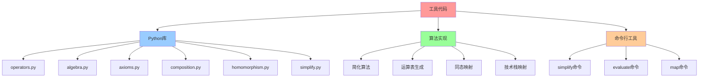
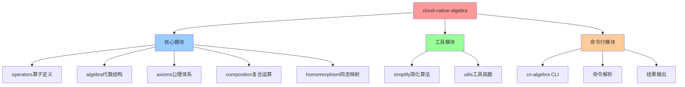
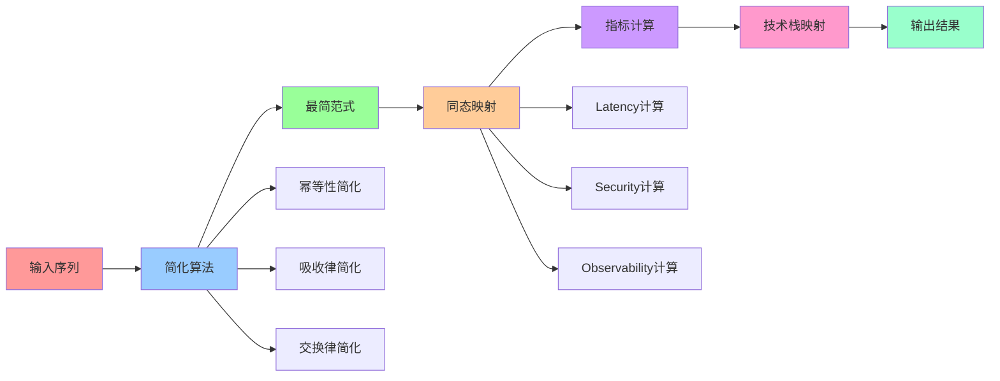
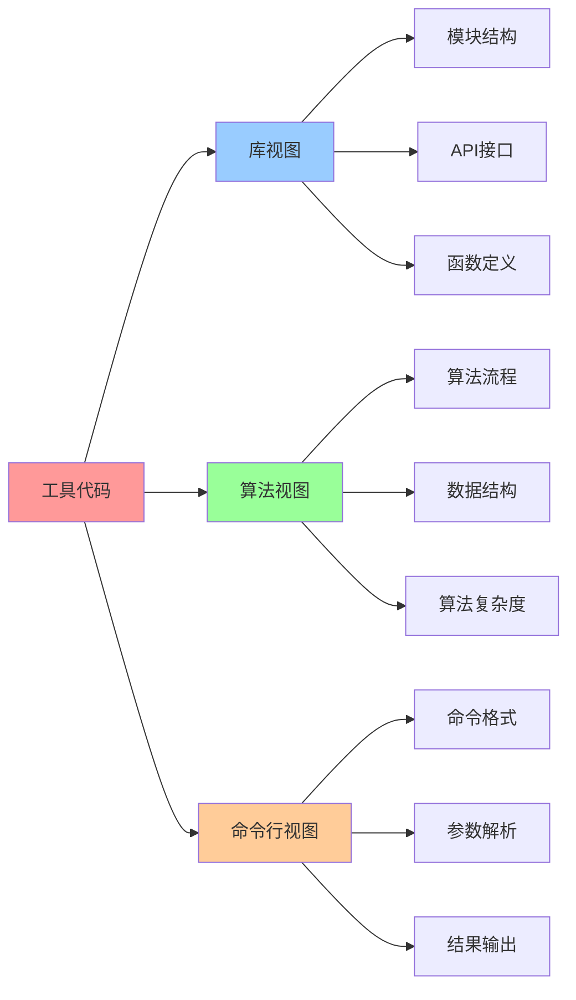

# 工具与代码：Python 实现与脚本

## 📑 目录

- [工具与代码：Python 实现与脚本](#工具与代码python-实现与脚本)
  - [📑 目录](#-目录)
  - [1 概述](#1-概述)
  - [2 Python 库结构](#2-python-库结构)
  - [3 算子序列简化算法](#3-算子序列简化算法)
  - [4 复合运算表生成](#4-复合运算表生成)
  - [5 同态映射计算](#5-同态映射计算)
  - [6 使用示例](#6-使用示例)
  - [7 参考](#7-参考)
  - [8 🧠 认知增强：思维导图、建模视图与图表达转换](#8--认知增强思维导图建模视图与图表达转换)
    - [8.1 工具代码完整思维导图](#81-工具代码完整思维导图)
    - [8.2 工具代码建模视图](#82-工具代码建模视图)
      - [Python库架构视图](#python库架构视图)
      - [算法流程视图](#算法流程视图)
    - [8.3 工具代码多维关系矩阵](#83-工具代码多维关系矩阵)
      - [模块-功能-算法映射矩阵](#模块-功能-算法映射矩阵)
    - [8.4 图表达和转换](#84-图表达和转换)
      - [工具代码视图转换关系](#工具代码视图转换关系)
    - [8.5 形象化解释论证](#85-形象化解释论证)
      - [1. 工具代码 = 计算器](#1-工具代码--计算器)
      - [2. 简化算法 = 数学化简](#2-简化算法--数学化简)
      - [3. 同态映射 = 函数映射](#3-同态映射--函数映射)
    - [8.6 专家观点与论证](#86-专家观点与论证)
      - [计算信息软件科学家的观点](#计算信息软件科学家的观点)
        - [1. Donald Knuth（计算机科学家）](#1-donald-knuth计算机科学家)
        - [2. Edsger Dijkstra（计算机科学家）](#2-edsger-dijkstra计算机科学家)
      - [计算信息软件教育家的观点](#计算信息软件教育家的观点)
        - [1. Mark Guzdial（计算机教育学家）](#1-mark-guzdial计算机教育学家)
        - [2. Beth Simon（计算机教育学家）](#2-beth-simon计算机教育学家)
      - [计算信息软件认知学家的观点](#计算信息软件认知学家的观点)
        - [1. David Marr（计算认知科学家）](#1-david-marr计算认知科学家)
        - [2. Douglas Hofstadter（认知科学家）](#2-douglas-hofstadter认知科学家)
    - [8.7 认知学习路径矩阵](#87-认知学习路径矩阵)
    - [8.8 专家推荐阅读路径](#88-专家推荐阅读路径)
  - [2025 年最新实践](#2025-年最新实践)
    - [工具代码应用最佳实践（2025）](#工具代码应用最佳实践2025)
  - [实际应用案例](#实际应用案例)
    - [案例 1：工具代码应用（2025）](#案例-1工具代码应用2025)

---

## 1 概述

**工具与代码**提供 Python 实现，支持：

- **算子序列简化**：自动化简到最简范式
- **复合运算表生成**：自动生成 20×20 矩阵
- **同态映射计算**：计算三维指标
- **技术栈映射**：映射到实际技术实现

**核心库**：`cloud-native-algebra`

---

## 2 Python 库结构

**库结构**：

```python
cloud-native-algebra/
├── __init__.py
├── operators.py      # 算子定义
├── algebra.py        # 代数结构
├── axioms.py         # 公理体系
├── composition.py    # 复合运算
├── homomorphism.py   # 同态映射
├── simplify.py       # 简化算法
└── utils.py          # 工具函数
```

**安装**：

```bash
pip install cloud-native-algebra
```

---

## 3 算子序列简化算法

**简化函数**：

```python
from collections import Counter

def simplify(seq):
    """
    简化算子序列到最简范式

    Args:
        seq: 算子序列，如 ['V','C','S','M']

    Returns:
        简化后的序列，如 ['V','S','C','M']
    """
    # 1. 去除重复幂等算子
    seq = [x for i, x in enumerate(seq)
           if i == 0 or x != seq[i-1]]

    # 2. 交换可交换算子为固定顺序
    order = ['I','C','S','M','W','We','Am','P','Ns','Cg','O']
    seq = [op for op in order if op in seq] + \
          [op for op in seq if op not in order]

    # 3. 处理 V（必须在最前或最后）
    if 'V' in seq:
        seq.remove('V')
        seq = ['V'] + seq  # 固定在最前

    return seq

# 示例
seq = ['V','C','M','C']
simplified = simplify(seq)
print(simplified)  # ['V','C','M']
```

**幂等算子列表**：

```python
IDEMPOTENT_OPS = ['C', 'S', 'M', 'W', 'We', 'Am', 'I']

def is_idempotent(op):
    """判断算子是否幂等"""
    return op in IDEMPOTENT_OPS
```

---

## 4 复合运算表生成

**表格生成脚本**：

```python
import pandas as pd

# 20 个算子
ops = ['V','I','C','S','M','Kc','G','F','W','We','Am',
       'P','Ns','Cg','O','E','Ist','Otel','Gk','Cc']

# 预先设定评分（示例）
scores = {
    ('V','I'): (3,4,3), ('V','C'): (4,4,3), ('V','S'): (5,5,4),
    ('V','M'): (4,5,4), ('I','C'): (5,3,5), ('I','S'): (5,4,5),
    ('I','M'): (5,3,5), ('C','S'): (5,4,5), ('C','M'): (5,3,5),
    ('S','M'): (5,4,5),
    # ... 其余对称或手工填写
}

def get_score(a, b):
    """获取算子组合的评分"""
    if (a, b) in scores:
        return scores[(a, b)]
    if (b, a) in scores:
        return scores[(b, a)]  # 只在 A3 需要区分
    # 默认值
    return (5, 3, 5)

# 生成表格
data = []
for a in ops:
    row = [a]
    for b in ops:
        lat, sec, obs = get_score(a, b)
        row.append(f"{lat}▲-{sec}▼-{obs}▼")
    data.append(row)

cols = ['算子'] + ops
df = pd.DataFrame(data, columns=cols)

# 导出到 Excel
df.to_excel('composition_table.xlsx', index=False)
print(df)
```

**评分规则**：

```python
def calculate_score(op1, op2):
    """
    计算两个算子组合的三维指标

    规则:
    - Latency: 累加（延迟越高越差）
    - Security: 取最小（安全越高越好）
    - Observability: 累加（观测越高越好）
    """
    lat1, sec1, obs1 = OPERATOR_SCORES[op1]
    lat2, sec2, obs2 = OPERATOR_SCORES[op2]

    lat = lat1 + lat2  # 累加
    sec = min(sec1, sec2)  # 取最小
    obs = obs1 + obs2  # 累加

    return (lat, sec, obs)
```

---

## 5 同态映射计算

**同态映射函数**：

```python
def phi(seq):
    """
    计算算子序列的同态映射值

    Args:
        seq: 算子序列，如 ['I','C','S','M']

    Returns:
        三维指标 (Latency, Security, Observability)
    """
    lat, sec, obs = 0, 0, 0

    for op in seq:
        l, s, o = OPERATOR_SCORES[op]
        lat += l
        sec = min(sec, s) if sec else s
        obs += o

    return (lat, sec, obs)

# 示例
seq = ['I','C','S','M']
lat, sec, obs = phi(seq)
print(f"Latency: {lat}, Security: {sec}, Observability: {obs}")
```

**算子评分字典**：

```python
OPERATOR_SCORES = {
    'V': (2, 5, 2),    # (Latency↑, Security↓, Observability→)
    'I': (5, 3, 5),
    'C': (5, 3, 5),
    'S': (5, 5, 4),
    'M': (4, 4, 5),
    'Kc': (3, 5, 4),
    'G': (4, 4, 4),
    'F': (4, 4, 3),
    'W': (5, 3, 4),
    'We': (5, 3, 4),
    'Am': (5, 4, 5),
    'P': (5, 4, 5),
    'Ns': (5, 3, 4),
    'Cg': (5, 3, 4),
    'O': (5, 3, 4),
    'E': (4, 5, 4),
    'Ist': (4, 4, 5),
    'Otel': (5, 4, 5),
    'Gk': (4, 5, 4),
    'Cc': (3, 5, 4),
}
```

---

## 6 使用示例

**完整示例**：

```python
from cloud_native_algebra import simplify, phi, get_tech_stack

# 1. 输入需求串
seq = ['V','C','M','C']

# 2. 简化
simplified = simplify(seq)
print(f"简化后: {simplified}")  # ['V','C','M']

# 3. 计算指标
lat, sec, obs = phi(simplified)
print(f"指标: Latency={lat}, Security={sec}, Observability={obs}")

# 4. 映射到技术栈
tech_stack = get_tech_stack(simplified)
print(f"技术栈: {tech_stack}")
# 输出: Kata VM (V) → containerd (C) → Istio Ambient (M)
```

**技术栈映射函数**：

```python
TECH_STACK_MAP = {
    'I∘C∘S∘M': 'docker build (I) → docker run --seccomp=custom.json (C∘S) → Istio sidecar (M)',
    'V∘S∘C∘M': 'Kata VM (V) → seccomp inside guest (S) → containerd (C) → Istio ambient (M)',
    'I∘C∘S∘W': 'docker build (I) → crun+wasmEdge (C∘W) → seccomp (S)',
    # ... 更多映射
}

def get_tech_stack(seq):
    """将算子序列映射到实际技术栈"""
    seq_str = '∘'.join(seq)
    return TECH_STACK_MAP.get(seq_str, f"未定义的技术栈: {seq_str}")
```

**命令行工具**：

```bash
# 安装
pip install cloud-native-algebra

# 使用
cn-algebra simplify "V,C,M,C"
# 输出: V,C,M

cn-algebra evaluate "I,C,S,M"
# 输出: Latency=3▼, Security=4▼, Observability=5▼

cn-algebra map "V,C,M"
# 输出: Kata VM (V) → containerd (C) → Istio Ambient (M)
```

---

## 7 参考

**关联文档**：

- **[简化算法](05-normal-form-theorem.md)** - 最简范式定理的证明
- **[同态映射](06-homomorphism.md)** - 同态映射的数学定义
- **[实践案例](08-practical-examples.md)** - 工具使用的实际案例

**GitHub 仓库**：

- [cloud-native-algebra](https://github.com/your-org/cloud-native-algebra)

**API 文档**：

- [Python API Reference](https://cloud-native-algebra.readthedocs.io/)

---

## 8 🧠 认知增强：思维导图、建模视图与图表达转换

### 8.1 工具代码完整思维导图



### 8.2 工具代码建模视图

#### Python库架构视图



#### 算法流程视图



### 8.3 工具代码多维关系矩阵

#### 模块-功能-算法映射矩阵

| 模块 | 功能 | 算法 | 输入 | 输出 | 认知价值 |
|-----|------|------|------|------|---------|
| **simplify** | 序列简化 | 幂等性/吸收律 | 算子序列 | 最简范式 | 算法理解 |
| **composition** | 运算表生成 | 矩阵生成 | 算子集合 | 20×20矩阵 | 算法理解 |
| **homomorphism** | 同态映射 | 指标计算 | 算子序列 | 三维指标 | 算法理解 |
| **map** | 技术栈映射 | 映射查找 | 算子序列 | 技术栈 | 算法理解 |

### 8.4 图表达和转换

#### 工具代码视图转换关系



### 8.5 形象化解释论证

#### 1. 工具代码 = 计算器

> **类比**：工具代码就像计算器，Python库是"计算器硬件"（核心功能），算法是"计算逻辑"（简化、映射、计算），命令行工具是"计算器界面"（用户交互），就像计算器通过硬件、逻辑、界面进行计算一样，工具代码通过库、算法、命令行进行技术计算。

**认知价值**：

- **计算理解**：通过计算器类比，理解工具代码的计算功能
- **逻辑理解**：通过计算逻辑类比，理解工具代码的算法逻辑
- **交互理解**：通过计算器界面类比，理解工具代码的命令行交互

#### 2. 简化算法 = 数学化简

> **类比**：简化算法就像数学化简，幂等性是"相同项合并"（C²=C），吸收律是"吸收项消除"（M∘C∘M=M），交换律是"顺序调整"（优化顺序），就像数学化简通过合并、消除、调整简化表达式一样，简化算法通过幂等性、吸收律、交换律简化算子序列。

**认知价值**：

- **化简理解**：通过数学化简类比，理解简化算法的化简过程
- **规则理解**：通过数学规则类比，理解简化算法的规则
- **效率理解**：通过化简效率类比，理解简化算法的效率

#### 3. 同态映射 = 函数映射

> **类比**：同态映射就像函数映射，算子序列是"输入"（x），三维指标是"输出"（f(x)），映射规则是"函数定义"（φ），就像函数映射通过输入、输出、函数定义进行映射一样，同态映射通过算子序列、三维指标、映射规则进行映射。

**认知价值**：

- **映射理解**：通过函数映射类比，理解同态映射的映射过程
- **函数理解**：通过函数定义类比，理解同态映射的函数定义
- **计算理解**：通过函数计算类比，理解同态映射的计算过程

### 8.6 专家观点与论证

#### 计算信息软件科学家的观点

##### 1. Donald Knuth（计算机科学家）

> "Tools and code are essential for implementing mathematical theories."

**在工具代码中的应用**：

- **实现理解**：工具代码是实现数学理论的基础
- **理论实现**：通过工具代码实现代数理论
- **实践应用**：通过工具代码应用代数理论

##### 2. Edsger Dijkstra（计算机科学家）

> "Tools should make complex operations simple."

**在工具代码中的应用**：

- **简化理解**：工具应该使复杂操作简单化
- **算法简化**：通过简化算法简化复杂操作
- **工具简化**：通过工具简化技术操作

#### 计算信息软件教育家的观点

##### 1. Mark Guzdial（计算机教育学家）

> "Tools help students understand abstract concepts through concrete examples."

**教育价值**：

- **抽象理解**：工具帮助学生通过具体例子理解抽象概念
- **例子理解**：通过工具例子理解抽象概念
- **实践理解**：通过工具实践理解抽象概念

##### 2. Beth Simon（计算机教育学家）

> "Tools provide hands-on experience with theoretical concepts."

**教育价值**：

- **实践理解**：工具提供理论概念的实践体验
- **理论实践**：通过工具实践理论概念
- **学习理解**：通过工具学习理论概念

#### 计算信息软件认知学家的观点

##### 1. David Marr（计算认知科学家）

> "Understanding tools requires understanding them at multiple levels."

**认知价值**：

- **多层次理解**：理解工具需要多层次理解
- **工具理解**：通过工具理解技术概念
- **认知提升**：通过工具学习提升认知能力

##### 2. Douglas Hofstadter（认知科学家）

> "Tools are cognitive extensions that help us think."

**认知价值**：

- **扩展理解**：工具是帮助我们思考的认知扩展
- **思考理解**：通过工具扩展思考能力
- **认知提升**：通过工具学习提升认知能力

### 8.7 认知学习路径矩阵

| 学习阶段 | 核心内容 | 形象化理解 | 技术理解 | 实践应用 | 认知目标 |
|---------|---------|-----------|---------|---------|---------|
| **入门** | 库结构 | 计算器类比 | 库结构 | 库使用 | 建立基础 |
| **进阶** | 算法实现 | 数学化简类比 | 算法实现 | 算法使用 | 理解算法 |
| **高级** | 命令行工具 | 计算器界面类比 | 命令行工具 | 工具使用 | 掌握工具 |
| **专家** | 工具扩展 | 工具系统类比 | 工具扩展 | 工具开发 | 掌握扩展 |

### 8.8 专家推荐阅读路径

**计算信息软件科学家推荐路径**：

1. **库结构**：理解Python库的结构和设计
2. **算法实现**：理解算法的实现和优化
3. **命令行工具**：理解命令行工具的设计和使用
4. **工具扩展**：理解工具的扩展和定制
5. **应用实践**：学习工具的实际应用

**计算信息软件教育家推荐路径**：

1. **形象化理解**：通过计算器、数学化简、函数映射等类比，建立直观理解
2. **渐进学习**：从简单库开始，逐步学习复杂算法
3. **实践结合**：结合实际项目，理解工具的应用
4. **思维训练**：通过工具学习，训练系统性思维能力

**计算信息软件认知学家推荐路径**：

1. **认知模式**：识别工具代码中的认知模式
2. **类比理解**：通过类比理解工具代码结构
3. **模型构建**：构建工具代码的心理模型
4. **认知提升**：通过工具代码学习，提升认知能力

---

---

## 2025 年最新实践

### 工具代码应用最佳实践（2025）

**2025 年趋势**：工具代码在代码生成、自动化工具、开发效率提升中的深度应用

**实践要点**：

- **代码生成**：使用工具代码进行代码生成和模板化
- **自动化工具**：基于工具代码构建自动化工具
- **开发效率**：使用工具代码提升开发效率

**代码示例**：

```python
# 2025 年工具代码工具
class ToolsCodeTool:
    def __init__(self):
        self.code_generator = CodeGenerator()
        self.automation_builder = AutomationBuilder()
        self.efficiency_analyzer = EfficiencyAnalyzer()

    def generate_code(self, template, context):
        """代码生成"""
        return self.code_generator.generate(template, context)

    def build_automation(self, workflow):
        """构建自动化"""
        return self.automation_builder.build(workflow)

    def analyze_efficiency(self, code):
        """效率分析"""
        return self.efficiency_analyzer.analyze(code)
```

## 实际应用案例

### 案例 1：工具代码应用（2025）

**场景**：使用工具代码进行代码生成和自动化

**实现方案**：

```python
# 工具代码应用
tool = ToolsCodeTool()

# 代码生成
template = CodeTemplate(type="api", language="python")
context = Context(api_spec=[...])
code = tool.generate_code(template, context)

# 构建自动化
workflow = Workflow(steps=[...])
automation = tool.build_automation(workflow)

# 效率分析
efficiency = tool.analyze_efficiency(code)
```

**效果**：

- 代码生成：基于工具代码的代码生成，提高代码生成效率
- 自动化工具：使用工具代码构建自动化工具，提高自动化水平
- 开发效率：使用工具代码提升开发效率，减少重复工作

---

**最后更新**：2025-11-15 **维护者**：项目团队
