# 范畴论视角：对象、态射与函子

## 📑 目录

- [📑 目录](#-目录)
- [1 文档定位](#1-文档定位)
- [2 范畴基础](#2-范畴基础)
  - [2.1 容器技术范畴](#21-容器技术范畴)
  - [2.2 对象与态射](#22-对象与态射)
  - [2.3 态射的复合](#23-态射的复合)
  - [2.4 恒等态射](#24-恒等态射)
- [3 核心范畴](#3-核心范畴)
  - [3.1 Pod 范畴](#31-pod-范畴)
  - [3.2 Deployment 范畴](#32-deployment-范畴)
  - [3.3 Service 范畴](#33-service-范畴)
  - [3.4 Node 范畴](#34-node-范畴)
- [4 函子](#4-函子)
  - [4.1 镜像构建函子](#41-镜像构建函子)
  - [4.2 状态同步函子](#42-状态同步函子)
  - [4.3 调度函子](#43-调度函子)
  - [4.4 转换函子](#44-转换函子)
- [5 自然变换](#5-自然变换)
  - [5.1 运行时转换](#51-运行时转换)
  - [5.2 API 版本转换](#52-api-版本转换)
  - [5.3 格式转换](#53-格式转换)
- [6 单子](#6-单子)
  - [6.1 Option 单子](#61-option-单子)
  - [6.2 State 单子](#62-state-单子)
  - [6.3 Error 单子](#63-error-单子)
  - [6.4 Future 单子](#64-future-单子)
- [7 极限与余极限](#7-极限与余极限)
  - [7.1 积与余积](#71-积与余积)
  - [7.2 等化子与余等化子](#72-等化子与余等化子)
  - [7.3 拉回与推出](#73-拉回与推出)
- [8 范畴复合](#8-范畴复合)
  - [8.1 范畴的乘积](#81-范畴的乘积)
  - [8.2 范畴的余乘积](#82-范畴的余乘积)
  - [8.3 函子范畴](#83-函子范畴)
- [9 伴随函子](#9-伴随函子)
  - [9.1 伴随函子定义](#91-伴随函子定义)
  - [9.2 Yoneda 引理](#92-yoneda-引理)
- [10 范畴等价](#10-范畴等价)
  - [10.1 范畴同构](#101-范畴同构)
  - [10.2 范畴等价](#102-范畴等价)
  - [10.3 范畴对偶](#103-范畴对偶)
- [11 虚拟化层次的范畴论建模](#11-虚拟化层次的范畴论建模)
  - [11.1 虚拟化（全虚拟化）范畴](#111-虚拟化全虚拟化范畴)
  - [11.2 半虚拟化范畴](#112-半虚拟化范畴)
  - [11.3 容器化范畴](#113-容器化范畴)
  - [11.4 沙盒化范畴](#114-沙盒化范畴)
  - [11.5 四层次范畴关系](#115-四层次范畴关系)
- [12 参考](#12-参考)

---

## 1 文档定位

本文档从范畴论（Category Theory）视角梳理云原生容器技术栈，将系统抽象为范畴
（Categories）、对象（Objects）、态射（Morphisms）、函子（Functors）等数学结构，
揭示技术本质的数学规律。

根据 Wikipedia，范畴论（Category Theory）是数学的一个分支，研究数学结构及其之间
的关系。范畴论通过对象和态射的概念，提供了一个统一的框架来描述不同数学领域中的概
念和构造。

**Wikipedia 定义参考**（as of 2025-11-02）：

> "Category theory formalizes mathematical structure and its concepts in terms
> of a labeled directed graph called a category, whose nodes are called objects,
> and whose labelled directed edges are called arrows (or morphisms)."

**范畴论核心概念**（根据 Wikipedia）：

1. **范畴（Category）**：

   - **对象（Objects）**：范畴中的元素
   - **态射（Morphisms/Arrows）**：对象之间的映射
   - **复合（Composition）**：态射的组合，满足结合律
   - **恒等态射（Identity Morphism）**：每个对象的自映射

2. **函子（Functor）**：

   - 范畴之间的映射
   - 保持对象和态射的结构
   - 保持恒等态射和复合

3. **自然变换（Natural Transformation）**：

   - 函子之间的映射
   - 满足自然性条件（Naturality Condition）

4. **单子（Monad）**：

   - 自函子 $(T, \eta, \mu)$
   - 单位态射（Unit）和乘法态射（Multiplication）
   - 满足单子法则（Monad Laws）

5. **极限与余极限（Limits and Colimits）**：

   - **积（Product）**和**余积（Coproduct）**
   - **等化子（Equalizer）**和**余等化子（Coequalizer）**
   - **拉回（Pullback）**和**推出（Pushout）**

6. **泛性质（Universal Property）**：
   - 极限和余极限的共性定义
   - 唯一性（Uniqueness）和存在性（Existence）

**文档结构**：

- **范畴基础**：容器技术范畴的定义、对象与态射、态射复合、恒等态射（基于
  Wikipedia 严格定义）
- **核心范畴**：Pod、Deployment、Service、Node 等核心对象的范畴
- **函子**：镜像构建、状态同步、调度、转换等函子（基于 Wikipedia 严格定义）
- **自然变换**：运行时转换、API 版本转换、格式转换（基于 Wikipedia 严格定义）
- **单子**：Option、State、Error、Future 等单子模式（基于 Wikipedia 严格定义）
- **极限与余极限**：积、余积、等化子、余等化子、拉回、推出（基于 Wikipedia 严格
  定义）
- **范畴复合**：范畴乘积、余乘积、函子范畴
- **范畴等价**：范畴同构、等价、对偶

## 2 范畴基础

### 2.1 容器技术范畴

**范畴定义**：容器技术范畴 $\mathcal{C}$ 由以下组成：

- **对象集合**
  $\text{Ob}(\mathcal{C})$：$\{\text{Image}, \text{Container}, \text{Pod}, \text{Deployment}, \text{Service}, \text{Node}\}$
- **态射集合** $\text{Hom}(\mathcal{C})$：对象之间的转换关系
- **态射复合** $\circ$：态射的组合
- **恒等态射** $\text{id}_A$：每个对象的自映射

**形式化定义**：

$$\mathcal{C} = (\text{Ob}(\mathcal{C}), \text{Hom}(\mathcal{C}), \circ, \text{id})$$

其中：

- $\text{Ob}(\mathcal{C}) = \{A, B, C, \ldots\}$：对象集合
- $\text{Hom}(A, B)$：从对象 $A$ 到对象 $B$ 的态射集合
- $\circ$：态射复合，满足结合律
- $\text{id}_A \in \text{Hom}(A, A)$：恒等态射

**容器技术范畴对象**：

| 对象           | 定义         | 属性                |
| -------------- | ------------ | ------------------- |
| **Image**      | 应用镜像     | OCI 规范、分层存储  |
| **Container**  | 运行实例     | Namespace、Cgroups  |
| **Pod**        | 逻辑主机     | 共享网络/IPC/存储   |
| **Deployment** | 期望副本集   | Replicas、滚动更新  |
| **Service**    | 稳定网络标识 | ClusterIP、Labels   |
| **Node**       | 工作节点     | Kubelet、容器运行时 |

### 2.2 对象与态射

**态射定义**：态射 $f: A \rightarrow B$ 表示从对象 $A$ 到对象 $B$ 的转换。

**容器技术态射**：

| 态射          | 定义                                | 类型     |
| ------------- | ----------------------------------- | -------- |
| **build**     | Image $\rightarrow$ Image           | 镜像构建 |
| **pull**      | Registry $\rightarrow$ Image        | 镜像拉取 |
| **create**    | Image $\rightarrow$ Container       | 容器创建 |
| **start**     | Container $\rightarrow$ Container   | 容器启动 |
| **stop**      | Container $\rightarrow$ Container   | 容器停止 |
| **schedule**  | Pod $\rightarrow$ Node              | Pod 调度 |
| **reconcile** | Deployment $\rightarrow$ Deployment | 状态同步 |

**形式化定义**：

设态射 $f: A \rightarrow B$，则：

- $A$ = 源对象（Source Object）
- $B$ = 目标对象（Target Object）
- $f$ = 转换函数（Transformation Function）

**态射示例**：

```yaml
态射:
  build: Image -> Image - Dockerfile -> Image - 构建上下文 -> 镜像层

  pull: Registry -> Image - 镜像仓库 -> 本地镜像 - OCI 镜像格式

  create: Image -> Container - 镜像 -> 容器实例 - Namespace 隔离

  start: Container -> Container - 停止状态 -> 运行状态 - 进程启动

  schedule: Pod -> Node - Pod 对象 -> 节点绑定 - 调度算法
```

### 2.3 态射的复合

**复合定义**：给定态射 $f: A \rightarrow B$ 和 $g: B \rightarrow C$，其复合为：

$$g \circ f: A \rightarrow C$$

**复合法则**：态射复合满足结合律

$$(h \circ g) \circ f = h \circ (g \circ f)$$

**容器技术态射复合**：

| 复合                           | 定义                              | 说明             |
| ------------------------------ | --------------------------------- | ---------------- |
| **start $\circ$ create**       | Image $\rightarrow$ Container     | 创建并启动容器   |
| **schedule $\circ$ reconcile** | Deployment $\rightarrow$ Node     | 同步并调度 Pod   |
| **pull $\circ$ build**         | Source $\rightarrow$ Image        | 构建并推送镜像   |
| **stop $\circ$ start**         | Container $\rightarrow$ Container | 启动后停止（id） |

**形式化定义**：

设态射 $f: A \rightarrow B$ 和 $g: B \rightarrow C$，则复合
$g \circ f: A \rightarrow C$ 定义为：

$$(g \circ f)(a) = g(f(a))$$

**复合示例**：

```yaml
态射复合: deploy = start ∘ create ∘ pull ∘ build - 构建 -> 拉取 -> 创建 -> 启动

  reconcile = schedule ∘ create ∘ reconcile - 同步 -> 创建 -> 调度

  rollback = stop ∘ start - 停止当前 -> 启动旧版本
```

### 2.4 恒等态射

**恒等定义**：对于每个对象 $A$，存在恒等态射 $\text{id}_A: A \rightarrow A$。

**恒等性质**：对于任意态射 $f: A \rightarrow B$，有：

$$f \circ \text{id}_A = f = \text{id}_B \circ f$$

**容器技术恒等态射**：

| 恒等              | 定义                                | 说明                |
| ----------------- | ----------------------------------- | ------------------- |
| **id_Image**      | Image $\rightarrow$ Image           | 镜像不变            |
| **id_Container**  | Container $\rightarrow$ Container   | 容器状态不变        |
| **id_Pod**        | Pod $\rightarrow$ Pod               | Pod 状态不变        |
| **id_Deployment** | Deployment $\rightarrow$ Deployment | Deployment 状态不变 |

**形式化定义**：

对于对象 $A$，恒等态射 $\text{id}_A: A \rightarrow A$ 满足：

$$\text{id}_A(a) = a$$

**恒等示例**：

```yaml
恒等态射:
  id_Image: Image -> Image - 镜像不改变（重新标记版本）

  id_Container: Container -> Container - 容器状态不变（健康检查）

  id_Pod: Pod -> Pod - Pod 状态不变（保持运行）
```

## 3 核心范畴

### 3.1 Pod 范畴

**Pod 范畴定义**：$\mathcal{P}$ 是由 Pod 对象及其态射组成的范畴。

**Pod 对象状态**：

| 状态            | 定义     | 属性         |
| --------------- | -------- | ------------ |
| **Pending**     | 等待调度 | 未调度到节点 |
| **Running**     | 运行中   | Pod 正常运行 |
| **Succeeded**   | 成功完成 | 容器成功退出 |
| **Failed**      | 失败     | 容器失败退出 |
| **Terminating** | 终止中   | Pod 正在终止 |

**Pod 态射**：

| 态射          | 定义                                  | 类型     |
| ------------- | ------------------------------------- | -------- |
| **schedule**  | Pending $\rightarrow$ Running         | Pod 调度 |
| **start**     | Pending $\rightarrow$ Running         | Pod 启动 |
| **succeed**   | Running $\rightarrow$ Succeeded       | Pod 成功 |
| **fail**      | Running $\rightarrow$ Failed          | Pod 失败 |
| **terminate** | Running $\rightarrow$ Terminating     | Pod 终止 |
| **delete**    | Terminating $\rightarrow$ $\emptyset$ | Pod 删除 |

**形式化定义**：

设 Pod 范畴为
$\mathcal{P} = (\text{Ob}(\mathcal{P}), \text{Hom}(\mathcal{P}))$，其中：

- $\text{Ob}(\mathcal{P}) = \{\text{Pending}, \text{Running}, \text{Succeeded}, \text{Failed}, \text{Terminating}\}$
- $\text{Hom}(\mathcal{P})$ 包含所有状态转换态射

**Pod 状态转换图**：

```mermaid
graph LR
    A[Pending] -->|schedule| B[Running]
    B -->|succeed| C[Succeeded]
    B -->|fail| D[Failed]
    B -->|terminate| E[Terminating]
    C -->|delete| F[∅]
    D -->|delete| F
    E -->|delete| F
```



### 3.2 Deployment 范畴

**Deployment 范畴定义**：$\mathcal{D}$ 是由 Deployment 对象及其态射组成的范畴。

**Deployment 对象状态**：

| 状态           | 定义     | 属性                    |
| -------------- | -------- | ----------------------- |
| **Desired**    | 期望状态 | Spec 定义的副本数       |
| **Actual**     | 实际状态 | Status 记录的实际副本数 |
| **Reconciled** | 已同步   | 期望状态与实际状态一致  |

**Deployment 态射**：

| 态射          | 定义                          | 类型     |
| ------------- | ----------------------------- | -------- |
| **reconcile** | Desired $\rightarrow$ Actual  | 状态同步 |
| **scale**     | Desired $\rightarrow$ Desired | 扩缩容   |
| **rollout**   | Desired $\rightarrow$ Desired | 滚动更新 |
| **rollback**  | Desired $\rightarrow$ Desired | 回滚     |

**形式化定义**：

设 Deployment 范畴为
$\mathcal{D} = (\text{Ob}(\mathcal{D}), \text{Hom}(\mathcal{D}))$，其中：

- $\text{Ob}(\mathcal{D}) = \{\text{Desired}, \text{Actual}, \text{Reconciled}\}$
- $\text{Hom}(\mathcal{D})$ 包含所有状态转换态射

**Deployment 状态转换**：

```yaml
Deployment 态射:
  reconcile: Desired -> Actual
    - 根据 Spec 创建 Pod
    - 更新 Status

  scale: Desired -> Desired
    - replicas: 3 -> 5
    - 增加副本数

  rollout: Desired -> Desired
    - image: v1 -> v2
    - 更新镜像版本

  rollback: Desired -> Desired
    - image: v2 -> v1
    - 回滚到旧版本
```

### 3.3 Service 范畴

**Service 范畴定义**：$\mathcal{S}$ 是由 Service 对象及其态射组成的范畴。

**Service 对象状态**：

| 状态          | 定义     | 属性              |
| ------------- | -------- | ----------------- |
| **Selecting** | 选择 Pod | Selector 匹配 Pod |
| **Endpoints** | 端点集合 | 后端 Pod 列表     |
| **Exposed**   | 已暴露   | Service 可访问    |

**Service 态射**：

| 态射            | 定义                            | 类型         |
| --------------- | ------------------------------- | ------------ |
| **select**      | Pod $\rightarrow$ Endpoints     | Pod 选择     |
| **expose**      | Endpoints $\rightarrow$ Exposed | Service 暴露 |
| **loadbalance** | Exposed $\rightarrow$ Exposed   | 负载均衡     |

**形式化定义**：

设 Service 范畴为
$\mathcal{S} = (\text{Ob}(\mathcal{S}), \text{Hom}(\mathcal{S}))$，其中：

- $\text{Ob}(\mathcal{S}) = \{\text{Selecting}, \text{Endpoints}, \text{Exposed}\}$
- $\text{Hom}(\mathcal{S})$ 包含所有状态转换态射

**Service 状态转换**：

```yaml
Service 态射:
  select: Pod -> Endpoints - 根据 Selector 选择 Pod - 更新 Endpoints

  expose: Endpoints -> Exposed - 创建 ClusterIP - 注册 DNS

  loadbalance: Exposed -> Exposed - 分配流量 - 负载均衡
```

### 3.4 Node 范畴

**Node 范畴定义**：$\mathcal{N}$ 是由 Node 对象及其态射组成的范畴。

**Node 对象状态**：

| 状态              | 定义     | 属性             |
| ----------------- | -------- | ---------------- |
| **Ready**         | 就绪     | 节点可用         |
| **NotReady**      | 未就绪   | 节点不可用       |
| **Schedulable**   | 可调度   | 节点可调度 Pod   |
| **Unschedulable** | 不可调度 | 节点不可调度 Pod |

**Node 态射**：

| 态射         | 定义                                    | 类型     |
| ------------ | --------------------------------------- | -------- |
| **register** | $\emptyset$ $\rightarrow$ Ready         | 节点注册 |
| **drain**    | Schedulable $\rightarrow$ Unschedulable | 节点排空 |
| **cordon**   | Schedulable $\rightarrow$ Unschedulable | 节点封锁 |
| **uncordon** | Unschedulable $\rightarrow$ Schedulable | 节点解封 |

**形式化定义**：

设 Node 范畴为
$\mathcal{N} = (\text{Ob}(\mathcal{N}), \text{Hom}(\mathcal{N}))$，其中：

- $\text{Ob}(\mathcal{N}) = \{\text{Ready}, \text{NotReady}, \text{Schedulable}, \text{Unschedulable}\}$
- $\text{Hom}(\mathcal{N})$ 包含所有状态转换态射

## 4 函子

### 4.1 镜像构建函子

**函子定义**：函子 $F: \mathcal{C} \rightarrow \mathcal{D}$ 将范畴 $\mathcal{C}$
映射到范畴 $\mathcal{D}$。

**镜像构建函子**：$F_{\text{build}}: \mathcal{S} \rightarrow \mathcal{I}$

其中：

- $\mathcal{S}$ = 源代码范畴（Source Code Category）
- $\mathcal{I}$ = 镜像范畴（Image Category）

**函子映射**：

| 对象映射                               | 态射映射                          |
| -------------------------------------- | --------------------------------- |
| **Dockerfile** $\rightarrow$ **Image** | **build** $\rightarrow$ **build** |

**形式化定义**：

设镜像构建函子为 $F_{\text{build}}: \mathcal{S} \rightarrow \mathcal{I}$，则：

- $F_{\text{build}}(\text{Dockerfile}) = \text{Image}$
- $F_{\text{build}}(\text{build}: \text{Dockerfile} \rightarrow \text{Dockerfile}) = \text{build}: \text{Image} \rightarrow \text{Image}$

**函子性质**：

1. **保持恒
   等**：$F_{\text{build}}(\text{id}_A) = \text{id}_{F_{\text{build}}(A)}$
2. **保持复
   合**：$F_{\text{build}}(g \circ f) = F_{\text{build}}(g) \circ F_{\text{build}}(f)$

### 4.2 状态同步函子

**状态同步函子**：$F_{\text{sync}}: \mathcal{D} \rightarrow \mathcal{P}$

其中：

- $\mathcal{D}$ = Deployment 范畴
- $\mathcal{P}$ = Pod 范畴

**函子映射**：

| 对象映射                                 | 态射映射                               |
| ---------------------------------------- | -------------------------------------- |
| **Deployment** $\rightarrow$ **Pod Set** | **reconcile** $\rightarrow$ **create** |

**形式化定义**：

设状态同步函子为 $F_{\text{sync}}: \mathcal{D} \rightarrow \mathcal{P}$，则：

- $F_{\text{sync}}(\text{Deployment}) = \{\text{Pod}_1, \text{Pod}_2, \ldots, \text{Pod}_n\}$
- $F_{\text{sync}}(\text{reconcile}: \text{Deployment} \rightarrow \text{Deployment}) = \text{create}: \text{Pod} \rightarrow \text{Pod}$

**状态同步**：

```yaml
状态同步函子:
  F_sync: Deployment -> Pod Set
    - Deployment.replicas = 3
    - F_sync(Deployment) = {Pod_1, Pod_2, Pod_3}

  F_sync: reconcile -> create
    - Deployment.reconcile
    - Pod.create (多个)
```

### 4.3 调度函子

**调度函子**：$F_{\text{schedule}}: \mathcal{P} \rightarrow \mathcal{N}$

其中：

- $\mathcal{P}$ = Pod 范畴
- $\mathcal{N}$ = Node 范畴

**函子映射**：

| 对象映射                       | 态射映射                              |
| ------------------------------ | ------------------------------------- |
| **Pod** $\rightarrow$ **Node** | **schedule** $\rightarrow$ **assign** |

**形式化定义**：

设调度函子为 $F_{\text{schedule}}: \mathcal{P} \rightarrow \mathcal{N}$，则：

- $F_{\text{schedule}}(\text{Pod}) = \text{Node}$
- $F_{\text{schedule}}(\text{schedule}: \text{Pod} \rightarrow \text{Pod}) = \text{assign}: \text{Node} \rightarrow \text{Node}$

**调度算法**：

```yaml
调度函子:
  F_schedule: Pod -> Node
    - Pod.spec.nodeName = nil
    - F_schedule(Pod) = Node (通过调度算法)

  F_schedule: schedule -> assign
    - Pod.schedule
    - Node.assign (Pod 绑定到节点)
```

### 4.4 转换函子

**转换函子**：$F_{\text{convert}}: \mathcal{C} \rightarrow \mathcal{C}'$

其中：

- $\mathcal{C}$ = 源范畴
- $\mathcal{C}'$ = 目标范畴

**转换函子示例**：

| 函子                     | 源范畴 | 目标范畴 | 说明         |
| ------------------------ | ------ | -------- | ------------ |
| **$F_{\text{runtime}}$** | Docker | WasmEdge | 运行时转换   |
| **$F_{\text{version}}$** | v1 API | v2 API   | API 版本转换 |
| **$F_{\text{format}}$**  | OCI    | Docker   | 格式转换     |

**形式化定义**：

设转换函子为 $F_{\text{convert}}: \mathcal{C} \rightarrow \mathcal{C}'$，则：

- $F_{\text{convert}}(A) = A'$（对象转换）
- $F_{\text{convert}}(f: A \rightarrow B) = f': A' \rightarrow B'$（态射转换）

## 5 自然变换

### 5.1 运行时转换

**自然变换定义**：自然变换 $\alpha: F \Rightarrow G$ 是两个函子之间的映射。

**运行时自然变
换**：$\alpha_{\text{runtime}}: F_{\text{Docker}} \Rightarrow F_{\text{WasmEdge}}$

其中：

- $F_{\text{Docker}}$ = Docker 运行时函子
- $F_{\text{WasmEdge}}$ = WasmEdge 运行时函子

**自然变换分量**：

$$\alpha_A: F_{\text{Docker}}(A) \rightarrow F_{\text{WasmEdge}}(A)$$

对于所有对象 $A$。

**形式化定义**：

设自然变换 $\alpha: F \Rightarrow G$，则对于任意态射 $f: A \rightarrow B$，有：

$$G(f) \circ \alpha_A = \alpha_B \circ F(f)$$

**运行时转换**：

```yaml
运行时自然变换:
  α_runtime:
    F_Docker => F_WasmEdge - F_Docker(Container) -> F_WasmEdge(Wasm Module) -
    rootfs -> .wasm - runc -> WasmEdge Runtime
```

### 5.2 API 版本转换

**API 版本自然变换**：$\alpha_{\text{version}}: F_{v1} \Rightarrow F_{v2}$

其中：

- $F_{v1}$ = v1 API 函子
- $F_{v2}$ = v2 API 函子

**版本转换**：

```yaml
API 版本自然变换:
  α_version: F_v1 => F_v2
    - F_v1(Pod) -> F_v2(Pod)
    - apiVersion: v1 -> apiVersion: v2
    - 字段映射
```

### 5.3 格式转换

**格式自然变
换**：$\alpha_{\text{format}}: F_{\text{OCI}} \Rightarrow F_{\text{Docker}}$

其中：

- $F_{\text{OCI}}$ = OCI 格式函子
- $F_{\text{Docker}}$ = Docker 格式函子

**格式转换**：

```yaml
格式自然变换:
  α_format:
    F_OCI => F_Docker - F_OCI(Image) -> F_Docker(Image) - OCI Manifest -> Docker
    Manifest - 格式兼容
```

## 6 单子

### 6.1 Option 单子

**单子定义**：单子 $M$ 是自函子 $(T, \eta, \mu)$，其中：

- $T: \mathcal{C} \rightarrow \mathcal{C}$ 是自函子
- $\eta: \text{id} \Rightarrow T$ 是单位态射
- $\mu: T^2 \Rightarrow T$ 是乘法态射

**Option 单子**：$M_{\text{Option}} = (T_{\text{Option}}, \eta, \mu)$

其中：

- $T_{\text{Option}}(A) = A \cup \{\text{None}\}$
- $\eta_A: A \rightarrow T_{\text{Option}}(A)$ 将元素包装为 Some
- $\mu_A: T_{\text{Option}}^2(A) \rightarrow T_{\text{Option}}(A)$ 展平嵌套

**形式化定义**：

设 Option 单子为 $M_{\text{Option}} = (T_{\text{Option}}, \eta, \mu)$，则：

- $\eta_A(a) = \text{Some}(a)$
- $\mu_A(\text{Some}(\text{Some}(a))) = \text{Some}(a)$
- $\mu_A(\text{Some}(\text{None})) = \text{None}$

**Option 单子应用**：

```yaml
Option 单子:
  Pod.spec.nodeName: Option[String]
    - Some("node1"): Pod 已调度
    - None: Pod 未调度

  Image.pull(): Option[Image]
    - Some(image): 拉取成功
    - None: 拉取失败
```

### 6.2 State 单子

**State 单子**：$M_{\text{State}} = (T_{\text{State}}, \eta, \mu)$

其中：

- $T_{\text{State}}(A) = S \rightarrow (A, S)$（状态转换函数）

**形式化定义**：

设 State 单子为 $M_{\text{State}} = (T_{\text{State}}, \eta, \mu)$，则：

- $\eta_A(a) = \lambda s. (a, s)$
- $\mu_A(f) = \lambda s. \text{let } (g, s') = f(s) \text{ in } g(s')$

**State 单子应用**：

```yaml
State 单子:
  Deployment.reconcile(): State[Deployment, Pod[]]
    - 输入: Deployment 状态
    - 输出: (Pod[], 更新的 Deployment)

  Controller.reconcile(): State[Object, Status]
    - 输入: 对象状态
    - 输出: (操作结果, 更新的对象)
```

### 6.3 Error 单子

**Error 单子**：$M_{\text{Error}} = (T_{\text{Error}}, \eta, \mu)$

其中：

- $T_{\text{Error}}(A) = A \cup \{\text{Error}\}$

**形式化定义**：

设 Error 单子为 $M_{\text{Error}} = (T_{\text{Error}}, \eta, \mu)$，则：

- $\eta_A(a) = \text{Ok}(a)$
- $\mu_A(\text{Ok}(\text{Ok}(a))) = \text{Ok}(a)$
- $\mu_A(\text{Ok}(\text{Error}(e))) = \text{Error}(e)$

**Error 单子应用**：

```yaml
Error 单子:
  Pod.start(): Error[Pod]
    - Ok(pod): 启动成功
    - Error("资源不足"): 启动失败

  Image.pull(): Error[Image]
    - Ok(image): 拉取成功
    - Error("网络错误"): 拉取失败
```

### 6.4 Future 单子

**Future 单子**：$M_{\text{Future}} = (T_{\text{Future}}, \eta, \mu)$

其中：

- $T_{\text{Future}}(A) = \text{Future}[A]$（异步计算）

**形式化定义**：

设 Future 单子为 $M_{\text{Future}} = (T_{\text{Future}}, \eta, \mu)$，则：

- $\eta_A(a) = \text{Future.successful}(a)$
- $\mu_A(f) = f.flatMap(g => g)$

**Future 单子应用**：

```yaml
Future 单子:
  Pod.create(): Future[Pod] - 异步创建 Pod - 返回 Future[Pod]

  Image.pull(): Future[Image] - 异步拉取镜像 - 返回 Future[Image]
```

## 7 极限与余极限

### 7.1 积与余积

**积定义**：对象 $A$ 和 $B$ 的积 $A \times B$ 是满足以下性质的泛对象：

对于任意对象 $X$ 和态射 $f: X \rightarrow A$ 和 $g: X \rightarrow B$，存在唯一的
态射 $h: X \rightarrow A \times B$ 使得：

$$p_1 \circ h = f \quad \text{和} \quad p_2 \circ h = g$$

其中 $p_1$ 和 $p_2$ 是投影态射。

**容器技术积**：

| 积                             | 定义                      | 说明                  |
| ------------------------------ | ------------------------- | --------------------- |
| **Pod $\times$ Node**          | Pod 和 Node 的积          | Pod 与节点的绑定      |
| **Deployment $\times$ Pod**    | Deployment 和 Pod 的积    | Deployment 管理的 Pod |
| **Service $\times$ Endpoints** | Service 和 Endpoints 的积 | Service 的后端端点    |

**余积定义**：对象 $A$ 和 $B$ 的余积 $A + B$ 是满足以下性质的泛对象：

对于任意对象 $X$ 和态射 $f: A \rightarrow X$ 和 $g: B \rightarrow X$，存在唯一的
态射 $h: A + B \rightarrow X$ 使得：

$$h \circ i_1 = f \quad \text{和} \quad h \circ i_2 = g$$

其中 $i_1$ 和 $i_2$ 是注入态射。

**容器技术余积**：

| 余积                           | 定义                             | 说明             |
| ------------------------------ | -------------------------------- | ---------------- |
| **Pod $+$ Pod**                | Pod 的余积                       | 多个 Pod 的集合  |
| **Deployment $+$ StatefulSet** | Deployment 和 StatefulSet 的余积 | 不同类型的副本集 |
| **Node $+$ Node**              | Node 的余积                      | 多个节点的集合   |

### 7.2 等化子与余等化子

**等化子定义**：态射 $f, g: A \rightarrow B$ 的等化子 $\text{Eq}(f, g)$ 是满足以
下性质的对象：

存在态射 $e: \text{Eq}(f, g) \rightarrow A$ 使得 $f \circ e = g \circ e$，并且对
于任意对象 $X$ 和态射 $h: X \rightarrow A$ 满足 $f \circ h = g \circ h$，存在唯
一的态射 $k: X \rightarrow \text{Eq}(f, g)$ 使得 $h = e \circ k$。

**容器技术等化子**：

| 等化子                                       | 定义                     | 说明       |
| -------------------------------------------- | ------------------------ | ---------- |
| **$\text{Eq}(\text{reconcile}, \text{id})$** | reconcile 与恒等的等化子 | 已同步状态 |
| **$\text{Eq}(\text{schedule}, \text{id})$**  | schedule 与恒等的等化子  | 已调度状态 |

**余等化子定义**：态射 $f, g: A \rightarrow B$ 的余等化子 $\text{Coeq}(f, g)$ 是
满足以下性质的对象：

存在态射 $q: B \rightarrow \text{Coeq}(f, g)$ 使得 $q \circ f = q \circ g$，并且
对于任意对象 $X$ 和态射 $h: B \rightarrow X$ 满足 $h \circ f = h \circ g$，存在
唯一的态射 $k: \text{Coeq}(f, g) \rightarrow X$ 使得 $h = k \circ q$。

**容器技术余等化子**：

| 余等化子                                     | 定义                     | 说明         |
| -------------------------------------------- | ------------------------ | ------------ |
| **$\text{Coeq}(\text{scale}, \text{id})$**   | scale 与恒等的余等化子   | 副本数变更   |
| **$\text{Coeq}(\text{rollout}, \text{id})$** | rollout 与恒等的余等化子 | 镜像版本变更 |

### 7.3 拉回与推出

**拉回定义**：给定态射 $f: A \rightarrow C$ 和 $g: B \rightarrow C$，其拉回
$A \times_C B$ 是满足以下性质的泛对象：

存在态射 $p_1: A \times_C B \rightarrow A$ 和 $p_2: A \times_C B \rightarrow B$
使得 $f \circ p_1 = g \circ p_2$，并且对于任意对象 $X$ 和态射
$h_1: X \rightarrow A$ 和 $h_2: X \rightarrow B$ 满足
$f \circ h_1 = g \circ h_2$，存在唯一的态射 $k: X \rightarrow A \times_C B$ 使得
$h_1 = p_1 \circ k$ 和 $h_2 = p_2 \circ k$。

**容器技术拉回**：

| 拉回                                  | 定义                  | 说明             |
| ------------------------------------- | --------------------- | ---------------- |
| **Pod $\times_{\text{Node}}$ Node**   | Pod 和 Node 的拉回    | Pod 绑定到节点   |
| **Service $\times_{\text{Pod}}$ Pod** | Service 和 Pod 的拉回 | Service 选择 Pod |

**推出定义**：给定态射 $f: C \rightarrow A$ 和 $g: C \rightarrow B$，其推出
$A +_C B$ 是满足以下性质的泛对象：

存在态射 $i_1: A \rightarrow A +_C B$ 和 $i_2: B \rightarrow A +_C B$ 使得
$i_1 \circ f = i_2 \circ g$，并且对于任意对象 $X$ 和态射 $h_1: A \rightarrow X$
和 $h_2: B \rightarrow X$ 满足 $h_1 \circ f = h_2 \circ g$，存在唯一的态射
$k: A +_C B \rightarrow X$ 使得 $h_1 = k \circ i_1$ 和 $h_2 = k \circ i_2$。

**容器技术推出**：

| 推出                                              | 定义                             | 说明                   |
| ------------------------------------------------- | -------------------------------- | ---------------------- |
| **Pod $+_{\text{Image}}$ Pod**                    | Pod 的推出                       | 共享镜像的 Pod 集合    |
| **Deployment $+_{\text{Namespace}}$ StatefulSet** | Deployment 和 StatefulSet 的推出 | 同一命名空间的不同类型 |

## 8 范畴复合

### 8.1 范畴的乘积

**范畴乘积定义**：两个范畴 $\mathcal{C}$ 和 $\mathcal{D}$ 的乘积
$\mathcal{C} \times \mathcal{D}$ 由以下组成：

- **对象**：$(A, B)$，其中
  $A \in \text{Ob}(\mathcal{C})$，$B \in \text{Ob}(\mathcal{D})$
- **态射**：$(f, g): (A, B) \rightarrow (A', B')$，其中
  $f: A \rightarrow A'$，$g: B \rightarrow B'$

**容器技术范畴乘积**：

| 乘积                                 | 定义                                 | 说明                    |
| ------------------------------------ | ------------------------------------ | ----------------------- |
| **$\mathcal{P} \times \mathcal{N}$** | Pod 范畴与 Node 范畴的乘积           | Pod-Node 绑定关系       |
| **$\mathcal{D} \times \mathcal{S}$** | Deployment 范畴与 Service 范畴的乘积 | Deployment-Service 关系 |

### 8.2 范畴的余乘积

**范畴余乘积定义**：两个范畴 $\mathcal{C}$ 和 $\mathcal{D}$ 的余乘积
$\mathcal{C} + \mathcal{D}$ 由以下组成：

- **对象**：$A$（来自 $\mathcal{C}$）或 $B$（来自 $\mathcal{D}$）
- **态射**：从 $\mathcal{C}$ 或 $\mathcal{D}$ 继承

**容器技术范畴余乘积**：

| 余乘积                           | 定义                               | 说明             |
| -------------------------------- | ---------------------------------- | ---------------- |
| **$\mathcal{D} + \mathcal{SS}$** | Deployment 与 StatefulSet 的余乘积 | 不同类型的副本集 |
| **$\mathcal{P} + \mathcal{P}$**  | Pod 与 Pod 的余乘积                | 多个 Pod 的集合  |

### 8.3 函子范畴

**函子范畴定义**：两个范畴 $\mathcal{C}$ 和 $\mathcal{D}$ 之间的函子范畴
$\mathcal{D}^{\mathcal{C}}$ 由以下组成：

- **对象**：函子 $F: \mathcal{C} \rightarrow \mathcal{D}$
- **态射**：自然变换 $\alpha: F \Rightarrow G$

**容器技术函子范畴**：

| 函子范畴                        | 定义                         | 说明         |
| ------------------------------- | ---------------------------- | ------------ |
| **$\mathcal{I}^{\mathcal{S}}$** | 源代码到镜像的函子范畴       | 镜像构建函子 |
| **$\mathcal{P}^{\mathcal{D}}$** | Deployment 到 Pod 的函子范畴 | 状态同步函子 |

## 9 伴随函子

根据 Wikipedia，伴随函子（Adjoint Functors）是范畴论中的一个核心概念，描述了函子
之间的对偶关系。

### 9.1 伴随函子定义

**伴随定义**：设 $F: \mathcal{C} \rightarrow \mathcal{D}$ 和
$G: \mathcal{D} \rightarrow \mathcal{C}$ 是两个函子，如果存在自然同构：

$$\text{Hom}_{\mathcal{D}}(F(A), B) \cong \text{Hom}_{\mathcal{C}}(A, G(B))$$

则称 $F$ 是 $G$ 的左伴随（Left Adjoint），$G$ 是 $F$ 的右伴随（Right Adjoint），
记为 $F \dashv G$。

**Wikipedia 定义参考**（as of 2025-11-02）：

> "An adjunction between categories $\mathcal{C}$ and $\mathcal{D}$ is a pair of
> functors $F: \mathcal{C} \rightarrow \mathcal{D}$ and
> $G: \mathcal{D} \rightarrow \mathcal{C}$ together with a natural isomorphism
> $\text{Hom}_{\mathcal{D}}(F(-), -) \cong \text{Hom}_{\mathcal{C}}(-, G(-))$."

**容器技术伴随函子**：

| 伴随对                                           | 左伴随（Left Adjoint） | 右伴随（Right Adjoint） | 说明             |
| ------------------------------------------------ | ---------------------- | ----------------------- | ---------------- |
| **$F_{\text{build}} \dashv F_{\text{pull}}$**    | Image 构建函子         | Image 拉取函子          | 构建与拉取的伴随 |
| **$F_{\text{create}} \dashv F_{\text{remove}}$** | Container 创建函子     | Container 删除函子      | 创建与删除的伴随 |

**形式化定义**：

设 $F_{\text{build}}: \mathcal{S} \rightarrow \mathcal{I}$ 和
$F_{\text{pull}}: \mathcal{I} \rightarrow \mathcal{S}$ 是伴随函子，则：

$$\text{Hom}_{\mathcal{I}}(F_{\text{build}}(\text{Source}), \text{Image}) \cong \text{Hom}_{\mathcal{S}}(\text{Source}, F_{\text{pull}}(\text{Image}))$$

其中：

- $\mathcal{S}$ = 源代码范畴
- $\mathcal{I}$ = 镜像范畴

**伴随性质**：

1. **单位（Unit）**：$\eta: \text{id}_{\mathcal{C}} \Rightarrow G \circ F$
2. **余单位
   （Counit）**：$\epsilon: F \circ G \Rightarrow \text{id}_{\mathcal{D}}$
3. **三角恒等式（Triangle Identities）**：
   - $(\epsilon F) \circ (F \eta) = \text{id}_F$
   - $(G \epsilon) \circ (\eta G) = \text{id}_G$

### 9.2 Yoneda 引理

根据 Wikipedia，Yoneda 引理（Yoneda Lemma）是范畴论中的一个基本结果，描述了对象
与其在 Hom-函子中的表示之间的关系。

**Yoneda 引理**：

设 $\mathcal{C}$ 是一个范畴
，$A \in \text{Ob}(\mathcal{C})$，$F: \mathcal{C}^{\text{op}} \rightarrow \text{Set}$
是一个预层（Presheaf），则存在自然双射：

$$\text{Nat}(\text{Hom}_{\mathcal{C}}(-, A), F) \cong F(A)$$

其中 $\text{Nat}$ 表示自然变换的集合。

**Wikipedia 定义参考**（as of 2025-11-02）：

> "The Yoneda lemma is one of the most famous and important results in category
> theory. It states that for any category $\mathcal{C}$ and any functor
> $F: \mathcal{C}^{\text{op}} \rightarrow \text{Set}$, the natural
> transformations from $\text{Hom}_{\mathcal{C}}(-, A)$ to $F$ are in one-to-one
> correspondence with the elements of $F(A)$."

**容器技术 Yoneda 引理应用**：

- **Pod 表示**：Pod 对象由其在其他对象上的作用决定
- **Deployment 表示**：Deployment 对象由其在 Pod 上的作用决定
- **Service 表示**：Service 对象由其在 Pod 上的作用决定

**Yoneda 嵌入**：

Yoneda 嵌入 $Y: \mathcal{C} \rightarrow \text{Set}^{\mathcal{C}^{\text{op}}}$ 将
对象 $A$ 映射到 Hom-函子 $\text{Hom}_{\mathcal{C}}(-, A)$。

**容器技术 Yoneda 嵌入**：

$$Y(\text{Pod}) = \text{Hom}_{\mathcal{C}}(-, \text{Pod})$$

表示 Pod 对象由其与其他对象的所有态射决定。

**Yoneda 嵌入的保满性**：

根据 Wikipedia，Yoneda 嵌入是完全忠实的（Fully Faithful），即：

$$\text{Hom}_{\mathcal{C}}(A, B) \cong \text{Hom}_{\text{Set}^{\mathcal{C}^{\text{op}}}}(Y(A), Y(B))$$

**容器技术应用**：

Pod 之间的态射与它们对应的 Hom-函子之间的自然变换一一对应。

## 10 范畴等价

### 10.1 范畴同构

**范畴同构定义**：两个范畴 $\mathcal{C}$ 和 $\mathcal{D}$ 同构，当且仅当存在函子
$F: \mathcal{C} \rightarrow \mathcal{D}$ 和
$G: \mathcal{D} \rightarrow \mathcal{C}$ 使得：

$$G \circ F = \text{id}_{\mathcal{C}} \quad \text{和} \quad F \circ G = \text{id}_{\mathcal{D}}$$

**容器技术范畴同构**：

| 同构                                                                    | 定义                          | 说明         |
| ----------------------------------------------------------------------- | ----------------------------- | ------------ |
| **$\mathcal{C}_{\text{Docker}} \cong \mathcal{C}_{\text{containerd}}$** | Docker 与 containerd 范畴同构 | 运行时等价   |
| **$\mathcal{C}_{\text{K8s}} \cong \mathcal{C}_{\text{K3s}}$**           | Kubernetes 与 K3s 范畴同构    | 编排系统等价 |

### 10.2 范畴等价

**范畴等价定义**：两个范畴 $\mathcal{C}$ 和 $\mathcal{D}$ 等价，当且仅当存在函子
$F: \mathcal{C} \rightarrow \mathcal{D}$ 和
$G: \mathcal{D} \rightarrow \mathcal{C}$ 以及自然同构：

$$\eta: \text{id}_{\mathcal{C}} \Rightarrow G \circ F \quad \text{和} \quad \epsilon: F \circ G \Rightarrow \text{id}_{\mathcal{D}}$$

**容器技术范畴等价**：

| 等价                                                                  | 定义                       | 说明           |
| --------------------------------------------------------------------- | -------------------------- | -------------- |
| **$\mathcal{C}_{\text{OCI}} \simeq \mathcal{C}_{\text{Docker}}$**     | OCI 与 Docker 范畴等价     | 镜像格式等价   |
| **$\mathcal{C}_{\text{CRI}} \simeq \mathcal{C}_{\text{Docker API}}$** | CRI 与 Docker API 范畴等价 | 运行时接口等价 |

### 10.3 范畴对偶

**范畴对偶定义**：范畴 $\mathcal{C}$ 的对偶范畴 $\mathcal{C}^{\text{op}}$ 由以下
组成：

- **对象**：与 $\mathcal{C}$ 相同
- **态
  射**：$\text{Hom}_{\mathcal{C}^{\text{op}}}(A, B) = \text{Hom}_{\mathcal{C}}(B, A)$

**容器技术范畴对偶**：

| 对偶                          | 定义                  | 说明         |
| ----------------------------- | --------------------- | ------------ |
| **$\mathcal{P}^{\text{op}}$** | Pod 范畴的对偶        | 反向状态转换 |
| **$\mathcal{D}^{\text{op}}$** | Deployment 范畴的对偶 | 反向状态同步 |

## 11 虚拟化层次的范畴论建模

本文档从范畴论角度深入分析虚拟化、半虚拟化、容器化、沙盒化四个技术范式，将各范式
抽象为范畴（Categories）、对象（Objects）、态射（Morphisms）、函子（Functors）等
数学结构，揭示技术本质的范畴论规律。

### 11.1 虚拟化（全虚拟化）范畴

**虚拟化范畴定义**：

设虚拟化范畴为 $\mathcal{C}_{\text{VM}}$，由以下组成：

$$\mathcal{C}_{\text{VM}} = (\text{Ob}(\mathcal{C}_{\text{VM}}), \text{Hom}(\mathcal{C}_{\text{VM}}), \circ, \text{id})$$

**虚拟化范畴对象**：

$$\text{Ob}(\mathcal{C}_{\text{VM}}) = \{\text{Hypervisor}, \text{VM}_1, \text{VM}_2, \ldots, \text{VM}_n, \text{Hardware}\}$$

其中：

- $\text{Hypervisor}$：虚拟机监视器对象
- $\text{VM}_i$：第 $i$ 个虚拟机对象
- $\text{Hardware}$：物理硬件对象

**虚拟化范畴态射**：

$$\text{Hom}(\mathcal{C}_{\text{VM}}) = \{\text{create}: \text{Hypervisor} \rightarrow \text{VM}_i, \text{start}: \text{VM}_i \rightarrow \text{VM}_i, \text{stop}: \text{VM}_i \rightarrow \text{VM}_i, \text{delete}: \text{VM}_i \rightarrow \emptyset, \text{emulate}: \text{Hypervisor} \times \text{Hardware} \rightarrow \text{VM}_i\}$$

其中：

- $\text{create}$：创建虚拟机态射
- $\text{start}$：启动虚拟机态射
- $\text{stop}$：停止虚拟机态射
- $\text{delete}$：删除虚拟机态射
- $\text{emulate}$：硬件模拟态射

**虚拟化范畴态射复合**：

$$\text{start} \circ \text{create}: \text{Hypervisor} \rightarrow \text{VM}_i$$

表示创建并启动虚拟机的复合态射。

**虚拟化范畴恒等态射**：

$$\text{id}_{\text{VM}_i}: \text{VM}_i \rightarrow \text{VM}_i$$

表示虚拟机 $i$ 的恒等态射（状态不变）。

**虚拟化范畴定义**（根据 Wikipedia，as of 2025-11-02）：

虚拟化范畴满足范畴的所有公理：

1. **结合律**：$(h \circ g) \circ f = h \circ (g \circ f)$
2. **恒等律**：$f \circ \text{id}_A = f = \text{id}_B \circ f$

**虚拟化函子**：

设
$F_{\text{VM}}: \mathcal{C}_{\text{Hardware}} \rightarrow \mathcal{C}_{\text{VM}}$
是虚拟化函子，则：

$$F_{\text{VM}}(\text{Hardware}) = \text{VM}_1 \times \text{VM}_2 \times \cdots \times \text{VM}_n$$

其中 $\times$ 表示积（Product），表示一个物理硬件资源映射到多个虚拟机。

**虚拟化函子保持复合**：

$$F_{\text{VM}}(g \circ f) = F_{\text{VM}}(g) \circ F_{\text{VM}}(f)$$

**虚拟化函子保持恒等**：

$$F_{\text{VM}}(\text{id}_A) = \text{id}_{F_{\text{VM}}(A)}$$

### 11.2 半虚拟化范畴

**半虚拟化范畴定义**：

设半虚拟化范畴为 $\mathcal{C}_{\text{PV}}$，由以下组成：

$$\mathcal{C}_{\text{PV}} = (\text{Ob}(\mathcal{C}_{\text{PV}}), \text{Hom}(\mathcal{C}_{\text{PV}}), \circ, \text{id})$$

**半虚拟化范畴对象**：

$$\text{Ob}(\mathcal{C}_{\text{PV}}) = \{\text{Hypervisor}, \text{PV\_VM}_1, \text{PV\_VM}_2, \ldots, \text{PV\_VM}_n, \text{Hardware}, \text{Collaboration\_Interface}\}$$

其中：

- $\text{PV\_VM}_i$：第 $i$ 个半虚拟化虚拟机对象（修改后的 Guest OS）
- $\text{Collaboration\_Interface}$：协作接口对象（Hypercall、VirtIO、Grant
  Table、Event Channel）

**半虚拟化范畴态射**：

$$\text{Hom}(\mathcal{C}_{\text{PV}}) = \{\text{create}: \text{Hypervisor} \rightarrow \text{PV\_VM}_i, \text{hypercall}: \text{PV\_VM}_i \rightarrow \text{Hypervisor}, \text{virtio}: \text{PV\_VM}_i \leftrightarrow \text{Hypervisor}, \text{grant}: \text{PV\_VM}_i \times \text{Hypervisor} \rightarrow \text{Memory\_Shared}\}$$

其中：

- $\text{hypercall}$：Hypercall 态射（Guest OS 调用 Hypervisor）
- $\text{virtio}$：VirtIO 态射（前端/后端驱动协作）
- $\text{grant}$：Grant Table 态射（内存共享）

**半虚拟化范畴态射复合**：

$$\text{hypercall} \circ \text{create}: \text{Hypervisor} \rightarrow \text{Hypervisor}$$

表示创建半虚拟化虚拟机并通过 Hypercall 协作的复合态射。

**半虚拟化函子**：

设
$F_{\text{PV}}: \mathcal{C}_{\text{Full}} \rightarrow \mathcal{C}_{\text{PV}}$
是半虚拟化转换函子，则：

$$F_{\text{PV}}(\text{VM}_i) = \text{PV\_VM}_i$$

其中 $\text{PV\_VM}_i$ 表示修改后的虚拟机（支持协作接口）。

**协作函子**：

设
$F_{\text{collaboration}}: \mathcal{C}_{\text{PV}} \rightarrow \mathcal{C}_{\text{Performance}}$
是协作函子，则：

$$F_{\text{collaboration}}(\text{PV\_VM}_i) = \text{Performance}_{\text{optimized}}$$

表示通过协作机制优化性能。

**协作效率自然变换**：

设 $\alpha_{\text{efficiency}}: F_{\text{Full}} \Rightarrow F_{\text{PV}}$ 是效
率自然变换，则：

$$\alpha_{\text{efficiency}}(\text{VM}_i): F_{\text{Full}}(\text{VM}_i) \rightarrow F_{\text{PV}}(\text{PV\_VM}_i)$$

表示从全虚拟化到半虚拟化的效率提升。

**协作效率定理 25**：

半虚拟化通过协作机制提高性能：

$$\text{Performance}(F_{\text{PV}}(\text{PV\_VM}_i)) > \text{Performance}(F_{\text{Full}}(\text{VM}_i))$$

**证明**：通过 Hypercall 减少 VM Exit，通过 VirtIO 减少设备模拟，性能提升
30-50%。

$\square$

### 11.3 容器化范畴

**容器化范畴定义**：

设容器化范畴为 $\mathcal{C}_{\text{Container}}$，由以下组成：

$$\mathcal{C}_{\text{Container}} = (\text{Ob}(\mathcal{C}_{\text{Container}}), \text{Hom}(\mathcal{C}_{\text{Container}}), \circ, \text{id})$$

**容器化范畴对象**：

$$\text{Ob}(\mathcal{C}_{\text{Container}}) = \{\text{Host\_Kernel}, \text{Container}_1, \text{Container}_2, \ldots, \text{Container}_n, \text{Namespace}, \text{Cgroup}\}$$

其中：

- $\text{Host\_Kernel}$：Host OS 内核对象（共享）
- $\text{Container}_i$：第 $i$ 个容器对象
- $\text{Namespace}$：命名空间对象
- $\text{Cgroup}$：控制组对象

**容器化范畴态射**：

$$\text{Hom}(\mathcal{C}_{\text{Container}}) = \{\text{create}: \text{Host\_Kernel} \times \text{Image} \rightarrow \text{Container}_i, \text{namespace}: \text{Host\_Kernel} \times \text{Container}_i \rightarrow \text{Namespace}_i, \text{cgroup}: \text{Host\_Kernel} \times \text{Container}_i \rightarrow \text{Cgroup}_i, \text{start}: \text{Container}_i \rightarrow \text{Container}_i, \text{stop}: \text{Container}_i \rightarrow \text{Container}_i\}$$

其中：

- $\text{namespace}$：命名空间隔离态射
- $\text{cgroup}$：资源限制态射

**容器化范畴态射复合**：

$$\text{start} \circ \text{cgroup} \circ \text{namespace} \circ \text{create}: \text{Host\_Kernel} \times \text{Image} \rightarrow \text{Container}_i$$

表示创建、隔离、限制并启动容器的复合态射。

**容器化函子**：

设
$F_{\text{Container}}: \mathcal{C}_{\text{Image}} \rightarrow \mathcal{C}_{\text{Container}}$
是容器化函子，则：

$$F_{\text{Container}}(\text{Image}) = \text{Container}$$

表示从镜像到容器的转换。

**Namespace 函子**：

设
$F_{\text{namespace}}: \mathcal{C}_{\text{Container}} \rightarrow \mathcal{C}_{\text{Isolated}}$
是 Namespace 函子，则：

$$F_{\text{namespace}}(\text{Container}_i) = \text{Isolated\_Container}_i$$

表示通过 Namespace 实现隔离。

**Cgroup 函子**：

设
$F_{\text{cgroup}}: \mathcal{C}_{\text{Container}} \rightarrow \mathcal{C}_{\text{Limited}}$
是 Cgroup 函子，则：

$$F_{\text{cgroup}}(\text{Container}_i) = \text{Limited\_Container}_i$$

表示通过 Cgroup 实现资源限制。

**容器化隔离定理 26**：

容器化通过 Namespace 和 Cgroup 实现进程级隔离：

$$\forall \text{Container}_i, \text{Container}_j (i \neq j), \quad F_{\text{namespace}}(\text{Container}_i) \cap F_{\text{namespace}}(\text{Container}_j) = \emptyset$$

**证明**：每个容器拥有独立的 Namespace，虚拟视图互不相交。

$\square$

### 11.4 沙盒化范畴

**沙盒化范畴定义**：

设沙盒化范畴为 $\mathcal{C}_{\text{Sandbox}}$，由以下组成：

$$\mathcal{C}_{\text{Sandbox}} = (\text{Ob}(\mathcal{C}_{\text{Sandbox}}), \text{Hom}(\mathcal{C}_{\text{Sandbox}}), \circ, \text{id})$$

**沙盒化范畴对象**：

$$\text{Ob}(\mathcal{C}_{\text{Sandbox}}) = \{\text{Runtime}, \text{Sandbox}_1, \text{Sandbox}_2, \ldots, \text{Sandbox}_n, \text{Host\_Kernel}, \text{WASI}\}$$

其中：

- $\text{Runtime}$：运行时对象（如 WasmEdge）
- $\text{Sandbox}_i$：第 $i$ 个沙盒对象（如 Wasm Module）
- $\text{WASI}$：WebAssembly System Interface 对象

**沙盒化范畴态射**：

$$\text{Hom}(\mathcal{C}_{\text{Sandbox}}) = \{\text{load}: \text{Runtime} \times \text{Wasm\_Module} \rightarrow \text{Sandbox}_i, \text{instantiate}: \text{Sandbox}_i \rightarrow \text{Sandbox}_i, \text{invoke}: \text{Sandbox}_i \times \text{Function} \rightarrow \text{Sandbox}_i, \text{intercept}: \text{Sandbox}_i \times \text{Syscall} \rightarrow \text{Host\_Kernel}, \text{permission}: \text{Sandbox}_i \times \text{Resource} \rightarrow \text{Boolean}\}$$

其中：

- $\text{load}$：加载 Wasm 模块态射
- $\text{instantiate}$：实例化模块态射
- $\text{invoke}$：调用函数态射
- $\text{intercept}$：系统调用拦截态射
- $\text{permission}$：权限检查态射

**沙盒化范畴态射复合**：

$$\text{invoke} \circ \text{instantiate} \circ \text{load}: \text{Runtime} \times \text{Wasm\_Module} \times \text{Function} \rightarrow \text{Sandbox}_i$$

表示加载、实例化并调用函数的复合态射。

**沙盒化函子**：

设
$F_{\text{Sandbox}}: \mathcal{C}_{\text{Wasm\_Module}} \rightarrow \mathcal{C}_{\text{Sandbox}}$
是沙盒化函子，则：

$$F_{\text{Sandbox}}(\text{Wasm\_Module}) = \text{Sandbox}$$

表示从 Wasm 模块到沙盒的转换。

**WASI 函子**：

设
$F_{\text{WASI}}: \mathcal{C}_{\text{Sandbox}} \rightarrow \mathcal{C}_{\text{Isolated}}$
是 WASI 函子，则：

$$F_{\text{WASI}}(\text{Sandbox}_i) = \text{Isolated\_Sandbox}_i$$

表示通过 WASI 实现隔离。

**沙盒化隔离定理 27**：

沙盒化通过系统调用拦截和权限限制实现应用级隔离：

$$\forall \text{Sandbox}_i, \text{Sandbox}_j (i \neq j), \quad F_{\text{WASI}}(\text{Sandbox}_i) \cap F_{\text{WASI}}(\text{Sandbox}_j) = \emptyset$$

**证明**：每个沙盒拥有独立的内存和权限，互不相交。

$\square$

**沙盒化性能定理 28**：

沙盒化通过轻量运行时实现高性能：

$$\text{Performance}(F_{\text{Sandbox}}(\text{Sandbox}_i)) > \text{Performance}(F_{\text{Container}}(\text{Container}_i))$$

**证明**：运行时开销极小（< 2MB），系统调用拦截开销低（< 5 cycles），启动时间短
（< 10ms）。

$\square$

### 11.5 四层次范畴关系

**四层次范畴对比矩阵**：

| 范式         | 范畴定义                         | 对象集合                                      | 态射集合                                  | 隔离机制                                    |
| ------------ | -------------------------------- | --------------------------------------------- | ----------------------------------------- | ------------------------------------------- |
| **虚拟化**   | $\mathcal{C}_{\text{VM}}$        | $\{\text{H}, \text{VM}_i, \text{HW}\}$        | $\{\text{create}, \text{emulate}\}$       | 硬件级隔离（$\text{Iso}_{\text{HW}}$）      |
| **半虚拟化** | $\mathcal{C}_{\text{PV}}$        | $\{\text{H}, \text{PV\_VM}_i, \text{CI}\}$    | $\{\text{hypercall}, \text{virtio}\}$     | 内核级隔离（$\text{Iso}_{\text{Kernel}}$）  |
| **容器化**   | $\mathcal{C}_{\text{Container}}$ | $\{\text{K}, \text{Container}_i, \text{NS}\}$ | $\{\text{namespace}, \text{cgroup}\}$     | 进程级隔离（$\text{Iso}_{\text{Process}}$） |
| **沙盒化**   | $\mathcal{C}_{\text{Sandbox}}$   | $\{\text{R}, \text{Sandbox}_i, \text{WASI}\}$ | $\{\text{intercept}, \text{permission}\}$ | 应用级隔离（$\text{Iso}_{\text{App}}$）     |

**四层次范畴函子映射**：

**从虚拟化到半虚拟化的函子**：

设 $F_{\text{PV}}: \mathcal{C}_{\text{VM}} \rightarrow \mathcal{C}_{\text{PV}}$
是半虚拟化转换函子，则：

$$F_{\text{PV}}(\text{VM}_i) = \text{PV\_VM}_i$$
$$F_{\text{PV}}(\text{emulate}) = \text{hypercall} \circ \text{virtio}$$

表示将全虚拟化的模拟态射转换为半虚拟化的协作态射。

**从半虚拟化到容器化的函子**：

设
$F_{\text{Container}}: \mathcal{C}_{\text{PV}} \rightarrow \mathcal{C}_{\text{Container}}$
是容器化转换函子，则：

$$F_{\text{Container}}(\text{PV\_VM}_i) = \text{Container}_i$$
$$F_{\text{Container}}(\text{hypercall}) = \text{syscall}$$

表示将半虚拟化的 Hypercall 态射转换为容器化的系统调用态射。

**从容器化到沙盒化的函子**：

设
$F_{\text{Sandbox}}: \mathcal{C}_{\text{Container}} \rightarrow \mathcal{C}_{\text{Sandbox}}$
是沙盒化转换函子，则：

$$F_{\text{Sandbox}}(\text{Container}_i) = \text{Sandbox}_i$$
$$F_{\text{Sandbox}}(\text{namespace}) = \text{permission}$$

表示将容器化的命名空间态射转换为沙盒化的权限态射。

**四层次范畴自然变换**：

**性能优化自然变换**：

设
$\alpha_{\text{performance}}: F_{\text{VM}} \Rightarrow F_{\text{PV}} \Rightarrow F_{\text{Container}} \Rightarrow F_{\text{Sandbox}}$
是性能优化自然变换，则：

$$\text{Performance}(F_{\text{Sandbox}}(\text{Sandbox})) > \text{Performance}(F_{\text{Container}}(\text{Container})) > \text{Performance}(F_{\text{PV}}(\text{PV\_VM})) > \text{Performance}(F_{\text{VM}}(\text{VM}))$$

**隔离强度自然变换**：

设
$\alpha_{\text{isolation}}: F_{\text{Sandbox}} \Rightarrow F_{\text{Container}} \Rightarrow F_{\text{PV}} \Rightarrow F_{\text{VM}}$
是隔离强度自然变换，则：

$$\text{Isolation}(F_{\text{VM}}(\text{VM})) > \text{Isolation}(F_{\text{PV}}(\text{PV\_VM})) > \text{Isolation}(F_{\text{Container}}(\text{Container})) > \text{Isolation}(F_{\text{Sandbox}}(\text{Sandbox}))$$

**四层次范畴等价关系**：

**范畴近似等价**：

$\mathcal{C}_{\text{VM}} \simeq \mathcal{C}_{\text{PV}}$（虚拟化与半虚拟化近似等
价）

存在自然变换 $\alpha: F_{\text{VM}} \Rightarrow F_{\text{PV}}$ 和
$\beta: F_{\text{PV}} \Rightarrow F_{\text{VM}}$ 使得：

$$\beta \circ \alpha \cong \text{id}_{F_{\text{VM}}} \quad \text{和} \quad \alpha \circ \beta \cong \text{id}_{F_{\text{PV}}}$$

**范畴不等价关系**：

$\mathcal{C}_{\text{PV}} \not\simeq \mathcal{C}_{\text{Container}}$（半虚拟化与
容器化不等价）

$\mathcal{C}_{\text{Container}} \not\simeq \mathcal{C}_{\text{Sandbox}}$（容器化
与沙盒化不等价）

原因：隔离机制、资源模型、运行环境完全不同。

**四层次范畴极限与余极限**：

**积（Product）**：

$$\text{VM}_1 \times \text{VM}_2 \times \cdots \times \text{VM}_n = \text{Hypervisor}(\text{Hardware})$$

表示多个虚拟机共享同一物理硬件资源的积。

**余积（Coproduct）**：

$$\text{Container}_1 \coprod \text{Container}_2 \coprod \cdots \coprod \text{Container}_n = \text{Host\_Kernel}(\text{Container}_1, \text{Container}_2, \ldots, \text{Container}_n)$$

表示多个容器共享同一 Host 内核的余积。

**拉回（Pullback）**：

$$\text{Sandbox}_i \times_{\text{Runtime}} \text{WASI} = \text{Isolated\_Sandbox}_i$$

表示沙盒通过 Runtime 和 WASI 实现隔离的拉回。

**四层次范畴决策函子**：

设
$D: \{\text{Requirements}\} \rightarrow \{\mathcal{C}_{\text{VM}}, \mathcal{C}_{\text{PV}}, \mathcal{C}_{\text{Container}}, \mathcal{C}_{\text{Sandbox}}\}$
是决策函子，则：

$$
D(\text{requirements}) = \begin{cases}
\mathcal{C}_{\text{VM}} & \text{if } \text{Multi\_OS} \wedge \text{Max\_Isolation} \\
\mathcal{C}_{\text{PV}} & \text{if } \text{Multi\_OS} \wedge \text{High\_Performance} \wedge \text{OS\_Modifiable} \\
\mathcal{C}_{\text{Container}} & \text{if } \text{Linux\_Only} \wedge \text{Balance} \\
\mathcal{C}_{\text{Sandbox}} & \text{if } \text{Speed} \wedge \text{Efficiency}
\end{cases}
$$

**范畴论决策定理 29**：

根据范畴论分析，四层次技术范式的选择取决于需求集合的范畴结构：

$$\text{Choice} = \arg\max_{\mathcal{C} \in \{\mathcal{C}_{\text{VM}}, \mathcal{C}_{\text{PV}}, \mathcal{C}_{\text{Container}}, \mathcal{C}_{\text{Sandbox}}\}} \text{Utility}(\mathcal{C}, \text{Requirements})$$

其中 $\text{Utility}$ 表示范畴 $\mathcal{C}$ 满足需求 $\text{Requirements}$ 的效
用函数。

## 12 参考

**关联文档**：

- **[28. 架构框架](../../TECHNICAL/28-architecture-framework/architecture-framework.md)** -
  多维度架构体系与技术规范（技术架构、概念架构、数据架构、业务架构、软件架构、应
  用架构、场景架构）
- **[05. 全局架构设计](../../02-architecture-design/architecture-design/architecture-design.md)** -
  技术组合和架构决策
- [03 架构与对象模型](../../02-architecture-design/architecture/architecture.md) -
  系统架构设计
- [07 形式化理论](../formal-theory/formal-theory.md) - 结构同构和关系等价
- [09 矩阵视角](../matrix-perspective/README.md) - 矩阵力学与数学建模（补充视角
  ）

**外部参考（Wikipedia，as of 2025-11-02）**：

- [Category Theory](https://en.wikipedia.org/wiki/Category_theory) - 范畴论
- [Category (Mathematics)](<https://en.wikipedia.org/wiki/Category_(mathematics)>) -
  范畴（数学）
- [Morphism](https://en.wikipedia.org/wiki/Morphism) - 态射
- [Functor](https://en.wikipedia.org/wiki/Functor) - 函子
- [Natural Transformation](https://en.wikipedia.org/wiki/Natural_transformation) -
  自然变换
- [Monad (Category Theory)](<https://en.wikipedia.org/wiki/Monad_(category_theory)>) -
  单子（范畴论）
- [Limit (Category Theory)](<https://en.wikipedia.org/wiki/Limit_(category_theory)>) -
  极限（范畴论）
- [Universal Property](https://en.wikipedia.org/wiki/Universal_property) - 泛性
  质
- [Adjoint Functors](https://en.wikipedia.org/wiki/Adjoint_functors) - 伴随函子
- [Product (Category Theory)](<https://en.wikipedia.org/wiki/Product_(category_theory)>) -
  积（范畴论）
- [Coproduct](https://en.wikipedia.org/wiki/Coproduct) - 余积
- [Equalizer (Mathematics)](<https://en.wikipedia.org/wiki/Equalizer_(mathematics)>) -
  等化子
- [Pullback (Category Theory)](<https://en.wikipedia.org/wiki/Pullback_(category_theory)>) -
  拉回
- [Pushout (Category Theory)](<https://en.wikipedia.org/wiki/Pushout_(category_theory)>) -
  推出
- [Full Virtualization](https://en.wikipedia.org/wiki/Virtualization#Full_virtualization) -
  全虚拟化
- [Paravirtualization](https://en.wikipedia.org/wiki/Paravirtualization) - 半虚
  拟化
- [OS-level Virtualization](https://en.wikipedia.org/wiki/OS-level_virtualization) -
  操作系统级虚拟化（容器化）
- [Sandbox (Computer Security)](<https://en.wikipedia.org/wiki/Sandbox_(computer_security)>) -
  沙盒化

**范畴论在计算机科学中的应用**：

- [Type Theory](https://en.wikipedia.org/wiki/Type_theory) - 类型论
- [Functional Programming](https://en.wikipedia.org/wiki/Functional_programming) -
  函数式编程
- [Lambda Calculus](https://en.wikipedia.org/wiki/Lambda_calculus) - Lambda 演算
- [Domain Theory](https://en.wikipedia.org/wiki/Domain_theory) - 域理论

**技术规范参考**：

- [OCI Specification](https://github.com/opencontainers/runtime-spec) - Open
  Container Initiative
- [Kubernetes API](https://kubernetes.io/docs/reference/kubernetes-api/) -
  Kubernetes API 规范

---

**最后更新**：2025-11-03 **维护者**：项目团队
