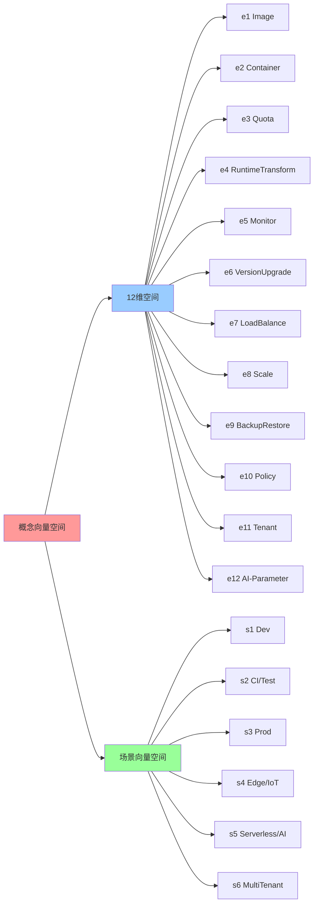
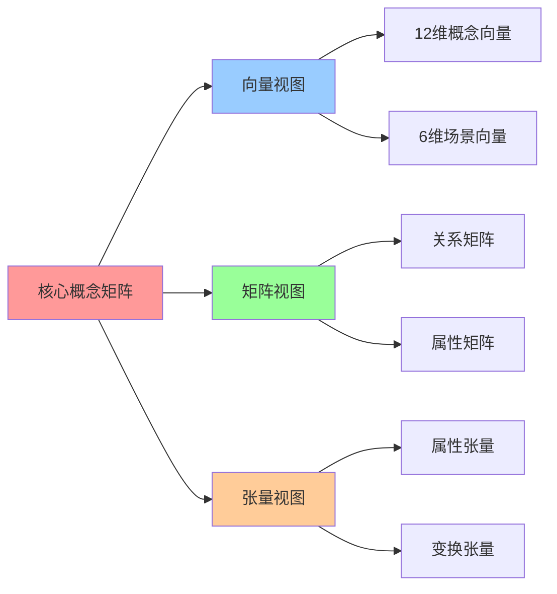

# 核心概念矩阵：原子概念向量

## 📑 目录

- [核心概念矩阵：原子概念向量](#核心概念矩阵原子概念向量)
  - [📑 目录](#-目录)
  - [1 12 维原子概念向量](#1-12-维原子概念向量)
    - [概念详解](#概念详解)
      - [e₁: Image（镜像）](#e-image镜像)
      - [e₂: Container（容器）](#e-container容器)
      - [e₃: Quota（配额）](#e-quota配额)
      - [e₄: RuntimeTransform（运行时切换）](#e-runtimetransform运行时切换)
      - [e₅: Monitor（观测）](#e-monitor观测)
      - [e₆: VersionUpgrade（版本变更）](#e-versionupgrade版本变更)
      - [e₇: LoadBalance（负载均衡）](#e-loadbalance负载均衡)
      - [e₈: Scale（扩缩容）](#e-scale扩缩容)
      - [e₉: BackupRestore（灾备）](#e-backuprestore灾备)
      - [e₁₀: Policy（策略）](#e-policy策略)
      - [e₁₁: Tenant（租户隔离）](#e-tenant租户隔离)
      - [e₁₂: AI-Parameter（AI 可学习参数）](#e-ai-parameterai-可学习参数)
  - [2 6 维场景向量](#2-6-维场景向量)
    - [场景详解](#场景详解)
      - [s₁: 本地开发（Dev）](#s-本地开发dev)
      - [s₂: CI/测试（CI/Test）](#s-ci测试citest)
      - [s₃: 在线生产（Prod）](#s-在线生产prod)
      - [s₄: 边缘/IoT（Edge/IoT）](#s-边缘iotedgeiot)
      - [s₅: Serverless/AI（Serverless/AI）](#s-serverlessaiserverlessai)
      - [s₆: 多租户平台（MultiTenant）](#s-多租户平台multitenant)
  - [3 时间维度](#3-时间维度)
    - [静态 vs 动态](#静态-vs-动态)
  - [4 概念属性定义](#4-概念属性定义)
  - [5 概念分类体系](#5-概念分类体系)
    - [1 层次维度](#1-层次维度)
    - [2 生命周期维度](#2-生命周期维度)
    - [3 场景维度](#3-场景维度)
  - [6 概念向量的数学表示](#6-概念向量的数学表示)
  - [7 🧠 认知增强：思维导图、建模视图与图表达转换](#7--认知增强思维导图建模视图与图表达转换)
    - [7.1 核心概念矩阵完整思维导图](#71-核心概念矩阵完整思维导图)
    - [7.2 核心概念矩阵建模视图](#72-核心概念矩阵建模视图)
      - [概念向量空间视图](#概念向量空间视图)
    - [7.3 核心概念矩阵多维关系矩阵](#73-核心概念矩阵多维关系矩阵)
      - [概念-场景-时间三维矩阵](#概念-场景-时间三维矩阵)
    - [7.4 图表达和转换](#74-图表达和转换)
      - [概念矩阵视图转换关系](#概念矩阵视图转换关系)
    - [7.5 形象化解释论证](#75-形象化解释论证)
      - [1. 概念向量 = 技术工具箱](#1-概念向量--技术工具箱)
      - [2. 矩阵运算 = 技术组合](#2-矩阵运算--技术组合)
      - [3. 场景向量 = 使用地图](#3-场景向量--使用地图)
    - [7.6 专家观点与论证](#76-专家观点与论证)
      - [计算信息软件科学家的观点](#计算信息软件科学家的观点)
        - [1. Gilbert Strang（线性代数专家）](#1-gilbert-strang线性代数专家)
        - [2. Gene Golub（数值计算专家）](#2-gene-golub数值计算专家)
      - [计算信息软件教育家的观点](#计算信息软件教育家的观点)
        - [1. Gilbert Strang（MIT教授）](#1-gilbert-strangmit教授)
        - [2. David Lay（线性代数教育家）](#2-david-lay线性代数教育家)
      - [计算信息软件认知学家的观点](#计算信息软件认知学家的观点)
        - [1. David Marr（计算认知科学家）](#1-david-marr计算认知科学家)
        - [2. Douglas Hofstadter（认知科学家）](#2-douglas-hofstadter认知科学家)
    - [7.7 认知学习路径矩阵](#77-认知学习路径矩阵)
    - [7.8 专家推荐阅读路径](#78-专家推荐阅读路径)
  - [2025 年最新实践](#2025-年最新实践)
    - [核心概念矩阵应用最佳实践（2025）](#核心概念矩阵应用最佳实践2025)
  - [实际应用案例](#实际应用案例)
    - [案例 1：技术概念向量化（2025）](#案例-1技术概念向量化2025)

---

## 1 12 维原子概念向量

**概念向量定义**：

$$\mathbf{E} = [e_1, e_2, e_3, \ldots, e_{12}]^T \in \mathbb{R}^{12 \times 1}$$

**12 维原子概念向量**：

| 编号 | 符号  | 概念                        | 2025 代表实例                    | 维度含义            |
| ---- | ----- | --------------------------- | -------------------------------- | ------------------- |
| e₁   | **I** | Image 镜像                  | `yourhub/app:v1.2.0@sha256:abc`  | 不可变构建产物      |
| e₂   | **C** | Container 容器运行时实例    | `containerd cri-container`       | 运行时隔离单元      |
| e₃   | **Q** | Quota 配额                  | `ResourceQuota/LimitRange`       | 资源限制边界        |
| e₄   | **R** | RuntimeTransform 运行时切换 | `runc ↔ crun ↔ wasm`             | 运行时适配层        |
| e₅   | **M** | Monitor 观测                | `Prometheus + OTEL`              | 可观测性基础设施    |
| e₆   | **V** | VersionUpgrade 版本变更     | `Git → Flux → RollingUpdate`     | 版本演进机制        |
| e₇   | **L** | LoadBalance 负载均衡        | `Cilium L4/L7 + Envoy Wasm`      | 流量分发与路由      |
| e₈   | **S** | Scale 扩缩容                | `HPA/VPA/CA/KEDA`                | 弹性伸缩机制        |
| e₉   | **B** | BackupRestore 灾备          | `Velero + VolumeSnapshot`        | 数据保护与恢复      |
| e₁₀  | **P** | Policy 策略                 | `OPA/Gatekeeper + OPA-Wasm`      | 策略即代码          |
| e₁₁  | **T** | Tenant 隔离                 | `Capsule/HNC/Cluster-API-Nested` | 多租户隔离机制      |
| e₁₂  | **Θ** | AI-Parameter 可学习参数     | `KEDA-AI/Fluid-AI/Volcano-AI`    | AI 参与的自适应参数 |

**概念向量的数学表示**：

$$
\mathbf{E} = \begin{bmatrix}
e_1 \text{ (Image)} \\
e_2 \text{ (Container)} \\
e_3 \text{ (Quota)} \\
e_4 \text{ (RuntimeTransform)} \\
e_5 \text{ (Monitor)} \\
e_6 \text{ (VersionUpgrade)} \\
e_7 \text{ (LoadBalance)} \\
e_8 \text{ (Scale)} \\
e_9 \text{ (BackupRestore)} \\
e_{10} \text{ (Policy)} \\
e_{11} \text{ (Tenant)} \\
e_{12} \text{ (AI-Parameter)}
\end{bmatrix}
$$

### 概念详解

#### e₁: Image（镜像）

- **定义**：不可变的构建产物，包含应用代码、依赖和运行环境
- **2025 实例**：`yourhub/app:v1.2.0@sha256:abc`
- **特性**：内容寻址、分层存储、OCI 标准
- **相关技术**：Docker Image、OCI Artifact、BuildKit

#### e₂: Container（容器）

- **定义**：运行时的隔离单元，基于镜像创建的可执行实例
- **2025 实例**：`containerd cri-container`
- **特性**：Namespace、Cgroups、运行时隔离
- **相关技术**：runc、crun、containerd

#### e₃: Quota（配额）

- **定义**：资源限制边界，包括 CPU、内存、存储等
- **2025 实例**：`ResourceQuota/LimitRange`
- **特性**：硬限制、软限制、优先级
- **相关技术**：Kubernetes ResourceQuota、Capsule Quota

#### e₄: RuntimeTransform（运行时切换）

- **定义**：运行时适配层，支持不同运行时的切换
- **2025 实例**：`runc ↔ crun ↔ wasm`
- **特性**：RuntimeClass、多运行时共存、零改造 YAML
- **相关技术**：containerd-shim-runwasi、crun、WasmEdge

#### e₅: Monitor（观测）

- **定义**：可观测性基础设施，包括指标、日志、追踪
- **2025 实例**：`Prometheus + OTEL`
- **特性**：指标采集、分布式追踪、链路追踪
- **相关技术**：Prometheus、OpenTelemetry、Grafana

#### e₆: VersionUpgrade（版本变更）

- **定义**：版本演进机制，从代码提交到生产部署
- **2025 实例**：`Git → Flux → RollingUpdate`
- **特性**：GitOps、自动同步、渐进式发布
- **相关技术**：Flux、ArgoCD、GitOps

#### e₇: LoadBalance（负载均衡）

- **定义**：流量分发与路由，支持 L4/L7 负载均衡
- **2025 实例**：`Cilium L4/L7 + Envoy Wasm + Service Mesh`
- **特性**：流量分发、路由规则、Wasm 插件、服务网格
- **相关技术**：Cilium、Envoy、Istio、Linkerd、Service Mesh
- **Service Mesh 关联**：
  - **流量治理**：Service Mesh 提供统一的流量管理（负载均衡、路由、灰度发布）
  - **零信任安全**：Service Mesh 提供自动 mTLS 和服务间认证
  - **可观测性**：Service Mesh 自动生成 Trace/Metric，无需应用埋点
  - **多语言支持**：Service Mesh 与语言无关，统一治理多语言服务

#### e₈: Scale（扩缩容）

- **定义**：弹性伸缩机制，根据负载自动调整资源
- **2025 实例**：`HPA/VPA/CA/KEDA`
- **特性**：水平扩容、垂直扩容、基于事件的扩容
- **相关技术**：HPA、VPA、KEDA、Cluster Autoscaler

#### e₉: BackupRestore（灾备）

- **定义**：数据保护与恢复，包括备份和还原
- **2025 实例**：`Velero + VolumeSnapshot`
- **特性**：全量备份、增量备份、跨区域恢复
- **相关技术**：Velero、VolumeSnapshot、Restic

#### e₁₀: Policy（策略）

- **定义**：策略即代码，包括准入控制和策略执行
- **2025 实例**：`OPA/Gatekeeper + OPA-Wasm`
- **特性**：Rego 语言、Wasm 执行、策略热更新
- **相关技术**：OPA、Gatekeeper、OPA-Wasm

#### e₁₁: Tenant（租户隔离）

- **定义**：多租户隔离机制，支持租户级资源隔离
- **2025 实例**：`Capsule/HNC/Cluster-API-Nested`
- **特性**：命名空间隔离、资源配额、策略隔离
- **相关技术**：Capsule、HNC、Multi-tenancy

#### e₁₂: AI-Parameter（AI 可学习参数）

- **定义**：AI 参与的自适应参数，通过机器学习优化
- **2025 实例**：`KEDA-AI/Fluid-AI/Volcano-AI`
- **特性**：可微参数、梯度下降、在线学习
- **相关技术**：KEDA AI、Fluid AI、Volcano AI

## 2 6 维场景向量

**场景向量定义**：

$$\mathbf{S} = [s_1, s_2, s_3, s_4, s_5, s_6] \in \mathbb{R}^{1 \times 6}$$

**6 维场景向量**：

| 编号 | 符号              | 场景          | 典型特征                     | 代表技术栈                       |
| ---- | ----------------- | ------------- | ---------------------------- | -------------------------------- |
| s₁   | **Dev**           | 本地开发      | 单机、快速迭代、调试友好     | Docker Desktop、DevPod           |
| s₂   | **CI/Test**       | CI/测试       | 自动化、可重复、快速反馈     | Kind、K3d、GitHub Actions        |
| s₃   | **Prod**          | 在线生产      | 高可用、大规模、稳定性优先   | Kubernetes、Rook-Ceph            |
| s₄   | **Edge/IoT**      | 边缘/IoT      | 资源受限、网络不稳定、离线   | K3s、KubeEdge、Longhorn          |
| s₅   | **Serverless/AI** | Serverless/AI | 快速启动、按需扩展、事件驱动 | WasmEdge、KEDA、OpenFaaS         |
| s₆   | **MultiTenant**   | 多租户平台    | 资源隔离、策略隔离、租户管理 | Capsule、HNC、Cluster-API-Nested |

**场景向量的数学表示**：

$$
\mathbf{S} = \begin{bmatrix}
\text{本地开发} & \text{CI/测试} & \text{在线生产} & \text{边缘/IoT} & \text{Serverless/AI} & \text{多租户平台}
\end{bmatrix}
$$

### 场景详解

#### s₁: 本地开发（Dev）

- **特征**：单机环境、快速迭代、开发调试
- **技术要求**：轻量级、快速启动、易于调试
- **典型技术**：Docker Desktop、Docker Compose、DevPod

#### s₂: CI/测试（CI/Test）

- **特征**：自动化、可重复、快速反馈
- **技术要求**：临时集群、快速创建销毁、成本可控
- **典型技术**：Kind、K3d、Kwok

#### s₃: 在线生产（Prod）

- **特征**：高可用、大规模、稳定性优先
- **技术要求**：企业级、可扩展、高可靠性
- **典型技术**：Kubernetes、Rook-Ceph、ArgoCD

#### s₄: 边缘/IoT（Edge/IoT）

- **特征**：资源受限、网络不稳定、离线能力
- **技术要求**：轻量级、低资源消耗、离线运行
- **典型技术**：K3s、KubeEdge、Longhorn、WasmEdge

#### s₅: Serverless/AI（Serverless/AI）

- **特征**：快速启动、按需扩展、事件驱动
- **技术要求**：毫秒级启动、弹性伸缩、GPU 支持
- **典型技术**：WasmEdge、KEDA、OpenFaaS、Knative

#### s₆: 多租户平台（MultiTenant）

- **特征**：资源隔离、策略隔离、租户管理
- **技术要求**：租户级配额、策略隔离、租户级观测
- **典型技术**：Capsule、HNC、Cluster-API-Nested

## 3 时间维度

**时间维度定义**：

$$\mathbf{T} = [t_1, t_2]^T = [\text{静态 (Static)}, \text{动态 (Dynamic)}]^T \in \mathbb{R}^{2 \times 1}$$

**时间维度**：

| 编号 | 符号        | 维度 | 说明                       | 典型场景                     |
| ---- | ----------- | ---- | -------------------------- | ---------------------------- |
| t₁   | **Static**  | 静态 | 配置式、声明式、一次性设置 | 镜像构建、资源配置、策略定义 |
| t₂   | **Dynamic** | 动态 | 运行时、自适应、持续调整   | 扩缩容、负载均衡、自动恢复   |

### 静态 vs 动态

- **静态**：配置即代码，声明式定义，一次性设置后持续有效
- **动态**：运行时自适应，根据实际负载和状态持续调整

## 4 概念属性定义

**概念的核心属性**：

每个概念 $e_i$ 具有以下属性：

1. **功能属性**：概念的核心功能定义
2. **成熟度属性**：概念的技术成熟度（0-1）
3. **性能属性**：概念的性能指标（延迟、吞吐量等）
4. **成本属性**：概念的资源成本（内存、CPU、存储等）
5. **依赖属性**：概念对其他概念的依赖关系
6. **兼容性属性**：概念与技术栈的兼容性

**概念属性的矩阵表示**：

$$
\mathbf{P}_i = \begin{bmatrix}
\text{功能属性} \\
\text{成熟度属性} \\
\text{性能属性} \\
\text{成本属性} \\
\text{依赖属性} \\
\text{兼容性属性}
\end{bmatrix}
$$

## 5 概念分类体系

**概念的分类维度**：

### 1 层次维度

- **基础设施层**：Image, Container
- **编排层**：Quota, RuntimeTransform, Scale
- **治理层**：Policy, Tenant
- **可观测层**：Monitor, BackupRestore
- **流量层**：LoadBalance
- **演进层**：VersionUpgrade
- **AI 层**：AI-Parameter

### 2 生命周期维度

- **构建阶段**：Image
- **运行时阶段**：Container, RuntimeTransform
- **管理阶段**：Quota, Scale, Policy, Tenant
- **监控阶段**：Monitor
- **演进阶段**：VersionUpgrade, BackupRestore
- **优化阶段**：LoadBalance, AI-Parameter

### 3 场景维度

- **通用场景**：Image, Container, Monitor
- **企业场景**：Quota, Policy, Tenant
- **边缘场景**：RuntimeTransform, Scale
- **Serverless 场景**：Scale, AI-Parameter
- **AI 场景**：RuntimeTransform, AI-Parameter

## 6 概念向量的数学表示

**完整的概念向量空间**：

$$\text{概念空间} = \mathbb{R}^{12} = \text{span}\{e_1, e_2, \ldots, e_{12}\}$$

**概念向量的线性组合**：

$$\mathbf{v} = \sum_{i=1}^{12} \alpha_i e_i, \quad \alpha_i \in \mathbb{R}$$

其中 $\alpha_i$ 表示概念 $e_i$ 在向量 $\mathbf{v}$ 中的权重。

**概念向量的内积**：

$$\langle \mathbf{v}_1, \mathbf{v}_2 \rangle = \sum_{i=1}^{12} v_{1i} v_{2i}$$

用于计算两个概念向量的相似度。

**概念向量的范数**：

$$\|\mathbf{v}\| = \sqrt{\sum_{i=1}^{12} v_i^2}$$

表示概念向量的"强度"或"重要性"。

---

## 7 🧠 认知增强：思维导图、建模视图与图表达转换

### 7.1 核心概念矩阵完整思维导图

```mermaid
graph TB
    A[核心概念矩阵] --> B[12维原子概念向量]
    A --> C[6维场景向量]
    A --> D[时间维度]
    A --> E[概念分类]

    B --> B1[I镜像]
    B --> B2[C容器]
    B --> B3[Q配额]
    B --> B4[R运行时切换]
    B --> B5[M观测]
    B --> B6[V版本变更]
    B --> B7[L负载均衡]
    B --> B8[S扩缩容]
    B --> B9[B灾备]
    B --> B10[P策略]
    B --> B11[T租户隔离]
    B --> B12[AI参数]

    C --> C1[Dev本地开发]
    C --> C2[CI/Test测试]
    C --> C3[Prod生产]
    C --> C4[Edge/IoT边缘]
    C --> C5[Serverless/AI]
    C --> C6[MultiTenant多租户]

    D --> D1[静态Static]
    D --> D2[动态Dynamic]

    E --> E1[层次维度]
    E --> E2[生命周期维度]
    E --> E3[场景维度]

    style A fill:#ff9999
    style B fill:#99ccff
    style C fill:#99ff99
    style D fill:#ffcc99
    style E fill:#cc99ff
```



### 7.2 核心概念矩阵建模视图

#### 概念向量空间视图



### 7.3 核心概念矩阵多维关系矩阵

#### 概念-场景-时间三维矩阵

| 概念 | Dev | CI/Test | Prod | Edge/IoT | Serverless/AI | MultiTenant | 静态 | 动态 | 认知价值 |
|-----|-----|---------|------|----------|---------------|-------------|------|------|---------|
| **I镜像** | ✅ 核心 | ✅ 核心 | ✅ 核心 | ✅ 核心 | ✅ 核心 | ✅ 核心 | ✅ | ❌ | 构建理解 |
| **C容器** | ✅ 核心 | ✅ 核心 | ✅ 核心 | ✅ 核心 | ✅ 核心 | ✅ 核心 | ❌ | ✅ | 运行时理解 |
| **Q配额** | ⚠️ 部分 | ⚠️ 部分 | ✅ 核心 | ⚠️ 部分 | ⚠️ 部分 | ✅ 核心 | ❌ | ✅ | 资源理解 |
| **R运行时切换** | ✅ 核心 | ✅ 核心 | ⚠️ 部分 | ✅ 核心 | ✅ 核心 | ⚠️ 部分 | ❌ | ✅ | 切换理解 |
| **M观测** | ⚠️ 部分 | ✅ 核心 | ✅ 核心 | ⚠️ 部分 | ✅ 核心 | ✅ 核心 | ❌ | ✅ | 观测理解 |
| **V版本变更** | ✅ 核心 | ✅ 核心 | ✅ 核心 | ⚠️ 部分 | ⚠️ 部分 | ✅ 核心 | ❌ | ✅ | 版本理解 |
| **L负载均衡** | ❌ 无 | ❌ 无 | ✅ 核心 | ⚠️ 部分 | ✅ 核心 | ✅ 核心 | ❌ | ✅ | 负载理解 |
| **S扩缩容** | ❌ 无 | ❌ 无 | ✅ 核心 | ⚠️ 部分 | ✅ 核心 | ✅ 核心 | ❌ | ✅ | 扩缩理解 |
| **B灾备** | ❌ 无 | ❌ 无 | ✅ 核心 | ⚠️ 部分 | ⚠️ 部分 | ✅ 核心 | ❌ | ✅ | 灾备理解 |
| **P策略** | ⚠️ 部分 | ⚠️ 部分 | ✅ 核心 | ⚠️ 部分 | ⚠️ 部分 | ✅ 核心 | ❌ | ✅ | 策略理解 |
| **T租户隔离** | ❌ 无 | ❌ 无 | ⚠️ 部分 | ❌ 无 | ❌ 无 | ✅ 核心 | ❌ | ✅ | 隔离理解 |
| **AI参数** | ⚠️ 部分 | ⚠️ 部分 | ⚠️ 部分 | ⚠️ 部分 | ✅ 核心 | ⚠️ 部分 | ❌ | ✅ | AI理解 |

### 7.4 图表达和转换

#### 概念矩阵视图转换关系



### 7.5 形象化解释论证

#### 1. 概念向量 = 技术工具箱

> **类比**：概念向量就像技术工具箱，12维原子概念是"工具"（Image、Container、Quota等），6维场景向量是"使用场景"（Dev、Prod、Edge等），时间维度是"工具状态"（静态、动态），就像技术工具箱通过工具、场景、状态组织技术能力一样，概念向量通过概念、场景、时间组织技术概念。

**认知价值**：

- **工具理解**：通过技术工具箱类比，理解概念向量的工具性
- **场景理解**：通过使用场景类比，理解场景向量的场景性
- **状态理解**：通过工具状态类比，理解时间维度的状态性

#### 2. 矩阵运算 = 技术组合

> **类比**：矩阵运算就像技术组合，概念向量是"技术组件"（Image、Container等），关系矩阵是"组合规则"（依赖、转换、组合），矩阵乘法是"组合操作"（技术栈构建），就像技术组合通过组件、规则、操作构建技术栈一样，矩阵运算通过向量、矩阵、运算构建技术系统。

**认知价值**：

- **组合理解**：通过技术组合类比，理解矩阵运算的组合性
- **规则理解**：通过组合规则类比，理解关系矩阵的规则性
- **操作理解**：通过组合操作类比，理解矩阵运算的操作性

#### 3. 场景向量 = 使用地图

> **类比**：场景向量就像使用地图，6个场景是"地图区域"（Dev、CI/Test、Prod等），场景向量是"区域特征"（每个场景的技术需求），矩阵运算是"导航"（场景适配），就像使用地图通过区域、特征、导航指导使用一样，场景向量通过场景、特征、运算指导技术选型。

**认知价值**：

- **地图理解**：通过使用地图类比，理解场景向量的地图性
- **特征理解**：通过区域特征类比，理解场景向量的特征性
- **导航理解**：通过导航类比，理解矩阵运算的导航性

### 7.6 专家观点与论证

#### 计算信息软件科学家的观点

##### 1. Gilbert Strang（线性代数专家）

> "Matrices provide a powerful language for expressing linear transformations. In computer science, they offer a natural way to model complex systems."

**在矩阵视角中的应用**：

- **语言工具**：矩阵提供了表达线性变换的强大语言
- **系统建模**：矩阵为复杂系统提供了自然的建模方式
- **技术应用**：矩阵视角在计算机科学中有直接应用

##### 2. Gene Golub（数值计算专家）

> "Matrix operations are fundamental to computational science. Understanding matrices helps us understand how computations work."

**在矩阵视角中的应用**：

- **计算基础**：矩阵运算是计算科学的基础
- **计算理解**：理解矩阵有助于理解计算过程
- **技术理解**：矩阵视角帮助理解技术计算

#### 计算信息软件教育家的观点

##### 1. Gilbert Strang（MIT教授）

> "Teaching linear algebra through matrices helps students understand that mathematics is not just abstract—it's a practical tool for solving real problems."

**教育价值**：

- **实用工具**：矩阵是解决实际问题的实用工具
- **抽象理解**：通过矩阵理解数学的抽象性
- **问题解决**：矩阵帮助学生解决实际问题

##### 2. David Lay（线性代数教育家）

> "Matrix perspective provides a visual and intuitive way to understand linear transformations. This helps students build mental models."

**教育价值**：

- **直观理解**：矩阵视角提供直观的理解方式
- **视觉理解**：通过矩阵理解线性变换
- **模型构建**：矩阵帮助学生构建心理模型

#### 计算信息软件认知学家的观点

##### 1. David Marr（计算认知科学家）

> "Understanding systems through matrices requires understanding them at multiple levels: vector space, matrix operations, and transformations."

**认知价值**：

- **多层次理解**：通过矩阵理解系统需要多层次理解
- **空间理解**：理解向量空间的结构
- **变换理解**：理解矩阵变换的作用

##### 2. Douglas Hofstadter（认知科学家）

> "Matrices are cognitive tools that help us organize and understand complex information. They provide a structured way to think about systems."

**认知价值**：

- **认知工具**：矩阵是组织信息的认知工具
- **结构理解**：矩阵提供结构化的思维方式
- **系统理解**：通过矩阵理解系统结构

### 7.7 认知学习路径矩阵

| 学习阶段 | 核心内容 | 形象化理解 | 数学理解 | 实践应用 | 认知目标 |
|---------|---------|-----------|---------|---------|---------|
| **入门** | 概念向量 | 技术工具箱类比 | 向量空间 | 概念识别 | 建立基础 |
| **进阶** | 场景向量 | 使用地图类比 | 场景空间 | 场景适配 | 理解场景 |
| **高级** | 矩阵运算 | 技术组合类比 | 矩阵运算 | 技术栈构建 | 掌握运算 |
| **专家** | 张量运算 | 多维系统类比 | 张量运算 | 复杂系统设计 | 掌握张量 |

### 7.8 专家推荐阅读路径

**计算信息软件科学家推荐路径**：

1. **向量基础**：理解12维概念向量和6维场景向量的定义
2. **矩阵运算**：掌握关系矩阵和属性矩阵的运算
3. **张量运算**：理解属性张量和变换张量的运算
4. **应用实践**：在实际项目中应用矩阵视角

**计算信息软件教育家推荐路径**：

1. **形象化理解**：通过技术工具箱、使用地图、技术组合等类比，建立直观理解
2. **渐进学习**：从简单向量开始，逐步学习复杂矩阵
3. **实践结合**：结合实际项目，理解矩阵视角的应用
4. **思维训练**：通过矩阵视角学习，训练系统性思维能力

**计算信息软件认知学家推荐路径**：

1. **认知模式**：识别矩阵视角中的认知模式
2. **结构理解**：理解矩阵揭示的系统结构
3. **跨域应用**：将矩阵思维应用到其他领域
4. **认知提升**：通过矩阵视角学习，提升认知能力

---

---

## 2025 年最新实践

### 核心概念矩阵应用最佳实践（2025）

**2025 年趋势**：核心概念矩阵在技术选型和系统设计中的深度应用

**实践要点**：

- **概念向量化**：使用 12 维原子概念向量表示技术概念
- **场景映射**：使用 6 维场景向量映射应用场景
- **矩阵运算**：使用矩阵运算进行技术组合和转换

**代码示例**：

```python
# 2025 年核心概念矩阵工具
class CoreConceptMatrixTool:
    def __init__(self):
        self.concept_vectors = ConceptVectors()
        self.scene_vectors = SceneVectors()
        self.matrix_ops = MatrixOperations()

    def represent_concept(self, concept):
        """概念向量化"""
        return self.concept_vectors.get_vector(concept)

    def map_scene(self, scene):
        """场景映射"""
        return self.scene_vectors.get_vector(scene)

    def combine_concepts(self, concepts):
        """概念组合"""
        vectors = [self.represent_concept(c) for c in concepts]
        return self.matrix_ops.combine(vectors)
```

## 实际应用案例

### 案例 1：技术概念向量化（2025）

**场景**：使用核心概念矩阵进行技术选型

**实现方案**：

```python
# 技术概念向量化
tool = CoreConceptMatrixTool()

# 表示容器概念
container_vector = tool.represent_concept('Container')
print(f"容器向量: {container_vector}")

# 映射生产场景
prod_scene = tool.map_scene('Prod')
print(f"生产场景: {prod_scene}")

# 组合概念
combined = tool.combine_concepts(['Container', 'Scale', 'Monitor'])
print(f"组合向量: {combined}")
```

**效果**：

- 概念向量化：使用 12 维原子概念向量表示技术概念
- 场景映射：使用 6 维场景向量映射应用场景
- 矩阵运算：使用矩阵运算进行技术组合和转换

---

**参考**：

- [核心概念矩阵 - 返回目录](../README.md)
- [关系矩阵：概念间的关系映射](02-relation-matrix.md)
- [属性矩阵：概念属性在不同场景下的表现](03-attribute-matrix.md)
