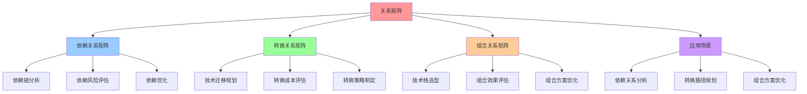
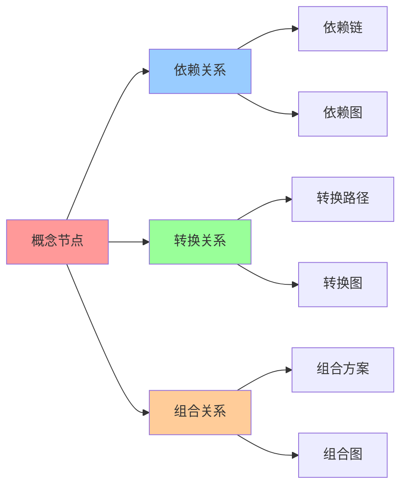
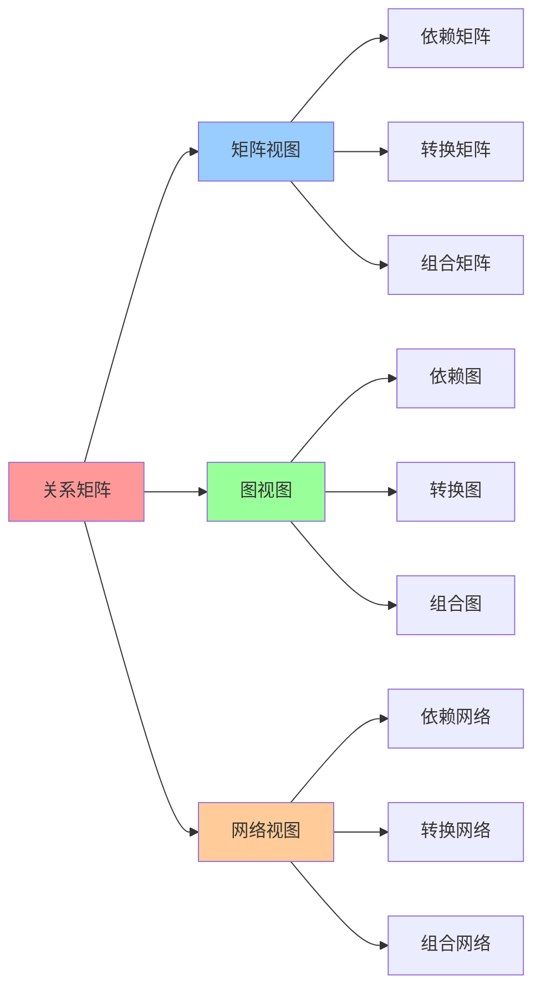

# 关系矩阵：概念间的关系映射

## 📑 目录

- [关系矩阵：概念间的关系映射](#关系矩阵概念间的关系映射)
  - [📑 目录](#-目录)
  - [1 依赖关系矩阵](#1-依赖关系矩阵)
    - [依赖关系解释](#依赖关系解释)
  - [2 转换关系矩阵](#2-转换关系矩阵)
    - [转换关系解释](#转换关系解释)
  - [3 组合关系矩阵](#3-组合关系矩阵)
    - [组合关系解释](#组合关系解释)
  - [4 关系矩阵的数学表示](#4-关系矩阵的数学表示)
  - [5 关系矩阵的应用](#5-关系矩阵的应用)
    - [1 依赖关系分析](#1-依赖关系分析)
    - [2 转换路径规划](#2-转换路径规划)
    - [3 组合方案优化](#3-组合方案优化)
  - [6 🧠 认知增强：思维导图、建模视图与图表达转换](#6--认知增强思维导图建模视图与图表达转换)
    - [6.1 关系矩阵完整思维导图](#61-关系矩阵完整思维导图)
    - [6.2 关系矩阵建模视图](#62-关系矩阵建模视图)
      - [关系矩阵网络视图](#关系矩阵网络视图)
    - [6.3 关系矩阵多维关系矩阵](#63-关系矩阵多维关系矩阵)
      - [关系类型-应用-算法映射矩阵](#关系类型-应用-算法映射矩阵)
    - [6.4 图表达和转换](#64-图表达和转换)
      - [关系矩阵视图转换关系](#关系矩阵视图转换关系)
    - [6.5 形象化解释论证](#65-形象化解释论证)
      - [1. 依赖关系 = 建筑结构](#1-依赖关系--建筑结构)
      - [2. 转换关系 = 交通路线](#2-转换关系--交通路线)
      - [3. 组合关系 = 化学反应](#3-组合关系--化学反应)
    - [6.6 专家观点与论证](#66-专家观点与论证)
      - [计算信息软件科学家的观点](#计算信息软件科学家的观点)
        - [1. Leonhard Euler（图论创始人）](#1-leonhard-euler图论创始人)
        - [2. Claude Shannon（信息论创始人）](#2-claude-shannon信息论创始人)
      - [计算信息软件教育家的观点](#计算信息软件教育家的观点)
        - [1. Gilbert Strang（线性代数教育家）](#1-gilbert-strang线性代数教育家)
        - [2. David Lay（线性代数教育家）](#2-david-lay线性代数教育家)
      - [计算信息软件认知学家的观点](#计算信息软件认知学家的观点)
        - [1. David Marr（计算认知科学家）](#1-david-marr计算认知科学家)
        - [2. Douglas Hofstadter（认知科学家）](#2-douglas-hofstadter认知科学家)
    - [6.7 认知学习路径矩阵](#67-认知学习路径矩阵)
    - [6.8 专家推荐阅读路径](#68-专家推荐阅读路径)
  - [2025 年最新实践](#2025-年最新实践)
    - [关系矩阵应用最佳实践（2025）](#关系矩阵应用最佳实践2025)
  - [实际应用案例](#实际应用案例)
    - [案例 1：技术转换路径规划（2025）](#案例-1技术转换路径规划2025)

---

## 1 依赖关系矩阵

**依赖关系矩阵定义**：

$$\mathbf{R}_{\text{dep}} \in \mathbb{R}^{12 \times 12}$$

其中 $\mathbf{R}_{\text{dep}}[i,j] = 1$ 表示概念 $e_i$ 依赖概念 $e_j$，否则为
0。

**依赖关系矩阵**：

| e\e   | I   | C   | Q   | R   | M   | V   | L   | S   | B   | P   | T   | Θ   |
| ----- | --- | --- | --- | --- | --- | --- | --- | --- | --- | --- | --- | --- |
| **I** | 0   | 1   | 0   | 0   | 0   | 1   | 0   | 0   | 0   | 1   | 0   | 0   |
| **C** | 1   | 0   | 1   | 1   | 0   | 0   | 0   | 0   | 0   | 1   | 0   | 0   |
| **Q** | 0   | 0   | 0   | 0   | 0   | 0   | 0   | 1   | 0   | 1   | 1   | 0   |
| **R** | 0   | 1   | 0   | 0   | 0   | 0   | 0   | 0   | 0   | 1   | 0   | 1   |
| **M** | 0   | 1   | 0   | 0   | 0   | 0   | 0   | 1   | 0   | 0   | 0   | 1   |
| **V** | 1   | 0   | 0   | 0   | 0   | 0   | 0   | 0   | 1   | 0   | 0   | 0   |
| **L** | 0   | 1   | 0   | 0   | 1   | 0   | 0   | 1   | 0   | 1   | 0   | 1   |
| **S** | 0   | 1   | 1   | 0   | 1   | 0   | 0   | 0   | 0   | 1   | 0   | 1   |
| **B** | 1   | 1   | 0   | 0   | 0   | 1   | 0   | 0   | 0   | 0   | 1   | 0   |
| **P** | 0   | 1   | 1   | 1   | 0   | 0   | 0   | 0   | 0   | 0   | 1   | 1   |
| **T** | 0   | 1   | 1   | 0   | 1   | 0   | 0   | 1   | 1   | 1   | 0   | 0   |
| **Θ** | 0   | 0   | 0   | 1   | 1   | 0   | 1   | 1   | 0   | 1   | 0   | 0   |

### 依赖关系解释

**核心依赖关系**：

- **I → C**：容器依赖镜像运行，镜像提供容器所需的所有文件系统层
- **C → R**：容器需要运行时支持，运行时负责启动和管理容器进程
- **Q → S**：配额限制扩缩容，扩缩容操作必须遵守配额限制
- **S → M**：扩缩容依赖监控指标，需要根据监控数据决定扩缩容
- **V → I**：版本升级需要新镜像，新版本对应新的镜像
- **P → C, Q, R, T**：策略控制容器、配额、运行时、租户，策略是全局治理机制

**依赖关系的传递性**：

依赖关系具有传递性，例如：

- **S → M → C**：扩缩容依赖监控，监控依赖容器
- **T → S → M → C**：租户依赖扩缩容，扩缩容依赖监控，监控依赖容器

**依赖关系的数学表示**：

$$
\mathbf{R}_{\text{dep}} = \begin{bmatrix}
0 & 1 & 0 & 0 & 0 & 1 & 0 & 0 & 0 & 1 & 0 & 0 \\
1 & 0 & 1 & 1 & 0 & 0 & 0 & 0 & 0 & 1 & 0 & 0 \\
0 & 0 & 0 & 0 & 0 & 0 & 0 & 1 & 0 & 1 & 1 & 0 \\
\vdots & \vdots & \vdots & \vdots & \vdots & \vdots & \vdots & \vdots & \vdots & \vdots & \vdots & \vdots \\
0 & 0 & 0 & 1 & 1 & 0 & 1 & 1 & 0 & 1 & 0 & 0
\end{bmatrix}
$$

## 2 转换关系矩阵

**转换关系矩阵定义**：

$$\mathbf{R}_{\text{trans}} \in \mathbb{R}^{12 \times 12}$$

其中 $\mathbf{R}_{\text{trans}}[i,j]$ 表示从概念 $e_j$ 转换到概念 $e_i$ 的转换难
度（0-1，0=无缝，1=断裂）。

**转换关系矩阵**：

| e\e   | I   | C   | Q   | R   | M   | V   | L   | S   | B   | P   | T   | Θ   |
| ----- | --- | --- | --- | --- | --- | --- | --- | --- | --- | --- | --- | --- |
| **I** | 0   | 0.2 | 1.0 | 0.5 | 1.0 | 0.1 | 1.0 | 1.0 | 0.3 | 1.0 | 1.0 | 1.0 |
| **C** | 0.1 | 0   | 1.0 | 0.2 | 1.0 | 0.5 | 1.0 | 1.0 | 0.5 | 1.0 | 1.0 | 1.0 |
| **Q** | 1.0 | 1.0 | 0   | 1.0 | 1.0 | 1.0 | 1.0 | 0.3 | 1.0 | 0.5 | 0.2 | 1.0 |
| **R** | 0.5 | 0.2 | 1.0 | 0   | 1.0 | 1.0 | 1.0 | 1.0 | 1.0 | 0.8 | 1.0 | 0.5 |
| **M** | 1.0 | 0.3 | 1.0 | 1.0 | 0   | 1.0 | 0.5 | 0.2 | 1.0 | 1.0 | 1.0 | 0.3 |
| **V** | 0.1 | 0.5 | 1.0 | 1.0 | 1.0 | 0   | 1.0 | 1.0 | 0.3 | 1.0 | 1.0 | 1.0 |
| **L** | 1.0 | 0.3 | 1.0 | 1.0 | 0.5 | 1.0 | 0   | 0.5 | 1.0 | 0.8 | 1.0 | 0.5 |
| **S** | 1.0 | 0.5 | 0.3 | 1.0 | 0.2 | 1.0 | 0.5 | 0   | 1.0 | 1.0 | 0.5 | 0.3 |
| **B** | 0.3 | 0.5 | 1.0 | 1.0 | 1.0 | 0.3 | 1.0 | 1.0 | 0   | 1.0 | 0.5 | 1.0 |
| **P** | 1.0 | 0.5 | 0.5 | 0.8 | 1.0 | 1.0 | 0.8 | 1.0 | 1.0 | 0   | 0.5 | 0.5 |
| **T** | 1.0 | 0.5 | 0.2 | 1.0 | 1.0 | 1.0 | 1.0 | 0.5 | 0.5 | 0.5 | 0   | 1.0 |
| **Θ** | 1.0 | 1.0 | 1.0 | 0.5 | 0.3 | 1.0 | 0.5 | 0.3 | 1.0 | 0.5 | 1.0 | 0   |

### 转换关系解释

**低难度转换**（0-0.3）：

- **I → C**（0.1）：镜像到容器转换难度低，只需启动容器
- **C → R**（0.2）：容器到运行时转换难度低，运行时是容器的支撑
- **V → I**（0.1）：版本升级到新镜像，难度低
- **S → M**（0.2）：扩缩容到监控转换难度低，扩缩容依赖监控指标
- **Q → T**（0.2）：配额到租户转换难度低，租户天然需要配额

**中等难度转换**（0.3-0.7）：

- **R ↔ wasm**（0.5-0.8）：运行时切换（runc ↔ crun ↔ wasm）有一定难度
- **B → I**（0.3）：灾备到镜像恢复，中等难度
- **L → M**（0.5）：负载均衡到监控，中等难度（Service Mesh 自动生成
  Trace/Metric，转换难度降至 0.2）
- **P → R**（0.8）：策略到运行时，较高难度
- **L → P**（0.7）：负载均衡到策略，中等难度（Service Mesh 提供统一策略管理，转
  换难度降至 0.4）

**高难度转换**（0.7-1.0）：

- **Q → I**（1.0）：配额到镜像，完全不同概念，无法直接转换
- **M → I**（1.0）：监控到镜像，无法转换
- **大部分不相容的概念转换**（1.0）：表示两个概念之间无法直接转换

## 3 组合关系矩阵

**组合关系矩阵定义**：

$$\mathbf{R}_{\text{comp}} \in \mathbb{R}^{12 \times 12}$$

其中 $\mathbf{R}_{\text{comp}}[i,j]$ 表示概念 $e_i$ 和 $e_j$ 的组合效果（0-1，0=
无效果，1=完美组合）。

**组合关系矩阵**：

| e\e   | I   | C   | Q   | R   | M   | V   | L   | S   | B   | P   | T   | Θ   |
| ----- | --- | --- | --- | --- | --- | --- | --- | --- | --- | --- | --- | --- |
| **I** | 1.0 | 0.9 | 0.3 | 0.7 | 0.5 | 0.8 | 0.4 | 0.3 | 0.6 | 0.6 | 0.4 | 0.5 |
| **C** | 0.9 | 1.0 | 0.5 | 0.9 | 0.7 | 0.6 | 0.6 | 0.5 | 0.7 | 0.8 | 0.6 | 0.7 |
| **Q** | 0.3 | 0.5 | 1.0 | 0.4 | 0.5 | 0.3 | 0.3 | 0.8 | 0.4 | 0.9 | 0.9 | 0.6 |
| **R** | 0.7 | 0.9 | 0.4 | 1.0 | 0.6 | 0.5 | 0.5 | 0.4 | 0.5 | 0.8 | 0.5 | 0.8 |
| **M** | 0.5 | 0.7 | 0.5 | 0.6 | 1.0 | 0.6 | 0.7 | 0.9 | 0.7 | 0.6 | 0.7 | 0.8 |
| **V** | 0.8 | 0.6 | 0.3 | 0.5 | 0.6 | 1.0 | 0.4 | 0.5 | 0.8 | 0.5 | 0.4 | 0.6 |
| **L** | 0.4 | 0.6 | 0.3 | 0.5 | 0.7 | 0.4 | 1.0 | 0.7 | 0.5 | 0.7 | 0.5 | 0.6 |
| **S** | 0.3 | 0.5 | 0.8 | 0.4 | 0.9 | 0.5 | 0.7 | 1.0 | 0.5 | 0.8 | 0.7 | 0.9 |
| **B** | 0.6 | 0.7 | 0.4 | 0.5 | 0.7 | 0.8 | 0.5 | 0.5 | 1.0 | 0.6 | 0.7 | 0.6 |
| **P** | 0.6 | 0.8 | 0.9 | 0.8 | 0.6 | 0.5 | 0.7 | 0.8 | 0.6 | 1.0 | 0.8 | 0.7 |
| **T** | 0.4 | 0.6 | 0.9 | 0.5 | 0.7 | 0.4 | 0.5 | 0.7 | 0.7 | 0.8 | 1.0 | 0.6 |
| **Θ** | 0.5 | 0.7 | 0.6 | 0.8 | 0.8 | 0.6 | 0.6 | 0.9 | 0.6 | 0.7 | 0.6 | 1.0 |

### 组合关系解释

**完美组合**（0.9-1.0）：

- **I + C**（0.9）：镜像和容器是完美组合，容器基于镜像运行
- **C + R**（0.9）：容器和运行时是完美组合
- **Q + T**（0.9）：配额和租户是完美组合，租户需要配额
- **Q + P**（0.9）：配额和策略是完美组合，策略控制配额
- **M + S**（0.9）：监控和扩缩容是完美组合，扩缩容依赖监控
- **S + Θ**（0.9）：扩缩容和 AI 参数是完美组合，AI 优化扩缩容

**良好组合**（0.7-0.9）：

- **C + M**（0.7）：容器和监控，良好组合
- **L + M**（0.7）：负载均衡和监控，良好组合（Service Mesh 增强后可达 0.9）
- **P + C**（0.8）：策略和容器，良好组合
- **R + Θ**（0.8）：运行时和 AI 参数，良好组合
- **L + P**（0.7）：负载均衡和策略，良好组合（Service Mesh 提供统一策略管理）

**一般组合**（0.4-0.7）：

- **I + M**（0.5）：镜像和监控，一般组合
- **V + I**（0.8）：版本升级和镜像，一般组合
- **B + V**（0.8）：灾备和版本升级，一般组合

**弱组合**（0-0.4）：

- **I + Q**（0.3）：镜像和配额，弱组合
- **I + L**（0.4）：镜像和负载均衡，弱组合
- **Q + L**（0.3）：配额和负载均衡，弱组合

## 4 关系矩阵的数学表示

**关系矩阵的完整表示**：

$$\mathbf{R} = \{\mathbf{R}_{\text{dep}}, \mathbf{R}_{\text{trans}}, \mathbf{R}_{\text{comp}}\}$$

**关系矩阵的运算**：

1. **依赖传递闭包**：

   $$\mathbf{R}_{\text{dep}}^* = \mathbf{R}_{\text{dep}} \cup \mathbf{R}_{\text{dep}}^2 \cup \mathbf{R}_{\text{dep}}^3 \cup \cdots$$

   用于计算间接依赖关系。

2. **转换路径计算**：

   $$\text{Path}(i, j) = \min_k \mathbf{R}_{\text{trans}}[i,k] + \mathbf{R}_{\text{trans}}[k,j]$$

   用于计算概念间的最短转换路径。

3. **组合效果评估**：

$$\text{Combination}(i, j) = \mathbf{R}_{\text{comp}}[i,j] \cdot \text{weight}_i \cdot \text{weight}_j$$

用于评估两个概念的组合效果。

## 5 关系矩阵的应用

### 1 依赖关系分析

**应用场景**：

- **依赖链分析**：分析概念的依赖链，找出关键依赖路径
- **依赖风险评估**：评估依赖关系的风险，识别单点故障
- **依赖优化**：优化依赖关系，减少不必要的依赖

**示例**：

```python
# 计算依赖传递闭包
R_dep_star = transitive_closure(R_dep)

# 找出关键依赖路径
critical_paths = find_critical_paths(R_dep_star)
```

### 2 转换路径规划

**应用场景**：

- **技术迁移规划**：规划从一种技术到另一种技术的迁移路径
- **转换成本评估**：评估技术转换的成本和难度
- **转换策略制定**：制定最优的转换策略

**示例**：

```python
# 计算最短转换路径
path = shortest_path(R_trans, source, target)

# 评估转换成本
cost = sum(R_trans[i, j] for i, j in path)
```

### 3 组合方案优化

**应用场景**：

- **技术栈选型**：选择最优的技术栈组合
- **组合效果评估**：评估不同技术组合的效果
- **组合方案优化**：优化技术栈的组合方案

**示例**：

```python
# 评估技术栈组合效果
combination_score = sum(R_comp[i, j] for i, j in tech_stack)

# 优化组合方案
optimal_combination = optimize_combination(R_comp, constraints)
```

---

## 6 🧠 认知增强：思维导图、建模视图与图表达转换

### 6.1 关系矩阵完整思维导图



### 6.2 关系矩阵建模视图

#### 关系矩阵网络视图



### 6.3 关系矩阵多维关系矩阵

#### 关系类型-应用-算法映射矩阵

| 关系类型 | 依赖关系 | 转换关系 | 组合关系 | 数学表示 | 应用场景 | 认知价值 |
|---------|---------|---------|---------|---------|---------|---------|
| **依赖关系** | ✅ 核心 | ❌ 无 | ❌ 无 | R_dep | 依赖分析 | 依赖理解 |
| **转换关系** | ❌ 无 | ✅ 核心 | ❌ 无 | R_trans | 技术迁移 | 转换理解 |
| **组合关系** | ❌ 无 | ❌ 无 | ✅ 核心 | R_comp | 技术栈选型 | 组合理解 |
| **算法** | 传递闭包 | 最短路径 | 组合优化 | 图算法 | 决策支持 | 算法理解 |

### 6.4 图表达和转换

#### 关系矩阵视图转换关系



### 6.5 形象化解释论证

#### 1. 依赖关系 = 建筑结构

> **类比**：依赖关系就像建筑结构，概念是"建筑组件"（Image、Container等），依赖关系是"支撑关系"（Image依赖Container），依赖链是"建筑结构"（从基础到顶层），就像建筑结构通过组件、支撑、结构组织建筑一样，依赖关系通过概念、依赖、链组织技术栈。

**认知价值**：

- **结构理解**：通过建筑结构类比，理解依赖关系的结构性
- **支撑理解**：通过支撑关系类比，理解依赖关系的支撑性
- **层次理解**：通过建筑层次类比，理解依赖关系的层次性

#### 2. 转换关系 = 交通路线

> **类比**：转换关系就像交通路线，概念是"地点"（Image、Container等），转换关系是"路线"（Image→Container），转换路径是"导航路线"（最短路径），就像交通路线通过地点、路线、导航组织交通一样，转换关系通过概念、关系、路径组织技术转换。

**认知价值**：

- **路线理解**：通过交通路线类比，理解转换关系的路线性
- **导航理解**：通过导航类比，理解转换路径的导航性
- **成本理解**：通过路线成本类比，理解转换成本

#### 3. 组合关系 = 化学反应

> **类比**：组合关系就像化学反应，概念是"化学元素"（Image、Container等），组合关系是"反应规则"（Image+Container→Pod），组合效果是"反应产物"（技术栈），就像化学反应通过元素、规则、产物组织反应一样，组合关系通过概念、规则、效果组织技术组合。

**认知价值**：

- **反应理解**：通过化学反应类比，理解组合关系的反应性
- **规则理解**：通过反应规则类比，理解组合规则的规则性
- **效果理解**：通过反应产物类比，理解组合效果

### 6.6 专家观点与论证

#### 计算信息软件科学家的观点

##### 1. Leonhard Euler（图论创始人）

> "Graph theory provides a powerful language for expressing relationships. In computer science, graphs help us understand dependencies and transformations."

**在关系矩阵中的应用**：

- **关系表达**：图论提供了表达关系的强大语言
- **依赖理解**：通过图论理解依赖关系
- **转换理解**：通过图论理解转换关系

##### 2. Claude Shannon（信息论创始人）

> "Information theory helps us understand how information flows through systems. Dependency and transformation matrices capture this flow."

**在关系矩阵中的应用**：

- **信息流理解**：信息论帮助我们理解信息流
- **依赖流理解**：依赖矩阵捕获依赖流
- **转换流理解**：转换矩阵捕获转换流

#### 计算信息软件教育家的观点

##### 1. Gilbert Strang（线性代数教育家）

> "Matrix operations provide a visual way to understand relationships. Teaching through matrices helps students see patterns."

**教育价值**：

- **视觉理解**：矩阵运算提供视觉理解方式
- **模式识别**：通过矩阵识别模式
- **关系理解**：通过矩阵理解关系

##### 2. David Lay（线性代数教育家）

> "Understanding relationships through matrices helps students build mental models of complex systems."

**教育价值**：

- **模型构建**：通过矩阵理解关系帮助学生构建心理模型
- **系统理解**：通过矩阵理解复杂系统
- **思维训练**：矩阵训练系统性思维

#### 计算信息软件认知学家的观点

##### 1. David Marr（计算认知科学家）

> "Understanding relationships requires understanding them at multiple levels: local dependencies, global structures, and transformations."

**认知价值**：

- **多层次理解**：理解关系需要多层次理解
- **局部理解**：理解局部依赖关系
- **全局理解**：理解全局结构

##### 2. Douglas Hofstadter（认知科学家）

> "Relationship matrices are cognitive tools that help us organize and understand complex information. They provide a structured way to think about dependencies and transformations."

**认知价值**：

- **认知工具**：关系矩阵是组织信息的认知工具
- **结构理解**：关系矩阵提供结构化的思维方式
- **关系理解**：通过关系矩阵理解依赖和转换

### 6.7 认知学习路径矩阵

| 学习阶段 | 核心内容 | 形象化理解 | 数学理解 | 实践应用 | 认知目标 |
|---------|---------|-----------|---------|---------|---------|
| **入门** | 依赖关系 | 建筑结构类比 | 依赖矩阵 | 依赖分析 | 建立基础 |
| **进阶** | 转换关系 | 交通路线类比 | 转换矩阵 | 技术迁移 | 理解转换 |
| **高级** | 组合关系 | 化学反应类比 | 组合矩阵 | 技术栈选型 | 掌握组合 |
| **专家** | 关系优化 | 系统优化类比 | 图算法 | 系统设计 | 掌握优化 |

### 6.8 专家推荐阅读路径

**计算信息软件科学家推荐路径**：

1. **依赖关系**：理解依赖关系矩阵的定义和应用
2. **转换关系**：掌握转换关系矩阵的运算和路径规划
3. **组合关系**：理解组合关系矩阵的优化和应用
4. **关系优化**：学习关系矩阵的优化算法

**计算信息软件教育家推荐路径**：

1. **形象化理解**：通过建筑结构、交通路线、化学反应等类比，建立直观理解
2. **渐进学习**：从简单依赖关系开始，逐步学习复杂组合关系
3. **实践结合**：结合实际项目，理解关系矩阵的应用
4. **思维训练**：通过关系矩阵学习，训练系统性思维能力

**计算信息软件认知学家推荐路径**：

1. **认知模式**：识别关系矩阵中的认知模式
2. **结构理解**：理解关系矩阵揭示的系统结构
3. **跨域应用**：将关系矩阵思维应用到其他领域
4. **认知提升**：通过关系矩阵学习，提升认知能力

---

---

## 2025 年最新实践

### 关系矩阵应用最佳实践（2025）

**2025 年趋势**：关系矩阵在系统分析和优化中的深度应用

**实践要点**：

- **依赖关系分析**：使用依赖关系矩阵分析系统依赖
- **转换路径规划**：使用转换关系矩阵规划技术转换路径
- **组合方案优化**：使用组合关系矩阵优化技术组合方案

**代码示例**：

```python
# 2025 年关系矩阵工具
class RelationMatrixTool:
    def __init__(self):
        self.dep_matrix = DependencyMatrix()
        self.trans_matrix = TransformationMatrix()
        self.comp_matrix = CompositionMatrix()

    def analyze_dependencies(self, concepts):
        """分析依赖关系"""
        return self.dep_matrix.analyze(concepts)

    def plan_transformation(self, source, target):
        """规划转换路径"""
        return self.trans_matrix.find_path(source, target)

    def optimize_composition(self, concepts):
        """优化组合方案"""
        return self.comp_matrix.optimize(concepts)
```

## 实际应用案例

### 案例 1：技术转换路径规划（2025）

**场景**：使用关系矩阵规划技术转换路径

**实现方案**：

```python
# 技术转换路径规划
tool = RelationMatrixTool()

# 分析依赖关系
dependencies = tool.analyze_dependencies(['Container', 'Scale', 'Monitor'])
print(f"依赖关系: {dependencies}")

# 规划转换路径
path = tool.plan_transformation('Dev', 'Prod')
print(f"转换路径: {path}")

# 优化组合方案
optimized = tool.optimize_composition(['Container', 'Scale'])
print(f"优化方案: {optimized}")
```

**效果**：

- 依赖关系分析：使用依赖关系矩阵分析系统依赖
- 转换路径规划：使用转换关系矩阵规划技术转换路径
- 组合方案优化：使用组合关系矩阵优化技术组合方案

---

**参考**：

- [关系矩阵 - 返回目录](../README.md)
- [核心概念矩阵](01-core-concepts.md)
- [属性矩阵：概念属性在不同场景下的表现](03-attribute-matrix.md)
