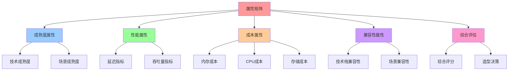
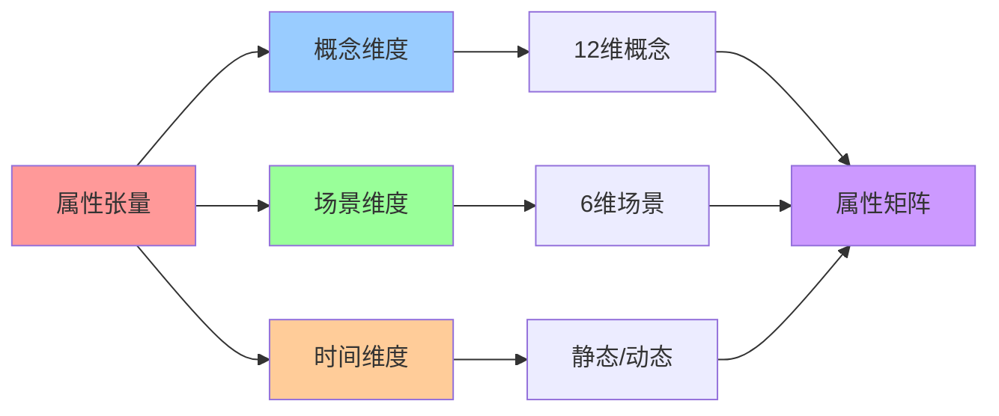
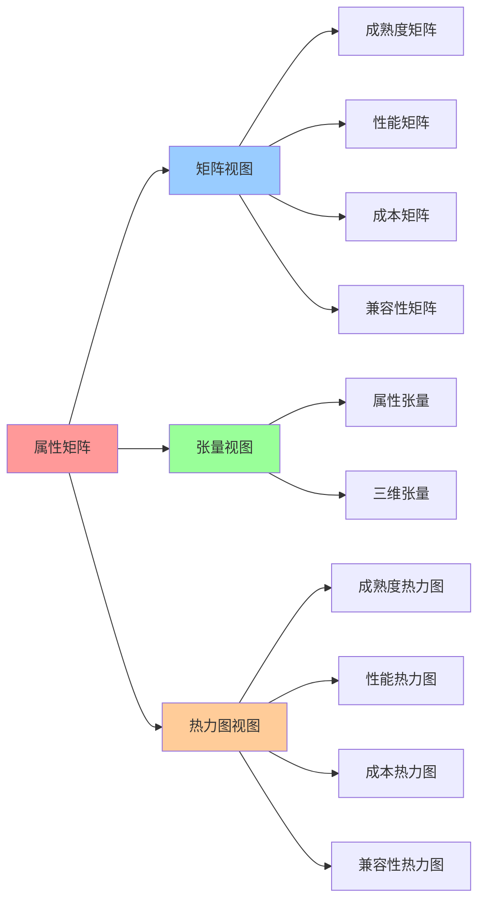

# 属性矩阵：概念属性在不同场景下的表现

## 📑 目录

- [属性矩阵：概念属性在不同场景下的表现](#属性矩阵概念属性在不同场景下的表现)
  - [📑 目录](#-目录)
  - [1 属性矩阵定义](#1-属性矩阵定义)
  - [2 成熟度属性矩阵](#2-成熟度属性矩阵)
    - [成熟度属性分析](#成熟度属性分析)
  - [3 性能属性矩阵](#3-性能属性矩阵)
  - [4 成本属性矩阵](#4-成本属性矩阵)
  - [5 兼容性属性矩阵](#5-兼容性属性矩阵)
  - [6 属性矩阵的综合评估](#6-属性矩阵的综合评估)
  - [7 🧠 认知增强：思维导图、建模视图与图表达转换](#7--认知增强思维导图建模视图与图表达转换)
    - [7.1 属性矩阵完整思维导图](#71-属性矩阵完整思维导图)
    - [7.2 属性矩阵建模视图](#72-属性矩阵建模视图)
      - [属性张量视图](#属性张量视图)
    - [7.3 属性矩阵多维关系矩阵](#73-属性矩阵多维关系矩阵)
      - [属性类型-场景-评估映射矩阵](#属性类型-场景-评估映射矩阵)
    - [7.4 图表达和转换](#74-图表达和转换)
      - [属性矩阵视图转换关系](#属性矩阵视图转换关系)
    - [7.5 形象化解释论证](#75-形象化解释论证)
      - [1. 属性矩阵 = 产品规格表](#1-属性矩阵--产品规格表)
      - [2. 成熟度属性 = 产品生命周期](#2-成熟度属性--产品生命周期)
      - [3. 性能属性 = 汽车性能指标](#3-性能属性--汽车性能指标)
    - [7.6 专家观点与论证](#76-专家观点与论证)
      - [计算信息软件科学家的观点](#计算信息软件科学家的观点)
        - [1. W. Edwards Deming（质量管理专家）](#1-w-edwards-deming质量管理专家)
        - [2. Gene Amdahl（计算机架构专家）](#2-gene-amdahl计算机架构专家)
      - [计算信息软件教育家的观点](#计算信息软件教育家的观点)
        - [1. W. Edwards Deming（质量管理教育家）](#1-w-edwards-deming质量管理教育家)
        - [2. David Patterson（计算机架构教育家）](#2-david-patterson计算机架构教育家)
      - [计算信息软件认知学家的观点](#计算信息软件认知学家的观点)
        - [1. David Marr（计算认知科学家）](#1-david-marr计算认知科学家)
        - [2. Douglas Hofstadter（认知科学家）](#2-douglas-hofstadter认知科学家)
    - [7.7 认知学习路径矩阵](#77-认知学习路径矩阵)
    - [7.8 专家推荐阅读路径](#78-专家推荐阅读路径)

---

## 1 属性矩阵定义

**属性张量定义**：

$$\mathbf{A} \in \mathbb{R}^{12 \times 6 \times 2}$$

其中 $\mathbf{A}[i,j,k]$ 表示概念 $e_i$ 在场景 $s_j$ 下的第 $k$ 个属性值（$k=0$
表示静态属性，$k=1$ 表示动态属性）。

**属性类型**：

1. **成熟度属性**：技术成熟度（0-1）
2. **性能属性**：性能指标（延迟、吞吐量等）
3. **成本属性**：资源成本（内存、CPU、存储等）
4. **兼容性属性**：与技术栈的兼容性（0-1）

**属性矩阵的数学表示**：

$$
\mathbf{A}^{(\text{attr})} = \begin{bmatrix}
a_{1,1} & a_{1,2} & \cdots & a_{1,6} \\
a_{2,1} & a_{2,2} & \cdots & a_{2,6} \\
\vdots & \vdots & \ddots & \vdots \\
a_{12,1} & a_{12,2} & \cdots & a_{12,6}
\end{bmatrix}
$$

其中 $a_{i,j}$ 表示概念 $e_i$ 在场景 $s_j$ 下的属性值。

## 2 成熟度属性矩阵

**成熟度属性矩阵**：

$$\mathbf{A}^{(\text{mat})} \in \mathbb{R}^{12 \times 6}$$

表示概念在不同场景下的技术成熟度（0-1，1=完全成熟，0=不成熟）。

**成熟度属性矩阵（K8s 层示例）**：

| e\s            | Dev (本地) | CI/Test | Prod (生产) | Edge/IoT | Serverless/AI | MultiTenant |
| -------------- | ---------- | ------- | ----------- | -------- | ------------- | ----------- |
| **I 镜像**     | 0.9        | 1.0     | 1.0         | 0.8      | 0.9           | 1.0         |
| **C 容器**     | 0.9        | 1.0     | 1.0         | 0.8      | 0.9           | 1.0         |
| **Q 配额**     | 0.2        | 0.8     | 1.0         | 0.7      | 0.8           | 1.0         |
| **R 运行时**   | 0.3        | 0.7     | 0.9         | 0.9      | 1.0           | 0.9         |
| **M 监控**     | 0.8        | 1.0     | 1.0         | 0.9      | 0.9           | 1.0         |
| **V 版本升级** | 0.4        | 0.9     | 1.0         | 0.8      | 0.9           | 1.0         |
| **L 负载均衡** | 0.2        | 0.8     | 1.0         | 0.7      | 0.9           | 1.0         |
| **S 扩缩容**   | 0.1        | 0.8     | 1.0         | 0.8      | 1.0           | 1.0         |
| **B 灾备**     | 0.0        | 0.6     | 1.0         | 0.7      | 0.8           | 1.0         |
| **P 策略**     | 0.3        | 0.8     | 1.0         | 0.8      | 0.9           | 1.0         |
| **T 租户**     | 0.0        | 0.5     | 1.0         | 0.6      | 0.7           | 1.0         |
| **Θ AI 参数**  | 0.1        | 0.6     | 0.9         | 0.7      | 1.0           | 0.9         |

### 成熟度属性分析

**高成熟度场景**（≥0.9）：

- **生产环境（Prod）**：所有概念成熟度都很高（≥0.9），这是生产环境的要求
- **多租户平台（MultiTenant）**：大部分概念成熟度高，支持企业级多租户需求
- **CI/测试环境**：镜像、容器、监控等核心概念成熟度高

**中等成熟度场景**（0.5-0.9）：

- **边缘/IoT**：运行时、监控等成熟度较高，但配额、策略等略低
- **Serverless/AI**：运行时、扩缩容、AI 参数等成熟度高，其他中等

**低成熟度场景**（<0.5）：

- **本地开发（Dev）**：配额、租户、AI 参数等成熟度低，因为这些场景不需要这些概念
- **边缘/IoT**：租户成熟度低，因为边缘场景通常不需要多租户

## 3 性能属性矩阵

**性能属性矩阵**：

$$\mathbf{A}^{(\text{perf})} \in \mathbb{R}^{12 \times 6}$$

表示概念在不同场景下的性能指标。

**性能属性矩阵（延迟指标，单位：ms）**：

| e\s            | Dev | CI/Test | Prod | Edge/IoT | Serverless/AI | MultiTenant |
| -------------- | --- | ------- | ---- | -------- | ------------- | ----------- |
| **I 镜像**     | 500 | 1000    | 2000 | 3000     | 500           | 2000        |
| **C 容器**     | 100 | 200     | 500  | 1000     | 50            | 500         |
| **Q 配额**     | 1   | 10      | 50   | 100      | 10            | 50          |
| **R 运行时**   | 50  | 100     | 200  | 6        | 6             | 200         |
| **M 监控**     | 10  | 50      | 100  | 200      | 50            | 100         |
| **V 版本升级** | 100 | 500     | 1000 | 2000     | 500           | 1000        |
| **L 负载均衡** | 5   | 10      | 20   | 50       | 10            | 20          |
| **S 扩缩容**   | 100 | 500     | 1000 | 5000     | 1             | 1000        |
| **B 灾备**     | N/A | 10000   | 1000 | 50000    | 1000          | 1000        |
| **P 策略**     | 1   | 5       | 10   | 20       | 0.07          | 10          |
| **T 租户**     | N/A | N/A     | 100  | N/A      | N/A           | 100         |
| **Θ AI 参数**  | N/A | 1000    | 100  | 500      | 10            | 100         |

**性能属性分析**：

**低延迟场景**（<10ms）：

- **策略（P）**：在 Serverless/AI 场景下，OPA-Wasm 延迟仅 0.07ms
- **负载均衡（L）**：在本地开发场景下延迟很低；Service Mesh 增强后延迟增加
  0.3-1ms（Ambient 模式 0.3ms）
- **配额（Q）**：配额检查延迟很低

**中等延迟场景**（10-100ms）：

- **监控（M）**：监控数据采集延迟中等
- **容器（C）**：容器启动延迟中等

**高延迟场景**（>100ms）：

- **镜像（I）**：镜像拉取延迟较高
- **版本升级（V）**：版本升级需要较长时间
- **灾备（B）**：灾备恢复延迟很高

**特殊场景**：

- **边缘/IoT**：运行时（R）延迟极低（6ms），因为 WasmEdge 冷启动快
- **Serverless/AI**：扩缩容（S）延迟极低（1ms），因为按需启动

## 4 成本属性矩阵

**成本属性矩阵**：

$$\mathbf{A}^{(\text{cost})} \in \mathbb{R}^{12 \times 6}$$

表示概念在不同场景下的资源成本（内存占用，单位：MB）。

**成本属性矩阵（内存占用）**：

| e\s            | Dev | CI/Test | Prod | Edge/IoT | Serverless/AI | MultiTenant |
| -------------- | --- | ------- | ---- | -------- | ------------- | ----------- |
| **I 镜像**     | 100 | 500     | 2000 | 500      | 100           | 2000        |
| **C 容器**     | 50  | 200     | 1000 | 200      | 2             | 1000        |
| **Q 配额**     | 1   | 5       | 10   | 5        | 1             | 10          |
| **R 运行时**   | 20  | 50      | 100  | 50       | 20            | 100         |
| **M 监控**     | 50  | 200     | 500  | 100      | 50            | 500         |
| **V 版本升级** | 10  | 50      | 100  | 50       | 10            | 100         |
| **L 负载均衡** | 20  | 100     | 200  | 50       | 20            | 200         |
| **S 扩缩容**   | 10  | 50      | 100  | 50       | 10            | 100         |
| **B 灾备**     | 0   | 100     | 500  | 200      | 0             | 500         |
| **P 策略**     | 5   | 20      | 50   | 20       | 2             | 50          |
| **T 租户**     | 0   | 0       | 100  | 0        | 0             | 100         |
| **Θ AI 参数**  | 0   | 50      | 100  | 50       | 100           | 100         |

**成本属性分析**：

**低成本场景**（<50MB）：

- **配额（Q）**：配额检查资源消耗很低
- **策略（P）**：在 Serverless/AI 场景下，OPA-Wasm 仅占用 2MB
- **版本升级（V）**：版本升级控制组件资源消耗低

**中等成本场景**（50-200MB）：

- **监控（M）**：监控组件资源消耗中等
- **负载均衡（L）**：负载均衡组件资源消耗中等；Service Mesh 增强后资源占用增加
  20-50MB/服务（Ambient 模式 20MB/服务）

**高成本场景**（>200MB）：

- **镜像（I）**：镜像存储资源消耗高
- **容器（C）**：容器运行时资源消耗高
- **监控（M）**：在生产环境下监控资源消耗高

**特殊场景**：

- **Serverless/AI**：容器（C）资源消耗极低（2MB），因为 WasmEdge 内存占用小
- **边缘/IoT**：镜像（I）资源消耗较低，因为边缘节点通常不需要大量镜像

## 5 兼容性属性矩阵

**兼容性属性矩阵**：

$$\mathbf{A}^{(\text{comp})} \in \mathbb{R}^{12 \times 6}$$

表示概念在不同场景下与技术栈的兼容性（0-1，1=完全兼容，0=不兼容）。

**兼容性属性矩阵**：

| e\s                  | Dev | CI/Test | Prod | Edge/IoT | Serverless/AI | MultiTenant |
| -------------------- | --- | ------- | ---- | -------- | ------------- | ----------- |
| **I 镜像**           | 1.0 | 1.0     | 1.0  | 0.9      | 1.0           | 1.0         |
| **C 容器**           | 1.0 | 1.0     | 1.0  | 0.9      | 1.0           | 1.0         |
| **Q 配额**           | 0.8 | 0.9     | 1.0  | 0.8      | 0.9           | 1.0         |
| **R 运行时**         | 0.9 | 0.9     | 1.0  | 1.0      | 1.0           | 1.0         |
| **M 监控**           | 1.0 | 1.0     | 1.0  | 0.9      | 1.0           | 1.0         |
| **V 版本升级**       | 0.9 | 1.0     | 1.0  | 0.8      | 1.0           | 1.0         |
| **L 负载均衡**       | 0.7 | 0.9     | 1.0  | 0.8      | 1.0           | 1.0         |
| **L + Service Mesh** | 0.8 | 0.95    | 1.0  | 0.85     | 1.0           | 1.0         |
| **S 扩缩容**         | 0.6 | 0.9     | 1.0  | 0.9      | 1.0           | 1.0         |
| **B 灾备**           | 0.0 | 0.7     | 1.0  | 0.8      | 0.9           | 1.0         |
| **P 策略**           | 0.8 | 0.9     | 1.0  | 0.9      | 1.0           | 1.0         |
| **T 租户**           | 0.0 | 0.5     | 1.0  | 0.5      | 0.7           | 1.0         |
| **Θ AI 参数**        | 0.5 | 0.8     | 0.9  | 0.8      | 1.0           | 0.9         |

**兼容性属性分析**：

**高兼容性场景**（≥0.9）：

- **生产环境（Prod）**：所有概念兼容性都很高，因为生产环境需要完整的技术栈
- **多租户平台（MultiTenant）**：大部分概念兼容性高
- **CI/测试环境**：核心概念兼容性高

**中等兼容性场景**（0.5-0.9）：

- **本地开发（Dev）**：配额、策略等兼容性中等，因为本地开发不需要这些概念
- **边缘/IoT**：租户兼容性中等，因为边缘场景通常不需要多租户

**低兼容性场景**（<0.5）：

- **本地开发（Dev）**：灾备、租户兼容性低，因为本地开发不需要这些概念
- **边缘/IoT**：租户兼容性低

## 6 属性矩阵的综合评估

**综合属性评估**：

$$\text{Score}(e_i, s_j) = w_1 \cdot A^{(\text{mat})}_{i,j} + w_2 \cdot \frac{1}{A^{(\text{perf})}_{i,j}} + w_3 \cdot \frac{1}{A^{(\text{cost})}_{i,j}} + w_4 \cdot A^{(\text{comp})}_{i,j}$$

其中 $w_1, w_2, w_3, w_4$ 是权重系数，满足 $w_1 + w_2 + w_3 + w_4 = 1$。

**属性矩阵的应用**：

1. **技术选型决策**：根据场景选择合适的概念和技术
2. **性能优化**：识别性能瓶颈，优化关键路径
3. **成本优化**：识别高成本概念，优化资源使用
4. **兼容性评估**：评估技术栈的兼容性，避免兼容性问题

---

## 7 🧠 认知增强：思维导图、建模视图与图表达转换

### 7.1 属性矩阵完整思维导图

### 7.2 属性矩阵建模视图

#### 属性张量视图

### 7.3 属性矩阵多维关系矩阵

#### 属性类型-场景-评估映射矩阵

| 属性类型 | 成熟度 | 性能 | 成本 | 兼容性 | 评估方法 | 应用场景 | 认知价值 |
|---------|--------|------|------|--------|---------|---------|---------|
| **成熟度** | ✅ 核心 | ❌ 无 | ❌ 无 | ❌ 无 | 0-1评分 | 技术选型 | 成熟度理解 |
| **性能** | ❌ 无 | ✅ 核心 | ❌ 无 | ❌ 无 | 延迟/吞吐量 | 性能优化 | 性能理解 |
| **成本** | ❌ 无 | ❌ 无 | ✅ 核心 | ❌ 无 | 资源成本 | 成本优化 | 成本理解 |
| **兼容性** | ❌ 无 | ❌ 无 | ❌ 无 | ✅ 核心 | 0-1评分 | 兼容性评估 | 兼容性理解 |
| **综合评估** | ⚠️ 部分 | ⚠️ 部分 | ⚠️ 部分 | ⚠️ 部分 | 加权评分 | 综合决策 | 综合理解 |

### 7.4 图表达和转换

#### 属性矩阵视图转换关系

### 7.5 形象化解释论证

#### 1. 属性矩阵 = 产品规格表

> **类比**：属性矩阵就像产品规格表，概念是"产品"（Image、Container等），属性是"规格"（成熟度、性能、成本、兼容性），场景是"使用环境"（Dev、Prod、Edge等），就像产品规格表通过产品、规格、环境组织产品信息一样，属性矩阵通过概念、属性、场景组织技术属性。

**认知价值**：

- **规格理解**：通过产品规格表类比，理解属性矩阵的规格性
- **环境理解**：通过使用环境类比，理解场景的环境性
- **选型理解**：通过产品选型类比，理解技术选型

#### 2. 成熟度属性 = 产品生命周期

> **类比**：成熟度属性就像产品生命周期，成熟度是"产品阶段"（开发、测试、生产），场景是"市场环境"（Dev、CI/Test、Prod），就像产品生命周期通过阶段、环境组织产品发展一样，成熟度属性通过成熟度、场景组织技术发展。

**认知价值**：

- **生命周期理解**：通过产品生命周期类比，理解成熟度的生命周期性
- **阶段理解**：通过产品阶段类比，理解成熟度的阶段性
- **发展理解**：通过产品发展类比，理解技术发展

#### 3. 性能属性 = 汽车性能指标

> **类比**：性能属性就像汽车性能指标，概念是"汽车型号"（Image、Container等），性能是"指标"（延迟、吞吐量），场景是"路况"（Dev、Prod、Edge等），就像汽车性能指标通过型号、指标、路况组织性能信息一样，性能属性通过概念、性能、场景组织技术性能。

**认知价值**：

- **指标理解**：通过汽车性能指标类比，理解性能属性的指标性
- **路况理解**：通过路况类比，理解场景的路况性
- **性能理解**：通过汽车性能类比，理解技术性能

### 7.6 专家观点与论证

#### 计算信息软件科学家的观点

##### 1. W. Edwards Deming（质量管理专家）

> "You can't manage what you can't measure. Attribute matrices provide a systematic way to measure and compare technologies."

**在属性矩阵中的应用**：

- **测量理解**：属性矩阵提供系统化的测量方式
- **比较理解**：通过属性矩阵比较技术
- **管理理解**：通过属性矩阵管理技术选型

##### 2. Gene Amdahl（计算机架构专家）

> "Understanding performance attributes is essential for system design. Attribute matrices help us make informed decisions."

**在属性矩阵中的应用**：

- **性能理解**：理解性能属性对系统设计至关重要
- **决策理解**：属性矩阵帮助做出明智决策
- **设计理解**：通过属性矩阵理解系统设计

#### 计算信息软件教育家的观点

##### 1. W. Edwards Deming（质量管理教育家）

> "Teaching through attribute matrices helps students understand that technology selection is not arbitrary—it's based on measurable criteria."

**教育价值**：

- **标准理解**：通过属性矩阵理解技术选型的标准
- **测量理解**：通过属性矩阵学习测量方法
- **决策理解**：通过属性矩阵学习决策方法

##### 2. David Patterson（计算机架构教育家）

> "Attribute matrices provide a structured way to compare technologies. This helps students make informed choices."

**教育价值**：

- **结构化比较**：属性矩阵提供结构化的比较方式
- **选择理解**：通过属性矩阵做出明智选择
- **思维训练**：属性矩阵训练系统性思维

#### 计算信息软件认知学家的观点

##### 1. David Marr（计算认知科学家）

> "Understanding attributes requires understanding them at multiple levels: individual attributes, attribute relationships, and attribute evaluation."

**认知价值**：

- **多层次理解**：理解属性需要多层次理解
- **关系理解**：理解属性之间的关系
- **评估理解**：理解属性的评估方法

##### 2. Douglas Hofstadter（认知科学家）

> "Attribute matrices are cognitive tools that help us organize and compare complex information. They provide a structured way to think about technology attributes."

**认知价值**：

- **认知工具**：属性矩阵是组织信息的认知工具
- **比较理解**：通过属性矩阵比较复杂信息
- **结构理解**：属性矩阵提供结构化的思维方式

### 7.7 认知学习路径矩阵

| 学习阶段 | 核心内容 | 形象化理解 | 数学理解 | 实践应用 | 认知目标 |
|---------|---------|-----------|---------|---------|---------|
| **入门** | 属性定义 | 产品规格表类比 | 属性矩阵 | 属性识别 | 建立基础 |
| **进阶** | 成熟度属性 | 产品生命周期类比 | 成熟度矩阵 | 技术选型 | 理解成熟度 |
| **高级** | 性能属性 | 汽车性能指标类比 | 性能矩阵 | 性能优化 | 掌握性能 |
| **专家** | 综合评估 | 综合评分系统类比 | 加权评分 | 综合决策 | 掌握评估 |

### 7.8 专家推荐阅读路径

**计算信息软件科学家推荐路径**：

1. **属性定义**：理解属性矩阵和属性张量的定义
2. **成熟度属性**：掌握成熟度属性的评估方法
3. **性能属性**：理解性能属性的测量和优化
4. **综合评估**：学习属性矩阵的综合评估方法

**计算信息软件教育家推荐路径**：

1. **形象化理解**：通过产品规格表、产品生命周期、汽车性能指标等类比，建立直观理解
2. **渐进学习**：从简单属性开始，逐步学习复杂综合评估
3. **实践结合**：结合实际项目，理解属性矩阵的应用
4. **思维训练**：通过属性矩阵学习，训练系统性思维能力

**计算信息软件认知学家推荐路径**：

1. **认知模式**：识别属性矩阵中的认知模式
2. **结构理解**：理解属性矩阵揭示的技术结构
3. **跨域应用**：将属性矩阵思维应用到其他领域
4. **认知提升**：通过属性矩阵学习，提升认知能力

---

**参考**：

- [属性矩阵 - 返回目录](../README.md)
- [核心概念矩阵](01-core-concepts.md)
- [场景变换矩阵：场景间的迁移和转换](04-scene-transformation.md)
