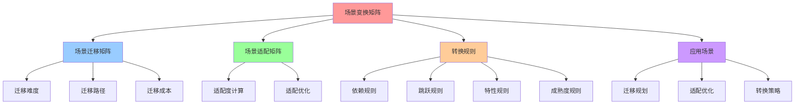
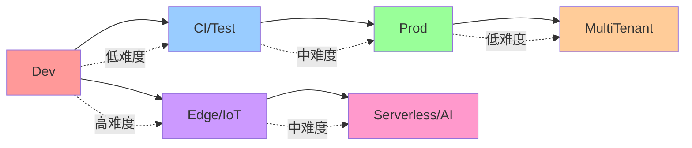
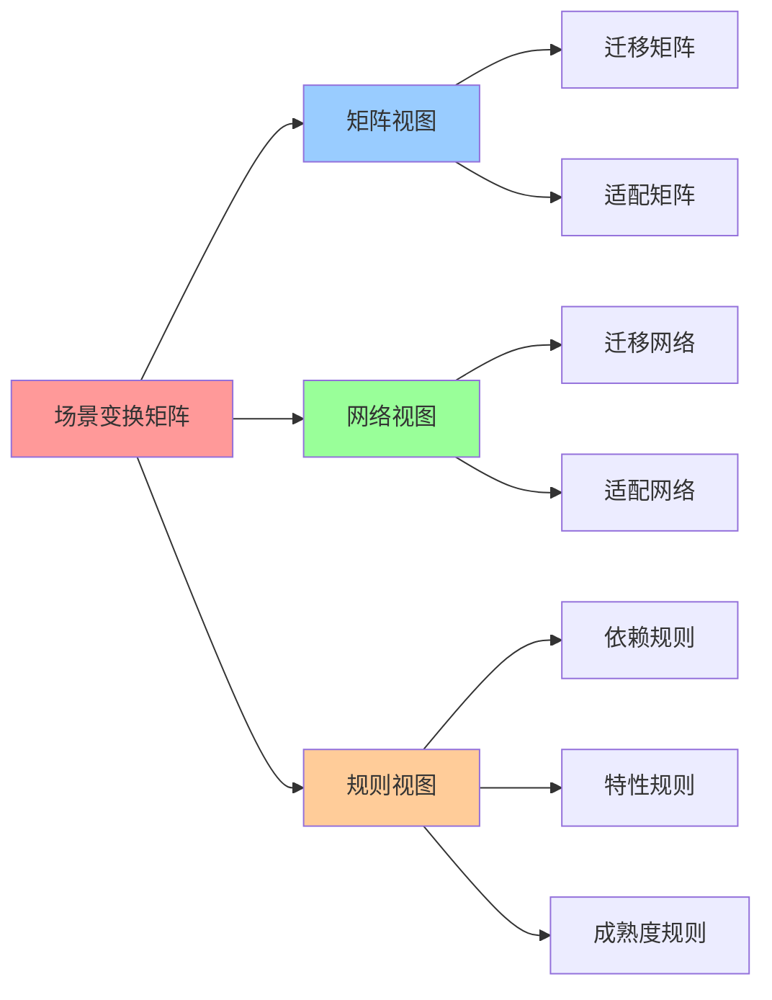

# 场景变换矩阵：场景间的迁移和转换

## 📑 目录

- [场景变换矩阵：场景间的迁移和转换](#场景变换矩阵场景间的迁移和转换)
  - [📑 目录](#-目录)
  - [1 场景变换矩阵定义](#1-场景变换矩阵定义)
  - [2 场景迁移矩阵](#2-场景迁移矩阵)
    - [场景迁移分析](#场景迁移分析)
  - [3 场景适配矩阵](#3-场景适配矩阵)
    - [典型场景适配示例](#典型场景适配示例)
  - [4 场景转换规则](#4-场景转换规则)
    - [规则 1：场景依赖规则](#规则-1场景依赖规则)
    - [规则 2：场景跳跃规则](#规则-2场景跳跃规则)
    - [规则 3：场景特性规则](#规则-3场景特性规则)
    - [规则 4：概念成熟度规则](#规则-4概念成熟度规则)
  - [5 场景变换的应用](#5-场景变换的应用)
    - [1 场景迁移规划](#1-场景迁移规划)
    - [2 场景适配优化](#2-场景适配优化)
    - [3 场景转换策略](#3-场景转换策略)
  - [6 🧠 认知增强：思维导图、建模视图与图表达转换](#6--认知增强思维导图建模视图与图表达转换)
    - [6.1 场景变换矩阵完整思维导图](#61-场景变换矩阵完整思维导图)
    - [6.2 场景变换矩阵建模视图](#62-场景变换矩阵建模视图)
      - [场景迁移网络视图](#场景迁移网络视图)
    - [6.3 场景变换矩阵多维关系矩阵](#63-场景变换矩阵多维关系矩阵)
      - [场景-迁移-规则映射矩阵](#场景-迁移-规则映射矩阵)
    - [6.4 图表达和转换](#64-图表达和转换)
      - [场景变换视图转换关系](#场景变换视图转换关系)
    - [6.5 形象化解释论证](#65-形象化解释论证)
      - [1. 场景迁移 = 城市迁移](#1-场景迁移--城市迁移)
      - [2. 场景适配 = 环境适应](#2-场景适配--环境适应)
      - [3. 转换规则 = 交通规则](#3-转换规则--交通规则)
    - [6.6 专家观点与论证](#66-专家观点与论证)
      - [计算信息软件科学家的观点](#计算信息软件科学家的观点)
        - [1. Frederick Brooks（软件工程专家）](#1-frederick-brooks软件工程专家)
        - [2. Martin Fowler（软件架构专家）](#2-martin-fowler软件架构专家)
      - [计算信息软件教育家的观点](#计算信息软件教育家的观点)
        - [1. Martin Fowler（软件架构教育家）](#1-martin-fowler软件架构教育家)
        - [2. Gene Kim（DevOps教育家）](#2-gene-kimdevops教育家)
      - [计算信息软件认知学家的观点](#计算信息软件认知学家的观点)
        - [1. David Marr（计算认知科学家）](#1-david-marr计算认知科学家)
        - [2. Douglas Hofstadter（认知科学家）](#2-douglas-hofstadter认知科学家)
    - [6.7 认知学习路径矩阵](#67-认知学习路径矩阵)
    - [6.8 专家推荐阅读路径](#68-专家推荐阅读路径)
  - [2025 年最新实践](#2025-年最新实践)
    - [场景变换矩阵应用最佳实践（2025）](#场景变换矩阵应用最佳实践2025)
  - [实际应用案例](#实际应用案例)
    - [案例 1：场景迁移路径规划（2025）](#案例-1场景迁移路径规划2025)

---

## 1 场景变换矩阵定义

**场景变换矩阵定义**：

$$\mathbf{T}_{\text{scene}} \in \mathbb{R}^{6 \times 6}$$

其中 $\mathbf{T}_{\text{scene}}[i,j]$ 表示从场景 $s_i$ 转换到场景 $s_j$ 的转换难
度或适配度（0-1，0=无缝，1=困难）。

**场景向量**：

$$\mathbf{S} = [s_1, s_2, s_3, s_4, s_5, s_6] = [\text{Dev}, \text{CI/Test}, \text{Prod}, \text{Edge/IoT}, \text{Serverless/AI}, \text{MultiTenant}]$$

**场景变换的数学表示**：

$$
\mathbf{S}' = \mathbf{T}_{\text{scene}} \cdot \mathbf{S}
$$

其中 $\mathbf{S}'$ 是变换后的场景向量。

## 2 场景迁移矩阵

**场景迁移矩阵**：

$$\mathbf{T}_{\text{migrate}} \in \mathbb{R}^{6 \times 6}$$

表示从场景 $s_i$ 迁移到场景 $s_j$ 的迁移难度（0-1，0=无缝迁移，1=无法迁移）。

**场景迁移矩阵**：

| 从\到             | Dev | CI/Test | Prod | Edge/IoT | Serverless/AI | MultiTenant |
| ----------------- | --- | ------- | ---- | -------- | ------------- | ----------- |
| **Dev**           | 0   | 0.2     | 0.8  | 0.9      | 0.9           | 1.0         |
| **CI/Test**       | 0.2 | 0       | 0.5  | 0.7      | 0.7           | 0.9         |
| **Prod**          | 0.8 | 0.6     | 0    | 0.7      | 0.6           | 0.3         |
| **Edge/IoT**      | 0.9 | 0.8     | 0.7  | 0        | 0.8           | 0.9         |
| **Serverless/AI** | 0.9 | 0.8     | 0.6  | 0.8      | 0             | 0.7         |
| **MultiTenant**   | 1.0 | 0.9     | 0.3  | 0.9      | 0.7           | 0           |

### 场景迁移分析

**低难度迁移**（<0.3）：

- **Dev ↔ CI/Test**（0.2）：本地开发和 CI/测试环境迁移很容易
- **Prod → MultiTenant**（0.3）：生产环境到多租户平台迁移相对容易

**中等难度迁移**（0.3-0.7）：

- **CI/Test → Prod**（0.5）：从测试到生产需要更多的配置和验证
- **Prod → Edge/IoT**（0.7）：生产环境到边缘环境需要适配资源限制
- **Prod → Serverless/AI**（0.6）：生产环境到 Serverless 需要重构应用

**高难度迁移**（>0.7）：

- **Dev → Edge/IoT**（0.9）：本地开发到边缘环境迁移困难
- **Dev → Serverless/AI**（0.9）：本地开发到 Serverless 需要大量重构
- **Dev → MultiTenant**（1.0）：本地开发到多租户几乎不可能直接迁移
- **Edge/IoT → MultiTenant**（0.9）：边缘环境到多租户迁移困难

## 3 场景适配矩阵

**场景适配矩阵**：

$$\mathbf{T}_{\text{adapt}} \in \mathbb{R}^{12 \times 6 \times 6}$$

表示概念 $e_i$ 从场景 $s_j$ 适配到场景 $s_k$ 的适配度（0-1，1=完美适配，0=不兼容
）。

**场景适配矩阵（简化版）**：

$$\mathbf{T}_{\text{adapt}}[i,j,k] = f(\mathbf{A}^{(\text{mat})}[i,j], \mathbf{A}^{(\text{mat})}[i,k], \mathbf{A}^{(\text{comp})}[i,j], \mathbf{A}^{(\text{comp})}[i,k])$$

其中 $f$ 是适配函数，综合考虑成熟度和兼容性。

**场景适配度计算**：

$$\text{Adapt}(e_i, s_j, s_k) = \alpha \cdot \min(A^{(\text{mat})}_{i,j}, A^{(\text{mat})}_{i,k}) + \beta \cdot \min(A^{(\text{comp})}_{i,j}, A^{(\text{comp})}_{i,k})$$

其中 $\alpha + \beta = 1$，通常 $\alpha = 0.6, \beta = 0.4$。

### 典型场景适配示例

**镜像（I）的场景适配**：

| 概念 | 从场景  | 到场景   | 适配度 | 说明                          |
| ---- | ------- | -------- | ------ | ----------------------------- |
| I    | Dev     | Prod     | 0.9    | 镜像可以直接部署到生产环境    |
| I    | CI/Test | Prod     | 0.95   | CI/测试镜像通常可以部署到生产 |
| I    | Prod    | Edge/IoT | 0.8    | 生产镜像需要适配边缘资源限制  |

**容器（C）的场景适配**：

| 概念 | 从场景 | 到场景        | 适配度 | 说明                       |
| ---- | ------ | ------------- | ------ | -------------------------- |
| C    | Dev    | Prod          | 0.9    | 容器可以直接迁移到生产环境 |
| C    | Prod   | Serverless/AI | 0.7    | 需要适配 Serverless 运行时 |
| C    | Prod   | Edge/IoT      | 0.8    | 需要适配边缘资源限制       |

**运行时（R）的场景适配**：

| 概念 | 从场景   | 到场景        | 适配度 | 说明                            |
| ---- | -------- | ------------- | ------ | ------------------------------- |
| R    | Prod     | Edge/IoT      | 0.95   | WasmEdge 在边缘环境适配度高     |
| R    | Prod     | Serverless/AI | 1.0    | WasmEdge 在 Serverless 适配完美 |
| R    | Edge/IoT | Serverless/AI | 0.95   | 两者都使用 WasmEdge，适配度高   |

**负载均衡（L）的场景适配**：

| 概念             | 从场景 | 到场景      | 适配度 | 说明                                  |
| ---------------- | ------ | ----------- | ------ | ------------------------------------- |
| L                | Prod   | Prod        | 1.0    | Service Mesh 在生产环境适配完美       |
| L                | Dev    | Prod        | 0.8    | Service Mesh 提供统一的流量管理       |
| L                | Prod   | MultiTenant | 0.95   | Service Mesh 支持多租户流量隔离       |
| L + Service Mesh | Prod   | Prod        | 1.0    | Service Mesh 增强后负载均衡成熟度提升 |

## 4 场景转换规则

### 规则 1：场景依赖规则

**规则描述**：

如果场景 $s_j$ 依赖于场景 $s_i$，那么从 $s_i$ 到 $s_j$ 的迁移难度通常较低。

**依赖关系**：

```text
Dev → CI/Test → Prod
Edge/IoT → Serverless/AI
Prod → MultiTenant
```

**示例**：

- **Dev → CI/Test**（0.2）：本地开发到 CI/测试，难度低
- **CI/Test → Prod**（0.5）：CI/测试到生产，难度中等
- **Prod → MultiTenant**（0.3）：生产到多租户，难度相对较低

### 规则 2：场景跳跃规则

**规则描述**：

跳过中间场景的迁移通常难度更高。

**示例**：

- **Dev → Prod**（0.8）：跳过 CI/测试，难度较高
- **Dev → MultiTenant**（1.0）：跳过多个场景，几乎不可能

### 规则 3：场景特性规则

**规则描述**：

特性相似场景之间的迁移难度较低，特性差异大的场景迁移难度高。

**场景特性对比**：

| 场景          | 资源需求 | 网络条件 | 稳定性要求 | 可观测性要求 |
| ------------- | -------- | -------- | ---------- | ------------ |
| Dev           | 低       | 稳定     | 低         | 低           |
| CI/Test       | 中       | 稳定     | 中         | 中           |
| Prod          | 高       | 稳定     | 高         | 高           |
| Edge/IoT      | 低       | 不稳定   | 中         | 中           |
| Serverless/AI | 动态     | 稳定     | 中         | 中           |
| MultiTenant   | 高       | 稳定     | 高         | 高           |

**迁移难度评估**：

- **相似特性场景**：迁移难度低

  - Dev ↔ CI/Test：资源需求和网络条件相似
  - Prod ↔ MultiTenant：资源需求和稳定性要求相似

- **差异特性场景**：迁移难度高
  - Dev ↔ Edge/IoT：资源需求相似但网络条件差异大
  - Prod ↔ Serverless/AI：资源需求和稳定性要求差异大

### 规则 4：概念成熟度规则

**规则描述**：

概念的成熟度影响场景迁移的难度。

**成熟度影响**：

如果概念在源场景和目标场景的成熟度都很高，那么迁移难度较低。

**示例**：

- **镜像（I）**：在 Dev、CI/Test、Prod 场景下成熟度都很高（≥0.9），所以迁移难度
  低
- **租户（T）**：在 Dev 场景下成熟度低（0.0），在 MultiTenant 场景下成熟度高
  （1.0），所以迁移难度高

## 5 场景变换的应用

### 1 场景迁移规划

**应用场景**：

- **开发流程规划**：规划从开发到生产的迁移流程
- **环境升级规划**：规划从测试环境到生产环境的升级
- **多场景部署规划**：规划应用在不同场景下的部署

**示例**：

```python
# 计算场景迁移路径
path = shortest_path(T_migrate, source_scene, target_scene)

# 评估迁移成本
cost = sum(T_migrate[i, j] for i, j in path)

# 制定迁移计划
migration_plan = plan_migration(path, concepts)
```

### 2 场景适配优化

**应用场景**：

- **技术栈选型**：选择适配目标场景的技术栈
- **配置优化**：优化配置以适配不同场景
- **性能调优**：调优性能以适配不同场景

**示例**：

```python
# 计算场景适配度
adaptation_score = calculate_adaptation(concept, source_scene, target_scene)

# 优化适配方案
optimized_adaptation = optimize_adaptation(adaptation_score, constraints)
```

### 3 场景转换策略

**应用场景**：

- **渐进式迁移**：采用渐进式策略，逐步迁移场景
- **灰度发布**：在场景转换过程中进行灰度发布
- **回滚策略**：制定回滚策略以应对场景转换失败

**示例**：

```python
# 制定渐进式迁移策略
progressive_migration = plan_progressive_migration(source_scene, target_scene, steps)

# 评估灰度发布方案
canary_plan = plan_canary_deployment(progressive_migration)

# 制定回滚策略
rollback_plan = plan_rollback(canary_plan)
```

---

## 6 🧠 认知增强：思维导图、建模视图与图表达转换

### 6.1 场景变换矩阵完整思维导图



### 6.2 场景变换矩阵建模视图

#### 场景迁移网络视图



### 6.3 场景变换矩阵多维关系矩阵

#### 场景-迁移-规则映射矩阵

| 场景对 | Dev→CI/Test | CI/Test→Prod | Prod→MultiTenant | Dev→Prod | 迁移规则 | 认知价值 |
|--------|-------------|--------------|-------------------|----------|---------|---------|
| **迁移难度** | 0.2 低 | 0.5 中 | 0.3 低 | 0.8 高 | 依赖规则 | 迁移理解 |
| **场景特性** | 相似 | 相似 | 相似 | 差异大 | 特性规则 | 特性理解 |
| **成熟度** | 高 | 高 | 高 | 中 | 成熟度规则 | 成熟度理解 |
| **推荐路径** | ✅ 直接 | ✅ 直接 | ✅ 直接 | ⚠️ 渐进 | 跳跃规则 | 路径理解 |

### 6.4 图表达和转换

#### 场景变换视图转换关系



### 6.5 形象化解释论证

#### 1. 场景迁移 = 城市迁移

> **类比**：场景迁移就像城市迁移，场景是"城市"（Dev、Prod、Edge等），迁移难度是"距离"（0.2=近，0.8=远），迁移路径是"路线"（直接路径、渐进路径），就像城市迁移通过城市、距离、路线组织迁移一样，场景迁移通过场景、难度、路径组织技术迁移。

**认知价值**：

- **迁移理解**：通过城市迁移类比，理解场景迁移的迁移性
- **距离理解**：通过距离类比，理解迁移难度的距离性
- **路径理解**：通过路线类比，理解迁移路径的路径性

#### 2. 场景适配 = 环境适应

> **类比**：场景适配就像环境适应，概念是"生物"（Image、Container等），场景是"环境"（Dev、Prod、Edge等），适配度是"适应能力"（0.9=适应良好，0.3=适应困难），就像环境适应通过生物、环境、适应能力组织适应一样，场景适配通过概念、场景、适配度组织技术适配。

**认知价值**：

- **适应理解**：通过环境适应类比，理解场景适配的适应性
- **环境理解**：通过环境类比，理解场景的环境性
- **能力理解**：通过适应能力类比，理解适配度的能力性

#### 3. 转换规则 = 交通规则

> **类比**：转换规则就像交通规则，依赖规则是"道路连接"（相邻场景连接），跳跃规则是"禁止跳跃"（禁止跳过中间场景），特性规则是"路况匹配"（相似特性场景匹配），成熟度规则是"通行条件"（成熟度要求），就像交通规则通过连接、跳跃、匹配、条件组织交通一样，转换规则通过依赖、跳跃、特性、成熟度组织技术转换。

**认知价值**：

- **规则理解**：通过交通规则类比，理解转换规则的规则性
- **连接理解**：通过道路连接类比，理解依赖规则的连接性
- **匹配理解**：通过路况匹配类比，理解特性规则的匹配性

### 6.6 专家观点与论证

#### 计算信息软件科学家的观点

##### 1. Frederick Brooks（软件工程专家）

> "The hardest single part of building a software system is deciding precisely what to build. Scene transformation helps us understand the migration path."

**在场景变换中的应用**：

- **迁移理解**：场景变换帮助我们理解迁移路径
- **决策理解**：通过场景变换做出迁移决策
- **路径理解**：理解场景迁移的最优路径

##### 2. Martin Fowler（软件架构专家）

> "Refactoring is a controlled technique for improving the design of an existing code base. Scene transformation is similar—it's a controlled technique for improving the deployment environment."

**在场景变换中的应用**：

- **重构理解**：场景变换类似于代码重构
- **改进理解**：通过场景变换改进部署环境
- **控制理解**：场景变换是受控的改进技术

#### 计算信息软件教育家的观点

##### 1. Martin Fowler（软件架构教育家）

> "Teaching scene transformation helps students understand that deployment is not just about code—it's about adapting to different environments."

**教育价值**：

- **环境理解**：场景变换帮助学生理解环境适配
- **部署理解**：通过场景变换理解部署的本质
- **适应理解**：学习如何适应不同环境

##### 2. Gene Kim（DevOps教育家）

> "Scene transformation is essential for DevOps practices. It helps teams understand how to move code from development to production safely."

**教育价值**：

- **DevOps理解**：场景变换对DevOps实践至关重要
- **安全理解**：学习如何安全地迁移代码
- **实践理解**：通过场景变换学习DevOps实践

#### 计算信息软件认知学家的观点

##### 1. David Marr（计算认知科学家）

> "Understanding scene transformation requires understanding it at multiple levels: local migrations, global patterns, and transformation rules."

**认知价值**：

- **多层次理解**：理解场景变换需要多层次理解
- **局部理解**：理解局部迁移
- **全局理解**：理解全局模式

##### 2. Douglas Hofstadter（认知科学家）

> "Scene transformation matrices are cognitive tools that help us organize and understand complex migration patterns. They provide a structured way to think about environment changes."

**认知价值**：

- **认知工具**：场景变换矩阵是组织信息的认知工具
- **模式理解**：通过场景变换理解迁移模式
- **结构理解**：场景变换提供结构化的思维方式

### 6.7 认知学习路径矩阵

| 学习阶段 | 核心内容 | 形象化理解 | 数学理解 | 实践应用 | 认知目标 |
|---------|---------|-----------|---------|---------|---------|
| **入门** | 场景迁移 | 城市迁移类比 | 迁移矩阵 | 简单迁移 | 建立基础 |
| **进阶** | 场景适配 | 环境适应类比 | 适配矩阵 | 场景适配 | 理解适配 |
| **高级** | 转换规则 | 交通规则类比 | 规则系统 | 复杂迁移 | 掌握规则 |
| **专家** | 转换策略 | 迁移策略类比 | 优化算法 | 系统迁移 | 掌握策略 |

### 6.8 专家推荐阅读路径

**计算信息软件科学家推荐路径**：

1. **场景迁移**：理解场景迁移矩阵的定义和应用
2. **场景适配**：掌握场景适配矩阵的计算和优化
3. **转换规则**：理解场景转换规则的制定和应用
4. **转换策略**：学习场景转换策略的制定和执行

**计算信息软件教育家推荐路径**：

1. **形象化理解**：通过城市迁移、环境适应、交通规则等类比，建立直观理解
2. **渐进学习**：从简单场景迁移开始，逐步学习复杂转换策略
3. **实践结合**：结合实际项目，理解场景变换的应用
4. **思维训练**：通过场景变换学习，训练系统性思维能力

**计算信息软件认知学家推荐路径**：

1. **认知模式**：识别场景变换中的认知模式
2. **结构理解**：理解场景变换揭示的迁移结构
3. **跨域应用**：将场景变换思维应用到其他领域
4. **认知提升**：通过场景变换学习，提升认知能力

---

---

## 2025 年最新实践

### 场景变换矩阵应用最佳实践（2025）

**2025 年趋势**：场景变换矩阵在技术迁移和转换中的深度应用

**实践要点**：

- **场景迁移**：使用场景变换矩阵规划场景迁移路径
- **转换优化**：使用场景变换矩阵优化转换过程
- **风险评估**：使用场景变换矩阵评估转换风险

**代码示例**：

```python
# 2025 年场景变换矩阵工具
class SceneTransformationTool:
    def __init__(self):
        self.trans_matrix = SceneTransformationMatrix()
        self.optimizer = TransformationOptimizer()
        self.risk_assessor = RiskAssessor()

    def plan_migration(self, source_scene, target_scene):
        """规划迁移路径"""
        return self.trans_matrix.find_path(source_scene, target_scene)

    def optimize_transformation(self, transformation):
        """优化转换过程"""
        return self.optimizer.optimize(transformation)

    def assess_risk(self, transformation):
        """评估转换风险"""
        return self.risk_assessor.assess(transformation)
```

## 实际应用案例

### 案例 1：场景迁移路径规划（2025）

**场景**：使用场景变换矩阵规划从开发到生产的迁移路径

**实现方案**：

```python
# 场景迁移路径规划
tool = SceneTransformationTool()

# 规划迁移路径
path = tool.plan_migration('Dev', 'Prod')
print(f"迁移路径: {path}")

# 优化转换过程
optimized = tool.optimize_transformation(path)
print(f"优化路径: {optimized}")

# 评估转换风险
risk = tool.assess_risk(optimized)
print(f"转换风险: {risk}")
```

**效果**：

- 场景迁移：使用场景变换矩阵规划场景迁移路径
- 转换优化：使用场景变换矩阵优化转换过程
- 风险评估：使用场景变换矩阵评估转换风险

---

**参考**：

- [场景变换矩阵 - 返回目录](../README.md)
- [属性矩阵：概念属性在不同场景下的表现](03-attribute-matrix.md)
- [操作变换矩阵：各种操作的矩阵表示](05-operation-transformation.md)
